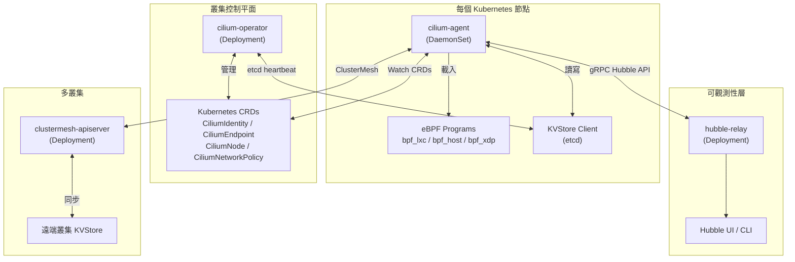
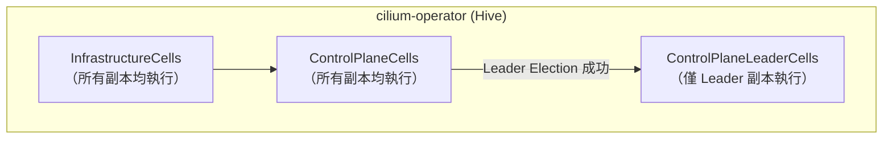
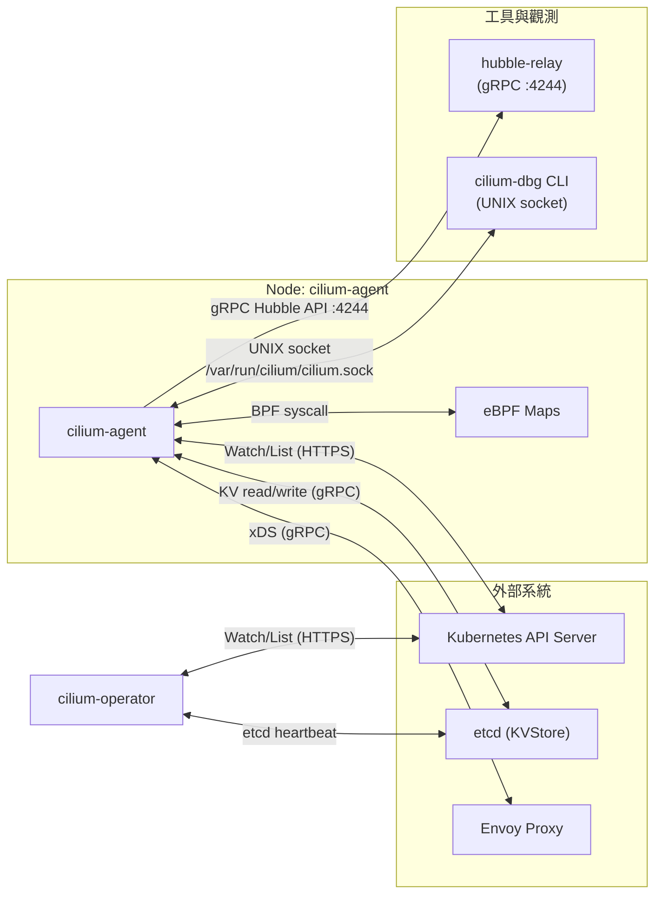
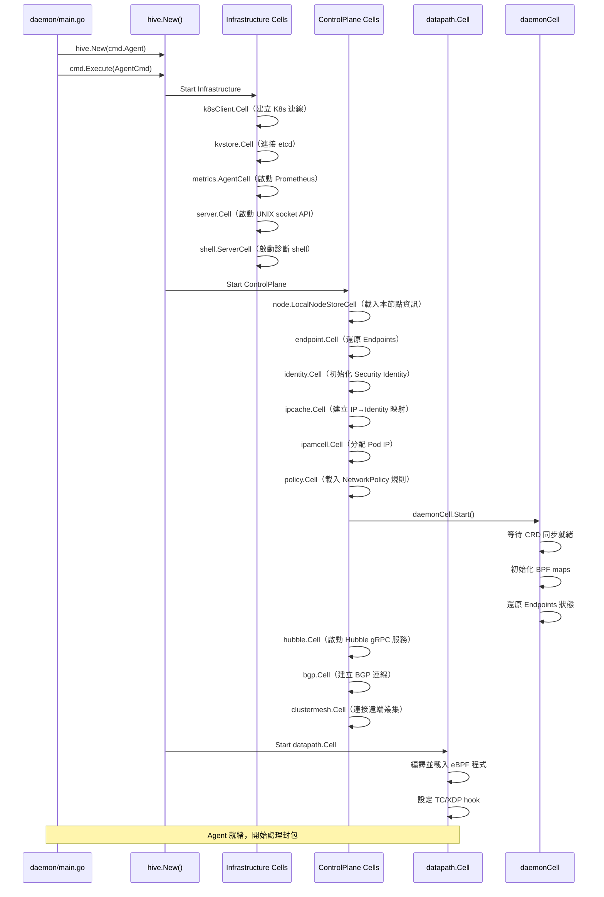

# Cilium — 系統架構總覽

本文從原始碼層面剖析 Cilium 的元件架構，包含 `cilium-agent`、`cilium-operator`、`hubble-relay` 與 `clustermesh-apiserver` 四大核心元件的設計模式與啟動流程。

## 整體架構



## Hive 依賴注入框架

Cilium 使用 [`github.com/cilium/hive`](https://github.com/cilium/hive) 作為依賴注入（DI）框架，取代傳統手動初始化的模式。所有功能模組封裝為 `cell.Cell`，透過 `hive.New()` 組裝。

### Agent 入口點

```go
// 檔案: daemon/main.go
package main

import (
    "github.com/cilium/cilium/daemon/cmd"
    "github.com/cilium/cilium/pkg/hive"
)

func main() {
    hiveFn := func() *hive.Hive {
        return hive.New(cmd.Agent)
    }
    cmd.Execute(cmd.NewAgentCmd(hiveFn))
}
```

### Agent Cell 組成

`cmd.Agent` 由三個頂層 Cell 組成：

```go
// 檔案: daemon/cmd/cells.go
var (
    Agent = cell.Module(
        "agent",
        "Cilium Agent",

        Infrastructure,   // 基礎設施層（外部存取與服務）
        ControlPlane,     // 控制平面層（業務邏輯）
        datapath.Cell,    // eBPF Datapath 層
    )
)
```

### Operator 入口點

```go
// 檔案: operator/main.go
package main

import (
    "github.com/cilium/cilium/operator/cmd"
    "github.com/cilium/cilium/pkg/hive"
)

func main() {
    operatorHive := hive.New(cmd.Operator())

    cmd.Execute(cmd.NewOperatorCmd(operatorHive))
}
```

## Infrastructure Cells 與 ControlPlane Cells

### Infrastructure Cells（基礎設施層）

> **設計原則**：提供對外部系統的存取與服務。這些 Cell 在整合測試中通常需要被 mock，或本身並非業務邏輯所需。

| Cell | 套件路徑 | 功能說明 |
|------|---------|---------|
| `pprof.Cell` | `pkg/pprof` | Go runtime 效能分析 HTTP handler |
| `gops.Cell` | `pkg/gops` | gops agent（診斷 Go 行程）|
| `k8sClient.Cell` | `pkg/k8s/client` | Kubernetes Clientset |
| `hostfirewallbypass.Cell` | `pkg/k8s/hostfirewallbypass` | Host firewall 繞過設定 |
| `dial.ServiceResolverCell` | `pkg/dial` | Kubernetes Service DNS 解析（用於 etcd/ClusterMesh）|
| `kvstore.Cell` | `pkg/kvstore` | KVStore（etcd）客戶端 |
| `cni.Cell` | `daemon/cmd/cni` | CNI 設定管理 |
| `metrics.AgentCell` | `pkg/metrics` | Prometheus metrics 註冊與 HTTP 服務 |
| `metricsmap.Cell` | `pkg/maps/metricsmap` | eBPF metrics map |
| `server.Cell` | `api/v1/server` | Cilium REST API（UNIX socket）|
| `store.Cell` | `pkg/kvstore/store` | KVStore 同步 watchStore/syncStore |
| `k8sSynced.CRDSyncCell` | `pkg/k8s/synced` | CRD 同步就緒 Promise |
| `shell.ServerCell` | `github.com/cilium/hive/shell` | shell.sock 互動式診斷介面 |
| `healthz.Cell` | `daemon/healthz` | Agent 健康探針端點 |

### ControlPlane Cells（控制平面層）

> **設計原則**：純業務邏輯，依賴 Infrastructure 層提供的服務，允許在非特權環境下進行整合測試。

| Cell | 套件路徑 | 功能說明 |
|------|---------|---------|
| `infraendpoints.Cell` | `daemon/infraendpoints` | IP 分配與基礎設施端點（host、health、ingress）|
| `node.LocalNodeStoreCell` | `pkg/node` | 本節點資訊存儲 |
| `nodesync.LocalNodeSyncCell` | `pkg/node/sync` | 本節點資訊同步 |
| `endpoint.Cell` | `pkg/endpoint/cell` | Endpoint 生命週期管理 |
| `nodeManager.Cell` | `pkg/node/manager` | 叢集節點集合管理 |
| `certificatemanager.Cell` | `pkg/crypto/certificatemanager` | TLS 憑證管理 |
| `loadbalancer_cell.Cell` | `pkg/loadbalancer/cell` | Service 負載均衡控制平面 |
| `proxy.Cell` | `pkg/proxy` | L7 proxy port 分配 |
| `envoy.Cell` | `pkg/envoy` | Envoy proxy 控制平面 |
| `ciliumenvoyconfig.Cell` | `pkg/ciliumenvoyconfig` | CiliumEnvoyConfig CRD 支援 |
| `bgp.Cell` | `pkg/bgp` | BGP 控制平面 |
| `auth.Cell` | `pkg/auth` | 請求驗證（mTLS）|
| `identity.Cell` | `pkg/identity/cell` | Security Identity 管理 |
| `ipcache.Cell` | `pkg/ipcache/cell` | IP 到 Identity 映射快取 |
| `ipamcell.Cell` | `pkg/ipam/cell` | IP 地址管理 |
| `egressgateway.Cell` | `pkg/egressgateway` | Egress Gateway |
| `policy.Cell` | `pkg/policy/cell` | PolicyRepository（策略規則集）|
| `clustermesh.Cell` | `pkg/clustermesh` | ClusterMesh 多叢集 |
| `l2announcer.Cell` | `pkg/l2announcer` | L2 Announcement Policy |
| `hubble.Cell` | `pkg/hubble/cell` | Hubble 觀測服務 |
| `fqdn.Cell` | `pkg/fqdn/cell` | FQDN proxy（DNS-based policy）|
| `health.Cell` | `pkg/health` | Cilium 健康連通性 |
| `ztunnel.Cell` | `pkg/ztunnel` | Ambient Mesh zTunnel 整合 |

## Operator 架構

Operator 採用**三層 Cell 結構**，配合 Leader Election 實現高可用：



### InfrastructureCells

所有 Operator 副本均執行，提供基礎存取能力：

| Cell | 功能 |
|------|------|
| `pprof.Cell` | 效能分析 HTTP handler |
| `gops.Cell` | Go 行程診斷 |
| `client.Cell` | Kubernetes 客戶端（含 QPS/Burst 設定：100/200）|
| `dial.ResourceServiceResolverCell` | Service DNS 解析 |
| `kvstore.Cell` | KVStore 客戶端 |
| `operatorMetrics.Cell` | Prometheus metrics |
| `shell.ServerCell` | 互動式診斷 shell |

### ControlPlaneCells

所有副本執行，為 Leader Election 做準備：

| Cell | 功能 |
|------|------|
| `cmtypes` config | ClusterInfo 與 PolicyConfig 初始化 |
| `ipsec.OperatorCell` | IPSec operator 支援 |
| `wgAgent.OperatorCell` | WireGuard operator 支援 |
| `identitygc.SharedConfig` | Identity GC 共用設定 |
| `api.HealthHandlerCell` | `/healthz` 健康端點（回報 Leader 狀態）|
| `api.ServerCell` | Operator REST API 服務 |
| `controller.Cell` | Controller 管理框架 |

### ControlPlaneLeaderCells（Leader Only）

```go
// 檔案: operator/cmd/root.go
// These cells are started only after the operator is elected leader.
ControlPlaneLeaderCells = []cell.Cell{
    // The CRDs registration should be the first operation to be invoked after the operator is elected leader.
    apis.RegisterCRDsCell,
    operatorK8s.ResourcesCell,
    heartbeat.Enabled,
    heartbeat.Cell,
    clustercfgcell.Cell,
    bgp.Cell,
    lbipam.Cell,
    nodeipam.Cell,
    auth.Cell,
    identitygc.Cell,
    ciliumidentity.Cell,
    ciliumendpointslice.Cell,
    endpointgc.Cell,
    gatewayapi.Cell,
    ingress.Cell,
    // ...
}
```

Leader-only Cells 的關鍵功能：

| Cell | 功能 |
|------|------|
| `apis.RegisterCRDsCell` | **第一步**：註冊/更新所有 Cilium CRDs |
| `heartbeat.Cell` | 定期更新 KVStore heartbeat key |
| `identitygc.Cell` | 垃圾回收過期的 CiliumIdentity |
| `ciliumidentity.Cell` | 管理 CiliumIdentity API 物件（基於 Pod/Namespace 事件）|
| `endpointgc.Cell` | 清理洩漏的 CiliumEndpoint 物件 |
| `lbipam.Cell` | LoadBalancer IP 地址管理 |
| `gatewayapi.Cell` | Gateway API CRD 控制器 |
| `ingress.Cell` | Kubernetes Ingress 控制器 |
| `secretsync.Cell` | TLS Secret 跨 Namespace 同步 |
| `cmoperator.Cell` | ClusterMesh Operator |
| `endpointslicesync.Cell` | 跨叢集 EndpointSlice 同步 |

## 元件間通訊方式



| 通訊路徑 | 協定 | 端口 / 路徑 | 說明 |
|---------|------|------------|------|
| cilium-agent ↔ K8s API | HTTPS/Watch | 443 | CRD Watch、Node/Pod 事件 |
| cilium-agent ↔ etcd | gRPC | 2379 | Identity/Service KV 同步 |
| cilium-agent → hubble-relay | gRPC | 4244 | 流量觀測事件串流 |
| cilium-agent ↔ Envoy | gRPC xDS | Unix socket | L7 策略規則推送 |
| cilium-agent ↔ cilium-dbg | REST/Unix | `/var/run/cilium/cilium.sock` | CLI 管理介面 |
| cilium-agent ↔ shell | UNIX socket | `shell.sock` | Hive 互動式診斷 |
| cilium-operator ↔ K8s API | HTTPS/Watch | 443 | CRD 管理、GC 操作 |
| cilium-operator ↔ etcd | gRPC | 2379 | Heartbeat、Lock Sweeper |

## Agent 啟動序列圖



::: info 相關章節
- [Cilium 專案總覽](./index.md) — 功能特性與文件導覽
:::
