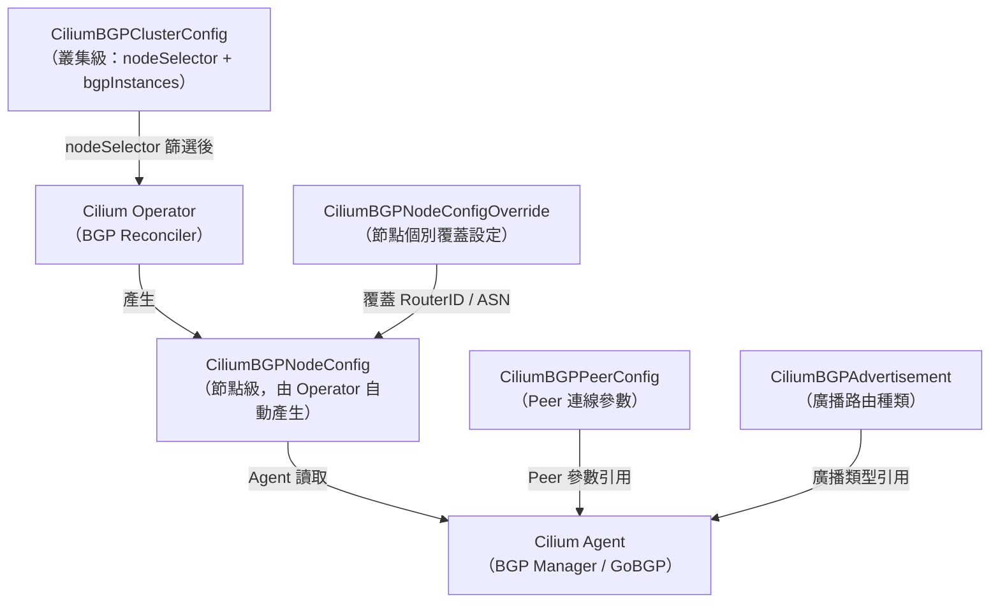
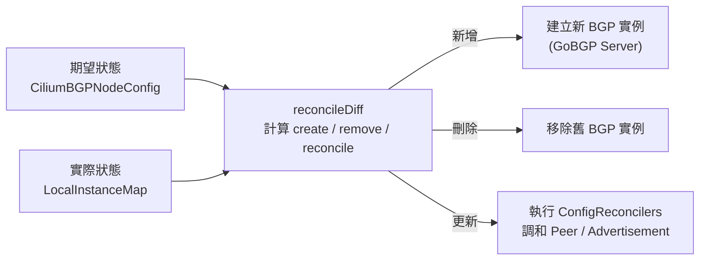

# Cilium — BGP 控制平面

BGP（Border Gateway Protocol）是網際網路路由的核心協定。Cilium 的 **BGP Control Plane** 讓 Kubernetes 叢集可直接參與 BGP 路由協議，將 Pod CIDR、LoadBalancer IP 等路由廣播給上游路由器，取代傳統的 MetalLB 或靜態路由設定。

## BGP 在 Kubernetes 的應用場景

| 場景 | 說明 |
|------|------|
| LoadBalancer IP 廣播 | 將 Service 的 External IP 以 BGP 路由廣播，達成真正的 bare-metal LoadBalancer |
| Pod CIDR 路由 | 各節點的 Pod CIDR 直接注入 BGP，讓外部網路可直接存取 Pod |
| Multi-hop eBGP | 透過 eBGP Multihop 與不在同一 L2 網段的路由器建立 Session |
| BGP Community | 附加路由屬性（Community / Local Preference）方便上游路由器做策略路由 |

## BGP CRD 架構

Cilium BGP 使用四個核心 CRD 描述路由組態，由 Operator 與 Agent 協作消費：



### CRD 清單

| CRD | Scope | 說明 |
|-----|-------|------|
| `CiliumBGPClusterConfig` | Cluster | 叢集整體 BGP 設定，透過 nodeSelector 選擇節點 |
| `CiliumBGPNodeConfig` | Cluster | 節點級設定，由 Operator 依 ClusterConfig 自動產生 |
| `CiliumBGPPeerConfig` | Cluster | BGP Peer 連線參數（Timers、Auth、GracefulRestart）|
| `CiliumBGPAdvertisement` | Cluster | 定義廣播路由類型與過濾條件 |
| `CiliumBGPNodeConfigOverride` | Cluster | 覆蓋特定節點的 RouterID 或 LocalASN |

## CiliumBGPClusterConfig

`CiliumBGPClusterConfig` 是使用者設定的入口點。其 Spec 定義 `nodeSelector` 與 `bgpInstances` 清單。

```go
// 檔案: cilium/pkg/k8s/apis/cilium.io/v2/bgp_cluster_types.go
type CiliumBGPClusterConfigSpec struct {
    // NodeSelector 選擇哪些節點套用此 BGP 設定。
    // 若為空，則套用至所有節點。
    NodeSelector *slimv1.LabelSelector `json:"nodeSelector,omitempty"`

    // BGPInstances 定義一或多個 BGP 虛擬路由器（最多 16 個）。
    // +kubebuilder:validation:MinItems=1
    // +kubebuilder:validation:MaxItems=16
    BGPInstances []CiliumBGPInstance `json:"bgpInstances"`
}

type CiliumBGPInstance struct {
    Name     string  `json:"name"`
    LocalASN *int64  `json:"localASN,omitempty"`  // 支援 32-bit ASN
    LocalPort *int32 `json:"localPort,omitempty"` // BGP daemon 監聽 Port
    Peers    []CiliumBGPPeer `json:"peers,omitempty"`
}
```

每個 `CiliumBGPPeer` 可指定 `PeerAddress`（IPv4/IPv6）、`PeerASN`，以及 `PeerConfigRef` 指向 `CiliumBGPPeerConfig`：

```go
// 檔案: cilium/pkg/k8s/apis/cilium.io/v2/bgp_cluster_types.go
type CiliumBGPPeer struct {
    Name          string              `json:"name"`
    PeerAddress   *string             `json:"peerAddress,omitempty"`
    PeerASN       *int64              `json:"peerASN,omitempty"`
    AutoDiscovery *BGPAutoDiscovery   `json:"autoDiscovery,omitempty"`
    PeerConfigRef *PeerConfigReference `json:"peerConfigRef,omitempty"`
}
```

> **AutoDiscovery**：可設定 `mode: DefaultGateway` 讓 Cilium 自動探索 BGP Peer 地址，適合節點 IP 動態分配的環境。

## CiliumBGPPeerConfig

`CiliumBGPPeerConfig` 集中管理 Peer 連線參數，可被多個 Instance 重複引用：

```go
// 檔案: cilium/pkg/k8s/apis/cilium.io/v2/bgp_peer_types.go
const (
    DefaultBGPPeerPort                = 179
    DefaultBGPConnectRetryTimeSeconds = 120 // RFC 4271 ConnectRetryTimer
    DefaultBGPHoldTimeSeconds         = 90  // RFC 4271 HoldTimer
    DefaultBGPKeepAliveTimeSeconds    = 30  // RFC 4271 KeepaliveTimer
    DefaultBGPGRRestartTimeSeconds    = 120 // RFC 4724 Graceful Restart
)

type CiliumBGPPeerConfigSpec struct {
    Transport      *CiliumBGPTransport                    `json:"transport,omitempty"`
    Timers         *CiliumBGPTimers                       `json:"timers,omitempty"`
    AuthSecretRef  *string                                `json:"authSecretRef,omitempty"`
    GracefulRestart *CiliumBGPNeighborGracefulRestart     `json:"gracefulRestart,omitempty"`
    EBGPMultihop   *int32                                 `json:"ebgpMultihop,omitempty"`
    Families       []CiliumBGPFamilyWithAdverts           `json:"families,omitempty"`
}
```

| 欄位 | 說明 |
|------|------|
| `transport` | Peer Port、被動連線模式 |
| `timers` | ConnectRetry / Hold / Keepalive 計時器 |
| `authSecretRef` | TCP MD5 認證密碼的 Secret 名稱 |
| `gracefulRestart` | RFC 4724 Graceful Restart 參數 |
| `ebgpMultihop` | TTL 值，啟用 eBGP Multi-hop（預設 1）|
| `families` | AFI/SAFI 協商，預設 IPv4/unicast + IPv6/unicast |

## CiliumBGPAdvertisement — 路由廣播類型

`CiliumBGPAdvertisement` 定義要廣播哪些路由，支援四種 `advertisementType`：

```go
// 檔案: cilium/pkg/k8s/apis/cilium.io/v2/bgp_advert_types.go
const (
    BGPPodCIDRAdvert         BGPAdvertisementType = "PodCIDR"
    BGPCiliumPodIPPoolAdvert BGPAdvertisementType = "CiliumPodIPPool"
    BGPServiceAdvert         BGPAdvertisementType = "Service"
    BGPInterfaceAdvert       BGPAdvertisementType = "Interface"
)

// Service 廣播支援三種地址類型：
const (
    BGPLoadBalancerIPAddr BGPServiceAddressType = "LoadBalancerIP"
    BGPClusterIPAddr      BGPServiceAddressType = "ClusterIP"
    BGPExternalIPAddr     BGPServiceAddressType = "ExternalIP"
)
```

`BGPAdvertisement` 結構允許附加路由屬性（Community、Local Preference）及 `selector` 過濾特定物件：

```go
// 檔案: cilium/pkg/k8s/apis/cilium.io/v2/bgp_advert_types.go
type BGPAdvertisement struct {
    AdvertisementType BGPAdvertisementType    `json:"advertisementType"`
    Service           *BGPServiceOptions      `json:"service,omitempty"`
    Interface         *BGPInterfaceOptions    `json:"interface,omitempty"`
    Selector          *slimv1.LabelSelector   `json:"selector,omitempty"`
    Attributes        *BGPAttributes          `json:"attributes,omitempty"`
}
```

## BGP Manager 架構

### Hive Cell 組成

BGP 功能以 Cilium Hive cell 封裝，入口在 `pkg/bgp/cell.go`：

```go
// 檔案: cilium/pkg/bgp/cell.go
var Cell = cell.Module(
    "bgp-control-plane",
    "BGP Control Plane",

    cell.Provide(
        agent.NewController,       // BGP Agent Controller
        signaler.NewBGPCPSignaler, // 觸發 reconcile 的 signaler
        manager.NewBGPRouterManager, // BGP Router Manager
        gobgp.NewRouterProvider,   // GoBGP（唯一支援的 router 實作）
    ),
    // BGP config reconcilers（對 BGP 實例做組態調和）
    reconciler.ConfigReconcilers,
    // BGP state reconcilers（對 BGP 狀態變更做調和）
    reconciler.StateReconcilers,
    metrics.Metric(manager.NewBGPManagerMetrics),
)
```

### BGPRouterManager

`BGPRouterManager` 是 BGP 控制平面的核心，管理所有 BGP 實例的生命週期：

```go
// 檔案: cilium/pkg/bgp/manager/manager.go

// LocalInstanceMap 對應 instance 名稱到 BGPInstance 物件
type LocalInstanceMap map[string]*instance.BGPInstance

// BGPRouterManager 維護兩個核心資料結構：
// 1. BGPInstances（LocalInstanceMap）— 目前執行中的 BGP 實例
// 2. ConfigReconcilers — 負責調和各實例設定的 reconciler 清單
type BGPRouterManager struct {
    BGPInstances      LocalInstanceMap
    ConfigReconcilers []reconciler.ConfigReconciler
    // StateReconcilers 透過 state.reconcilers 存取
    state State
    metrics *BGPManagerMetrics
}
```

### reconcileDiff 流程



每次 reconcile 都會：
1. 從 `CiliumBGPNodeConfig` 讀取期望狀態
2. 比對 `LocalInstanceMap` 中的實際實例
3. 呼叫 `ConfigReconcilers` 處理 Peer 連線、路由廣播等細節

### State Observer

BGP Manager 還有一個獨立的 `bgp-state-observer` goroutine，負責監聽底層 GoBGP 狀態通知並觸發 `StateReconcilers`：

```go
// 檔案: cilium/pkg/bgp/manager/manager.go
params.JobGroup.Add(
    job.OneShot("bgp-state-observer", func(ctx context.Context, health cell.Health) error {
        for {
            select {
            case <-m.state.reconcileSignal:
                m.reconcileStateWithRetry(ctx)
            case instanceName := <-m.state.instanceDeletionSignal:
                m.reconcileInstanceDeletion(ctx, instanceName)
            }
        }
    }),
)
```

## GoBGP 整合

Cilium 使用自行 fork 的 GoBGP（`github.com/cilium/gobgp/v3`）作為底層 BGP 實作：


`gobgp.NewRouterProvider` 實作 `types.RouterProvider` 介面，是 `cell.go` 中唯一注入的 router 提供者。每個 `CiliumBGPInstance` 對應一個獨立的 GoBGP Server 實例。

## BGP Manager Metrics

```go
// 檔案: cilium/pkg/bgp/manager/metrics.go
type BGPManagerMetrics struct {
    // ReconcileErrorsTotal — reconcile 過程中發生的錯誤總數
    // label: vrouter（BGP Instance 名稱）
    ReconcileErrorsTotal metric.Vec[metric.Counter]

    // ReconcileRunDuration — reconcile 執行時間分佈（Histogram）
    // label: vrouter（BGP Instance 名稱）
    ReconcileRunDuration metric.Vec[metric.Observer]
}
```

| Metric 名稱 | 類型 | 說明 |
|-------------|------|------|
| `cilium_bgp_reconcile_errors_total` | Counter | 各 vrouter 的 reconcile 錯誤次數 |
| `cilium_bgp_reconcile_run_duration_seconds` | Histogram | 各 vrouter 的 reconcile 執行時間 |

## 完整 YAML 範例

### CiliumBGPClusterConfig

```yaml
apiVersion: cilium.io/v2
kind: CiliumBGPClusterConfig
metadata:
  name: cilium-bgp
spec:
  nodeSelector:
    matchLabels:
      bgp-policy: "true"
  bgpInstances:
    - name: "instance-65000"
      localASN: 65000
      localPort: 179
      peers:
        - name: "peer-tor-1"
          peerAddress: "10.0.0.1"
          peerASN: 65001
          peerConfigRef:
            name: cilium-peer-config
```

### CiliumBGPPeerConfig

```yaml
apiVersion: cilium.io/v2
kind: CiliumBGPPeerConfig
metadata:
  name: cilium-peer-config
spec:
  timers:
    holdTimeSeconds: 90
    keepAliveTimeSeconds: 30
    connectRetryTimeSeconds: 120
  gracefulRestart:
    enabled: true
    restartTimeSeconds: 120
  families:
    - afi: ipv4
      safi: unicast
      advertisements:
        matchLabels:
          advertise: "bgp"
```

### CiliumBGPAdvertisement

```yaml
apiVersion: cilium.io/v2
kind: CiliumBGPAdvertisement
metadata:
  name: bgp-advertisements
  labels:
    advertise: "bgp"
spec:
  advertisements:
    - advertisementType: PodCIDR
    - advertisementType: Service
      service:
        addresses:
          - LoadBalancerIP
      selector:
        matchExpressions:
          - key: somekey
            operator: NotIn
            values: ["somevalue"]
```

::: info 相關章節
- [網路架構](/cilium/networking) — Cilium CNI 與 eBPF Datapath 概觀
- [負載均衡與 kube-proxy 替代](/cilium/load-balancing) — Service 負載均衡實作
- [ClusterMesh 多叢集架構](/cilium/clustermesh) — 跨叢集服務互通
:::
