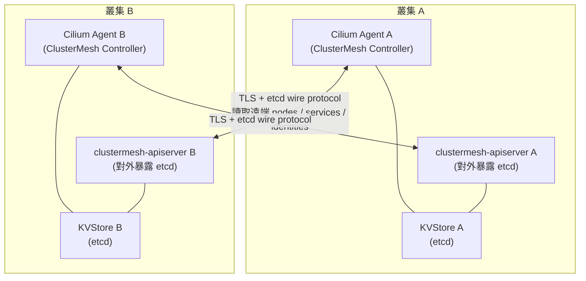
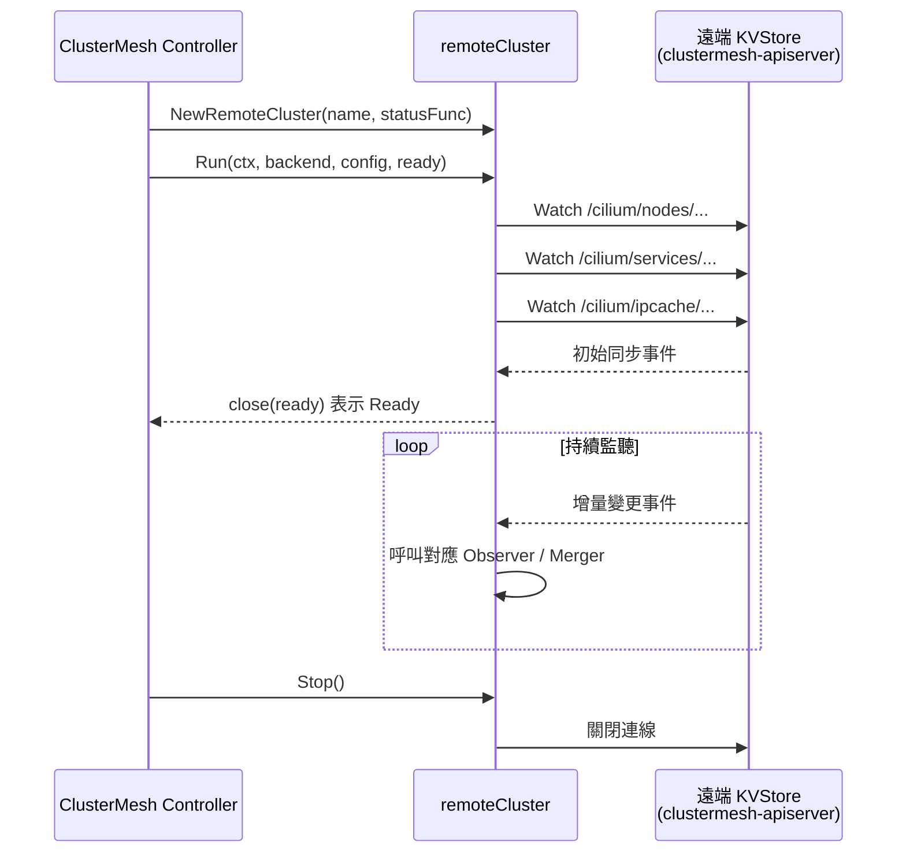
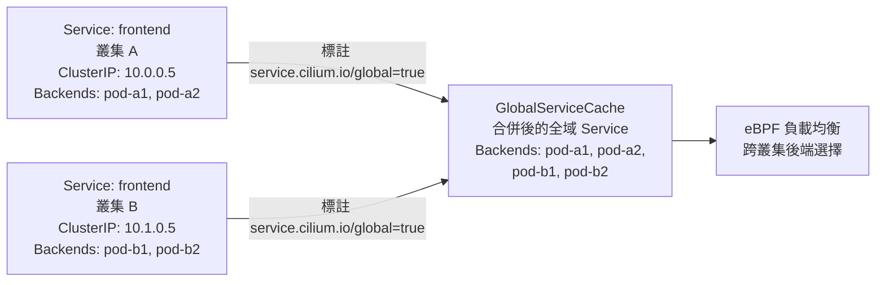

# Cilium — ClusterMesh 多叢集架構

**ClusterMesh** 是 Cilium 的多叢集方案，讓多個 Kubernetes 叢集的 Pod、Service 和安全身份（Identity）可以互通，不需要額外的 Service Mesh 或 VPN 疊加層。其核心機制是透過共享的 KVStore（etcd）同步狀態，並在每個叢集的 Cilium Agent 中維護遠端叢集的完整資訊。

## 整體架構



每個叢集部署一個 `clustermesh-apiserver`，以 TLS 對外暴露本叢集的 etcd 存取介面。對端叢集的 Cilium Agent 透過此介面監看（Watch）遠端叢集的 nodes、services、identities 等狀態，實現雙向同步。

## 前置需求與叢集 ID

ClusterMesh 要求每個叢集具有**唯一的叢集 ID（ClusterID, 1–255）**。`NewClusterMesh` 在 `ClusterInfo.ID == 0` 或未設定 `ClusterMeshConfig` 路徑時會直接回傳 nil，不啟用功能：

```go
// 檔案: cilium/pkg/clustermesh/clustermesh.go
func NewClusterMesh(lifecycle cell.Lifecycle, c Configuration) *ClusterMesh {
    if c.ClusterInfo.ID == 0 || c.ClusterMeshConfig == "" {
        return nil
    }
    // ...
}
```

## Configuration 結構

`Configuration` 聚合了 ClusterMesh 所需的所有依賴項：

```go
// 檔案: cilium/pkg/clustermesh/clustermesh.go
type Configuration struct {
    cell.In

    common.Config
    ClusterInfo          cmtypes.ClusterInfo
    RemoteClientFactory  common.RemoteClientFactoryFn

    // ServiceMerger 負責將遠端服務合併進本地快取
    ServiceMerger        ServiceMerger

    // NodeObserver 監聽遠端節點事件
    NodeObserver         nodeStore.NodeManager

    // RemoteIdentityWatcher 同步遠端叢集的安全身份
    RemoteIdentityWatcher RemoteIdentityWatcher

    IPCache              ipcache.IPCacher
    ClusterIDsManager    clusterIDsManager

    // ObserverFactories 可擴充的觀察者工廠清單
    ObserverFactories    []observer.Factory `group:"clustermesh-observers"`

    Metrics              Metrics
    CommonMetrics        common.Metrics
    FeatureMetrics       ClusterMeshMetrics
}
```

## RemoteCluster — 遠端叢集管理

每個遠端叢集對應一個 `remoteCluster` 實例，負責維護與該叢集的所有同步狀態：

```go
// 檔案: cilium/pkg/clustermesh/remote_cluster.go
type remoteCluster struct {
    name      string
    clusterID uint32

    // remoteNodes — 遠端叢集節點的共享 WatchStore
    remoteNodes store.WatchStore

    // remoteServices — 遠端叢集 Service 的共享 WatchStore
    remoteServices store.WatchStore

    // ipCacheWatcher — 監聽 IP ↔ Identity 對映變更
    ipCacheWatcher *ipcache.IPIdentityWatcher

    // remoteIdentityCache — 遠端 Identity 的本地快取副本
    remoteIdentityCache allocator.RemoteIDCache

    // observers — 監聽額外 KVStore prefix 的觀察者 map
    observers map[observer.Name]observer.Observer

    // synced — 追蹤與遠端叢集的初始同步狀態
    synced synced
}
```

### remoteCluster 生命週期



## GlobalServiceCache 與 Service Merging

ClusterMesh 的跨叢集服務合併透過 `GlobalServiceCache` 和 `ServiceMerger` 實現：

```go
// 檔案: cilium/pkg/clustermesh/service_merger.go

// ServiceMerger 介面由本地服務的擁有者實作，提供合併與刪除操作
type ServiceMerger interface {
    MergeExternalServiceUpdate(service *serviceStore.ClusterService)
    MergeExternalServiceDelete(service *serviceStore.ClusterService)
}

// serviceMerger 的刪除操作：移除指定叢集的所有 Backend
func (sm *serviceMerger) MergeExternalServiceDelete(service *serviceStore.ClusterService) {
    name := loadbalancer.NewServiceName(service.Namespace, service.Name)
    txn := sm.writer.WriteTxn()
    defer txn.Commit()
    sm.writer.DeleteBackendsOfServiceFromCluster(
        txn,
        name,
        source.ClusterMesh,
        service.ClusterID,
    )
}
```

### 全域服務（Global Service）概念



當 Service 標有 `service.cilium.io/global: "true"` 標籤時，Cilium 會將所有叢集同名 Service 的 Backend 合併，使本叢集的 Pod 可以被導流到任意叢集的後端。

## Remote Identity Watcher

ClusterMesh 不只同步服務，也同步**安全身份（Identity）**，確保跨叢集的網路政策能正確比對：

```go
// 檔案: cilium/pkg/clustermesh/clustermesh.go
type RemoteIdentityWatcher interface {
    // WatchRemoteIdentities 建立遠端 Identity 監視器，
    // 並同步至本地 Identity 快取
    WatchRemoteIdentities(
        remoteName string,
        remoteID uint32,
        backend kvstore.BackendOperations,
        cachedPrefix bool,
    ) (allocator.RemoteIDCache, error)

    // RemoveRemoteIdentities 移除遠端 Identity 來源，
    // 並為所有已知 Identity 發出刪除事件
    RemoveRemoteIdentities(name string)
}
```

## Multi-Cluster Services (MCS) API

Cilium 也支援 Kubernetes 標準的 **Multi-Cluster Services API**（`pkg/clustermesh/mcsapi/`），相容於 `ServiceExport` / `ServiceImport` CRD，適合需要遵循標準規範的環境。

| 機制 | 標準 | 說明 |
|------|------|------|
| Cilium Global Service | Cilium 原生 | `service.cilium.io/global=true` label，功能最完整 |
| MCS API | Kubernetes SIG-Multicluster | `ServiceExport` / `ServiceImport`，跨廠商相容 |

## KVStore Mesh（kvstoremesh）

`pkg/clustermesh/kvstoremesh/` 提供另一種部署模式：多個叢集共用一個集中式 etcd，各叢集的狀態以叢集名稱為前綴隔離，適合叢集數量多、希望簡化基礎設施的場景。

## ClusterMesh Metrics

### 遠端叢集資源計數（pkg/clustermesh/metrics.go）

```go
// 檔案: cilium/pkg/clustermesh/metrics.go
type Metrics struct {
    // TotalNodes — 遠端叢集的節點總數
    // label: target_cluster
    TotalNodes metric.Vec[metric.Gauge]

    // TotalServices — 遠端叢集的 Service 總數
    // label: target_cluster
    TotalServices metric.Vec[metric.Gauge]

    // TotalEndpoints — 遠端叢集的 IP/Endpoint 總數
    // label: target_cluster
    TotalEndpoints metric.Vec[metric.Gauge]
}
```

### 連線健康狀態（pkg/clustermesh/common/metrics.go）

```go
// 檔案: cilium/pkg/clustermesh/common/metrics.go
type Metrics struct {
    // TotalRemoteClusters — 已連接的遠端叢集總數
    TotalRemoteClusters metric.Gauge

    // LastFailureTimestamp — 各遠端叢集最近一次失敗的時間戳
    LastFailureTimestamp metric.Vec[metric.Gauge]

    // ReadinessStatus — 各遠端叢集的就緒狀態（0=未就緒, 1=就緒）
    ReadinessStatus metric.Vec[metric.Gauge]

    // TotalFailures — 各遠端叢集的累計失敗次數
    TotalFailures metric.Vec[metric.Gauge]

    // TotalCacheRevocations — 各遠端叢集的快取撤銷次數
    TotalCacheRevocations metric.Vec[metric.Gauge]
}
```

| Metric 名稱 | 類型 | 說明 |
|-------------|------|------|
| `cilium_clustermesh_remote_clusters` | Gauge | 已連接遠端叢集數 |
| `cilium_clustermesh_remote_cluster_nodes` | Gauge | 各遠端叢集節點數 |
| `cilium_clustermesh_remote_cluster_services` | Gauge | 各遠端叢集 Service 數 |
| `cilium_clustermesh_remote_cluster_endpoints` | Gauge | 各遠端叢集 Endpoint 數 |
| `cilium_clustermesh_remote_cluster_readiness_status` | Gauge | 各遠端叢集就緒狀態 |
| `cilium_clustermesh_remote_cluster_failures` | Gauge | 各遠端叢集失敗次數 |
| `cilium_clustermesh_remote_cluster_last_failure_ts` | Gauge | 最近失敗時間戳 |

## 部署設定

### Helm 啟用 ClusterMesh

```yaml
# 每個叢集必須設定唯一 clusterID (1-255) 與 clusterName
cluster:
  name: cluster-a
  id: 1

clustermesh:
  useAPIServer: true
  apiserver:
    service:
      type: LoadBalancer  # 或 NodePort，讓對端叢集可連接
    tls:
      auto:
        enabled: true
        method: helm
```

### 連接兩個叢集

使用 `cilium clustermesh connect` 指令（需要兩個叢集的 kubeconfig）：

```bash
cilium clustermesh connect \
  --context cluster-a \
  --destination-context cluster-b
```

此指令會：
1. 讀取各叢集的 `clustermesh-apiserver` TLS 憑證
2. 在各叢集建立對應的 Secret（`clustermesh-secrets`）
3. Cilium Agent 重新載入設定，開始建立 etcd 連線

### 驗證連線狀態

```bash
# 查看 ClusterMesh 連線狀態
cilium clustermesh status

# 透過 Prometheus 查詢遠端叢集就緒狀態
# cilium_clustermesh_remote_cluster_readiness_status{target_cluster="cluster-b"} == 1
```

::: info 相關章節
- [網路架構](/cilium/networking) — Cilium CNI 與 eBPF Datapath 概觀
- [身份識別與安全模型](/cilium/identity-security) — Cilium Identity 機制
- [BGP 控制平面](/cilium/bgp) — 透過 BGP 廣播跨叢集路由
:::
