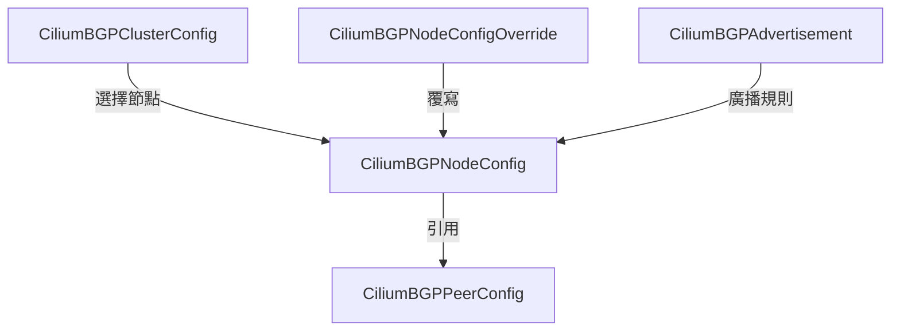

# CRD 規格完整參考

Cilium 在 Kubernetes 中定義了 18 個 Custom Resource Definitions（CRDs），分佈於 `cilium.io/v2` 和 `cilium.io/v2alpha1` 兩個 API 版本。

## CRD 總覽

| CRD 名稱 | 短名稱 | Scope | API 版本 | 用途 |
|----------|--------|-------|----------|------|
| CiliumEndpoint | cep, ciliumep | Namespaced | v2 | 記錄每個 Pod endpoint 的狀態 |
| CiliumIdentity | ciliumid | Cluster | v2 | 全域身份識別後端 |
| CiliumNode | cn, ciliumn | Cluster | v2 | 節點網路與加密設定 |
| CiliumNodeConfig | — | Namespaced | v2 | 節點級 Agent 設定覆寫 |
| CiliumNetworkPolicy | cnp, ciliumnp | Namespaced | v2 | 命名空間層級網路政策 |
| CiliumClusterwideNetworkPolicy | ccnp | Cluster | v2 | 叢集層級網路政策 |
| CiliumLocalRedirectPolicy | clrp | Namespaced | v2 | 本地流量重導向 |
| CiliumEgressGatewayPolicy | cegp | Cluster | v2 | Egress 閘道 SNAT 政策 |
| CiliumLoadBalancerIPPool | ippools, lbippool | Cluster | v2 | LoadBalancer IP 池管理 |
| CiliumCIDRGroup | ccg | Cluster | v2 | CIDR 群組（供 CNP 引用） |
| CiliumEnvoyConfig | cec | Namespaced | v2 | Envoy L7 代理設定 |
| CiliumClusterwideEnvoyConfig | ccec | Cluster | v2 | 叢集層級 Envoy 設定 |
| CiliumBGPClusterConfig | — | Cluster | v2 | BGP 叢集設定 |
| CiliumBGPNodeConfig | — | Cluster | v2 | BGP 節點設定 |
| CiliumBGPPeerConfig | — | Cluster | v2 | BGP Peer 參數 |
| CiliumBGPNodeConfigOverride | — | Cluster | v2 | BGP 節點設定覆寫 |
| CiliumBGPAdvertisement | — | Cluster | v2 | BGP 路由廣播規則 |
| CiliumEndpointSlice | — | Cluster | v2alpha1 | 高效能 Endpoint 聚合 |

## 核心資源 CRDs

### CiliumEndpoint

記錄每個 Pod 的安全身份、政策狀態與網路位址。

```go
// 檔案: cilium/pkg/k8s/apis/cilium.io/v2/types.go
// +kubebuilder:resource:singular="ciliumendpoint",path="ciliumendpoints",scope="Namespaced",shortName={cep,ciliumep}

type CiliumEndpoint struct {
    metav1.TypeMeta   `json:",inline"`
    metav1.ObjectMeta `json:"metadata"`
    Status EndpointStatus `json:"status,omitempty"`
}

type EndpointStatus struct {
    ID                  int64                        `json:"id,omitempty"`
    Identity            *EndpointIdentity            `json:"identity,omitempty"`
    Networking          *EndpointNetworking          `json:"networking,omitempty"`
    Encryption          EncryptionSpec               `json:"encryption,omitempty"`
    Policy              *EndpointPolicy              `json:"policy,omitempty"`
    // State: creating|waiting-for-identity|not-ready|ready|disconnected|...
    State               string                       `json:"state,omitempty"`
    NamedPorts          models.NamedPorts            `json:"named-ports,omitempty"`
    ServiceAccount      string                       `json:"service-account,omitempty"`
}
```

**EndpointPolicy 結構：**

```go
// 檔案: cilium/pkg/k8s/apis/cilium.io/v2/types.go
type EndpointPolicy struct {
    Ingress *EndpointPolicyDirection `json:"ingress,omitempty"`
    Egress  *EndpointPolicyDirection `json:"egress,omitempty"`
}

type EndpointPolicyDirection struct {
    Enforcing bool                `json:"enforcing"`
    Allowed   AllowedIdentityList `json:"allowed,omitempty"`
    Denied    DenyIdentityList    `json:"denied,omitempty"`
    State     EndpointPolicyState `json:"state,omitempty"`
}
```

**查詢範例：**

```bash
# 查看特定 Pod 的 Security Identity
kubectl get cep <pod-name> -n <namespace> -o jsonpath='{.status.identity.id}'

# 查看政策執行狀態
kubectl get cep <pod-name> -n <namespace> \
  -o jsonpath='{.status.policy.ingress.state}/{.status.policy.egress.state}'
```

---

### CiliumIdentity

全域身份識別儲存，作為 etcd KVStore 的替代方案。CRD 名稱即為數字身份 ID。

```go
// 檔案: cilium/pkg/k8s/apis/cilium.io/v2/types.go
// +kubebuilder:resource:singular="ciliumidentity",path="ciliumidentities",scope="Cluster",shortName={ciliumid}

type CiliumIdentity struct {
    metav1.TypeMeta   `json:",inline"`
    metav1.ObjectMeta `json:"metadata"`
    // SecurityLabels 是此身份的標準 label 集合（含來源前綴）
    SecurityLabels map[string]string `json:"security-labels"`
}
```

**查詢範例：**

```bash
# 列出含特定 label 的身份
kubectl get ciliumid -l 'k8s:app=frontend'

# 查看身份的完整 SecurityLabels
kubectl get ciliumid 12345 -o jsonpath='{.security-labels}'
```

---

### CiliumNode

儲存每個 Kubernetes 節點的 Cilium 專屬設定，包含位址、加密、IPAM、雲端提供商（ENI/Azure/AlibabaCloud）資訊。

```go
// 檔案: cilium/pkg/k8s/apis/cilium.io/v2/types.go
// +kubebuilder:resource:singular="ciliumnode",path="ciliumnodes",scope="Cluster",shortName={cn,ciliumn}

type NodeSpec struct {
    InstanceID      string              `json:"instance-id,omitempty"`
    BootID          string              `json:"bootid,omitempty"`
    Addresses       []NodeAddress       `json:"addresses,omitempty"`
    HealthAddressing HealthAddressingSpec `json:"health,omitempty"`
    IngressAddressing AddressPair       `json:"ingress,omitempty"`
    Encryption      EncryptionSpec      `json:"encryption,omitempty"`  // 加密金鑰索引
    ENI             eniTypes.ENISpec    `json:"eni,omitempty"`
    Azure           azureTypes.AzureSpec `json:"azure,omitempty"`
    IPAM            ipamTypes.IPAMSpec  `json:"ipam,omitempty"`
    NodeIdentity    uint64              `json:"nodeidentity,omitempty"`
}

// EncryptionSpec defines the encryption relevant configuration of a node.
type EncryptionSpec struct {
    // Key is the index to the key to use for encryption or 0 if encryption disabled.
    Key int `json:"key,omitempty"`
}
```

---

### CiliumNodeConfig

允許針對特定節點（透過 label selector）覆寫 `cilium-config` ConfigMap 中的設定值。

```go
// 檔案: cilium/pkg/k8s/apis/cilium.io/v2/cnc_types.go
type CiliumNodeConfigSpec struct {
    // Defaults 與 cilium-config ConfigMap 相同格式的 key-value 設定
    Defaults     map[string]string       `json:"defaults"`
    NodeSelector *metav1.LabelSelector   `json:"nodeSelector"`
}
```

## 政策 CRDs

### CiliumNetworkPolicy (CNP)

命名空間層級的網路政策，支援 L3/L4/L7 規則。

```go
// 檔案: cilium/pkg/k8s/apis/cilium.io/v2/cnp_types.go
// +kubebuilder:resource:singular="ciliumnetworkpolicy",path="ciliumnetworkpolicies",scope="Namespaced",shortName={cnp,ciliumnp}

type CiliumNetworkPolicy struct {
    metav1.TypeMeta   `json:",inline"`
    metav1.ObjectMeta `json:"metadata"`
    Spec  *api.Rule   `json:"spec,omitempty"`   // 單一規則
    Specs api.Rules   `json:"specs,omitempty"`  // 多規則
    Status CiliumNetworkPolicyStatus `json:"status,omitempty"`
}
```

**CNP YAML 範例：**

```yaml
apiVersion: cilium.io/v2
kind: CiliumNetworkPolicy
metadata:
  name: allow-frontend-to-backend
  namespace: production
spec:
  endpointSelector:
    matchLabels:
      app: backend
  ingress:
    - fromEndpoints:
        - matchLabels:
            app: frontend
      toPorts:
        - ports:
            - port: "8080"
              protocol: TCP
```

---

### CiliumClusterwideNetworkPolicy (CCNP)

與 CNP 結構相同，但為 Cluster-scoped，適用於跨命名空間的基礎設施政策。

```go
// 檔案: cilium/pkg/k8s/apis/cilium.io/v2/ccnp_types.go
// +kubebuilder:resource:singular="ciliumclusterwidenetworkpolicy",scope="Cluster",shortName={ccnp}

type CiliumClusterwideNetworkPolicy struct {
    metav1.TypeMeta   `json:",inline"`
    metav1.ObjectMeta `json:"metadata"`
    Spec  *api.Rule   `json:"spec,omitempty"`
    Specs api.Rules   `json:"specs,omitempty"`
    Status CiliumNetworkPolicyStatus `json:"status,omitempty"`
}
```

---

### CiliumEgressGatewayPolicy (CEGP)

將符合條件的 Pod 流量 SNAT 至指定的閘道節點，適用於需要固定出口 IP 的場景。

```go
// 檔案: cilium/pkg/k8s/apis/cilium.io/v2/cegp_types.go
// +kubebuilder:resource:singular="ciliumegressgatewaypolicy",scope="Cluster",shortName={cegp}

type CiliumEgressGatewayPolicySpec struct {
    Selectors        []EgressRule    `json:"selectors"`          // 來源 Pod 選擇器
    DestinationCIDRs []CIDR          `json:"destinationCIDRs"`   // 目標 CIDR
    ExcludedCIDRs    []CIDR          `json:"excludedCIDRs,omitempty"` // 排除的 CIDR
    EgressGateway    *EgressGateway  `json:"egressGateway"`      // 閘道節點
    EgressGateways   []EgressGateway `json:"egressGateways,omitempty"` // 多閘道（優先）
}
```

**CEGP YAML 範例：**

```yaml
apiVersion: cilium.io/v2
kind: CiliumEgressGatewayPolicy
metadata:
  name: egress-to-external
spec:
  selectors:
    - podSelector:
        matchLabels:
          app: my-app
      namespaceSelector:
        matchLabels:
          kubernetes.io/metadata.name: production
  destinationCIDRs:
    - 203.0.113.0/24
  egressGateway:
    nodeSelector:
      matchLabels:
        node-role.kubernetes.io/egress: "true"
    egressIP: 203.0.113.10
```

---

### CiliumLocalRedirectPolicy

將特定流量重導向至本地 Pod，常用於 DNS 加速（redirect kube-dns 至本地 cilium-dns-proxy）。

```yaml
apiVersion: cilium.io/v2
kind: CiliumLocalRedirectPolicy
metadata:
  name: local-redirect-dns
  namespace: kube-system
spec:
  redirectFrontend:
    serviceMatcher:
      serviceName: kube-dns
      namespace: kube-system
  redirectBackend:
    localEndpointSelector:
      matchLabels:
        k8s-app: kube-dns
    toPorts:
      - port: "53"
        protocol: UDP
        name: dns
```

## 負載均衡與 CIDR CRDs

### CiliumLoadBalancerIPPool

為 `type: LoadBalancer` 的 Service 提供 IP 池，由 `cilium-operator` 管理分配。

```go
// 檔案: cilium/pkg/k8s/apis/cilium.io/v2/lbipam_types.go
// +kubebuilder:resource:singular="ciliumloadbalancerippool",scope="Cluster",shortName={ippools,lbippool}
```

```yaml
apiVersion: cilium.io/v2
kind: CiliumLoadBalancerIPPool
metadata:
  name: default-pool
spec:
  blocks:
    - cidr: 192.168.100.0/24
  serviceSelector:
    matchLabels:
      color: blue
```

### CiliumCIDRGroup

將多個 CIDR 組合為具名群組，供 CNP 的 `fromCIDRSet`/`toCIDRSet` 引用。

```go
// 檔案: cilium/pkg/k8s/apis/cilium.io/v2/cidrgroups_types.go
// +kubebuilder:resource:singular="ciliumcidrgroup",scope="Cluster",shortName={ccg}
```

```yaml
apiVersion: cilium.io/v2
kind: CiliumCIDRGroup
metadata:
  name: corporate-networks
spec:
  externalCIDRs:
    - 10.0.0.0/8
    - 172.16.0.0/12
```

## BGP CRDs

Cilium BGP Control Plane 使用 5 個 CRDs 組成階層式設定：



| CRD | 說明 |
|-----|------|
| CiliumBGPClusterConfig | 叢集層級 BGP 設定（AS 號碼、節點選擇） |
| CiliumBGPNodeConfig | 每個節點的 BGP 實例設定（由 operator 自動建立） |
| CiliumBGPPeerConfig | BGP Peer 連線參數（timers、認證、graceful restart） |
| CiliumBGPNodeConfigOverride | 覆寫特定節點的 BGP 設定 |
| CiliumBGPAdvertisement | 定義要廣播的路由（Pod CIDR、Service IP 等） |

> 詳見 [BGP 控制平面](/cilium/bgp) 章節的完整說明。

## v2alpha1 CRDs

### CiliumEndpointSlice

聚合多個 Pod 的 `CoreCiliumEndpoint` 資料，減少 API Server 壓力（類似 Kubernetes EndpointSlice）。

```go
// 檔案: cilium/pkg/k8s/apis/cilium.io/v2alpha1/types.go
type CiliumEndpointSlice struct {
    metav1.TypeMeta   `json:",inline"`
    metav1.ObjectMeta `json:"metadata"`
    Namespace string              `json:"namespace,omitempty"`
    Endpoints []CoreCiliumEndpoint `json:"endpoints"`
}

type CoreCiliumEndpoint struct {
    Name       string `json:"name,omitempty"`
    IdentityID int64  `json:"id,omitempty"`
    // PodUID is the UID of the Pod that owns this endpoint.
    // ...
}
```

啟用方式：

```yaml
# Helm values
enableCiliumEndpointSlice: true
```

## 常見操作指令

```bash
# 列出所有 Cilium CRDs
kubectl get crd | grep cilium.io

# 查看節點加密金鑰索引
kubectl get cn <node-name> -o jsonpath='{.spec.encryption}'

# 查看所有 Endpoint 的身份與狀態
kubectl get cep -A

# 驗證 CNP 是否生效
kubectl get cnp <policy-name> -o jsonpath='{.status.conditions[?(@.type=="Valid")].status}'

# 查看 CEGP 列表
kubectl get cegp

# 查看 LoadBalancer IP 池使用狀況
kubectl get ciliumloadbalancerippool
```

::: info 相關章節
- [加密傳輸 (WireGuard & IPSec)](/cilium/encryption) — EncryptionSpec 與加密設定
- [網路政策 (NetworkPolicy)](/cilium/policy) — CNP/CCNP 詳細規則語法
- [BGP 控制平面](/cilium/bgp) — BGP CRDs 深度解析
- [負載均衡與 kube-proxy 替代](/cilium/load-balancing) — CiliumLoadBalancerIPPool 使用
- [身份識別與安全模型](/cilium/identity-security) — CiliumIdentity 原理
:::
