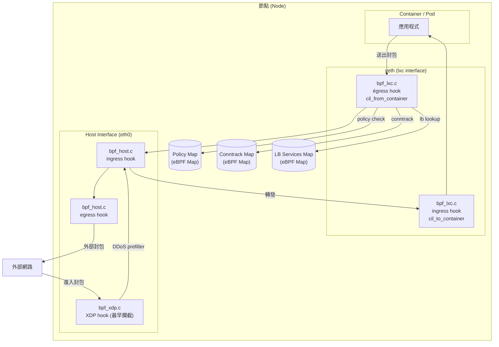
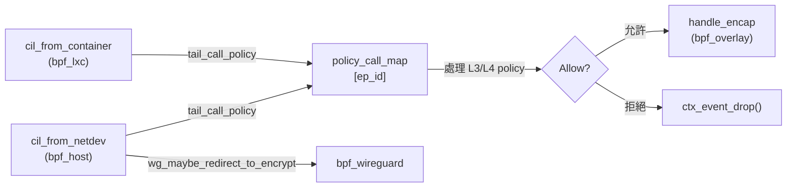
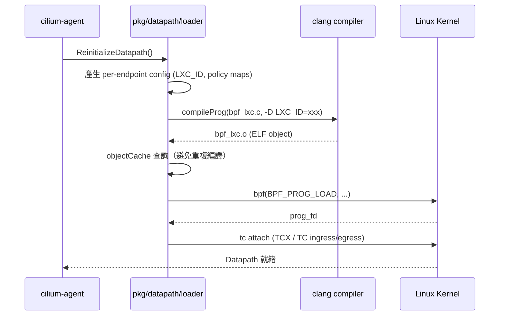
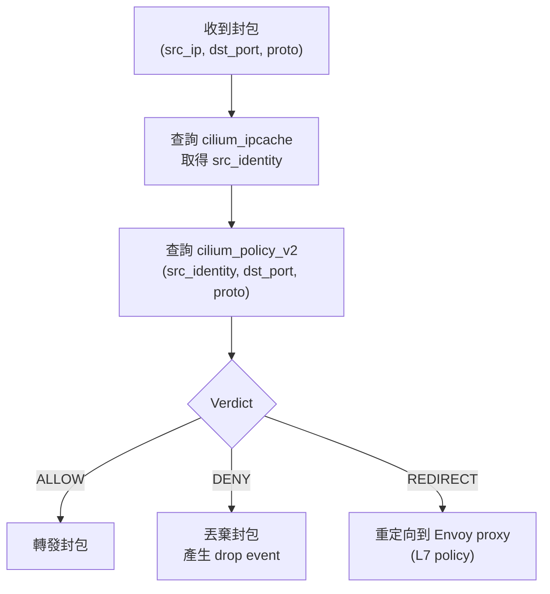

# Cilium — eBPF Datapath 深度解析

Cilium 的核心優勢在於其 **eBPF Datapath**：每個封包都在 Linux 核心的 eBPF 虛擬機器中被攔截、檢查和轉發，完全繞過 iptables，實現微秒級的策略執行與 NAT 操作。

## eBPF Datapath 整體架構



## 主要 eBPF 程式一覽

| 程式 | 原始檔 | Hook 類型 | 主要職責 |
|------|--------|-----------|----------|
| **bpf_lxc** | `bpf/bpf_lxc.c` | TC (tc_bpf) | 容器 veth 的 ingress/egress 處理，含 policy、LB、NAT |
| **bpf_host** | `bpf/bpf_host.c` | TC (tc_bpf) | 主機網卡的 ingress/egress，含 NodePort、Host Firewall |
| **bpf_xdp** | `bpf/bpf_xdp.c` | XDP | 極早期封包過濾，DDoS 防護、NodePort XDP 加速 |
| **bpf_overlay** | `bpf/bpf_overlay.c` | TC (tc_bpf) | VXLAN/Geneve overlay 隧道 ingress/egress 處理 |
| **bpf_sock** | `bpf/bpf_sock.c` | Sockmap/CgroupV2 | Socket 層 LB，降低封包在核心的往返次數 |
| **bpf_wireguard** | `bpf/bpf_wireguard.c` | TC (tc_bpf) | WireGuard 介面的加密封包處理 |

## bpf_lxc.c — 容器 Datapath 核心

`bpf_lxc.c` 是 Cilium 最核心的 eBPF 程式，附掛（attach）在每個 Pod 的 veth 介面上。

### 程式定義

```c
// 檔案: cilium/bpf/bpf_lxc.c
#include <bpf/ctx/skb.h>
#include <bpf/api.h>

#include <bpf/config/node.h>
#include <bpf/config/global.h>
#include <bpf/config/endpoint.h>
#include <bpf/config/lxc.h>

#define IS_BPF_LXC 1

#define EFFECTIVE_EP_ID LXC_ID
#define EVENT_SOURCE LXC_ID

#define USE_LOOPBACK_LB  1

#include "lib/auth.h"
#include "lib/tailcall.h"
#include "lib/policy.h"
#include "lib/lb.h"
#include "lib/nat.h"
#include "lib/identity.h"
```

- **`IS_BPF_LXC 1`**：標記本程式為 container endpoint 程式，用於條件編譯
- **`EFFECTIVE_EP_ID LXC_ID`**：Endpoint ID 對應到容器的 LXC ID（來自 `config/lxc.h`）
- **`USE_LOOPBACK_LB 1`**：啟用迴路負載均衡，確保叢集內 ClusterIP 流量使用 Random 後端選擇

### LB 後端選擇策略覆寫

```c
// 檔案: cilium/bpf/bpf_lxc.c

/* Override LB_SELECTION initially defined in node_config.h to force
 * bpf_lxc to use the random backend selection algorithm for in-cluster
 * traffic. Otherwise, it will fail with the Maglev hash algorithm because
 * Cilium doesn't provision the Maglev table for ClusterIP unless
 * bpf.lbExternalClusterIP is set to true.
 */
#undef LB_SELECTION
#define LB_SELECTION LB_SELECTION_RANDOM
```

叢集內流量強制使用 Random 演算法，Maglev 哈希僅用於外部流量。

### Egress 策略執行入口

```c
// 檔案: cilium/bpf/bpf_lxc.c

#if defined(ENABLE_HOST_FIREWALL) && !defined(ENABLE_ROUTING)
static __always_inline int
lxc_deliver_to_host(struct __ctx_buff *ctx, __u32 src_sec_identity)
{
    ctx_store_meta(ctx, CB_SRC_LABEL, src_sec_identity);
    ctx_store_meta(ctx, CB_FROM_HOST, 0);

    /* Note that bpf_lxc can be loaded before bpf_host, so bpf_host's
     * policy program may not yet be present at this time.
     */
    ret = tail_call_policy(ctx, CONFIG(host_ep_id));

    return DROP_HOST_NOT_READY;
}
#endif
```

- 當啟用 Host Firewall 且非 Routing 模式時，容器出站封包會透過 `tail_call_policy` 跳轉至 host endpoint 的 policy 程式繼續執行

### 引入的函式庫

| 函式庫 | 說明 |
|--------|------|
| `lib/policy.h` | Policy map 查詢，判斷是否允許通過 |
| `lib/lb.h` | Service 負載均衡，ClusterIP/NodePort DNAT |
| `lib/nat.h` | NAT（SNAT/DNAT）轉換 |
| `lib/identity.h` | Security Identity 查詢與設定 |
| `lib/tailcall.h` | Tail Call 跳轉機制 |
| `lib/auth.h` | mTLS 身份驗證狀態查詢 |
| `lib/encap.h` | VXLAN/Geneve 封裝與解封 |
| `lib/srv6.h` | SRv6 (Segment Routing over IPv6) 支援 |

## bpf_host.c — 主機網路介面

`bpf_host.c` 附掛在主機的實體網卡（如 `eth0`）上，處理進出節點的流量。

### 程式定義

```c
// 檔案: cilium/bpf/bpf_host.c
#include <bpf/ctx/skb.h>
#include <bpf/api.h>

#include <bpf/config/node.h>
#include <bpf/config/global.h>
#include <bpf/config/endpoint.h>
#include <bpf/config/host.h>

#define IS_BPF_HOST 1

#define EFFECTIVE_EP_ID CONFIG(host_ep_id)
#define EVENT_SOURCE CONFIG(host_ep_id)
```

- **`IS_BPF_HOST 1`**：標記為 host endpoint 程式
- **`EFFECTIVE_EP_ID CONFIG(host_ep_id)`**：Endpoint ID 對應到節點的 host_ep_id（由 Agent 動態設定）

### Host 程式特有功能

```c
// 檔案: cilium/bpf/bpf_host.c

/* Pass unknown ICMPv6 NS to stack */
#define ACTION_UNKNOWN_ICMP6_NS CTX_ACT_OK

#define NODEPORT_USE_NAT_46x64  1

#define FROM_HOST_FLAG_NEED_HOSTFW (1 << 1)
#define FROM_HOST_FLAG_HOST_ID (1 << 2)
```

- **`NODEPORT_USE_NAT_46x64`**：啟用 IPv4-in-IPv6 NAT，支援 NodePort 的 NAT46/64
- **FROM_HOST flags**：用於在 eBPF 程式之間傳遞封包來源標記

### Host 程式引入的函式庫

| 函式庫 | 說明 |
|--------|------|
| `lib/host_firewall.h` | Host Firewall 規則執行 |
| `lib/proxy.h` | L7 Proxy（Envoy）重定向 |
| `lib/edt.h` | EDT（Earliest Departure Time）流量整形 |
| `lib/arp.h` | ARP 回應處理 |
| `lib/egress_gateway.h` | Egress Gateway SNAT 處理 |
| `lib/encrypt.h` / `lib/ipsec.h` | IPSec 加密路徑 |
| `lib/wireguard.h` | WireGuard 重定向 |
| `lib/nodeport.h` / `lib/nodeport_egress.h` | NodePort/LoadBalancer 處理 |

## Tail Call 機制

Cilium 大量使用 **eBPF Tail Call** 讓各程式之間可以彼此跳轉，突破單一 eBPF 程式的指令數限制（Linux < 5.2 上限為 4096 條指令）。



### Tail Call Map 類型

| Map 名稱 | 用途 |
|----------|------|
| `CALLS_MAP` | 各程式段間的跳轉路由表（per-endpoint） |
| `cilium_policy` | Policy tail call，根據 endpoint ID 查找對應 policy 程式 |
| `cilium_calls_xdp` | XDP 程式段跳轉 |

## Datapath Loader — eBPF 程式載入流程

`pkg/datapath/loader/` 負責將 C 原始碼編譯為 eBPF 物件檔並載入核心。

### Loader 結構

```go
// 檔案: cilium/pkg/datapath/loader/loader.go

// loader is a wrapper structure around operations related to compiling,
// loading, and reloading datapath programs.
type loader struct {
    logger *slog.Logger

    // templateCache is the cache of pre-compiled datapaths.
    templateCache *objectCache

    registry *registry.MapRegistry

    hostDpInitializedOnce sync.Once
    hostDpInitialized     chan struct{}

    sysctl             sysctl.Sysctl
    prefilter          prefilter.PreFilter
    compilationLock    types.CompilationLock
    configWriter       config.Writer
    nodeConfigNotifier *manager.NodeConfigNotifier
}
```

- **`templateCache`**：快取已編譯的 eBPF 物件，避免相同設定重複編譯
- **`compilationLock`**：確保同一時刻只有一個 eBPF 程式編譯作業在進行
- **`hostDpInitialized`**：Host datapath 初始化完成的信號 channel

### 程式名稱常數

```go
// 檔案: cilium/pkg/datapath/loader/compile.go

const (
    compiler = "clang"

    endpointPrefix = "bpf_lxc"
    endpointProg   = endpointPrefix + "." + string(outputSource)  // bpf_lxc.c
    endpointObj    = endpointPrefix + ".o"                        // bpf_lxc.o

    hostEndpointPrefix = "bpf_host"
    hostEndpointProg   = hostEndpointPrefix + "." + string(outputSource)  // bpf_host.c
    hostEndpointObj    = hostEndpointPrefix + ".o"

    xdpPrefix = "bpf_xdp"
    xdpObj    = xdpPrefix + ".o"

    overlayPrefix   = "bpf_overlay"
    wireguardPrefix = "bpf_wireguard"
    socketPrefix    = "bpf_sock"
)
```

### Endpoint Symbols

```go
// 檔案: cilium/pkg/datapath/loader/endpoint.go

const (
    symbolFromEndpoint = "cil_from_container"
    symbolToEndpoint   = "cil_to_container"
)
```

- **`cil_from_container`**：容器 egress（封包離開 Pod）入口點
- **`cil_to_container`**：容器 ingress（封包進入 Pod）入口點

### 載入流程



## eBPF Maps 類型與用途

eBPF Maps 是 Cilium 控制平面與資料平面之間的共享記憶體，也是各 eBPF 程式間交換狀態的核心機制。

| Map 名稱 | 類型 | 說明 |
|----------|------|------|
| `cilium_policy_v2` | Hash | Per-endpoint 策略：`(src_identity, dport, proto)` → `verdict` |
| `cilium_lxc` | Hash | Endpoint 資訊：`endpoint_id` → `{lxc_id, mac, ip}` |
| `cilium_ipcache` | LPM Trie | IP/CIDR → Security Identity 對應 |
| `cilium_lb4_services_v2` | Hash | IPv4 Service → Backend 群組 |
| `cilium_lb4_backends_v3` | Hash | IPv4 Backend 地址與埠號 |
| `cilium_ct4_global` | Hash | IPv4 Connection Tracking（全域 CT 表） |
| `cilium_ct4_any` | Hash | IPv4 Connection Tracking（any namespace）|
| `cilium_snat_v4_external` | Hash | IPv4 SNAT 狀態表 |
| `cilium_tunnel_map` | Hash | 節點 IP → VTEP 對應（VXLAN/Geneve）|
| `cilium_metrics` | PerCPU Array | eBPF 層面的 drop/forward 統計指標 |

### Policy Map 查詢邏輯



::: info 相關章節
- [系統架構總覽](./architecture.md) — Cilium Agent 元件結構與啟動流程
- [身份識別與安全模型](./identity-security.md) — Security Identity 分配、IPCache、Policy 解析
:::
