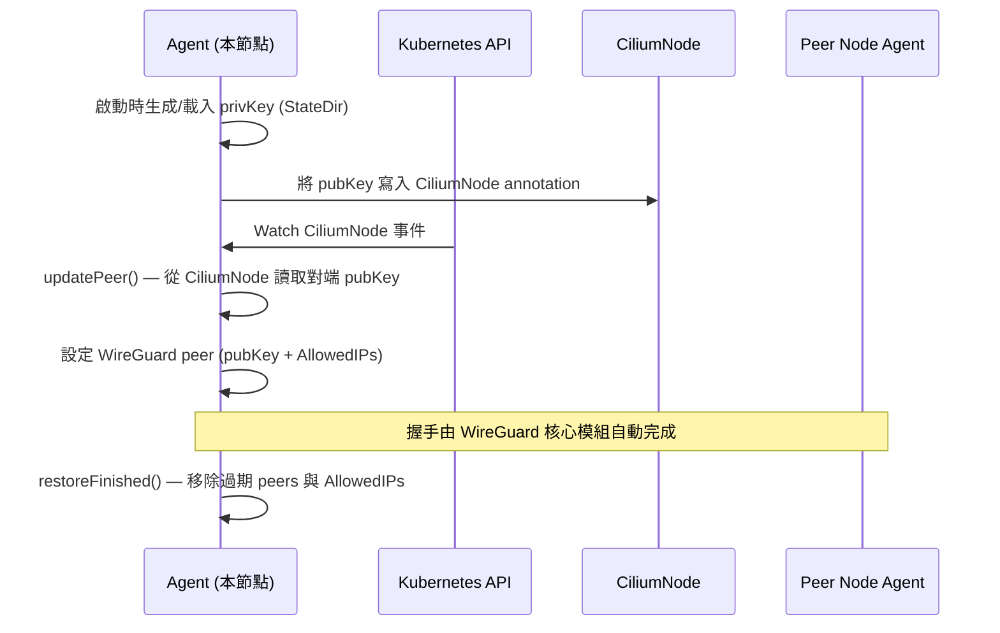

# 加密傳輸 (WireGuard & IPSec)

Cilium 支援兩種節點間流量加密機制：**WireGuard** 和 **IPSec**。兩者互斥，不能同時啟用。

## 加密方式比較

| 特性 | WireGuard | IPSec |
|------|-----------|-------|
| 效能 | 高（核心原生實作） | 中（依賴核心 crypto） |
| 設定複雜度 | 低（自動金鑰管理） | 高（需手動管理 Secret） |
| 金鑰管理 | Cilium Agent 自動輪換 | Kubernetes Secret 手動管理 |
| Kernel 需求 | Linux 5.6+（或 WireGuard 模組） | 無特殊版本限制 |
| eBPF 整合 | 有（`bpf_wireguard.c`） | 有限 |
| 節點加密 | 支援（可 opt-out） | 支援 |
| FIPS 合規 | 否（Curve25519） | 是（AES-GCM） |

## WireGuard 架構

### Agent 結構

WireGuard Agent 透過 Cilium 的 Hive cell 框架初始化，位於 `pkg/wireguard/agent/`：

```go
// 檔案: cilium/pkg/wireguard/agent/agent.go
type Agent struct {
    lock.RWMutex

    logger            *slog.Logger
    config            Config
    ipCache           *ipcache.IPCache   // 整合 IP → 身份識別映射
    sysctl            sysctl.Sysctl
    jobGroup          job.Group
    db                *statedb.DB
    mtuTable          statedb.Table[mtu.RouteMTU]
    localNode         *node.LocalNodeStore
    nodeManager       nodeManager.NodeManager
    nodeDiscovery     *nodediscovery.NodeDiscovery
    ipIdentityWatcher *ipcache.LocalIPIdentityWatcher
    clustermesh       *clustermesh.ClusterMesh
    cacheStatus       k8sSynced.CacheStatus

    listenPort       int
    privKeyPath      string
    peerByNodeName   map[string]*peerConfig
    nodeNameByNodeIP map[string]string
    nodeNameByPubKey map[wgtypes.Key]string

    optOut   bool         // 節點加密 opt-out 旗標
    privKey  wgtypes.Key
    wgClient wireguardClient
}
```

### Cell 設定

```go
// 檔案: cilium/pkg/wireguard/agent/cell.go
var Cell = cell.Module(
    "wireguard-agent",
    "Manages WireGuard device and peers",

    cell.Config(defaultUserConfig),
    cell.Provide(newWireguardAgent, newWireguardConfig),
    cell.ProvidePrivate(buildConfigFrom),
)
```

啟用 WireGuard 後，Cell 會向 datapath 注入以下 eBPF 編譯巨集：

| 巨集 | 意義 |
|------|------|
| `ENABLE_WIREGUARD` | 啟用 WireGuard 封包處理路徑 |
| `ENABLE_NODE_ENCRYPTION` | 同時加密節點間流量（需 `EncryptNode: true`） |

### 設定參數

```go
// 檔案: cilium/pkg/wireguard/agent/cell.go
type UserConfig struct {
    EnableWireguard              bool
    WireguardTrackAllIPsFallback bool
    WireguardPersistentKeepalive time.Duration
    NodeEncryptionOptOutLabels   string  // 預設: "node-role.kubernetes.io/control-plane"
}
```

`NodeEncryptionOptOutLabels` 預設讓 control-plane 節點不參與節點加密。

### 與 IPCache 整合

WireGuard Agent 持有 `*ipcache.IPCache` 參考，在 `ipIdentityWatcher` 觀察到 IP ↔ 身份變更時，同步更新 WireGuard peer 的 AllowedIPs 清單。

## WireGuard 金鑰管理流程



## EncryptionSpec — 節點加密設定

`EncryptionSpec` 同時出現在 `CiliumEndpoint.Status` 和 `CiliumNode.Spec` 中：

```go
// 檔案: cilium/pkg/k8s/apis/cilium.io/v2/types.go

// EncryptionSpec defines the encryption relevant configuration of a node.
type EncryptionSpec struct {
    // Key is the index to the key to use for encryption or 0 if encryption is
    // disabled.
    //
    // +kubebuilder:validation:Optional
    Key int `json:"key,omitempty"`
}
```

`NodeSpec` 中的完整加密相關欄位：

```go
// 檔案: cilium/pkg/k8s/apis/cilium.io/v2/types.go
type NodeSpec struct {
    // ...
    Encryption EncryptionSpec `json:"encryption,omitempty"`
    // ...
}
```

`Key` 欄位用於 IPSec 模式的金鑰輪換索引；WireGuard 模式下此值無意義（金鑰管理由 Agent 自行處理）。

## IPSec 說明

IPSec 模式使用 Kubernetes Secret 儲存預共享金鑰（PSK），並由 `cilium-operator` 管理金鑰輪換。

### 工作模式

- **Tunnel 模式**：加密整個 IP 封包（適用於 overlay 網路）
- **Transport 模式**：僅加密 payload（需 native routing）

### 主要限制

- 不支援 ClusterMesh 跨叢集加密（WireGuard 支援）
- 金鑰輪換期間可能有短暫未加密視窗
- 需要手動管理 `cilium-ipsec-keys` Secret

## Helm 配置

### 啟用 WireGuard

```yaml
# WireGuard 加密（推薦）
encryption:
  enabled: true
  type: wireguard
  nodeEncryption: true          # 同時加密節點間流量
  wireguard:
    persistentKeepalive: 0      # 0 = 停用 keepalive
```

### 啟用 IPSec

```yaml
# IPSec 加密
encryption:
  enabled: true
  type: ipsec
  nodeEncryption: true
  ipsec:
    keyFile: keys               # Secret 中的金鑰檔名
```

### 建立 IPSec 金鑰 Secret

```bash
# 建立 IPSec 金鑰 (hmac-sha256 + aes-128-cbc)
kubectl create secret generic cilium-ipsec-keys \
  --namespace kube-system \
  --from-literal=keys="3 rfc4106(gcm(aes)) $(echo $(dd if=/dev/urandom count=20 bs=1 2> /dev/null | xxd -p -c 64)) 128"
```

## 注意事項

### 與 kube-proxy 替代的相容性

| 加密類型 | kube-proxy replacement | 備註 |
|----------|----------------------|------|
| WireGuard | ✅ 相容 | 推薦組合 |
| IPSec | ⚠️ 部分相容 | DSR（Direct Server Return）需停用 |
| WireGuard | ❌ 不相容 BPF Host Routing | 需用 Legacy Host Routing |

### 效能建議

- WireGuard 在 Linux 5.6+ 核心上使用硬體加速（AVX-512）
- 大量節點環境建議啟用 `WireguardTrackAllIPsFallback: false`（預設）避免廣播 AllowedIPs
- MTU 需預留 WireGuard 封裝開銷（約 60 bytes）

### Control Plane 節點 opt-out

預設情況下，control-plane 節點不加密節點間流量（透過 `NodeEncryptionOptOutLabels`）：

```bash
# 查看哪些節點已 opt-out
kubectl get ciliumnode -o jsonpath='{range .items[*]}{.metadata.name}{" optOut="}{.metadata.annotations.network\.cilium\.io/wg-pub-key}{"\n"}{end}'
```

::: info 相關章節
- [身份識別與安全模型](/cilium/identity-security) — Security Identity 基礎
- [網路政策 (NetworkPolicy)](/cilium/policy) — L3/L4/L7 存取控制
- [CRD 規格完整參考](/cilium/crd-reference) — CiliumNode & EncryptionSpec 欄位
- [系統架構總覽](/cilium/architecture) — Cilium Agent 整體架構
:::
