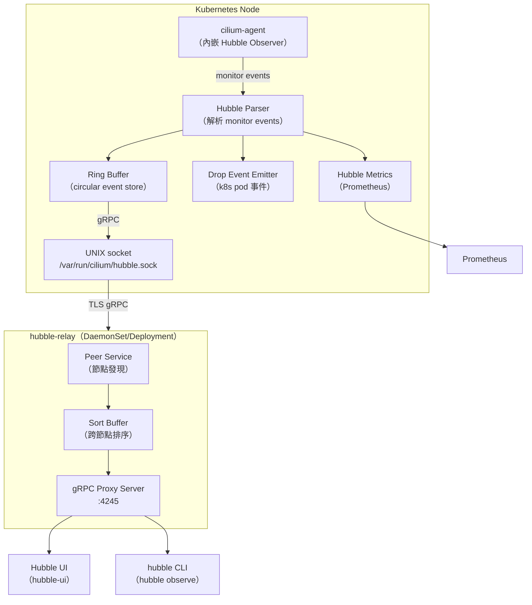
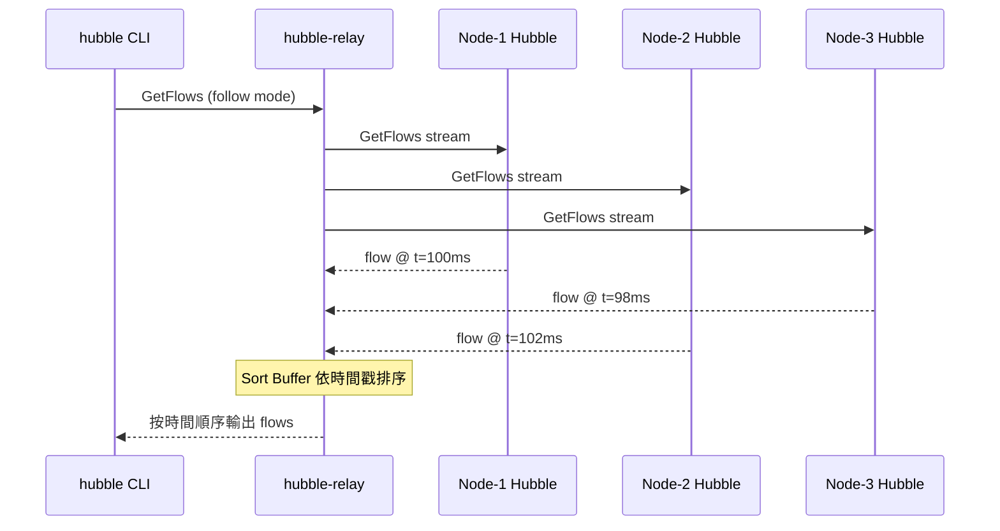
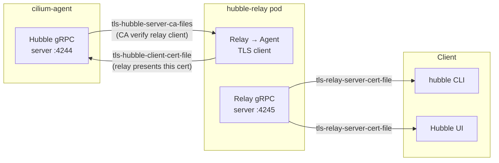

# Cilium — Hubble 可觀測性平台

Hubble 是 Cilium 內建的網路可觀測性系統，提供 L3/L4/L7 流量的即時事件記錄、服務依賴圖、Prometheus metrics，以及 CLI / UI 查詢介面，全程不需要修改應用程式。

## Hubble 整體架構



Hubble 的核心子系統由 `pkg/hubble/cell/cell.go` 定義：

```go
// 檔案: cilium/pkg/hubble/cell/cell.go

// The top-level Hubble cell implements several Hubble subsystems.
var Cell = cell.Module(
    "hubble",
    "Exposes the Observer gRPC API and Hubble metrics",

    Core,              // Hubble integration + config
    ConfigProviders,   // config objects for other components
    certloaderGroup,   // TLS certificates

    exportercell.Cell,     // flow log exporters
    metricscell.Cell,      // metrics server and flow processor
    dropeventemitter.Cell, // pod network drop events to k8s
    parsercell.Cell,       // Hubble flow parser
    namespace.Cell,        // k8s namespaces monitor
    peercell.Cell,         // peer discovery and notifications
)
```

## Hubble Observer

`LocalObserverServer` 是嵌入在 cilium-agent 內的 gRPC 服務，`pkg/hubble/observer/local_observer.go`：

```go
// 檔案: cilium/pkg/hubble/observer/local_observer.go

// LocalObserverServer is an implementation of the server.Observer interface
// that's meant to be run embedded inside the Cilium process.
type LocalObserverServer struct {
    // ring buffer that contains the references of all flows
    ring *container.Ring

    // events is the channel used by the writer(s) to send the flow data
    // into the observer server.
    events chan *observerTypes.MonitorEvent

    // stopped is mostly used in unit tests to signalize when the events
    // channel is empty, once it's closed.
    stopped chan struct{}

    log *slog.Logger

    // payloadParser decodes flowpb.Payload into flowpb.Flow
    payloadParser parser.Decoder
}
```

### Ring Buffer 容量設定

`pkg/hubble/cell/config.go` 中的關鍵設定參數：

```go
// 檔案: cilium/pkg/hubble/cell/config.go

type config struct {
    // EnableHubble: 是否啟用 Hubble server
    EnableHubble bool `mapstructure:"enable-hubble"`

    // EventBufferCapacity: Ring buffer 容量（必須為 2^n - 1，最大 65535）
    EventBufferCapacity int `mapstructure:"hubble-event-buffer-capacity"`

    // EventQueueSize: monitor events channel buffer 大小
    EventQueueSize int `mapstructure:"hubble-event-queue-size"`

    // MonitorEvents: 指定要觀察的 Cilium monitor 事件類型
    MonitorEvents []string `mapstructure:"hubble-monitor-events"`

    // SocketPath: UNIX domain socket 路徑
    SocketPath string `mapstructure:"hubble-socket-path"`

    // ListenAddress: TCP gRPC 監聽地址（例如 ":4244"）
    ListenAddress string `mapstructure:"hubble-listen-address"`
}
```

對應的 CLI 旗標：

| 旗標 | 預設值 | 說明 |
|------|--------|------|
| `--enable-hubble` | `false` | 啟用 Hubble |
| `--hubble-event-buffer-capacity` | 4095 | Ring buffer 容量 |
| `--hubble-event-queue-size` | 0（動態） | monitor events channel 大小 |
| `--hubble-socket-path` | `/var/run/cilium/hubble.sock` | UNIX socket 路徑 |
| `--hubble-listen-address` | `""` | TCP 監聽地址（例如 `:4244`）|

## 事件類型

Hubble 捕捉的事件來源於 eBPF 的 monitor 機制，分為以下類型：

### Flow Events

| 事件類型 | 說明 |
|----------|------|
| `FLOW_TYPE_L3_L4` | TCP/UDP/ICMP 連線事件（含 SYN、FIN、RST） |
| `FLOW_TYPE_L7` | HTTP、gRPC、DNS、Kafka 應用層事件 |
| `FLOW_TYPE_SOCK` | Socket 層事件 |

### Verdict（判決結果）

| Verdict | 說明 |
|---------|------|
| `FORWARDED` | 流量被允許並轉發 |
| `DROPPED` | 流量被 policy 拒絕 |
| `ERROR` | 處理錯誤 |
| `AUDIT` | 稽核模式（不阻擋，僅記錄） |
| `REDIRECTED` | 被重新導向（例如到 Envoy）|

### Drop Event Emitter

`dropeventemitter.Cell` 會將 pod 的網路丟棄事件回報給 Kubernetes 作為 Warning 事件，讓 `kubectl describe pod` 可以看到。

### DNS 事件

DNS 查詢和回應會被 Hubble 捕捉，每筆 DNS flow 包含：
- 查詢的 FQDN
- 回應的 IP 列表
- DNS 回應碼（NOERROR、NXDOMAIN 等）
- TTL 資訊

## Hubble Relay

`hubble-relay` 是一個 gRPC 聚合代理，負責從所有 cilium-agent 的 Hubble server 收集 flow 資料，提供統一的叢集級查詢端點。

### 核心設定（hubble-relay/cmd/serve/serve.go）

```go
// 檔案: cilium/hubble-relay/cmd/serve/serve.go

const (
    keyListenAddress        = "listen-address"        // Relay 自身 gRPC 監聽地址
    keyHealthListenAddress  = "health-listen-address" // gRPC health service
    keyMetricsListenAddress = "metrics-listen-address"// Prometheus metrics
    keyPeerService          = "peer-service"           // cilium-agent peer gRPC 服務地址
    keySortBufferMaxLen     = "sort-buffer-len-max"    // 排序 buffer 最大 flow 數量
    keySortBufferDrainTimeout = "sort-buffer-drain-timeout" // buffer drain 逾時

    // TLS — 連至 Hubble server（cilium-agent）
    keyTLSHubbleClientCertFile = "tls-hubble-client-cert-file"
    keyTLSHubbleClientKeyFile  = "tls-hubble-client-key-file"
    keyTLSHubbleServerCAFiles  = "tls-hubble-server-ca-files"

    // TLS — Relay 自身對外 gRPC server
    keyTLSRelayServerCertFile = "tls-relay-server-cert-file"
    keyTLSRelayServerKeyFile  = "tls-relay-server-key-file"
    keyTLSRelayClientCAFiles  = "tls-relay-client-ca-files"
)
```

### Relay 旗標說明

| 旗標 | 說明 |
|------|------|
| `--listen-address` | Relay gRPC 監聽地址（預設 `:4245`）|
| `--peer-service` | cilium-agent 的 peer gRPC service 地址 |
| `--sort-buffer-len-max` | 跨節點 flow 排序 buffer 最大筆數 |
| `--sort-buffer-drain-timeout` | follow-mode 下 buffer drain 逾時 |
| `--retry-timeout` | 重連 peer 的等待時間 |
| `--tls-hubble-client-cert-file` | 連至 Hubble server 的 client 憑證 |
| `--tls-hubble-server-ca-files` | Hubble server 的 CA 憑證路徑（可多個）|
| `--tls-relay-server-cert-file` | Relay 自身 TLS 憑證 |
| `--disable-client-tls` | 停用連至 Hubble server 的 TLS |
| `--disable-server-tls` | 停用 Relay server TLS |

### Sort Buffer 運作原理



Sort buffer 確保來自多個節點的 flow 按時間戳正確排序後再輸出給 client。

## Hubble Flow 過濾器

Hubble gRPC API 支援豐富的過濾器（`pkg/hubble/filters/`）：

| 過濾器 | 說明 | 範例 |
|--------|------|------|
| `--namespace` | 過濾特定 namespace | `--namespace kube-system` |
| `--pod` | 過濾特定 pod | `--pod frontend/web-xxx` |
| `--label` | 過濾 label selector | `--label app=nginx` |
| `--protocol` | 過濾協定 | `--protocol TCP` |
| `--port` | 過濾 port | `--port 80` |
| `--verdict` | 過濾判決結果 | `--verdict DROPPED` |
| `--type` | 過濾事件類型 | `--type l7` |
| `--http-status` | 過濾 HTTP 狀態碼 | `--http-status 500` |
| `--http-method` | 過濾 HTTP 方法 | `--http-method GET` |
| `--fqdn` | 過濾 DNS 名稱 | `--fqdn api.example.com` |

CLI 使用範例：

```bash
# 觀察 default namespace 的被 DROP 的流量
hubble observe --namespace default --verdict DROPPED

# 觀察所有 HTTP 5xx 錯誤
hubble observe --type l7 --http-status 500

# 即時追蹤特定 pod 的流量
hubble observe --pod default/web-xxx --follow

# 查看 DNS 查詢失敗
hubble observe --type l7 --fqdn "*.amazonaws.com" --verdict DROPPED
```

## Prometheus Metrics 整合

Hubble 透過 `metricscell.Cell` 提供 Prometheus metrics。

### 啟用方式

在 cilium-agent 設定：

```yaml
# Helm values
hubble:
  enabled: true
  metrics:
    enabled:
      - dns
      - drop
      - tcp
      - flow
      - port-distribution
      - icmp
      - httpV2:exemplars=true;labelsContext=source_ip,source_namespace,source_workload,destination_ip,destination_namespace,destination_workload,traffic_direction
  relay:
    enabled: true
    prometheus:
      enabled: true
      port: 9966
```

### 常用 Metrics

| Metric | 說明 |
|--------|------|
| `hubble_flows_processed_total` | 已處理的 flow 事件總數 |
| `hubble_drop_total` | 被丟棄的封包總數（含原因）|
| `hubble_tcp_flags_total` | TCP flag 統計 |
| `hubble_dns_queries_total` | DNS 查詢統計 |
| `hubble_dns_responses_total` | DNS 回應統計（含 rcode）|
| `hubble_http_requests_total` | HTTP 請求總數（含 method、status）|
| `hubble_http_request_duration_seconds` | HTTP 請求延遲 histogram |

## 部署設定說明

### 在 cilium-agent 啟用 Hubble

```bash
# Helm 安裝時啟用
helm upgrade cilium cilium/cilium \
  --set hubble.enabled=true \
  --set hubble.relay.enabled=true \
  --set hubble.ui.enabled=true \
  --set hubble.listenAddress=":4244"
```

### 完整 Hubble 設定範例（Helm values）

```yaml
hubble:
  enabled: true
  listenAddress: ":4244"
  eventBufferCapacity: 4095
  relay:
    enabled: true
    image:
      tag: v1.15.0
    tls:
      server:
        enabled: true
      client:
        enabled: true
    replicas: 1
  ui:
    enabled: true
    replicas: 1
  tls:
    enabled: true
    auto:
      enabled: true
      method: helm
```

### TLS 設定架構



::: info 相關章節
- [Cilium 網路政策 (NetworkPolicy)](/cilium/policy)
- [Cilium 身份識別與安全模型](/cilium/identity-security)
- [Cilium 系統架構總覽](/cilium/architecture)
- [Cilium eBPF Datapath 深度解析](/cilium/ebpf-datapath)
:::
