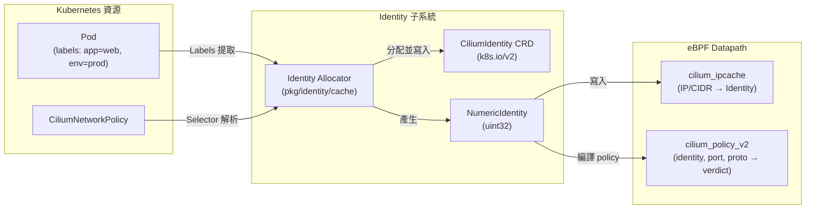
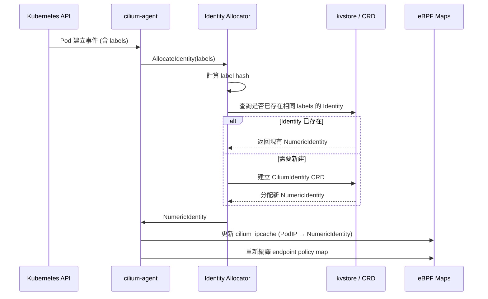
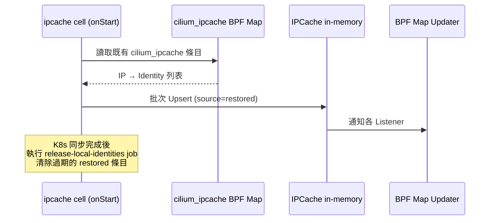
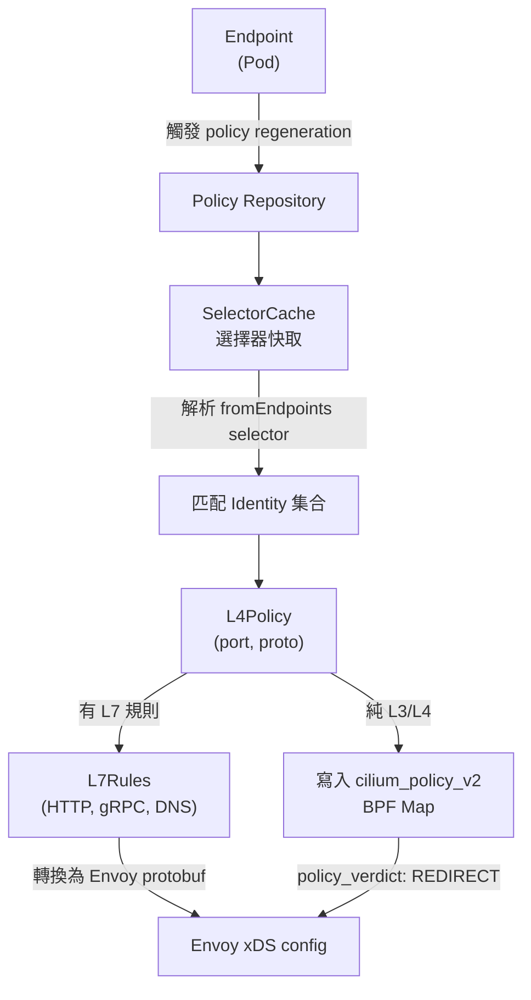
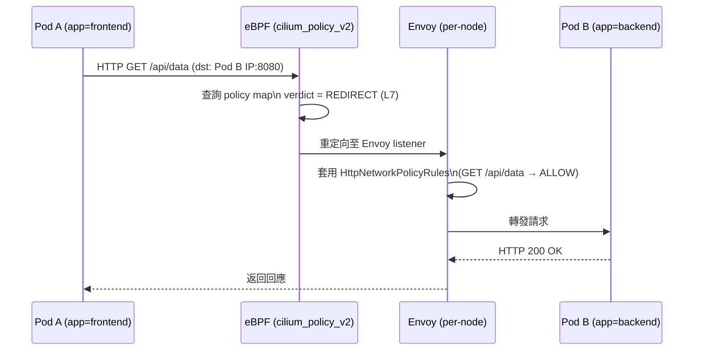

# Cilium — 身份識別與安全模型

Cilium 的安全模型建立在 **以標籤為基礎的身份識別（Label-based Identity）** 之上，而非依賴 IP 地址。每個工作負載（Pod、外部端點、CIDR）都被賦予一個 **Numeric Security Identity**，policy 執行時只需比對這個數字 ID，不需關心 IP 是否變動。

## 身份識別模型概述



### 為何不使用 IP 地址作為身份

| 傳統方式（IP-based）| Cilium 方式（Label-based）|
|---------------------|--------------------------|
| Pod 重啟後 IP 可能改變 | Identity 由 Labels 決定，Label 不變則 Identity 不變 |
| iptables 規則依賴具體 IP | Policy Map 依賴 NumericIdentity，無需更新 |
| 橫向擴展需更新所有節點規則 | 新 Pod 沿用相同 Identity，自動符合現有 Policy |
| CIDR-based policy 管理複雜 | 可用 `fromCIDRSet` 動態對應 CIDR Identity |

## Identity 結構

### pkg/identity 中的核心類型

```go
// 檔案: cilium/pkg/identity/identity.go

// Identity is the representation of the security context for a particular
// set of labels.
type Identity struct {
    // Identity's ID.
    ID NumericIdentity `json:"id"`
    // Set of labels that belong to this Identity.
    Labels labels.Labels `json:"labels"`

    // LabelArray contains the same labels as Labels in a form of a list,
    // used for faster lookup.
    LabelArray labels.LabelArray `json:"-"`

    // ReferenceCount counts the number of references pointing to this
    // identity. This field is used by the owning cache of the identity.
    ReferenceCount int `json:"-"`
}
```

### IPIdentityPair — kvstore 中的配對記錄

```go
// 檔案: cilium/pkg/identity/identity.go

// IPIdentityPair is a pairing of an IP and the security identity.
// WARNING - STABLE API: This structure is written as JSON to the
// key-value store. Do NOT modify in ways which are not JSON forward
// compatible.
type IPIdentityPair struct {
    IP                net.IP          `json:"IP"`
    Mask              net.IPMask      `json:"Mask"`
    HostIP            net.IP          `json:"HostIP"`
    ID                NumericIdentity `json:"ID"`
    Key               uint8           `json:"Key"`
    Metadata          string          `json:"Metadata"`
    K8sNamespace      string          `json:"K8sNamespace,omitempty"`
    K8sPodName        string          `json:"K8sPodName,omitempty"`
    K8sServiceAccount string          `json:"K8sServiceAccount,omitempty"`
    NamedPorts        []NamedPort     `json:"NamedPorts,omitempty"`
}
```

### Identity 類型分類

```go
// 檔案: cilium/pkg/identity/identity.go

const (
    NodeLocalIdentityType    = "node_local"
    ReservedIdentityType     = "reserved"
    ClusterLocalIdentityType = "cluster_local"
    WellKnownIdentityType    = "well_known"
    RemoteNodeIdentityType   = "remote_node"
)
```

| 類型 | 說明 | 範例 |
|------|------|------|
| `reserved` | 系統保留 Identity | `world` (ID=2)、`host` (ID=1)、`unmanaged` (ID=3) |
| `well_known` | 已知服務 Identity | `kube-dns`、`kube-apiserver` |
| `cluster_local` | 叢集內 Pod Identity | 動態分配，通常 ID ≥ 256 |
| `node_local` | 節點本地 Identity | 跨節點不同步 |
| `remote_node` | 遠端節點身份 | ClusterMesh 使用 |

## Identity 分配流程



## IPCache — IP 到 Identity 的對應快取

IPCache 是 Cilium 中最核心的狀態儲存之一，維護整個叢集所有 IP/CIDR 到 Security Identity 的對應關係。

### IPCache 結構

```go
// 檔案: cilium/pkg/ipcache/ipcache.go

// IPCache is a collection of mappings:
//   - mapping of endpoint IP or CIDR to security identities of all endpoints
//     which are part of the same cluster, and vice-versa
//   - mapping of endpoint IP or CIDR to host IP (maybe nil)
type IPCache struct {
    logger            *slog.Logger
    mutex             lock.SemaphoredMutex
    ipToIdentityCache map[string]Identity
    identityToIPCache map[identity.NumericIdentity]map[string]struct{}
    ipToHostIPCache   map[string]IPKeyPair
    ipToK8sMetadata   map[string]K8sMetadata
    ipToEndpointFlags map[string]uint8

    listeners []IPIdentityMappingListener
    // ...
}
```

- **`ipToIdentityCache`**：IP/CIDR 字串 → `Identity`（含 Source 與 NumericIdentity）
- **`identityToIPCache`**：反向索引，NumericIdentity → IP 集合
- **`ipToHostIPCache`**：Pod IP → 所在 Node IP（用於 tunnel 封裝）
- **`listeners`**：當 IP-Identity 對應變動時通知 eBPF Map 更新

### IPCache Identity 結構

```go
// 檔案: cilium/pkg/ipcache/ipcache.go

// Identity is the identity representation of an IP<->Identity cache.
type Identity struct {
    // Source is the source of the identity in the cache
    Source source.Source

    // ID is the numeric identity
    ID identity.NumericIdentity

    // shadowed determines if another entry overlaps with this one.
    // Shadowed identities are not propagated to listeners by default.
    // Most commonly set for Identity with Source = source.Generated when
    // a pod IP (other source) has the same IP.
    shadowed bool

    // modifiedByLegacyAPI indicates that this entry touched by the
    // legacy Upsert API.
    modifiedByLegacyAPI bool
}
```

- **`Source`**：此 Identity 的來源（`k8s`、`kvstore`、`local`、`generated` 等）
- **`shadowed`**：當多個來源對同一個 IP 宣告 Identity 時，低優先級的被標記為 shadowed，不傳播給 eBPF

### IPCache 啟動時的還原機制

節點重啟時，IPCache 會從既有的 **eBPF ipcache map** 還原狀態，避免短暫的 policy drop：



## CiliumIdentity CRD

每個 Cluster-local Identity 在 Kubernetes 中都有對應的 `CiliumIdentity` CRD 資源。

```yaml
apiVersion: cilium.io/v2
kind: CiliumIdentity
metadata:
  name: "12345"
  labels:
    app: web
    env: prod
spec:
  security-labels:
    k8s:app: web
    k8s:env: prod
    k8s:io.cilium.k8s.namespace.labels.kubernetes.io/metadata.name: default
    k8s:io.kubernetes.pod.namespace: default
```

- **名稱為 NumericIdentity**（字串格式的數字）
- **`spec.security-labels`**：完整的安全標籤集合，包含 Kubernetes 命名空間標籤
- CiliumIdentity 由 `cilium-operator` 進行 GC（清理未被任何節點引用的 Identity）

## Policy 解析流程

### PolicyContext 介面

```go
// 檔案: cilium/pkg/policy/resolve.go

// PolicyContext is an interface policy resolution functions use to access
// the Repository. This way testing code can run without mocking a full
// Repository.
type PolicyContext interface {
    // return the namespace in which the policy rule is being resolved
    GetNamespace() string

    // return the SelectorCache
    GetSelectorCache() *SelectorCache

    // GetEnvoyHTTPRules translates the given 'api.L7Rules' into the
    // protobuf representation the Envoy can consume.
    GetEnvoyHTTPRules(l7Rules *api.L7Rules) (*cilium.HttpNetworkPolicyRules, bool)

    // SetPriority sets the priority level for the first rule being processed.
    SetPriority(tier types.Tier, priority types.Priority)

    // Priority returns the priority level for the current rule.
    Priority() (tier types.Tier, priority types.Priority)

    // DefaultDenyIngress returns true if default deny is enabled for ingress
    DefaultDenyIngress() bool

    // DefaultDenyEgress returns true if default deny is enabled for egress
    DefaultDenyEgress() bool
}
```

### policyContext 實作

```go
// 檔案: cilium/pkg/policy/resolve.go

type policyContext struct {
    repo *Repository
    ns   string

    // Policy tier, 0 is the default and highest tier.
    tier types.Tier

    // priority level for the rule being processed, 0 is the highest priority.
    priority types.Priority

    defaultDenyIngress bool
    defaultDenyEgress  bool

    origin ruleOrigin
}
```

- **Tier（層級）**：數字越小優先級越高，預設 tier 為 0
- **Priority**：同一 tier 內的細粒度優先級控制
- **DefaultDeny**：決定是否在沒有任何匹配規則時預設拒絕流量

### Policy 解析整體流程



### SelectorCache 工作原理

`SelectorCache` 負責將 `CiliumNetworkPolicy` 中的 Label Selector 解析為實際的 **NumericIdentity 集合**，並在 Identity 變動時動態更新。

| 動作 | 說明 |
|------|------|
| `AddSelector` | 將 CNP 中的 selector 加入快取 |
| `UpdateIdentities` | 當新 Identity 建立/刪除時，更新所有受影響的 selector |
| `GetSelectorsForEndpoint` | 取得某個 endpoint 的 policy 所涉及的全部 selector |

## Endpoint Policy 執行

### CiliumEndpoint Status 中的 Policy 資訊

`CiliumEndpoint` CRD 的 `.status.policy` 欄位顯示目前執行中的已解析 policy：

```yaml
status:
  identity:
    id: 12345
    labels:
      - "k8s:app=web"
      - "k8s:env=prod"
  policy:
    ingress:
      enforcing: true
      allowed:
        - identity: 99001
          identity-labels:
            - "k8s:app=frontend"
        - identity: 1
          identity-labels:
            - "reserved:host"
      denied: []
    egress:
      enforcing: true
      allowed:
        - identity: 2
          identity-labels:
            - "reserved:world"
```

- **`enforcing: true`**：表示此方向有 policy 規則，未列入 `allowed` 的流量預設拒絕
- **`identity`**：允許/拒絕的對端 NumericIdentity
- **`allowed` / `denied`**：由 `AllowedIdentityList` / `DenyIdentityList` 展開

## L7 Policy 與 Envoy 整合

當 `CiliumNetworkPolicy` 包含 L7 規則（HTTP path、header、gRPC method 等），Cilium 會將封包重定向至本地的 **Envoy proxy**，由 Envoy 進行 L7 層面的 policy 執行。



### GetEnvoyHTTPRules 轉換

```go
// 檔案: cilium/pkg/policy/resolve.go

// GetEnvoyHTTPRules translates the given 'api.L7Rules' into
// the protobuf representation the Envoy can consume. The bool
// return parameter tells whether the rule enforcement can
// be short-circuited upon the first allowing rule. This is
// false if any of the rules has side-effects, requiring all
// such rules being evaluated.
GetEnvoyHTTPRules(l7Rules *api.L7Rules) (*cilium.HttpNetworkPolicyRules, bool)
```

- 返回值的 `bool` 表示規則是否支援短路求值
- 若任何規則有副作用（如 header 修改），必須評估全部規則，`bool` 返回 `false`

::: info 相關章節
- [系統架構總覽](./architecture.md) — Cilium Agent 的 Hive 元件結構與啟動流程
- [eBPF Datapath 深度解析](./ebpf-datapath.md) — Policy Map 執行、Tail Call 機制、eBPF Maps 說明
:::
