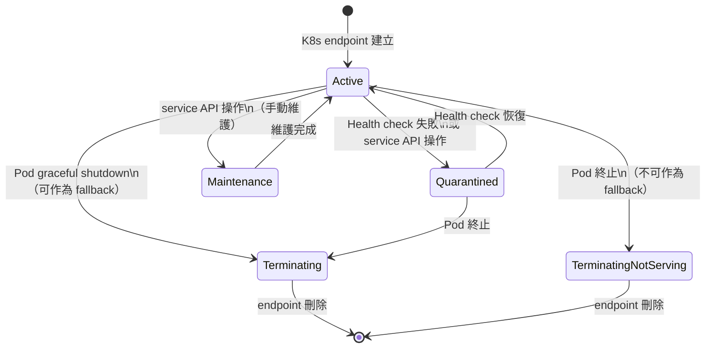
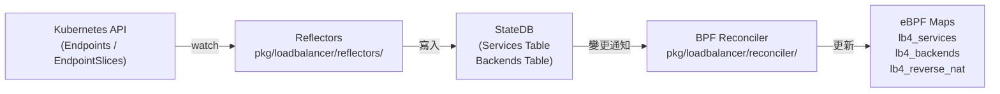

# Cilium — 負載均衡與 kube-proxy 替代

Cilium 使用 **eBPF** 完整替代 kube-proxy，在核心層直接處理 Service 的 DNAT、負載均衡和流量轉發，大幅降低延遲並提升吞吐量。本文深入解析其服務模型、流量策略與 eBPF 資料結構。

## kube-proxy 替代模式

傳統 kube-proxy 使用 **iptables** 規則鏈實作 Service 負載均衡，每個封包需要線性掃描規則。Cilium 改用 eBPF map 的 O(1) 查找：

| 比較項目 | kube-proxy + iptables | Cilium eBPF LB |
|---------|----------------------|----------------|
| 封包轉發機制 | iptables NAT 規則鏈 | eBPF TC hook + map 查找 |
| 規則查找複雜度 | O(n)，隨 Service 數增加 | O(1) hash map 查找 |
| Service 更新延遲 | 重新寫入全部 iptables | 只更新對應 eBPF map entry |
| 支援 DSR | ❌ 不支援 | ✅ 支援（TCP） |
| 支援 Maglev 哈希 | ❌ 不支援 | ✅ 支援 |
| Session Affinity | 有限支援 | ✅ 原生支援 |

啟用 kube-proxy 替代模式：`helm install --set kubeProxyReplacement=true`

---

## 服務類型（SVCType）

所有服務類型定義於 `pkg/loadbalancer/loadbalancer.go`：

```go
// 檔案: cilium/pkg/loadbalancer/loadbalancer.go
type SVCType string

const (
    SVCTypeNone          = SVCType("NONE")
    SVCTypeHostPort      = SVCType("HostPort")
    SVCTypeClusterIP     = SVCType("ClusterIP")
    SVCTypeNodePort      = SVCType("NodePort")
    SVCTypeExternalIPs   = SVCType("ExternalIPs")
    SVCTypeLoadBalancer  = SVCType("LoadBalancer")
    SVCTypeLocalRedirect = SVCType("LocalRedirect")
)
```

| 服務類型 | 說明 | 適用場景 |
|---------|------|---------|
| `ClusterIP` | 叢集內部虛擬 IP，僅叢集內可存取 | 微服務間通訊 |
| `NodePort` | 在每個節點上開放固定埠（30000-32767） | 外部流量入口 |
| `LoadBalancer` | 整合雲端 LB，分配外部 IP | 公有雲暴露服務 |
| `ExternalIPs` | 將外部 IP 綁定到特定節點 | 靜態 IP 映射 |
| `HostPort` | 容器直接使用主機端口 | 單機服務映射 |
| `LocalRedirect` | 將流量重導向到本地端點（繞過 Service LB） | sidecar 攔截 |

### ServiceFlags 位元表示

每個服務的屬性以 16-bit flags 存在 eBPF map 中：

```go
// 檔案: cilium/pkg/loadbalancer/loadbalancer.go
const (
    serviceFlagExternalIPs     = 1 << 0
    serviceFlagNodePort        = 1 << 1
    serviceFlagExtLocalScope   = 1 << 2   // externalTrafficPolicy=Local
    serviceFlagHostPort        = 1 << 3
    serviceFlagSessionAffinity = 1 << 4
    serviceFlagLoadBalancer    = 1 << 5
    serviceFlagRoutable        = 1 << 6
    serviceFlagSourceRange     = 1 << 7   // loadBalancerSourceRanges
    serviceFlagLocalRedirect   = 1 << 8
    serviceFlagNat46x64        = 1 << 9
    serviceFlagL7LoadBalancer  = 1 << 10
    serviceFlagLoopback        = 1 << 11
    serviceFlagIntLocalScope   = 1 << 12  // internalTrafficPolicy=Local
    serviceFlagTwoScopes       = 1 << 13
    serviceFlagQuarantined     = 1 << 14
    serviceFlagFwdModeDSR      = 1 << 15
)
```

---

## 流量策略

### SVCTrafficPolicy（Cluster vs Local）

```go
// 檔案: cilium/pkg/loadbalancer/loadbalancer.go
type SVCTrafficPolicy string

const (
    SVCTrafficPolicyNone    = SVCTrafficPolicy("NONE")
    SVCTrafficPolicyCluster = SVCTrafficPolicy("Cluster")
    SVCTrafficPolicyLocal   = SVCTrafficPolicy("Local")
)
```

| 策略 | 說明 |
|------|------|
| `Cluster`（預設）| 流量可轉發到任意節點的 backend，可能跨節點 |
| `Local` | 流量只轉發到**同節點**的 backend（`externalTrafficPolicy: Local`）；若本地無 backend，封包被丟棄 |

`Local` 策略可保留客戶端來源 IP（因為不需要跨節點 SNAT）。

### SVCForwardingMode（SNAT vs DSR）

```go
// 檔案: cilium/pkg/loadbalancer/loadbalancer.go
type SVCForwardingMode string

const (
    SVCForwardingModeUndef = SVCForwardingMode("")
    SVCForwardingModeDSR   = SVCForwardingMode("dsr")
    SVCForwardingModeSNAT  = SVCForwardingMode("snat")
)

func ToSVCForwardingMode(s string, proto ...uint8) SVCForwardingMode {
    switch s {
    case LBModeDSR:
        return SVCForwardingModeDSR
    case LBModeSNAT:
        return SVCForwardingModeSNAT
    case LBModeHybrid:
        if len(proto) > 0 && proto[0] == uint8(u8proto.TCP) {
            return SVCForwardingModeDSR
        }
        return SVCForwardingModeSNAT
    default:
        return SVCForwardingModeUndef
    }
}
```

| 轉發模式 | 說明 | 優點 | 限制 |
|---------|------|------|------|
| **SNAT** | 封包從 frontend 節點做 Source NAT，後端看到節點 IP | 相容性最佳，無需特殊網路 | 回程封包須經 frontend 節點 |
| **DSR** | Direct Server Return，後端直接回覆客戶端，不繞回 frontend 節點 | 降低 frontend 節點負載，減少網路跳數 | 需要 eBPF encapsulation 或 L2 路由支援 |
| **Hybrid** | TCP 使用 DSR，UDP 使用 SNAT | 兼顧 TCP 效能與 UDP 相容性 | 設定複雜度較高 |

---

## Maglev 一致性雜湊

Cilium 支援兩種 backend 選擇演算法：

```go
// 檔案: cilium/pkg/loadbalancer/loadbalancer.go
type SVCLoadBalancingAlgorithm uint8

const (
    SVCLoadBalancingAlgorithmUndef  SVCLoadBalancingAlgorithm = 0
    SVCLoadBalancingAlgorithmRandom SVCLoadBalancingAlgorithm = 1
    SVCLoadBalancingAlgorithmMaglev SVCLoadBalancingAlgorithm = 2
)
```

### Random（預設）

- 從所有 active backend 中隨機選擇
- 實作簡單，均勻分布
- 無法保證連線親和性（不考慮 Session Affinity 的情況下）

### Maglev 一致性雜湊

Maglev 是 Google 發表的一致性雜湊演算法，其核心特性是：
- **後端變動時，重新分配的連線最少**（consistent）
- 使用大型查找表（lookup table），每個 backend 均勻分布在表中
- 同一客戶端連線大機率映射到同一 backend（無需額外 session table）

在 eBPF 的 `lb4_service` 結構中，`affinity_timeout` 的上 8 bits 儲存 LB 演算法選擇：

```c
/* 檔案: cilium/bpf/lib/lb.h */
struct lb4_service {
    union {
        /* Non-master entry: backend ID in lb4_backends */
        __u32 backend_id;
        /* For master entry:
         * - Upper  8 bits: load balancer algorithm,
         *                  values:
         *                     1 - random
         *                     2 - maglev
         * - Lower 24 bits: timeout in seconds
         */
        __u32 affinity_timeout;
        /* For master entry: proxy port in host byte order,
         * only when flags2 & SVC_FLAG_L7_LOADBALANCER is set.
         */
        __u32 l7_lb_proxy_port;
    };
    __u16 count;        /* number of backend slots */
    __u16 rev_nat_index;
    __u8 flags;
    __u8 flags2;
    __u16 qcount;       /* number of quarantined backend slots */
};
```

---

## eBPF LB Map 資料結構

Cilium 的 LB 功能依賴四組主要的 eBPF map：

### lb4_key / lb6_key — Service 查找 Key

```c
/* 檔案: cilium/bpf/lib/lb.h */
struct lb4_key {
    __be32 address;      /* Service virtual IPv4 address */
    __be16 dport;        /* L4 port filter */
    __u16 backend_slot;  /* Backend iterator, 0 = svc frontend */
    __u8 proto;          /* L4 protocol */
    __u8 scope;          /* LB_LOOKUP_SCOPE_* for externalTrafficPolicy=Local */
    __u8 pad[2];
};
```

查找流程：先以 `backend_slot=0` 查 service frontend entry（取得 backend 總數），再以 `backend_slot=N` 查具體 backend ID。

### lb4_backend / lb6_backend — Backend 資訊

```c
/* 檔案: cilium/bpf/lib/lb.h */
struct lb4_backend {
    __be32 address;    /* Service endpoint IPv4 address */
    __be16 port;       /* L4 port */
    __u8 proto;        /* L4 protocol */
    __u8 flags;        /* Backend state flags */
    __u16 cluster_id;  /* Cluster ID for ClusterMesh */
    __u8 zone;         /* Topology-aware zone */
    __u8 pad;
};
```

`cluster_id` 支援 ClusterMesh 跨叢集後端（同 IP 但不同叢集可共存）。
`zone` 支援 topology-aware routing（優先選擇同 zone 的 backend）。

### lb4_affinity_key — Session Affinity

```c
/* 檔案: cilium/bpf/lib/lb.h */
struct lb4_affinity_key {
    union lb4_affinity_client_id client_id;  /* client IP 或 net cookie */
    __u16 rev_nat_id;
    __u8 netns_cookie:1,
         reserved:7;
    __u8 pad1;
    __u32 pad2;
} __packed;

struct lb_affinity_val {
    __u64 last_used;    /* 上次存取時間（用於 timeout） */
    __u32 backend_id;   /* 綁定的 backend ID */
    __u32 pad;
} __packed;
```

---

## Backend 狀態機

`pkg/loadbalancer/loadbalancer.go` 定義了完整的 Backend 狀態機：

```go
// 檔案: cilium/pkg/loadbalancer/loadbalancer.go
// 狀態轉換關係：
// BackendStateActive -> BackendStateTerminating, BackendStateQuarantined, BackendStateMaintenance
// BackendStateTerminating -> No valid state transition
// BackendStateTerminatingNotServing -> No valid state transition
// BackendStateQuarantined -> BackendStateActive, BackendStateTerminating
// BackendStateMaintenance -> BackendStateActive

const (
    BackendStateActive BackendState = iota
    BackendStateTerminating
    BackendStateTerminatingNotServing
    BackendStateQuarantined
    BackendStateMaintenance
    BackendStateInvalid
)
```



| 狀態 | 說明 | 接收新流量 | Health Check | 觸發來源 |
|------|------|:--------:|:----------:|---------|
| `Active` | 正常運行，可接收流量 | ✅ | ✅ | K8s events、service API |
| `Terminating` | 正在優雅關閉，可作為 fallback | ⚠️ 僅 fallback | ❌ | K8s events |
| `TerminatingNotServing` | 正在關閉，不可作為 fallback | ❌ | ❌ | K8s events |
| `Quarantined` | 健康檢查失敗，暫時隔離 | ❌ | ✅ | service API |
| `Maintenance` | 人工維護模式 | ❌ | ❌ | service API |

### Backend 結構（Go 層）

```go
// 檔案: cilium/pkg/loadbalancer/backend.go
type Backend struct {
    ServiceName ServiceName   // 所屬 Service
    Address     L3n4Addr      // IP + Port + Protocol
    PortNames   []string      // 可選 port name（用於精確選擇）
    Weight      uint16        // 負載權重
    NodeName    string        // 所在節點名稱
    Zone        *BackendZone  // Topology-aware zone 資訊
    ClusterID   uint32        // ClusterMesh cluster ID（本地為 0）
    Source      source.Source // 資料來源
    State       BackendState  // 當前狀態
    Unhealthy   bool          // Health check 狀態（覆蓋 State）
}
```

`IsAlive()` 方法判斷 backend 是否可接收流量：

```go
// 檔案: cilium/pkg/loadbalancer/backend.go
func (be *Backend) IsAlive() bool {
    if be.Unhealthy {
        return false
    }
    return be.State == BackendStateActive || be.State == BackendStateTerminating
}
```

---

## DSR 與 SNAT Hybrid 模式流程

```mermaid
flowchart TD
    client["外部客戶端\n192.168.1.100"]
    frontend["Frontend 節點\n(NodePort: 31000)\nNode-1: 10.0.0.1"]
    backendA["Backend Pod-A\nNode-2: 10.244.2.5:80"]
    backendB["Backend Pod-B\nNode-3: 10.244.3.5:80"]

    subgraph SNAT模式_UDP["SNAT 模式（UDP / Hybrid UDP）"]
        direction LR
        s1["① 客戶端送 UDP 封包\nsrc:192.168.1.100 dst:10.0.0.1:31000"]
        s2["② Frontend DNAT + SNAT\nsrc:10.0.0.1 dst:10.244.2.5:80"]
        s3["③ Backend 回覆\nsrc:10.244.2.5 dst:10.0.0.1"]
        s4["④ Frontend RevNAT 回覆\nsrc:10.0.0.1:31000 dst:192.168.1.100"]
        s1 --> s2 --> s3 --> s4
    end

    subgraph DSR模式_TCP["DSR 模式（TCP / Hybrid TCP）"]
        direction LR
        d1["① 客戶端送 TCP SYN\nsrc:192.168.1.100 dst:10.0.0.1:31000"]
        d2["② Frontend DNAT\n封裝原始 src/dst 到 eBPF metadata\n轉發至 Backend"]
        d3["③ Backend 直接回覆客戶端\nsrc:10.0.0.1:31000 dst:192.168.1.100\n（DSR，不需繞回 Frontend）"]
        d1 --> d2 --> d3
    end
```



### Hybrid 模式選擇邏輯

```go
// 檔案: cilium/pkg/loadbalancer/loadbalancer.go
func ToSVCForwardingMode(s string, proto ...uint8) SVCForwardingMode {
    switch s {
    case LBModeHybrid:
        if len(proto) > 0 && proto[0] == uint8(u8proto.TCP) {
            return SVCForwardingModeDSR   // TCP 使用 DSR
        }
        return SVCForwardingModeSNAT      // UDP 使用 SNAT
    }
}
```

---

## 服務控制平面架構

Cilium 的 LB 控制平面使用 **StateDB** 作為中間層，與 eBPF datapath 解耦：



- **Reflectors**（`pkg/loadbalancer/reflectors/`）：監聽 K8s EndpointSlice，轉換為內部 Backend 結構
- **StateDB**：使用 `github.com/cilium/statedb` 提供事務性、可觀察的狀態存儲
- **BPF Reconciler**（`pkg/loadbalancer/reconciler/`）：將 StateDB 的狀態同步到 eBPF maps

::: info 相關章節
- [網路架構](./networking.md) — veth pair、TC hook、Overlay 與 Direct Routing 模式
- [eBPF Datapath 深度解析](./ebpf-datapath.md) — bpf_lxc.c 中 LB 處理邏輯的原始碼解析
- [身份識別與安全模型](./identity-security.md) — Service 流量如何與 Policy 結合
- [系統架構總覽](./architecture.md) — Cilium 整體元件架構與啟動流程
:::
