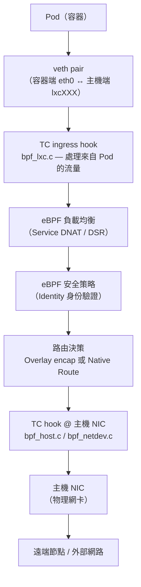
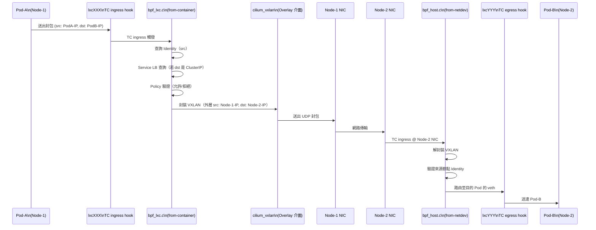

# Cilium — 網路架構

Cilium 透過 **eBPF** 在 Linux 核心層直接處理封包，完全繞過 iptables 規則鏈。本文從 CNI plugin 整合、Overlay 模式、Direct Routing，到節點層級網路，深入解析 Cilium 的網路架構。

## 整體網路架構



## CNI Plugin 整合

Cilium 實作標準 CNI (Container Network Interface) 規範，入口在 `plugins/cilium-cni/`。

```go
// 檔案: cilium/plugins/cilium-cni/main.go
package main

import (
    "runtime"
    "github.com/cilium/cilium/plugins/cilium-cni/cmd"
)

func init() {
    runtime.LockOSThread()
}

func main() {
    cmd.PluginMain()
}
```

### CNI 呼叫流程

當 kubelet 建立 Pod 時，CNI daemon 依序執行：

1. **ADD**：建立 veth pair，分配 IP（透過 Cilium Agent IPAM API），掛載 eBPF 程式到 veth 介面的 TC hook。
2. **DEL**：清理 veth pair，釋放 IP，解除 endpoint 登記。
3. **CHECK**：驗證網路設定是否符合預期狀態。

`cmd/cmd.go` 中的 `Cmd` 結構提供四個可擴展的 hook 點：

```go
// 檔案: cilium/plugins/cilium-cni/cmd/cmd.go
type Cmd struct {
    logger  *slog.Logger
    version string
    cfg     EndpointConfigurator

    onConfigReady          []OnConfigReady
    onIPAMReady            []OnIPAMReady
    onLinkConfigReady      []OnLinkConfigReady
    onInterfaceConfigReady []OnInterfaceConfigReady
}
```

支援的 CNI chaining 模式（可與其他 CNI 共存）：

| Chaining 模式 | 說明 |
|---|---|
| `awscni` | 與 AWS VPC CNI 串接，使用 ENI IP |
| `azure` | 與 Azure CNI 串接 |
| `flannel` | 在 Flannel 上層疊加 Cilium 功能 |
| `generic-veth` | 通用 veth chaining 模式 |

---

## veth Pair 與 TC Hook

每個 Pod 都有一個 **veth pair**：
- 容器端命名為 `eth0`（在 Pod 的 network namespace）
- 主機端命名為 `lxcXXXXXXXX`（在 host network namespace）

Cilium 在主機端 veth 介面上掛載 TC (Traffic Control) hook，附加以下 eBPF 程式：

| 方向 | eBPF 程式 | 作用 |
|------|-----------|------|
| ingress（來自 Pod） | `bpf_lxc.c` → `from-container` | 負載均衡、安全策略、封包改寫 |
| egress（送往 Pod）  | `bpf_lxc.c` → `to-container`  | 逆向 NAT、policy 驗證 |

---

## 網路模式

### Overlay 模式（封裝）

Overlay 模式將節點間的流量封裝在 UDP 隧道中傳輸，不需要底層網路感知 Pod CIDR。Cilium 支援兩種封裝協定：

| 協定 | UDP Port | 特性 |
|------|----------|------|
| **VXLAN** | 8472 | 預設模式，廣泛相容，RFC 7348 標準 |
| **Geneve** | 6081 | 支援擴充 metadata，更靈活的隧道選項 |

封裝邏輯在 `bpf/bpf_overlay.c` 中實作。封包在離開節點前被包裝成 UDP，並在目的節點的 overlay 介面（`cilium_vxlan` 或 `cilium_geneve`）上解封裝。

**Overlay 適用場景：**
- 底層網路不能路由 Pod IP（例如公有雲的 VPC 環境）
- 快速部署，無需修改網路基礎設施

### Direct Routing 模式（原生路由）

Direct Routing 模式不封裝封包，Pod IP 直接路由。節點間的 Pod 流量以原始 IP 在網路中傳送。

**前提條件：**
- 底層網路必須能路由各節點的 Pod CIDR（需要配合路由器或 BGP 廣播）
- 所有節點必須能互相直接到達

**優點：**
- 更低的 CPU overhead（省去 encap/decap）
- 更低的延遲
- 可觀察實際 Pod IP（easier troubleshooting）

啟用方式：`helm install --set tunnel=disabled`

---

## 節點層級網路（Node-level Networking）

節點層級的網路由 `pkg/datapath/linux/node.go` 中的 `linuxNodeHandler` 負責。

```go
// 檔案: cilium/pkg/datapath/linux/node.go
type linuxNodeHandler struct {
    log *slog.Logger

    mutex             lock.RWMutex
    isInitialized     bool
    nodeConfig        config.Config
    datapathConfig    DatapathConfiguration
    nodes             map[nodeTypes.Identity]*nodeTypes.Node
    ipsecUpdateNeeded map[nodeTypes.Identity]bool

    localNodeStore *node.LocalNodeStore
    nodeMap        nodemap.MapV2
    // Pool of available IDs for nodes.
    nodeIDs *idpool.IDPool
    // Node-scoped unique IDs for the nodes.
    nodeIDsByIPs map[string]uint16
    // reverse map of the above
    nodeIPsByIDs map[uint16]sets.Set[string]

    enableEncapsulation func(node *nodeTypes.Node) bool
    kprCfg kpr.KPRConfig
    ipsecCfg ipsecTypes.Config
}
```

`linuxNodeHandler` 實作三個介面：
- `node.Handler`：處理節點新增、更新、刪除事件
- `config.ChangeHandler`：回應 datapath 設定變更
- `node.IDHandler`：管理節點 ID 分配（用於 eBPF map 索引）

### 每個節點建立時的操作

1. 為新節點分配唯一的 **Node ID**（存入 `cilium_node_map` eBPF map）
2. 在 Overlay 模式下，建立隧道路由規則
3. 在 Direct Routing 模式下，透過 `ip route` 新增 Pod CIDR 路由
4. 若啟用 IPSec，協商並配置 IPSec SA（Security Association）
5. 若啟用 WireGuard，更新 WireGuard peer（`pkg/wireguard/agent.go`）

### iptables Bypass

Cilium 的一大優勢是**完全繞過 iptables**。透過在 TC hook 層處理所有 policy 和 NAT 邏輯，封包不需要經過 netfilter 的規則鏈，大幅減少每個封包的處理開銷。

---

## WireGuard 節點加密

Cilium 支援使用 WireGuard 加密節點間流量（`pkg/wireguard/agent.go`）：

- 每個節點自動生成 WireGuard key pair
- 透過 `CiliumNode` CRD 散布公鑰
- 節點間流量自動加密，對應用層完全透明
- 支援 IPv4 與 IPv6

與 IPSec 相比，WireGuard 設定更簡單，且效能較佳（使用 ChaCha20-Poly1305）。

---

## IPv4/IPv6 Dual-Stack

Cilium 完整支援 IPv4/IPv6 dual-stack：

- Pod 可同時分配 IPv4 和 IPv6 地址
- eBPF LB maps 同時維護 `lb4_*`（IPv4）和 `lb6_*`（IPv6）兩組 map
- 服務支援 NAT46/NAT64 轉換（`SVCNatPolicyNat46`、`SVCNatPolicyNat64`）
- 節點間路由同時支援兩個位址族

```go
// 檔案: cilium/pkg/loadbalancer/loadbalancer.go
type IPFamily = bool

const (
    IPFamilyIPv4 = IPFamily(false)
    IPFamilyIPv6 = IPFamily(true)
)
```

---

## 封包流程詳細說明

以下是 Pod-A 送封包到 Pod-B（跨節點，Overlay 模式）的完整流程：



---

## IPAM 模式

Cilium 支援多種 IP 地址管理模式，在安裝時透過 `--ipam` 選項指定：

| IPAM 模式 | 說明 | 適用環境 |
|-----------|------|---------|
| `cluster-pool` | 叢集級別 Pod CIDR 分配（預設） | 自建叢集 |
| `kubernetes` | 使用 Kubernetes Host Scope IPAM | 通用 |
| `eni` | AWS Elastic Network Interface，每個 ENI 有多個 IP | AWS EKS |
| `azure` | Azure CNI 整合 | AKS |
| `alibabacloud` | 阿里雲 ENI 整合 | ACK |
| `crd` | 透過 CiliumNode CRD 手動分配 | 進階自定義 |

::: info 相關章節
- [系統架構總覽](./architecture.md) — Cilium Agent 元件結構與啟動流程
- [eBPF Datapath 深度解析](./ebpf-datapath.md) — bpf_lxc.c、bpf_host.c 核心程式詳解
- [負載均衡與 kube-proxy 替代](./load-balancing.md) — eBPF Service LB、DSR、Maglev 哈希
- [身份識別與安全模型](./identity-security.md) — Identity 如何在網路流程中驗證
:::
