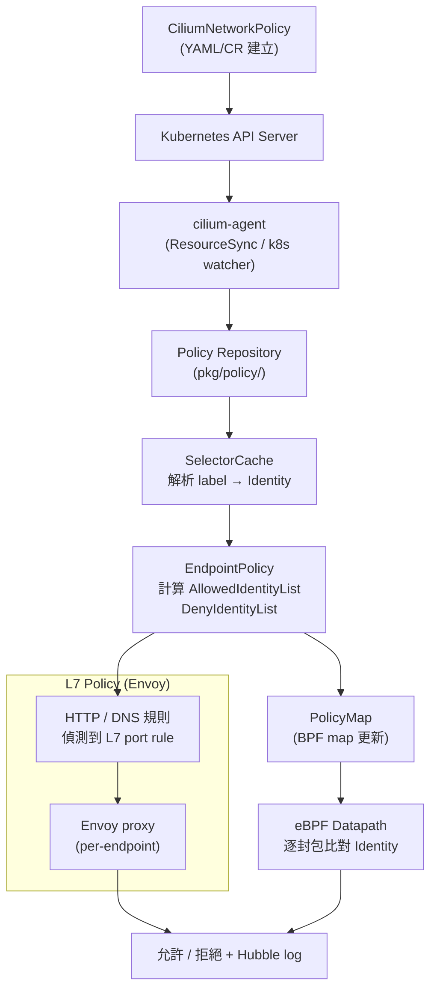

# Cilium — 網路政策 (NetworkPolicy)

Cilium 提供了比標準 Kubernetes NetworkPolicy 更強大的政策模型，支援 L3/L4 規則、L7 應用層過濾（HTTP、gRPC、DNS），以及以身份識別（Identity）為核心的 zero-trust 安全架構。

## CiliumNetworkPolicy vs 標準 Kubernetes NetworkPolicy

| 特性 | K8s NetworkPolicy | CiliumNetworkPolicy (CNP) |
|------|-------------------|--------------------------|
| 作用範圍 | Namespace | Namespace（CNP）/ Cluster（CCNP）|
| L3 規則 | CIDR | CIDR、Entity、EndpointSelector |
| L4 規則 | Port + Protocol | Port + Protocol |
| L7 規則 | ❌ 不支援 | ✅ HTTP、DNS、gRPC（透過 Envoy）|
| FQDN 規則 | ❌ 不支援 | ✅ DNS 名稱 / Wildcard 匹配 |
| Deny 規則 | ❌ 不支援 | ✅ ingressDeny / egressDeny |
| 身份識別 | Label selector | Cilium Identity（BPF map） |
| 實作層 | iptables / kube-proxy | eBPF（不依賴 iptables）|

標準 NetworkPolicy 由 Cilium 全相容支援（translation layer），但 `CiliumNetworkPolicy` 可發揮更多能力。

## CiliumNetworkPolicy 結構

`pkg/policy/api/rule.go` 定義了核心 `Rule` 結構：

```go
// 檔案: cilium/pkg/policy/api/rule.go

// Rule is a policy rule which must be applied to all endpoints which match the
// labels contained in the endpointSelector
type Rule struct {
    // EndpointSelector selects all endpoints which should be subject to
    // this rule. EndpointSelector and NodeSelector cannot be both empty and
    // are mutually exclusive.
    EndpointSelector EndpointSelector `json:"endpointSelector,omitzero"`

    // NodeSelector selects all nodes which should be subject to this rule.
    // Can only be used in CiliumClusterwideNetworkPolicies.
    NodeSelector EndpointSelector `json:"nodeSelector,omitzero"`

    // Ingress is a list of IngressRule which are enforced at ingress.
    Ingress []IngressRule `json:"ingress,omitempty"`

    // IngressDeny is a list of IngressDenyRule — denied regardless of allow rules.
    IngressDeny []IngressDenyRule `json:"ingressDeny,omitempty"`

    // Egress is a list of EgressRule which are enforced at egress.
    Egress []EgressRule `json:"egress,omitempty"`

    // EgressDeny is a list of EgressDenyRule — denied regardless of allow rules.
    EgressDeny []EgressDenyRule `json:"egressDeny,omitempty"`

    // EnableDefaultDeny determines whether this policy configures default-deny mode.
    EnableDefaultDeny DefaultDenyConfig `json:"enableDefaultDeny,omitzero"`
}
```

### Ingress 規則欄位（IngressCommonRule）

`pkg/policy/api/ingress.go` 定義 ingress 規則的共用欄位：

```go
// 檔案: cilium/pkg/policy/api/ingress.go

type IngressCommonRule struct {
    // FromEndpoints: 允許來自具有特定 label 的 endpoint
    FromEndpoints []EndpointSelector `json:"fromEndpoints,omitempty"`

    // FromCIDR: 允許來自特定 CIDR 的連線（僅限叢集外流量）
    FromCIDR CIDRSlice `json:"fromCIDR,omitempty"`

    // FromCIDRSet: CIDR 白名單，可附加排除子網
    FromCIDRSet CIDRRuleSlice `json:"fromCIDRSet,omitzero"`

    // FromEntities: 特殊實體，如 world、cluster、host、kube-apiserver
    FromEntities EntitySlice `json:"fromEntities,omitempty"`
}
```

### Egress 規則欄位（EgressCommonRule）

`pkg/policy/api/egress.go` 定義 egress 規則：

```go
// 檔案: cilium/pkg/policy/api/egress.go

type EgressCommonRule struct {
    // ToEndpoints: 允許連至具有特定 label 的 endpoint
    ToEndpoints []EndpointSelector `json:"toEndpoints,omitempty"`

    // ToCIDR: 允許連至特定 CIDR（叢集外）
    ToCIDR CIDRSlice `json:"toCIDR,omitempty"`

    // ToCIDRSet: CIDR 白名單，可附加排除子網
    ToCIDRSet CIDRRuleSlice `json:"toCIDRSet,omitzero"`

    // ToEntities: world、cluster、host 等特殊實體
    ToEntities EntitySlice `json:"toEntities,omitempty"`
}
```

## L3/L4 政策

### CIDR 規則

CIDR 規則適用於叢集外流量（in-cluster 流量請使用 `fromEndpoints`）：

```yaml
apiVersion: "cilium.io/v2"
kind: CiliumNetworkPolicy
metadata:
  name: allow-from-external
spec:
  endpointSelector:
    matchLabels:
      app: web
  ingress:
    - fromCIDR:
        - "10.0.0.0/8"
      fromCIDRSet:
        - cidr: "192.168.1.0/24"
          except:
            - "192.168.1.10/32"
```

### Endpoint Selector 規則

基於 Kubernetes label 的 endpoint 身份識別，是 Cilium 的核心機制：

```yaml
apiVersion: "cilium.io/v2"
kind: CiliumNetworkPolicy
metadata:
  name: backend-policy
spec:
  endpointSelector:
    matchLabels:
      role: backend
  ingress:
    - fromEndpoints:
        - matchLabels:
            role: frontend
      toPorts:
        - ports:
            - port: "8080"
              protocol: TCP
```

### Entity 規則

支援的 Entity 值：`world`、`cluster`、`host`、`remote-node`、`kube-apiserver`、`ingress`、`init`、`health`、`unmanaged`、`none`、`all`：

```yaml
spec:
  egress:
    - toEntities:
        - kube-apiserver
      toPorts:
        - ports:
            - port: "443"
              protocol: TCP
```

## L7 政策

L7 規則透過 Envoy proxy 執行，Cilium 會自動將流量重新導向到 Envoy sidecar。

### HTTP 規則

`pkg/policy/api/http.go` 定義 `PortRuleHTTP` 結構：

```go
// 檔案: cilium/pkg/policy/api/http.go

// PortRuleHTTP is a list of HTTP protocol constraints.
type PortRuleHTTP struct {
    // Path is an extended POSIX regex matched against the request path.
    // If omitted or empty, all paths are allowed.
    Path string `json:"path,omitempty"`

    // Method is an extended POSIX regex matched against the HTTP method.
    // e.g. "GET", "POST", "PUT", "PATCH", "DELETE"
    // If omitted or empty, all methods are allowed.
    // Method string `json:"method,omitempty"`
}
```

HTTP 政策 YAML 範例：

```yaml
apiVersion: "cilium.io/v2"
kind: CiliumNetworkPolicy
metadata:
  name: api-http-policy
spec:
  endpointSelector:
    matchLabels:
      app: api-server
  ingress:
    - fromEndpoints:
        - matchLabels:
            app: frontend
      toPorts:
        - ports:
            - port: "80"
              protocol: TCP
          rules:
            http:
              - method: "GET"
                path: "/api/v1/.*"
              - method: "POST"
                path: "/api/v1/users"
```

### HTTP Header 匹配

`HeaderMatch` 支援精細的 HTTP header 規則，可指定 mismatch 處理策略（LOG、ADD、DELETE、REPLACE）：

```yaml
toPorts:
  - ports:
      - port: "80"
        protocol: TCP
    rules:
      http:
        - method: "GET"
          headers:
            - name: "X-Auth-Token"
              value: "my-secret-token"
```

## FQDN 政策（DNS-based Rules）

FQDN 政策允許以 DNS 名稱而非 IP 為基準制定 egress 規則。Cilium 代理 DNS 查詢，並動態更新 BPF map。

### FQDNSelector

`pkg/policy/api/fqdn.go` 定義 `FQDNSelector`：

```go
// 檔案: cilium/pkg/policy/api/fqdn.go

type FQDNSelector struct {
    // MatchName matches literal DNS names. A trailing "." is automatically added.
    MatchName string `json:"matchName,omitempty"`

    // MatchPattern allows wildcards:
    // - "*" matches 0 or more DNS valid characters
    // - "*cilium.io" matches cilium.io and subdomains ending with "cilium.io"
    // - "**.cilium.io" matches all multilevel subdomains of cilium.io
    MatchPattern string `json:"matchPattern,omitempty"`
}
```

### DNS 快取機制（pkg/fqdn/cache.go）

`pkg/fqdn/cache.go` 的 `cacheEntry` 追蹤 DNS TTL：

```go
// 檔案: cilium/pkg/fqdn/cache.go

type cacheEntry struct {
    // Name is a DNS name (may be not fully qualified)
    Name string `json:"fqdn,omitempty"`

    // LookupTime is when the data begins being valid
    LookupTime time.Time `json:"lookup-time,omitempty"`

    // ExpirationTime = LookupTime + TTL
    ExpirationTime time.Time `json:"expiration-time,omitempty"`

    // TTL: seconds past LookupTime that this data is valid
    TTL int `json:"ttl,omitempty"`

    // IPs associated with this DNS name
    IPs []netip.Addr `json:"ips,omitempty"`
}
```

TTL 到期後，Cilium 會重新解析 DNS 並更新對應的 CIDR 規則到 BPF map 中。

### FQDN 政策 YAML 範例

```yaml
apiVersion: "cilium.io/v2"
kind: CiliumNetworkPolicy
metadata:
  name: allow-external-api
spec:
  endpointSelector:
    matchLabels:
      app: worker
  egress:
    - toFQDNs:
        - matchName: "api.example.com"
        - matchPattern: "*.amazonaws.com"
      toPorts:
        - ports:
            - port: "443"
              protocol: TCP
    - toEndpoints:
        - matchLabels:
            k8s:io.kubernetes.pod.namespace: kube-system
            k8s:k8s-app: kube-dns
      toPorts:
        - ports:
            - port: "53"
              protocol: UDP
          rules:
            dns:
              - matchPattern: "*"
```

::: warning DNS 政策注意事項
使用 FQDN 政策時，必須同時允許 DNS 查詢（port 53/UDP 到 kube-dns），否則 DNS 解析會被 default-deny 阻擋。
:::

## CiliumClusterwideNetworkPolicy（CCNP）

`CiliumClusterwideNetworkPolicy` 是 cluster-scoped 的政策，不限於特定 namespace，適用於全叢集安全基線：

```yaml
apiVersion: "cilium.io/v2"
kind: CiliumClusterwideNetworkPolicy
metadata:
  name: cluster-baseline
spec:
  # NodeSelector 僅可用於 CCNP
  nodeSelector:
    matchLabels:
      node-role.kubernetes.io/worker: ""
  ingress:
    - fromEntities:
        - cluster
```

CCNP 與 CNP 使用相同的 `Rule` 結構，差別在於：
- `nodeSelector` 欄位僅在 CCNP 有效
- CCNP 作用於所有 namespace

## 認證模式（Authentication）

Cilium 支援 mTLS 相互認證，`rule.go` 中的 `Authentication` 結構：

```go
// 檔案: cilium/pkg/policy/api/rule.go

type Authentication struct {
    // Mode: disabled | required | test-always-fail
    Mode AuthenticationMode `json:"mode"`
}
```

在政策中啟用 mTLS（需搭配 SPIFFE/SPIRE）：

```yaml
spec:
  egress:
    - toEndpoints:
        - matchLabels:
            app: secure-service
      authentication:
        mode: required
```

## Policy Resolution 流程



### Default-Deny 機制

- 一旦 endpoint 有任一方向（ingress 或 egress）的 policy 套用，該方向自動進入 **default-deny**
- `enableDefaultDeny` 欄位可顯式覆蓋此行為
- 多條政策取聯集（OR 邏輯），`ingressDeny`/`egressDeny` 的優先度高於 allow 規則

::: info 相關章節
- [Cilium 身份識別與安全模型](/cilium/identity-security)
- [Cilium 系統架構總覽](/cilium/architecture)
- [Cilium eBPF Datapath 深度解析](/cilium/ebpf-datapath)
- [Hubble 可觀測性平台](/cilium/hubble)
:::
