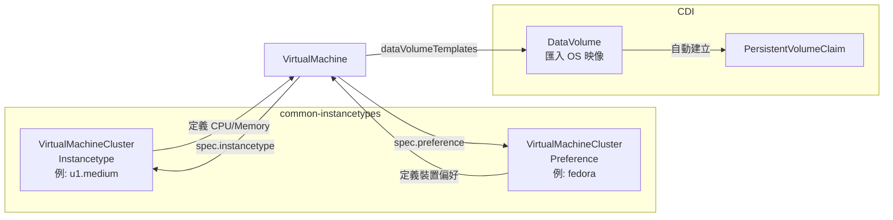
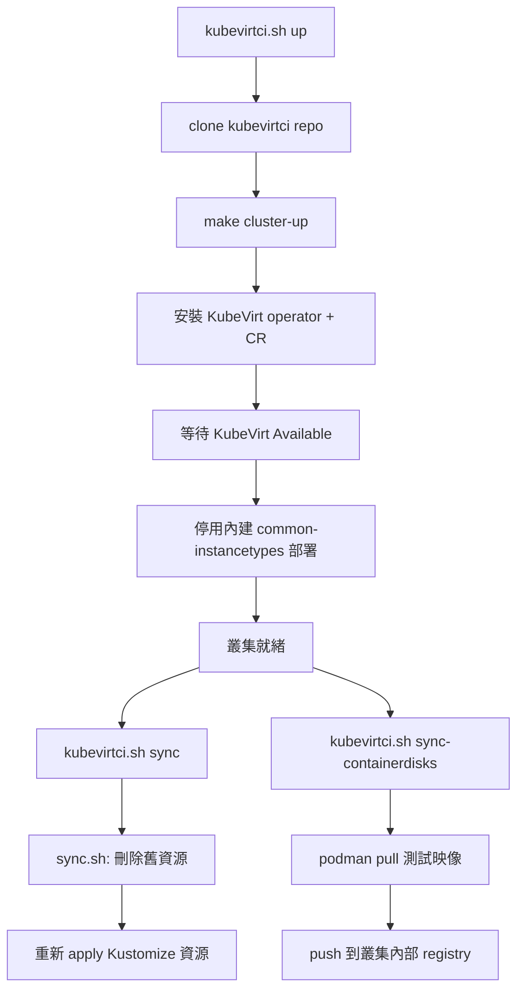
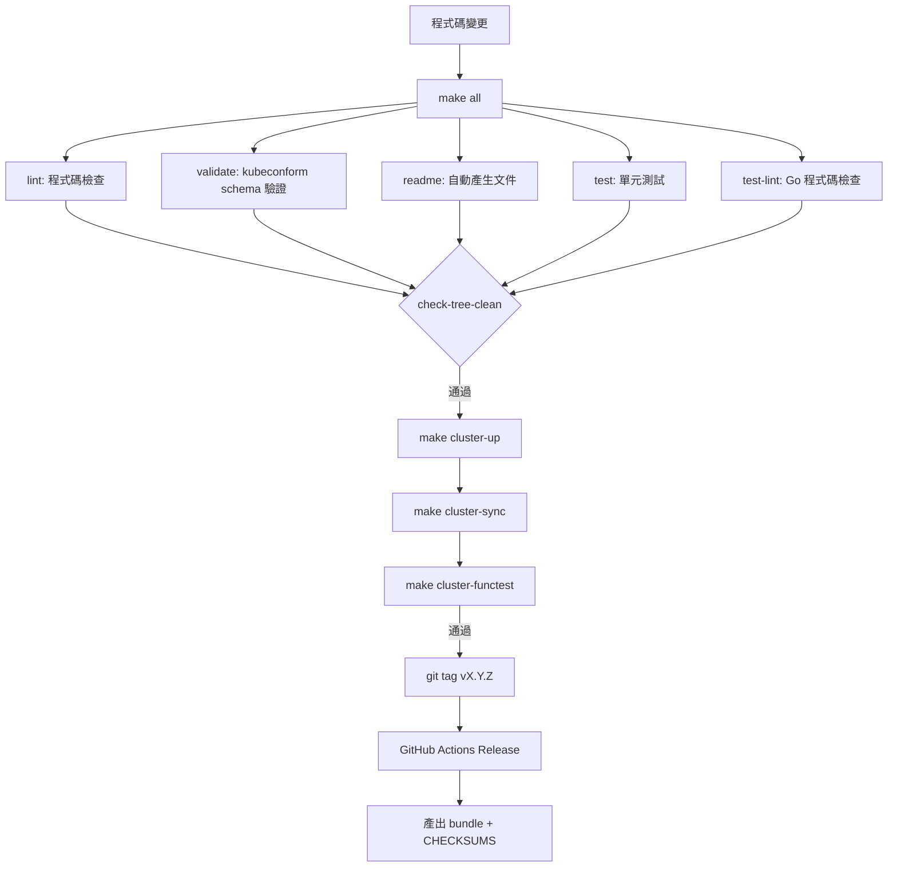

# Common Instancetypes — 外部整合

本篇分析 common-instancetypes 如何與 KubeVirt 生態系統中的各元件進行整合，包含 VirtualMachine 引用方式、Label 查詢機制、Kustomize 部署、CDI 整合，以及測試與 CI/CD 流程。

::: info 相關章節
- 專案整體架構請參閱 [系統架構](./architecture)
- Instancetype 系列與元件定義請參閱 [核心功能分析](./core-features)
- 測試框架與驗證工具請參閱 [資源類型目錄](./resource-catalog)
:::

## KubeVirt 整合

### API 版本與資源類型

common-instancetypes 所有資源皆使用 `instancetype.kubevirt.io/v1beta1` API 版本，定義了四種核心資源類型：

| 資源類型 | 作用範圍 | 說明 |
|----------|----------|------|
| `VirtualMachineClusterInstancetype` | 叢集級 | 所有 namespace 可用的 instancetype |
| `VirtualMachineInstancetype` | 命名空間級 | 僅限特定 namespace 使用的 instancetype |
| `VirtualMachineClusterPreference` | 叢集級 | 所有 namespace 可用的 preference |
| `VirtualMachinePreference` | 命名空間級 | 僅限特定 namespace 使用的 preference |

::: info 預設行為
當 VirtualMachine 未指定 `kind` 時，預設使用 Cluster 級別資源：
- `instancetype` 預設為 `VirtualMachineClusterInstancetype`
- `preference` 預設為 `VirtualMachineClusterPreference`
:::

### VirtualMachine 引用方式

VirtualMachine 物件透過 `spec.instancetype` 和 `spec.preference` 欄位來引用 common-instancetypes 提供的資源。以下是基於實際原始碼中 `InstancetypeMatcher` 和 `PreferenceMatcher` 結構的 YAML 範例：

```yaml
apiVersion: kubevirt.io/v1
kind: VirtualMachine
metadata:
  name: my-vm
spec:
  runStrategy: Always
  # 引用 Cluster 級別的 instancetype（預設 kind）
  instancetype:
    name: u1.medium    # 對應 common-instancetypes 中的 U 系列
    # kind: VirtualMachineClusterInstancetype  # 預設值，可省略
  # 引用 Cluster 級別的 preference
  preference:
    name: fedora       # 對應 common-instancetypes 中的 Fedora preference
    # kind: VirtualMachineClusterPreference    # 預設值，可省略
  template:
    spec:
      domain:
        devices:
          interfaces:
            - name: default
              masquerade: {}
      networks:
        - name: default
          pod: {}
      volumes:
        - name: rootdisk
          containerDisk:
            image: quay.io/containerdisks/fedora:latest
```

若要引用命名空間級資源，需明確指定 `kind`：

```yaml
spec:
  instancetype:
    name: my-custom-instancetype
    kind: VirtualMachineInstancetype       # 命名空間級
  preference:
    name: my-custom-preference
    kind: VirtualMachinePreference          # 命名空間級
```

### inferFromVolume 自動推斷機制

KubeVirt 支援透過 Volume 上的 annotation 自動推斷 instancetype 和 preference：

```yaml
spec:
  instancetype:
    inferFromVolume: rootdisk              # 從 Volume 的 annotation 推斷
    inferFromVolumeFailurePolicy: RejectInferFromVolumeFailure
  preference:
    inferFromVolume: rootdisk
    inferFromVolumeFailurePolicy: IgnoreInferFromVolumeFailure
```

相關的 annotation 標籤定義於 `kubevirt.io/api/instancetype/register.go`：

| Label | 說明 |
|-------|------|
| `instancetype.kubevirt.io/default-instancetype` | Volume 預設的 instancetype 名稱 |
| `instancetype.kubevirt.io/default-instancetype-kind` | Volume 預設的 instancetype 類型 |
| `instancetype.kubevirt.io/default-preference` | Volume 預設的 preference 名稱 |
| `instancetype.kubevirt.io/default-preference-kind` | Volume 預設的 preference 類型 |

### Instancetype 實際結構

以 `u1.medium`（Universal 系列）為例，來自 `instancetypes/u/1/sizes.yaml`：

```yaml
apiVersion: instancetype.kubevirt.io/v1beta1
kind: VirtualMachineClusterInstancetype
metadata:
  name: "u1.medium"
  labels:
    instancetype.kubevirt.io/cpu: "1"
    instancetype.kubevirt.io/memory: "4Gi"
    instancetype.kubevirt.io/size: "medium"
spec:
  cpu:
    guest: 1
  memory:
    guest: "4Gi"
```

以 Network 系列的 `n1.yaml`（需要 DPDK 支援）為例，展示更進階的設定：

```yaml
kind: VirtualMachineClusterInstancetype
metadata:
  name: "n"
  labels:
    instancetype.kubevirt.io/class: "network"
    instancetype.kubevirt.io/dedicatedCPUPlacement: "true"
    instancetype.kubevirt.io/isolateEmulatorThread: "true"
    instancetype.kubevirt.io/hugepages: "1Gi"
spec:
  annotations:
    cpu-load-balancing.crio.io: "disable"
    cpu-quota.crio.io: "disable"
    irq-load-balancing.crio.io: "disable"
  cpu:
    dedicatedCPUPlacement: true
    isolateEmulatorThread: true
  memory:
    hugepages:
      pageSize: "1Gi"
```

### Preference 實際結構

以 Alpine preference 的 requirements 為例，來自 `preferences/alpine/requirements/requirements.yaml`：

```yaml
apiVersion: instancetype.kubevirt.io/v1beta1
kind: VirtualMachinePreference
metadata:
  name: requirements
  labels:
    instancetype.kubevirt.io/required-cpu: "1"
    instancetype.kubevirt.io/required-memory: "512Mi"
spec:
  requirements:
    cpu:
      guest: 1
    memory:
      guest: 512Mi
```

::: tip Preference 的需求驗證
每個 preference 可定義最低資源需求（`spec.requirements`）。如果指定的 instancetype 不滿足這些需求，KubeVirt 的 admission webhook 會拒絕 VirtualMachine 的建立，錯誤訊息如：`failure checking preference requirements: insufficient Memory resources of 64M provided by instance type, preference requires 512Mi`。
:::

## Label 為基礎的查詢

common-instancetypes 使用豐富的 label 體系來標記每個資源，讓使用者和自動化工具能精確地發現與篩選資源。完整標籤定義記錄於 `docs/labels.md`。

### Instancetype Labels

| Label | 說明 | 範例值 |
|-------|------|--------|
| `instancetype.kubevirt.io/cpu` | vCPU 數量 | `1`, `4`, `16` |
| `instancetype.kubevirt.io/memory` | 記憶體大小 | `4Gi`, `16Gi` |
| `instancetype.kubevirt.io/class` | 類別 | `general.purpose`, `compute.exclusive`, `network` |
| `instancetype.kubevirt.io/version` | 系列版本 | `1` |
| `instancetype.kubevirt.io/size` | 大小級別 | `nano`, `small`, `medium`, `large`, `xlarge` |
| `instancetype.kubevirt.io/vendor` | 供應商 | `kubevirt.io` |
| `instancetype.kubevirt.io/icon-pf` | PatternFly 圖示 | `pficon-server-group` |
| `instancetype.kubevirt.io/common-instancetypes-version` | 專案版本 | `v0.4.0` |
| `instancetype.kubevirt.io/deprecated` | 已棄用標記 | `true` |
| `instancetype.kubevirt.io/dedicatedCPUPlacement` | 是否啟用 dedicated CPU | `true` |
| `instancetype.kubevirt.io/isolateEmulatorThread` | 是否隔離模擬器執行緒 | `true` |
| `instancetype.kubevirt.io/numa` | 是否啟用 NUMA passthrough | `true` |
| `instancetype.kubevirt.io/hugepages` | Hugepage 大小 | `1Gi` |

### Preference Labels

| Label | 說明 | 範例值 |
|-------|------|--------|
| `instancetype.kubevirt.io/os-type` | 作業系統類型 | `linux`, `windows`, `legacy` |
| `instancetype.kubevirt.io/arch` | 架構 | `amd64`, `arm64` |

### kubectl 查詢範例

```bash
# 列出所有提供 4 個 vCPU 的 cluster instancetype
kubectl get virtualmachineclusterinstancetype \
  -l instancetype.kubevirt.io/cpu=4
# NAME         AGE
# cx1.xlarge   39s
# m1.xlarge    39s
# n1.large     39s
# n1.medium    39s
# o1.xlarge    39s
# u1.xlarge    39s

# 列出所有 general.purpose 類別的 instancetype
kubectl get virtualmachineclusterinstancetype \
  -l instancetype.kubevirt.io/class=general.purpose

# 列出所有 network 類別且記憶體為 16Gi 的 instancetype
kubectl get virtualmachineclusterinstancetype \
  -l instancetype.kubevirt.io/class=network,instancetype.kubevirt.io/memory=16Gi

# 列出所有支援 Linux 的 cluster preference
kubectl get virtualmachineclusterpreference \
  -l instancetype.kubevirt.io/os-type=linux

# 列出支援 Windows 的 preference
kubectl get virtualmachineclusterpreference \
  -l instancetype.kubevirt.io/os-type=windows

# 列出所有啟用 dedicated CPU 的 instancetype
kubectl get virtualmachineclusterinstancetype \
  -l instancetype.kubevirt.io/dedicatedCPUPlacement=true

# 列出所有由 kubevirt.io 提供的資源
kubectl get virtualmachineclusterinstancetype \
  -l instancetype.kubevirt.io/vendor=kubevirt.io

# 列出所有已棄用的資源
kubectl get virtualmachineclusterinstancetype \
  -l instancetype.kubevirt.io/deprecated=true
```

::: tip 程式化選擇
Labels 讓 UI 工具和自動化腳本能夠動態查詢合適的 instancetype。例如可以先透過 `os-type` label 篩選出對應 OS 的 preference，再用 `cpu` 和 `memory` labels 找到滿足需求的 instancetype，實現完全自動化的 VM 資源配置。
:::

## Kustomize 部署整合

### 專案 Kustomize 結構

common-instancetypes 的核心是一套精心設計的 Kustomize overlay 結構，支援選擇性部署不同範圍的資源：


### Overlay 選擇機制

四個頂層目錄各自作為 Kustomize overlay，透過 patch 策略刪除不需要的 kind，實現選擇性部署：

**VirtualMachineClusterInstancetypes/kustomization.yaml** — 保留 Cluster 級 Instancetype，刪除 Namespace 級：

```yaml
apiVersion: kustomize.config.k8s.io/v1beta1
kind: Kustomization
resources:
  - ../instancetypes
patches:
  - target:
      kind: VirtualMachineInstancetype
    patch: |-
      apiVersion: instancetype.kubevirt.io/v1beta1
      metadata:
        name: VirtualMachineInstancetype
      kind: VirtualMachineInstancetype
      $patch: delete
```

**VirtualMachineInstancetypes/kustomization.yaml** — 保留 Namespace 級 Instancetype，刪除 Cluster 級：

```yaml
apiVersion: kustomize.config.k8s.io/v1beta1
kind: Kustomization
resources:
  - ../instancetypes
patches:
  - target:
      kind: VirtualMachineClusterInstancetype
    patch: |-
      apiVersion: instancetype.kubevirt.io/v1beta1
      metadata:
        name: VirtualMachineClusterInstancetype
      kind: VirtualMachineClusterInstancetype
      $patch: delete
```

### Bundle 產生

`scripts/generate.sh` 使用 `kustomize build` 產生五種 bundle 檔案：

```bash
# 產生所有資源（4 種 kind 全部包含）
kustomize build .. > common-instancetypes-all-bundle.yaml

# 僅 Namespace 級 Instancetype
kustomize build ../VirtualMachineInstancetypes > common-instancetypes-bundle.yaml

# 僅 Cluster 級 Instancetype
kustomize build ../VirtualMachineClusterInstancetypes > common-clusterinstancetypes-bundle.yaml

# 僅 Namespace 級 Preference
kustomize build ../VirtualMachinePreferences > common-preferences-bundle.yaml

# 僅 Cluster 級 Preference
kustomize build ../VirtualMachineClusterPreferences > common-clusterpreferences-bundle.yaml
```

每個 bundle 都會被加上版本 label 並計算 SHA256 校驗碼：

```bash
yq -i '.metadata.labels.["instancetype.kubevirt.io/common-instancetypes-version"]=env(COMMON_INSTANCETYPES_VERSION)' "${bundle}"
sha256sum "${bundle}" >> CHECKSUMS.sha256
```

### 部署到叢集

#### 方法一：使用 Makefile deploy target

Makefile 的 `deploy` target 結合了 `deploy-kubevirt-and-cdi.sh` 和 `sync.sh`：

```bash
make deploy
```

等同於執行：

```bash
scripts/deploy-kubevirt-and-cdi.sh && KUBECTL=kubectl BASEDIR=$(pwd) scripts/sync.sh
```

#### 方法二：直接使用 Kustomize

```bash
# 部署所有 Cluster 級 Instancetype
kubectl apply -k VirtualMachineClusterInstancetypes/

# 部署所有 Cluster 級 Preference
kubectl apply -k VirtualMachineClusterPreferences/

# 或部署所有資源
kubectl apply -k .
```

#### 方法三：sync.sh 腳本

`scripts/sync.sh` 實現先刪除再套用的同步策略：

```bash
#!/bin/bash
set -ex
# 先刪除現有由 kubevirt.io 提供的資源
${KUBECTL} delete VirtualMachineClusterInstancetypes \
  -l instancetype.kubevirt.io/vendor=kubevirt.io
${KUBECTL} delete VirtualMachineClusterPreferences \
  -l instancetype.kubevirt.io/vendor=kubevirt.io
# 再重新套用
${KUBECTL} apply -k "${BASEDIR}"/VirtualMachineClusterInstancetypes
${KUBECTL} apply -k "${BASEDIR}"/VirtualMachineClusterPreferences
```

::: warning 同步策略
`sync.sh` 會先刪除帶有 `instancetype.kubevirt.io/vendor=kubevirt.io` label 的所有資源再重新建立。這確保了移除的 instancetype 不會殘留，但也意味著在同步過程中有短暫的資源不可用期間。
:::

## CDI 整合

### KubeVirt + CDI 聯合部署

`scripts/deploy-kubevirt-and-cdi.sh` 腳本同時部署 KubeVirt 和 CDI（Containerized Data Importer），為完整的 VM 生命週期管理提供基礎：

```bash
#!/bin/bash
set -e

function latest_version() {
  local repo="$1"
  curl -s https://api.github.com/repos/kubevirt/"${repo}"/releases/latest | \
    grep '"tag_name":' | \
    sed -E 's/.*"([^"]+)".*/\1/'
}

# 部署 KubeVirt
KUBEVIRT_VERSION=$(curl -L https://storage.googleapis.com/kubevirt-prow/devel/release/kubevirt/kubevirt/stable.txt)
kubectl apply -n "${KUBEVIRT_NAMESPACE}" -f "https://github.com/kubevirt/kubevirt/releases/download/${KUBEVIRT_VERSION}/kubevirt-operator.yaml"
kubectl apply -n "${KUBEVIRT_NAMESPACE}" -f "https://github.com/kubevirt/kubevirt/releases/download/${KUBEVIRT_VERSION}/kubevirt-cr.yaml"
kubectl wait --for=condition=Available --timeout=600s -n "${KUBEVIRT_NAMESPACE}" kv/kubevirt

# 部署 CDI
CDI_VERSION=$(latest_version "containerized-data-importer")
kubectl apply -n cdi -f "https://github.com/kubevirt/containerized-data-importer/releases/download/${CDI_VERSION}/cdi-operator.yaml"
kubectl apply -n cdi -f "https://github.com/kubevirt/containerized-data-importer/releases/download/${CDI_VERSION}/cdi-cr.yaml"
kubectl wait --for=condition=Available --timeout=600s -n cdi cdi/cdi
```

### DataVolume + Instancetype 完整 VM 建立

在 CDI 已部署的情況下，可以結合 `DataVolume` 和 common-instancetypes 建立帶有持久磁碟的 VM：

```yaml
apiVersion: kubevirt.io/v1
kind: VirtualMachine
metadata:
  name: fedora-vm
spec:
  runStrategy: Always
  instancetype:
    name: u1.medium                     # 1 vCPU, 4Gi RAM
  preference:
    name: fedora                        # Fedora OS preference
  dataVolumeTemplates:
    - metadata:
        name: fedora-vm-rootdisk
      spec:
        storage:
          accessModes:
            - ReadWriteOnce
          resources:
            requests:
              storage: 10Gi
        source:
          registry:
            url: docker://quay.io/containerdisks/fedora:latest
  template:
    spec:
      domain:
        devices:
          interfaces:
            - name: default
              masquerade: {}
      networks:
        - name: default
          pod: {}
      volumes:
        - name: rootdisk
          dataVolume:
            name: fedora-vm-rootdisk
```



::: info CDI 的角色
CDI 負責將 container disk 映像匯入為 PersistentVolumeClaim，讓 VM 擁有持久化的磁碟。結合 common-instancetypes 定義的資源規格和 preference 的裝置偏好，就構成了完整的 VM 建立流程。
:::

## 測試叢集整合

### KubeVirtCI 測試環境

common-instancetypes 使用 [KubeVirtCI](https://github.com/kubevirt/kubevirtci) 作為測試環境。`scripts/kubevirtci.sh` 管理整個測試叢集的生命週期：



#### 關鍵環境變數

| 變數 | 預設值 | 說明 |
|------|--------|------|
| `KUBEVIRT_MEMORY_SIZE` | `16G` | 叢集節點記憶體大小 |
| `KUBEVIRT_DEPLOY_CDI` | `true` | 自動部署 CDI |
| `KUBEVIRT_VERSION` | `main` | KubeVirt 版本（main 分支或穩定版） |
| `KUBEVIRTCI_TAG` | 自動偵測 | KubeVirtCI 版本標籤 |

#### 停用內建 common-instancetypes

測試時需停用 KubeVirt 自帶的 common-instancetypes 部署，改用本地開發版本：

```bash
${_kubectl} patch kv/kubevirt -n kubevirt --type merge \
  -p '{"spec":{"configuration":{"commonInstancetypesDeployment": {"enabled": false}}}}'
```

#### CDI insecure registry 設定

測試環境將叢集內部 registry 加入 CDI 的 insecure registries：

```bash
${_kubectl} patch cdis/cdi --type merge \
  -p '{"spec": {"config": {"insecureRegistries": ["registry:5000"]}}}'
```

### 兩種測試模式

#### 模式一：KubeVirtCI（輕量級）

使用 `scripts/kubevirtci.sh`，從 KubeVirtCI 取得預建的叢集映像：

```bash
# Makefile targets
make cluster-up                    # 啟動叢集
make cluster-sync                  # 同步 instancetype 資源
make cluster-sync-containerdisks   # 同步測試用 container disk
make cluster-functest              # 執行功能測試
make cluster-down                  # 關閉叢集
```

#### 模式二：KubeVirt 原始碼（完整）

使用 `scripts/kubevirt.sh`，直接從 KubeVirt repo clone 原始碼建立叢集：

```bash
# Makefile targets
make kubevirt-up                   # clone kubevirt + 啟動叢集
make kubevirt-sync                 # 同步 instancetype 資源
make kubevirt-sync-containerdisks  # 同步測試用 container disk
make kubevirt-functest             # 執行功能測試
make kubevirt-down                 # 關閉叢集
```

### 測試用 Container Disk 映像

功能測試使用多種 container disk 映像（定義於 `tests/functests/test_suite_test.go`）：

| 映像來源 | 範例 |
|----------|------|
| `quay.io/containerdisks/` | `fedora:latest`, `ubuntu:22.04`, `centos-stream:9` |
| `quay.io/kubevirtci/` | `validation-os-container-disk`, `oraclelinux` |
| `registry:5000/` | `rhel-guest-image:8`（叢集內部 registry） |

`sync-containerdisks` 函式負責將外部映像推送到叢集內部 registry：

```bash
# 推送 Validation OS 映像
podman pull "${VALIDATION_OS_IMAGE}:${VALIDATION_OS_IMAGE_TAG}"
podman push --tls-verify=false \
  "${VALIDATION_OS_IMAGE}:${VALIDATION_OS_IMAGE_TAG}" \
  "$(kubevirtci::registry)/validation-os-container-disk:latest"

# 推送 Oracle Linux 映像
for tag in "${tags[@]}"; do
  podman pull "${ORACLE_LINUX_IMAGE}:${tag}"
  podman push --tls-verify=false \
    "${ORACLE_LINUX_IMAGE}:${tag}" \
    "$(kubevirtci::registry)/oraclelinux:${tag}"
done
```

### 測試架構

功能測試使用 Go + Ginkgo 框架，測試 instancetype 和 preference 的實際運作：

```bash
# 單元測試（不需要叢集）
make test
# 等同於：cd tests && go test -v -timeout 0 ./unittests/...

# 功能測試（需要叢集）
make cluster-functest
# 等同於：cd tests && KUBECONFIG=$(kubevirtci.sh kubeconfig) \
#   go test -v -timeout 0 ./functests/... -ginkgo.v -ginkgo.randomize-all
```

功能測試驗證項目包括：
- 每個 instancetype 都能成功建立 VirtualMachine
- Preference 的資源需求被正確驗證（CPU/Memory 不足時 rejection）
- 每個 preference 都至少有一個相容的 instancetype
- VM 能成功啟動並可透過 SSH 連線

## CI/CD 整合

### GitHub Actions Release 流程

專案使用 `.github/workflows/release.yaml` 定義 release 自動化：

```yaml
name: Release
on:
  push:
    tags:
      - "v*.*.*"
jobs:
  release:
    runs-on: ubuntu-latest
    steps:
      - name: Checkout
        uses: actions/checkout@v4
      - uses: actions/setup-go@v4
        with:
          go-version-file: tools/go.mod
      - name: Build
        run: .github/scripts/build.sh
        env:
          COMMON_INSTANCETYPES_CRI: podman
          COMMON_INSTANCETYPES_VERSION: ${{ github.ref_name }}
      - name: Release
        uses: softprops/action-gh-release@v1
        with:
          generate_release_notes: true
          fail_on_unmatched_files: true
          files: |
            _build/common-*-bundle-${{ github.ref_name }}.yaml
            _build/CHECKSUMS.sha256
            LICENSE
```

### Build 腳本

`.github/scripts/build.sh` 執行建置與版本標記：

```bash
#!/bin/bash
set -ex
# 建置所有 bundle
COMMON_INSTANCETYPES_VERSION=${COMMON_INSTANCETYPES_VERSION} make

# 為每個 bundle 加上版本號
cd _build
for file in common-*-bundle.yaml; do
    file_versioned=${file/\.yaml/-${COMMON_INSTANCETYPES_VERSION}\.yaml}
    mv "${file}" "${file_versioned}"
    sed -i "s/${file}/${file_versioned}/g" CHECKSUMS.sha256
done
```

### Release 產出物

每次 release 會產出以下 bundle 檔案（以 `v0.4.0` 為例）：

| 檔案 | 內容 |
|------|------|
| `common-instancetypes-all-bundle-v0.4.0.yaml` | 所有 4 種資源 |
| `common-clusterinstancetypes-bundle-v0.4.0.yaml` | 僅 Cluster Instancetype |
| `common-instancetypes-bundle-v0.4.0.yaml` | 僅 Namespace Instancetype |
| `common-clusterpreferences-bundle-v0.4.0.yaml` | 僅 Cluster Preference |
| `common-preferences-bundle-v0.4.0.yaml` | 僅 Namespace Preference |
| `CHECKSUMS.sha256` | SHA256 校驗碼 |

### 容器化建置環境

專案使用容器映像 `quay.io/kubevirtci/common-instancetypes-builder` 作為 CI 建置環境。透過 `COMMON_INSTANCETYPES_CRI` 環境變數控制是否在容器內執行：

```makefile
# Makefile
export COMMON_INSTANCETYPES_IMAGE = quay.io/kubevirtci/common-instancetypes-builder
export COMMON_INSTANCETYPES_IMAGE_TAG = v20250724-df773ff
```

### 完整品質保障流程



| Makefile Target | 說明 |
|----------------|------|
| `make lint` | 執行 YAML lint 檢查 |
| `make validate` | 使用 kubeconform 驗證 YAML schema |
| `make test` | 單元測試（驗證 label 一致性、版本正確性） |
| `make test-lint` | Go 程式碼 lint（golangci-lint） |
| `make functest` | 功能測試（需要外部叢集） |
| `make check-tree-clean` | 確認產生的檔案與 repo 一致 |
