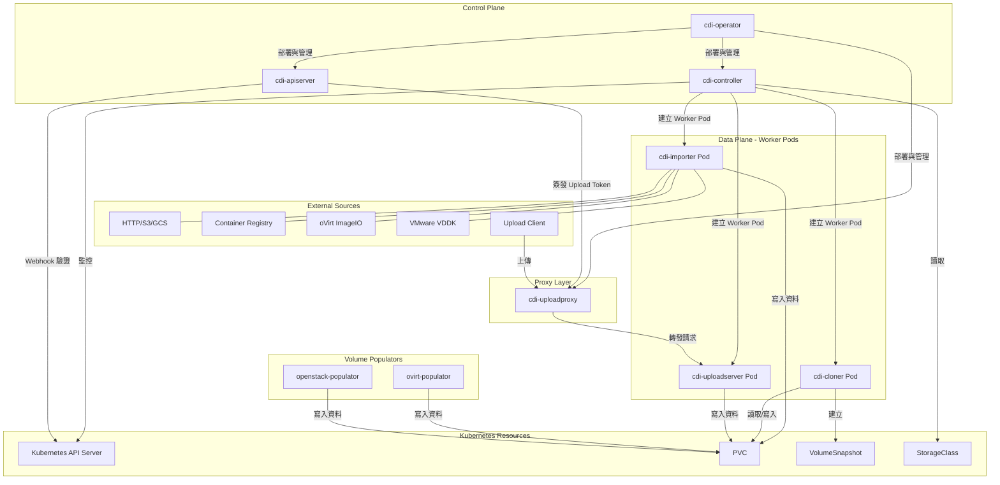
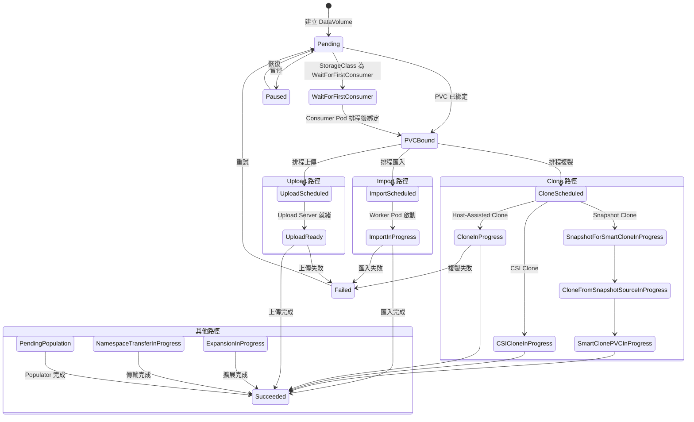

# CDI — 系統架構

本文基於 CDI（Containerized Data Importer）原始碼進行架構分析，所有內容皆引用真實檔案路徑。

::: info 原始碼位置
本文分析的原始碼位於 `containerized-data-importer/`，模組名稱為 `kubevirt.io/containerized-data-importer`。
:::

::: info 相關章節
- 各元件的核心資料處理邏輯請參閱 [核心功能分析](./core-features)
- 控制器架構與 CRD 型別定義請參閱 [控制器與 API](./controllers-api)
- 與外部系統的整合方式請參閱 [外部整合](./integration)
:::

## 專案概述

CDI 是一個 Kubernetes Operator，專門負責將虛擬機磁碟映像匯入至 PersistentVolumeClaim（PVC）中，為 KubeVirt 虛擬化平台提供儲存資料準備能力。

| 項目 | 說明 |
|------|------|
| **模組名稱** | `kubevirt.io/containerized-data-importer`（`go.mod`） |
| **Go 版本** | 1.24.0（`go.mod`） |
| **授權條款** | Apache License 2.0（`LICENSE`，Copyright 2017 The KubeVirt Authors） |
| **所屬生態系** | KubeVirt |
| **核心功能** | VM 磁碟映像匯入、PVC 複製、磁碟上傳 |

CDI 支援多種資料來源匯入，包括 HTTP/HTTPS、S3、GCS、Container Registry、oVirt ImageIO 及 VMware VDDK，並提供三種 PVC 複製策略。

## 系統架構圖



::: tip 架構要點
CDI 採用典型的 Kubernetes Operator 模式：**控制平面**（Operator、Controller、API Server）負責協調，**資料平面**（Importer、Cloner、Upload Server）以短生命週期 Pod 執行實際資料搬移。
:::

## 9 個 Binary / 容器映像

CDI 專案在 `cmd/` 目錄下定義了 9 個獨立的二進位執行檔，每個都對應一個容器映像：

| Binary | 原始碼路徑 | 角色 | 執行方式 |
|--------|-----------|------|---------|
| **cdi-operator** | `cmd/cdi-operator/` | CDI 部署生命週期管理，負責安裝、升級、移除所有 CDI 元件 | Deployment |
| **cdi-controller** | `cmd/cdi-controller/` | 核心控制器，負責 DataVolume 協調、建立 Worker Pod | Deployment |
| **cdi-apiserver** | `cmd/cdi-apiserver/` | 擴充 API Server，提供 Webhook 驗證、Upload Token 簽發 | Deployment |
| **cdi-importer** | `cmd/cdi-importer/` | 資料匯入 Worker Pod，支援 HTTP/S3/GCS/Registry/ImageIO/VDDK | Pod（短生命週期） |
| **cdi-cloner** | `cmd/cdi-cloner/` | PVC 複製 Worker Pod，執行 Host-Assisted Clone | Pod（短生命週期） |
| **cdi-uploadproxy** | `cmd/cdi-uploadproxy/` | 上傳代理服務，驗證 Token 並轉發至 Upload Server | Deployment |
| **cdi-uploadserver** | `cmd/cdi-uploadserver/` | 上傳接收伺服器，接收資料並寫入 PVC | Pod（短生命週期） |
| **ovirt-populator** | `cmd/ovirt-populator/` | oVirt Volume Populator，透過 ImageIO 協定匯入 oVirt 磁碟 | Pod（短生命週期） |
| **openstack-populator** | `cmd/openstack-populator/` | OpenStack Volume Populator，匯入 OpenStack Cinder Volume | Pod（短生命週期） |

::: info 長駐服務 vs Worker Pod
`cdi-operator`、`cdi-controller`、`cdi-apiserver`、`cdi-uploadproxy` 為長駐 Deployment；而 `cdi-importer`、`cdi-cloner`、`cdi-uploadserver`、`ovirt-populator`、`openstack-populator` 為短生命週期 Worker Pod，由 Controller 按需建立，任務完成後即銷毀。
:::

## 核心套件結構（`pkg/`）

### pkg/controller/ — 控制器邏輯

`pkg/controller/` 是 CDI 最核心的套件，包含 5 個子目錄，負責所有資源的協調邏輯：

| 子目錄 | 說明 |
|--------|------|
| `pkg/controller/datavolume/` | DataVolume 主協調器，處理匯入、複製、上傳三種工作流程 |
| `pkg/controller/clone/` | Clone 策略規劃器，支援 CSI Clone、Snapshot Clone、Host-Assisted Clone |
| `pkg/controller/populators/` | Volume Populator 控制器 |
| `pkg/controller/transfer/` | ObjectTransfer 跨命名空間傳輸控制器 |
| `pkg/controller/common/` | 通用工具函式與基礎控制器 |

### pkg/controller/clone/ — Clone 策略規劃器

CDI 支援三種 PVC 複製策略，定義於 `pkg/controller/clone/` 中：

```
pkg/controller/clone/
├── planner.go          # 策略選擇規劃器，ChooseStrategy() 方法
├── csi-clone.go        # CSI Volume Clone 策略
├── snap-clone.go       # Snapshot-based Clone 策略
├── host-clone.go       # Host-Assisted Clone（fallback）
├── common.go           # 通用工具，GetGlobalCloneStrategyOverride()
├── prep-claim.go       # PVC 準備邏輯
├── snapshot.go         # Snapshot 處理
├── rebind.go           # Claim 重新綁定邏輯
└── types.go            # 策略常數定義
```

策略常數定義於 `pkg/controller/clone/types.go`：

| 策略 | 常數值 | 說明 |
|------|--------|------|
| `CloneStrategyCsiClone` | `"csi-clone"` | 利用 CSI Driver 原生 Clone 能力，效能最佳 |
| `CloneStrategySnapshot` | `"snapshot"` | 透過 VolumeSnapshot 建立克隆，需要 Snapshot 支援 |
| `CloneStrategyHostAssisted` | `"copy"` | 主機輔助複製，相容性最高但速度最慢 |

### pkg/importer/ — 資料來源實作

`pkg/importer/` 以扁平結構存放約 31 個 Go 原始檔，涵蓋所有資料匯入的核心邏輯：

| 檔案 | 說明 |
|------|------|
| `pkg/importer/http-datasource.go` | HTTP/HTTPS 資料來源 |
| `pkg/importer/s3-datasource.go` | Amazon S3 資料來源 |
| `pkg/importer/gcs-datasource.go` | Google Cloud Storage 資料來源 |
| `pkg/importer/registry-datasource.go` | Container Registry（OCI Image）資料來源 |
| `pkg/importer/imageio-datasource.go` | oVirt ImageIO 資料來源 |
| `pkg/importer/vddk-datasource_amd64.go` | VMware VDDK 資料來源（amd64） |
| `pkg/importer/upload-datasource.go` | Upload 資料來源 |
| `pkg/importer/data-processor.go` | 核心資料處理管線 |
| `pkg/importer/format-readers.go` | 格式讀取器（qcow2、raw、vmdk 等） |
| `pkg/importer/transport.go` | 傳輸層抽象 |

::: tip VDDK 多架構支援
VDDK 資料來源依據 CPU 架構提供不同實作：`vddk-datasource_amd64.go`、`vddk-datasource_arm64.go`、`vddk-datasource_s390x.go`。
:::

### 其他關鍵套件

| 套件 | 說明 |
|------|------|
| `pkg/operator/` | Operator 協調邏輯，含 `controller/`（19 個控制器檔案）與 `resources/`（CRD 生成、資源模板） |
| `pkg/apiserver/` | API Server 實作，含 `webhooks/` 子目錄提供驗證與變異 Webhook |
| `pkg/image/` | QEMU 與 nbdkit 映像轉換工具（`qemu.go`、`nbdkit.go`、`validate.go`） |
| `pkg/uploadserver/` | Upload Server 核心邏輯（`uploadserver.go`） |
| `pkg/uploadproxy/` | Upload Proxy 核心邏輯（`uploadproxy.go`） |
| `pkg/token/` | JWT Token 管理，用於 Upload Token 簽發與驗證（`token.go`） |

## CRD 資源總覽

CDI 在 `staging/src/kubevirt.io/containerized-data-importer-api/pkg/apis/core/v1beta1/register.go` 中註冊了 10 種 CRD 資源：

| CRD | 範圍 | 說明 |
|-----|------|------|
| **DataVolume** | Namespaced | 核心資源，宣告式定義資料匯入、複製或上傳操作 |
| **CDI** | Cluster | Operator CR，代表整個 CDI 部署實例 |
| **CDIConfig** | Cluster | 全域設定，控制 Scratch Space、Proxy、TLS 等參數 |
| **StorageProfile** | Cluster | 每個 StorageClass 的建議設定（存取模式、Volume 模式、Clone 策略） |
| **DataSource** | Namespaced | 可重複使用的資料來源參考，指向特定 PVC 或 Snapshot |
| **DataImportCron** | Namespaced | 排程匯入，定期從外部來源更新磁碟映像 |
| **ObjectTransfer** | Cluster | 跨命名空間資源傳輸（PVC 或 DataVolume） |
| **VolumeImportSource** | Namespaced | Volume Populator 匯入來源定義 |
| **VolumeUploadSource** | Namespaced | Volume Populator 上傳來源定義 |
| **VolumeCloneSource** | Namespaced | Volume Populator 複製來源定義 |

::: warning 注意
`DataVolume` 是使用者最常接觸的 CRD——建立一個 DataVolume 即可觸發完整的資料匯入/複製/上傳流程。CDI Controller 會自動建立對應的 PVC 與 Worker Pod。
:::

## 建置系統

CDI 採用 **Bazel + Make** 混合建置系統。專案中包含大量 `BUILD.bazel` 檔案（約 1,467 個），Makefile 則作為開發者入口提供便捷指令。

### 關鍵建置指令

| 指令 | 說明 | 來源 |
|------|------|------|
| `make bazel-build` | 使用 Bazel 建置所有 Go 二進位檔 | `Makefile` |
| `make bazel-build-images` | 建置所有容器映像 | `Makefile` |
| `make bazel-push-images` | 推送映像至 Registry | `Makefile` |
| `make test` | 執行所有測試 | `Makefile` |
| `make test-unit` | 執行單元測試 | `Makefile` |
| `make test-functional` | 執行功能測試 | `Makefile` |
| `make cluster-up` | 啟動本地 Kubernetes 叢集 | `Makefile` |
| `make cluster-sync` | 建置並部署至執行中的叢集 | `Makefile` |
| `make cluster-down` | 停止叢集 | `Makefile` |
| `make manifests` | 產生 CDI Controller 與 Operator Manifest | `Makefile` |
| `make generate` | 重新產生所有生成檔案 | `Makefile` |
| `make format` | 格式化 Shell 與 Go 原始碼 | `Makefile` |
| `make vet` | Lint 所有 CDI 套件 | `Makefile` |

## DataVolume 生命週期狀態機

DataVolume 的狀態（Phase）定義於 `staging/src/kubevirt.io/containerized-data-importer-api/pkg/apis/core/v1beta1/types.go`，共計 21 種狀態：



### 狀態完整列表

| 狀態 | 常數值 | 說明 |
|------|--------|------|
| `PhaseUnset` | `""` | 初始未設定狀態 |
| `Pending` | `"Pending"` | DataVolume 已建立，等待處理 |
| `PVCBound` | `"PVCBound"` | 對應的 PVC 已成功綁定 |
| `WaitForFirstConsumer` | `"WaitForFirstConsumer"` | 等待 Consumer Pod 排程（延遲綁定） |
| `PendingPopulation` | `"PendingPopulation"` | 等待 Volume Populator 處理 |
| `ImportScheduled` | `"ImportScheduled"` | 匯入已排程 |
| `ImportInProgress` | `"ImportInProgress"` | 匯入進行中 |
| `CloneScheduled` | `"CloneScheduled"` | 複製已排程 |
| `CloneInProgress` | `"CloneInProgress"` | Host-Assisted Clone 進行中 |
| `CloneFromSnapshotSourceInProgress` | `"CloneFromSnapshotSourceInProgress"` | 從 Snapshot 來源複製中 |
| `SnapshotForSmartCloneInProgress` | `"SnapshotForSmartCloneInProgress"` | Smart Clone Snapshot 建立中 |
| `SmartClonePVCInProgress` | `"SmartClonePVCInProgress"` | Smart Clone PVC 建立中 |
| `CSICloneInProgress` | `"CSICloneInProgress"` | CSI Clone 進行中 |
| `ExpansionInProgress` | `"ExpansionInProgress"` | Volume 擴展中 |
| `NamespaceTransferInProgress` | `"NamespaceTransferInProgress"` | 跨命名空間傳輸中 |
| `UploadScheduled` | `"UploadScheduled"` | 上傳已排程 |
| `UploadReady` | `"UploadReady"` | Upload Server 就緒，等待資料上傳 |
| `Succeeded` | `"Succeeded"` | 操作成功完成 |
| `Failed` | `"Failed"` | 操作失敗 |
| `Paused` | `"Paused"` | 操作已暫停 |
| `Unknown` | `"Unknown"` | 未知狀態 |
