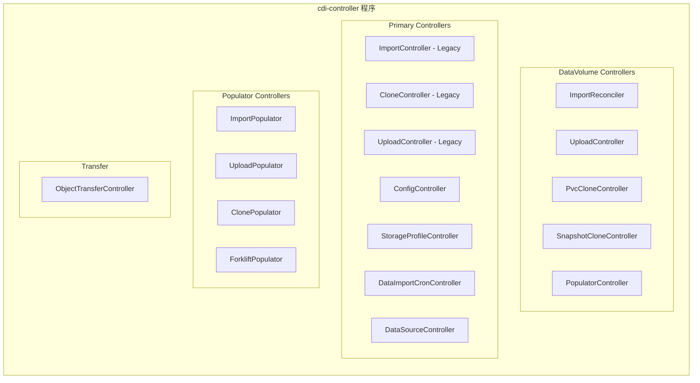
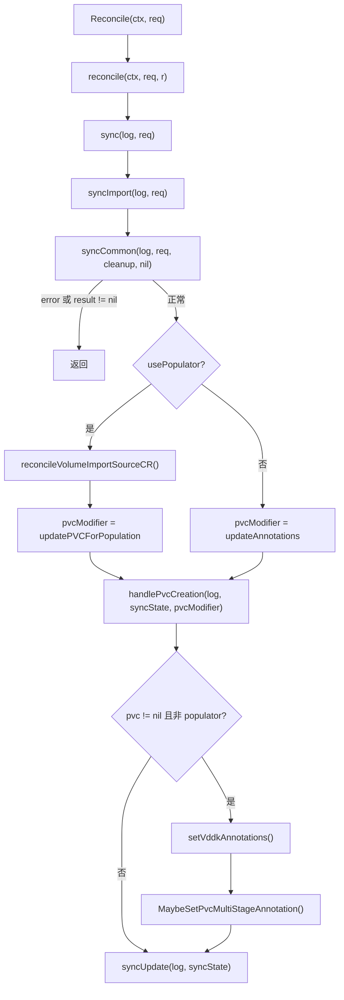
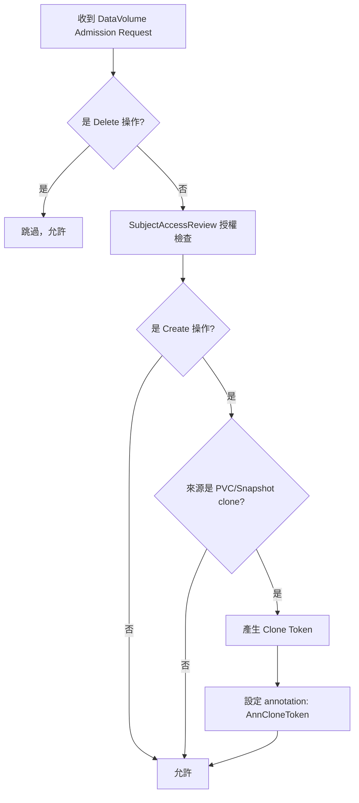
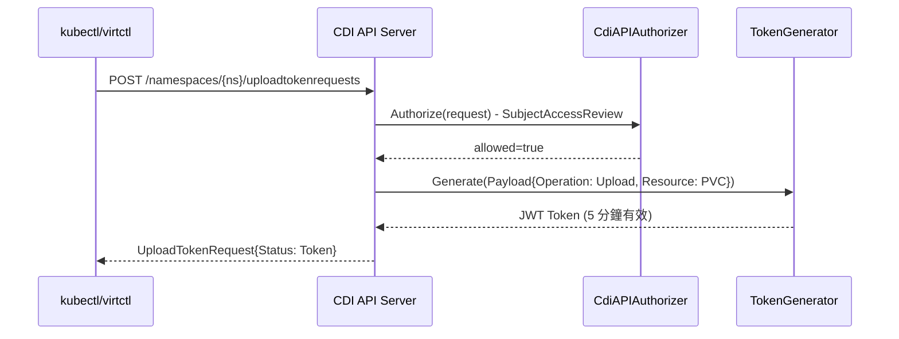
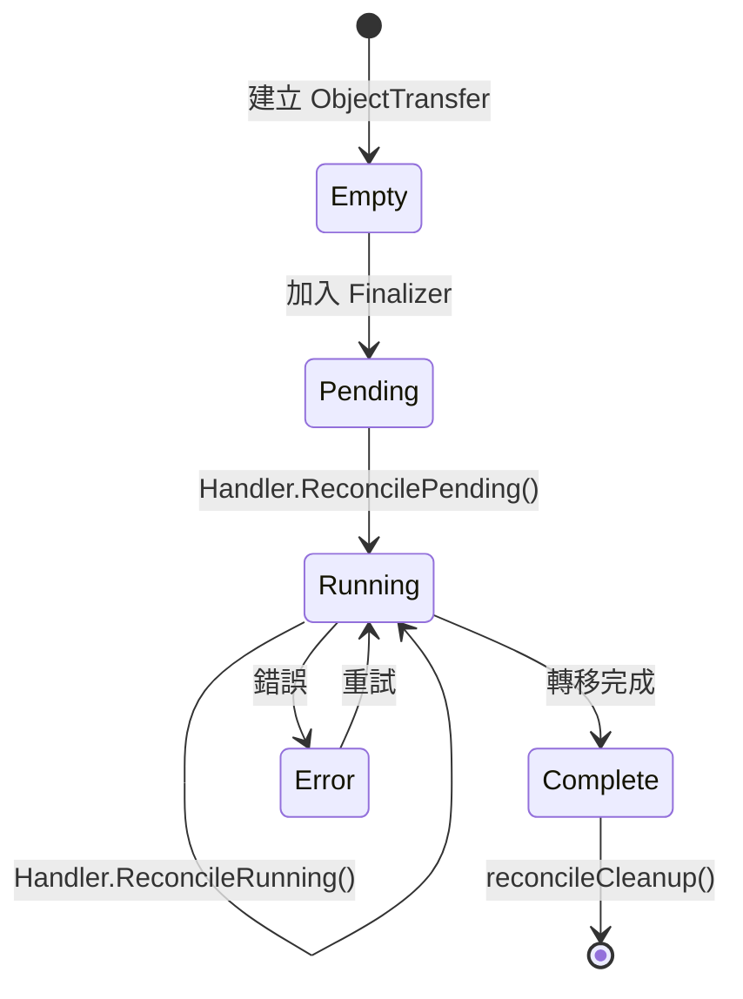

# CDI — 控制器與 API

本文深入分析 CDI 的控制器架構、CRD 型別定義、Webhook 機制與 API Server，所有程式碼參考均來自實際原始碼。

::: info 相關章節
- 系統整體架構與 Binary 說明請參閱 [系統架構](./architecture)
- 各控制器觸發的實際資料處理邏輯請參閱 [核心功能分析](./core-features)
- 外部整合的認證與 RBAC 細節請參閱 [外部整合](./integration)
:::

## 控制器總覽

CDI 在 `cmd/cdi-controller/controller.go`（約第 248-336 行）中註冊所有控制器。整體可分為五大類：



### 控制器註冊表

以下列出 `cmd/cdi-controller/controller.go` 中所有控制器的註冊順序：

| # | 控制器 | 函式呼叫 | 來源套件 |
|---|--------|----------|----------|
| 1 | ConfigController | `controller.NewConfigController()` | `pkg/controller/` |
| 2 | StorageProfileController | `controller.NewStorageProfileController()` | `pkg/controller/` |
| 3 | **DV ImportController** | `dvc.NewImportController()` | `pkg/controller/datavolume/` |
| 4 | **DV UploadController** | `dvc.NewUploadController()` | `pkg/controller/datavolume/` |
| 5 | **DV PvcCloneController** | `dvc.NewPvcCloneController()` | `pkg/controller/datavolume/` |
| 6 | **DV SnapshotCloneController** | `dvc.NewSnapshotCloneController()` | `pkg/controller/datavolume/` |
| 7 | **DV PopulatorController** | `dvc.NewPopulatorController()` | `pkg/controller/datavolume/` |
| 8 | ImportController (Legacy) | `controller.NewImportController()` | `pkg/controller/` |
| 9 | CloneController (Legacy) | `controller.NewCloneController()` | `pkg/controller/` |
| 10 | UploadController (Legacy) | `controller.NewUploadController()` | `pkg/controller/` |
| 11 | ObjectTransferController | `transfer.NewObjectTransferController()` | `pkg/controller/transfer/` |
| 12 | DataImportCronController | `controller.NewDataImportCronController()` | `pkg/controller/` |
| 13 | DataSourceController | `controller.NewDataSourceController()` | `pkg/controller/` |
| 14 | ImportPopulator | `populators.NewImportPopulator()` | `pkg/controller/populators/` |
| 15 | UploadPopulator | `populators.NewUploadPopulator()` | `pkg/controller/populators/` |
| 16 | ClonePopulator | `populators.NewClonePopulator()` | `pkg/controller/populators/` |
| 17 | ForkliftPopulator | `populators.NewForkliftPopulator()` | `pkg/controller/populators/` |

::: tip 設計概念
CDI 採用「雙層控制器」架構：
- **DataVolume 控制器**（#3-7）：負責解析 DataVolume CR 並建立對應的 PVC
- **Primary 控制器**（#8-10）：直接監聽 PVC 上的 annotation，啟動實際的 importer/cloner/uploader Pod
- **Populator 控制器**（#14-17）：使用 Kubernetes Volume Populator 機制，為 PVC 提供資料來源
:::

### 註冊程式碼範例

```go
// cmd/cdi-controller/controller.go (第 248-251 行)
if _, err := controller.NewConfigController(mgr, log, uploadProxyServiceName,
    configName, installerLabels); err != nil {
    klog.Errorf("Unable to setup config controller: %v", err)
    os.Exit(1)
}

// 第 268-271 行 — DataVolume Import Controller
if _, err := dvc.NewImportController(ctx, mgr, log, installerLabels); err != nil {
    klog.Errorf("Unable to setup datavolume import controller: %v", err)
    os.Exit(1)
}
```

## DataVolume Import Controller 深入分析

`ImportReconciler` 是 CDI 中最核心的控制器之一，負責處理從 HTTP/S3/Registry 等來源匯入磁碟映像到 PVC 的流程。

### ReconcilerBase 基礎結構

所有 DataVolume 控制器共享 `ReconcilerBase`，定義在 `pkg/controller/datavolume/controller-base.go`（第 121-129 行）：

```go
// ReconcilerBase members
type ReconcilerBase struct {
    client               client.Client
    recorder             record.EventRecorder
    scheme               *runtime.Scheme
    log                  logr.Logger
    featureGates         featuregates.FeatureGates
    installerLabels      map[string]string
    shouldUpdateProgress bool
}
```

| 欄位 | 用途 |
|------|------|
| `client` | controller-runtime 的 Kubernetes Client，用於 API 操作 |
| `recorder` | 事件記錄器，發送 Kubernetes Event |
| `scheme` | Runtime Scheme，處理物件序列化 |
| `log` | 結構化日誌 |
| `featureGates` | 功能開關（如 HonorWaitForFirstConsumer） |
| `installerLabels` | 安裝標籤（operator 管理用） |
| `shouldUpdateProgress` | 是否更新進度百分比 |

### ImportReconciler 結構

```go
// pkg/controller/datavolume/import-controller.go (第 71-73 行)
type ImportReconciler struct {
    ReconcilerBase
}
```

控制器建立時設定 `MaxConcurrentReconciles: 3`（第 97 行）：

```go
datavolumeController, err := controller.New(importControllerName, mgr, controller.Options{
    MaxConcurrentReconciles: 3,
    Reconciler:              reconciler,
})
```

### 調和流程（Reconciliation Flow）



### syncImport 核心邏輯

```go
// pkg/controller/datavolume/import-controller.go (第 196-221 行)
func (r *ImportReconciler) syncImport(log logr.Logger, req reconcile.Request) (dvSyncState, error) {
    // 1. 取得 DataVolume，檢查前置條件
    syncState, syncErr := r.syncCommon(log, req, r.cleanup, nil)
    if syncErr != nil || syncState.result != nil {
        return syncState, syncErr
    }

    // 2. 根據是否使用 populator 決定 PVC 修改策略
    pvcModifier := r.updateAnnotations
    if syncState.usePopulator {
        if r.shouldReconcileVolumeSourceCR(&syncState) {
            err := r.reconcileVolumeImportSourceCR(&syncState)
            if err != nil {
                return syncState, err
            }
        }
        pvcModifier = r.updatePVCForPopulation
    }

    // 3. 處理 PVC 建立
    if err := r.handlePvcCreation(log, &syncState, pvcModifier); err != nil {
        syncErr = err
    }

    // 4. 非 populator 模式下，設定 VDDK 及多階段匯入 annotation
    if syncState.pvc != nil && syncErr == nil && !syncState.usePopulator {
        r.setVddkAnnotations(&syncState)
        syncErr = cc.MaybeSetPvcMultiStageAnnotation(syncState.pvc,
            r.getCheckpointArgs(syncState.dvMutated))
    }
    return syncState, syncErr
}
```

### dvSyncState 結構

```go
// pkg/controller/datavolume/controller-base.go (第 110-118 行)
type dvSyncState struct {
    dv           *cdiv1.DataVolume
    dvMutated    *cdiv1.DataVolume
    pvc          *corev1.PersistentVolumeClaim
    pvcSpec      *corev1.PersistentVolumeClaimSpec
    snapshot     *snapshotv1.VolumeSnapshot
    dvSyncResult
    usePopulator bool
}
```

::: info dvSyncState 欄位說明
- `dv`：原始 DataVolume（作為比對基準）
- `dvMutated`：變更後的 DataVolume（用於 patch 更新）
- `pvc`：現有或新建的 PVC
- `pvcSpec`：DataVolume spec 轉換後的 PVC 規格
- `snapshot`：如果是 snapshot clone，對應的 VolumeSnapshot
- `usePopulator`：是否使用 Volume Populator 機制
:::

## CDI Operator Controller

Operator Controller 負責管理 CDI 的安裝與升級，定義在 `pkg/operator/controller/controller.go`。

### ReconcileCDI 結構

```go
// pkg/operator/controller/controller.go (第 178-200 行)
type ReconcileCDI struct {
    client         client.Client
    uncachedClient client.Client
    scheme         *runtime.Scheme
    getCache       func() cache.Cache
    recorder       record.EventRecorder
    controller     controller.Controller

    namespace      string
    clusterArgs    *cdicluster.FactoryArgs
    namespacedArgs *cdinamespaced.FactoryArgs

    certManager                   CertManager
    reconciler                    *sdkr.Reconciler
    dumpInstallStrategy           bool
    haveRoutes                    bool
    haveVolumeDataSourceValidator bool
}
```

### Reconcile 流程

```go
// pkg/operator/controller/controller.go (第 213-256 行)
func (r *ReconcileCDI) Reconcile(_ context.Context, request reconcile.Request) (reconcile.Result, error) {
    reqLogger := log.WithValues("Request.Namespace", request.Namespace,
                                "Request.Name", request.Name)
    reqLogger.Info("Reconciling CDI CR")
    operatorVersion := r.namespacedArgs.OperatorVersion
    cr := &cdiv1.CDI{}
    crKey := client.ObjectKey{Namespace: "", Name: request.NamespacedName.Name}
    err := r.client.Get(context.TODO(), crKey, cr)
    if err != nil {
        if errors.IsNotFound(err) {
            reqLogger.Info("CDI CR does not exist")
            return reconcile.Result{}, nil
        }
        return reconcile.Result{}, err
    }
    // ... dump install strategy 邏輯 ...

    // 設定 Ready/NotReady metric
    if conditionsv1.IsStatusConditionTrue(cr.Status.Conditions,
        conditionsv1.ConditionAvailable) {
        metrics.SetReady()
    } else if !conditionsv1.IsStatusConditionTrue(cr.Status.Conditions,
        conditionsv1.ConditionProgressing) {
        metrics.SetNotReady()
    }
    return r.reconciler.Reconcile(request, operatorVersion, reqLogger)
}
```

::: warning 重要觀察
CDI CR 是 **cluster-scoped** 資源（`Namespace: ""`），整個叢集只有一個 CDI 實例。Operator 透過 `r.reconciler.Reconcile()` 委派給 SDK reconciler 處理實際的資源建立與更新。
:::

### 資源管理

Operator 負責建立與管理兩類資源：

| 類別 | 來源路徑 | 包含資源 |
|------|----------|----------|
| **Cluster Resources** | `pkg/operator/resources/cluster/` | CRDs、ClusterRoles、ClusterRoleBindings |
| **Namespaced Resources** | `pkg/operator/resources/namespaced/` | Deployments、ServiceAccounts、Services、NetworkPolicies、PrometheusRules |

## CRD 型別定義

所有 CDI CRD 的 Go 型別定義位於：
`staging/src/kubevirt.io/containerized-data-importer-api/pkg/apis/core/v1beta1/types.go`

### DataVolume

```go
// types.go (第 36-43 行)
type DataVolume struct {
    metav1.TypeMeta   `json:",inline"`
    metav1.ObjectMeta `json:"metadata,omitempty"`

    Spec   DataVolumeSpec   `json:"spec"`
    Status DataVolumeStatus `json:"status,omitempty"`
}
```

### DataVolumeSpec

```go
// types.go (第 45-71 行)
type DataVolumeSpec struct {
    Source             *DataVolumeSource                `json:"source,omitempty"`
    SourceRef          *DataVolumeSourceRef             `json:"sourceRef,omitempty"`
    PVC                *corev1.PersistentVolumeClaimSpec `json:"pvc,omitempty"`
    Storage            *StorageSpec                     `json:"storage,omitempty"`
    PriorityClassName  string                           `json:"priorityClassName,omitempty"`
    ServiceAccountName string                           `json:"serviceAccountName,omitempty"`
    ContentType        DataVolumeContentType            `json:"contentType,omitempty"`
    Checkpoints        []DataVolumeCheckpoint           `json:"checkpoints,omitempty"`
    FinalCheckpoint    bool                             `json:"finalCheckpoint,omitempty"`
    Preallocation      *bool                            `json:"preallocation,omitempty"`
}
```

| 欄位 | 說明 |
|------|------|
| `Source` | 資料來源（HTTP/S3/Registry 等，詳見下方） |
| `SourceRef` | 間接引用 DataSource，支援共享來源定義 |
| `PVC` | 直接指定 PVC 規格（與 Storage 二擇一） |
| `Storage` | 儲存規格（CDI 會根據 StorageProfile 自動推斷參數） |
| `ContentType` | `"kubevirt"`（預設，qcow2→raw 轉換）或 `"archive"`（tar 解壓） |
| `Checkpoints` | 多階段匯入的檢查點列表（用於 VDDK 增量遷移） |
| `Preallocation` | 是否預先分配磁碟空間 |

### DataVolumeSource

```go
// types.go (第 132-144 行)
type DataVolumeSource struct {
    HTTP     *DataVolumeSourceHTTP     `json:"http,omitempty"`
    S3       *DataVolumeSourceS3       `json:"s3,omitempty"`
    GCS      *DataVolumeSourceGCS      `json:"gcs,omitempty"`
    Registry *DataVolumeSourceRegistry `json:"registry,omitempty"`
    PVC      *DataVolumeSourcePVC      `json:"pvc,omitempty"`
    Upload   *DataVolumeSourceUpload   `json:"upload,omitempty"`
    Blank    *DataVolumeBlankImage     `json:"blank,omitempty"`
    Imageio  *DataVolumeSourceImageIO  `json:"imageio,omitempty"`
    VDDK     *DataVolumeSourceVDDK     `json:"vddk,omitempty"`
    Snapshot *DataVolumeSourceSnapshot `json:"snapshot,omitempty"`
}
```

#### 各來源型別詳解

**HTTP 來源**（第 243-264 行）：

```go
type DataVolumeSourceHTTP struct {
    URL                string   `json:"url"`
    SecretRef          string   `json:"secretRef,omitempty"`
    CertConfigMap      string   `json:"certConfigMap,omitempty"`
    ExtraHeaders       []string `json:"extraHeaders,omitempty"`
    SecretExtraHeaders []string `json:"secretExtraHeaders,omitempty"`
    Checksum           string   `json:"checksum,omitempty"`
}
```

**S3 來源**（第 179-188 行）：

```go
type DataVolumeSourceS3 struct {
    URL           string `json:"url"`
    SecretRef     string `json:"secretRef,omitempty"`
    CertConfigMap string `json:"certConfigMap,omitempty"`
}
```

**GCS 來源**（第 190-196 行）：

```go
type DataVolumeSourceGCS struct {
    URL       string `json:"url"`
    SecretRef string `json:"secretRef,omitempty"`
}
```

**Registry 來源**（第 198-218 行）：

```go
type DataVolumeSourceRegistry struct {
    URL           *string             `json:"url,omitempty"`
    ImageStream   *string             `json:"imageStream,omitempty"`
    PullMethod    *RegistryPullMethod `json:"pullMethod,omitempty"`
    SecretRef     *string             `json:"secretRef,omitempty"`
    CertConfigMap *string             `json:"certConfigMap,omitempty"`
    Platform      *PlatformOptions    `json:"platform,omitempty"`
}
```

::: tip Registry PullMethod
- `"pod"`（預設）：啟動 importer Pod 拉取映像
- `"node"`：利用節點的 container runtime cache，避免重複下載
:::

**PVC Clone 來源**（第 146-152 行）：

```go
type DataVolumeSourcePVC struct {
    Namespace string `json:"namespace"`
    Name      string `json:"name"`
}
```

**Snapshot Clone 來源**（第 154-160 行）：

```go
type DataVolumeSourceSnapshot struct {
    Namespace string `json:"namespace"`
    Name      string `json:"name"`
}
```

**ImageIO 來源**（第 266-278 行）— 用於 oVirt 遷移：

```go
type DataVolumeSourceImageIO struct {
    URL                string `json:"url"`
    DiskID             string `json:"diskId"`
    SecretRef          string `json:"secretRef,omitempty"`
    CertConfigMap      string `json:"certConfigMap,omitempty"`
    InsecureSkipVerify *bool  `json:"insecureSkipVerify,omitempty"`
}
```

**VDDK 來源**（第 280-296 行）— 用於 VMware 遷移：

```go
type DataVolumeSourceVDDK struct {
    URL         string `json:"url,omitempty"`
    UUID        string `json:"uuid,omitempty"`
    BackingFile string `json:"backingFile,omitempty"`
    Thumbprint  string `json:"thumbprint,omitempty"`
    SecretRef   string `json:"secretRef,omitempty"`
    InitImageURL string `json:"initImageURL,omitempty"`
    ExtraArgs   string `json:"extraArgs,omitempty"`
}
```

**Upload / Blank**：空結構（marker type），僅作為來源類型識別。

### DataVolumeStatus

```go
// types.go (第 315-324 行)
type DataVolumeStatus struct {
    ClaimName    string                `json:"claimName,omitempty"`
    Phase        DataVolumePhase       `json:"phase,omitempty"`
    Progress     DataVolumeProgress    `json:"progress,omitempty"`
    RestartCount int32                 `json:"restartCount,omitempty"`
    Conditions   []DataVolumeCondition `json:"conditions,omitempty"`
}
```

### DataVolumeCondition

```go
// types.go (第 336-344 行)
type DataVolumeCondition struct {
    Type               DataVolumeConditionType `json:"type"`
    Status             corev1.ConditionStatus  `json:"status"`
    LastTransitionTime metav1.Time             `json:"lastTransitionTime,omitempty"`
    LastHeartbeatTime  metav1.Time             `json:"lastHeartbeatTime,omitempty"`
    Reason             string                  `json:"reason,omitempty"`
    Message            string                  `json:"message,omitempty"`
}
```

Condition Type 包含：`Ready`、`Bound`、`Running`。

### CDI（Operator CR）

```go
// types.go (第 848-855 行)
type CDI struct {
    metav1.TypeMeta   `json:",inline"`
    metav1.ObjectMeta `json:"metadata,omitempty"`

    Spec   CDISpec   `json:"spec"`
    Status CDIStatus `json:"status"`
}
```

### CDISpec

```go
// types.go (第 882-904 行)
type CDISpec struct {
    ImagePullPolicy       corev1.PullPolicy     `json:"imagePullPolicy,omitempty"`
    UninstallStrategy     *CDIUninstallStrategy  `json:"uninstallStrategy,omitempty"`
    Infra                 ComponentConfig        `json:"infra,omitempty"`
    Workloads             sdkapi.NodePlacement   `json:"workload,omitempty"`
    CustomizeComponents   CustomizeComponents    `json:"customizeComponents,omitempty"`
    CloneStrategyOverride *CDICloneStrategy      `json:"cloneStrategyOverride,omitempty"`
    Config                *CDIConfigSpec         `json:"config,omitempty"`
    CertConfig            *CDICertConfig         `json:"certConfig,omitempty"`
    PriorityClass         *CDIPriorityClass      `json:"priorityClass,omitempty"`
}
```

| 欄位 | 說明 |
|------|------|
| `ImagePullPolicy` | 容器映像拉取策略：`Always`/`IfNotPresent`/`Never` |
| `UninstallStrategy` | 解除安裝策略：`RemoveWorkloads` 或 `BlockUninstallIfWorkloadsExist` |
| `CloneStrategyOverride` | 克隆策略覆寫：`copy`/`snapshot`/`csi-clone` |
| `Config` | CDI 全域設定（見下方 CDIConfigSpec） |
| `CertConfig` | CA/Server/Client 憑證的 duration 與 renewBefore |

### CDIConfig

```go
// types.go (第 1026-1032 行)
type CDIConfig struct {
    metav1.TypeMeta   `json:",inline"`
    metav1.ObjectMeta `json:"metadata,omitempty"`

    Spec   CDIConfigSpec   `json:"spec"`
    Status CDIConfigStatus `json:"status,omitempty"`
}
```

**CDIConfigSpec** 的關鍵欄位（第 1047-1077 行）：

| 欄位 | 說明 |
|------|------|
| `UploadProxyURLOverride` | 覆寫 upload proxy 的 URL |
| `ImportProxy` | Importer Pod 的代理伺服器設定 |
| `ScratchSpaceStorageClass` | 暫存空間使用的 StorageClass |
| `PodResourceRequirements` | Importer/Cloner Pod 的資源限制 |
| `FeatureGates` | 啟用的功能開關列表 |
| `FilesystemOverhead` | 檔案系統額外開銷（預設 0.06，即 6%） |
| `Preallocation` | 全域預分配開關 |
| `InsecureRegistries` | 允許不驗證 TLS 的 registry 列表 |
| `TLSSecurityProfile` | TLS 安全設定檔 |
| `ImagePullSecrets` | 拉取容器映像的 Secret 引用 |

### StorageProfile

```go
// types.go (第 442-448 行)
type StorageProfile struct {
    metav1.TypeMeta   `json:",inline"`
    metav1.ObjectMeta `json:"metadata,omitempty"`

    Spec   StorageProfileSpec   `json:"spec"`
    Status StorageProfileStatus `json:"status,omitempty"`
}

// StorageProfileSpec (第 450-461 行)
type StorageProfileSpec struct {
    CloneStrategy              *CDICloneStrategy          `json:"cloneStrategy,omitempty"`
    ClaimPropertySets          []ClaimPropertySet         `json:"claimPropertySets,omitempty"`
    DataImportCronSourceFormat *DataImportCronSourceFormat `json:"dataImportCronSourceFormat,omitempty"`
    SnapshotClass              *string                    `json:"snapshotClass,omitempty"`
}
```

::: info StorageProfile 的用途
每個 StorageClass 都會自動產生一個對應的 StorageProfile。CDI 根據 StorageProfile 的 `ClaimPropertySets` 自動推斷 PVC 的 `accessModes` 和 `volumeMode`，使用者不需在 DataVolume 中手動指定。
:::

### DataImportCron

```go
// types.go (第 596-602 行)
type DataImportCron struct {
    metav1.TypeMeta   `json:",inline"`
    metav1.ObjectMeta `json:"metadata,omitempty"`

    Spec   DataImportCronSpec   `json:"spec"`
    Status DataImportCronStatus `json:"status,omitempty"`
}

// DataImportCronSpec (第 604-627 行)
type DataImportCronSpec struct {
    Template          DataVolume                      `json:"template"`
    Schedule          string                          `json:"schedule"`
    GarbageCollect    *DataImportCronGarbageCollect   `json:"garbageCollect,omitempty"`
    ImportsToKeep     *int32                          `json:"importsToKeep,omitempty"`
    ManagedDataSource string                          `json:"managedDataSource"`
    RetentionPolicy   *DataImportCronRetentionPolicy  `json:"retentionPolicy,omitempty"`
    ServiceAccountName *string                        `json:"serviceAccountName,omitempty"`
}
```

| 欄位 | 說明 |
|------|------|
| `Schedule` | Cron 表達式，定義輪詢頻率 |
| `Template` | 建立 DataVolume 的範本 |
| `GarbageCollect` | `"Outdated"`（預設）或 `"Never"` |
| `ImportsToKeep` | 保留的匯入 PVC 數量（預設 3） |
| `ManagedDataSource` | 此 cron 管理的 DataSource 名稱 |

## Webhook 機制

CDI 的 Webhook 定義在 `pkg/apiserver/webhooks/` 目錄下，包含驗證（Validating）與變更（Mutating）兩類。

### Webhook 列表

| 檔案 | 類型 | 路徑 | 說明 |
|------|------|------|------|
| `datavolume-validate.go` | Validating | `/datavolume-validate` | 驗證 DataVolume spec |
| `cdi-validate.go` | Validating | `/cdi-validate` | 驗證 CDI CR 設定 |
| `dataimportcron-validate.go` | Validating | `/dataimportcron-validate` | 驗證 DataImportCron |
| `populators-validate.go` | Validating | `/populator-validate` | 驗證 populator 資源 |
| `transfer-validate.go` | Validating | `/objecttransfer-validate` | 驗證 ObjectTransfer |
| `datavolume-mutate.go` | Mutating | `/datavolume-mutate` | Token 產生、跨 namespace 克隆授權 |
| `pvc-mutate.go` | Mutating | `/pvc-mutate` | StorageProfile 渲染、populator annotation |

### DataVolume Validating Webhook

```go
// pkg/apiserver/webhooks/datavolume-validate.go (第 47-52 行)
type dataVolumeValidatingWebhook struct {
    k8sClient               kubernetes.Interface
    cdiClient                cdiclient.Interface
    snapClient               snapclient.Interface
    controllerRuntimeClient  client.Client
}
```

**主要驗證項目**：
- PVC 或 Storage spec 必須存在（不能同時指定兩者）
- 儲存大小驗證（最小 1MiB）
- StorageClass 名稱格式檢查
- AccessModes 驗證
- Source/SourceRef 欄位合法性
- 各來源型別特定驗證（HTTP URL 格式、PVC 參考存在性等）
- **阻止建立重複名稱**：如果同名 PVC 已存在，拒絕建立 DataVolume
- **阻止 Spec 更新**：建立後 spec 不可變更（除了 Checkpoint 用於多階段遷移）

### DataVolume Mutating Webhook

```go
// pkg/apiserver/webhooks/datavolume-mutate.go (第 41-45 行)
type dataVolumeMutatingWebhook struct {
    k8sClient      kubernetes.Interface
    cdiClient      cdiclient.Interface
    tokenGenerator token.Generator
}
```

**變更邏輯**：



::: warning 跨 Namespace 克隆安全性
CDI 使用 `SubjectAccessReview` 驗證請求者是否有權讀取來源 namespace 的 PVC/Snapshot。通過驗證後，Mutating Webhook 產生一個帶有 `token.OperationClone` 的 JWT Token 並注入 DataVolume 的 annotation，後續控制器會驗證此 Token。
:::

### PVC Mutating Webhook

```go
// pkg/apiserver/webhooks/pvc-mutate.go (第 36-38 行)
type pvcMutatingWebhook struct {
    client client.Client
}
```

此 Webhook 僅處理 **Create** 操作，檢查 PVC 是否帶有 `PvcApplyStorageProfileLabel` 標籤。若有，呼叫 `RenderPvc()` 根據 StorageProfile 自動填充 AccessModes 和 VolumeMode。

## API Server

CDI API Server 定義在 `pkg/apiserver/apiserver.go`，提供自訂 API 端點與 Webhook 服務。

### 架構概覽

```go
// pkg/apiserver/apiserver.go (第 102-125 行)
type cdiAPIApp struct {
    bindAddress string
    bindPort    uint

    client                  kubernetes.Interface
    aggregatorClient        aggregatorclient.Interface
    cdiClient               cdiclient.Interface
    snapClient              snapclient.Interface
    controllerRuntimeClient client.Client

    privateSigningKey *rsa.PrivateKey
    container         *restful.Container
    authorizer        CdiAPIAuthorizer
    authConfigWatcher AuthConfigWatcher
    cdiConfigTLSWatcher cryptowatch.CdiConfigTLSWatcher
    certWarcher       CertWatcher
    tokenGenerator    token.Generator
    installerLabels   map[string]string
}
```

### API Group 與端點

| 項目 | 值 |
|------|-----|
| API Group | `upload.cdi.kubevirt.io` |
| API Version | `v1beta1` |
| Upload 端點 | `POST /namespaces/{namespace}/uploadtokenrequests` |

**Upload Token 產生流程**：



Token 有效期為 **5 分鐘**：

```go
func newUploadTokenGenerator(key *rsa.PrivateKey) token.Generator {
    return token.NewGenerator(common.UploadTokenIssuer, key, 5*time.Minute)
}
```

### Webhook 註冊

API Server 啟動時依序註冊所有 Webhook：

```go
// pkg/apiserver/apiserver.go (約第 190-223 行)
app.createDataVolumeValidatingWebhook()
app.createDataVolumeMutatingWebhook()
app.createPvcMutatingWebhook()
app.createCDIValidatingWebhook()
app.createObjectTransferValidatingWebhook()
app.createDataImportCronValidatingWebhook()
app.createPopulatorValidatingWebhook()
```

### TLS 設定

```go
func (app *cdiAPIApp) getTLSConfig() (*tls.Config, error) {
    authConfig := app.authConfigWatcher.GetAuthConfig()
    cryptoConfig := app.cdiConfigTLSWatcher.GetCdiTLSConfig()

    tlsConfig := &tls.Config{
        CipherSuites: cryptoConfig.CipherSuites,
        ClientCAs:    authConfig.CertPool,
        ClientAuth:   tls.VerifyClientCertIfGiven,
        MinVersion:   cryptoConfig.MinVersion,
        // 動態驗證客戶端憑證的 CN
        VerifyPeerCertificate: func(rawCerts [][]byte,
            verifiedChains [][]*x509.Certificate) error {
            // 驗證 Subject.CommonName 是否在白名單中
        },
    }
    return tlsConfig, nil
}
```

::: info TLS 安全特性
- 支援透過 `CDIConfigSpec.TLSSecurityProfile` 設定 cipher suite 與最低 TLS 版本
- 使用 `VerifyClientCertIfGiven` 模式，允許但不強制客戶端憑證
- 動態 TLS 設定：透過 `GetConfigForClient` callback 支援不停機更新
- 簽名金鑰存放在 Secret `cdi-api-signing-key` 中
:::

## Populator Controllers

Populator 控制器使用 Kubernetes [Volume Populator](https://kubernetes.io/docs/concepts/storage/persistent-volumes/#volume-populators-and-data-sources) 機制，取代傳統的 annotation-based 匯入方式。

### Populator 基礎結構

```go
// pkg/controller/populators/populator-base.go (第 51-60 行)
type ReconcilerBase struct {
    client          client.Client
    recorder        record.EventRecorder
    scheme          *runtime.Scheme
    log             logr.Logger
    featureGates    featuregates.FeatureGates
    sourceKind      string
    installerLabels map[string]string
}
```

### 四種 Populator

| Populator | 來源種類 | 用途 |
|-----------|----------|------|
| **ImportPopulator** | `VolumeImportSourceRef` | HTTP/S3/GCS/Registry 匯入 |
| **UploadPopulator** | `VolumeUploadSourceRef` | 直接上傳 |
| **ClonePopulator** | PVC / VolumeSnapshot | PVC 或 Snapshot 克隆 |
| **ForkliftPopulator** | `OvirtVolumePopulator` / `OpenstackVolumePopulator` | oVirt 與 OpenStack 虛擬機器遷移 |

**ForkliftPopulator** 特別值得注意——它屬於 `forklift.cdi.kubevirt.io` API Group，專門為 [Forklift](https://github.com/konveyor/forklift) 遷移工具提供支援：

```go
// pkg/controller/populators/forklift-populator.go (第 41 行)
const apiGroup = "forklift.cdi.kubevirt.io"

// 第 53-58 行
type ForkliftPopulatorReconciler struct {
    ReconcilerBase
    importerImage       string
    ovirtPopulatorImage string
}
```

## Transfer Controller

Transfer Controller 實作 `ObjectTransfer` CRD，支援跨 namespace 的 DataVolume/PVC 轉移。

### 狀態機

```go
// pkg/controller/transfer/controller.go (第 65-71 行)
type ObjectTransferReconciler struct {
    Client          client.Client
    Recorder        record.EventRecorder
    Scheme          *runtime.Scheme
    Log             logr.Logger
    InstallerLabels map[string]string
}
```



**Handler 選擇**（第 203-220 行）：

```go
func (r *ObjectTransferReconciler) getHandler(ot *cdiv1.ObjectTransfer) (transferHandler, error) {
    switch strings.ToLower(ot.Spec.Source.Kind) {
    case "datavolume":
        return &dataVolumeTransferHandler{...}, nil
    case "persistentvolumeclaim":
        return &pvcTransferHandler{...}, nil
    }
    return nil, fmt.Errorf("invalid kind %q", ot.Spec.Source.Kind)
}
```

## 輔助控制器

### StorageProfileController

```go
// pkg/controller/storageprofile-controller.go (第 62-70 行)
type StorageProfileReconciler struct {
    client          client.Client
    uncachedClient  client.Client
    recorder        record.EventRecorder
    scheme          *runtime.Scheme
    log             logr.Logger
    installerLabels map[string]string
}
```

**職責**：為每個 StorageClass 自動建立並維護 StorageProfile，包含：
- 克隆策略推薦（copy/snapshot/csi-clone）
- ClaimPropertySets（AccessModes + VolumeMode 組合）
- DataImportCron 來源格式
- VolumeSnapshotClass 對應

### DataImportCronController

```go
// pkg/controller/dataimportcron-controller.go (第 78-88 行)
type DataImportCronReconciler struct {
    client          client.Client
    uncachedClient  client.Client
    recorder        record.EventRecorder
    scheme          *runtime.Scheme
    log             logr.Logger
    image           string
    pullPolicy      string
    cdiNamespace    string
    installerLabels map[string]string
}
```

**職責**：根據 cron 排程定期檢查映像來源（Registry/HTTP）是否有更新，若有則建立新的 DataVolume 匯入，並管理舊版本的垃圾回收。

### CDIConfigController

```go
// pkg/controller/config-controller.go (第 64-75 行)
type CDIConfigReconciler struct {
    client                 client.Client
    uncachedClient         client.Client
    recorder               record.EventRecorder
    scheme                 *runtime.Scheme
    log                    logr.Logger
    uploadProxyServiceName string
    configName             string
    cdiNamespace           string
    installerLabels        map[string]string
}
```

**職責**：維護 CDIConfig 資源，同步以下設定：
- Upload Proxy URL（優先順序：Override → Ingress → Route）
- 預設 Pod 資源限制（CPU: 100m-750m，Memory: 60M-600M）
- Scratch Space StorageClass
- 檔案系統 overhead
- Import Proxy 設定

::: tip ConfigController 預設資源
```go
// pkg/controller/config-controller.go (第 55-58 行)
defaultCPULimit   = "750m"
defaultMemLimit   = "600M"
defaultCPURequest = "100m"
defaultMemRequest = "60M"
```
這些值會套用到所有 importer/cloner/uploader Pod，可透過 `CDIConfigSpec.PodResourceRequirements` 覆寫。
:::
