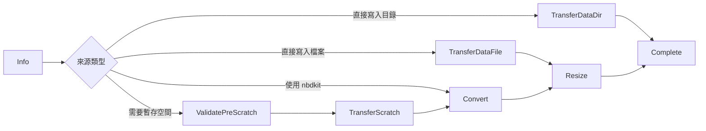
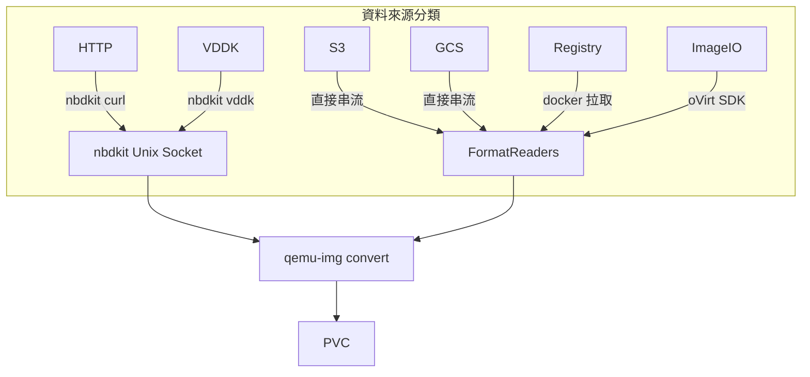
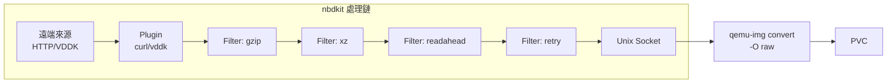
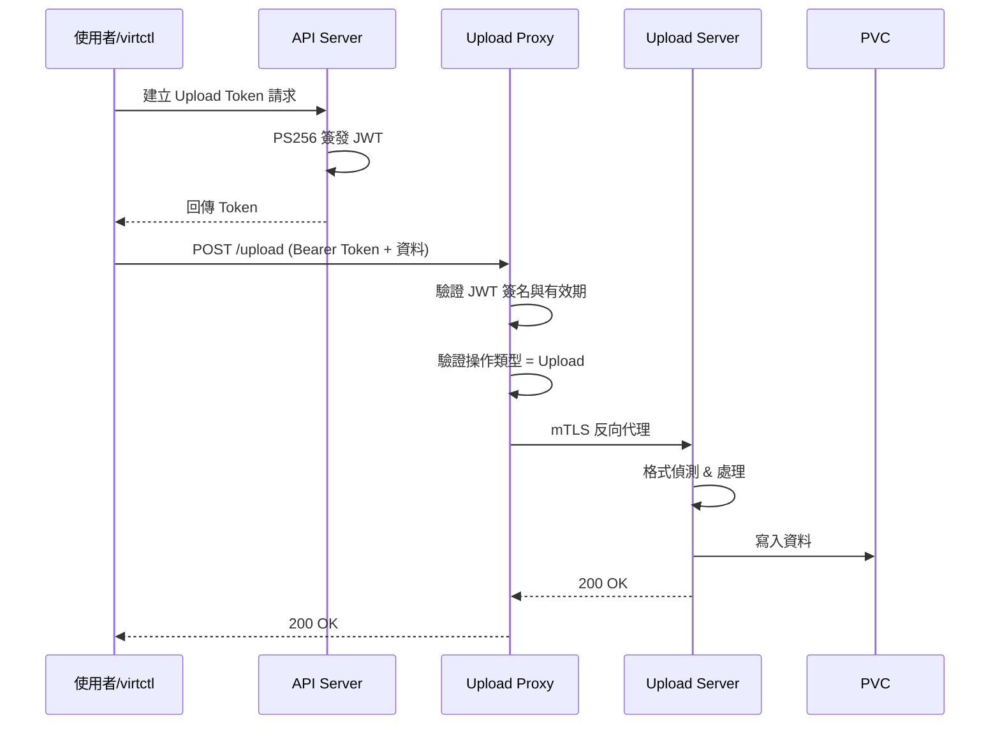
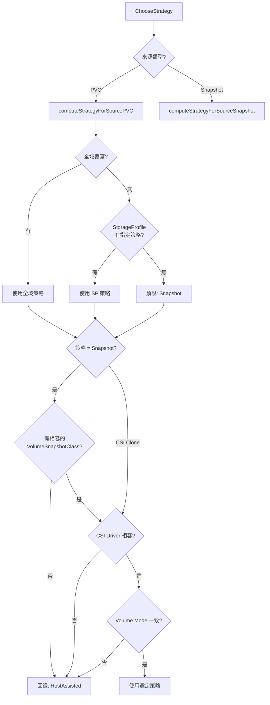
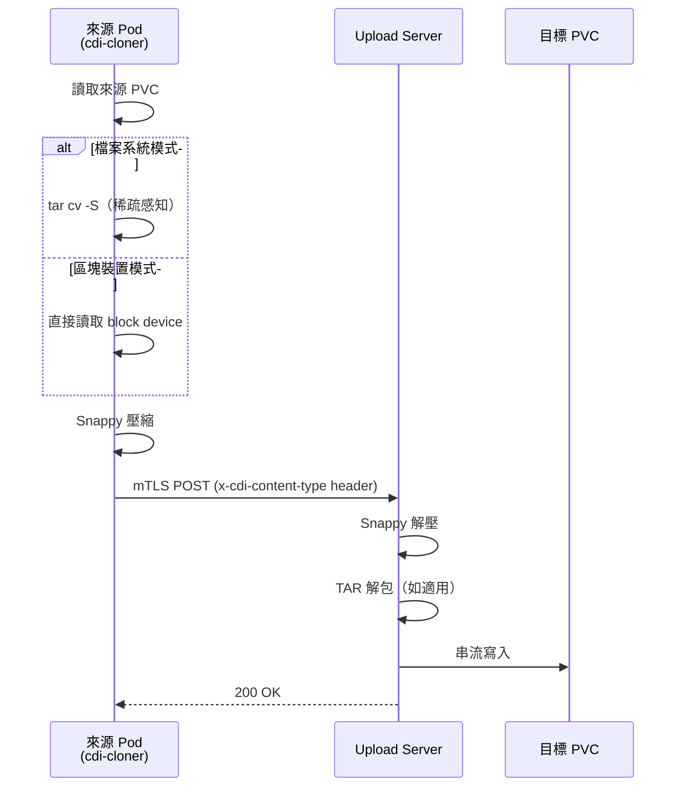
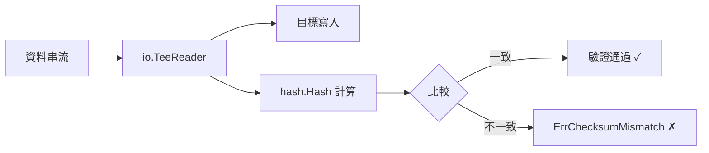

# CDI — 核心功能分析

CDI（Containerized Data Importer）的核心使命是將外部資料高效、可靠地匯入 Kubernetes PVC。本章深入分析 CDI 的六大核心功能：資料匯入、多來源支援、格式轉換、資料上傳、PVC 克隆，以及 Checksum 驗證機制。

::: info 相關章節
- 架構總覽與 Binary 說明請參閱 [系統架構](./architecture)
- 控制器如何觸發這些功能請參閱 [控制器與 API](./controllers-api)
- 與外部系統的整合請參閱 [外部整合](./integration)
:::

## 資料匯入機制（Import）

### 進入點與資料來源分派

CDI Importer 的執行起點位於 `cmd/cdi-importer/importer.go`，其中 `newDataSource()` 函式（第 274 行）根據環境變數 `source` 建立對應的 `DataSourceInterface` 實作：

```go
// cmd/cdi-importer/importer.go:274-336
func newDataSource(source string, contentType string, volumeMode v1.PersistentVolumeMode) importer.DataSourceInterface {
    ep, _ := util.ParseEnvVar(common.ImporterEndpoint, false)
    acc, _ := util.ParseEnvVar(common.ImporterAccessKeyID, false)
    sec, _ := util.ParseEnvVar(common.ImporterSecretKey, false)
    keyf, _ := util.ParseEnvVar(common.ImporterGoogleCredentialFileVar, false)
    diskID, _ := util.ParseEnvVar(common.ImporterDiskID, false)
    uuid, _ := util.ParseEnvVar(common.ImporterUUID, false)
    backingFile, _ := util.ParseEnvVar(common.ImporterBackingFile, false)
    certDir, _ := util.ParseEnvVar(common.ImporterCertDirVar, false)
    // ...
    switch source {
    case cc.SourceHTTP:
        ds, err := importer.NewHTTPDataSource(getHTTPEp(ep), acc, sec, certDir,
            cdiv1.DataVolumeContentType(contentType), checksum)
        return ds
    case cc.SourceImageio:
        ds, err := importer.NewImageioDataSource(ep, acc, sec, certDir,
            diskID, currentCheckpoint, previousCheckpoint, insecureTLS)
        return ds
    case cc.SourceRegistry:
        ds := importer.NewRegistryDataSource(ep, acc, sec,
            registryImageArchitecture, certDir, insecureTLS)
        return ds
    case cc.SourceS3:
        ds, err := importer.NewS3DataSource(ep, acc, sec, certDir)
        return ds
    case cc.SourceGCS:
        ds, err := importer.NewGCSDataSource(ep, keyf)
        return ds
    case cc.SourceVDDK:
        ds, err := importer.NewVDDKDataSource(ep, acc, sec, thumbprint, uuid,
            backingFile, currentCheckpoint, previousCheckpoint, finalCheckpoint, volumeMode)
        return ds
    default:
        klog.Errorf("Unknown source type %s\n", source)
        os.Exit(1)
    }
    return nil
}
```

::: tip 來源類型對應表
| 環境變數值 | DataSource 實作 | 用途 |
|---|---|---|
| `SourceHTTP` | `NewHTTPDataSource` | HTTP/HTTPS 下載 |
| `SourceS3` | `NewS3DataSource` | AWS S3 相容儲存 |
| `SourceGCS` | `NewGCSDataSource` | Google Cloud Storage |
| `SourceRegistry` | `NewRegistryDataSource` | OCI 容器映像庫 |
| `SourceImageio` | `NewImageioDataSource` | oVirt/RHV 映像傳輸 |
| `SourceVDDK` | `NewVDDKDataSource` | VMware vSphere VDDK |
:::

### DataSourceInterface 介面

所有資料來源都必須實作 `DataSourceInterface`（定義於 `pkg/importer/data-processor.go` 第 70-84 行）：

```go
// pkg/importer/data-processor.go:70-84
type DataSourceInterface interface {
    // Info 取得資料來源的初始資訊，決定下一步處理階段
    Info() (ProcessingPhase, error)
    // Transfer 將資料從來源傳輸到指定目錄
    Transfer(path string, preallocation bool) (ProcessingPhase, error)
    // TransferFile 將資料從來源直接傳輸到指定檔案
    TransferFile(fileName string, preallocation bool) (ProcessingPhase, error)
    // GetURL 回傳資料處理器可用於格式轉換的 URL
    GetURL() *url.URL
    // GetTerminationMessage 回傳序列化後用於 Pod 終止訊息的資料
    GetTerminationMessage() *common.TerminationMessage
    // Close 關閉所有 reader 或其他開啟的資源
    Close() error
}
```

::: info 設計重點
每個方法的回傳值都包含 `ProcessingPhase`，讓資料來源能主動告知處理器接下來該進入哪個階段。這種設計讓不同來源可以根據自身特性跳過不需要的階段。
:::

### 處理階段（Processing Phases）

CDI 定義了完整的處理階段列舉（第 38-64 行），驅動整個狀態機運作：

```go
// pkg/importer/data-processor.go:38-64
type ProcessingPhase string

const (
    ProcessingPhaseInfo              ProcessingPhase = "Info"
    ProcessingPhaseTransferScratch   ProcessingPhase = "TransferScratch"
    ProcessingPhaseTransferDataDir   ProcessingPhase = "TransferDataDir"
    ProcessingPhaseTransferDataFile  ProcessingPhase = "TransferDataFile"
    ProcessingPhaseValidatePause     ProcessingPhase = "ValidatePause"
    ProcessingPhaseValidatePreScratch ProcessingPhase = "ValidatePreScratch"
    ProcessingPhaseConvert           ProcessingPhase = "Convert"
    ProcessingPhaseResize            ProcessingPhase = "Resize"
    ProcessingPhaseComplete          ProcessingPhase = "Complete"
    ProcessingPhasePause             ProcessingPhase = "Pause"
    ProcessingPhaseError             ProcessingPhase = common.GenericError
    ProcessingPhaseMergeDelta        ProcessingPhase = "MergeDelta"
)
```

典型的階段流程如下：



### DataProcessor 狀態機

`DataProcessor` 結構體（第 92-119 行）是整個匯入流程的核心引擎，透過 `phaseExecutors` map 驅動狀態機轉換：

```go
// pkg/importer/data-processor.go:92-119
type DataProcessor struct {
    currentPhase         ProcessingPhase
    source               DataSourceInterface
    dataFile             string
    dataDir              string
    scratchDataDir       string
    requestImageSize     string
    availableSpace       int64
    filesystemOverhead   float64
    preallocation        bool
    preallocationApplied bool
    phaseExecutors       map[ProcessingPhase]func() (ProcessingPhase, error)
    cacheMode            string
}
```

`initDefaultPhases()` 方法（第 165 行）註冊每個階段的執行函式：

```go
// pkg/importer/data-processor.go:165-238（精簡版）
func (dp *DataProcessor) initDefaultPhases() {
    dp.phaseExecutors = make(map[ProcessingPhase]func() (ProcessingPhase, error))

    dp.RegisterPhaseExecutor(ProcessingPhaseInfo, func() (ProcessingPhase, error) {
        return dp.source.Info()
    })
    dp.RegisterPhaseExecutor(ProcessingPhaseTransferScratch, func() (ProcessingPhase, error) {
        return dp.source.Transfer(dp.scratchDataDir, dp.preallocation)
    })
    dp.RegisterPhaseExecutor(ProcessingPhaseTransferDataDir, func() (ProcessingPhase, error) {
        return dp.source.Transfer(dp.dataDir, dp.preallocation)
    })
    dp.RegisterPhaseExecutor(ProcessingPhaseTransferDataFile, func() (ProcessingPhase, error) {
        return dp.source.TransferFile(dp.dataFile, dp.preallocation)
    })
    dp.RegisterPhaseExecutor(ProcessingPhaseConvert, func() (ProcessingPhase, error) {
        return dp.convert(dp.source.GetURL())
    })
    dp.RegisterPhaseExecutor(ProcessingPhaseResize, func() (ProcessingPhase, error) {
        return dp.resize()
    })
    dp.RegisterPhaseExecutor(ProcessingPhaseMergeDelta, func() (ProcessingPhase, error) {
        return dp.merge()
    })
    // ...ValidatePause, ValidatePreScratch 等
}
```

主處理迴圈 `ProcessDataWithPause()`（第 241-263 行）不斷執行當前階段的 executor，直到完成或暫停：

```go
// pkg/importer/data-processor.go:241-263
func (dp *DataProcessor) ProcessDataWithPause() error {
    visited := make(map[ProcessingPhase]bool, len(dp.phaseExecutors))
    for dp.currentPhase != ProcessingPhaseComplete &&
        dp.currentPhase != ProcessingPhasePause {
        if visited[dp.currentPhase] {
            return errors.Errorf("loop detected on phase %s", dp.currentPhase)
        }
        executor, ok := dp.phaseExecutors[dp.currentPhase]
        if !ok {
            return errors.Errorf("Unknown processing phase %s", dp.currentPhase)
        }
        nextPhase, err := executor()
        visited[dp.currentPhase] = true
        if err != nil {
            return err
        }
        dp.currentPhase = nextPhase
    }
    return nil
}
```

::: warning 迴圈偵測
處理器使用 `visited` map 偵測是否有階段被重複進入，避免無限迴圈。如果同一階段被訪問兩次，立即回傳錯誤。
:::

## 各資料來源實作

### HTTP 資料來源

`pkg/importer/http-datasource.go` 中的 `HTTPDataSource` 透過 nbdkit 的 curl 插件提供高效的 HTTP 下載：

```go
// pkg/importer/http-datasource.go:66-89
type HTTPDataSource struct {
    httpReader        io.ReadCloser
    ctx               context.Context
    cancel            context.CancelFunc
    cancelLock        sync.Mutex
    contentType       cdiv1.DataVolumeContentType
    readers           *FormatReaders
    endpoint          *url.URL
    url               *url.URL
    customCA          string
    brokenForQemuImg  bool
    contentLength     uint64
    checksumValidator *ChecksumValidator
    n                 image.NbdkitOperation
}
```

HTTP 來源的 `Info()` 方法會根據內容類型決定處理路徑：
- **Archive 類型** → `ProcessingPhaseTransferDataDir`（直接解壓到目標目錄）
- **一般映像** → 啟動 nbdkit 後回傳 `ProcessingPhaseValidatePreScratch`（先驗證再傳輸到暫存空間）

nbdkit 透過建立 Unix socket（`/tmp/nbdkit.sock`），讓 `qemu-img` 直接從 NBD 協定讀取遠端 HTTP 資源，避免先下載再轉換的雙重 I/O。

### S3 資料來源

```go
// pkg/importer/s3-datasource.go:38-51
type S3DataSource struct {
    ep       *url.URL       // S3 endpoint
    accessKey string        // 存取金鑰
    secKey    string        // 密鑰
    s3Reader  io.ReadCloser // S3 讀取器
    readers   *FormatReaders
    url       *url.URL
}
```

S3 來源支援所有 S3 相容儲存（AWS S3、MinIO、Ceph RGW 等），透過 access key/secret key 進行認證，串流下載後進入標準的格式偵測與轉換流程。

### GCS 資料來源

```go
// pkg/importer/gcs-datasource.go:32-43
type GCSDataSource struct {
    ep        *url.URL
    keyFile   string         // Google 認證金鑰檔案
    gcsReader io.ReadCloser
    readers   *FormatReaders
    url       *url.URL
}
```

GCS 來源同時支援 `gs://` 和 `https://` 兩種 endpoint 格式，使用 Google Cloud SDK 客戶端進行認證與下載。

### Registry 資料來源

```go
// pkg/importer/registry-datasource.go:43-55
type RegistryDataSource struct {
    endpoint          string
    accessKey         string
    secKey            string
    imageArchitecture string    // 目標架構（如 amd64）
    certDir           string
    insecureTLS       bool
    imageDir          string
    url               *url.URL
    info              *types.ImageInspectInfo
}
```

Registry 來源使用 `docker://` 協定從 OCI 容器映像庫拉取映像。`Info()` 直接回傳 `ProcessingPhaseTransferScratch`，在 `Transfer()` 階段呼叫 `CopyRegistryImage()` 將映像拉取到暫存空間，再尋找其中的磁碟映像檔進行轉換。

### ImageIO 資料來源（oVirt/RHV）

```go
// pkg/importer/imageio-datasource.go:47-68
type ImageioDataSource struct {
    imageioReader    io.ReadCloser
    ctx              context.Context
    cancel           context.CancelFunc
    cancelLock       sync.Mutex
    cleanupLock      sync.Mutex
    cleanupDone      bool
    readers          *FormatReaders
    url              *url.URL
    contentLength    uint64
    imageTransfer    *ovirtsdk4.ImageTransfer  // oVirt 映像傳輸物件
    connection       ConnectionInterface        // oVirt 系統連線
    currentSnapshot  string                     // 當前快照 UUID
    previousSnapshot string                     // 前一個快照 UUID
}
```

ImageIO 來源專門處理 oVirt/RHV 平台的虛擬機遷移，支援**增量傳輸（delta copy）**——透過 `currentSnapshot` 和 `previousSnapshot` 實現多階段熱遷移（warm migration），傳輸完差異映像後進入 `ProcessingPhaseMergeDelta` 合併至基礎映像。

### VDDK 資料來源（VMware）

```go
// pkg/importer/vddk-datasource_amd64.go:815-823
type VDDKDataSource struct {
    VMware           *VMwareClient
    BackingFile      string
    NbdKit           *NbdKitWrapper
    CurrentSnapshot  string
    PreviousSnapshot string
    Size             uint64
    VolumeMode       v1.PersistentVolumeMode
}
```

VDDK 來源透過 VMware Virtual Disk Development Kit 連接 vSphere 平台，使用 nbdkit 的 VDDK 插件直接讀取虛擬磁碟。`Info()` 直接回傳 `ProcessingPhaseTransferDataFile`，在 `TransferFile()` 階段透過 nbdkit socket 進行資料傳輸，同樣支援快照式增量傳輸。



## 格式轉換與壓縮處理

### FormatReaders：自動偵測與解壓

`FormatReaders`（`pkg/importer/format-readers.go` 第 55-66 行）建立一個 reader 堆疊，自動偵測並處理壓縮與映像格式：

```go
// pkg/importer/format-readers.go:55-66
type FormatReaders struct {
    readers           []reader
    buf               []byte  // 持有檔案標頭
    Convert           bool    // 是否需要格式轉換
    Archived          bool    // 是否為壓縮檔
    ArchiveXz         bool    // xz 壓縮
    ArchiveGz         bool    // gzip 壓縮
    ArchiveZstd       bool    // zstd 壓縮
    progressReader    *prometheusutil.ProgressReader
    checksumValidator *ChecksumValidator
}
```

格式偵測透過 `fileFormatSelector()`（第 159-201 行）實現，根據檔案標頭 magic bytes 判斷格式：

```go
// pkg/importer/format-readers.go:159-201
func (fr *FormatReaders) fileFormatSelector(hdr *image.Header) {
    fFmt := hdr.Format
    switch fFmt {
    case "gz":
        r, err = fr.gzReader()
        fr.Archived = true
        fr.ArchiveGz = true
    case "zst":
        r, err = fr.zstReader()
        fr.Archived = true
        fr.ArchiveZstd = true
    case "xz":
        r, err = fr.xzReader()
        fr.Archived = true
        fr.ArchiveXz = true
    case "qcow2":
        r, err = fr.qcow2NopReader(hdr)
        fr.Convert = true
    case "vmdk":
        fr.Convert = true
    case "vdi":
        fr.Convert = true
    case "vhd":
        fr.Convert = true
    case "vhdx":
        fr.Convert = true
    }
}
```

::: tip 支援的壓縮與映像格式
**壓縮格式**：gzip、xz、zstd
**映像格式**（需轉換為 RAW）：QCOW2、VMDK、VDI、VHD、VHDX
:::

### QEMU 轉換操作

`pkg/image/qemu.go` 定義了 `QEMUOperations` 介面（第 61-70 行）與核心轉換函式：

```go
// pkg/image/qemu.go:61-70
type QEMUOperations interface {
    ConvertToRawStream(*url.URL, string, bool, string) error
    Resize(string, resource.Quantity, bool) error
    Info(url *url.URL) (*ImgInfo, error)
    Validate(*url.URL, int64) error
    CreateBlankImage(string, resource.Quantity, bool) error
    Rebase(backingFile string, delta string) error
    Commit(image string) error
}
```

`convertToRaw()`（第 107-132 行）是實際執行轉換的核心函式：

```go
// pkg/image/qemu.go:107-132
func convertToRaw(src, dest string, preallocate bool, cacheMode string) error {
    cacheMode, err := getCacheMode(dest, cacheMode)
    if err != nil {
        return err
    }
    args := []string{"convert", "-t", cacheMode, "-p", "-O", "raw", src, dest}

    if preallocate {
        err = addPreallocation(args, convertPreallocationMethods, func(args []string) ([]byte, error) {
            return qemuExecFunction(nil, reportProgress, "qemu-img", args...)
        })
    } else {
        _, err = qemuExecFunction(nil, reportProgress, "qemu-img", args...)
    }
    if err != nil {
        os.Remove(dest)
        return errors.Wrap(err, "could not convert image to raw")
    }
    return nil
}
```

預分配策略（第 83-91 行）會依序嘗試多種方法，確保最佳效能：

```go
// pkg/image/qemu.go:83-91
convertPreallocationMethods = [][]string{
    {"-o", "preallocation=falloc"},  // 優先：fallocate（最快）
    {"-o", "preallocation=full"},    // 備選：完整寫入
    {"-S", "0"},                     // 最後：停用稀疏偵測
}
```

CDI 支援的磁碟映像格式驗證函式（第 235-242 行）：

```go
// pkg/image/qemu.go:235-242
func isSupportedFormat(value string) bool {
    switch value {
    case "raw", "qcow2", "vmdk", "vdi", "vpc", "vhdx":
        return true
    default:
        return false
    }
}
```

### NBDKit：網路區塊裝置代理

`pkg/image/nbdkit.go` 中的 nbdkit 是 CDI 高效資料傳輸的關鍵元件，透過插件與過濾器架構提供靈活的資料來源代理：

```go
// pkg/image/nbdkit.go:38-54
// 插件（Plugins）
const (
    NbdkitCurlPlugin     NbdkitPlugin = "curl"   // HTTP/HTTPS 下載
    NbdkitFilePlugin     NbdkitPlugin = "file"   // 本地檔案
    NbdkitVddkPlugin     NbdkitPlugin = "vddk"   // VMware VDDK
)

// 過濾器（Filters）
const (
    NbdkitXzFilter           NbdkitFilter = "xz"           // xz 解壓
    NbdkitTarFilter          NbdkitFilter = "tar"          // tar 解包
    NbdkitGzipFilter         NbdkitFilter = "gzip"         // gzip 解壓
    NbdkitRetryFilter        NbdkitFilter = "retry"        // 重試機制
    NbdkitCacheExtentsFilter NbdkitFilter = "cacheextents" // 區段快取
    NbdkitReadAheadFilter    NbdkitFilter = "readahead"    // 預讀加速
)
```

nbdkit 啟動時建立 Unix socket 供 `qemu-img` 連接（第 268-340 行）：

```go
// pkg/image/nbdkit.go:268-340（精簡版）
func (n *Nbdkit) StartNbdkit(source string) error {
    argsNbdkit := []string{
        "--foreground",
        "--readonly",
        "--exit-with-parent",
        "-U", n.Socket,            // Unix socket 路徑
        "--pidfile", n.NbdPidFile,
    }
    // 堆疊過濾器
    for _, f := range n.filters {
        argsNbdkit = append(argsNbdkit, fmt.Sprintf("--filter=%s", f))
    }
    // 加入插件及其參數
    argsNbdkit = append(argsNbdkit, string(n.plugin))
    argsNbdkit = append(argsNbdkit, n.pluginArgs...)
    argsNbdkit = append(argsNbdkit, n.getSourceArg(source))

    n.c = exec.Command("nbdkit", argsNbdkit...)
    err = n.c.Start()
    err = waitForNbd(n.NbdPidFile) // 等待 PID 檔案出現（最多 15 秒）
    return nil
}
```



::: info nbdkit 的優勢
傳統做法需要先下載整個映像檔到暫存空間，再進行格式轉換。nbdkit 讓 `qemu-img` 透過 NBD 協定直接讀取遠端資料並串流轉換，**大幅減少暫存空間需求與 I/O 次數**。
:::

## 資料上傳機制（Upload）

CDI 的上傳機制由兩個元件協作：**Upload Proxy** 負責認證與路由，**Upload Server** 負責接收與寫入。

### Upload Proxy

`pkg/uploadproxy/uploadproxy.go` 中的 Upload Proxy 是叢集外部存取的入口：

```go
// pkg/uploadproxy/uploadproxy.go:69-88
type uploadProxyApp struct {
    bindAddress string
    bindPort    uint
    client      kubernetes.Interface
    cdiConfigTLSWatcher cryptowatch.CdiConfigTLSWatcher
    certWatcher    CertWatcher
    clientCreator  ClientCreator
    tokenValidator token.Validator   // JWT 驗證器
    handler        http.Handler
    urlResolver    urlLookupFunc
    uploadPossible uploadPossibleFunc
}
```

請求處理流程（第 184-239 行）：

```go
// pkg/uploadproxy/uploadproxy.go:184-239（精簡版）
func (app *uploadProxyApp) handleUploadRequest(w http.ResponseWriter, r *http.Request) {
    // 1. 提取 Authorization header
    tokenHeader := r.Header.Get("Authorization")

    // 2. 驗證 Bearer token 格式
    match := authHeaderMatcher.FindStringSubmatch(tokenHeader)

    // 3. 驗證 JWT 簽名與有效期
    tokenData, err := app.tokenValidator.Validate(match[1])

    // 4. 驗證 token 內容：必須是 Upload 操作，目標必須是 PVC
    if tokenData.Operation != token.OperationUpload ||
        tokenData.Name == "" ||
        tokenData.Namespace == "" ||
        tokenData.Resource.Resource != "persistentvolumeclaims" {
        w.WriteHeader(http.StatusBadRequest)
        return
    }

    // 5. 透過 mTLS 反向代理到 Upload Server
    app.proxyUploadRequest(uploadPath, w, r)
}
```

### Token 生成與驗證

`pkg/token/token.go` 定義了 JWT token 的結構與簽發機制：

```go
// pkg/token/token.go:33-51
const (
    OperationClone  Operation = "Clone"   // 克隆操作
    OperationUpload Operation = "Upload"  // 上傳操作
)

type Payload struct {
    Operation Operation                   `json:"operation,omitempty"`
    Name      string                      `json:"name,omitempty"`
    Namespace string                      `json:"namespace,omitempty"`
    Resource  metav1.GroupVersionResource `json:"resource,omitempty"`
    Params    map[string]string           `json:"params,omitempty"`
}
```

Token 使用 **PS256（RSA-PSS）** 演算法簽發，包含標準 JWT Claims：

```go
// pkg/token/token.go:112-129
func (g *generator) Generate(payload *Payload) (string, error) {
    signer, err := jose.NewSigner(
        jose.SigningKey{Algorithm: jose.PS256, Key: g.key}, nil)

    t := time.Now()
    return jwt.Signed(signer).
        Claims(payload).
        Claims(&jwt.Claims{
            Issuer:    g.issuer,
            IssuedAt:  jwt.NewNumericDate(t),
            NotBefore: jwt.NewNumericDate(t),
            Expiry:    jwt.NewNumericDate(t.Add(g.lifetime)),
        }).
        CompactSerialize()
}
```



::: warning Token 安全性
- 簽名演算法：PS256（RSA-PSS with SHA-256）
- 有效期限：由 `lifetime` 參數設定
- Proxy 與 Server 之間使用 **mTLS**（雙向 TLS 1.2+）通訊
- Token 包含目標 PVC 的 namespace 與名稱，確保精準授權
:::

## PVC 克隆機制（Clone）

CDI 提供三種克隆策略，根據儲存系統能力自動選擇最佳方案。

### 三種克隆策略



策略選擇邏輯位於 `pkg/controller/clone/planner.go`：

```go
// pkg/controller/clone/planner.go:156-167
func (p *Planner) ChooseStrategy(ctx context.Context, args *ChooseStrategyArgs) (*ChooseStrategyResult, error) {
    if IsDataSourcePVC(args.DataSource.Spec.Source.Kind) {
        return p.computeStrategyForSourcePVC(ctx, args)
    }
    if IsDataSourceSnapshot(args.DataSource.Spec.Source.Kind) {
        return p.computeStrategyForSourceSnapshot(ctx, args)
    }
    return nil, fmt.Errorf("unsupported datasource")
}
```

PVC 來源的策略判定（第 297-368 行）：

```go
// pkg/controller/clone/planner.go:297-368（精簡版）
func (p *Planner) computeStrategyForSourcePVC(ctx context.Context, args *ChooseStrategyArgs) (*ChooseStrategyResult, error) {
    res := &ChooseStrategyResult{}

    // 預設策略：Snapshot
    strategy := cdiv1.CloneStrategySnapshot

    // 1. 檢查全域覆寫
    cs, _ := GetGlobalCloneStrategyOverride(ctx, p.Client)
    if cs != nil {
        strategy = *cs
    } else if args.TargetClaim.Spec.StorageClassName != nil {
        // 2. 檢查 StorageProfile 中的策略設定
        sp := &cdiv1.StorageProfile{}
        exists, _ := getResource(ctx, p.Client, metav1.NamespaceNone,
            *args.TargetClaim.Spec.StorageClassName, sp)
        if exists && sp.Status.CloneStrategy != nil {
            strategy = *sp.Status.CloneStrategy
        }
    }

    // 3. Snapshot 策略需要相容的 VolumeSnapshotClass
    if strategy == cdiv1.CloneStrategySnapshot {
        n, _ := GetCompatibleVolumeSnapshotClass(ctx, p.Client, args.Log,
            p.Recorder, sourceClaim, args.TargetClaim)
        if n == nil {
            p.fallbackToHostAssisted(args.TargetClaim, res,
                NoVolumeSnapshotClass, MessageNoVolumeSnapshotClass)
            return res, nil
        }
    }

    // 4. Snapshot 或 CSI Clone 需要驗證進階條件
    res.Strategy = strategy
    if strategy == cdiv1.CloneStrategySnapshot ||
        strategy == cdiv1.CloneStrategyCsiClone {
        p.validateAdvancedClonePVC(ctx, args, res, sourceClaim)
    }
    return res, nil
}
```

進階驗證（第 477-518 行）檢查三個條件：

```go
// pkg/controller/clone/planner.go:477-518（精簡版）
func (p *Planner) validateAdvancedClonePVC(ctx context.Context, args *ChooseStrategyArgs,
    res *ChooseStrategyResult, sourceClaim *corev1.PersistentVolumeClaim) error {
    // 條件 1：來源與目標 PVC 的 CSI Driver 必須相同
    driver, _ := GetCommonDriver(ctx, p.Client, sourceClaim, args.TargetClaim)
    if driver == nil {
        p.fallbackToHostAssisted(args.TargetClaim, res,
            IncompatibleProvisioners, MessageIncompatibleProvisioners)
        return nil
    }

    // 條件 2：Volume Mode 必須一致
    if !SameVolumeMode(sourceClaim.Spec.VolumeMode, args.TargetClaim) {
        p.fallbackToHostAssisted(args.TargetClaim, res,
            IncompatibleVolumeModes, MessageIncompatibleVolumeModes)
        return nil
    }

    // 條件 3：目標大於來源時，StorageClass 必須支援擴展
    srcCapacity := sourceClaim.Status.Capacity[corev1.ResourceStorage]
    targetRequest := args.TargetClaim.Spec.Resources.Requests[corev1.ResourceStorage]
    allowExpansion := sc.AllowVolumeExpansion != nil && *sc.AllowVolumeExpansion
    if srcCapacity.Cmp(targetRequest) < 0 && !allowExpansion {
        p.fallbackToHostAssisted(args.TargetClaim, res,
            NoVolumeExpansion, MessageNoVolumeExpansion)
    }
    return nil
}
```

::: tip 三種策略比較
| 策略 | 實作方式 | 優點 | 限制 |
|---|---|---|---|
| **Snapshot** | VolumeSnapshot → 從快照建立 PVC | 最快、零資料搬移 | 需要 VolumeSnapshotClass |
| **CSI Clone** | PVC `dataSource` 直接引用來源 PVC | 儲存層級克隆 | 來源/目標必須同一 CSI Driver |
| **Host-Assisted** | cdi-cloner Pod TAR 串流至 Upload Server | 萬用、跨儲存 | 最慢、需要 Pod 資源 |
:::

### Host-Assisted 克隆流程

Host-Assisted 克隆透過 `cmd/cdi-cloner/clone-source.go` 實作，分為檔案系統克隆與區塊裝置克隆：

```go
// cmd/cdi-cloner/clone-source.go:198-217
func getInputStream(preallocation bool) io.ReadCloser {
    switch contentType {
    case "filesystem-clone":
        rc, err := newTarReader(preallocation)
        return rc
    case "blockdevice-clone":
        rc, err := os.Open(mountPoint)
        return rc
    }
    return nil
}
```

**檔案系統克隆**使用 TAR 串流，支援稀疏檔案優化（第 147-196 行）：

```go
// cmd/cdi-cloner/clone-source.go:147-196（精簡版）
func newTarReader(preallocation bool) (io.ReadCloser, error) {
    args := []string{"cv"}
    if !preallocation {
        // -S 啟用稀疏檔案偵測，僅在不要求預分配時使用
        args = append(args, "-S")
    }

    // 排除 lost+found 等無關目錄
    files, _ := os.ReadDir(mountPoint)
    for _, f := range files {
        if _, ok := excludeMap[f.Name()]; !ok {
            tarFiles = append(tarFiles, f.Name())
        }
    }
    args = append(args, tarFiles...)

    cmd := exec.Command("/usr/bin/tar", args...)
    cmd.Dir = mountPoint
    stdout, _ := cmd.StdoutPipe()
    cmd.Start()
    return &execReader{cmd: cmd, stdout: stdout, stderr: io.NopCloser(&stderr)}, nil
}
```

資料經 **Snappy 壓縮**後透過 mTLS HTTP POST 傳送（第 112-131 行、第 248-264 行）：

```go
// cmd/cdi-cloner/clone-source.go:112-131
func pipeToSnappy(reader io.ReadCloser) io.ReadCloser {
    pr, pw := io.Pipe()
    sbw := snappy.NewBufferedWriter(pw)
    go func() {
        n, err := io.Copy(sbw, reader)
        sbw.Close()
        pw.Close()
        klog.Infof("Wrote %d bytes\n", n)
    }()
    return pr
}

// cmd/cdi-cloner/clone-source.go:244-264（主流程）
progressReader, _ := createProgressReader(getInputStream(preallocation), ownerUID, uploadBytes)
reader := pipeToSnappy(progressReader)
client := createHTTPClient(clientKey, clientCert, serverCert) // mTLS 客戶端
req, _ := http.NewRequest(http.MethodPost, url, reader)
req.Header.Set("x-cdi-content-type", contentType)
response, err := client.Do(req)
```

mTLS 客戶端設定（第 72-91 行）：

```go
// cmd/cdi-cloner/clone-source.go:72-91
func createHTTPClient(clientKey, clientCert, serverCert []byte) *http.Client {
    clientKeyPair, _ := tls.X509KeyPair(clientCert, clientKey)
    caCertPool := x509.NewCertPool()
    caCertPool.AppendCertsFromPEM(serverCert)
    tlsConfig := &tls.Config{
        Certificates: []tls.Certificate{clientKeyPair},
        RootCAs:      caCertPool,
        MinVersion:   tls.VersionTLS12,
    }
    transport := &http.Transport{TLSClientConfig: tlsConfig}
    return &http.Client{Transport: transport}
}
```



## Checksum 驗證

CDI 支援在匯入過程中進行資料完整性驗證，定義於 `pkg/importer/checksum.go` 與 `pkg/util/checksum/checksum.go`。

### 支援的演算法

```go
// pkg/util/checksum/checksum.go:31-39
const (
    AlgorithmMD5    = "md5"     // 128 位元 → 32 hex 字元
    AlgorithmSHA1   = "sha1"    // 160 位元 → 40 hex 字元
    AlgorithmSHA256 = "sha256"  // 256 位元 → 64 hex 字元
    AlgorithmSHA512 = "sha512"  // 512 位元 → 128 hex 字元
)
```

### 格式與解析

Checksum 字串格式為 `"algorithm:hash"`（例如 `"sha256:abc123..."`），由 `ParseAndValidate()` 負責解析與驗證：

```go
// pkg/util/checksum/checksum.go:45-94（精簡版）
func ParseAndValidate(checksumStr string) (algorithm, hash string, err error) {
    parts := strings.SplitN(checksumStr, ":", 2)
    algorithm = strings.ToLower(strings.TrimSpace(parts[0]))
    hash = strings.ToLower(strings.TrimSpace(parts[1]))

    var expectedLen int
    switch algorithm {
    case AlgorithmMD5:    expectedLen = 32
    case AlgorithmSHA1:   expectedLen = 40
    case AlgorithmSHA256: expectedLen = 64
    case AlgorithmSHA512: expectedLen = 128
    }

    if len(hash) != expectedLen {
        return "", "", errors.Errorf("invalid %s hash length", algorithm)
    }
    // 驗證是否為合法的十六進位字串
    if _, err := hex.DecodeString(hash); err != nil {
        return "", "", errors.Errorf("checksum hash is not valid hexadecimal")
    }
    return algorithm, hash, nil
}
```

### 串流驗證機制

`ChecksumValidator` 使用 `io.TeeReader` 在資料傳輸的同時計算雜湊值，無需額外的讀取操作：

```go
// pkg/importer/checksum.go:40-94
type ChecksumValidator struct {
    algorithm        string
    expectedChecksum string
    hasher           hash.Hash
}

// GetReader 回傳一個同時計算雜湊的 Reader
func (cv *ChecksumValidator) GetReader(r io.Reader) io.Reader {
    return io.TeeReader(r, cv.hasher)  // 資料流經時同步寫入 hasher
}

// Validate 比較計算結果與預期值
func (cv *ChecksumValidator) Validate() error {
    calculatedChecksum := hex.EncodeToString(cv.hasher.Sum(nil))
    if calculatedChecksum != cv.expectedChecksum {
        return fmt.Errorf("%w: expected %s:%s, calculated %s:%s",
            ErrChecksumMismatch,
            cv.algorithm, cv.expectedChecksum,
            cv.algorithm, calculatedChecksum)
    }
    return nil
}
```



::: info 零額外 I/O
`io.TeeReader` 的巧妙之處在於它在資料流「經過」時同步計算雜湊，不需要額外讀取一次完整的資料。這對於數十 GB 的磁碟映像尤為重要。
:::
