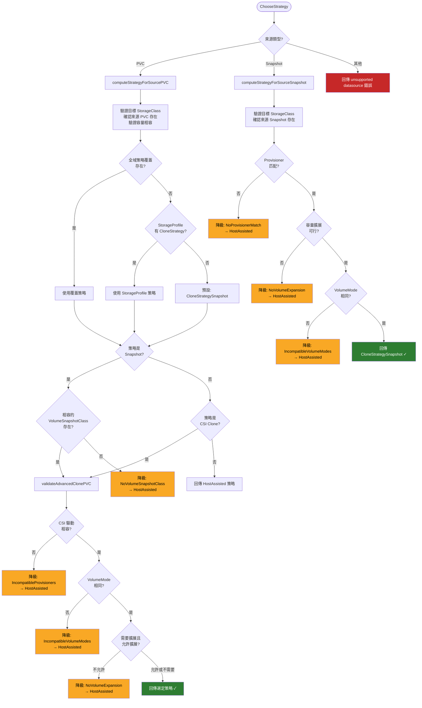

# CDI — 外部整合

CDI（Containerized Data Importer）作為獨立的 Kubernetes Operator，透過多個外部整合點與 KubeVirt 生態系、CSI 驅動、VolumeSnapshot 機制以及第三方遷移工具協同運作。本文深入分析這些整合的實際程式碼實作。

::: info 相關章節
- CDI 的系統架構與元件說明請參閱 [系統架構](./architecture)
- 整合過程中涉及的匯入/克隆機制請參閱 [核心功能分析](./core-features)
- 控制器如何協調這些整合請參閱 [控制器與 API](./controllers-api)
:::

## 與 KubeVirt 的整合

CDI 雖然是一個獨立部署的 Operator，但與 KubeVirt 生態系緊密耦合。兩者共享 annotation/label 命名空間，並透過 DataVolume CRD 進行協作。

### 共享的 Annotation 命名空間

在 `pkg/common/common.go` 中定義了兩個核心的 annotation key 前綴：

```go
// pkg/common/common.go (lines 193-196)

// KubeVirtAnnKey is part of a kubevirt.io key.
KubeVirtAnnKey = "kubevirt.io/"
// CDIAnnKey is part of a kubevirt.io key.
CDIAnnKey = "cdi.kubevirt.io/"
```

CDI 同時也使用 KubeVirt 生態系的 label，例如用於 NetworkPolicy 控制的：

```go
// pkg/common/common.go (line 331)

AllowAccessClusterServicesNPLabel = "np.kubevirt.io/allow-access-cluster-services"
```

::: tip 設計考量
CDI 的 annotation key `cdi.kubevirt.io/` 位於 `kubevirt.io` 的子網域下，而非使用獨立的頂層網域。這反映了 CDI 在架構上是 KubeVirt 生態系的組成部分，即使它作為獨立 Operator 部署。
:::

### ContentType 與磁碟格式轉換

CDI 的核心職責之一是為 KubeVirt VM 準備磁碟映像。`DataVolumeContentType` 決定了匯入資料的處理方式：

```go
// staging/src/kubevirt.io/containerized-data-importer-api/pkg/apis/core/v1beta1/types.go
// (lines 122-130)

// DataVolumeContentType represents the types of the imported data
type DataVolumeContentType string

const (
    // DataVolumeKubeVirt is the content-type of the imported file, defaults to kubevirt
    DataVolumeKubeVirt DataVolumeContentType = "kubevirt"
    // DataVolumeArchive is the content-type to specify if there is a need to extract the imported archive
    DataVolumeArchive DataVolumeContentType = "archive"
)
```

當 `contentType` 設為 `"kubevirt"`（預設值）時，CDI 會自動執行 QCOW2→RAW 格式轉換，使磁碟映像直接可供 KubeVirt VM 使用。

### 模組依賴關係

從 `go.mod` 可以看到 CDI 的模組路徑及與 KubeVirt 生態系的依賴：

```go
// go.mod (line 1)
module kubevirt.io/containerized-data-importer

// go.mod (line 26) - 使用 kubevirt monitoring 框架
github.com/kubevirt/monitoring/pkg/metrics/parser v0.0.0-20230627123556-81a891d4462a

// go.mod (lines 62-65)
kubevirt.io/containerized-data-importer-api v0.0.0
kubevirt.io/controller-lifecycle-operator-sdk v0.2.7
kubevirt.io/controller-lifecycle-operator-sdk/api v0.0.0-20220329064328-f3cc58c6ed90
kubevirt.io/qe-tools v0.1.8
```

::: info 協作模式
KubeVirt 建立 DataVolume 資源 → CDI 偵測並處理資料匯入/克隆 → 最終產出的 PVC 被 KubeVirt VM 掛載使用。這種關注點分離讓兩個 Operator 可以獨立演進。
:::

## CSI (Container Storage Interface) 整合

CDI 深度整合 CSI 驅動，實現高效的區塊層級克隆操作。

### CSI Clone 實作

`CSIClonePhase` 利用 CSI 驅動的原生克隆能力，避免資料複製的開銷：

```go
// pkg/controller/clone/csi-clone.go (lines 23-33)

type CSIClonePhase struct {
    Owner          client.Object
    Namespace      string
    SourceName     string
    DesiredClaim   *corev1.PersistentVolumeClaim
    OwnershipLabel string
    Client         client.Client
    Log            logr.Logger
    Recorder       record.EventRecorder
}
```

建立 PVC 時，透過 `DataSourceRef` 指向來源 PVC，讓 CSI 驅動處理實際的區塊層級克隆：

```go
// pkg/controller/clone/csi-clone.go (lines 94-131, createClaim method 核心邏輯)

desiredClaim := p.DesiredClaim.DeepCopy()
desiredClaim.Namespace = sourceClaim.Namespace
desiredClaim.Spec.DataSourceRef = &corev1.TypedObjectReference{
    Kind: "PersistentVolumeClaim",
    Name: sourceClaim.Name,
}

// 從來源 PVC 取得容量資訊
sourceSize := sourceClaim.Status.Capacity[corev1.ResourceStorage]
desiredClaim.Spec.Resources.Requests[corev1.ResourceStorage] = sourceSize
```

### 驅動相容性驗證

`GetCommonDriver()` 確保來源和目標 PVC 使用相容的 CSI 驅動：

```go
// pkg/controller/clone/common.go (lines 210-243)

func GetCommonDriver(ctx context.Context, c client.Client,
    pvcs ...*corev1.PersistentVolumeClaim) (*string, error) {
    var result *string

    for _, pvc := range pvcs {
        // 步驟 1: 嘗試從 PV 的 CSI spec 取得驅動名稱
        driver, err := GetDriverFromVolume(ctx, c, pvc)
        if err != nil {
            return nil, err
        }

        // 步驟 2: 回退到 StorageClass 的 provisioner
        if driver == nil {
            sc, err := GetStorageClassForClaim(ctx, c, pvc)
            if err != nil {
                return nil, err
            }
            if sc == nil {
                return nil, nil
            }
            driver = &sc.Provisioner
        }

        // 步驟 3: 驗證所有 PVC 的驅動一致
        if result == nil {
            result = driver
        }
        if *result != *driver {
            return nil, nil  // 驅動不匹配，回傳 nil
        }
    }
    return result, nil
}
```

::: warning 相容性限制
CSI Clone 要求來源和目標 PVC 必須使用相同的 CSI 驅動。若驅動不匹配，克隆操作會自動降級為 Host-Assisted 模式（透過 Pod 進行資料複製）。
:::

## VolumeSnapshot 整合

CDI 利用 Kubernetes VolumeSnapshot 機制實現另一種高效的克隆策略。

### Snapshot Clone 實作

`SnapshotPhase` 從來源 PVC 建立 VolumeSnapshot，再從快照還原為新的 PVC：

```go
// pkg/controller/clone/snapshot.go (lines 20-31)

type SnapshotPhase struct {
    Owner               client.Object
    SourceNamespace     string
    SourceName          string
    TargetName          string
    VolumeSnapshotClass string
    OwnershipLabel      string
    Client              client.Client
    Log                 logr.Logger
    Recorder            record.EventRecorder
}
```

建立快照的核心邏輯：

```go
// pkg/controller/clone/snapshot.go (lines 82-106, createSnapshot method)

snapshot := &snapshotv1.VolumeSnapshot{
    ObjectMeta: metav1.ObjectMeta{
        Namespace: p.SourceNamespace,
        Name:      p.TargetName,
    },
    Spec: snapshotv1.VolumeSnapshotSpec{
        Source: snapshotv1.VolumeSnapshotSource{
            PersistentVolumeClaimName: &p.SourceName,   // 指向來源 PVC
        },
        VolumeSnapshotClassName: &p.VolumeSnapshotClass, // 快照類別
    },
}
```

CDI 使用 `github.com/kubernetes-csi/external-snapshotter/client/v6` 來操作 VolumeSnapshot API。整個 Reconcile 流程為：

1. 檢查 VolumeSnapshot 是否已存在
2. 驗證來源 PVC 已就緒
3. 建立 VolumeSnapshot
4. 等待快照完成（檢查 `CreationTime` 是否已設定）
5. 從快照建立目標 PVC

## Clone 策略決策樹

CDI 的克隆策略選擇是整個系統最精妙的設計之一。`Planner` 根據來源類型和環境能力自動選擇最佳策略。

### 核心資料結構

```go
// pkg/controller/clone/planner.go (lines 143-154)

type ChooseStrategyArgs struct {
    Log         logr.Logger
    TargetClaim *corev1.PersistentVolumeClaim
    DataSource  *cdiv1.VolumeCloneSource
}

type ChooseStrategyResult struct {
    Strategy       cdiv1.CDICloneStrategy
    FallbackReason *string
}
```

### 策略入口：ChooseStrategy

```go
// pkg/controller/clone/planner.go (lines 156-167)

func (p *Planner) ChooseStrategy(ctx context.Context,
    args *ChooseStrategyArgs) (*ChooseStrategyResult, error) {
    if IsDataSourcePVC(args.DataSource.Spec.Source.Kind) {
        args.Log.V(3).Info("Getting strategy for PVC source")
        return p.computeStrategyForSourcePVC(ctx, args)
    }
    if IsDataSourceSnapshot(args.DataSource.Spec.Source.Kind) {
        args.Log.V(3).Info("Getting strategy for Snapshot source")
        return p.computeStrategyForSourceSnapshot(ctx, args)
    }
    return nil, fmt.Errorf("unsupported datasource")
}
```

### PVC 來源的策略決策

`computeStrategyForSourcePVC`（lines 297-368）的決策流程：

```go
// pkg/controller/clone/planner.go (lines 297-368, 精簡版)

func (p *Planner) computeStrategyForSourcePVC(ctx context.Context,
    args *ChooseStrategyArgs) (*ChooseStrategyResult, error) {
    // 1. 驗證目標 StorageClass 已指定
    // 2. 確認來源 PVC 存在
    // 3. 驗證來源 PVC 容量相容

    // 4. 決定策略優先順序
    strategy := cdiv1.CloneStrategySnapshot  // 預設: Snapshot
    cs, _ := GetGlobalCloneStrategyOverride(ctx, p.Client)
    if cs != nil {
        strategy = *cs                       // 全域覆蓋最優先
    } else if args.TargetClaim.Spec.StorageClassName != nil {
        // 從 StorageProfile 取得建議策略
        sp := &cdiv1.StorageProfile{}
        if exists && sp.Status.CloneStrategy != nil {
            strategy = *sp.Status.CloneStrategy
        }
    }

    // 5. Snapshot 策略需要相容的 VolumeSnapshotClass
    if strategy == cdiv1.CloneStrategySnapshot {
        n, _ := GetCompatibleVolumeSnapshotClass(...)
        if n == nil {
            p.fallbackToHostAssisted(args.TargetClaim, res,
                NoVolumeSnapshotClass, MessageNoVolumeSnapshotClass)
            return res, nil
        }
    }

    // 6. Snapshot/CSI Clone 需要進一步驗證
    if strategy == cdiv1.CloneStrategySnapshot ||
        strategy == cdiv1.CloneStrategyCsiClone {
        p.validateAdvancedClonePVC(ctx, args, res, sourceClaim)
    }
    return res, nil
}
```

### Snapshot 來源的策略決策

```go
// pkg/controller/clone/planner.go (lines 370-431)

func (p *Planner) computeStrategyForSourceSnapshot(ctx context.Context,
    args *ChooseStrategyArgs) (*ChooseStrategyResult, error) {
    // 1. 確認來源 VolumeSnapshot 存在
    // 2. 取得 VolumeSnapshotContent 和目標 StorageClass

    // 3. 驗證 provisioner 相容
    valid, _ := cc.ValidateSnapshotCloneProvisioners(vsc, targetStorageClass)
    if !valid {
        p.fallbackToHostAssisted(args.TargetClaim, res,
            NoProvisionerMatch, MessageNoProvisionerMatch)
        return res, nil
    }

    // 4. 驗證容量擴展
    valid, _ = cc.ValidateSnapshotCloneSize(sourceSnapshot, ...)
    if !valid {
        p.fallbackToHostAssisted(args.TargetClaim, res,
            NoVolumeExpansion, MessageNoVolumeExpansion)
        return res, nil
    }

    // 5. 驗證 VolumeMode 相容
    if !SameVolumeMode(vsc.Spec.SourceVolumeMode, args.TargetClaim) {
        p.fallbackToHostAssisted(args.TargetClaim, res,
            IncompatibleVolumeModes, MessageIncompatibleVolumeModes)
        return res, nil
    }

    res.Strategy = cdiv1.CloneStrategySnapshot
    return res, nil
}
```

### 降級條件常數

```go
// pkg/controller/clone/planner.go (lines 45-73)

NoVolumeSnapshotClass    = "NoVolumeSnapshotClass"
IncompatibleVolumeModes  = "IncompatibleVolumeModes"
NoVolumeExpansion        = "NoVolumeExpansion"
IncompatibleProvisioners = "IncompatibleProvisioners"
```

### 降級函式

```go
// pkg/controller/clone/planner.go (lines 520-524)

func (p *Planner) fallbackToHostAssisted(targetClaim *corev1.PersistentVolumeClaim,
    res *ChooseStrategyResult, reason, message string) {
    res.Strategy = cdiv1.CloneStrategyHostAssisted
    res.FallbackReason = &message
    p.Recorder.Event(targetClaim, corev1.EventTypeWarning, reason, message)
}
```

### 完整決策流程圖



::: info 策略優先順序
1. **全域覆蓋**（CDIConfig 設定）→ 最高優先
2. **StorageProfile 建議** → 每個 StorageClass 可以有不同策略
3. **預設 Snapshot** → 若以上都未設定
4. 每個階段都有降級到 **HostAssisted** 的退路
:::

## Volume Populator 框架

CDI 實作了 Kubernetes Volume Populator API，透過 PVC 的 `dataSourceRef` 欄位觸發資料填充。

### 註冊的 Populator 來源

```go
// pkg/operator/controller/volumepopulator.go (lines 40-46)

var volumePopulatorSources = []runtime.Object{
    &cdiv1.VolumeImportSource{},
    &cdiv1.VolumeCloneSource{},
    &cdiv1.VolumeUploadSource{},
    &forklift.OpenstackVolumePopulator{},
    &forklift.OvirtVolumePopulator{},
}
```

### Populator Controller 架構

`pkg/controller/populators/` 目錄下包含四個專門的 Populator Reconciler，它們都繼承自共同的基礎結構：

```go
// pkg/controller/populators/populator-base.go (lines 48-57)

type ReconcilerBase struct {
    client          client.Client
    recorder        record.EventRecorder
    scheme          *runtime.Scheme
    log             logr.Logger
    featureGates    featuregates.FeatureGates
    sourceKind      string
    installerLabels map[string]string
}
```

各 Reconciler 的定義：

```go
// pkg/controller/populators/import-populator.go (lines 62-65)
type ImportPopulatorReconciler struct {
    ReconcilerBase
}

// pkg/controller/populators/upload-populator.go (lines 54-57)
type UploadPopulatorReconciler struct {
    ReconcilerBase
}

// pkg/controller/populators/clone-populator.go (lines 84-88)
type ClonePopulatorReconciler struct {
    ReconcilerBase
    planner             Planner
    multiTokenValidator *cc.MultiTokenValidator
}

// pkg/controller/populators/forklift-populator.go (lines 52-57)
type ForkliftPopulatorReconciler struct {
    ReconcilerBase
    importerImage       string
    ovirtPopulatorImage string
}
```

::: tip Volume Populator 運作原理
當 PVC 的 `spec.dataSourceRef` 指向一個已註冊的 Populator CRD（如 `VolumeImportSource`），Kubernetes 不會直接綁定 PV。CDI 的 Populator Controller 偵測到此 PVC 後，會建立一個暫時的 PVC（稱為 PVC Prime），完成資料填充，最後將 PV 重新綁定到原始 PVC。
:::

## 認證與授權機制

CDI 實作了多層認證授權機制，確保資料操作的安全性。

### JWT Token 機制

CDI 使用 JWT Token 授權上傳和跨命名空間克隆操作：

```go
// pkg/token/token.go (lines 33-51)

const (
    OperationClone  Operation = "Clone"
    OperationUpload Operation = "Upload"
)

type Operation string

type Payload struct {
    Operation Operation                   `json:"operation,omitempty"`
    Name      string                      `json:"name,omitempty"`
    Namespace string                      `json:"namespace,omitempty"`
    Resource  metav1.GroupVersionResource `json:"resource,omitempty"`
    Params    map[string]string           `json:"params,omitempty"`
}
```

Token 使用 PS256（RSA-PSS）演算法簽章：

```go
// pkg/token/token.go (lines 100-129)

type generator struct {
    issuer   string
    key      *rsa.PrivateKey
    lifetime time.Duration
}

func (g *generator) Generate(payload *Payload) (string, error) {
    signer, err := jose.NewSigner(
        jose.SigningKey{Algorithm: jose.PS256, Key: g.key}, nil)
    if err != nil {
        return "", errors.Wrap(err, "error creating JWT signer")
    }

    t := time.Now()
    return jwt.Signed(signer).
        Claims(payload).
        Claims(&jwt.Claims{
            Issuer:    g.issuer,
            IssuedAt:  jwt.NewNumericDate(t),
            NotBefore: jwt.NewNumericDate(t),
            Expiry:    jwt.NewNumericDate(t.Add(g.lifetime)),
        }).
        CompactSerialize()
}
```

### API Server 授權

CDI API Server 透過 Kubernetes `SubjectAccessReview` 進行 RBAC 授權：

```go
// pkg/apiserver/authorizer.go (lines 39-54)

const (
    userHeader            = "X-Remote-User"
    groupHeader           = "X-Remote-Group"
    userExtraHeaderPrefix = "X-Remote-Extra-"
)

type CdiAPIAuthorizer interface {
    Authorize(req *restful.Request) (bool, string, error)
}

type authorizor struct {
    authConfigWatcher   AuthConfigWatcher
    subjectAccessReview authorizationclient.SubjectAccessReviewInterface
}
```

授權流程：
1. 從 HTTP headers 提取使用者身分（`X-Remote-User`、`X-Remote-Group`）
2. 建構 `SubjectAccessReview` 請求
3. 送至 Kubernetes API Server 進行 RBAC 檢查

```go
// pkg/apiserver/authorizer.go (lines 155-172, 精簡版)

r := &authorization.SubjectAccessReview{}
r.Spec = authorization.SubjectAccessReviewSpec{
    User:   users[0],
    Groups: userGroups,
    Extra:  userExtras,
}
r.Spec.ResourceAttributes = &authorization.ResourceAttributes{
    Namespace: namespace,
    Verb:      verb,
    Group:     group,
    Version:   version,
    Resource:  resource,
}
```

### mTLS 通訊安全

CDI 內部元件間的通訊使用 mTLS（mutual TLS）加密：

- **Upload Proxy → Upload Server**：客戶端憑證驗證
- **Cloner → Upload Server**：跨命名空間的克隆操作使用 mTLS 確保通訊安全

::: warning 安全注意事項
JWT Token 有有限的生命週期（由部署時設定）。Upload Token 和 Clone Token 過期後必須重新取得，這限制了 token 洩漏的潛在風險。
:::

## RBAC 模型

CDI 使用 Kubernetes 聚合 ClusterRole 模式，讓管理員可以透過標準 RBAC 角色管理 CDI 資源的存取。

### 聚合 ClusterRole 定義

```go
// pkg/operator/resources/cluster/rbac.go (lines 28-35)

func createAggregateClusterRoles(_ *FactoryArgs) []client.Object {
    return []client.Object{
        utils.ResourceBuilder.CreateAggregateClusterRole(
            "cdi.kubevirt.io:admin", "admin", getAdminPolicyRules()),
        utils.ResourceBuilder.CreateAggregateClusterRole(
            "cdi.kubevirt.io:edit", "edit", getEditPolicyRules()),
        utils.ResourceBuilder.CreateAggregateClusterRole(
            "cdi.kubevirt.io:view", "view", getViewPolicyRules()),
        createConfigReaderClusterRole("cdi.kubevirt.io:config-reader"),
        createConfigReaderClusterRoleBinding("cdi.kubevirt.io:config-reader"),
    }
}
```

### Admin 角色權限

Admin 角色覆蓋所有 CDI 和 Forklift 資源的完整操作權限：

```go
// pkg/operator/resources/cluster/rbac.go (lines 38-91, 精簡版)

func getAdminPolicyRules() []rbacv1.PolicyRule {
    return []rbacv1.PolicyRule{
        {
            APIGroups: []string{"cdi.kubevirt.io"},
            Resources: []string{
                "datavolumes", "dataimportcrons", "datasources",
                "volumeimportsources", "volumeuploadsources",
                "volumeclonesources",
            },
            Verbs: []string{"*"},
        },
        {
            APIGroups: []string{"upload.cdi.kubevirt.io"},
            Resources: []string{"uploadtokenrequests"},
            Verbs: []string{"*"},
        },
        {
            APIGroups: []string{"forklift.cdi.kubevirt.io"},
            Resources: []string{
                "ovirtvolumepopulators", "openstackvolumepopulators",
            },
            Verbs: []string{"*"},
        },
    }
}
```

### View 角色權限

```go
// pkg/operator/resources/cluster/rbac.go (lines 99-148, 精簡版)

func getViewPolicyRules() []rbacv1.PolicyRule {
    return []rbacv1.PolicyRule{
        {
            APIGroups: []string{"cdi.kubevirt.io"},
            Resources: []string{
                "cdiconfigs", "dataimportcrons", "datasources",
                "datavolumes", "objecttransfers", "storageprofiles",
                "volumeimportsources", "volumeuploadsources",
                "volumeclonesources",
            },
            Verbs: []string{"get", "list", "watch"},
        },
        {
            APIGroups: []string{"forklift.cdi.kubevirt.io"},
            Resources: []string{
                "ovirtvolumepopulators", "openstackvolumepopulators",
            },
            Verbs: []string{"get", "list", "watch"},
        },
    }
}
```

### Config Reader 角色

最低權限角色，僅允許讀取全域設定：

```go
// pkg/operator/resources/cluster/rbac.go (lines 150-169)

func createConfigReaderClusterRole(name string) *rbacv1.ClusterRole {
    rules := []rbacv1.PolicyRule{
        {
            APIGroups: []string{"cdi.kubevirt.io"},
            Resources: []string{"cdiconfigs", "storageprofiles"},
            Verbs:     []string{"get", "list", "watch"},
        },
    }
    return utils.ResourceBuilder.CreateClusterRole(name, rules)
}
```

### 角色權限對照表

| 資源 | admin | edit | view | config-reader |
|------|:-----:|:----:|:----:|:-------------:|
| datavolumes | ✅ 全部 | ✅ 全部 | 👁️ 唯讀 | ❌ |
| dataimportcrons | ✅ 全部 | ✅ 全部 | 👁️ 唯讀 | ❌ |
| datasources | ✅ 全部 | ✅ 全部 | 👁️ 唯讀 | ❌ |
| volumeimportsources | ✅ 全部 | ✅ 全部 | 👁️ 唯讀 | ❌ |
| volumeuploadsources | ✅ 全部 | ✅ 全部 | 👁️ 唯讀 | ❌ |
| volumeclonesources | ✅ 全部 | ✅ 全部 | 👁️ 唯讀 | ❌ |
| uploadtokenrequests | ✅ 全部 | ✅ 全部 | ❌ | ❌ |
| cdiconfigs | ❌ | ❌ | 👁️ 唯讀 | 👁️ 唯讀 |
| storageprofiles | ❌ | ❌ | 👁️ 唯讀 | 👁️ 唯讀 |
| ovirtvolumepopulators | ✅ 全部 | ✅ 全部 | 👁️ 唯讀 | ❌ |
| openstackvolumepopulators | ✅ 全部 | ✅ 全部 | 👁️ 唯讀 | ❌ |

## Forklift 整合 (VM 遷移)

CDI 內建支援 [Forklift](https://github.com/kubev2v/forklift) 專案，用於從 oVirt/RHV 和 OpenStack 平台遷移虛擬機器。

### API 類型定義

```go
// staging/src/kubevirt.io/containerized-data-importer-api/
//   pkg/apis/forklift/v1beta1/types.go

// oVirt/RHV 虛擬機器磁碟匯入
type OvirtVolumePopulator struct {
    metav1.TypeMeta   `json:",inline"`
    metav1.ObjectMeta `json:"metadata,omitempty"`
    Spec   OvirtVolumePopulatorSpec   `json:"spec"`
    Status OvirtVolumePopulatorStatus `json:"status,omitempty"`
}

type OvirtVolumePopulatorSpec struct {
    EngineURL       string  `json:"engineUrl"`
    SecretRef       string  `json:"secretRef"`
    DiskID          string  `json:"diskId"`
    TransferNetwork *string `json:"transferNetwork,omitempty"`
}

// OpenStack 虛擬機器映像匯入
type OpenstackVolumePopulator struct {
    metav1.TypeMeta   `json:",inline"`
    metav1.ObjectMeta `json:"metadata,omitempty"`
    Spec   OpenstackVolumePopulatorSpec   `json:"spec"`
    Status OpenstackVolumePopulatorStatus `json:"status,omitempty"`
}

type OpenstackVolumePopulatorSpec struct {
    IdentityURL     string  `json:"identityUrl"`
    SecretRef       string  `json:"secretRef"`
    ImageID         string  `json:"imageId"`
    TransferNetwork *string `json:"transferNetwork,omitempty"`
}
```

### ForkliftPopulator 的 Pod 建立邏輯

`ForkliftPopulatorReconciler` 根據來源平台類型建立不同的 Populator Pod：

```go
// pkg/controller/populators/forklift-populator.go (lines 444-550, 精簡版)

func (r *ForkliftPopulatorReconciler) createPopulatorPod(
    pvcPrime, pvc *corev1.PersistentVolumeClaim) error {

    crKind := pvc.Spec.DataSourceRef.Kind
    crName := pvc.Spec.DataSourceRef.Name
    var executable, secretName, containerImage string

    switch crKind {
    case "OvirtVolumePopulator":
        crInstance := &v1beta1.OvirtVolumePopulator{}
        // ... 取得 CR 實例
        executable = "ovirt-populator"
        args = getOvirtPopulatorPodArgs(rawBlock, crInstance)
        secretName = crInstance.Spec.SecretRef
        containerImage = r.ovirtPopulatorImage

    case "OpenstackVolumePopulator":
        crInstance := &v1beta1.OpenstackVolumePopulator{}
        // ... 取得 CR 實例
        executable = "openstack-populator"
        args = getOpenstackPopulatorPodArgs(rawBlock, crInstance)
        secretName = crInstance.Spec.SecretRef
        containerImage = r.importerImage
    }

    pod := corev1.Pod{
        ObjectMeta: metav1.ObjectMeta{
            Name:      fmt.Sprintf("%s-%s", populatorPodPrefix, pvc.UID),
            Namespace: pvc.Namespace,
            OwnerReferences: []metav1.OwnerReference{{
                APIVersion: "v1",
                Kind:       "PersistentVolumeClaim",
                Name:       pvcPrime.Name,
                UID:        pvcPrime.GetUID(),
            }},
        },
        Spec: makePopulatePodSpec(pvcPrime.Name, secretName),
    }
    // ... 設定 container image, command, args
}
```

### 監控指標

CDI 為 Forklift Populator 提供專屬的 Prometheus 指標：

```go
// pkg/monitoring/metrics/ovirt-populator/populator-metrics.go
const OvirtPopulatorProgressMetricName = "kubevirt_cdi_ovirt_progress_total"

// pkg/monitoring/metrics/openstack-populator/populator_metrics.go
const OpenStackPopulatorProgressMetricName = "kubevirt_cdi_openstack_populator_progress_total"
```

兩者都使用 `ownerUID` 作為 label，追蹤每個填充操作的進度。

## StorageProfile 與儲存能力偵測

CDI 透過 `StorageProfile` 機制自動偵測各 StorageClass 的能力，為每個儲存類別提供最佳化建議。

### 儲存能力定義

```go
// pkg/storagecapabilities/storagecapabilities.go (lines 23-27)

type StorageCapabilities struct {
    AccessMode v1.PersistentVolumeAccessMode
    VolumeMode v1.PersistentVolumeMode
}
```

`CapabilitiesByProvisionerKey` 映射表涵蓋超過 100 種儲存 provisioner 的能力定義（lines 39-148），包括常見的 CSI 驅動如 Ceph-RBD、vSphere、AWS EBS 等。

### 能力偵測函式

```go
// pkg/storagecapabilities/storagecapabilities.go

// 檢查 StorageClass 是否為已知 provisioner
func IsRecognized(sc *storagev1.StorageClass) StorageClassRecognizeReason {
    provisionerKey := storageProvisionerKey(sc)
    if _, found := CapabilitiesByProvisionerKey[provisionerKey]; found {
        return RecognizedProvisioner
    }
    return UnrecognizedProvisioner
}

// 取得 StorageClass 的能力
func GetCapabilities(cl client.Client,
    sc *storagev1.StorageClass) ([]StorageCapabilities, bool) {
    provisionerKey := storageProvisionerKey(sc)
    capabilities, found := CapabilitiesByProvisionerKey[provisionerKey]
    return capabilities, found
}

// 取得建議的克隆策略
func GetAdvisedCloneStrategy(
    sc *storagev1.StorageClass) (cdiv1.CDICloneStrategy, bool) {
    provisionerKey := storageProvisionerKey(sc)
    strategy, found := CloneStrategyByProvisionerKey[provisionerKey]
    return strategy, found
}
```

### StorageProfileReconciler

`StorageProfileReconciler` 持續監控儲存相關資源的變化，自動更新 StorageProfile：

```go
// pkg/controller/storageprofile-controller.go (lines 61-70)

type StorageProfileReconciler struct {
    client          client.Client
    uncachedClient  client.Client
    recorder        record.EventRecorder
    scheme          *runtime.Scheme
    log             logr.Logger
    installerLabels map[string]string
}
```

Controller 監控的資源類型（在 `addStorageProfileControllerWatches` 中設定）：

| 監控資源 | 用途 |
|---------|------|
| `StorageClass` | 偵測新增/修改的儲存類別 |
| `StorageProfile` | 追蹤 CDI 的儲存設定檔變更 |
| `PersistentVolume` | 從已綁定的 PV 推斷儲存能力 |
| `VolumeSnapshotClass` | 偵測可用的快照類別以決定克隆策略 |

::: info StorageProfile 的角色
StorageProfile 是 CDI 的「智慧層」。它為每個 StorageClass 提供：
- 建議的 AccessMode（RWO/RWX/ROX）
- 建議的 VolumeMode（Filesystem/Block）
- 建議的 CloneStrategy（Snapshot/CSI Clone/Host-Assisted）

這讓使用者建立 DataVolume 時不需要手動指定這些細節，CDI 會根據 StorageProfile 自動選擇最佳設定。
:::
