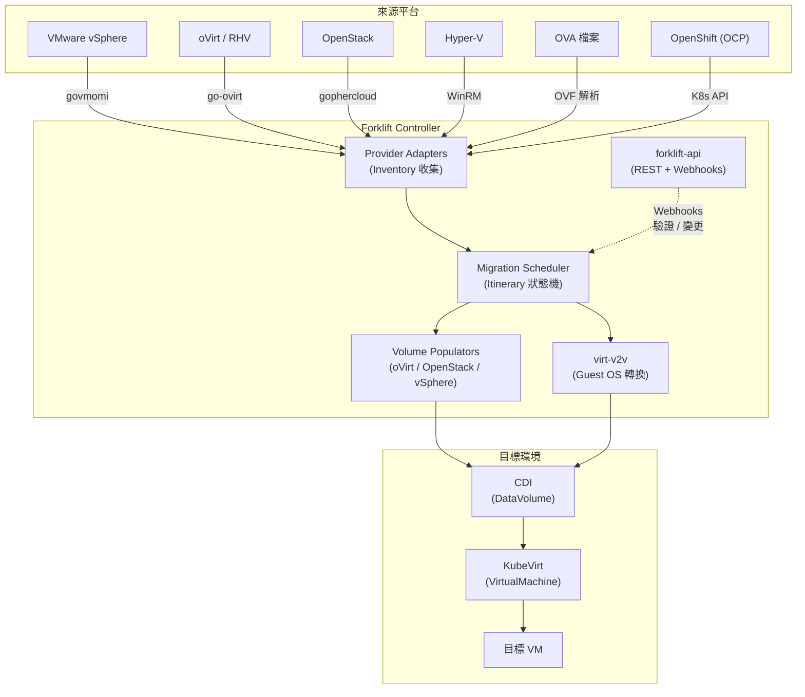
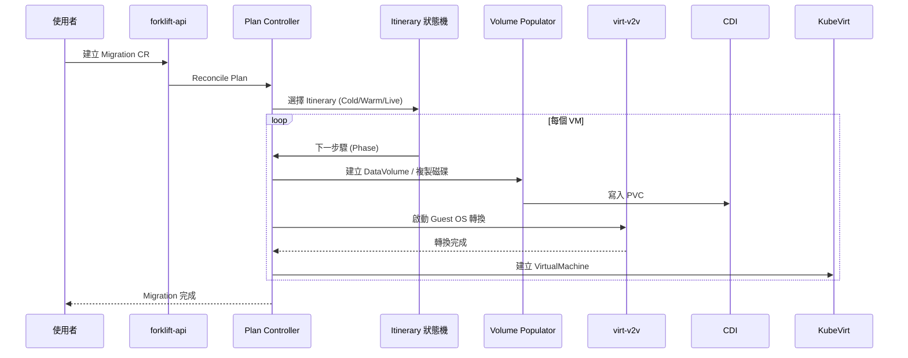
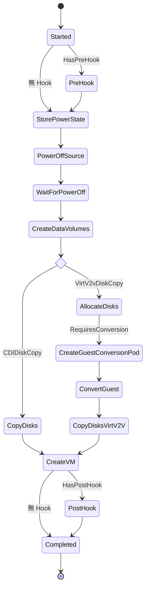
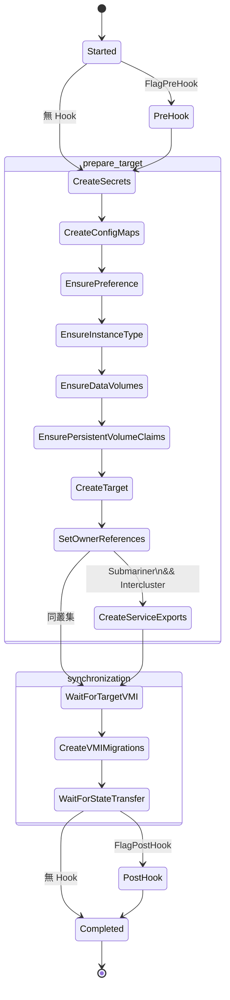

# Forklift — 系統架構

## 1. 專案概述

[Forklift](https://github.com/kubev2v/forklift)（又稱 Migration Toolkit for Virtualization, MTV）是一套 Kubernetes Operator，用於將虛擬機器從多種虛擬化平台遷移至 KubeVirt 環境。它支援 vSphere、oVirt/RHV、OpenStack、Hyper-V、OVA 及 OCP-to-OCP 等遷移來源，並整合 CDI（Containerized Data Importer）完成磁碟資料搬移與 virt-v2v 完成 Guest OS 轉換。

| 項目 | 說明 |
|------|------|
| 模組路徑 | `github.com/kubev2v/forklift` |
| 語言版本 | Go 1.24.0 |
| 授權條款 | Apache License 2.0 |
| 架構模式 | Kubernetes Operator + Controller-Runtime |
| 來源平台 | vSphere、oVirt、OpenStack、Hyper-V、OVA、OCP |
| 目標平台 | KubeVirt（OpenShift Virtualization / 上游 KubeVirt） |

### 關鍵依賴

| 依賴 | 版本 | 用途 |
|------|------|------|
| `github.com/vmware/govmomi` | v0.50.0 | vSphere API 互動（SOAP / REST） |
| `github.com/ovirt/go-ovirt` | v0.0.0-20230808 | oVirt Engine SDK |
| `github.com/gophercloud/gophercloud` | v1.14.1 | OpenStack API 客戶端 |
| `github.com/masterzen/winrm` | v0.0.0-20250927 | Hyper-V WinRM 遠端管理 |
| `kubevirt.io/api` | v1.6.0-beta | KubeVirt VirtualMachine CRD |
| `kubevirt.io/containerized-data-importer-api` | v1.63.1 | CDI DataVolume CRD |
| `sigs.k8s.io/controller-runtime` | — | Operator 框架 |
| `github.com/gin-gonic/gin` | v1.10.0 | REST API 路由（OVA Provider） |

---

## 2. 系統架構圖



### 遷移管線流程



---

## 3. Binary 與元件

Forklift 在 `cmd/` 目錄下定義了 14 個入口點：

| Binary | 說明 | 關鍵細節 |
|--------|------|----------|
| `forklift-controller` | 核心控制器，啟動 controller-runtime Manager | 註冊 6 個主控制器 + 3 個 Inventory 控制器；Metrics `:2112`，pprof `:6060` |
| `forklift-api` | REST API + Admission Webhooks | Services 埠 `8444`、Webhooks 埠 `8443`；均啟用 TLS |
| `virt-v2v` | Guest OS 轉換引擎 | 支援遠端檢視、就地轉換、標準轉換三種模式；整合 virt-customize |
| `virt-v2v-monitor` | virt-v2v 進度監控 | 解析 stdin 輸出，匯出 `v2v_disk_transfers` Prometheus 指標至 `:2112` |
| `populator-controller` | Volume Populator 總控制器 | 管理 oVirt (`:8080`)、OpenStack (`:8081`)、vSphere XCOPY (`:8082`) 三種 Populator |
| `ovirt-populator` | oVirt 磁碟下載器 | 呼叫 `ovirt-img download-disk`，匯出 `ovirt_progress` 指標 |
| `openstack-populator` | OpenStack Image 下載器 | 支援多種認證方式，匯出 `openstack_populator_progress` 指標 |
| `vsphere-copy-offload-populator` | vSphere XCOPY 磁碟搬移 | 支援 9 種企業儲存陣列（Ontap、PowerMax、PureFlashArray 等）；TLS Metrics `:8443` |
| `ova-provider-server` | OVA Provider HTTP API | Gin 框架；提供 Inventory 與 Appliance 端點；預設 catalog 路徑 `/ova` |
| `ova-proxy` | OVA 反向代理 | 透過 K8s Service Discovery 路由請求至對應 Provider Pod |
| `hyperv-provider-server` | Hyper-V Provider HTTP 伺服器 | 提供 `/healthz` 與 `/validate-disks` 端點；埠 `8080` |
| `image-converter` | 磁碟映像格式轉換工具 | 包裝 `qemu-img convert`；支援 Block / Filesystem 模式 |
| `kubectl-mtv` | kubectl CLI 外掛 | 委派至 `github.com/yaacov/kubectl-mtv/cmd` |
| `provider-common` | 共用函式庫（非獨立 Binary） | 提供 Settings、OVF 解析、認證、Inventory API Handler |

### forklift-controller 註冊的控制器

```go
// 檔案: pkg/controller/controller.go
// Main Controllers（MainRole）
migration.Add(mgr)  // Migration CR 調和
plan.Add(mgr)       // Plan CR 調和（核心遷移邏輯）
network.Add(mgr)    // NetworkMap CR 調和
storage.Add(mgr)    // StorageMap CR 調和
host.Add(mgr)       // Host CR 調和
hook.Add(mgr)       // Hook CR 調和

// Inventory Controllers（InventoryRole）
provider.Add(mgr)   // Provider CR 調和（vSphere/oVirt/OpenStack Inventory）
ova.Add(mgr)        // OVA Provider 控制器
hyperv.Add(mgr)     // Hyper-V Provider 控制器
```

### forklift-api Webhook 路徑

```go
// 檔案: pkg/forklift-api/webhooks/webhooks.go
// Validating Webhooks
"/secret-validate"    → SecretAdmitter
"/plan-validate"      → PlanAdmitter
"/provider-validate"  → ProviderAdmitter
"/migration-validate" → MigrationAdmitter

// Mutating Webhooks
"/secret-mutate"      → SecretMutator
"/plan-mutate"        → PlanMutator
"/provider-mutate"    → ProviderMutator
```

---

## 4. 目錄結構


---

## 5. 建置系統

### Makefile 關鍵 Target

Forklift 使用單一 Makefile 管理完整的建置、測試、映像打包與部署流程。

```makefile
# 檔案: Makefile

# === CI / 測試 ===
ci:          all tidy vendor generate-verify lint validate-forklift-controller-crd
test:        generate fmt vet manifests validation-test  # 單元測試 + 覆蓋率
integration-test:                                        # envtest 整合測試
lint:                                                    # golangci-lint v1.64.2

# === E2E 測試（Ginkgo）===
e2e-sanity-ovirt:               # Focus: ".*oVirt.*|.*Forklift.*"
e2e-sanity-vsphere:             # Focus: ".*vSphere.*"
e2e-sanity-openstack:           # Focus: ".*Migration tests for OpenStack.*"
e2e-sanity-openstack-extended:  # 單執行緒擴充測試
e2e-sanity-ova:                 # Focus: ".*OVA.*"

# === 映像建置 ===
build-all-images:               # 建置所有 16 個容器映像
push-all-images:                # 推送所有映像至 Registry
push-all-images-manifest:       # 建立並推送 multi-arch manifest

# === 部署 ===
deploy-operator-index:          # 部署 OLM CatalogSource（單架構）
deploy-operator-index-multiarch: # 部署 OLM CatalogSource（多架構）
deploy-ocp:                     # 部署至 OpenShift
deploy-k8s:                     # 部署至 Kubernetes
```

### 多架構支援

```makefile
# 檔案: Makefile
PLATFORM ?= linux/amd64          # 可切換 linux/arm64
PLATFORM_ARCH = amd64             # 自動從 PLATFORM 擷取
PLATFORM_SUFFIX = -amd64          # 附加至映像 Tag

# amd64-only 映像（依賴不支援 arm64）：
#   virt-v2v, virt-v2v-xfs, ovirt-populator
```

映像建置採用 `PLATFORM_FLAG --platform $(PLATFORM)` 進行目標架構編譯，再透過 `manifest create` 將 `-amd64` 與 `-arm64` 映像合併為統一 manifest。

### Container 映像總覽

```makefile
# 檔案: Makefile
REGISTRY ?= quay.io
REGISTRY_ORG ?= kubev2v
REGISTRY_TAG ?= devel
# 組合：quay.io/kubev2v/<component>:devel-<arch>
```

| 映像 | 架構 | 基礎映像 |
|------|------|----------|
| forklift-controller | amd64, arm64 | UBI9-minimal |
| forklift-api | amd64, arm64 | UBI9-minimal |
| forklift-operator | amd64, arm64 | ansible-operator |
| forklift-validation | amd64, arm64 | OPA + UBI9-minimal |
| forklift-virt-v2v | **amd64 only** | CentOS Stream 9 |
| forklift-virt-v2v-xfs | **amd64 only** | CentOS Stream 9 |
| populator-controller | amd64, arm64 | UBI9-minimal |
| ovirt-populator | **amd64 only** | CentOS Stream 9 |
| openstack-populator | amd64, arm64 | UBI9-minimal |
| vsphere-copy-offload-populator | amd64, arm64 | UBI9-minimal |
| ova-provider-server | amd64, arm64 | UBI9-minimal |
| ova-proxy | amd64, arm64 | UBI9-minimal |
| hyperv-provider-server | amd64, arm64 | UBI9-minimal |
| forklift-cli-download | amd64, arm64 | UBI9/nginx |
| forklift-operator-bundle | amd64, arm64 | operator-sdk-builder |
| forklift-operator-index | amd64, arm64 | operator-framework/opm |

---

## 6. Itinerary 狀態機

Itinerary 是 Forklift 遷移流程的核心架構模式，定義於 `pkg/lib/itinerary/`。每個遷移類型（Cold / Warm / Live）擁有獨立的 Itinerary，由一系列 **Step** 組成，搭配 **Predicate** 旗標在執行期動態篩選步驟。

### 核心結構

```go
// 檔案: pkg/lib/itinerary/simple.go
type Step struct {
    Name string   // 步驟名稱（Phase 常數）
    All  Flag     // 所有旗標皆須滿足才納入此步驟
    Any  Flag     // 任一旗標滿足即納入此步驟
}

type Itinerary struct {
    Pipeline  // []Step — 有序步驟清單
    Predicate // 條件評估介面
    Name string
}

type Predicate interface {
    Evaluate(Flag) (bool, error)
    Count() int
}
```

執行流程：`List()` 方法遍歷 Pipeline，對每個 Step 先執行 `hasAny()` 再執行 `hasAll()`，僅保留通過篩選的步驟。`Next(name)` 依據目前 Phase 回傳下一個有效步驟。

### Predicate 旗標

```go
// 檔案: pkg/controller/plan/migrator/base/doc.go
HasPreHook              Flag = 0x01  // VM 定義了 PreHook
HasPostHook             Flag = 0x02  // VM 定義了 PostHook
RequiresConversion      Flag = 0x04  // Provider 需要 Guest OS 轉換且未跳過
CDIDiskCopy             Flag = 0x08  // 使用 CDI 複製磁碟
VirtV2vDiskCopy         Flag = 0x10  // 使用 virt-v2v 複製磁碟
OpenstackImageMigration Flag = 0x20  // OpenStack Snapshot 轉換
VSphere                 Flag = 0x40  // 來源為 vSphere
RunInspection           Flag = 0x80  // 執行 Preflight 檢視
```

### Cold Migration（冷遷移）

VM 先關機再搬移磁碟，適用於所有來源平台。

```go
// 檔案: pkg/controller/plan/migrator/base/migrator.go
Pipeline{
    {Name: PhaseStarted},
    {Name: PhasePreHook, All: HasPreHook},
    {Name: PhaseStorePowerState},
    {Name: PhasePowerOffSource},
    {Name: PhaseWaitForPowerOff},
    {Name: PhaseCreateDataVolumes},
    {Name: PhaseCopyDisks, All: CDIDiskCopy},
    {Name: PhaseAllocateDisks, All: VirtV2vDiskCopy},
    {Name: PhaseCreateGuestConversionPod, All: RequiresConversion},
    {Name: PhaseConvertGuest, All: RequiresConversion},
    {Name: PhaseCopyDisksVirtV2V, All: RequiresConversion},
    {Name: PhaseConvertOpenstackSnapshot, All: OpenstackImageMigration},
    {Name: PhaseCreateVM},
    {Name: PhasePostHook, All: HasPostHook},
    {Name: PhaseCompleted},
}
```



### Warm Migration（暖遷移）

VM 持續運行，透過 Snapshot 增量複製磁碟（Precopy Loop），直到觸發 Cutover 才關機並完成最終同步。

```go
// 檔案: pkg/controller/plan/migrator/base/migrator.go
Pipeline{
    {Name: PhaseStarted},
    {Name: PhasePreHook, All: HasPreHook},
    {Name: PhaseCreateInitialSnapshot},
    {Name: PhaseWaitForInitialSnapshot},
    {Name: PhaseStoreInitialSnapshotDeltas, All: VSphere},
    {Name: PhasePreflightInspection, All: RunInspection},
    {Name: PhaseCreateDataVolumes},
    // === Precopy Loop ===
    {Name: PhaseCopyDisks},
    {Name: PhaseCopyingPaused},
    {Name: PhaseRemovePreviousSnapshot, All: VSphere},
    {Name: PhaseWaitForPreviousSnapshotRemoval, All: VSphere},
    {Name: PhaseCreateSnapshot},
    {Name: PhaseWaitForSnapshot},
    {Name: PhaseStoreSnapshotDeltas, All: VSphere},
    {Name: PhaseAddCheckpoint},
    // === Cutover ===
    {Name: PhaseStorePowerState},
    {Name: PhasePowerOffSource},
    {Name: PhaseWaitForPowerOff},
    {Name: PhaseRemovePenultimateSnapshot, All: VSphere},
    {Name: PhaseWaitForPenultimateSnapshotRemoval, All: VSphere},
    {Name: PhaseCreateFinalSnapshot},
    {Name: PhaseWaitForFinalSnapshot},
    {Name: PhaseAddFinalCheckpoint},
    {Name: PhaseFinalize},
    {Name: PhaseRemoveFinalSnapshot, All: VSphere},
    {Name: PhaseWaitForFinalSnapshotRemoval, All: VSphere},
    {Name: PhaseCreateGuestConversionPod, All: RequiresConversion},
    {Name: PhaseConvertGuest, All: RequiresConversion},
    {Name: PhaseCreateVM},
    {Name: PhasePostHook, All: HasPostHook},
    {Name: PhaseCompleted},
}
```



```mermaid
stateDiagram-v2
    [*] --> Started
    Started --> PreHook: HasPreHook
    Started --> CreateInitialSnapshot: 無 Hook
    PreHook --> CreateInitialSnapshot

    state precopy_init {
        CreateInitialSnapshot --> WaitForInitialSnapshot
        WaitForInitialSnapshot --> StoreInitialSnapshotDeltas: VSphere
        WaitForInitialSnapshot --> CreateDataVolumes: 非 VSphere
        StoreInitialSnapshotDeltas --> PreflightInspection: RunInspection
        StoreInitialSnapshotDeltas --> CreateDataVolumes: 無 Inspection
        PreflightInspection --> CreateDataVolumes
    }

    state precopy_loop {
        CopyDisks --> CopyingPaused
        CopyingPaused --> RemovePreviousSnapshot: VSphere
        CopyingPaused --> CreateSnapshot: 非 VSphere
        RemovePreviousSnapshot --> WaitForPreviousSnapshotRemoval
        WaitForPreviousSnapshotRemoval --> CreateSnapshot
        CreateSnapshot --> WaitForSnapshot
        WaitForSnapshot --> StoreSnapshotDeltas: VSphere
        WaitForSnapshot --> AddCheckpoint: 非 VSphere
        StoreSnapshotDeltas --> AddCheckpoint
        AddCheckpoint --> CopyDisks: 繼續 Precopy
    }

    CreateDataVolumes --> CopyDisks

    state cutover {
        StorePowerState_c: StorePowerState
        PowerOffSource_c: PowerOffSource
        WaitForPowerOff_c: WaitForPowerOff
        StorePowerState_c --> PowerOffSource_c
        PowerOffSource_c --> WaitForPowerOff_c
        WaitForPowerOff_c --> CreateFinalSnapshot
        CreateFinalSnapshot --> WaitForFinalSnapshot
        WaitForFinalSnapshot --> AddFinalCheckpoint
        AddFinalCheckpoint --> Finalize
    }

    AddCheckpoint --> StorePowerState_c: 觸發 Cutover

    Finalize --> CreateGuestConversionPod: RequiresConversion
    Finalize --> CreateVM: 無需轉換
    CreateGuestConversionPod --> ConvertGuest
    ConvertGuest --> CreateVM
    CreateVM --> PostHook: HasPostHook
    CreateVM --> Completed: 無 Hook
    PostHook --> Completed
    Completed --> [*]
```

### Live Migration（OCP-to-OCP 即時遷移）

在來源與目標皆為 OpenShift 叢集時，VM 無需關機，透過 KubeVirt 的 Live Migration 機制直接遷移。

```go
// 檔案: pkg/controller/plan/migrator/ocp/live.go
const (
    FlagPreHook      Flag = 0x01
    FlagPostHook     Flag = 0x02
    FlagSubmariner   Flag = 0x04  // 啟用 Submariner 多叢集網路
    FlagIntercluster Flag = 0x08  // 來源與目標為不同叢集
)

Pipeline{
    {Name: Started},
    {Name: PreHook, All: FlagPreHook},
    {Name: CreateSecrets},
    {Name: CreateConfigMaps},
    {Name: EnsurePreference},
    {Name: EnsureInstanceType},
    {Name: EnsureDataVolumes},
    {Name: EnsurePersistentVolumeClaims},
    {Name: CreateTarget},
    {Name: SetOwnerReferences},
    {Name: CreateServiceExports, All: FlagSubmariner | FlagIntercluster},
    {Name: WaitForTargetVMI},
    {Name: CreateVirtualMachineInstanceMigrations},
    {Name: WaitForStateTransfer},
    {Name: PostHook, All: FlagPostHook},
    {Name: Completed},
}
```



---

::: info 相關章節
- [核心功能分析](./core-features) — 遷移流程、Provider 抽象層、磁碟轉換、演算法分析
- [控制器與 API](./controllers-api) — Controller 架構、CRD 型別、Webhook、REST API
- [外部整合](./integration) — KubeVirt / CDI / vSphere / oVirt / OpenStack / Hyper-V 整合
:::
