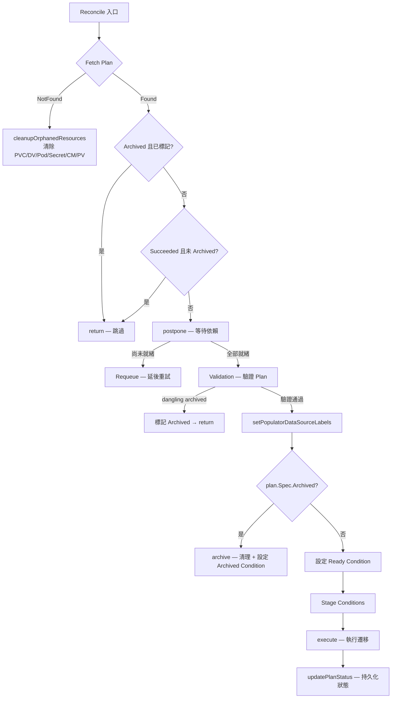
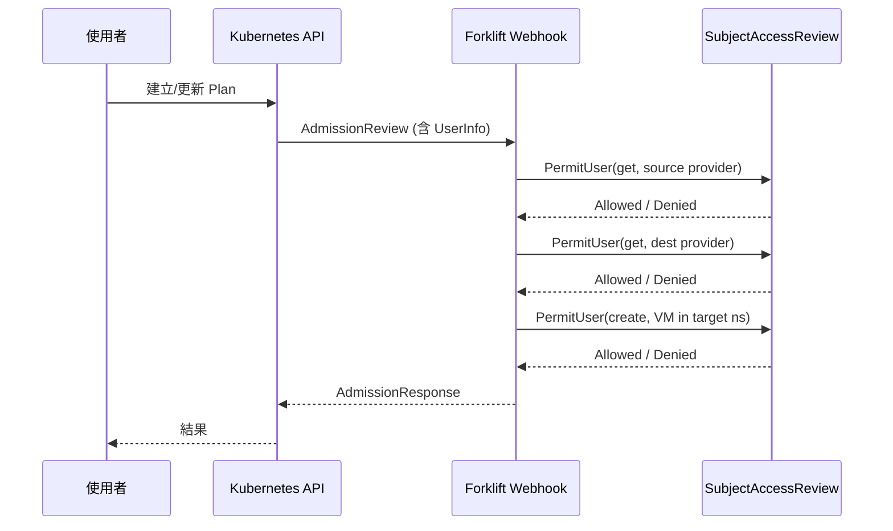
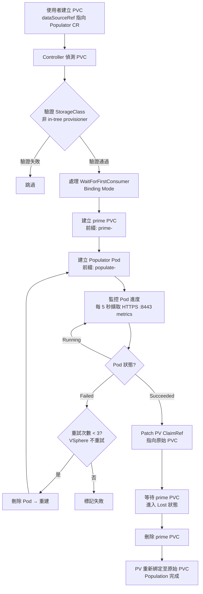

# Forklift — 控制器與 API

本章深入分析 Forklift 的控制器架構、CRD 型別定義、REST API、Webhook 驗證規則，以及 Volume Populator 控制器的實作細節。

::: info 相關章節
- [系統架構](./architecture) — 專案總覽、Binary 入口、目錄結構
- [核心功能分析](./core-features) — 遷移流程、Provider 抽象層、磁碟轉換
- [外部整合](./integration) — KubeVirt/CDI/vSphere/oVirt/OpenStack/Hyper-V 整合
:::

---

## 1. 控制器總覽

Forklift 控制器由 `cmd/forklift-controller/main.go` 啟動，透過 controller-runtime Manager 統一管理。依據啟動時的 `Role` 設定，分為 **MainControllers** 與 **InventoryControllers** 兩組。

```go
// 檔案: pkg/controller/controller.go
func AddToManager(m manager.Manager) error {
    load := func(functions []AddFunction) error {
        for _, f := range functions {
            if err := f(m); err != nil {
                return err
            }
        }
        return nil
    }
    if Settings.Role.Has(settings.InventoryRole) {
        err := load(InventoryControllers)
        if err != nil {
            return err
        }
    }
    if Settings.Role.Has(settings.MainRole) {
        err := load(MainControllers)
        if err != nil {
            return err
        }
    }
    return nil
}
```

### MainControllers（6 個）

負責遷移的編排、驗證與執行：

| 控制器 | 監聽資源 | 檔案路徑 | 核心邏輯 |
|--------|---------|----------|---------|
| **Migration** | `Migration`, `Plan` | `pkg/controller/migration/controller.go` | 追蹤遷移生命週期、管理 VM 狀態機 |
| **Plan** | `Plan`, `Provider`, `NetworkMap`, `StorageMap`, `Hook`, `Migration` | `pkg/controller/plan/controller.go` | 最複雜的控制器：依賴檢查→驗證→快照比對→執行 Migration Runner |
| **NetworkMap** | `NetworkMap`, `Provider` + 自訂 channel | `pkg/controller/map/network/controller.go` | 驗證來源/目標網路對映關係 |
| **StorageMap** | `StorageMap`, `Provider` + 自訂 channel | `pkg/controller/map/storage/controller.go` | 驗證來源/目標儲存對映關係 |
| **Host** | `Host`, `Provider`, `Secret` + 自訂 channel | `pkg/controller/host/controller.go` | 管理 ESXi 主機資訊、磁碟傳輸 IP |
| **Hook** | `Hook` | `pkg/controller/hook/controller.go` | 管理遷移前後的 Ansible Playbook Hook |

### InventoryControllers（3 個）

負責 Provider 清單（Inventory）收集與伺服器部署：

| 控制器 | 監聯資源 | 檔案路徑 | 核心邏輯 |
|--------|---------|----------|---------|
| **Provider** | `Provider`, `Secret`, `OVAProviderServer`, `HyperVProviderServer` | `pkg/controller/provider/controller.go` | Provider 連線驗證、清單收集、容器管理 |
| **OVA** | `OVAProviderServer` | `pkg/controller/ova/controller.go` | 部署 OVA Provider 後端服務 |
| **HyperV** | `HyperVProviderServer` | `pkg/controller/hyperv/controller.go` | 部署 Hyper-V Provider 後端服務 |

### 啟動流程

```go
// 檔案: cmd/forklift-controller/main.go
// Manager 建立後依序註冊 Scheme、Controllers、Webhooks
mgr, err := manager.New(cfg, manager.Options{
    Metrics: metricsserver.Options{BindAddress: Settings.Metrics.Address()},
})
// 註冊 API Scheme：Forklift、Storage、Network、KubeVirt、CDI、Export、Template...
apis.AddToScheme(mgr.GetScheme())
storagev1.AddToScheme(mgr.GetScheme())
net.AddToScheme(mgr.GetScheme())
cnv.AddToScheme(mgr.GetScheme())
cdi.AddToScheme(mgr.GetScheme())
// 註冊所有控制器
controller.AddToManager(mgr)
// 啟動 Profiler（可選：CPU / Memory / Mutex）
```

---

## 2. Plan 控制器深度分析

Plan 控制器是 Forklift 中最複雜的控制器，負責協調整個遷移計畫的生命週期。

### 監聽的資源（7 種）

```go
// 檔案: pkg/controller/plan/controller.go
// 1. 主要資源 — Plan
For(&api.Plan{}, builder.WithPredicates(PlanPredicate{}))
// 2. 自訂 Channel — Provider 清單變更事件（容量 10）
WatchesRawSource(source.Channel(...))
// 3. Provider
Watches(&api.Provider{}, libref.TypedHandler[*api.Provider](...), builder.WithPredicates(ProviderPredicate{}))
// 4. NetworkMap
Watches(&api.NetworkMap{}, libref.TypedHandler[*api.NetworkMap](...), builder.WithPredicates(NetMapPredicate{}))
// 5. StorageMap
Watches(&api.StorageMap{}, libref.TypedHandler[*api.StorageMap](...), builder.WithPredicates(DsMapPredicate{}))
// 6. Hook
Watches(&api.Hook{}, handler.TypedEnqueueRequestsFromMapFunc(...), builder.WithPredicates(HookPredicate{}))
// 7. Migration
Watches(&api.Migration{}, handler.TypedEnqueueRequestsFromMapFunc(...), builder.WithPredicates(MigrationPredicate{}))
```

### Reconcile 流程



### execute() — 遷移執行核心

```go
// 檔案: pkg/controller/plan/controller.go
func (r *Reconciler) execute(plan *api.Plan) (reQ time.Duration, err error) {
    // 1. 尋找 active Migration
    activeMigration := r.activeMigration(plan)
    // 2. 若無 active，從 pending 佇列取最早的
    pending := r.pendingMigrations(plan)
    // 3. 快照比對 — matchSnapshot() 偵測 Plan/Provider/Map 變更
    //    若偵測到不一致 → 取消正在執行的 Migration
    // 4. 建立新快照 newSnapshot()
    //    捕獲 Plan、Migration、Source/Dest Provider、NetworkMap、StorageMap
    // 5. 驗證 Context（Migration Runner 前置檢查）
    // 6. 執行 Migration Runner
    // 7. 將 active snapshot 狀態反映至 Plan
}
```

### 關鍵輔助函式

| 函式 | 說明 |
|------|------|
| `postpone()` | 檢查 Provider、NetworkMap、StorageMap、Host、Hook 是否已 reconcile（`ObservedGeneration >= Generation`） |
| `matchSnapshot()` | 比對快照與當前狀態，偵測 Plan/Provider/Map 變更，變更時取消 Migration |
| `newSnapshot()` | 擷取 Plan、Migration、Source/Dest Provider、NetworkMap、StorageMap 當前狀態 |
| `activeMigration()` | 取得目前正在執行的 Migration，驗證 UID 一致性 |
| `pendingMigrations()` | 依建立時間排序取得待處理 Migration 清單 |
| `archive()` | 透過 Migration Runner 執行清理，設定 Archived Condition |
| `failExecutingMigrationOnBlocker()` | 將 active snapshot 標記為 Failed，設定所有進行中 VM 的 Failed Condition |
| `cleanupOrphanedResources()` | Plan 刪除時清除 PVC、DataVolume、Pod、Secret、ConfigMap、PV（保留已遷移 VM 的資源） |

---

## 3. CRD 型別定義

所有 CRD 定義於 `pkg/apis/forklift/v1beta1/`。

### Provider

```go
// 檔案: pkg/apis/forklift/v1beta1/provider.go
// ProviderType 常數: OpenShift, VSphere, OVirt, OpenStack, Ova, EC2, HyperV

type ProviderSpec struct {
    Type     *ProviderType         `json:"type"`
    URL      string                `json:"url,omitempty"`
    Secret   core.ObjectReference  `json:"secret" ref:"Secret"`
    Settings map[string]string     `json:"settings,omitempty"`
}

type ProviderStatus struct {
    Phase                 string               `json:"phase,omitempty"`
    libcnd.Conditions                          `json:",inline"`
    ObservedGeneration    int64                `json:"observedGeneration,omitempty"`
    Fingerprint           string               `json:"fingerprint,omitempty"`
    Service               *core.ObjectReference `json:"service,omitempty"`
    SecretResourceVersion string               `json:"secretResourceVersion,omitempty"`
}
```

### Plan（40+ 欄位）

Plan 是 Forklift 中最複雜的 CRD，涵蓋目標命名空間、VM 選取、排程、轉換、磁碟、網路等所有遷移設定。

```go
// 檔案: pkg/apis/forklift/v1beta1/plan.go
// MigrationType 常數: MigrationCold, MigrationWarm, MigrationLive, MigrationOnlyConversion

type PlanSpec struct {
    Description                    string                `json:"description,omitempty"`
    TargetNamespace                string                `json:"targetNamespace"`
    ServiceAccount                 string                `json:"serviceAccount,omitempty"`
    // 標籤與排程
    TargetLabels                   map[string]string     `json:"targetLabels,omitempty"`
    TargetNodeSelector             map[string]string     `json:"targetNodeSelector,omitempty"`
    TargetAffinity                 *core.Affinity        `json:"targetAffinity,omitempty"`
    ConvertorLabels                map[string]string     `json:"convertorLabels,omitempty"`
    ConvertorNodeSelector          map[string]string     `json:"convertorNodeSelector,omitempty"`
    ConvertorAffinity              *core.Affinity        `json:"convertorAffinity,omitempty"`
    // 儲存
    ConversionTempStorageClass     string                `json:"conversionTempStorageClass,omitempty"`
    ConversionTempStorageSize      string                `json:"conversionTempStorageSize,omitempty"`
    // Provider 與 Map
    Provider                       provider.Pair         `json:"provider"`
    Map                            plan.Map              `json:"map"`
    VMs                            []plan.VM             `json:"vms"`
    // 遷移類型
    Warm                           bool                  `json:"warm,omitempty"` // Deprecated
    Type                           MigrationType         `json:"type,omitempty"`
    // 網路
    TransferNetwork                *core.ObjectReference `json:"transferNetwork,omitempty"`
    // 行為控制
    Archived                       bool                  `json:"archived,omitempty"`
    PreserveClusterCPUModel        bool                  `json:"preserveClusterCpuModel,omitempty"`
    PreserveStaticIPs              bool                  `json:"preserveStaticIPs,omitempty"`
    SkipZoneNodeSelector           bool                  `json:"skipZoneNodeSelector,omitempty"`
    MigrateSharedDisks             bool                  `json:"migrateSharedDisks,omitempty"`
    RDMAsLun                       bool                  `json:"rdmAsLun,omitempty"`
    DeleteGuestConversionPod       bool                  `json:"deleteGuestConversionPod,omitempty"`
    DeleteVmOnFailMigration        bool                  `json:"deleteVmOnFailMigration,omitempty"`
    SkipGuestConversion            bool                  `json:"skipGuestConversion,omitempty"`
    UseCompatibilityMode           bool                  `json:"useCompatibilityMode,omitempty"`
    RunPreflightInspection         bool                  `json:"runPreflightInspection,omitempty"`
    XfsCompatibility               bool                  `json:"xfsCompatibility,omitempty"`
    // 可選覆蓋
    InstallLegacyDrivers           *bool                 `json:"installLegacyDrivers,omitempty"`
    EnableNestedVirtualization     *bool                 `json:"enableNestedVirtualization,omitempty"`
    // 名稱樣板
    PVCNameTemplate                string                `json:"pvcNameTemplate,omitempty"`
    VolumeNameTemplate             string                `json:"volumeNameTemplate,omitempty"`
    NetworkNameTemplate            string                `json:"networkNameTemplate,omitempty"`
    // 其他
    TargetPowerState               plan.TargetPowerState `json:"targetPowerState,omitempty"`
    CustomizationScripts           *core.ObjectReference `json:"customizationScripts,omitempty"`
    VirtV2vImage                   string                `json:"virtV2vImage,omitempty"`
}
```

Plan 中引用的 `plan.VM` 結構也非常豐富：

```go
// 檔案: pkg/apis/forklift/v1beta1/plan/vm.go
type VM struct {
    ref.Ref                     `json:",inline"`
    Hooks                       []HookRef         `json:"hooks,omitempty"`
    LUKS                        core.ObjectReference `json:"luks" ref:"Secret"`
    NbdeClevis                  bool              `json:"nbdeClevis,omitempty"`
    RootDisk                    string            `json:"rootDisk,omitempty"`
    InstanceType                string            `json:"instanceType,omitempty"`
    TargetName                  string            `json:"targetName,omitempty"`
    TargetPowerState            TargetPowerState  `json:"targetPowerState,omitempty"`
    DeleteVmOnFailMigration     bool              `json:"deleteVmOnFailMigration,omitempty"`
    MigrateSharedDisks          *bool             `json:"migrateSharedDisks,omitempty"`
    EnableNestedVirtualization  *bool             `json:"enableNestedVirtualization,omitempty"`
    RDMAsLun                    *bool             `json:"rdmAsLun,omitempty"`
    PVCNameTemplate             string            `json:"pvcNameTemplate,omitempty"`
    VolumeNameTemplate          string            `json:"volumeNameTemplate,omitempty"`
    NetworkNameTemplate         string            `json:"networkNameTemplate,omitempty"`
}
```

### Migration

```go
// 檔案: pkg/apis/forklift/v1beta1/migration.go
type MigrationSpec struct {
    Plan    core.ObjectReference `json:"plan" ref:"Plan"`
    Cancel  []ref.Ref            `json:"cancel,omitempty"`
    Cutover *meta.Time           `json:"cutover,omitempty"`
}

type MigrationStatus struct {
    plan.Timed         `json:",inline"`
    libcnd.Conditions  `json:",inline"`
    ObservedGeneration int64            `json:"observedGeneration,omitempty"`
    VMs                []*plan.VMStatus `json:"vms,omitempty"`
}
```

### NetworkMap

```go
// 檔案: pkg/apis/forklift/v1beta1/mapping.go
type NetworkPair struct {
    Source      ref.Ref            `json:"source"`
    Destination DestinationNetwork `json:"destination"`
}

type DestinationNetwork struct {
    Type      string `json:"type"`      // pod, multus, ignored
    Namespace string `json:"namespace,omitempty"`
    Name      string `json:"name,omitempty"`
}

type NetworkMapSpec struct {
    Provider provider.Pair  `json:"provider"`
    Map      []NetworkPair  `json:"map"`
}
```

### StorageMap

```go
// 檔案: pkg/apis/forklift/v1beta1/mapping.go
type StoragePair struct {
    Source        ref.Ref            `json:"source"`
    Destination   DestinationStorage `json:"destination"`
    OffloadPlugin *OffloadPlugin     `json:"offloadPlugin,omitempty"`
}

type DestinationStorage struct {
    StorageClass string                          `json:"storageClass"`
    VolumeMode   core.PersistentVolumeMode       `json:"volumeMode,omitempty"`
    AccessMode   core.PersistentVolumeAccessMode `json:"accessMode,omitempty"`
}

type OffloadPlugin struct {
    VSphereXcopyPluginConfig *VSphereXcopyPluginConfig `json:"vsphereXcopyConfig"`
}

type VSphereXcopyPluginConfig struct {
    SecretRef            string               `json:"secretRef"`
    StorageVendorProduct StorageVendorProduct `json:"storageVendorProduct"`
    // 支援: flashsystem, vantara, ontap, primera3par, pureFlashArray, powerflex, powermax, powerstore, infinibox
}
```

### Hook

```go
// 檔案: pkg/apis/forklift/v1beta1/hook.go
type HookSpec struct {
    ServiceAccount string `json:"serviceAccount,omitempty"`
    Image          string `json:"image"`
    Playbook       string `json:"playbook,omitempty"` // base64 encoded Ansible playbook
    Deadline       int64  `json:"deadline,omitempty"` // 秒
}
```

### Host

```go
// 檔案: pkg/apis/forklift/v1beta1/host.go
type HostSpec struct {
    ref.Ref   `json:",inline"`
    Provider  core.ObjectReference `json:"provider" ref:"Provider"`
    IpAddress string               `json:"ipAddress"`
    Secret    core.ObjectReference `json:"secret" ref:"Secret"`
}
```

### OVAProviderServer / HyperVProviderServer

```go
// 檔案: pkg/apis/forklift/v1beta1/ovaserver.go
type OVAProviderServerSpec struct {
    Provider v1.ObjectReference `json:"provider"`
}
type OVAProviderServerStatus struct {
    Phase   string                `json:"phase,omitempty"`
    Service *v1.ObjectReference   `json:"service,omitempty"`
    libcnd.Conditions             `json:",inline"`
}

// 檔案: pkg/apis/forklift/v1beta1/hypervserver.go
type HyperVProviderServerSpec struct {
    Provider core.ObjectReference `json:"provider"`
}
type HyperVProviderServerStatus struct {
    Phase   string                `json:"phase,omitempty"`
    Service *core.ObjectReference `json:"service,omitempty"`
    libcnd.Conditions             `json:",inline"`
}
```

### Volume Populator CRDs

```go
// 檔案: pkg/apis/forklift/v1beta1/ovirtpopulator.go
type OvirtVolumePopulatorSpec struct {
    EngineURL        string                `json:"engineUrl"`
    EngineSecretName string                `json:"engineSecretName"`
    DiskID           string                `json:"diskId"`
    TransferNetwork  *core.ObjectReference `json:"transferNetwork,omitempty"`
}

// 檔案: pkg/apis/forklift/v1beta1/openstackpopulator.go
type OpenstackVolumePopulatorSpec struct {
    IdentityURL     string                `json:"identityUrl"`
    SecretName      string                `json:"secretName"`
    ImageID         string                `json:"imageId"`
    TransferNetwork *core.ObjectReference `json:"transferNetwork,omitempty"`
}

// 檔案: pkg/apis/forklift/v1beta1/vsphere_xcopy_volumepopulator.go
type VSphereXcopyVolumePopulatorSpec struct {
    VmId                 string `json:"vmId"`
    VmdkPath             string `json:"vmdkPath"`
    SecretName           string `json:"secretName"`
    StorageVendorProduct string `json:"storageVendorProduct"`
}
```

三者的 Status 結構均相同：

```go
type XxxVolumePopulatorStatus struct {
    Progress string `json:"progress"`
}
```

### CRD 總覽表

| CRD | 檔案 | Spec 重點欄位 | 用途 |
|-----|------|-------------|------|
| **Provider** | `provider.go` | Type, URL, Secret, Settings | 定義來源/目標基礎架構 |
| **Plan** | `plan.go` | 40+ 欄位：Provider Pair, Map, VMs, 遷移類型, 排程, 模板 | 遷移計畫定義 |
| **Migration** | `migration.go` | Plan ref, Cancel, Cutover | 追蹤單次遷移執行 |
| **NetworkMap** | `mapping.go` | Provider Pair, NetworkPair[] | 來源→目標網路對映 |
| **StorageMap** | `mapping.go` | Provider Pair, StoragePair[] + OffloadPlugin | 來源→目標儲存對映 |
| **Hook** | `hook.go` | Image, Playbook, Deadline | 遷移前後的 Ansible Hook |
| **Host** | `host.go` | Provider, IpAddress, Secret | ESXi 主機磁碟傳輸資訊 |
| **OVAProviderServer** | `ovaserver.go` | Provider ref | OVA Provider 後端服務 |
| **HyperVProviderServer** | `hypervserver.go` | Provider ref | Hyper-V Provider 後端服務 |
| **OvirtVolumePopulator** | `ovirtpopulator.go` | EngineURL, DiskID | 從 oVirt 填充 PVC |
| **OpenstackVolumePopulator** | `openstackpopulator.go` | IdentityURL, ImageID | 從 OpenStack 填充 PVC |
| **VSphereXcopyVolumePopulator** | `vsphere_xcopy_volumepopulator.go` | VmId, VmdkPath, StorageVendorProduct | 使用 vSphere XCOPY 填充 PVC |

---

## 4. REST API 與 HTTP Status Codes

Forklift API 伺服器（`cmd/forklift-api/`）啟動兩個獨立的 HTTPS 服務。

### 雙伺服器架構

```go
// 檔案: pkg/forklift-api/api.go
func (app *forkliftAPIApp) Execute() {
    go app.serveServices()   // Port 8444 — REST API
    app.serveWebhooks()      // Port 8443 — Admission Webhooks（阻塞主執行緒）
}
```

| 伺服器 | Port | TLS 環境變數 | 用途 |
|--------|------|-------------|------|
| **Services** | 8444 | `SERVICES_TLS_CERTIFICATE` / `SERVICES_TLS_KEY` | REST API 端點 |
| **Webhooks** | 8443 | `API_TLS_CERTIFICATE` / `API_TLS_KEY` | Kubernetes Admission Webhooks |

### Services API（Port 8444）

```go
// 檔案: pkg/forklift-api/services/services.go
const TLS_CERTIFICATE_PATH = "/tls-certificate"

func RegisterServices(mux *http.ServeMux, client client.Client) {
    mux.HandleFunc(TLS_CERTIFICATE_PATH, func(w http.ResponseWriter, r *http.Request) {
        serveTlsCertificate(w, r, client)
    })
}
```

**`POST /tls-certificate`** — 從遠端 URL 擷取 TLS 憑證並以 PEM 格式回傳。

```go
// 檔案: pkg/forklift-api/services/tls-certificate.go
func serveTlsCertificate(resp http.ResponseWriter, req *http.Request, client client.Client) {
    // 1. 解析 URL query parameter
    // 2. 建立 TLS 連線、取得憑證
    // 3. 編碼為 PEM 格式回傳
}
```

### Webhooks API（Port 8443）

```go
// 檔案: pkg/forklift-api/webhooks/webhooks.go

// Validating Webhooks（4 個）
const SecretValidatePath    = "/secret-validate"
const PlanValidatePath      = "/plan-validate"
const ProviderValidatePath  = "/provider-validate"
const MigrationValidatePath = "/migration-validate"

// Mutating Webhooks（3 個）
const SecretMutatorPath     = "/secret-mutate"
const PlanMutatorPath       = "/plan-mutate"
const ProviderMutatorPath   = "/provider-mutate"
```

### HTTP Status Codes 總表

| Status Code | 名稱 | 使用場景 | 位置 |
|-------------|------|---------|------|
| **200** | OK | 請求成功、Webhook 允許通過 | Services、所有 Webhook |
| **201** | Created | 資源建立成功（隱含於 K8s API） | Kubernetes API |
| **204** | No Content | 刪除成功（隱含於 K8s API） | Kubernetes API |
| **400** | Bad Request | 無效 URL 參數、格式錯誤的 AdmissionReview、OVA URL 變更 | `tls-certificate.go`、`util.go`、`secret-admitter.go` |
| **401** | Unauthorized | ServiceAccount Token 無效（隱含於 K8s API） | Kubernetes API Server |
| **403** | Forbidden | 憑證驗證失敗、RBAC 拒絕存取 | `secret-admitter.go`、`util.go` PermitUser |
| **404** | Not Found | 資源不存在（隱含於 K8s API） | Kubernetes API |
| **409** | Conflict | 資源版本衝突（隱含於 K8s API） | Kubernetes API |
| **422** | Unprocessable Entity | Webhook 驗證失敗（附帶 StatusCause 詳情） | `validating-webhook.go` |
| **500** | Internal Server Error | 憑證擷取失敗、寫入失敗 | `tls-certificate.go` |

### 認證與授權：PermitUser()

Forklift 使用 Kubernetes 原生的 **SubjectAccessReview** 進行 RBAC 檢查。

```go
// 檔案: pkg/forklift-api/webhooks/util/util.go
func PermitUser(
    request *admissionv1.AdmissionRequest,
    client  client.Client,
    groupResource schema.GroupResource,
    name    string,
    ns      string,
    verb    string,
) error {
    // 1. 從 request.UserInfo 提取使用者資訊
    //    Username, UID, Groups, Extra
    // 2. 建構 SubjectAccessReview
    review := authv1.SubjectAccessReview{
        Spec: authv1.SubjectAccessReviewSpec{
            ResourceAttributes: &authv1.ResourceAttributes{
                Group:     groupResource.Group,
                Resource:  groupResource.Resource,
                Namespace: ns,
                Name:      name,
                Verb:      verb,
            },
            User:   request.UserInfo.Username,
            UID:    request.UserInfo.UID,
            Groups: request.UserInfo.Groups,
            Extra:  ...,
        },
    }
    // 3. 提交至 Kubernetes API Server
    client.Create(context.TODO(), &review)
    // 4. 檢查結果
    if !review.Status.Allowed {
        return fmt.Errorf("Action is forbidden: User '%s' cannot '%s' resource '%s/%s'...",
            request.UserInfo.Username, verb, groupResource.Resource, name)
    }
    return nil
}
```



---

## 5. Webhook 驗證規則

### SecretAdmitter

```go
// 檔案: pkg/forklift-api/webhooks/validating-webhook/admitters/secret-admitter.go
```

驗證 Provider 與 Host 的 Secret 憑證：

| 驗證方法 | 觸發條件 | 驗證邏輯 | 失敗回應 |
|---------|---------|---------|---------|
| `validateProviderSecret()` | Secret 標記為 provider 憑證 | `insecure` 欄位須為合法布林值；不可同時 insecure 且帶 CA 憑證；透過 Collector 測試連線 | 403 Forbidden |
| `validateHostSecret()` | Secret 標記為 host 憑證 | `user` 欄位必填；測試 SSH 連線；vSphere 主機驗證 thumbprint | 403 Forbidden |
| `validateUpdateOfOVAProviderSecret()` | OVA Provider Secret 更新 | 偵測 URL 變更，拒絕修改 OVA URL | 400 Bad Request |
| `ensureEsxiCredentials()` | ESXI SDK 類型的 Host Secret | 從 Provider Secret 複製憑證至 Host Secret（若 Host Secret 缺少憑證） | — |

### PlanAdmitter

```go
// 檔案: pkg/forklift-api/webhooks/validating-webhook/admitters/plan-admitter.go
```

| 驗證方法 | 驗證邏輯 |
|---------|---------|
| `validateStorage()` | 拒絕使用 static StorageClass（`kubernetes.io/no-provisioner`）的 Plan；略過 warm migration、vSphere 來源、非 Host 目標 |
| `validateWarmMigrations()` | OpenStack 來源不支援 warm migration |
| `validateLUKS()` | 僅 vSphere 與 OVA Provider 支援 LUKS 加密磁碟遷移 |
| **RBAC 授權檢查** | `PermitUser(get, source provider)` — 使用者可存取來源 Provider |
| | `PermitUser(get, dest provider)` — 使用者可存取目標 Provider |
| | `PermitUser(create, VM, target ns)` — 若目標為 Host，使用者可在目標 namespace 建立 VM |
| | `PermitUser(get, VM, source ns)` — 若來源為 Host，使用者可讀取來源 VM |

> 若 Plan 標記為 `archived`，跳過所有驗證。

### ProviderAdmitter

```go
// 檔案: pkg/forklift-api/webhooks/validating-webhook/admitters/provider-admitter.go
```

| 驗證方法 | 驗證邏輯 |
|---------|---------|
| `validateSdkEndpointType()` | vSphere Provider 的 SDK endpoint 僅允許 `VCenter` 或 `ESXI` |

### MigrationAdmitter

```go
// 檔案: pkg/forklift-api/webhooks/validating-webhook/admitters/migration-admitter.go
```

| 驗證方法 | 驗證邏輯 |
|---------|---------|
| **目標 Provider 權限** | 若目標為 Host，檢查使用者可在目標 namespace 建立 VM（`PermitUser(create)`） |
| **來源 Provider 權限** | 若來源為 Host，檢查使用者可讀取 Plan 中每個 VM（`PermitUser(get)`） |

### Mutating Webhooks（3 個）

| Mutator | 檔案 | 變更邏輯 |
|---------|------|---------|
| **SecretMutator** | `mutators/secret-mutator.go` | oVirt Provider：合併 Engine CA 憑證至 `ca.crt`；預設 `insecureSkipVerify=false`；ESXI Host：從 Provider Secret 複製憑證 |
| **PlanMutator** | `mutators/plan-mutator.go` | 讀取目標 Provider 的 `forklift.konveyor.io/defaultTransferNetwork` annotation，設定 `spec.transferNetwork`；Create 時加入 `populatorLabels: "True"` annotation |
| **ProviderMutator** | `mutators/provider-mutator.go` | vSphere Provider 預設 SDK endpoint 為 `vCenter`；OVA/HyperV Provider 加入 Finalizer |

---

## 6. Volume Populator 控制器

Volume Populator 是 Forklift 用於將來源磁碟資料填充至 Kubernetes PVC 的機制，透過 `cmd/populator-controller/` 統一管理三種 Populator 類型。

### 三種 Populator 類型

```go
// 檔案: cmd/populator-controller/populator-controller.go
var populators = map[string]populator{
    "ovirt": {
        kind:            "OvirtVolumePopulator",
        resource:        "ovirtvolumepopulators",
        controllerFunc:  getOvirtPopulatorPodArgs,
        imageVar:        "OVIRT_POPULATOR_IMAGE",
        metricsEndpoint: ":8080",
    },
    "openstack": {
        kind:            "OpenstackVolumePopulator",
        resource:        "openstackvolumepopulators",
        controllerFunc:  getOpenstackPopulatorPodArgs,
        imageVar:        "OPENSTACK_POPULATOR_IMAGE",
        metricsEndpoint: ":8081",
    },
    "vsphere-xcopy": {
        kind:            "VSphereXcopyVolumePopulator",
        resource:        "vspherexcopyvolumepopulators",
        controllerFunc:  getVXPopulatorPodArgs,
        imageVar:        "VSPHERE_COPY_OFFLOAD_POPULATOR_IMAGE",
        metricsEndpoint: ":8082",
    },
}
```

### Populator Machinery 流程

整個 Populator 生命週期由 `pkg/lib-volume-populator/populator-machinery/controller.go` 管理：



### Pod 參數建構

**Ovirt Populator：**

```go
// 檔案: cmd/populator-controller/populator-controller.go
func getOvirtPopulatorPodArgs(rawBlock bool, u *unstructured.Unstructured, _ corev1.PersistentVolumeClaim) ([]string, error) {
    var ovirtVolumePopulator v1beta1.OvirtVolumePopulator
    runtime.DefaultUnstructuredConverter.FromUnstructured(u.UnstructuredContent(), &ovirtVolumePopulator)
    args := []string{
        "--volume-path=" + getVolumePath(rawBlock),  // /mnt/disk.img 或 /dev/block
        "--secret-name=" + ovirtVolumePopulator.Spec.EngineSecretName,
        "--disk-id=" + ovirtVolumePopulator.Spec.DiskID,
        "--engine-url=" + ovirtVolumePopulator.Spec.EngineURL,
        "--cr-name=" + ovirtVolumePopulator.Name,
        "--cr-namespace=" + ovirtVolumePopulator.Namespace,
    }
    return args, nil
}
```

**OpenStack Populator：**

```go
// 檔案: cmd/populator-controller/populator-controller.go
func getOpenstackPopulatorPodArgs(rawBlock bool, u *unstructured.Unstructured, _ corev1.PersistentVolumeClaim) ([]string, error) {
    var openstackPopulator v1beta1.OpenstackVolumePopulator
    runtime.DefaultUnstructuredConverter.FromUnstructured(u.UnstructuredContent(), &openstackPopulator)
    args := []string{
        "--volume-path=" + getVolumePath(rawBlock),
        "--endpoint=" + openstackPopulator.Spec.IdentityURL,
        "--secret-name=" + openstackPopulator.Spec.SecretName,
        "--image-id=" + openstackPopulator.Spec.ImageID,
        "--cr-name=" + openstackPopulator.Name,
        "--cr-namespace=" + openstackPopulator.Namespace,
    }
    return args, nil
}
```

**VSphere XCopy Populator：**

```go
// 檔案: cmd/populator-controller/populator-controller.go
func getVXPopulatorPodArgs(_ bool, u *unstructured.Unstructured, pvc corev1.PersistentVolumeClaim) ([]string, error) {
    var xcopy v1beta1.VSphereXcopyVolumePopulator
    runtime.DefaultUnstructuredConverter.FromUnstructured(u.UnstructuredContent(), &xcopy)
    args := []string{
        "--source-vm-id=" + xcopy.Spec.VmId,
        "--source-vmdk=" + xcopy.Spec.VmdkPath,
        "--target-namespace=" + xcopy.GetNamespace(),
        "--cr-name=" + xcopy.Name,
        "--cr-namespace=" + xcopy.Namespace,
        "--owner-name=" + pvc.Name,
        "--secret-name=" + xcopy.Spec.SecretName,
        "--storage-vendor-product=" + xcopy.Spec.StorageVendorProduct,
    }
    return args, nil
}
```

### Pod 規格

```go
// 檔案: pkg/lib-volume-populator/populator-machinery/controller.go
// 所有 Populator Pod 使用統一的安全性設定：
SecurityContext: &corev1.SecurityContext{
    AllowPrivilegeEscalation: ptr.To(false),
    RunAsNonRoot:             ptr.To(true),
    RunAsUser:                ptr.To[int64](107),  // qemuGroup
    Capabilities: &corev1.Capabilities{
        Drop: []corev1.Capability{"ALL"},
    },
}
PodSecurityContext: &corev1.PodSecurityContext{
    FSGroup: ptr.To[int64](107),
    SeccompProfile: &corev1.SeccompProfile{
        Type: corev1.SeccompProfileTypeRuntimeDefault,
    },
}
RestartPolicy: corev1.RestartPolicyNever
```

### Events

| Event | 類型 | 說明 |
|-------|------|------|
| `PopulatorCreated` | Normal | Populator Pod 建立成功 |
| `PopulatorFailed` | Warning | Populator Pod 失敗（含重試資訊） |
| `PopulatorFinished` | Normal | 資料填充完成 |
| `PopulatorProgress` | Warning | 進度更新（監控階段） |
| `PopulatorCreationError` | Warning | Pod 建立失敗 |
| `PopulatorPVCCreationError` | Warning | Prime PVC 建立失敗 |

### 進度追蹤機制

Controller 每 5 秒透過 HTTPS 連線至 Populator Pod 的 `:8443/metrics` 端點，使用正規表達式擷取進度：

```
progress{ownerUID="<uid>"} <value>
```

各 Populator 實作的進度指標：

| Populator | Prometheus Metric | 指標端點 |
|-----------|------------------|---------|
| Ovirt | `ovirt_progress{ownerUID}` | `:8080/metrics` |
| OpenStack | `openstack_populator_progress{ownerUID}` | `:8081/metrics` |
| VSphere XCopy | `vsphere_xcopy_volume_populator_progress{ownerUID}` | `:8082/metrics` (HTTPS) |

### VSphere XCopy 支援的儲存廠商

VSphere XCopy Populator 支援以下儲存後端的 XCOPY offload：

| StorageVendorProduct | 對應模組 |
|---------------------|---------|
| `vantara` | `vantara.NewVantaraClonner()` |
| `ontap` | `ontap.NewNetappClonner()` |
| `flashsystem` | `flashsystem.NewFlashSystemClonner()` |
| `primera3par` | `primera3par.NewPrimera3ParClonner()` |
| `pureFlashArray` | `pure.NewFlashArrayClonner()` |
| `powerflex` | `powerflex.NewPowerflexClonner()` |
| `powermax` | `powermax.NewPowermaxClonner()` |
| `powerstore` | `powerstore.NewPowerstoreClonner()` |
| `infinibox` | `infinibox.NewInfiniboxClonner()` |
