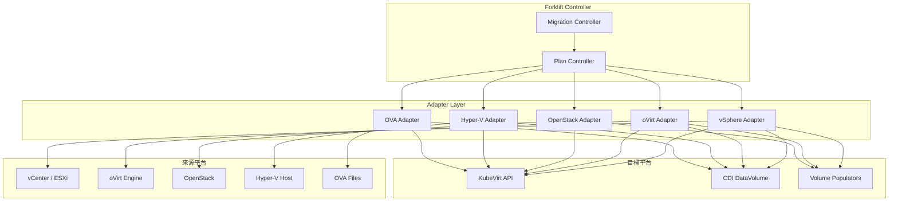
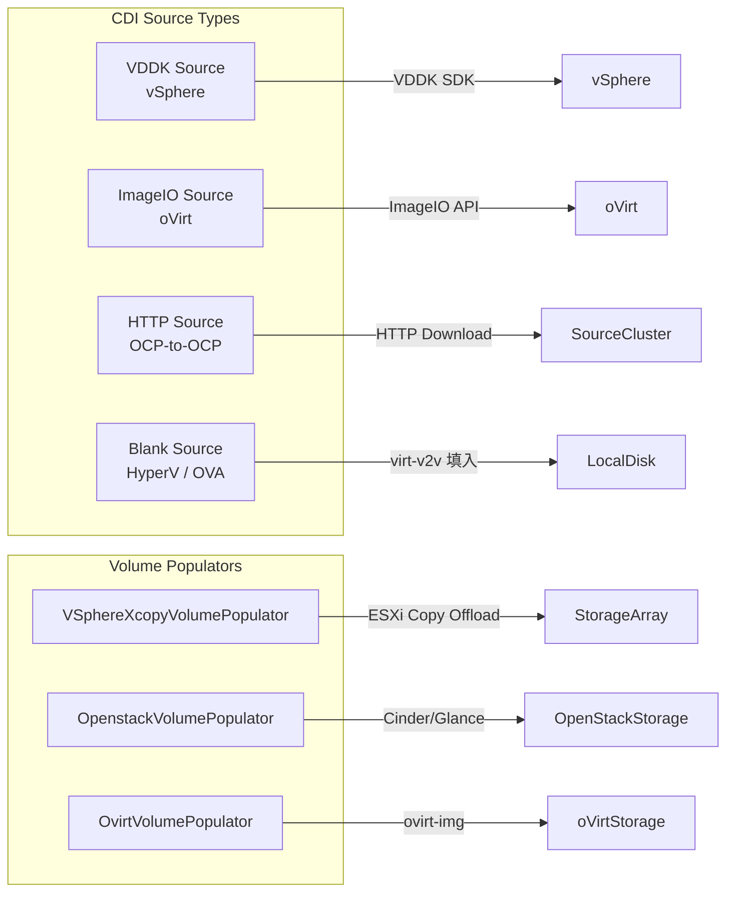
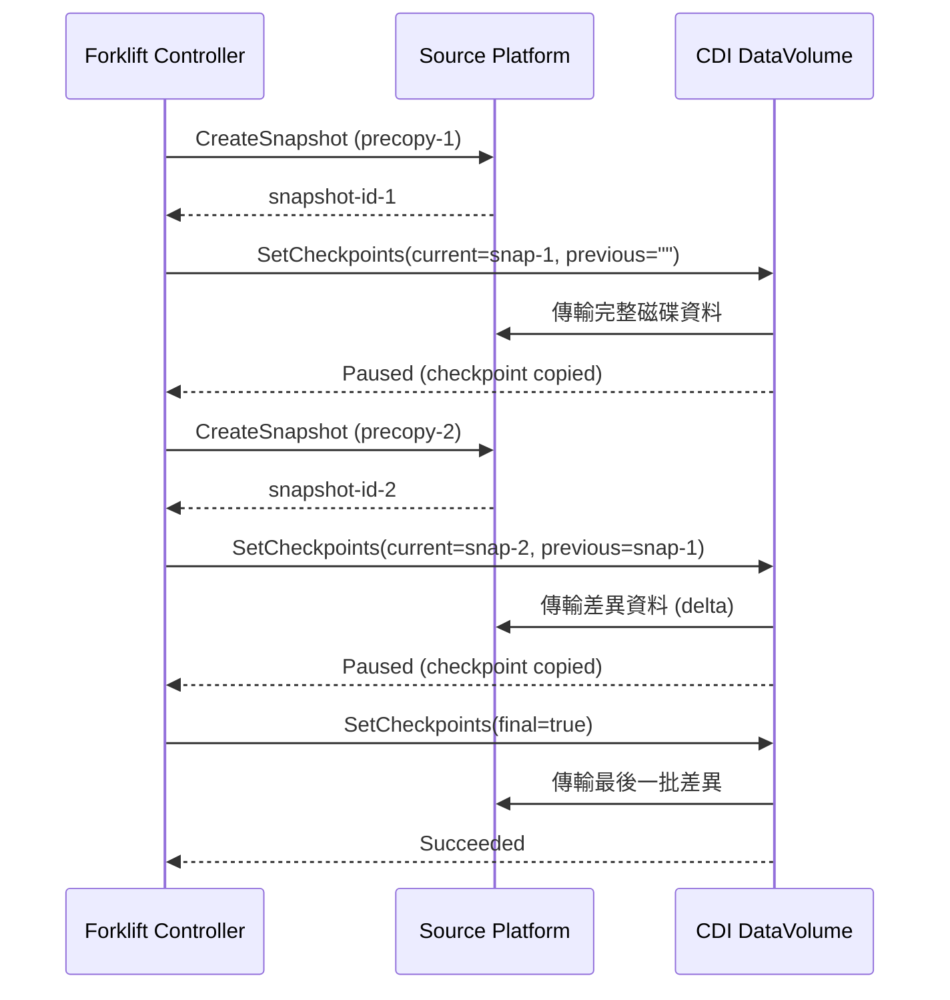
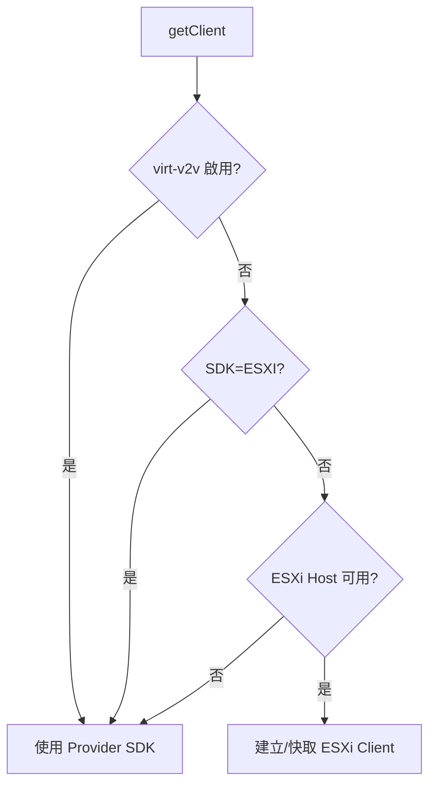
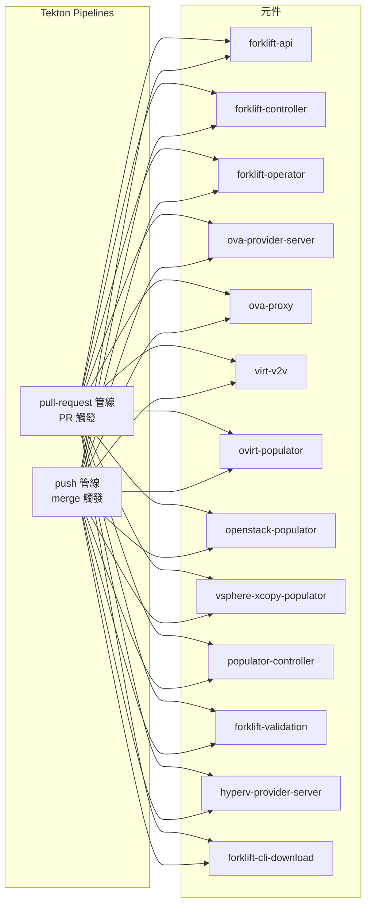

# Forklift — 外部整合

本文件深入分析 [Forklift](https://github.com/kubev2v/forklift) 專案如何與 KubeVirt、CDI、vSphere、oVirt/RHV、OpenStack、Hyper-V 等外部系統整合，並探討 OVA 支援架構與 CI/CD 流程。

::: info 相關章節
- 專案整體架構請參閱 [系統架構](./architecture)
- 遷移流程與 Provider 抽象層請參閱 [核心功能分析](./core-features)
- Controller 架構與 CRD 型別請參閱 [控制器與 API](./controllers-api)
:::

## 整合架構總覽

Forklift 透過 Adapter 模式與多個外部系統整合，每個來源平台實作統一的 `base.Client`、`base.Builder`、`base.Validator` 介面：



## 1. KubeVirt 整合

所有 Adapter 的 Builder 最終都會產生 KubeVirt `VirtualMachine` CR，透過統一的 `VirtualMachine()` 方法建構 `cnv.VirtualMachineSpec`。

### 1.1 CPU 對映

各 Adapter 根據來源平台的 CPU 拓撲產生對應的 KubeVirt CPU 設定：

```go
// 檔案: pkg/controller/plan/adapter/vsphere/builder.go
func (r *Builder) mapCPU(vmRef ref.Ref, vm *model.VM, object *cnv.VirtualMachineSpec) {
	object.Template.Spec.Domain.CPU = &cnv.CPU{
		Sockets: uint32(vm.CpuCount / vm.CoresPerSocket),
		Cores:   uint32(vm.CoresPerSocket),
	}
	if enableNestedVirt := r.NestedVirtualizationSetting(vmRef, vm.NestedHVEnabled); enableNestedVirt != nil {
		policy := "optional"
		if !*enableNestedVirt {
			policy = "disable"
		}
		object.Template.Spec.Domain.CPU.Features = append(
			object.Template.Spec.Domain.CPU.Features,
			cnv.CPUFeature{Name: "vmx", Policy: policy},
			cnv.CPUFeature{Name: "svm", Policy: policy},
		)
	}
}
```

oVirt Adapter 額外支援 CPU pinning 與自訂 CPU model：

```go
// 檔案: pkg/controller/plan/adapter/ovirt/builder.go
func (r *Builder) mapCPU(vmRef ref.Ref, vm *model.Workload, object *cnv.VirtualMachineSpec) {
	object.Template.Spec.Domain.CPU = &cnv.CPU{
		Sockets: uint32(vm.CpuSockets),
		Cores:   uint32(vm.CpuCores),
		Threads: uint32(vm.CpuThreads),
	}
	if vm.CpuPinningPolicy == model.Dedicated {
		object.Template.Spec.Domain.CPU.DedicatedCPUPlacement = true
	}
	if vm.CustomCpuModel != "" {
		r.setCpuFlags(vm.CustomCpuModel, object)
	}
}
```

OpenStack Adapter 從 Flavor ExtraSpecs 讀取 CPU 策略：

```go
// 檔案: pkg/controller/plan/adapter/openstack/builder.go
func (r *Builder) mapResources(vmRef ref.Ref, vm *model.Workload,
    object *cnv.VirtualMachineSpec, usesInstanceType bool) {
	if usesInstanceType {
		return
	}
	cpuPolicy := DefaultProperties[CpuPolicy] // "shared"
	if flavorCPUPolicy, ok := vm.Flavor.ExtraSpecs[FlavorCpuPolicy]; ok {
		cpuPolicy = flavorCPUPolicy
	}
	if cpuPolicy == CpuPolicyDedicated {
		object.Template.Spec.Domain.CPU.DedicatedCPUPlacement = true
	}
	object.Template.Spec.Domain.CPU.Sockets = r.getCpuCount(vm, CpuSockets)
	object.Template.Spec.Domain.CPU.Cores = r.getCpuCount(vm, CpuCores)
	object.Template.Spec.Domain.CPU.Threads = r.getCpuCount(vm, CpuThreads)
}
```

### 1.2 Memory 對映

所有 Adapter 將來源 VM 的記憶體大小轉換為 `resource.Quantity`：

```go
// 檔案: pkg/controller/plan/adapter/vsphere/builder.go
func (r *Builder) mapMemory(vm *model.VM, object *cnv.VirtualMachineSpec) {
	memoryBytes := int64(vm.MemoryMB) * 1024 * 1024
	reservation := resource.NewQuantity(memoryBytes, resource.BinarySI)
	object.Template.Spec.Domain.Memory = &cnv.Memory{Guest: reservation}
}
```

OpenStack 從 Flavor RAM 讀取（單位為 MB）：

```go
// 檔案: pkg/controller/plan/adapter/openstack/builder.go
memory := resource.NewQuantity(int64(vm.Flavor.RAM)*1024*1024, resource.BinarySI)
object.Template.Spec.Domain.Memory = &cnv.Memory{Guest: memory}
```

### 1.3 Firmware 設定（EFI / BIOS）

各 Adapter 根據來源 VM 的 firmware 類型設定 KubeVirt 的 Bootloader。vSphere 範例：

```go
// 檔案: pkg/controller/plan/adapter/vsphere/builder.go
func (r *Builder) mapFirmware(vm *model.VM, object *cnv.VirtualMachineSpec) {
	firmware := &cnv.Firmware{
		Serial: r.getSystemSerial(vm),
	}
	switch vm.Firmware {
	case Efi:
		firmware.Bootloader = &cnv.Bootloader{
			EFI: &cnv.EFI{
				SecureBoot: &vm.SecureBoot,
			}}
		if vm.SecureBoot {
			object.Template.Spec.Domain.Features = &cnv.Features{
				SMM: &cnv.FeatureState{Enabled: &vm.SecureBoot},
			}
		}
	default:
		firmware.Bootloader = &cnv.Bootloader{BIOS: &cnv.BIOS{}}
	}
	object.Template.Spec.Domain.Firmware = firmware
}
```

oVirt 支援 `q35_ovmf` 與 `q35_secure_boot` BIOS 類型：

```go
// 檔案: pkg/controller/plan/adapter/ovirt/builder.go
const (
	ClusterDefault = "cluster_default"
	Q35Ovmf        = "q35_ovmf"
	Q35SecureBoot  = "q35_secure_boot"
)
```

OpenStack 從 Image Properties 或 Volume Metadata 推導 firmware 類型：

```go
// 檔案: pkg/controller/plan/adapter/openstack/builder.go
func (r *Builder) mapFirmware(vm *model.Workload, object *cnv.VirtualMachineSpec) {
	var firmwareType string
	if imageFirmwareType, ok := vm.Image.Properties[FirmwareType]; ok {
		firmwareType = imageFirmwareType.(string)
	} else {
		for _, volume := range vm.Volumes {
			if volume.Bootable == "true" {
				if vft, ok := volume.VolumeImageMetadata[FirmwareType]; ok {
					firmwareType = vft
				}
			}
		}
	}
	// "uefi" → EFI bootloader, 其餘 → BIOS
}
```

### 1.4 Template Labels

Forklift 為產生的 VirtualMachine 加上 KubeVirt Template Labels 以便匹配 Instance Type：

```go
// 檔案: pkg/controller/plan/adapter/vsphere/builder.go
const (
	TemplateOSLabel       = "os.template.kubevirt.io/%s"
	TemplateWorkloadLabel = "workload.template.kubevirt.io/server"
	TemplateFlavorLabel   = "flavor.template.kubevirt.io/medium"
)
```

vSphere Adapter 維護完整的 Guest OS ID 對映表：

| VMware Guest ID | KubeVirt osinfo ID |
|---|---|
| `rhel8_64Guest` | `rhel8.1` |
| `windows9_64Guest` | `win10` |
| `ubuntu64Guest` | `ubuntu18.04` |

OpenStack Adapter 支援動態 workload 與 flavor label：

```go
// 檔案: pkg/controller/plan/adapter/openstack/builder.go
const (
	TemplateWorkloadLabel           = "workload.template.kubevirt.io/%s"
	TemplateWorkloadServer          = "server"
	TemplateWorkloadDesktop         = "desktop"
	TemplateWorkloadHighPerformance = "highperformance"
	TemplateFlavorLabel             = "flavor.template.kubevirt.io/%s"
	TemplateFlavorTiny              = "tiny"
	TemplateFlavorSmall             = "small"
	TemplateFlavorMedium            = "medium"
	TemplateFlavorLarge             = "large"
)
```

### 1.5 Instance Type 與 Preference 支援

當 `usesInstanceType` 為 `true` 時，各 Adapter 會跳過 CPU/Memory 對映，改由 KubeVirt Instance Type 決定：

```go
// 檔案: pkg/controller/plan/adapter/openstack/builder.go
func (r *Builder) mapResources(vmRef ref.Ref, vm *model.Workload,
    object *cnv.VirtualMachineSpec, usesInstanceType bool) {
	if usesInstanceType {
		return // 由 Instance Type 決定 CPU/Memory
	}
	// ... 手動設定 CPU/Memory
}
```

### 1.6 Domain Devices

各 Adapter 設定不同的 domain devices：

| 功能 | vSphere | oVirt | OpenStack | Hyper-V |
|------|---------|-------|-----------|---------|
| Disk Bus | VirtIO / SATA | VirtIO / SCSI / SATA | VirtIO / SCSI / SATA | VirtIO |
| 共享磁碟 | ✓ (Shareable + CacheNone) | — | — | — |
| RDM/LUN | ✓ (cnv.LunTarget) | ✓ (LUN storage type) | — | — |
| TPM | — | — | — | ✓ (Persistent vTPM) |
| RNG | — | — | ✓ (hw_rng) | — |
| Boot Order | SCSI controller order | Bootable flag | — | — |

Hyper-V 的 TPM 支援：

```go
// 檔案: pkg/controller/plan/adapter/hyperv/builder.go
func (r *Builder) mapTpm(vm *model.VM, object *cnv.VirtualMachineSpec) {
	if vm.TpmEnabled {
		object.Template.Spec.Domain.Devices.TPM = &cnv.TPMDevice{Persistent: ptr.To(true)}
	} else {
		object.Template.Spec.Domain.Devices.TPM = &cnv.TPMDevice{Enabled: ptr.To(false)}
	}
}
```

## 2. CDI 整合

Forklift 透過 CDI (Containerized Data Importer) 的 `DataVolume` 資源匯入磁碟資料，不同 Adapter 使用不同的 Source Type。

### 2.1 DataVolume Source Types



**vSphere — VDDK Source（含 CBT 支援）：**

```go
// 檔案: pkg/controller/plan/adapter/vsphere/builder.go
dvSource = cdi.DataVolumeSource{
	VDDK: &cdi.DataVolumeSourceVDDK{
		BackingFile:  baseVolume(disk.File, r.Plan.IsWarm()),
		UUID:         vm.UUID,
		URL:          url,
		SecretRef:    secret.Name,
		Thumbprint:   thumbprint,
		InitImageURL: vddkImage,
	},
}
```

**oVirt — ImageIO Source：**

```go
// 檔案: pkg/controller/plan/adapter/ovirt/builder.go
imageioSource := &cdi.DataVolumeSourceImageIO{
	URL:       url,
	DiskID:    da.Disk.ID,
	SecretRef: secret.Name,
}
```

**OCP — HTTP Source：**

```go
// 檔案: pkg/controller/plan/adapter/ocp/builder.go
func createDataVolumeSpec(size, storageClassName, url, configMap, secret string) *cdi.DataVolumeSpec {
	return &cdi.DataVolumeSpec{
		Source: &cdi.DataVolumeSource{
			HTTP: &cdi.DataVolumeSourceHTTP{
				URL:                url,
				CertConfigMap:      configMap,
				SecretExtraHeaders: []string{secret},
			},
		},
	}
}
```

**Hyper-V / OVA — Blank Source（由 virt-v2v 填入資料）：**

```go
// 檔案: pkg/controller/plan/adapter/hyperv/builder.go
dvSource := cdi.DataVolumeSource{
	Blank: &cdi.DataVolumeBlankImage{},
}
```

### 2.2 Volume Populators

OpenStack、oVirt 與 vSphere 支援透過自訂 Volume Populator 進行磁碟匯入：

```go
// 檔案: pkg/apis/forklift/v1beta1/vsphere_xcopy_volumepopulator.go
type VSphereXcopyVolumePopulatorSpec struct {
	VmId                 string
	VmdkPath             string // '[$DATASTORE] $VM_HOME/$DISK.vmdk'
	SecretName           string
	StorageVendorProduct string // vantara, ontap, primera3par
}
```

```go
// 檔案: pkg/apis/forklift/v1beta1/openstackpopulator.go
type OpenstackVolumePopulatorSpec struct {
	IdentityURL     string
	SecretName      string
	ImageID         string
	TransferNetwork *core.ObjectReference
}
```

```go
// 檔案: pkg/apis/forklift/v1beta1/ovirtpopulator.go
type OvirtVolumePopulatorSpec struct {
	EngineURL        string
	EngineSecretName string
	DiskID           string
	TransferNetwork  *core.ObjectReference
}
```

各 Adapter 的 Populator 支援邏輯：

| Adapter | `SupportsVolumePopulators()` | 條件 |
|---------|------------------------------|------|
| vSphere | 有條件支援 | `CopyOffload` feature flag 啟用且有 offload plugin 設定 |
| OpenStack | 永遠支援 | `return true` |
| oVirt | Cold migration 支援 | `!r.Context.Plan.IsWarm()` |
| Hyper-V | 不支援 | `return false` |
| OCP | 不支援 | `return false`（使用 HTTP source） |

### 2.3 CDI Annotations

Forklift 使用大量 `cdi.kubevirt.io/*` Annotations 控制匯入行為：

```go
// 檔案: pkg/controller/plan/adapter/base/doc.go

// 儲存與綁定
AnnRetainAfterCompletion = "cdi.kubevirt.io/storage.pod.retainAfterCompletion"
AnnBindImmediate         = "cdi.kubevirt.io/storage.bind.immediate.requested"

// VDDK 專用
AnnVddkExtraArgs    = "cdi.kubevirt.io/storage.pod.vddk.extraargs"
AnnImportBackingFile = "cdi.kubevirt.io/storage.import.backingFile"
AnnVddkInitImageURL = "cdi.kubevirt.io/storage.pod.vddk.initimageurl"
AnnThumbprint       = "cdi.kubevirt.io/storage.import.vddk.thumbprint"

// 匯入狀態
AnnEndpoint  = "cdi.kubevirt.io/storage.import.endpoint"
AnnSecret    = "cdi.kubevirt.io/storage.import.secretName"
AnnUUID      = "cdi.kubevirt.io/storage.import.uuid"
AnnPodPhase  = "cdi.kubevirt.io/storage.pod.phase"
AnnImportPod = "cdi.kubevirt.io/storage.import.importPod"
AnnSource    = "cdi.kubevirt.io/storage.import.source"

// Checkpoint（Warm Migration）
AnnFinalCheckpoint    = "cdi.kubevirt.io/storage.checkpoint.final"
AnnCurrentCheckpoint  = "cdi.kubevirt.io/storage.checkpoint.current"
AnnPreviousCheckpoint = "cdi.kubevirt.io/storage.checkpoint.previous"
AnnCheckpointsCopied  = "cdi.kubevirt.io/storage.checkpoint.copied"

// Populator 相關
AnnAllowClaimAdoption = "cdi.kubevirt.io/allowClaimAdoption"
AnnPrePopulated       = "cdi.kubevirt.io/storage.prePopulated"
AnnUsePopulator       = "cdi.kubevirt.io/storage.usePopulator"
```

### 2.4 Import Progress Tracking

Forklift 透過三種機制追蹤匯入進度：

**CDI DataVolume 進度（百分比）：**

```go
// 檔案: pkg/controller/plan/migration.go
func (r *Migration) updateCopyProgress(vm *plan.VMStatus, step *plan.Step) (err error) {
	// 取得 DataVolume 狀態
	// ImportInProgress: 從 CDI status 讀取百分比
	pct := dv.PercentComplete()
	transferred := pct * float64(task.Progress.Total)
	task.Progress.Completed = int64(transferred)
}
```

**Populator 進度（已傳輸位元組）：**

```go
// 檔案: pkg/controller/plan/migration.go
func (r *Migration) updatePopulatorCopyProgress(vm *plan.VMStatus, step *plan.Step) (err error) {
	transferredBytes, _ := r.builder.PopulatorTransferredBytes(pvc)
	percent := float64(transferredBytes/0x100000) / float64(task.Progress.Total)
	newProgress := int64(percent * float64(task.Progress.Total))
}
```

**virt-v2v Prometheus Metrics：**

```go
// 檔案: pkg/controller/plan/migration.go
func (r *Migration) updateConversionProgressV2vMonitor(pod *core.Pod, step *plan.Step) (err error) {
	url := fmt.Sprintf("http://%s:2112/metrics", pod.Status.PodIP)
	// 解析 regex: v2v_disk_transfers{disk_id="(\d+)"} (\d{1,3}\.?\d*)
}
```

### 2.5 Checkpoint-Based Incremental Import（Warm Migration）

Warm Migration 使用 CDI 的 Checkpoint 機制進行增量匯入：



vSphere 使用 CBT ChangeId 追蹤差異：

```go
// 檔案: pkg/controller/plan/adapter/vsphere/client.go
func (r *Client) SetCheckpoints(vmRef ref.Ref, precopies []planapi.Precopy,
    datavolumes []cdi.DataVolume, final bool, hosts util.HostsFunc) (err error) {
	current := precopies[n-1]
	changeIds := previous.DeltaMap()
	for i := range datavolumes {
		dv := &datavolumes[i]
		dv.Spec.Checkpoints = append(dv.Spec.Checkpoints, cdi.DataVolumeCheckpoint{
			Current:  current.Snapshot,
			Previous: changeIds[dv.Spec.Source.VDDK.BackingFile],
		})
		dv.Spec.FinalCheckpoint = final
	}
}
```

oVirt 使用 Disk Snapshot ID：

```go
// 檔案: pkg/controller/plan/adapter/ovirt/client.go
func (r *Client) SetCheckpoints(vmRef ref.Ref, precopies []planapi.Precopy,
    datavolumes []cdi.DataVolume, final bool, hostsFunc util.HostsFunc) (err error) {
	current := precopies[n-1].Snapshot
	for i := range datavolumes {
		dv := &datavolumes[i]
		currentDiskSnapshot, _ := r.getDiskSnapshot(dv.Spec.Source.Imageio.DiskID, current)
		previousDiskSnapshot, _ := r.getDiskSnapshot(dv.Spec.Source.Imageio.DiskID, previous)
		dv.Spec.Checkpoints = append(dv.Spec.Checkpoints, cdi.DataVolumeCheckpoint{
			Current:  currentDiskSnapshot,
			Previous: previousDiskSnapshot,
		})
		dv.Spec.FinalCheckpoint = final
	}
}
```

## 3. vSphere 整合

### 3.1 govmomi SDK 連線流程

Forklift 使用 VMware 官方的 `govmomi` SDK 與 vCenter/ESXi 互動：

```go
// 檔案: pkg/controller/plan/adapter/vsphere/client.go
type Client struct {
	*plancontext.Context
	client      *govmomi.Client
	hostClients map[string]*govmomi.Client
}

func (r *Client) connect() error {
	url, err := liburl.Parse(r.Source.Provider.Spec.URL)
	url.User = liburl.UserPassword(r.user(), r.password())
	soapClient := soap.NewClient(url, base.GetInsecureSkipVerifyFlag(r.Source.Secret))
	soapClient.SetThumbprint(url.Host, r.thumbprint())
	vimClient, err := vim25.NewClient(context.TODO(), soapClient)
	r.client = &govmomi.Client{
		SessionManager: session.NewManager(vimClient),
		Client:         vimClient,
	}
	err = r.client.Login(context.TODO(), url.User)
	return nil
}
```

連線決策邏輯根據環境選擇 vCenter 或 ESXi 直連：



### 3.2 Credential 處理

vSphere Provider 的 Credential 儲存於 Kubernetes Secret：

| Secret Key | 用途 |
|---|---|
| `user` | vSphere/ESXi 使用者名稱 |
| `password` | vSphere/ESXi 密碼 |
| `cacert` | （選填）CA 憑證 |
| `thumbprint` | （選填）SSL 指紋（也可從 `Provider.Status.Fingerprint` 取得） |

```go
// 檔案: pkg/controller/plan/adapter/vsphere/client.go
func (r *Client) user() string {
	if user, found := r.Source.Secret.Data["user"]; found {
		return string(user)
	}
	return ""
}

func (r *Client) thumbprint() string {
	return r.Source.Provider.Status.Fingerprint
}
```

Builder 在建立 DataVolume Secret 時將 credential 轉換為 CDI 格式：

```go
// 檔案: pkg/controller/plan/adapter/vsphere/builder.go
func (r *Builder) Secret(vmRef ref.Ref, in, object *core.Secret) (err error) {
	object.Data = map[string][]byte{
		"accessKeyId": in.Data["user"],
		"secretKey":   in.Data["password"],
	}
	if cacert, ok := util.GetCACert(in); ok {
		object.Data["cacert"] = cacert
	}
	return
}
```

### 3.3 VM 列舉與 Snapshot 管理

VM 透過 `SearchIndex.FindByUuid` 查詢：

```go
// 檔案: pkg/controller/plan/adapter/vsphere/client.go
func (r *Client) getVM(vmRef ref.Ref, hosts util.HostsFunc) (*object.VirtualMachine, error) {
	vm := &model.VM{}
	err := r.Source.Inventory.Find(vm, vmRef)
	searchIndex := object.NewSearchIndex(client)
	vsphereRef, err := searchIndex.FindByUuid(context.TODO(), nil, vm.UUID, true, ptr.To(false))
	vsphereVm = object.NewVirtualMachine(client, vsphereRef.Reference())
	return vsphereVm, nil
}
```

**Snapshot 建立**使用固定名稱並偵測重複任務：

```go
// 檔案: pkg/controller/plan/adapter/vsphere/client.go
const (
	snapshotName = "forklift-migration-precopy"
	snapshotDesc = "Forklift Operator warm migration precopy"
)

func (r *Client) CreateSnapshot(vmRef ref.Ref, hostsFunc util.HostsFunc) (string, string, error) {
	vm, err := r.getVM(vmRef, hostsFunc)
	// 防止重複建立
	if existingTaskId := r.findRunningSnapshotTask(vmRef, vm, hostsFunc, createSnapshotTaskName); existingTaskId != "" {
		return "", existingTaskId, nil
	}
	task, err := vm.CreateSnapshot(context.TODO(), snapshotName, snapshotDesc, false, true)
	return "", task.Reference().Value, nil
}
```

**Snapshot 狀態檢查**透過輪詢 vSphere Task：

```go
// 檔案: pkg/controller/plan/adapter/vsphere/client.go
func (r *Client) CheckSnapshotReady(vmRef ref.Ref, precopy planapi.Precopy, hosts util.HostsFunc) (bool, string, error) {
	taskInfo, err := r.getTaskById(vmRef, precopy.CreateTaskId, hosts)
	ready, err := r.checkTaskStatus(taskInfo)
	if ready && taskInfo.Result != nil {
		snapshotId = taskInfo.Result.(types.ManagedObjectReference).Value
	}
	return ready, snapshotId, nil
}
```

### 3.4 VDDK 磁碟傳輸與 CBT 驗證

VDDK Image 透過 fallback chain 解析：

```go
// 檔案: pkg/controller/plan/adapter/vsphere/settings.go
func GetVDDKImage(providerSpecSettings map[string]string) string {
	vddkImage := providerSpecSettings[api.VDDK]
	if vddkImage == "" && Settings.Migration.VddkImage != "" {
		vddkImage = Settings.Migration.VddkImage
	}
	return vddkImage
}
```

Warm Migration **強制要求** CBT 啟用：

```go
// 檔案: pkg/controller/plan/adapter/vsphere/builder.go
if r.Plan.IsWarm() && !vm.ChangeTrackingEnabled {
	err = liberr.New(
		fmt.Sprintf("Changed Block Tracking (CBT) is disabled for VM %s", vmRef.String()))
	return
}
```

CBT Delta 擷取透過 Snapshot 的 disk backing ChangeId：

```go
// 檔案: pkg/controller/plan/adapter/vsphere/client.go
func (r *Client) GetSnapshotDeltas(vmRef ref.Ref, snapshotId string, hosts util.HostsFunc) (map[string]string, error) {
	changeIdMapping = make(map[string]string)
	for _, device := range snapshot.Config.Hardware.Device {
		switch dev := vDevice.Backing.(type) {
		case *types.VirtualDiskFlatVer2BackingInfo:
			changeIdMapping[trimBackingFileName(dev.FileName)] = dev.ChangeId
		case *types.VirtualDiskSparseVer2BackingInfo:
			changeIdMapping[trimBackingFileName(dev.FileName)] = dev.ChangeId
		case *types.VirtualDiskRawDiskMappingVer1BackingInfo:
			changeIdMapping[trimBackingFileName(dev.FileName)] = dev.ChangeId
		}
	}
	return changeIdMapping, nil
}
```

### 3.5 ESXi Copy Offload

vSphere 支援透過 ESXi 儲存陣列的 XCOPY offload 加速磁碟複製：

```go
// 檔案: pkg/controller/plan/adapter/vsphere/builder.go
func (r *Builder) SupportsVolumePopulators() bool {
	if !settings.Settings.Features.CopyOffload {
		return false
	}
	// 檢查 storage mapping 是否有 VSphereXcopyPluginConfig
}
```

XCOPY PVC 使用 NAA label 實現儲存親和性：

```go
// 檔案: pkg/controller/plan/adapter/vsphere/builder.go
populatorCr := v1beta1.VSphereXcopyVolumePopulator{
	Spec: v1beta1.VSphereXcopyVolumePopulatorSpec{
		VmdkPath:             baseVolume(disk.File, r.Plan.IsWarm()),
		StorageVendorProduct: pluginConfig.VendorProduct, // vantara, ontap, primera3par
	},
}
```

## 4. oVirt/RHV 整合

### 4.1 go-ovirt SDK 連線

Forklift 使用 `github.com/ovirt/go-ovirt` SDK，透過 Builder Pattern 建立連線：

```go
// 檔案: pkg/controller/plan/adapter/ovirt/client.go
func (r *Client) connect() (err error) {
	URL := r.Source.Provider.Spec.URL
	r.connection, err = ovirtsdk.NewConnectionBuilder().
		URL(URL).
		Username(r.user()).
		Password(r.password()).
		CACert(r.cacert()).
		Insecure(base.GetInsecureSkipVerifyFlag(r.Source.Secret)).
		Build()
	return
}
```

底層 SDK 使用 OAuth SSO 驗證：

```go
// 檔案: vendor/github.com/ovirt/go-ovirt/connection.go
// SSO 端點: /ovirt-engine/sso/oauth/token
parameters := map[string]string{
	"scope":      "ovirt-app-api",
	"grant_type": "password",
	"username":   c.username,
	"password":   c.password,
}
```

### 4.2 Credential 格式

| Secret Key | 用途 |
|---|---|
| `user` | oVirt 管理員帳號（如 `admin@internal`） |
| `password` | oVirt 密碼 |
| `cacert` | （選填）PEM 格式 CA 憑證 |
| `insecureSkipVerify` | （選填）跳過 TLS 驗證 |

Provider URL 儲存在 `Provider.Spec.URL`（如 `https://engine.example.com/ovirt-engine/api`）。

### 4.3 Snapshot 管理（Correlation ID）

oVirt 的 Snapshot 操作透過 **Correlation ID** 追蹤，使用 MD5 雜湊避免長度限制：

```go
// 檔案: pkg/controller/plan/adapter/ovirt/client.go
func (r *Client) getSnapshotCorrelationID(vmRef ref.Ref, snapshot *string) (string, error) {
	// 格式: "{MigrationName}-{VMID}-{PrecopyIndex}"
	uniqueID := fmt.Sprintf("%s-%s-%d", r.Migration.Name, vmRef.ID, precopyIndex)
	hashedID := md5.New()
	hashedID.Write([]byte(uniqueID))
	correlationID = hex.EncodeToString(hashedID.Sum(nil))
	return correlationID, nil
}
```

建立 Snapshot 時附帶 Correlation ID：

```go
// 檔案: pkg/controller/plan/adapter/ovirt/client.go
func (r *Client) CreateSnapshot(vmRef ref.Ref, hostsFunc util.HostsFunc) (string, string, error) {
	correlationID, _ := r.getSnapshotCorrelationID(vmRef, nil)
	snap, err := snapsService.Add().Snapshot(
		ovirtsdk.NewSnapshotBuilder().
			Description("Forklift Operator warm migration precopy").
			PersistMemorystate(false).
			MustBuild(),
	).Query("correlation_id", correlationID).Send()
	return snap.MustSnapshot().MustId(), "", nil
}
```

Snapshot 移除使用非同步輪詢並支援 timeout：

```go
// 檔案: pkg/controller/plan/adapter/ovirt/client.go
func (r Client) removePrecopies(precopies []planapi.Precopy, vmService *ovirtsdk.VmService, wg *sync.WaitGroup) {
	cleanupTimeout := time.Now().Add(
		time.Duration(settings.Settings.Migration.SnapshotRemovalTimeout) * time.Minute)
	for i := range precopies {
		correlationID := fmt.Sprintf("%s_finalize", snapshotID[0:8])
		_, err = snapService.Remove().Query("correlation_id", correlationID).Send()
		// 輪詢直到成功或 timeout
	}
}
```

### 4.4 Event 監控

oVirt 使用 Event Code 判斷操作結果：

```go
// 檔案: pkg/controller/plan/adapter/ovirt/client.go
const (
	SNAPSHOT_FINISHED_SUCCESS        int64 = 68
	SNAPSHOT_FINISHED_FAILURE        int64 = 69
	REMOVE_SNAPSHOT_FINISHED_SUCCESS int64 = 356
	REMOVE_SNAPSHOT_FINISHED_FAILURE int64 = 357
)
```

透過 Events API 以 Correlation ID 查詢：

```go
// 檔案: pkg/controller/plan/adapter/ovirt/client.go
func (r *Client) getEvents(correlationID string) ([]*ovirtsdk.Event, error) {
	eventService := r.connection.SystemService().EventsService().List()
	eventResponse, err := eventService.Search(
		fmt.Sprintf("correlation_id=%s", correlationID)).Send()
	ovirtJob = ovirtEvent.Slice()
	return ovirtJob, nil
}
```

Snapshot 就緒檢查解析 Event Code：

```go
// 檔案: pkg/controller/plan/adapter/ovirt/client.go
func (r *Client) CheckSnapshotReady(vmRef ref.Ref, precopy planapi.Precopy, hosts util.HostsFunc) (bool, string, error) {
	events, _ := r.getEvents(correlationID)
	for _, event := range events {
		code, _ := event.Code()
		switch code {
		case SNAPSHOT_FINISHED_FAILURE: // 69
			return false, "", liberr.New("Snapshot creation failed!")
		case SNAPSHOT_FINISHED_SUCCESS: // 68
			return true, precopy.Snapshot, nil
		}
	}
	return false, "", nil
}
```

### 4.5 ovirt-img 磁碟下載

oVirt Populator 使用 `ovirt-img` 工具下載磁碟：

```go
// 檔案: cmd/ovirt-populator/ovirt-populator.go
// 準備 credential 檔案供 ovirt-img 使用
func prepareCredentials(config *engineConfig) {
	writeFile("/tmp/ovirt.pass", config.password)
	if !config.insecure {
		writeFile("/tmp/ca.pem", config.cacert)
	}
}
```

DataVolume 使用 ImageIO Source 進行磁碟傳輸：

```go
// 檔案: pkg/controller/plan/adapter/ovirt/builder.go
func (r *Builder) Secret(_ ref.Ref, in, object *core.Secret) (err error) {
	object.StringData = map[string]string{
		"accessKeyId": string(in.Data["user"]),
		"secretKey":   string(in.Data["password"]),
	}
	return
}
```

## 5. OpenStack 整合

### 5.1 gophercloud SDK

Forklift 使用 `gophercloud` SDK 存取 OpenStack API：

```go
// 檔案: pkg/lib/client/openstack/client.go
type Client struct {
	URL                 string
	Options             map[string]string
	provider            *gophercloud.ProviderClient
	identityService     *gophercloud.ServiceClient
	computeService      *gophercloud.ServiceClient
	imageService        *gophercloud.ServiceClient
	networkService      *gophercloud.ServiceClient
	blockStorageService *gophercloud.ServiceClient
}
```

### 5.2 認證方式

支援三種 Keystone 認證方式（加上 SystemScope 變體）：

```go
// 檔案: pkg/lib/client/openstack/client.go
var supportedAuthTypes = map[string]clientconfig.AuthType{
	"password":              clientconfig.AuthPassword,
	"token":                 clientconfig.AuthToken,
	"applicationcredential": clientconfig.AuthV3ApplicationCredential,
}
```

**Password 認證：**

```go
// 檔案: pkg/lib/client/openstack/client.go
case clientconfig.AuthPassword:
	authInfo.Username = c.getStringFromOptions(Username)
	authInfo.UserID = c.getStringFromOptions(UserID)
	authInfo.Password = c.getStringFromOptions(Password)
```

**Token 認證：**

```go
// 檔案: pkg/lib/client/openstack/client.go
case clientconfig.AuthToken:
	authInfo.Token = c.getStringFromOptions(Token)
```

**Application Credentials 認證：**

```go
// 檔案: pkg/lib/client/openstack/client.go
case clientconfig.AuthV3ApplicationCredential:
	authInfo.Username = c.getStringFromOptions(Username)
	authInfo.ApplicationCredentialID = c.getStringFromOptions(ApplicationCredentialID)
	authInfo.ApplicationCredentialName = c.getStringFromOptions(ApplicationCredentialName)
	authInfo.ApplicationCredentialSecret = c.getStringFromOptions(ApplicationCredentialSecret)
```

Secret 支援的所有設定值：

```go
// 檔案: pkg/lib/client/openstack/client.go
const (
	AuthType                    = "authType"
	Username                    = "username"
	Password                    = "password"
	Token                       = "token"
	ApplicationCredentialID     = "applicationCredentialID"
	ApplicationCredentialName   = "applicationCredentialName"
	ApplicationCredentialSecret = "applicationCredentialSecret"
	SystemScope                 = "systemScope"
	ProjectName                 = "projectName"
	ProjectID                   = "projectID"
	UserDomainName              = "userDomainName"
	DomainName                  = "domainName"
	RegionName                  = "regionName"
	InsecureSkipVerify          = "insecureSkipVerify"
	CACert                      = "cacert"
)
```

### 5.3 Service Clients

Forklift 建立五種 OpenStack Service Client：

| 服務 | API 版本 | 建立方式 | 用途 |
|------|---------|---------|------|
| Identity | v3 | `openstack.NewIdentityV3()` | Regions, Projects, Users, Tokens, Application Credentials |
| Compute | v2 | `openstack.NewComputeV2()` | VMs/Servers, Flavors, Start/Stop, Snapshot Images |
| Image (Glance) | v2 | `openstack.NewImageServiceV2()` | Image CRUD, Image Download |
| Block Storage | v3 | `openstack.NewBlockStorageV3()` | Volumes, Volume Types, Snapshots |
| Network | v2 | `openstack.NewNetworkV2()` | Networks, Subnets |

各 Service Client 使用延遲連線（lazy initialization）：

```go
// 檔案: pkg/lib/client/openstack/client.go
func (c *Client) connectImageServiceAPI() (err error) {
	err = c.Authenticate()
	if err != nil {
		return
	}
	if c.imageService == nil {
		endpointOpts := c.getEndpointOpts()
		c.imageService, err = openstack.NewImageServiceV2(c.provider, endpointOpts)
	}
	return
}
```

### 5.4 Glance Image Download

透過 Glance API 串流下載 Image：

```go
// 檔案: pkg/lib/client/openstack/client.go
func (c *Client) DownloadImage(imageID string) (data io.ReadCloser, err error) {
	err = c.connectImageServiceAPI()
	if err != nil {
		return
	}
	data, err = imagedata.Download(c.imageService, imageID).Extract()
	return
}
```

Volume 也可透過 Block Storage API 上傳為 Image：

```go
// 檔案: pkg/lib/client/openstack/client.go
func (c *Client) UploadImage(name, volumeID string) (image *Image, err error) {
	opts := volumeactions.UploadImageOpts{
		ImageName:  name,
		DiskFormat: "raw",
	}
	volumeImage, err := volumeactions.UploadImage(c.blockStorageService, volumeID, opts).Extract()
	return
}
```

### 5.5 OpenStack VM 電源管理

```go
// 檔案: pkg/lib/client/openstack/client.go
// Start VM
startstop.Start(c.computeService, vmID).ExtractErr()

// Stop VM
startstop.Stop(c.computeService, vmID).ExtractErr()
```

## 6. Hyper-V 整合

### 6.1 WinRM Protocol

Forklift 透過 WinRM（Windows Remote Management）protocol 執行 PowerShell 指令：

```go
// 檔案: pkg/lib/hyperv/driver/winrm.go
func NewWinRMDriver(host string, port int, username, password string,
    insecureSkipVerify bool, caCert []byte) *WinRMDriver {
	if port == 0 {
		port = WinRMPortHTTPS // 5986
	}
	return &WinRMDriver{
		host:               host,
		port:               port,
		username:           username,
		password:           password,
		insecureSkipVerify: insecureSkipVerify,
		caCert:             caCert,
	}
}
```

使用 UTF-16LE 編碼執行複雜 PowerShell 腳本：

```go
// 檔案: pkg/lib/hyperv/powershell/scripts.go
// VM 操作
ListAllVMs = `Get-VM | Select-Object Id, Name, State, ProcessorCount, MemoryStartup, Generation | ConvertTo-Json`
StopVM     = `Stop-VM -Name '%s' -Force -Confirm:$false`

// 磁碟操作
GetVMDisks     = `Get-VMHardDiskDrive -VMName '%s' | Select-Object Path, ControllerType, ControllerNumber, ControllerLocation | ConvertTo-Json`
GetDiskCapacity = `(Get-VHD -Path '%s').Size`

// 網路操作
ListAllSwitches = `Get-VMSwitch | Select-Object Id, Name, SwitchType | ConvertTo-Json`
GetVMNICs       = `Get-VMNetworkAdapter -VMName '%s' | Select-Object Name, MacAddress, SwitchName | ConvertTo-Json`

// SMB 共用
GetSMBSharePath = `(Get-SmbShare -Name '%s').Path`
```

### 6.2 SMB 共用磁碟存取

Hyper-V 使用 SMB CSI Driver 掛載磁碟至 Pod：

```go
// 檔案: pkg/controller/plan/kubevirt.go
// CSI Driver: smb.csi.k8s.io
// Labels: smb-pvc, smb-pv
```

SMB 路徑正規化處理：

```go
// 檔案: pkg/controller/util/smb.go
func ParseSMBSource(providerURL string) string {
	source := strings.ReplaceAll(providerURL, "\\", "/")
	source = strings.TrimPrefix(source, "smb://")
	if !strings.HasPrefix(source, "//") {
		source = "//" + source
	}
	return source
}
// 範例: \\192.168.1.100\VMShare → //192.168.1.100/VMShare
```

### 6.3 Credential 格式

```go
// 檔案: pkg/controller/hyperv/secret.go
const (
	SecretFieldUsername    = "username"     // Hyper-V 主機帳號
	SecretFieldPassword   = "password"     // Hyper-V 主機密碼
	SecretFieldSMBUrl     = "smbUrl"       // SMB 路徑，如 "//192.168.1.100/VMShare"
	SecretFieldSMBUser    = "smbUser"      // （選填）SMB 獨立帳號
	SecretFieldSMBPassword = "smbPassword" // （選填）SMB 獨立密碼
)
```

若未設定 SMB 專用帳密，會 fallback 到 Hyper-V 主機帳密。WinRM 預設使用 HTTPS Port **5986**。

::: info 限制
Hyper-V 僅支援 Cold Migration（`WarmMigration() → false`），不支援增量遷移。
:::

## 7. OVA 支援

### 7.1 OVA Provider Server

OVA Provider Server 提供 HTTP API 服務 OVA 檔案：

```go
// 檔案: cmd/ova-provider-server/main.go
router := logging.GinEngine()
inventoryHandler := api.InventoryHandler{
	Settings:     Settings,
	ProviderType: inventory.ProviderTypeOVA,
}
inventoryHandler.AddRoutes(router)

// Appliance 端點
appliances := api.ApplianceHandler{
	StoragePath:   Settings.CatalogPath, // 預設: /ova
	FileExtension: ovf.ExtOVA,           // ".ova"
}
appliances.AddRoutes(router)
```

API 路由：

| 方法 | 路徑 | 功能 |
|------|------|------|
| GET | `/appliances` | 列出所有 OVA 檔案與 metadata |
| POST | `/appliances` | 上傳 OVA 檔案（含驗證） |
| DELETE | `/appliances/:filename` | 刪除指定 OVA |

回傳格式包含解析後的 VM 資訊：

```go
// 檔案: cmd/provider-common/api/appliance.go
type ApplianceInfo struct {
	File           string     `json:"file"`
	Size           int64      `json:"size,omitempty"`
	Modified       *time.Time `json:"modified,omitempty"`
	Source         string     `json:"source,omitempty"` // VMware, Xen, VirtualBox, oVirt
	VirtualSystems []Ref      `json:"virtualSystems"`
}
```

### 7.2 OVF Parser

OVA 為 TAR 格式，解析時從中提取 `.ovf` XML 描述檔：

```go
// 檔案: cmd/provider-common/ovf/ovf.go
func ExtractEnvelope(ovaPath string) (envelope *Envelope, err error) {
	file, _ := os.Open(ovaPath)
	reader := tar.NewReader(file)
	for {
		header, rErr := reader.Next()
		if strings.HasSuffix(strings.ToLower(header.Name), ExtOVF) {
			decoder := xml.NewDecoder(reader)
			err = decoder.Decode(envelope)
			break
		}
	}
	return
}
```

OVF Envelope 結構描述 VM 的完整元資料：

```go
// 檔案: cmd/provider-common/ovf/ovf.go
type Envelope struct {
	XMLName        xml.Name        `xml:"Envelope"`
	VirtualSystem  []VirtualSystem `xml:"VirtualSystem"`
	DiskSection    DiskSection     `xml:"DiskSection"`
	NetworkSection NetworkSection  `xml:"NetworkSection"`
	References     References      `xml:"References"`
}

type Disk struct {
	Capacity                int64  `xml:"capacity,attr"`
	CapacityAllocationUnits string `xml:"capacityAllocationUnits,attr"`
	DiskId                  string `xml:"diskId,attr"`
	FileRef                 string `xml:"fileRef,attr"`
	Format                  string `xml:"format,attr"`
}
```

來源平台自動偵測：

```go
// 檔案: cmd/provider-common/ovf/ovf.go
func GuessSource(envelope Envelope) string {
	namespaceMap := map[string]string{
		"http://schemas.citrix.com/ovf/envelope/1": SourceXen,
		"http://www.virtualbox.org/ovf/machine":    SourceVirtualBox,
		"http://www.ovirt.org/ovf":                 SourceOvirt,
	}
	// 同時檢查 VMware namespace pattern
	return source
}
```

### 7.3 OVA Proxy 與快取

OVA Proxy 作為 Kubernetes 內部反向代理，支援 Provider 快取：

```go
// 檔案: cmd/ova-proxy/main.go
const (
	ProviderRoute   = "/:namespace/:provider/appliances"
	ServiceTemplate = "http://%s.%s.svc.cluster.local:8080/appliances"
)
```

```go
// 檔案: cmd/ova-proxy/cache.go
type ProxyCache struct {
	cache map[string]CachedProxy
	mutex sync.Mutex
	TTL   time.Duration
}

type CachedProxy struct {
	Proxy    *httputil.ReverseProxy
	CachedAt time.Time
}
```

快取使用 TTL 策略，過期後自動驅逐。支援 TLS（Port 8443）與非 TLS（Port 8080）模式。HTTP Range Request 由 Go 標準 HTTP Server 原生支援，用於大型 OVA 檔案的可續傳下載。

### 7.4 OVA Adapter

OVA Adapter 為 OVFBase Adapter 的別名，共用底層實作：

```go
// 檔案: pkg/controller/plan/adapter/ova/adapter.go
type (
	Adapter           = ovfbase.Adapter
	Builder           = ovfbase.Builder
	Client            = ovfbase.Client
	Validator         = ovfbase.Validator
	DestinationClient = ovfbase.DestinationClient
)
```

## 8. CI/CD 與 Tekton

### 8.1 GitHub Actions

Forklift 使用 12 個 GitHub Actions Workflow：

| Workflow 檔案 | 用途 |
|---|---|
| `build-push-images.yml` | 主要映像檔建置與推送至 Quay.io |
| `pull-request.yml` | PR 驗證 |
| `golangci-lint.yaml` | Go 程式碼 linting |
| `validate-commit-messages.yml` | Commit message 格式驗證 |
| `validate-pr-title.yml` | PR 標題驗證 |
| `validate-forklift-controller-crd.yaml` | CRD 驗證 |
| `release-branch-pull-request.yml` | Release 分支 PR |
| `run-osp-extended-tests.yml` | OpenStack 擴展測試 |
| `backport*.yml` | Cherry-pick 自動化（3 個檔案） |
| `create-new-pr.yml` | PR 自動建立 |

### 8.2 build-push-images Workflow

主要建置流程推送 15+ 個容器映像至 `quay.io/kubev2v`：

```yaml
# 檔案: .github/workflows/build-push-images.yml
env:
  REGISTRY: quay.io
  REGISTRY_ORG: kubev2v
  REGISTRY_TAG: ${{ (github.head_ref||github.ref_name)=='main' && 'latest' || (github.head_ref||github.ref_name) }}
  VERSION: ${{ (github.head_ref||github.ref_name)=='main' && '99.0.0' || (github.head_ref||github.ref_name) }}
```

**Image Tag 策略：**

| 分支 | Tag | Version |
|------|-----|---------|
| `main` | `latest` | `99.0.0` |
| Release 分支 / PR | 分支名稱 | 分支名稱 |

建置矩陣涵蓋所有元件：

```yaml
# 檔案: .github/workflows/build-push-images.yml
matrix:
  include:
    - name: forklift-api
    - name: forklift-controller
    - name: forklift-operator
    - name: forklift-cli-download
    - name: hyperv-provider-server
    - name: openstack-populator
    - name: forklift-ova-provider-server
    - name: ova-proxy
    - name: ovirt-populator
    - name: populator-controller
    - name: forklift-validation
    - name: virt-v2v
    - name: virt-v2v-fedora
    - name: virt-v2v-xfs
    - name: vsphere-copy-offload-populator
```

每個映像檔使用 `docker/build-push-action@v6` 建置：

```yaml
# 檔案: .github/workflows/build-push-images.yml
- uses: docker/build-push-action@v6
  with:
    push: true
    file: "${{ matrix.file }}"
    tags: ${{ env.REGISTRY }}/${{ env.REGISTRY_ORG }}/${{ matrix.repo }}:${{ env.REGISTRY_TAG }}
    build-args: |
      GIT_COMMIT=${{ env.GIT_COMMIT }}
      BUILD_DATE=${{ env.BUILD_DATE }}
```

### 8.3 Tekton Pipelines

`.tekton/` 目錄包含 **32 個** Tekton PipelineRun 定義，分為 `dev-preview-pull-request` 與 `dev-preview-push` 兩類：



Tekton Pipeline 範例（OVA Proxy push）：

```yaml
# 檔案: .tekton/forklift-ova-proxy-dev-preview-push.yaml
apiVersion: tekton.dev/v1
kind: PipelineRun
metadata:
  name: forklift-ova-proxy-dev-preview-on-push
  annotations:
    pipelinesascode.tekton.dev/on-cel-expression: |
      event == "push" && target_branch == "main" &&
      ( ".tekton/forklift-ova-proxy-dev-preview-*.yaml".pathChanged() ||
        "build/ova-proxy/Containerfile-downstream".pathChanged())
spec:
  params:
    - name: output-image
      value: quay.io/redhat-user-workloads/rh-mtv-1-tenant/forklift-operator-dev-preview/forklift-ova-proxy-dev-preview:{{revision}}
    - name: dockerfile
      value: build/ova-proxy/Containerfile-downstream
```

### 8.4 Multi-Architecture 建置

Go 交叉編譯加上 Docker BuildKit 支援多平台建置：

```dockerfile
# 檔案: build/ova-proxy/Containerfile
FROM registry.access.redhat.com/ubi9/go-toolset:1.25.7 AS builder
ENV GOFLAGS="-mod=vendor -tags=strictfipsruntime"
RUN go build -buildvcs=false -ldflags="-w -s" -o proxy \
    github.com/kubev2v/forklift/cmd/ova-proxy

FROM registry.access.redhat.com/ubi9-minimal:9.7
COPY --from=builder /app/proxy /usr/local/bin/ova-proxy
ENTRYPOINT ["/usr/local/bin/ova-proxy"]
```

### 8.5 Registry 組織

| Registry | 組織 | 用途 |
|----------|------|------|
| `quay.io/kubev2v` | 上游社群 | GitHub Actions 推送 |
| `quay.io/redhat-user-workloads/rh-mtv-1-tenant` | Konflux | Tekton Pipeline 推送 |

Tekton 使用遠端 Task Bundle 與 SBOM 產生：

```yaml
# 檔案: .tekton/*-push.yaml
taskRef:
  resolver: bundles
  params:
    - name: bundle
      value: quay.io/konflux-ci/tekton-catalog/task-git-clone-oci-ta:0.1@sha256:...
```

常用 Tekton Task：`init`、`git-clone-oci-ta`、`build-image-index`、`show-sbom`、`prefetch-dependencies`。
