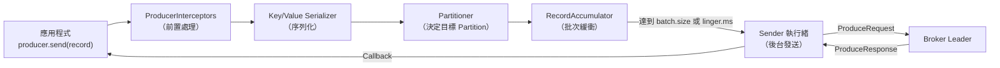
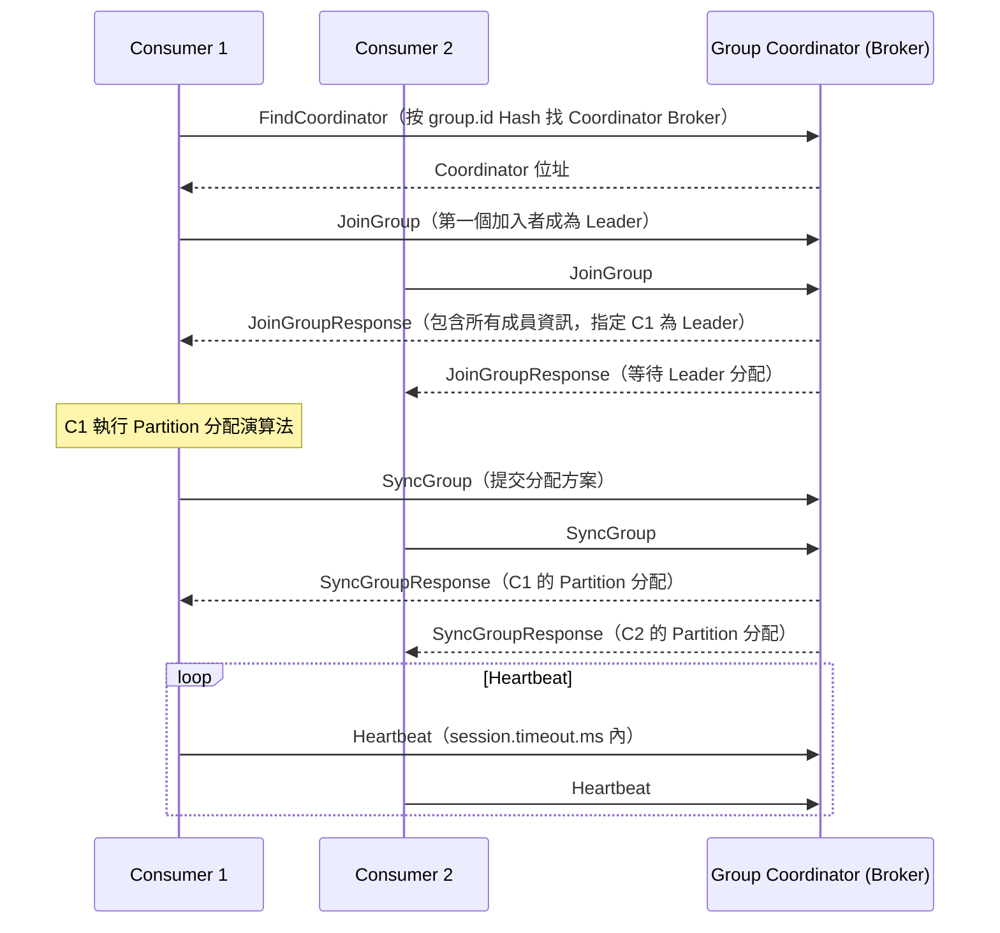
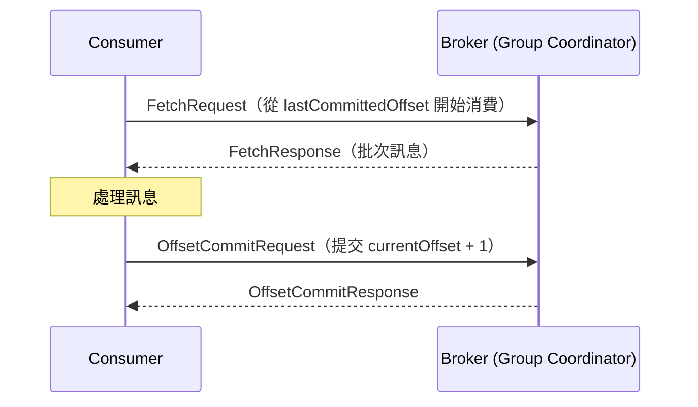
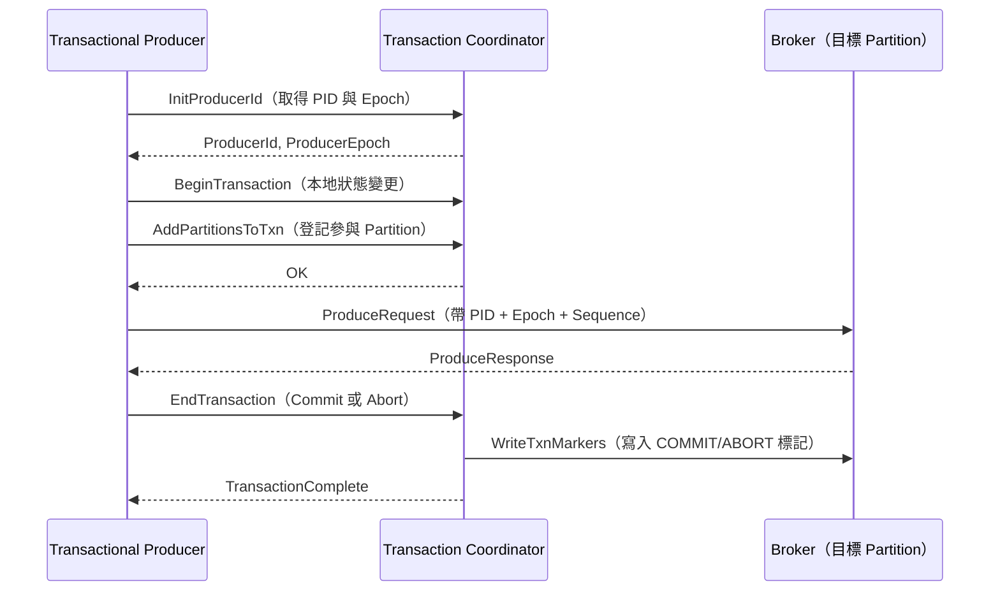

# Apache Kafka — 核心功能分析

::: tip 分析版本
本文件基於 commit [`7b8549f3`](https://github.com/apache/kafka/commit/7b8549f3c4cc26fd2153ef024c2fb743cfe83461) 進行分析。
:::

::: info 相關章節
- 專案簡介與總覽請參閱 [專案總覽](./index)
- 叢集架構與儲存機制請參閱 [系統架構](./architecture)
- 各模組原始碼深度解析請參閱 [核心模組深度解析](./modules)
- Kafka Connect 與外部系統整合請參閱 [外部整合](./integration)
:::

## Producer API

### 核心設計

Kafka Producer（`clients/src/main/java/org/apache/kafka/clients/producer/`）負責將訊息寫入指定的 Topic Partition。主要特性：

| 特性 | 說明 |
|------|------|
| **批次傳送（Batching）** | Producer 在本地緩衝訊息，批次發送以提升吞吐量 |
| **壓縮（Compression）** | 支援 gzip、snappy、lz4、zstd 壓縮算法 |
| **冪等（Idempotent）** | `enable.idempotence=true`：單一 Partition Exactly-Once 寫入 |
| **事務（Transactional）** | 跨多個 Topic/Partition 的原子寫入 |
| **分區策略** | 預設按 Key Hash 路由，無 Key 時使用 Sticky Partition |

### Producer 資料流



### 關鍵 Producer 設定

| 設定 | 說明 | 建議值 |
|------|------|--------|
| `acks` | 確認機制：`0`（不確認）、`1`（Leader 確認）、`-1`/`all`（所有 ISR 確認） | `-1`（高可靠性） |
| `batch.size` | 每個 Batch 的最大位元組數（預設 16KB） | 依吞吐量需求調整 |
| `linger.ms` | 發送前等待更多訊息加入 Batch 的時間（預設 0ms） | 5-100ms |
| `compression.type` | 壓縮算法（none/gzip/snappy/lz4/zstd） | `lz4` 或 `zstd` |
| `retries` | 重試次數（預設 `Integer.MAX_VALUE`） | 保持預設 |
| `enable.idempotence` | 啟用冪等生產（預設 `true`） | `true` |
| `max.block.ms` | `send()` 阻塞最大等待時間（預設 60s） | 依應用需求 |

## Consumer API

### Consumer Group 協調



### Partition 分配策略

| 策略 | 說明 |
|------|------|
| **RangeAssignor**（預設） | 按 Topic 範圍分配，同一 Topic 的相鄰 Partition 分給同一 Consumer |
| **RoundRobinAssignor** | 所有 Partition 循環分配，負載更均勻 |
| **StickyAssignor** | 盡量保持現有分配，最小化 Rebalance 時的分配變更 |
| **CooperativeStickyAssignor** | Incremental Cooperative Rebalance，避免全量停止消費 |

### 位移管理

Consumer 的消費位移（Offset）儲存在 Kafka 內建的 Topic `__consumer_offsets`：



| 設定 | 說明 |
|------|------|
| `enable.auto.commit` | 自動提交位移（預設 `true`） |
| `auto.commit.interval.ms` | 自動提交間隔（預設 5000ms） |
| `auto.offset.reset` | 無既有位移時的起始位置：`earliest`/`latest`/`none` |

## 事務與 Exactly-Once 語義

### 事務流程

Kafka 事務允許跨多個 Topic/Partition 的原子寫入，常用於 Kafka Streams 的 Exactly-Once Processing：



### Exactly-Once 組合

| 層級 | 機制 |
|------|------|
| **Producer → Broker** | 冪等（Idempotent）：每筆訊息帶 PID + Sequence，Broker 去重 |
| **跨 Partition 原子性** | 事務（Transaction）：原子提交或中止 |
| **Consume → Process → Produce** | Kafka Streams EOS：`processing.guarantee=exactly_once_v2` |

## 訊息格式（Record Format）

Kafka 訊息以 **RecordBatch** 為單位儲存，v2 格式（Kafka 0.11+）：

```
RecordBatch:
  baseOffset (INT64)
  batchLength (INT32)
  partitionLeaderEpoch (INT32)
  magic (INT8) = 2
  crc (UINT32)
  attributes (INT16)  -- 壓縮類型、時間戳類型、是否為事務
  lastOffsetDelta (INT32)
  baseTimestamp (INT64)
  maxTimestamp (INT64)
  producerId (INT64)
  producerEpoch (INT16)
  baseSequence (INT32)
  records (ARRAY of Record):
    length (VARINT)
    attributes (INT8)
    timestampDelta (VARLONG)
    offsetDelta (VARINT)
    keyLength (VARINT)
    key (BYTES)
    valueLen (VARINT)
    value (BYTES)
    headers (ARRAY)
```

RecordBatch 層級的壓縮意味著整個 Batch 作為一個整體被壓縮，在高訊息量場景下壓縮比遠優於單條訊息壓縮。

## Kafka Streams 串流處理

Kafka Streams 是內建於 Kafka 的串流處理程式庫，不需要獨立的叢集或執行環境：

### 高階 DSL

```java
// 單詞計數範例
StreamsBuilder builder = new StreamsBuilder();
KStream<String, String> textLines = builder.stream("text-input");
KTable<String, Long> wordCounts = textLines
    .flatMapValues(line -> Arrays.asList(line.toLowerCase().split("\\s+")))
    .groupBy((key, word) -> word)
    .count(Materialized.as("word-count-store"));
wordCounts.toStream().to("word-count-output", Produced.with(Serdes.String(), Serdes.Long()));
```

### 狀態儲存（State Store）

| 類型 | 說明 |
|------|------|
| **KeyValueStore** | 通用 KV 儲存（RocksDB 或 in-memory） |
| **WindowStore** | 時間視窗聚合儲存 |
| **SessionStore** | Session 視窗聚合儲存 |
| **TimestampedKeyValueStore** | 帶時間戳的 KV 儲存（Streams DSL 預設） |

所有狀態儲存都以 Kafka Topic（changelog）作為後端，支援故障恢復與再平衡後的狀態遷移。

### 視窗類型

| 視窗 | 說明 |
|------|------|
| **Tumbling Window** | 固定大小、不重疊的視窗（如每 5 分鐘一個視窗） |
| **Hopping Window** | 固定大小、可重疊的視窗（如每 1 分鐘滾動、視窗大小 5 分鐘） |
| **Sliding Window** | 滑動視窗，基於訊息時間戳差值定義 |
| **Session Window** | 活動間隔小於設定值的訊息歸為同一 Session |
