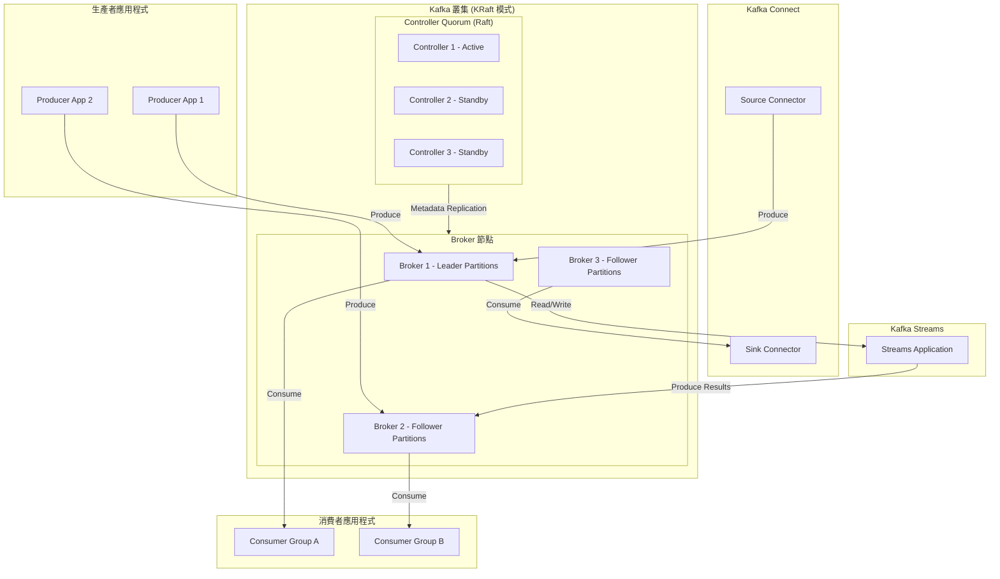

# Apache Kafka — 專案總覽

::: tip 分析版本
本文件基於 commit [`7b8549f3`](https://github.com/apache/kafka/commit/7b8549f3c4cc26fd2153ef024c2fb743cfe83461) 進行分析。
:::

## 專案資訊

| 項目 | 說明 |
|------|------|
| **專案名稱** | Apache Kafka |
| **Repository** | [apache/kafka](https://github.com/apache/kafka) |
| **語言／框架** | Java 17 / 25、Scala 2.13.18 |
| **Java Release Target** | clients／streams：`11`；其餘模組：`17` |
| **版本** | `4.4.0-SNAPSHOT`（trunk） |
| **Maven Group ID** | `org.apache.kafka` |
| **建置工具** | Gradle（多模組 Multi-Project Build） |
| **授權** | Apache License 2.0 |
| **官方網站** | [kafka.apache.org](https://kafka.apache.org) |
| **專案類型** | 分散式事件串流平台（Distributed Event Streaming Platform） |
| **最低執行環境** | Java 11（clients／streams）；Java 17（其餘元件） |

## 專案簡介

**Apache Kafka** 是一個開放原始碼的分散式事件串流平台，被全球數千家企業用於高效能資料管線、串流分析、資料整合以及關鍵任務應用程式。Kafka 最初由 LinkedIn 開發，並於 2011 年捐獻給 Apache Software Foundation，至今已成為業界最廣泛使用的訊息佇列與事件串流基礎設施之一。

Kafka 的核心設計以**持久化的分散式 Log（Commit Log）**為基礎，允許生產者（Producer）將訊息寫入具分區（Partition）概念的主題（Topic），再由一個或多個消費者群組（Consumer Group）以高吞吐量並行消費。Kafka 的資料持久化機制與可重播（Replayable）特性，使其同時扮演訊息佇列與資料庫的雙重角色，並能作為大規模微服務架構的事件匯流排（Event Bus）。

自版本 2.8 起，Kafka 正式引入 **KRaft 模式**（Kafka Raft Metadata），以內建的 Raft 共識協定取代對 Apache ZooKeeper 的外部依賴，大幅簡化部署複雜度並提升元資料管理的可擴展性。在 4.x 版本中，KRaft 已成為唯一支援的部署模式，ZooKeeper 模式已完全移除。

## 文件目錄

| 文件 | 說明 |
|------|------|
| [系統架構](./architecture) | KRaft 叢集拓撲、Broker／Controller 角色分離、網路層、Log 儲存機制、複製協定 |
| [核心功能分析](./core-features) | Producer／Consumer API、訊息格式、分區分配演算法、位移管理、Transaction 支援 |
| [核心模組深度解析](./modules) | `core`、`clients`、`streams`、`connect`、`raft`、`metadata`、`storage` 模組詳解 |
| [外部整合](./integration) | Kafka Connect 連接器生態系、MirrorMaker 2、Schema Registry 整合、監控指標 |

## 系統架構概覽

### 關鍵元件

| 元件 | 角色 | 說明 |
|------|------|------|
| **Broker** | 資料節點 | 儲存 Topic Partition 資料、處理 Producer 寫入與 Consumer 拉取請求的核心伺服器程序 |
| **Controller（KRaft）** | 元資料節點 | 使用 Raft 共識協定管理叢集元資料、Partition 領導者選舉、Broker 成員關係 |
| **Producer** | 寫入用戶端 | 向指定 Topic 發送訊息，支援批次傳送、壓縮、冪等與 Exactly-Once 語義 |
| **Consumer Group** | 消費用戶端 | 以群組為單位消費 Topic，每個 Partition 在同一群組中僅由一個消費者負責 |
| **Kafka Connect** | 資料整合框架 | 透過 Source Connector 從外部系統攝取資料、透過 Sink Connector 輸出至外部系統 |
| **Kafka Streams** | 串流處理程式庫 | 內建的串流處理框架，支援有狀態拓撲計算，直接運行於應用程式 JVM 中 |

### 架構圖



## 核心模組

| 模組 | 語言 | 說明 |
|------|------|------|
| `core` | Scala | Kafka Broker 核心實作，含 ReplicaManager、LogManager、KafkaApis |
| `clients` | Java | 官方用戶端程式庫（Producer、Consumer、AdminClient） |
| `streams` | Java | Kafka Streams DSL 與 Processor API 串流處理程式庫 |
| `connect/api` | Java | Connector、Task、Transform 抽象介面定義 |
| `connect/runtime` | Java | Connect Worker 執行環境（Standalone 與 Distributed 模式） |
| `connect/transforms` | Java | 內建 Single Message Transforms（SMT） |
| `connect/mirror` | Java | MirrorMaker 2（跨叢集資料複製）Connector 實作 |
| `raft` | Java | KRaft（Kafka Raft）協定實作，取代 ZooKeeper |
| `metadata` | Java | 叢集元資料管理，KRaft 模式下的 Metadata Log 處理 |
| `storage` | Java | 統一儲存層抽象與實作 |
| `group-coordinator` | Java | Consumer Group 協調器 |
| `transaction-coordinator` | Java | 事務協調器，支援 Exactly-Once 語義 |
| `tools` | Java/Scala | 管理工具（kafka-topics.sh、kafka-consumer-groups.sh 等） |

## 建置系統

Kafka 使用 **Gradle** 進行多模組建置：

```bash
./gradlew jar                           # 編譯並打包 JAR
./gradlew clean releaseTarGz            # 建置發行壓縮包
./gradlew test                          # 執行所有測試
./gradlew unitTest                      # 執行單元測試
./gradlew integrationTest               # 執行整合測試
./gradlew checkstyleMain spotlessCheck  # 靜態分析
./gradlew spotlessApply                 # 修復 import 排序
./gradlew aggregatedJavadoc             # 生成 Javadoc
```

啟動本地 Broker（KRaft 單機模式）：

```bash
KAFKA_CLUSTER_ID="$(./bin/kafka-storage.sh random-uuid)"
./bin/kafka-storage.sh format --standalone -t $KAFKA_CLUSTER_ID -c config/server.properties
./bin/kafka-server-start.sh config/server.properties
```

## 與現有生態系比較

| 特性 | Apache Kafka | KubeVirt | NetBox | Multus CNI |
|------|-------------|----------|--------|------------|
| **主要語言** | Java / Scala | Go | Python / Django | Go |
| **執行環境** | JVM（Java 11+/17+） | Kubernetes Pod | Python WSGI + PostgreSQL | Kubernetes CNI Plugin |
| **核心職責** | 分散式事件串流平台 | VM 管理（KVM on K8s） | 網路基礎設施管理（IPAM/DCIM） | Pod 多網路介面 |
| **狀態管理** | 持久化 Log（本地磁碟） | etcd（透過 Kubernetes CRD） | PostgreSQL（ORM） | 無狀態 |
| **擴展機制** | Connector API / Streams DSL | Operator Pattern / CRD | Plugin System（Django AppConfig） | CNI Delegate Plugin |
| **API 風格** | 自訂二進位協定（TCP）+ REST | Kubernetes API（宣告式 YAML） | REST + GraphQL（CRUD） | CNI 規範（JSON） |
| **建置系統** | Gradle（Multi-Project） | Makefile + Bazel + Go Modules | pip / setuptools | Makefile + Go Modules |
| **部署方式** | 獨立 JVM 程序 / Docker / K8s | Kubernetes Operator | Gunicorn + Nginx + Systemd | DaemonSet（CNI Binary） |
| **高可用機制** | KRaft Raft Quorum + Partition Replication | Kubernetes Deployment 副本 | 多實例 + DB 主從 | 不適用 |

::: info 相關章節
本文件為 Apache Kafka 分析系列的總覽頁。詳細技術內容請參閱以下章節：
- [系統架構](./architecture) — KRaft 叢集架構、Broker／Controller 分離、Log 儲存引擎、網路協定層
- [核心功能分析](./core-features) — Producer／Consumer API 語義、事務與 Exactly-Once、分區分配策略
- [核心模組深度解析](./modules) — `core`、`clients`、`streams`、`connect`、`raft`、`metadata` 原始碼分析
- [外部整合](./integration) — Kafka Connect 連接器生態系、MirrorMaker 2 跨叢集複製、JMX / Prometheus 監控整合
:::
