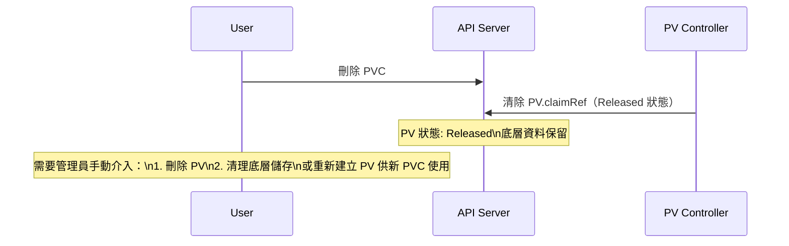
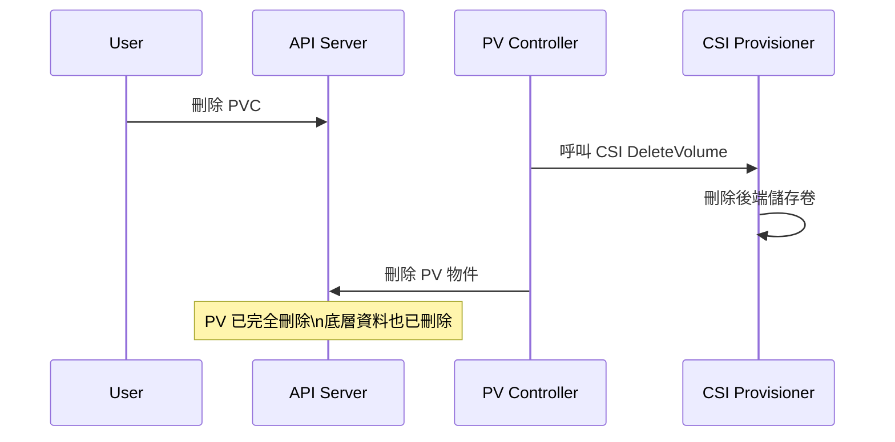

# Kubernetes — 存取模式、卷模式與回收策略

::: info 相關章節
- 架構基礎請參閱 [PV/PVC 架構總覽](./pv-pvc-architecture)
- 生命週期請參閱 [PV/PVC 生命週期與綁定機制](./pv-pvc-lifecycle)
- CSI 架構請參閱 [CSI 整合架構](./csi-integration)
- 故障排除請參閱 [常見問題與排錯指南](./troubleshooting)
:::

## 存取模式（Access Modes）

API 型別定義：`staging/src/k8s.io/api/core/v1/types.go`

| 存取模式 | 縮寫 | 說明 |
|---------|------|------|
| `ReadWriteOnce` | RWO | 單一節點可同時讀寫。同一節點上的多個 Pod 可共用。 |
| `ReadOnlyMany` | ROX | 多個節點同時唯讀。 |
| `ReadWriteMany` | RWX | 多個節點同時讀寫（需要支援分散式檔案系統）。 |
| `ReadWriteOncePod` | RWOP | 僅限**單一 Pod** 讀寫（比 RWO 限制更嚴格，Kubernetes 1.22+ Beta）。 |

### 各儲存後端支援矩陣

| 儲存後端 | RWO | ROX | RWX | RWOP |
|---------|:---:|:---:|:---:|:----:|
| AWS EBS (CSI) | ✅ | ❌ | ❌ | ✅ |
| GCE PD (CSI) | ✅ | ✅ | ❌ | ✅ |
| Azure Disk (CSI) | ✅ | ❌ | ❌ | ✅ |
| Azure File (CSI) | ✅ | ✅ | ✅ | ❌ |
| NFS | ✅ | ✅ | ✅ | ❌ |
| CephFS (CSI) | ✅ | ✅ | ✅ | ✅ |
| Ceph RBD (CSI) | ✅ | ✅ | ❌ | ✅ |
| Local Volume | ✅ | ❌ | ❌ | ✅ |
| HostPath | ✅ | ❌ | ❌ | ❌ |

### ReadWriteOncePod（RWOP）詳解

RWOP 是 Kubernetes 1.22 引入的新存取模式，由 Admission Controller 強制執行：

- 綁定 RWOP PVC 的 Pod 在整個叢集中只能有一個
- 若同時有兩個 Pod 嘗試掛載同一個 RWOP PVC，第二個 Pod 會被 Admission 拒絕
- 原始碼：`plugin/pkg/admission/storage/persistentvolume/admission.go`

---

## 卷模式（Volume Mode）

`volumeMode` 欄位控制卷如何呈現給 Pod：

### Filesystem 模式（預設）

- 卷以**已格式化的檔案系統**掛載到 Pod 的指定路徑
- 預設 Filesystem 類型由 CSI 驅動決定（通常為 ext4 或 xfs）
- 可透過 StorageClass parameters 指定 `csi.storage.k8s.io/fstype`

```yaml
spec:
  volumeMode: Filesystem   # 預設值，可省略
  accessModes:
    - ReadWriteOnce
```

### Block 模式（Raw Block Volume）

- 卷以**原始區塊裝置**（Raw Block Device）呈現，不進行格式化
- 適用於需要直接操作區塊裝置的應用（如資料庫、VM 映像）
- Pod 中使用 `volumeDevices` 而非 `volumeMounts`

```yaml
# PVC
spec:
  volumeMode: Block
  accessModes:
    - ReadWriteOnce

# Pod
spec:
  containers:
    - name: app
      volumeDevices:
        - name: data
          devicePath: /dev/xvda   # 裝置路徑（非掛載點）
```

**原始碼**：`pkg/volume/csi/csi_block.go`

---

## 回收策略（Reclaim Policy）

PV 的 `persistentVolumeReclaimPolicy` 決定 PVC 刪除後的行為：

### Retain（保留）



- PV 進入 `Released` 狀態，不會自動重新使用或刪除
- 底層儲存資源**保留**（資料不遺失）
- 需要管理員手動清理或重新利用

**適用場景**：生產資料庫、需要保留歷史資料的環境

### Delete（刪除，動態佈建預設值）



- PVC 刪除後，PV 與底層儲存**同時刪除**
- 適合無狀態或可重建的工作負載

**適用場景**：臨時資料、開發測試環境

### Recycle（已廢棄）

- 執行 `rm -rf /volume/*` 清空資料後重新標記為 Available
- **已在 Kubernetes 1.11 廢棄**，建議使用動態佈建替代
- 仍可在 `pkg/volume/hostpath/` 中看到舊有實作

---

## 臨時卷類型比較

Kubernetes 支援多種不需要 PV/PVC 的臨時儲存方案：

| 類型 | 生命週期 | 資料持久性 | 大小限制 | 使用場景 |
|------|---------|-----------|---------|---------|
| `emptyDir` | Pod 生命週期 | 無（Pod 刪除即清除） | 可設定 `sizeLimit` | 暫存快取、跨容器共享 |
| `hostPath` | 節點生命週期 | 持久（直到手動清除） | 無 | 節點級日誌、系統工具 |
| `configMap` | 叢集生命週期 | ConfigMap 存在即可用 | 1 MiB | 設定檔注入 |
| `secret` | 叢集生命週期 | Secret 存在即可用 | 1 MiB | 憑證、Token 注入 |
| `projected` | 叢集生命週期 | 多來源合併 | - | 合併多個 ConfigMap/Secret |
| Generic Ephemeral | Pod 生命週期 | 無（Pod 刪除時刪除 PVC） | 依 StorageClass | 需要 CSI 支援的臨時儲存 |
| CSI Ephemeral | Pod 生命週期 | 無 | CSI 驅動決定 | Secrets Store CSI |

### Generic Ephemeral Volume

Kubernetes 1.23 GA，允許在 Pod spec 中內嵌 PVC 定義：

```yaml
spec:
  volumes:
    - name: scratch
      ephemeral:
        volumeClaimTemplate:
          spec:
            storageClassName: fast-ssd
            accessModes:
              - ReadWriteOnce
            resources:
              requests:
                storage: 10Gi
```

Pod 刪除時，對應的 PVC 也會自動刪除（由 Garbage Collector 處理）。

---

## 常用卷類型對比

| 類型 | 動態佈建 | 持久化 | 多節點 | 典型用途 |
|------|---------|--------|--------|---------|
| `nfs` | ❌（需手動或 NFS Provisioner） | ✅ | ✅ RWX | 共享檔案儲存 |
| `local` | ❌（需 Local Static Provisioner） | ✅ | ❌ RWO only | 高效能本地 SSD |
| `hostPath` | ❌ | 視節點 | ❌ | 開發/測試 |
| `csi`（各廠商） | ✅ | ✅ | 視驅動 | 雲端儲存、Ceph 等 |
| `iscsi` | ❌ | ✅ | ❌ RWO | 企業 SAN 儲存 |
| `fc` | ❌ | ✅ | ❌ RWO | 光纖通道 SAN |
