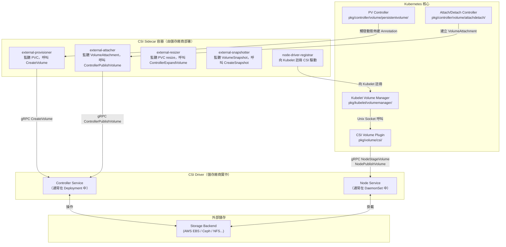
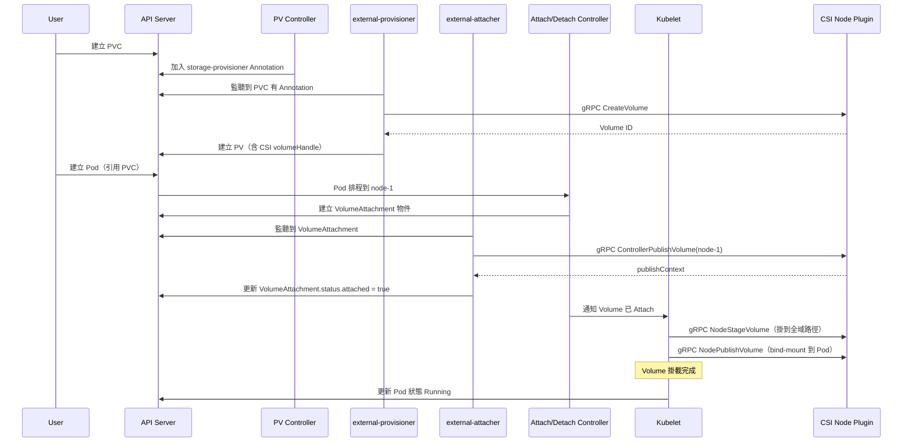

# Kubernetes — CSI 整合架構

::: info 相關章節
- 架構基礎請參閱 [PV/PVC 架構總覽](./pv-pvc-architecture)
- 生命週期請參閱 [PV/PVC 生命週期與綁定機制](./pv-pvc-lifecycle)
- StorageClass 佈建請參閱 [StorageClass 與動態佈建](./storageclass-provisioning)
- 故障排除請參閱 [常見問題與排錯指南](./troubleshooting)
:::

## CSI 架構概述

**CSI（Container Storage Interface）** 是 Kubernetes 與儲存廠商之間的標準化 gRPC 介面，讓儲存廠商可以在不修改 Kubernetes 核心的情況下開發自己的儲存驅動。



---

## CSI gRPC 服務介面

CSI 規格定義了三個 gRPC 服務介面：

### 1. Identity Service（必須實作）

```protobuf
service Identity {
    rpc GetPluginInfo(GetPluginInfoRequest) returns (GetPluginInfoResponse) {}
    rpc GetPluginCapabilities(GetPluginCapabilitiesRequest) returns (GetPluginCapabilitiesResponse) {}
    rpc Probe(ProbeRequest) returns (ProbeResponse) {}
}
```

### 2. Controller Service（在 Controller Pod 實作）

| gRPC 方法 | Kubernetes 觸發時機 | 說明 |
|-----------|-------------------|------|
| `CreateVolume` | PVC 動態佈建時 | 在後端建立儲存卷 |
| `DeleteVolume` | PV 回收（Delete 策略）時 | 刪除後端儲存卷 |
| `ControllerPublishVolume` | Pod 排程到節點時（Attach） | 將卷附掛到節點（e.g. AWS EBS Attach） |
| `ControllerUnpublishVolume` | Pod 從節點移除時（Detach） | 從節點卸掛卷 |
| `ValidateVolumeCapabilities` | StorageClass Admission 時 | 驗證存取模式是否支援 |
| `ListVolumes` | 可選 | 列出所有卷 |
| `CreateSnapshot` | VolumeSnapshot 建立時 | 建立卷快照 |
| `DeleteSnapshot` | VolumeSnapshot 刪除時 | 刪除卷快照 |
| `ControllerExpandVolume` | PVC resize 時 | 擴大控制層面的卷容量 |

### 3. Node Service（在 DaemonSet 的 Node Pod 實作）

| gRPC 方法 | Kubernetes 觸發時機 | 說明 |
|-----------|-------------------|------|
| `NodeStageVolume` | 掛載到節點暫存目錄時 | 格式化、掛載到全域路徑（shared mount） |
| `NodeUnstageVolume` | 從節點暫存目錄卸掛時 | 從全域路徑卸掛 |
| `NodePublishVolume` | 掛載到 Pod 目錄時 | bind-mount 到 Pod 特定路徑 |
| `NodeUnpublishVolume` | 從 Pod 目錄卸掛時 | 取消 bind-mount |
| `NodeGetVolumeStats` | Kubelet 收集卷使用量時 | 回傳卷使用統計 |
| `NodeExpandVolume` | Filesystem resize 時 | 擴大節點上的 Filesystem |
| `NodeGetCapabilities` | Kubelet 查詢驅動能力時 | 回傳 Node 服務支援的功能 |

---

## 完整掛載時序圖



---

## VolumeAttachment 資源

`VolumeAttachment` 是 Kubernetes 用來追蹤 CSI Volume 附掛狀態的 API 物件：

```yaml
apiVersion: storage.k8s.io/v1
kind: VolumeAttachment
metadata:
  name: csi-abc123
spec:
  attacher: ebs.csi.aws.com       # CSI 驅動名稱
  nodeName: ip-10-0-1-100         # 目標節點
  source:
    persistentVolumeName: pvc-123 # 對應的 PV
status:
  attached: true                  # Attach 完成後設為 true
  attachmentMetadata:
    devicePath: /dev/xvdba        # 裝置路徑（由驅動回傳）
```

原始碼：`pkg/controller/volume/attachdetach/attach_detach_controller.go`

---

## CSINode 與 CSIDriver 資源

### CSINode

記錄節點上已安裝的 CSI 驅動資訊與拓撲標籤：

```yaml
apiVersion: storage.k8s.io/v1
kind: CSINode
metadata:
  name: ip-10-0-1-100
spec:
  drivers:
    - name: ebs.csi.aws.com
      nodeID: i-0abcdef1234567890    # 節點在儲存系統中的 ID
      topologyKeys:
        - topology.kubernetes.io/zone
        - topology.ebs.csi.aws.com/zone
```

### CSIDriver

叢集層面宣告 CSI 驅動的能力：

```yaml
apiVersion: storage.k8s.io/v1
kind: CSIDriver
metadata:
  name: ebs.csi.aws.com
spec:
  attachRequired: true           # 是否需要 Attach/Detach 操作
  podInfoOnMount: false          # 是否將 Pod 資訊傳給 NodePublishVolume
  volumeLifecycleModes:
    - Persistent                 # 支援 PV/PVC 模式
    - Ephemeral                  # 支援 Generic Ephemeral Volume
  storageCapacity: true          # 是否支援 StorageCapacity API
  fsGroupPolicy: File            # Filesystem Group Policy
```

---

## In-tree 插件遷移至 CSI

Kubernetes 正在逐步將原本內建（in-tree）的儲存插件遷移到 CSI：

| In-tree 插件 | 對應 CSI 驅動 | 遷移狀態 |
|-------------|-------------|---------|
| `kubernetes.io/aws-ebs` | `ebs.csi.aws.com` | GA（預設遷移） |
| `kubernetes.io/gce-pd` | `pd.csi.storage.gke.io` | GA |
| `kubernetes.io/azure-disk` | `disk.csi.azure.com` | GA |
| `kubernetes.io/azure-file` | `file.csi.azure.com` | GA |
| `kubernetes.io/cinder` | `cinder.csi.openstack.org` | GA |
| `kubernetes.io/vsphere-volume` | `csi.vsphere.volume` | GA |

遷移由 `CSIMigration` Feature Gate 控制，遷移程式庫位於：
`staging/src/k8s.io/csi-translation-lib/`

遷移後，Kubernetes 會自動將原本指向 in-tree 插件的 PV 請求，透過翻譯層轉發給對應的 CSI 驅動，實現無縫相容。
