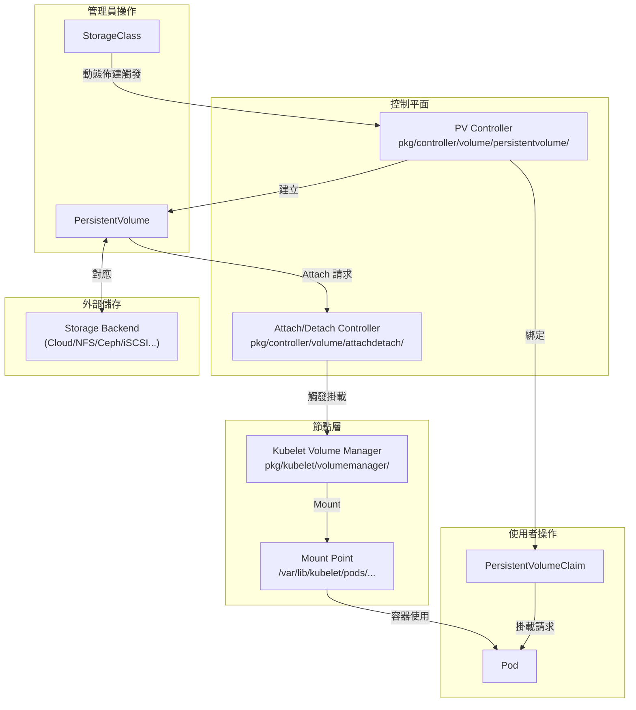

# Kubernetes — PV/PVC 儲存子系統原始碼分析

::: tip 分析版本
本文件基於 **kubernetes/kubernetes** commit [`6e753bd2b47`](https://github.com/kubernetes/kubernetes/commit/6e753bd2b4793152b55ad9cefd3130169fb1a749) (v1.36.0-beta.0) 進行分析。
:::

## 專案簡介

**Kubernetes** 是業界最廣泛採用的容器編排平台，由 CNCF（Cloud Native Computing Foundation）管理。

| 項目 | 說明 |
|------|------|
| **GitHub** | [kubernetes/kubernetes](https://github.com/kubernetes/kubernetes) |
| **語言** | Go |
| **授權條款** | Apache License 2.0 |
| **模組名稱** | `k8s.io/kubernetes`（`go.mod`） |
| **核心關注子系統** | PersistentVolume / PersistentVolumeClaim 儲存子系統 |

本文件集聚焦於 Kubernetes 儲存子系統中的 **PV/PVC 架構**，深入解析從 API 型別定義、生命週期管理、動態佈建、CSI 整合到存取模式與故障排除的完整技術棧。

---

## 文件導覽

| 文件 | 說明 |
|------|------|
| [PV/PVC 架構總覽](./pv-pvc-architecture) | 三層儲存抽象模型、API 型別、核心原始碼位置、靜態與動態佈建概念 |
| [PV/PVC 生命週期與綁定機制](./pv-pvc-lifecycle) | PV/PVC 狀態機、綁定演算法、Volume Binding Mode、保護 Finalizer |
| [StorageClass 與動態佈建](./storageclass-provisioning) | StorageClass 欄位解析、動態佈建流程、拓撲感知佈建、Volume 擴容 |
| [CSI 整合架構](./csi-integration) | CSI 外部 Sidecar 架構、In-tree 遷移、gRPC 呼叫流程、VolumeAttachment |
| [存取模式、卷模式與回收策略](./access-modes-reclaim) | RWO/ROX/RWX/RWOP、Filesystem/Block、Retain/Delete、臨時卷類型比較 |
| [常見問題與排錯指南](./troubleshooting) | 8 類常見故障分析與 kubectl 診斷指令 |

---

## PV/PVC 子系統核心原始碼概覽

```
kubernetes/
├── staging/src/k8s.io/api/core/v1/
│   └── types.go                          # PersistentVolume / PVC API 型別定義
├── pkg/controller/volume/
│   ├── persistentvolume/                 # PV 控制器（綁定、回收、佈建）
│   │   ├── controller.go                 # 主控制迴圈
│   │   ├── binder_controller.go          # 綁定邏輯
│   │   └── scheduler_binder.go           # WaitForFirstConsumer 支援
│   ├── attachdetach/                     # Attach/Detach 控制器
│   └── expand/                           # Volume 擴容控制器
├── pkg/kubelet/volumemanager/            # Kubelet Volume Manager
│   ├── volume_manager.go
│   ├── reconciler/                       # 卷掛載/卸載協調器
│   └── cache/                            # 卷狀態快取
├── pkg/volume/
│   ├── plugins.go                        # Volume Plugin Framework
│   ├── csi/                              # CSI volume plugin
│   │   ├── csi_plugin.go
│   │   └── csi_mounter.go
│   ├── nfs/                              # NFS in-tree plugin
│   ├── hostpath/                         # hostPath plugin
│   └── local/                            # local volume plugin
└── plugin/pkg/admission/storage/        # 儲存相關 Admission Webhooks
```

---

## 快速概念圖



---

## 為什麼要深入研究 PV/PVC 子系統？

Kubernetes 的儲存抽象層是整個平台中最複雜的子系統之一，理解其內部機制有助於：

- **解決生產故障**：PVC 卡在 Pending、Pod 卡在 ContainerCreating 等問題的根因分析
- **設計儲存架構**：選擇合適的 StorageClass、存取模式與回收策略
- **CSI 驅動開發**：理解 gRPC 介面規格與 Kubernetes 呼叫時序
- **效能最佳化**：WaitForFirstConsumer 拓撲感知佈建、正確的 volumeBindingMode 選擇
- **容量規劃**：Volume 擴容機制與限制
