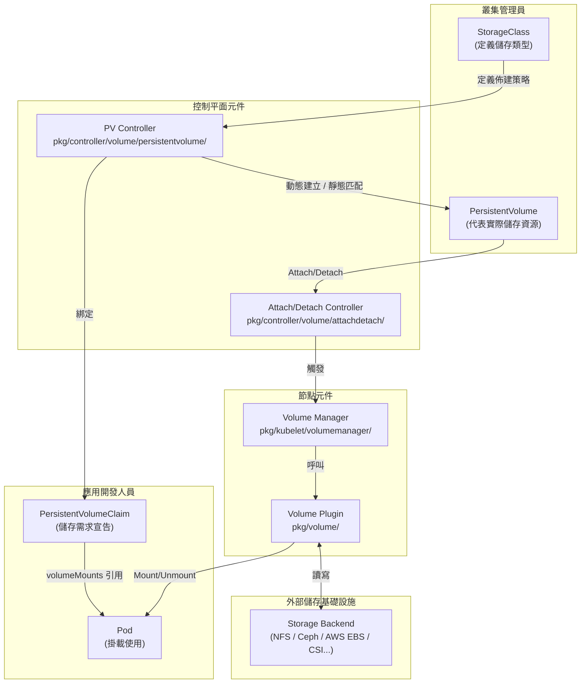
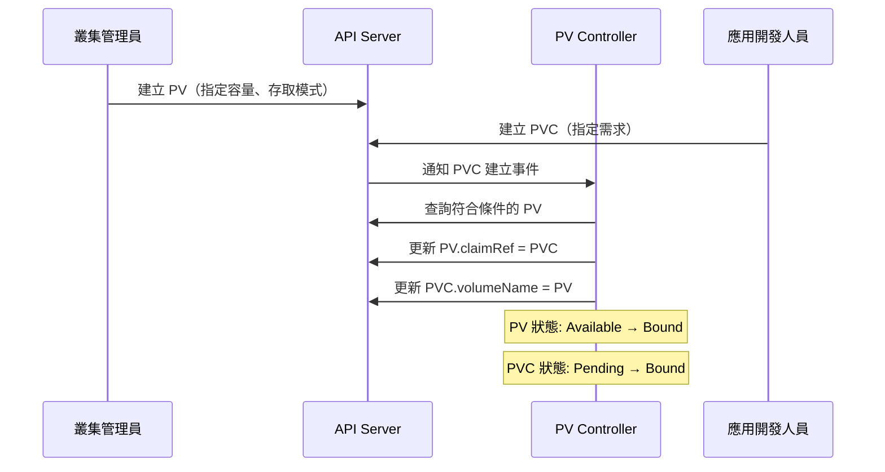
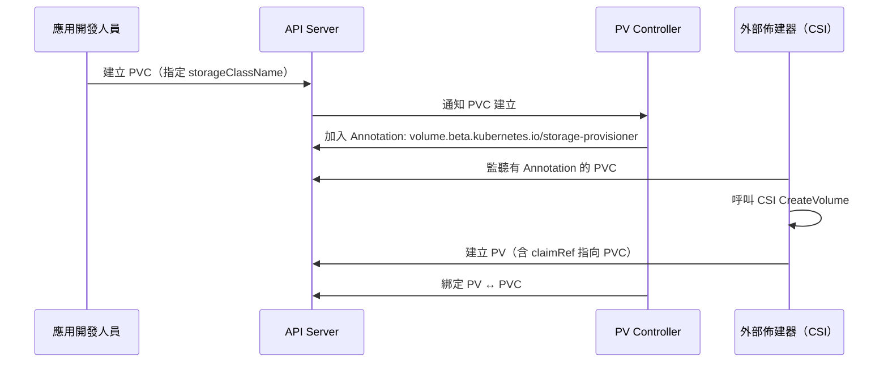

# Kubernetes — PV/PVC 架構總覽

::: info 相關章節
- 生命週期與綁定細節請參閱 [PV/PVC 生命週期與綁定機制](./pv-pvc-lifecycle)
- 動態佈建請參閱 [StorageClass 與動態佈建](./storageclass-provisioning)
- CSI 整合架構請參閱 [CSI 整合架構](./csi-integration)
- 存取模式與回收策略請參閱 [存取模式、卷模式與回收策略](./access-modes-reclaim)
- 故障排除請參閱 [常見問題與排錯指南](./troubleshooting)
:::

::: tip 分析版本
本文基於 **kubernetes/kubernetes** commit [`6e753bd2b47`](https://github.com/kubernetes/kubernetes/commit/6e753bd2b4793152b55ad9cefd3130169fb1a749) 進行原始碼分析。
:::

## 儲存抽象模型概述

Kubernetes 的儲存系統採用**三層抽象**設計，將底層儲存基礎設施與工作負載完全解耦：

1. **StorageClass**：定義儲存類型與佈建參數（由叢集管理員設定）
2. **PersistentVolume（PV）**：代表叢集中一塊已佈建的儲存資源（由管理員或動態佈建器建立）
3. **PersistentVolumeClaim（PVC）**：使用者對儲存資源的申請（由開發人員或工作負載建立）

Pod 透過 PVC 使用儲存，完全不需要了解底層儲存的實作細節。



---

## API 型別定義

核心型別定義位於 `staging/src/k8s.io/api/core/v1/types.go`。

### PersistentVolume 關鍵欄位

```go
type PersistentVolumeSpec struct {
    // 容量（例如 storage: 10Gi）
    Capacity ResourceList

    // 支援的存取模式（ReadWriteOnce / ReadOnlyMany / ReadWriteMany / ReadWriteOncePod）
    AccessModes []PersistentVolumeAccessMode

    // 回收策略：Retain / Delete / Recycle
    PersistentVolumeReclaimPolicy PersistentVolumeReclaimPolicy

    // 關聯的 StorageClass 名稱
    StorageClassName string

    // 卷模式：Filesystem（預設）或 Block
    VolumeMode *PersistentVolumeMode

    // 已綁定的 PVC 引用（綁定後由控制器填入）
    ClaimRef *ObjectReference

    // 掛載選項（傳遞給 mount 指令）
    MountOptions []string

    // 節點親和性（用於 local volume 或拓撲感知）
    NodeAffinity *VolumeNodeAffinity

    // 實際儲存來源（二選一：NFS / CSI / HostPath / ...）
    PersistentVolumeSource
}
```

### PersistentVolumeClaim 關鍵欄位

```go
type PersistentVolumeClaimSpec struct {
    // 請求的存取模式
    AccessModes []PersistentVolumeAccessMode

    // 選擇器（用於靜態佈建時篩選 PV）
    Selector *metav1.LabelSelector

    // 資源需求（storage 大小）
    Resources VolumeResourceRequirements

    // 手動綁定到指定 PV 的名稱（Pre-bound）
    VolumeName string

    // 使用的 StorageClass（空字串表示不使用動態佈建）
    StorageClassName *string

    // 卷模式
    VolumeMode *PersistentVolumeMode

    // VolumeAttributesClass（Alpha 功能，v1.29+）
    VolumeAttributesClassName *string
}
```

---

## 核心控制器架構

### PV 控制器（`pkg/controller/volume/persistentvolume/`）

PV 控制器是儲存子系統的核心，負責：

| 職責 | 對應原始碼 |
|------|-----------|
| PV/PVC 綁定 | `binder_controller.go` |
| 動態佈建觸發 | `controller.go` → `provisionClaimOperation()` |
| 靜態 PV 回收 | `controller.go` → `reclaimVolume()` |
| WaitForFirstConsumer 支援 | `scheduler_binder.go` |

主要控制迴圈位於 `controller.go`，透過 `volumeWorker()` 和 `claimWorker()` 分別處理 PV 和 PVC 事件。

### Attach/Detach 控制器（`pkg/controller/volume/attachdetach/`）

負責在節點層面管理 Volume 的 Attach（附掛）和 Detach（卸掛）操作：

- 監聽 Pod 排程事件，判斷需要 attach 的卷
- 呼叫 Volume Plugin 的 `Attach()` / `Detach()` 介面
- 維護 `AttachedVolumes` 和 `VolumesToAttach` 狀態快取

### Kubelet Volume Manager（`pkg/kubelet/volumemanager/`）

在每個節點上的 Kubelet 中運行，負責：

1. **Desired State of World（DSW）**：根據 Pod spec 決定應掛載的卷
2. **Actual State of World（ASW）**：追蹤節點上已掛載的卷
3. **Reconciler**（`reconciler/`）：持續協調 DSW 與 ASW 的差異，執行 Mount/Unmount

---

## Volume Plugin Framework

`pkg/volume/plugins.go` 定義了 Volume Plugin 介面：

```go
type VolumePlugin interface {
    Init(host VolumeHost) error
    GetPluginName() string
    GetVolumeName(spec *Spec) (string, error)
    CanSupport(spec *Spec) bool
    NewMounter(spec *Spec, podRef *v1.Pod) (Mounter, error)
    NewUnmounter(name string, podUID types.UID) (Unmounter, error)
}
```

主要擴充介面：

| 介面 | 功能 | 代表實作 |
|------|------|---------|
| `PersistentVolumePlugin` | 支援 PV/PVC 綁定 | NFS, iSCSI, CSI |
| `ProvisionableVolumePlugin` | 支援動態佈建 | AWS EBS (已遷移至 CSI) |
| `AttachableVolumePlugin` | 支援 Attach/Detach | GCE PD, CSI |
| `ExpandableVolumePlugin` | 支援 Volume 擴容 | CSI |
| `BlockVolumePlugin` | 支援 Raw Block | CSI |

---

## 靜態佈建 vs 動態佈建

### 靜態佈建

管理員預先手動建立 PV，使用者建立符合條件的 PVC：



### 動態佈建

StorageClass 定義佈建器，PVC 建立時自動觸發佈建：



---

## 兩種佈建模式比較

| 比較項目 | 靜態佈建 | 動態佈建 |
|---------|---------|---------|
| PV 建立者 | 叢集管理員手動建立 | 佈建器自動建立 |
| 需要 StorageClass | 可選（用於分類） | 必須指定 |
| 靈活度 | 低（固定容量） | 高（按需建立） |
| 適用場景 | 現有儲存資源整合 | 雲端環境、CSI 驅動 |
| PVC 等待時間 | 取決於 PV 是否存在 | 取決於佈建器速度 |
