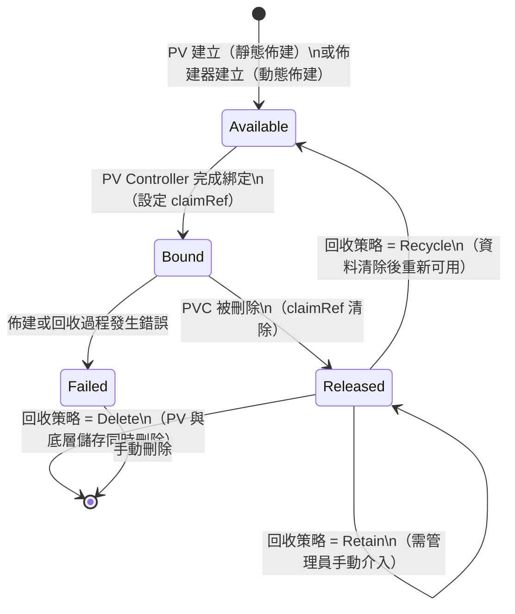
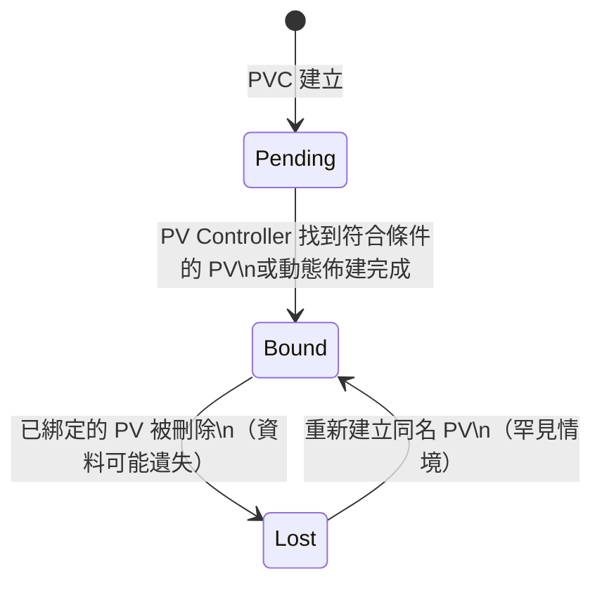
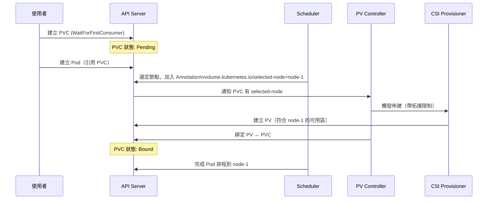
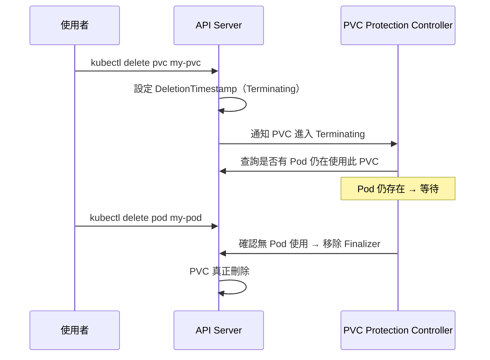
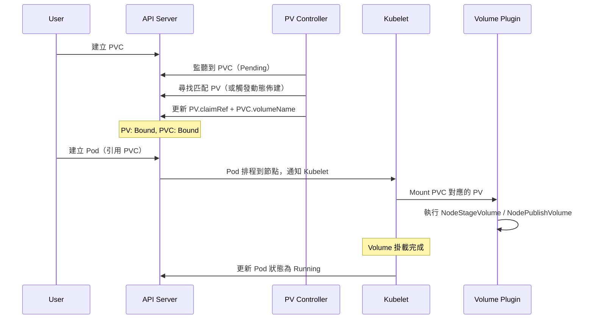

# Kubernetes — PV/PVC 生命週期與綁定機制

::: info 相關章節
- 架構基礎請參閱 [PV/PVC 架構總覽](./pv-pvc-architecture)
- 動態佈建請參閱 [StorageClass 與動態佈建](./storageclass-provisioning)
- CSI 架構請參閱 [CSI 整合架構](./csi-integration)
- 故障排除請參閱 [常見問題與排錯指南](./troubleshooting)
:::

## PV 生命週期狀態機

PersistentVolume 的狀態由 `pkg/controller/volume/persistentvolume/controller.go` 管理：



| 狀態 | 說明 |
|------|------|
| `Available` | PV 可用，尚未綁定任何 PVC |
| `Bound` | PV 已與 PVC 綁定，`spec.claimRef` 已填入 |
| `Released` | 原本綁定的 PVC 已刪除，但 PV 尚未被回收或重新利用 |
| `Failed` | 自動回收失敗，需要管理員介入 |

---

## PVC 生命週期狀態機



| 狀態 | 說明 |
|------|------|
| `Pending` | PVC 已建立，等待綁定 PV（或等待動態佈建） |
| `Bound` | PVC 已成功綁定到 PV，可供 Pod 使用 |
| `Lost` | 已綁定的 PV 被刪除，PVC 無法使用（資料可能已遺失） |

---

## 綁定演算法詳解

綁定邏輯位於 `pkg/controller/volume/persistentvolume/binder_controller.go`。

### 綁定條件匹配順序

PV Controller 為一個 PVC 尋找最佳 PV 時，按以下條件篩選：

```
1. storageClassName 必須相同
2. accessModes 必須完全滿足（PV 的 accessModes 需包含 PVC 所有請求的模式）
3. volumeMode 必須相同（Filesystem 或 Block）
4. capacity 必須 >= PVC 請求容量
5. PVC 的 selector（若有）必須匹配 PV 的 labels
6. PV 狀態必須為 Available
```

### 最佳 PV 選擇策略

滿足條件的 PV 可能有多個，控制器選擇**容量最接近 PVC 請求**的 PV（最小符合原則），避免浪費大容量 PV：

```go
// pkg/controller/volume/persistentvolume/controller.go
func findBestMatchForClaim(claim *v1.PersistentVolumeClaim, pvs []*v1.PersistentVolume) (*v1.PersistentVolume, error) {
    // 找到容量 >= 請求量且最接近的 PV
    var best *v1.PersistentVolume
    for _, pv := range pvs {
        if isVolumeBoundToClaim(pv, claim) {
            return pv, nil  // Pre-bound 優先
        }
        if best == nil || pvs 容量更小 {
            best = pv
        }
    }
    return best, nil
}
```

---

## Volume Binding Mode

StorageClass 的 `volumeBindingMode` 欄位控制 PVC 的綁定時機：

### Immediate（立即綁定，預設值）

PVC 建立後立即觸發綁定（或動態佈建），不考慮 Pod 的排程位置。

**問題**：若 StorageClass 使用有拓撲限制的儲存（如特定可用區），可能佈建在 Pod 無法排程的節點上，導致 Pod 永遠無法啟動。

### WaitForFirstConsumer（等待首次消費）

延遲 PVC 綁定，直到使用它的 Pod 被排程到某個節點後，才在該節點所在的可用區進行佈建。



原始碼：`pkg/controller/volume/persistentvolume/scheduler_binder.go`

---

## Pre-bound PVC（手動預綁定）

使用者可以在建立 PVC 時手動指定 `spec.volumeName`，強制綁定到特定 PV：

```yaml
apiVersion: v1
kind: PersistentVolumeClaim
metadata:
  name: my-pvc
spec:
  storageClassName: ""
  volumeName: my-specific-pv   # 直接指定 PV 名稱
  accessModes:
    - ReadWriteOnce
  resources:
    requests:
      storage: 10Gi
```

控制器在 `binder_controller.go` 中會優先處理 pre-bound PVC，跳過一般的容量比對邏輯。

---

## 保護 Finalizer

Kubernetes 使用 Finalizer 防止 PV/PVC 在使用中被刪除：

### PVC 保護（`kubernetes.io/pvc-protection`）

- 位置：`pkg/controller/volume/pvprotection/pvc_protection_controller.go`
- 行為：若 PVC 正在被 Pod 使用，刪除請求會被阻擋（PVC 進入 Terminating 狀態，但不會真的刪除）
- 解除時機：所有使用該 PVC 的 Pod 都已刪除後，Finalizer 移除，PVC 真正刪除

### PV 保護（`kubernetes.io/pv-protection`）

- 位置：`pkg/controller/volume/pvprotection/pv_protection_controller.go`
- 行為：若 PV 處於 Bound 狀態，刪除請求會被阻擋
- 解除時機：PVC 被刪除後，PV 進入 Released 狀態，Finalizer 才移除



---

## 完整綁定流程時序圖


