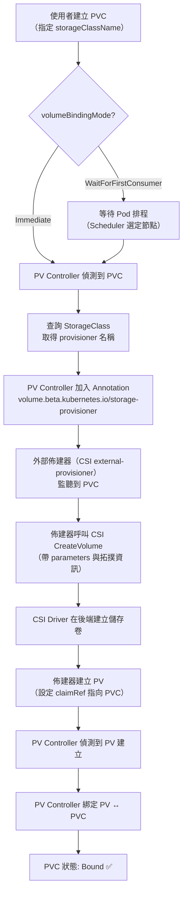
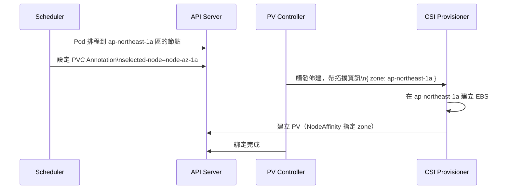
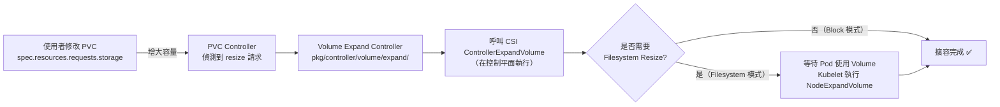

# Kubernetes — StorageClass 與動態佈建

::: info 相關章節
- 架構基礎請參閱 [PV/PVC 架構總覽](./pv-pvc-architecture)
- 生命週期請參閱 [PV/PVC 生命週期與綁定機制](./pv-pvc-lifecycle)
- CSI 整合架構請參閱 [CSI 整合架構](./csi-integration)
- 故障排除請參閱 [常見問題與排錯指南](./troubleshooting)
:::

## StorageClass 欄位詳解

API 型別定義：`staging/src/k8s.io/api/storage/v1/types.go`

```go
type StorageClass struct {
    metav1.TypeMeta
    metav1.ObjectMeta

    // 佈建器名稱（e.g. "kubernetes.io/aws-ebs" 或 CSI driver name）
    Provisioner string

    // 傳遞給佈建器的參數（鍵值對）
    Parameters map[string]string

    // 回收策略：Delete（預設）或 Retain
    ReclaimPolicy *v1.PersistentVolumeReclaimPolicy

    // 掛載選項（傳遞給 mount 指令）
    MountOptions []string

    // 是否允許 Volume 擴容（需佈建器支援）
    AllowVolumeExpansion *bool

    // 綁定模式：Immediate 或 WaitForFirstConsumer
    VolumeBindingMode *VolumeBindingMode

    // 允許的拓撲約束（配合 WaitForFirstConsumer 使用）
    AllowedTopologies []v1.TopologySelectorTerm
}
```

### 常見 StorageClass 範例

```yaml
# CSI 驅動（AWS EBS）
apiVersion: storage.k8s.io/v1
kind: StorageClass
metadata:
  name: gp3-encrypted
  annotations:
    storageclass.kubernetes.io/is-default-class: "true"
provisioner: ebs.csi.aws.com
parameters:
  type: gp3
  iops: "3000"
  throughput: "125"
  encrypted: "true"
reclaimPolicy: Delete
allowVolumeExpansion: true
volumeBindingMode: WaitForFirstConsumer

---
# NFS（in-tree）
apiVersion: storage.k8s.io/v1
kind: StorageClass
metadata:
  name: nfs-client
provisioner: cluster.local/nfs-subdir-external-provisioner
parameters:
  server: nfs-server.example.com
  path: /exported/path
  archiveOnDelete: "false"
reclaimPolicy: Delete
```

---

## 動態佈建流程



### 關鍵原始碼位置

| 功能 | 原始碼路徑 |
|------|-----------|
| 動態佈建觸發 | `pkg/controller/volume/persistentvolume/controller.go` → `provisionClaimOperation()` |
| Annotation 設定 | `pkg/controller/volume/persistentvolume/controller.go` → `setClaimProvisioner()` |
| WaitForFirstConsumer | `pkg/controller/volume/persistentvolume/scheduler_binder.go` |
| StorageClass 查詢 | `pkg/controller/volume/persistentvolume/util/` |
| 儲存 Admission | `plugin/pkg/admission/storage/` |

---

## 預設 StorageClass

叢集可以設定一個預設 StorageClass，當 PVC 未指定 `storageClassName` 時自動使用：

```yaml
metadata:
  annotations:
    storageclass.kubernetes.io/is-default-class: "true"
```

**注意事項**：
- 叢集中最多只能有一個預設 StorageClass（否則 Admission Controller 會拒絕）
- 相關 Admission Controller：`plugin/pkg/admission/storage/persistentvolume/admission.go`
- 若 PVC 明確設定 `storageClassName: ""`（空字串），表示**不使用動態佈建**，只匹配靜態 PV

---

## 拓撲感知動態佈建

配合 `volumeBindingMode: WaitForFirstConsumer` 與 `allowedTopologies`，實現跨可用區的拓撲感知佈建：

```yaml
apiVersion: storage.k8s.io/v1
kind: StorageClass
metadata:
  name: topology-aware
provisioner: ebs.csi.aws.com
volumeBindingMode: WaitForFirstConsumer
allowedTopologies:
  - matchLabelExpressions:
      - key: topology.kubernetes.io/zone
        values:
          - ap-northeast-1a
          - ap-northeast-1c
```



---

## Volume 擴容（Volume Expansion）

### 啟用條件

1. StorageClass 設定 `allowVolumeExpansion: true`
2. CSI 驅動支援 `EXPAND_VOLUME` capability
3. Kubernetes 版本 >= 1.11（Beta）

### 擴容流程



### 原始碼位置

- 控制器主邏輯：`pkg/controller/volume/expand/expand_controller.go`
- Kubelet 端擴容：`pkg/kubelet/volumemanager/reconciler/`
- CSI 介面：`pkg/volume/csi/expander.go`

### 注意事項

- **只能擴大，不能縮小**：Kubernetes 不支援 Volume 縮容（會被 Admission 拒絕）
- **線上擴容（online resize）**：Kubernetes 1.16+ 支援 Pod 仍在運行時擴容
- **離線擴容（offline resize）**：需要停止 Pod 才能擴容（部分 CSI 驅動限制）

---

## StorageClass 參數常見設定

| 佈建器 | 常用 parameters | 說明 |
|--------|----------------|------|
| `ebs.csi.aws.com` | `type: gp3`, `iops`, `throughput` | AWS EBS 卷類型與效能設定 |
| `disk.csi.azure.com` | `skuName: Premium_LRS` | Azure Disk 儲存類型 |
| `pd.csi.storage.gke.io` | `type: pd-ssd` | GCP Persistent Disk 類型 |
| `nfs.csi.k8s.io` | `server`, `share` | NFS CSI 連線資訊 |
| `rook-ceph.rbd.csi.ceph.com` | `pool`, `imageFeatures` | Ceph RBD 設定 |
