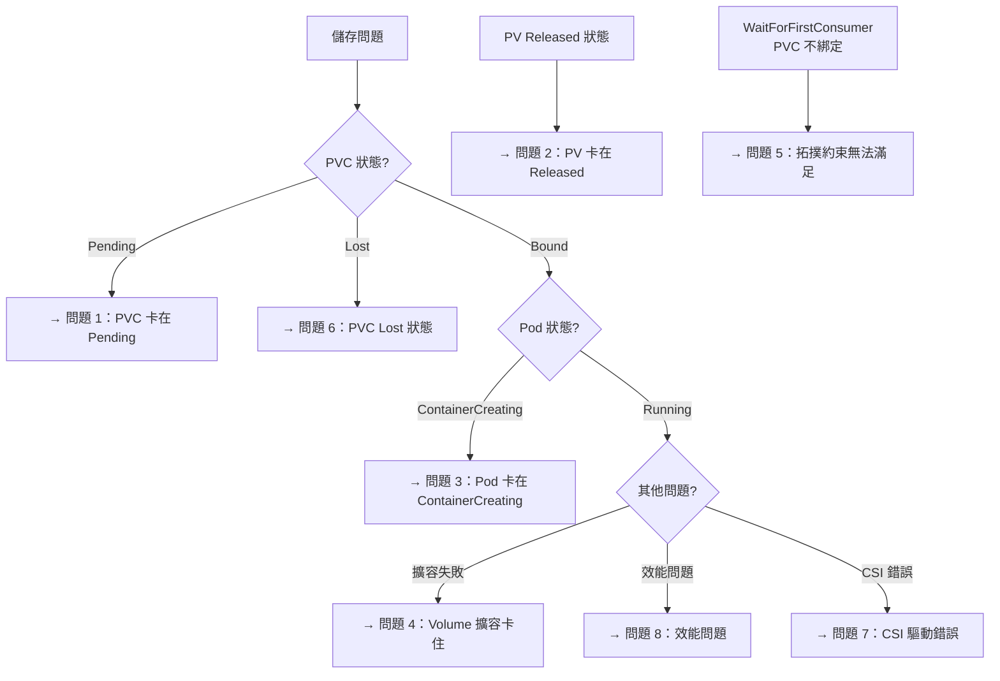

# Kubernetes — 常見問題與排錯指南

::: info 相關章節
- 架構基礎請參閱 [PV/PVC 架構總覽](./pv-pvc-architecture)
- 生命週期機制請參閱 [PV/PVC 生命週期與綁定機制](./pv-pvc-lifecycle)
- 動態佈建請參閱 [StorageClass 與動態佈建](./storageclass-provisioning)
- CSI 架構請參閱 [CSI 整合架構](./csi-integration)
- 存取模式請參閱 [存取模式、卷模式與回收策略](./access-modes-reclaim)
:::

## 快速診斷流程



---

## 問題 1：PVC 卡在 Pending 狀態

### 症狀
PVC 長時間維持 `Pending` 狀態，Pod 無法啟動。

### 根本原因分析

**原因 A：沒有符合條件的 PV（靜態佈建環境）**
- 叢集中沒有 Available 狀態的 PV
- 現有 PV 的容量、存取模式或 StorageClass 與 PVC 不符

**原因 B：沒有預設 StorageClass（動態佈建環境）**
- PVC 未指定 `storageClassName`，且叢集無預設 StorageClass

**原因 C：外部佈建器未運行**
- CSI 驅動的 `external-provisioner` Pod 未正常運行

**原因 D：`volumeBindingMode: WaitForFirstConsumer`**
- PVC 正常等待 Pod 排程，此為預期行為（非問題）

### 診斷指令

```bash
# 查看 PVC 詳細狀態與事件
kubectl describe pvc <pvc-name> -n <namespace>

# 查看叢集所有 StorageClass
kubectl get storageclass

# 查看所有 PV 的狀態（靜態佈建環境）
kubectl get pv

# 查看 CSI Provisioner Pod 是否正常
kubectl get pods -n kube-system | grep provisioner

# 查看 PV Controller 日誌
kubectl logs -n kube-system -l component=kube-controller-manager --tail=100 | grep -i pvc
```

### 解決方案

```bash
# 確認 StorageClass 存在
kubectl get storageclass
kubectl describe storageclass <sc-name>

# 若使用靜態佈建，確認 PV 存在且符合條件
kubectl get pv -o wide

# 強制重新觸發動態佈建（刪除並重建 PVC）
kubectl delete pvc <pvc-name>
kubectl apply -f pvc.yaml
```

---

## 問題 2：PV 卡在 Released 狀態

### 症狀
PVC 刪除後，PV 狀態變為 `Released`，無法被新的 PVC 綁定。

### 根本原因
PV 的回收策略設定為 `Retain`，並且 `spec.claimRef` 仍指向已刪除的 PVC。

### 原始碼說明
`pkg/controller/volume/persistentvolume/controller.go` 中的 `reclaimVolume()` 函式在 Retain 策略下不會清理 claimRef，需要管理員手動處理。

### 診斷指令

```bash
# 查看 PV 狀態
kubectl describe pv <pv-name>

# 確認 claimRef 仍指向舊 PVC
kubectl get pv <pv-name> -o jsonpath='{.spec.claimRef}'
```

### 解決方案

```bash
# 方法 1：清除 claimRef，讓 PV 重新變成 Available
kubectl patch pv <pv-name> -p '{"spec":{"claimRef":null}}'

# 方法 2：手動刪除 PV（如果不需要底層資料）
kubectl delete pv <pv-name>
# 然後手動到儲存後端刪除實際資源

# 方法 3：若要保留資料，先清除 claimRef，再建立新 PVC 指向此 PV
kubectl patch pv <pv-name> -p '{"spec":{"claimRef":null}}'
# 建立新 PVC 時指定 volumeName: <pv-name>
```

---

## 問題 3：Pod 卡在 ContainerCreating（Volume Mount 失敗）

### 症狀
PVC 已 Bound，但 Pod 一直卡在 `ContainerCreating` 狀態。

### 根本原因分析

**原因 A：Multi-Attach 錯誤（RWO Volume 被多個節點掛載）**
- RWO Volume 已附掛在節點 A，但 Pod 被排程到節點 B
- 常見於節點突然失效後，舊 VolumeAttachment 未清理

**原因 B：Attach/Detach 控制器問題**
- VolumeAttachment 已建立但 CSI 驅動未回應
- external-attacher 無法連線到 CSI Controller

**原因 C：Kubelet 無法完成 Mount**
- Node Plugin（CSI DaemonSet）未在目標節點運行
- 缺少必要的核心模組（如 `nfs` 或 `iscsi_tcp`）

### 診斷指令

```bash
# 查看 Pod 事件
kubectl describe pod <pod-name> -n <namespace>

# 查看 VolumeAttachment 狀態
kubectl get volumeattachment
kubectl describe volumeattachment <va-name>

# 查看目標節點的 CSI Node Plugin
kubectl get pods -n kube-system -o wide | grep <csi-driver-name>

# 查看 Kubelet 日誌（在目標節點執行）
journalctl -u kubelet --since "10 minutes ago" | grep -i "volume\|mount\|attach"

# 查看 CSI Node Plugin 日誌
kubectl logs -n kube-system <csi-node-pod-name> -c <csi-driver-container>
```

### 解決方案（Multi-Attach 問題）

```bash
# 1. 確認舊 Pod 已完全終止（不只是 Terminating）
kubectl get pod -A -o wide | grep <node-name>

# 2. 若節點已失效，強制刪除卡在 Terminating 的 Pod
kubectl delete pod <pod-name> --grace-period=0 --force

# 3. 手動刪除卡住的 VolumeAttachment
kubectl delete volumeattachment <va-name>

# 4. 若節點仍存活但 taint，先 drain 節點
kubectl drain <node-name> --ignore-daemonsets --delete-emptydir-data
```

---

## 問題 4：Volume 擴容卡住

### 症狀
修改 PVC 的 `spec.resources.requests.storage` 後，PVC 一直顯示擴容中但未完成。

### 根本原因分析

**原因 A：StorageClass 未啟用 `allowVolumeExpansion`**

**原因 B：CSI 驅動不支援 `EXPAND_VOLUME` capability**

**原因 C：Filesystem resize 等待中**
- 控制層面（ControllerExpandVolume）已完成，但節點層面（NodeExpandVolume）未執行
- NodeExpandVolume 在 Pod 運行時才會觸發（部分驅動需要 Pod 存在才能 resize filesystem）

### 診斷指令

```bash
# 查看 PVC 狀態與事件
kubectl describe pvc <pvc-name>

# 查看 PVC 的當前容量 vs 請求容量
kubectl get pvc <pvc-name> -o jsonpath='{.status.capacity.storage}'  # 實際
kubectl get pvc <pvc-name> -o jsonpath='{.spec.resources.requests.storage}'  # 請求

# 查看 volume-expand controller 日誌
kubectl logs -n kube-system -l component=kube-controller-manager | grep -i expand

# 確認 CSI 驅動支援擴容
kubectl get csidriver <driver-name> -o jsonpath='{.spec.volumeLifecycleModes}'
```

### 解決方案

```bash
# 若等待 NodeExpandVolume：重啟使用該 PVC 的 Pod 即可觸發 resize
kubectl rollout restart deployment/<deployment-name>

# 若 StorageClass 不支援擴容，需更換 StorageClass（需資料遷移）
```

---

## 問題 5：WaitForFirstConsumer PVC 長時間不綁定

### 症狀
使用 `WaitForFirstConsumer` 的 PVC 已有 Pod 在使用，但 PVC 仍是 Pending。

### 根本原因
Pod 無法排程（Pending 狀態），PVC 等待 Pod 的 `selected-node` Annotation，而 Pod 又在等待 PVC。

### 診斷指令

```bash
# 查看 Pod 排程失敗原因
kubectl describe pod <pod-name> | grep -A 10 "Events:"

# 確認是否有節點符合拓撲需求
kubectl get nodes --show-labels | grep topology.kubernetes.io/zone

# 查看 Pod 的 TopologySpreadConstraints 和 NodeAffinity
kubectl get pod <pod-name> -o yaml | grep -A 20 affinity

# 查看 StorageClass 的 allowedTopologies
kubectl describe storageclass <sc-name>
```

### 解決方案

```bash
# 確認有符合拓撲條件的節點
kubectl get nodes -l topology.kubernetes.io/zone=<required-zone>

# 若是 Pod 的節點親和性過於嚴格，修改 Pod 的 NodeAffinity
# 若是叢集沒有符合的節點，需新增節點或調整 StorageClass 的 allowedTopologies
```

---

## 問題 6：PVC 進入 Lost 狀態

### 症狀
PVC 狀態顯示 `Lost`，Pod 無法啟動或停止使用。

### 根本原因
已綁定的 PV 被手動刪除，導致 PVC 失去對應的 PV，進入 Lost 狀態。

### 診斷指令

```bash
# 確認 PVC 狀態
kubectl get pvc <pvc-name> -o yaml

# 查看 PVC 引用的 PV 是否存在
kubectl get pv | grep <pv-name-from-pvc>

# 查看 PVC 事件
kubectl describe pvc <pvc-name>
```

### 解決方案

**資料已遺失（PV 對應底層儲存已刪除）**：
```bash
# 刪除 PVC，重新建立一個新的
kubectl delete pvc <pvc-name>
kubectl apply -f pvc.yaml
```

**資料仍存在（底層儲存未刪除）**：
```bash
# 1. 重新建立 PV，指向原有底層儲存
kubectl apply -f pv-restore.yaml

# 2. 建立 PV 時設定 claimRef 指向原 PVC
# spec.claimRef.name: <pvc-name>
# spec.claimRef.namespace: <namespace>
```

---

## 問題 7：CSI 驅動錯誤

### 症狀
Pod 事件中顯示 CSI 相關錯誤，如 `failed to get CSI client`、`transport is closing`。

### 診斷指令

```bash
# 查看節點上的 CSI Node Plugin
kubectl get pods -n kube-system -o wide | grep <driver-name>

# 確認 CSI socket 存在（在節點上執行）
ls -la /var/lib/kubelet/plugins/<driver-name>/csi.sock

# 查看 CSI Node Plugin 日誌
kubectl logs -n kube-system <csi-node-pod> -c <driver-container>

# 確認 CSIDriver 資源存在
kubectl get csidriver

# 確認 CSINode 資源存在
kubectl get csinode <node-name>
```

### 解決方案

```bash
# 重啟 CSI Node Plugin DaemonSet
kubectl rollout restart daemonset/<csi-node-daemonset> -n kube-system

# 若 socket 不存在，檢查 DaemonSet 的 hostPath 掛載設定
kubectl describe daemonset/<csi-node-daemonset> -n kube-system
```

---

## 問題 8：Storage 效能問題

### 症狀
應用程式 I/O 效能遠低於預期，讀寫延遲高。

### 常見原因與解決方案

| 原因 | 診斷方式 | 解決方案 |
|------|---------|---------|
| 使用 RWX 替代 RWO（NFS 性能差） | 查看 StorageClass 和 PVC access mode | 改用 RWO + 對應節點親和性 |
| StorageClass 使用低效能磁碟類型 | 查看 StorageClass parameters | 更換為 SSD 類型（如 gp3, Premium_LRS） |
| emptyDir 超過節點 tmpfs 限制被 swap | 查看 `kubectl describe pod` 的 limits | 設定適當的 `sizeLimit` 或改用 PVC |
| CSI 驅動 CPU/Memory 不足 | 查看 CSI Pod 資源使用 | 增加 CSI Pod 的 resource limits |
| 多個 Pod 共用同一 NFS Export | 監控 NFS 伺服器 | 分拆 NFS Export，或改用更高效能的分散式儲存 |

```bash
# 在 Pod 中執行 fio 基準測試
kubectl exec -it <pod-name> -- fio --name=randwrite --ioengine=libaio \
  --rw=randwrite --bs=4k --numjobs=4 --iodepth=32 \
  --filename=/data/testfile --size=1G --runtime=30 --group_reporting

# 查看 Volume 使用量統計（Kubelet metrics）
kubectl get --raw /api/v1/nodes/<node-name>/proxy/stats/summary | \
  python3 -c "import sys,json; d=json.load(sys.stdin); \
  [print(p['name'], v['name'], v.get('usedBytes','N/A')) \
  for p in d['pods'] for v in p.get('volume',[])]"
```
