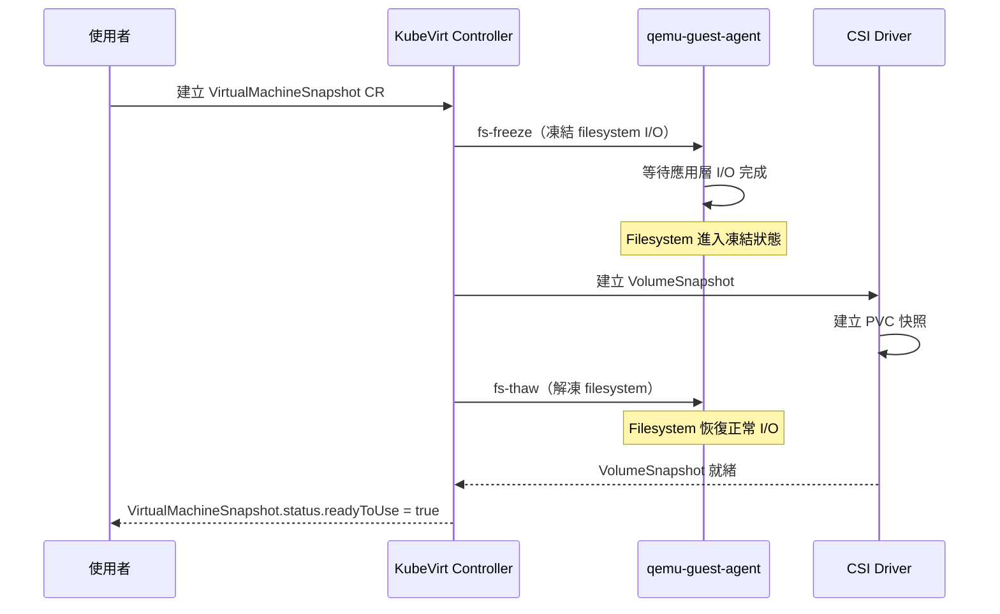
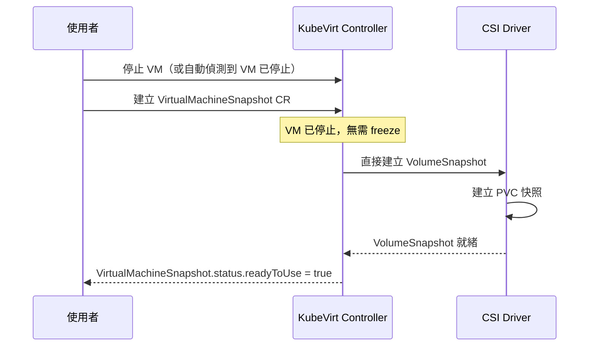
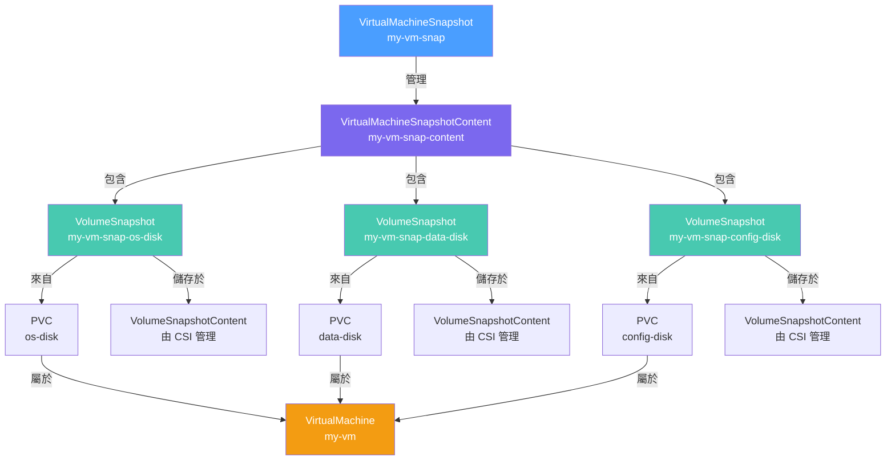
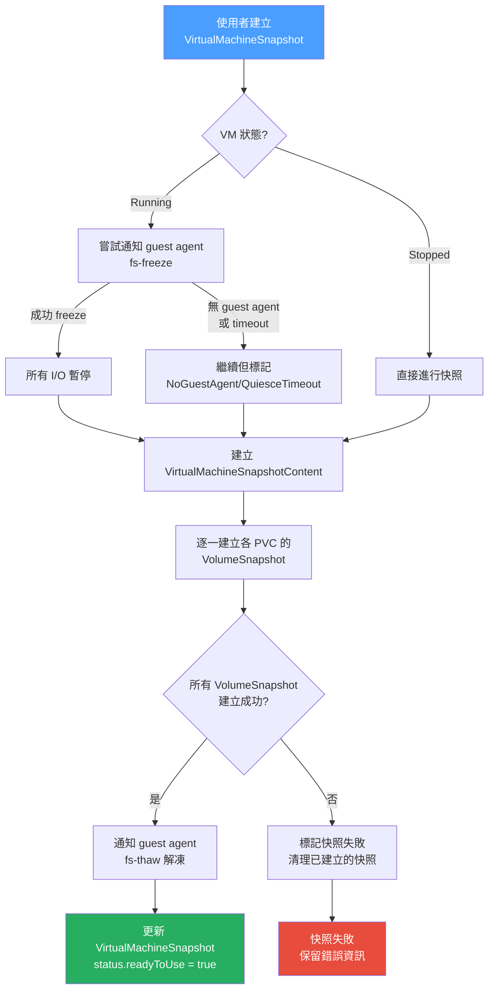
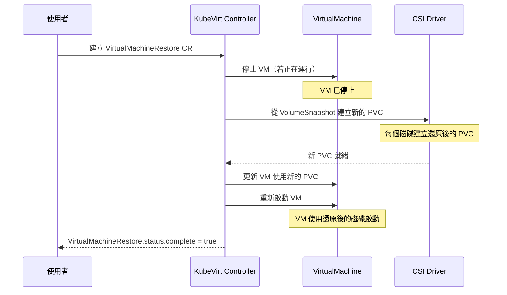
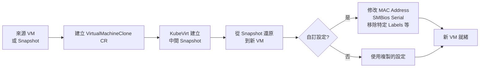

# Snapshot & Restore — VM 快照與還原

KubeVirt 的快照功能讓您能夠在任何時間點捕捉 VM 的完整狀態，並在需要時快速還原。本文涵蓋快照的技術原理、操作方式，以及 VM Clone 的進階用法。

## 快照使用場景

快照（Snapshot）是 VM 管理中不可或缺的功能，以下是最常見的使用場景：

| 場景 | 說明 | 建議類型 |
|------|------|----------|
| **系統升級前備份** | 升級 OS、應用程式或資料庫前，建立快照作為安全網 | Online/Offline 皆可 |
| **測試環境快速復原** | 測試後快速還原到初始狀態，節省重建時間 | Online Snapshot |
| **開發環境 Checkpoint** | 記錄開發過程中的重要里程碑 | Online Snapshot |
| **故障恢復** | 系統遭到破壞（惡意軟體、誤操作）後快速恢復 | Offline Snapshot |
| **克隆到新環境** | 從 snapshot 建立新的 VM（用於水平擴展或環境複製） | 任意類型 |
| **合規性備份** | 定期快照供稽核或法規遵循使用 | Offline Snapshot |

---

## Online vs Offline Snapshot 差異

### Online Snapshot（線上快照）

線上快照在 VM 持續運行時建立。由於 VM 的記憶體狀態和磁碟 I/O 是動態的，需要特殊處理以確保一致性。



### Offline Snapshot（離線快照）

離線快照在 VM 停止後建立，資料完全靜止，具有最高的一致性保證：



### 選擇建議

:::warning Online Snapshot 的一致性挑戰
即使有 guest agent 進行 fs-freeze，Online Snapshot 也存在以下限制：
1. **記憶體狀態未捕捉**：快照只包含磁碟，不包含 RAM 內容
2. **應用層一致性**：有些應用程式（如部分資料庫）可能在 freeze 期間仍有未提交的事務
3. **Freeze 時間**：fs-freeze 會短暫影響 VM I/O 效能

**建議**：對於重要的生產環境備份，優先使用 Offline Snapshot。對於頻繁的 checkpoint（例如每小時），可以使用帶有 guest agent 的 Online Snapshot。
:::

---

## Guest Agent Quiescing

### 什麼是 Quiescing（靜默）

Quiescing 是指在建立快照前，通知 guest OS 將所有待寫入的 I/O 操作完成並凍結文件系統，確保快照的資料一致性：

1. **fs-freeze**：通知 Linux kernel 將 journal 和 dirty cache flush 到磁碟，並暫停所有後續的寫入操作
2. **快照建立**：在此靜默狀態下建立磁碟快照
3. **fs-thaw**：解除凍結，允許正常 I/O 恢復

### qemu-guest-agent 配置

要使用 quiescing 功能，VM 必須安裝並運行 `qemu-guest-agent`：

```yaml
# VM spec 中的 guest agent 相關設定
apiVersion: kubevirt.io/v1
kind: VirtualMachine
metadata:
  name: my-vm-with-agent
spec:
  template:
    spec:
      domain:
        devices:
          # 必須有 virtio-serial channel 供 guest agent 通訊
          channels:
            - name: guest-agent-channel
              type: virtio
              target:
                type: virtio
                name: org.qemu.guest_agent.0
      volumes:
        # 確保 cloud-init 安裝了 qemu-guest-agent
        - name: cloudinit
          cloudInitNoCloud:
            userData: |
              #cloud-config
              packages:
                - qemu-guest-agent
              runcmd:
                - systemctl enable qemu-guest-agent
                - systemctl start qemu-guest-agent
```

### 有無 Guest Agent 的差異

| 情況 | Quiescing | 一致性 | Indication |
|------|-----------|--------|------------|
| 有 guest agent，freeze 成功 | ✅ 完整 quiescing | 最高 | `GuestAgent` |
| 有 guest agent，freeze 超時 | ⚠️ 部分 quiescing | 中等 | `QuiesceTimeout` |
| 無 guest agent | ❌ 無 quiescing | 最低（crash-consistent） | `NoGuestAgent` |
| VM 已暫停 (Paused) | N/A（VM 靜止） | 高 | `Paused` |

### QuiesceTimeout 設定

```yaml
apiVersion: snapshot.kubevirt.io/v1beta1
kind: VirtualMachineSnapshot
metadata:
  name: my-vm-snap
  namespace: default
spec:
  source:
    apiGroup: kubevirt.io
    kind: VirtualMachine
    name: my-vm
  # quiescing 超時時間（秒），預設 300 秒
  # 超過此時間會繼續建立快照，但標記 QuiesceTimeout
  quiesceDeadlineSeconds: 60
```

:::info 應用程式層面的 Quiescing
對於資料庫（MySQL、PostgreSQL 等），僅憑 fs-freeze 可能不足以保證事務一致性。建議：
1. 在建立快照前，先在應用層執行 `FLUSH TABLES WITH READ LOCK`（MySQL）或 `pg_start_backup()`（PostgreSQL）
2. 建立快照
3. 解除應用層的鎖定

KubeVirt 的快照功能主要保證 filesystem 層面的一致性。
:::

---

## 快照依賴說明

### CSI Driver 要求

KubeVirt 的快照功能建立在 Kubernetes CSI（Container Storage Interface）快照框架之上，需要：

1. **CSI Driver 支援 VolumeSnapshot**：儲存後端的 CSI driver 需要實作 `CREATE_DELETE_SNAPSHOT` 能力
2. **安裝 snapshot controller**：cluster 需要安裝 `snapshot-controller`（external-snapshotter）
3. **VolumeSnapshotClass 設定**：需要建立對應的 VolumeSnapshotClass

### VolumeSnapshotClass 設定範例

```yaml
# Ceph RBD 的 VolumeSnapshotClass
apiVersion: snapshot.storage.k8s.io/v1
kind: VolumeSnapshotClass
metadata:
  name: ceph-rbd-snapclass
  annotations:
    # 設定為預設的 snapshot class
    snapshot.storage.kubernetes.io/is-default-class: "true"
driver: rbd.csi.ceph.com
deletionPolicy: Delete
parameters:
  clusterID: <ceph-cluster-id>
  csi.storage.k8s.io/snapshotter-secret-name: ceph-client-secret
  csi.storage.k8s.io/snapshotter-secret-namespace: ceph-system

---
# Longhorn 的 VolumeSnapshotClass
apiVersion: snapshot.storage.k8s.io/v1
kind: VolumeSnapshotClass
metadata:
  name: longhorn-snapclass
driver: driver.longhorn.io
deletionPolicy: Delete
parameters:
  type: bak

---
# OpenEBS cStor 的 VolumeSnapshotClass
apiVersion: snapshot.storage.k8s.io/v1
kind: VolumeSnapshotClass
metadata:
  name: cstor-snapclass
driver: cstor.csi.openebs.io
deletionPolicy: Delete
```

### 各儲存後端支援情況

| 儲存後端 | CSI VolumeSnapshot 支援 | 說明 |
|----------|------------------------|------|
| Ceph RBD (rook-ceph) | ✅ | 推薦用於生產環境 |
| Ceph CephFS (rook-ceph) | ✅ | 支援 |
| Longhorn | ✅ | 推薦用於邊緣/小叢集 |
| OpenEBS cStor | ✅ | 支援 |
| AWS EBS | ✅ | 僅 Kubernetes on AWS |
| GCP Persistent Disk | ✅ | 僅 GKE |
| Azure Disk | ✅ | 僅 AKS |
| NFS (通用) | ⚠️ 依 NFS CSI driver | 部分支援，需確認 |
| hostPath / local | ❌ | 不支援 |

:::warning 確認 VolumeSnapshotClass
KubeVirt 需要知道要使用哪個 VolumeSnapshotClass。若只有一個 VolumeSnapshotClass 且標記為 default，KubeVirt 會自動使用它。若有多個，需要在相關設定中指定。

```bash
# 確認 VolumeSnapshotClass 已就緒
kubectl get volumesnapshotclass
```
:::

---

## VirtualMachineSnapshot → VolumeSnapshot 資源關係



### 資源說明

| 資源 | 說明 |
|------|------|
| `VirtualMachineSnapshot` | 使用者建立的頂層資源，表示對某個 VM 的快照請求 |
| `VirtualMachineSnapshotContent` | KubeVirt 自動建立，儲存快照的實際內容（包括 VM spec 和所有 VolumeSnapshot 的參考） |
| `VolumeSnapshot` | Kubernetes 標準快照資源，每個 PVC 對應一個 |
| `VolumeSnapshotContent` | CSI driver 管理的底層快照資料 |

---

## 建立快照完整流程



### 快照 YAML 範例

```yaml
apiVersion: snapshot.kubevirt.io/v1beta1
kind: VirtualMachineSnapshot
metadata:
  name: my-vm-snap-20240115
  namespace: default
  labels:
    snapshot-type: pre-upgrade
    vm-name: my-vm
spec:
  source:
    apiGroup: kubevirt.io
    kind: VirtualMachine
    name: my-vm
  # 可選：quiescing 超時時間
  quiesceDeadlineSeconds: 120
  # 可選：指定快照失敗後的保留策略
  # deletionPolicy: Delete  # 刪除快照時是否刪除底層資料
```

---

## 查詢快照狀態與 Indications

### 查詢指令

```bash
# 列出所有快照
kubectl get vmsnapshot -n default

# 查看特定快照詳情
kubectl describe vmsnapshot my-vm-snap-20240115 -n default

# 以 JSON 格式查看完整狀態
kubectl get vmsnapshot my-vm-snap-20240115 -n default -o json | jq '.status'
```

### Status 欄位說明

```yaml
status:
  # 快照是否已就緒可用
  readyToUse: true

  # 建立時間
  creationTime: "2024-01-15T10:30:00Z"

  # 快照特性說明
  indications:
    - Online         # 這是線上快照（VM 在運行中）
    - GuestAgent     # 使用了 guest agent 進行 quiescing

  # 對應的 VirtualMachineSnapshotContent
  virtualMachineSnapshotContentName: my-vm-snap-20240115-content

  # 快照包含的各磁碟資訊
  sourceUID: abc123-def456-...

  # 條件狀態
  conditions:
    - type: Ready
      status: "True"
      reason: "Operation complete"
      message: "snapshot has been completed successfully"
    - type: Progressing
      status: "False"
```

### Indications 含義對照表

| Indication | 含義 | 資料一致性 |
|------------|------|-----------|
| `Online` | VM 在運行中建立的快照 | 取決於其他 indication |
| `GuestAgent` | 使用 guest agent 成功 quiescing | 高（filesystem 一致） |
| `NoGuestAgent` | 無 guest agent，直接快照 | 低（crash-consistent） |
| `QuiesceTimeout` | Guest agent quiescing 超時 | 中（部分 flush） |
| `Paused` | VM 在暫停狀態下建立快照 | 高（VM 靜止） |

:::info Crash-consistent vs Application-consistent
- **Crash-consistent（崩潰一致性）**：快照的資料就像突然斷電後的狀態，檔案系統可以通過 fsck 修復，但應用程式可能有未完成的事務
- **Application-consistent（應用一致性）**：透過 guest agent quiescing 確保應用層也是一致的狀態，不需要 fsck
:::

---

## 還原操作 (VirtualMachineRestore)

### 原地還原（同一個 VM）

:::warning 還原前注意事項
還原操作**需要 VM 處於停止狀態**。如果 VM 正在運行，KubeVirt 會自動停止 VM，完成還原後再重新啟動。

**請確保**：
1. 在還原前通知相關使用者停止對 VM 的連線
2. 確認應用程式資料已有其他備份（快照本身就是備份，但要防止快照建立後到還原前的資料遺失）
:::

```yaml
apiVersion: restore.kubevirt.io/v1beta1
kind: VirtualMachineRestore
metadata:
  name: restore-my-vm-from-snap
  namespace: default
spec:
  # 還原目標（要還原到的 VM）
  target:
    apiGroup: kubevirt.io
    kind: VirtualMachine
    name: my-vm

  # 要從哪個快照還原
  virtualMachineSnapshotName: my-vm-snap-20240115

  # 可選：指定要還原的特定磁碟
  # 若不指定，還原所有磁碟
  # patches:
  #   - op: replace
  #     path: /spec/dataVolumeTemplates/0/...
```

### 還原操作流程



### 追蹤還原進度

```bash
# 查看還原狀態
kubectl get vmrestore -n default

# 詳細狀態
kubectl describe vmrestore restore-my-vm-from-snap -n default

# 等待還原完成
kubectl wait vmrestore restore-my-vm-from-snap \
  --for=condition=Ready \
  --timeout=300s \
  -n default
```

還原完成後的 status 範例：
```yaml
status:
  complete: true
  restoreTime: "2024-01-15T11:00:00Z"
  restores:
    - volumeName: os-disk
      pvcName: my-vm-os-disk-restored
    - volumeName: data-disk
      pvcName: my-vm-data-disk-restored
  conditions:
    - type: Ready
      status: "True"
      message: "the restore operation has completed successfully"
```

---

## VM Clone (VirtualMachineClone)

### 使用場景

`VirtualMachineClone` 讓您從現有的 VM 或快照建立一個全新的 VM 副本，常用於：

- **水平擴展**：從黃金映像快速建立多個相同的 VM
- **環境複製**：將生產環境複製到測試環境
- **開發分支**：為不同開發人員建立獨立的開發環境
- **範本化部署**：從 golden VM 建立新的 VM 實例

### Clone 流程



### 完整 Clone YAML 範例

```yaml
apiVersion: clone.kubevirt.io/v1alpha1
kind: VirtualMachineClone
metadata:
  name: clone-my-vm-to-dev
  namespace: default
spec:
  # 來源：可以是 VM 或 VirtualMachineSnapshot
  source:
    apiGroup: kubevirt.io
    kind: VirtualMachine
    name: production-vm

  # 目標：新 VM 的名稱
  target:
    apiGroup: kubevirt.io
    kind: VirtualMachine
    name: dev-vm-copy-1

  # 為新 VM 生成新的 MAC 地址（避免衝突）
  newMacAddresses:
    eth0: ""  # 空字串表示自動生成

  # 為新 VM 生成新的 SMBios serial（避免授權衝突）
  newSMBiosSerial: ""  # 空字串表示自動生成

  # 複製時要保留的 labels（支援 Glob pattern）
  labelFilters:
    - "!kubevirt.io/*"     # 排除所有 kubevirt.io 的 labels
    - "*"                  # 保留其他所有 labels

  # 複製時要保留的 annotations
  annotationFilters:
    - "!kubevirt.io/*"
    - "!kubectl.kubernetes.io/*"
    - "*"

  # 範本層面的 label 過濾（VMI template 的 labels）
  templateLabelFilters:
    - "app"
    - "version"

  # 範本層面的 annotation 過濾
  templateAnnotationFilters:
    - "!*"  # 不保留任何 annotation
```

### Clone 操作指令

```bash
# 建立 clone
kubectl apply -f vm-clone.yaml

# 查看 clone 進度
kubectl get vmclone clone-my-vm-to-dev -n default

# 詳細狀態
kubectl describe vmclone clone-my-vm-to-dev -n default

# 等待 clone 完成
kubectl wait vmclone clone-my-vm-to-dev \
  --for=condition=Ready \
  --timeout=600s \
  -n default
```

Clone 完成後的 status：
```yaml
status:
  phase: Succeeded
  creationTime: "2024-01-15T12:00:00Z"
  completionTime: "2024-01-15T12:05:30Z"
  snapshotName: vmclone-tmp-snapshot-abc123  # 中間快照（完成後自動刪除）
```

:::tip Clone 與 MAC 地址衝突
當 clone 一個 VM 時，**必須確保新 VM 的 MAC 地址與來源 VM 不同**，否則會導致網路衝突。建議在 `newMacAddresses` 中為每個網路介面設定為空字串（自動生成），或提供明確的新 MAC 地址。

```bash
# 查看來源 VM 的 MAC 地址
kubectl get vmi production-vm -o jsonpath='{.spec.domain.devices.interfaces[*].macAddress}'
```
:::

---

## 完整操作範例

### 1. 建立快照

```bash
# 方式一：使用 virtctl（推薦）
virtctl snapshot my-vm --snapshot-name my-vm-snap-20240115

# 方式二：使用 YAML
cat <<EOF | kubectl apply -f -
apiVersion: snapshot.kubevirt.io/v1beta1
kind: VirtualMachineSnapshot
metadata:
  name: my-vm-snap-20240115
  namespace: default
spec:
  source:
    apiGroup: kubevirt.io
    kind: VirtualMachine
    name: my-vm
EOF
```

### 2. 等待快照就緒

```bash
# 等待快照就緒（最多 5 分鐘）
kubectl wait vmsnapshot my-vm-snap-20240115 \
  --for=condition=Ready \
  --timeout=300s \
  -n default

# 確認快照狀態
kubectl get vmsnapshot my-vm-snap-20240115 -n default -o wide
```

### 3. 查看快照詳情

```bash
# 查看快照摘要
kubectl get vmsnapshot -n default
# 輸出：
# NAME                      SOURCEKIND      SOURCENAME   PHASE       READYTOUSE   CREATIONTIME   ERROR
# my-vm-snap-20240115       VirtualMachine  my-vm        Succeeded   true         10m

# 查看包含的磁碟快照
kubectl get volumesnapshot -n default -l snapshot.kubevirt.io/vmsnapshot=my-vm-snap-20240115

# 查看快照內容（包含 VM spec 的完整記錄）
kubectl get vmsnapshotcontent -n default
kubectl describe vmsnapshotcontent my-vm-snap-20240115-content -n default
```

### 4. 從快照還原 VM

```bash
# 停止 VM（若正在運行）
virtctl stop my-vm

# 建立還原請求
cat <<EOF | kubectl apply -f -
apiVersion: restore.kubevirt.io/v1beta1
kind: VirtualMachineRestore
metadata:
  name: restore-from-20240115
  namespace: default
spec:
  target:
    apiGroup: kubevirt.io
    kind: VirtualMachine
    name: my-vm
  virtualMachineSnapshotName: my-vm-snap-20240115
EOF

# 監控還原進度
kubectl get vmrestore restore-from-20240115 -n default -w

# 還原完成後啟動 VM
virtctl start my-vm
```

### 5. Clone VM

```bash
# 完整 clone 範例（包含自動生成 MAC）
cat <<EOF | kubectl apply -f -
apiVersion: clone.kubevirt.io/v1alpha1
kind: VirtualMachineClone
metadata:
  name: clone-to-staging
  namespace: default
spec:
  source:
    apiGroup: kubevirt.io
    kind: VirtualMachine
    name: production-vm
  target:
    apiGroup: kubevirt.io
    kind: VirtualMachine
    name: staging-vm
  newMacAddresses:
    eth0: ""
  newSMBiosSerial: ""
  labelFilters:
    - "!kubevirt.io/*"
    - "*"
EOF

# 監控 clone 進度
kubectl get vmclone clone-to-staging -n default -w

# Clone 完成後啟動新 VM
virtctl start staging-vm
```

### 6. 快照管理最佳實踐

```bash
# 定期清理舊快照（保留最新 5 個）
kubectl get vmsnapshot -n default \
  --sort-by=.metadata.creationTimestamp \
  -o jsonpath='{.items[*].metadata.name}' \
  | tr ' ' '\n' \
  | head -n -5 \
  | xargs -I{} kubectl delete vmsnapshot {} -n default

# 查看快照佔用的儲存空間
kubectl get volumesnapshotcontent \
  -o custom-columns='NAME:.metadata.name,SIZE:.status.restoreSize'
```

:::tip 快照自動化建議
在生產環境中，建議設定定期快照：

1. **使用 CronJob** 定期建立快照
2. **設定 retention policy** 自動清理過期快照
3. **監控快照空間使用量** 避免儲存空間耗盡
4. **定期驗證快照可還原** 確保備份有效性

相關工具：Velero（支援 KubeVirt VM 備份）、Kasten K10。
:::
