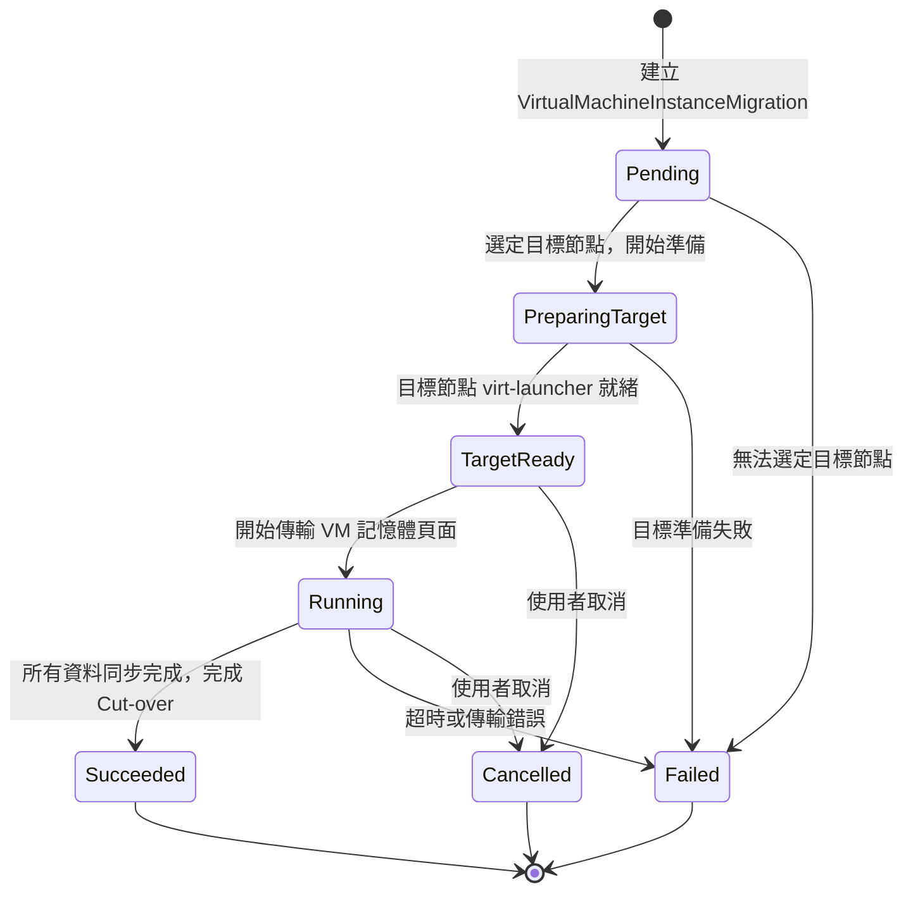
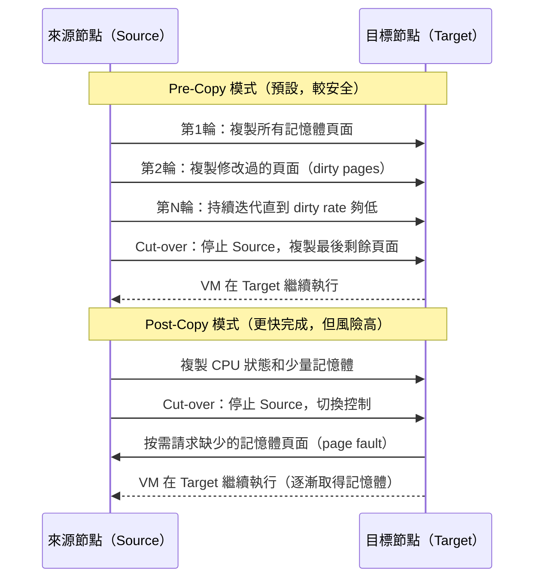
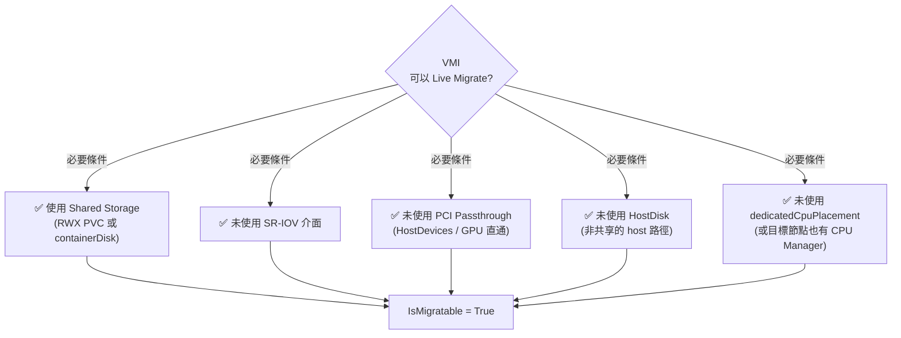
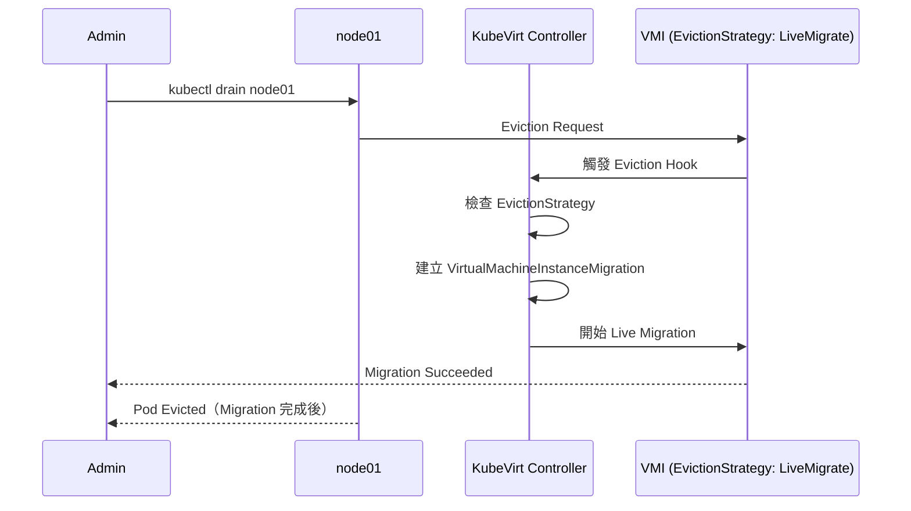
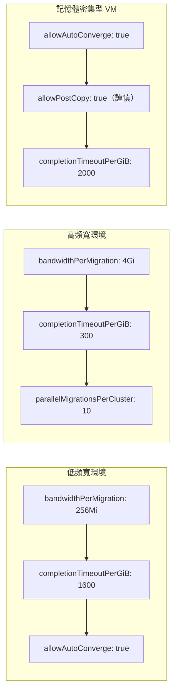

# VirtualMachineInstanceMigration — Live Migration 資源

Live Migration 是 KubeVirt 的核心功能之一，允許在不停機的情況下將執行中的 VM 從一個節點遷移到另一個節點。本文詳細介紹 Migration 相關的所有 API 資源與設定。

## VirtualMachineInstanceMigration CRD

### 基本概念

`VirtualMachineInstanceMigration` 是觸發 Live Migration 的核心資源。**建立此 CRD 即立即觸發對應 VMI 的 Live Migration**。

```yaml
apiVersion: kubevirt.io/v1
kind: VirtualMachineInstanceMigration
metadata:
  name: migrate-my-vm
  namespace: default
spec:
  vmiName: my-vm          # 要遷移的 VMI 名稱（必填）
```

### Spec 欄位說明

| 欄位 | 必填 | 說明 |
|---|---|---|
| `spec.vmiName` | 是 | 要遷移的 VMI 名稱。VMI 必須存在於同一個 Namespace。 |

:::info 一個 VMI 只能有一個進行中的 Migration
若 VMI 已有進行中的 Migration，再建立新的 Migration 物件會失敗。必須等待現有 Migration 完成（Succeeded/Failed/Cancelled）後才能再次觸發。
:::

---

## Migration Phase 狀態機



### 各 Phase 詳細說明

| Phase | 說明 | 對應動作 |
|---|---|---|
| `Pending` | Migration 物件已建立，等待 Controller 處理。選定目標節點中。 | 排程器選擇符合條件的目標節點 |
| `PreparingTarget` | 目標節點已選定，正在目標節點啟動 virt-launcher Pod，準備接收 VM 記憶體。 | 建立 target virt-launcher Pod |
| `TargetReady` | 目標節點 virt-launcher 已就緒，QEMU migration 通道建立完成，等待 source 側開始傳輸。 | QEMU 準備接收連線 |
| `Running` | 正在傳輸 VM 記憶體頁面（dirty page tracking 中）。進行迭代式記憶體複製。 | QEMU 記憶體傳輸中 |
| `Succeeded` | 所有記憶體頁面同步完成，完成 Cut-over（切換控制權），VM 在目標節點繼續執行。 | 刪除 source virt-launcher |
| `Failed` | Migration 失敗（超時、網路錯誤、資源不足等）。VM 繼續在原節點執行。 | 清理 target Pod |
| `Cancelled` | 使用者主動取消 Migration。VM 繼續在原節點執行。 | 中止傳輸，清理 target Pod |

:::tip Migration 不停機
Live Migration 期間 VM 持續執行，使用者幾乎感受不到中斷。Cut-over 階段（最後切換）通常只需幾毫秒到幾十毫秒的停頓。
:::

---

## Migration Status 欄位

```yaml
# VirtualMachineInstanceMigration status
status:
  phase: Running
  migrationUID: "abc123-def456-..."

# VMI status.migrationState（遷移狀態詳情在 VMI 中）
# kubectl get vmi <vmi-name> -o yaml
status:
  migrationState:
    migrationUID: "abc123-def456-..."
    startTimestamp: "2024-01-15T10:00:00Z"
    endTimestamp: "2024-01-15T10:02:35Z"
    completed: false
    failed: false
    abortStatus: ""
    abortRequested: false
    sourceNode: node01
    targetNode: node02
    targetNodeAddress: "192.168.1.102:49152"
    targetDirectMigrationNodePorts:
      "49152": 49152
      "49153": 49153
    targetPod: virt-launcher-my-vm-target-xyz
    targetAttachmentPodUID: "pod-uid-..."
    targetCPUSet: "4-7"
    sourceAttachmentPodUID: "source-pod-uid"
    mode: PreCopy                 # PreCopy 或 PostCopy
```

### Status 欄位詳細說明

| 欄位 | 說明 |
|---|---|
| `phase` | 當前 Migration Phase（見上節） |
| `migrationUID` | Migration 的唯一識別 UID |
| `startTimestamp` | Migration 開始時間 |
| `endTimestamp` | Migration 結束時間（成功或失敗） |
| `completed` | Migration 是否已完成（不論成功失敗） |
| `failed` | Migration 是否失敗 |
| `abortRequested` | 是否已請求取消 |
| `abortStatus` | 取消狀態（Aborting / Aborted） |
| `sourceNode` | 來源節點名稱 |
| `targetNode` | 目標節點名稱 |
| `targetNodeAddress` | 目標節點上 QEMU migration 監聽地址 |
| `targetDirectMigrationNodePorts` | 目標節點 migration 使用的 port 對應 |
| `targetPod` | 目標節點的 virt-launcher Pod 名稱 |
| `mode` | Migration 模式：`PreCopy`（預複製）或 `PostCopy`（後複製） |

---

## Migration Policy (VirtualMachineMigrationPolicy)

`VirtualMachineMigrationPolicy` 是叢集層級資源，用於對特定 VMI 或 Namespace 套用自訂的 Migration 設定，**覆蓋全域設定**。

```yaml
apiVersion: migrations.kubevirt.io/v1alpha1
kind: MigrationPolicy
metadata:
  name: high-bandwidth-migration
spec:
  selectors:
    namespaceSelector:            # 選擇套用的 Namespace
      matchLabels:
        migration-policy: high-bandwidth
    virtualMachineInstanceSelector:  # 選擇套用的 VMI
      matchLabels:
        workload-type: database

  # 允許自動收斂（Auto-Converge）
  # 當 VM 記憶體變更速度過快導致 migration 無法收斂時，
  # 自動降低 Guest CPU 速度以協助收斂
  allowAutoConverge: true

  # 允許 Post-Copy Migration
  # Post-Copy 先完成 CPU 狀態切換，再複製剩餘記憶體頁面（按需傳輸）
  # 可大幅縮短 downtime，但 migration 失敗會導致 VM 崩潰
  allowPostCopy: false

  # 每 GiB 記憶體的完成超時（秒）
  # 例如：64 GiB VM，超時 = 64 × 800 = 51200 秒
  completionTimeoutPerGiB: 800

  # Migration 頻寬限制（每個 migration 的網路頻寬上限）
  bandwidthPerMigration: "1Gi"   # 支援 Kubernetes resource 格式

  # 允許工作負載中斷（允許在 migration 無法完成時強制遷移）
  allowWorkloadDisruption: false
```

### Migration Policy 欄位說明

| 欄位 | 說明 | 預設值 |
|---|---|---|
| `selectors.namespaceSelector` | Namespace 標籤選擇器（LabelSelector） | 無（不限制 namespace） |
| `selectors.virtualMachineInstanceSelector` | VMI 標籤選擇器 | 無（不限制 VMI） |
| `allowAutoConverge` | 允許自動收斂（降低 Guest CPU） | `false` |
| `allowPostCopy` | 允許 Post-Copy 模式 | `false` |
| `completionTimeoutPerGiB` | 每 GiB 記憶體的超時秒數 | `800` |
| `bandwidthPerMigration` | 每個 migration 的頻寬上限 | 無限制 |
| `allowWorkloadDisruption` | 允許強制中斷工作負載 | `false` |

:::warning Policy 優先順序
當多個 MigrationPolicy 都匹配同一個 VMI 時，**最具體的 Policy 優先**（即 VMI selector 比 Namespace selector 更優先）。若優先度相同，按 Policy 名稱字典序排列，取第一個。
:::

### Pre-Copy vs Post-Copy



:::danger Post-Copy 風險
Post-Copy 模式下，若網路中斷或 Source 節點故障，目標節點無法取得記憶體頁面，**VM 將崩潰**。僅在有可靠網路且能接受此風險的場景中啟用。
:::

---

## VM 可以 Live Migrate 的條件

### 必要條件



### 儲存需求

| 儲存類型 | 可 Migrate | 說明 |
|---|---|---|
| `containerDisk` | ✅ | 每個節點獨立拉取 image |
| `dataVolume` / `pvc`（RWX） | ✅ | 共享儲存，兩節點同時可存取 |
| `dataVolume` / `pvc`（RWO） | ❌ | 僅能掛載到單一節點 |
| `hostDisk`（共享 NFS） | ✅ | 如果路徑是共享的 |
| `hostDisk`（本地路徑） | ❌ | 非共享，無法遷移 |
| `emptyDisk` | ❌ | 本地臨時磁碟 |
| `cloudInitNoCloud`（CDRom） | ✅ | 無狀態 cloud-init |

### 網路限制

| 網路模式 | 可 Migrate | 說明 |
|---|---|---|
| `masquerade` | ✅ | NAT 模式，IP 透過 Pod 網路，migration 後 IP 不變 |
| `bridge` | ✅ | 需要 CNI 支援（如 OVN-Kubernetes） |
| `sriov` | ❌ | SR-IOV VF 無法在節點間遷移 |
| `binding` (passt) | ✅ | Passt 支援 migration |

:::info 查看 VMI 是否可遷移
```bash
kubectl get vmi <vmi-name> -o jsonpath='{.status.conditions[?(@.type=="IsMigratable")].status}'
# 輸出: True 或 False

kubectl get vmi <vmi-name> -o jsonpath='{.status.conditions[?(@.type=="IsMigratable")].message}'
# 輸出: 若為 False 的原因說明
```
:::

---

## 觸發 Migration 的方式

### 方式一：使用 virtctl

```bash
# 觸發 Live Migration
virtctl migrate <vmi-name> -n <namespace>

# 取消進行中的 Migration
virtctl migrate-cancel <vmi-name> -n <namespace>
```

### 方式二：直接建立 VirtualMachineInstanceMigration CRD

```bash
# 建立 Migration 物件
kubectl apply -f - <<EOF
apiVersion: kubevirt.io/v1
kind: VirtualMachineInstanceMigration
metadata:
  name: migrate-$(date +%s)
  namespace: <namespace>
spec:
  vmiName: <vmi-name>
EOF

# 監控 Migration 狀態
kubectl get vmim -n <namespace> -w
```

### 方式三：節點驅逐 + EvictionStrategy

```bash
# 排空節點（會觸發所有具有 LiveMigrate EvictionStrategy 的 VMI 遷移）
kubectl drain node01 --ignore-daemonsets --delete-emptydir-data

# 觀察 migration 進度
kubectl get vmim -A -w
```



---

## EvictionStrategy 各值說明

`spec.evictionStrategy` 設定在 VMI spec 中（或透過 VM spec 的 template 設定）：

```yaml
spec:
  template:
    spec:
      evictionStrategy: LiveMigrate
```

| 值 | 行為 | 適用場景 |
|---|---|---|
| `None` | 節點驅逐時不做任何特殊處理，VMI 直接被強制終止（Pod 被刪除）。 | 開發測試、可接受中斷的工作負載 |
| `LiveMigrate` | 節點驅逐時嘗試 Live Migration。若 VMI 不支援 migration（`IsMigratable = False`），驅逐**失敗**，節點不會被完全排空。 | 生產環境、高可用 VM |
| `LiveMigrateIfPossible` | 節點驅逐時嘗試 Live Migration。若 VMI 不支援 migration，直接刪除 VMI（接受中斷）。 | 混合工作負載，容忍部分中斷 |
| `External` | 驅逐事件由外部工具處理（如 cluster-api Machine HealthCheck）。KubeVirt 本身不處理。 | 整合外部叢集管理工具 |

:::tip 全域預設 EvictionStrategy
可在 KubeVirt CR 中設定全域預設值：
```yaml
spec:
  configuration:
    evictionStrategy: LiveMigrate
```
個別 VMI 的設定會覆蓋全域預設值。
:::

---

## KubeVirt 全域 Migration 設定

在 KubeVirt CR 的 `spec.configuration.migrations` 中設定全域 Migration 參數：

```yaml
apiVersion: kubevirt.io/v1
kind: KubeVirt
metadata:
  name: kubevirt
  namespace: kubevirt
spec:
  configuration:
    migrations:
      # 每個 migration 的頻寬上限
      bandwidthPerMigration: "64Mi"

      # 每 GiB 記憶體的完成超時（秒）
      # 64 GiB VM 超時 = 64 × 800 = 51200s ≈ 14 小時
      completionTimeoutPerGiB: 800

      # 每個節點同時進行的 outbound migration 上限
      parallelOutboundMigrationsPerNode: 2

      # 整個叢集同時進行的 migration 上限
      parallelMigrationsPerCluster: 5

      # 若 migration 進度停滯超過此秒數，視為失敗
      progressTimeout: 150

      # 允許強制覆蓋 migration 安全檢查（危險！僅供測試）
      unsafeMigrationOverride: false

      # 允許 Auto-Converge（全域預設）
      allowAutoConverge: false

      # 允許 Post-Copy（全域預設）
      allowPostCopy: false

      # 節點驅逐時是否自動遷移（全域預設 EvictionStrategy）
      nodeDrainTaintKey: "kubevirt.io/drain"
```

### 參數調優建議



| 參數 | 保守設定 | 進取設定 | 說明 |
|---|---|---|---|
| `bandwidthPerMigration` | `64Mi` | `1Gi` | 提高可加快遷移，但占用網路頻寬 |
| `completionTimeoutPerGiB` | `1600` | `400` | 記憶體寫入頻繁的 VM 需要更長時間 |
| `parallelMigrationsPerCluster` | `3` | `10` | 取決於叢集網路與儲存容量 |
| `allowAutoConverge` | `false` | `true` | 自動收斂會降低 Guest CPU，影響效能 |

---

## 完整 YAML 範例

### VirtualMachineInstanceMigration 範例

```yaml
apiVersion: kubevirt.io/v1
kind: VirtualMachineInstanceMigration
metadata:
  name: migrate-db-vm-20240115
  namespace: production
  annotations:
    migration.kubevirt.io/reason: "node-maintenance"
spec:
  vmiName: postgres-primary
```

### VirtualMachineMigrationPolicy 範例

```yaml
---
# 高頻寬遷移策略：適用於標記為 high-performance 的 namespace
apiVersion: migrations.kubevirt.io/v1alpha1
kind: MigrationPolicy
metadata:
  name: high-bandwidth-policy
spec:
  selectors:
    namespaceSelector:
      matchLabels:
        migration-tier: high-bandwidth
  allowAutoConverge: true
  allowPostCopy: false
  completionTimeoutPerGiB: 400
  bandwidthPerMigration: "2Gi"

---
# 資料庫 VM 遷移策略：更保守的設定
apiVersion: migrations.kubevirt.io/v1alpha1
kind: MigrationPolicy
metadata:
  name: database-vm-policy
spec:
  selectors:
    virtualMachineInstanceSelector:
      matchLabels:
        workload-type: database
    namespaceSelector:
      matchLabels:
        env: production
  allowAutoConverge: false
  allowPostCopy: false
  completionTimeoutPerGiB: 1600
  bandwidthPerMigration: "512Mi"
  allowWorkloadDisruption: false

---
# 開發環境：允許更激進的設定
apiVersion: migrations.kubevirt.io/v1alpha1
kind: MigrationPolicy
metadata:
  name: dev-environment-policy
spec:
  selectors:
    namespaceSelector:
      matchLabels:
        env: development
  allowAutoConverge: true
  allowPostCopy: true
  completionTimeoutPerGiB: 200
  bandwidthPerMigration: "4Gi"
  allowWorkloadDisruption: true
```

### VM 設定 EvictionStrategy 的範例

```yaml
apiVersion: kubevirt.io/v1
kind: VirtualMachine
metadata:
  name: ha-database-vm
  namespace: production
spec:
  runStrategy: Always
  dataVolumeTemplates:
    - metadata:
        name: ha-database-vm-disk
      spec:
        source:
          registry:
            url: "docker://quay.io/containerdisks/ubuntu:22.04"
        storage:
          accessModes:
            - ReadWriteMany        # 必須是 RWX 才能 Live Migrate
          resources:
            requests:
              storage: 100Gi
          storageClassName: ceph-rbd-rwx  # 支援 RWX 的 StorageClass
  template:
    metadata:
      labels:
        workload-type: database
        app: ha-database
    spec:
      # 關鍵設定：確保節點維護時觸發 Live Migration
      evictionStrategy: LiveMigrate

      terminationGracePeriodSeconds: 300

      domain:
        cpu:
          cores: 8
          sockets: 1
          # 注意：使用 dedicatedCpuPlacement 時，目標節點也需要有足夠的 CPU Manager 資源
          # dedicatedCpuPlacement: true
          model: host-model      # 使用 host-model 確保可在同世代節點間遷移
        memory:
          guest: 32Gi
          # 注意：hugepages 需要目標節點也有相同配置
          # hugepages:
          #   pageSize: "2Mi"
        machine:
          type: q35
        devices:
          disks:
            - name: rootdisk
              disk:
                bus: virtio
          interfaces:
            - name: default
              masquerade: {}     # masquerade 支援 migration
              model: virtio
            # 注意：SR-IOV 介面不支援 migration，已移除
      networks:
        - name: default
          pod: {}
      volumes:
        - name: rootdisk
          dataVolume:
            name: ha-database-vm-disk
        - name: cloudinitdisk
          cloudInitNoCloud:
            userData: |
              #cloud-config
              user: ubuntu
              password: ubuntu
              chpasswd:
                expire: false
      # 確保不使用任何不支援 migration 的設備
      # 已移除：hostDevices, gpus (直通), sriov interfaces
```

---

## 常用指令

```bash
# ===== 觸發 Migration =====

# 使用 virtctl 觸發
virtctl migrate <vmi-name> -n <namespace>

# 手動建立 Migration 物件
kubectl create -f - <<EOF
apiVersion: kubevirt.io/v1
kind: VirtualMachineInstanceMigration
metadata:
  name: my-migration-$(date +%s)
  namespace: <namespace>
spec:
  vmiName: <vmi-name>
EOF

# ===== 查看 Migration 狀態 =====

# 列出所有 Migration
kubectl get vmim -n <namespace>
kubectl get virtualmachineinstancemigration -n <namespace>

# 查看所有 namespace 的 Migration
kubectl get vmim -A

# 查看 Migration 詳細資訊
kubectl describe vmim <migration-name> -n <namespace>

# 監控 Migration Phase（持續更新）
kubectl get vmim -n <namespace> -w

# 查看 VMI 的 Migration State（詳細進度）
kubectl get vmi <vmi-name> -n <namespace> \
  -o jsonpath='{.status.migrationState}' | jq .

# 查看 Migration Phase
kubectl get vmim <migration-name> -n <namespace> \
  -o jsonpath='{.status.phase}'

# 查看 VMI 遷移前後的節點
kubectl get vmi <vmi-name> -n <namespace> \
  -o jsonpath='{.status.migrationState.sourceNode} -> {.status.migrationState.targetNode}'

# ===== 取消 Migration =====

# 使用 virtctl 取消
virtctl migrate-cancel <vmi-name> -n <namespace>

# 手動刪除 Migration 物件（效果同取消）
kubectl delete vmim <migration-name> -n <namespace>

# ===== 查看 VMI 是否可遷移 =====

# 檢查 IsMigratable Condition
kubectl get vmi <vmi-name> -n <namespace> \
  -o jsonpath='{.status.conditions[?(@.type=="IsMigratable")]}'

# 批次查看所有 VMI 的 Migration 狀態
kubectl get vmi -n <namespace> \
  -o custom-columns='NAME:.metadata.name,NODE:.status.nodeName,MIGRATABLE:.status.conditions[?(@.type=="IsMigratable")].status'

# ===== MigrationPolicy 操作 =====

# 列出所有 MigrationPolicy
kubectl get migrationpolicy

# 查看 MigrationPolicy 詳細資訊
kubectl describe migrationpolicy <policy-name>

# ===== 節點維護操作 =====

# 排空節點（觸發所有 VMI LiveMigrate）
kubectl drain <node-name> \
  --ignore-daemonsets \
  --delete-emptydir-data \
  --pod-selector='!kubevirt.io/created-by'

# 監控排空進度
watch -n 5 "kubectl get vmim -A && echo '---' && kubectl get vmi -A -o wide"

# 節點維護完成後恢復排程
kubectl uncordon <node-name>

# ===== 查看 Migration Events =====
kubectl get events -n <namespace> \
  --field-selector reason=Migration \
  --sort-by='.metadata.creationTimestamp'

# 查看 virt-controller 日誌（migration 相關）
kubectl logs -n kubevirt \
  $(kubectl get pod -n kubevirt -l "kubevirt.io=virt-controller" -o name | head -1) \
  | grep -i migration | tail -50
```

:::tip 批次遷移監控腳本
```bash
#!/bin/bash
# 監控指定 namespace 的所有 migration 進度
NAMESPACE=${1:-default}
while true; do
  clear
  echo "=== Migration Status at $(date) ==="
  kubectl get vmim -n $NAMESPACE \
    -o custom-columns='NAME:.metadata.name,VMI:.spec.vmiName,PHASE:.status.phase'
  echo ""
  echo "=== VMI Node Distribution ==="
  kubectl get vmi -n $NAMESPACE -o wide
  sleep 5
done
```
:::

:::warning Migration 失敗排查
若 Migration 卡在 `PreparingTarget` 或 `TargetReady`，請檢查：
1. 目標節點是否有足夠資源（CPU/Memory）
2. 目標節點的 virt-launcher Pod 是否正常啟動：`kubectl get pod -n $NAMESPACE -l "kubevirt.io/migrationJobName=<migration-name>"`
3. virt-controller 日誌是否有錯誤：`kubectl logs -n kubevirt deployment/virt-controller`
4. 儲存是否支援 RWX（對 Block PVC）或 shared filesystem

若 Migration 在 `Running` 卡很久，可能是記憶體 dirty rate 過高（VM 記憶體寫入太頻繁），考慮啟用 `allowAutoConverge`。
:::
