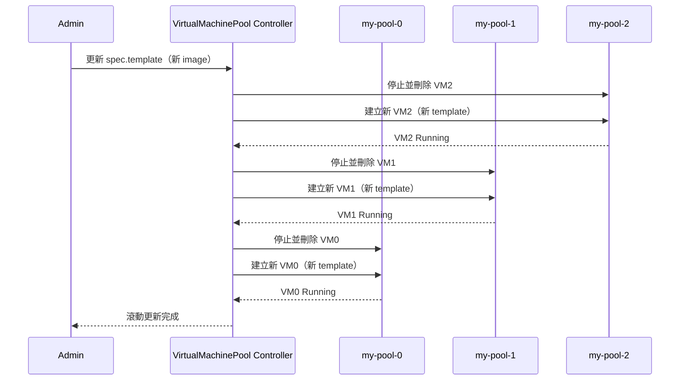
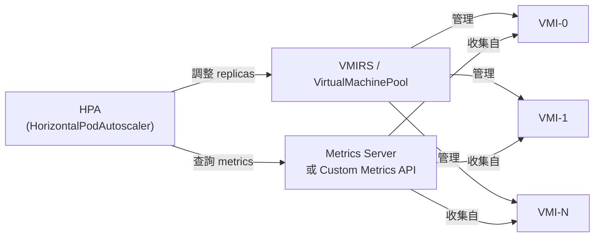

# ReplicaSet 與 Pool — VM 擴展資源

KubeVirt 提供兩種管理多副本 VM 的資源：**VirtualMachineInstanceReplicaSet (VMIRS)** 用於無狀態 VM 群組，**VirtualMachinePool** 用於有狀態 VM 群組。

## VirtualMachineInstanceReplicaSet (VMIRS)

### 設計目的與概念

VMIRS 直接管理一組 **VMI（VirtualMachineInstance）** 副本，類似 Kubernetes 的 `ReplicaSet` 管理 Pod。其核心特性：

- 維護指定數量的 VMI 副本持續執行
- 每個 VMI **共享相同的模板**（包括 `containerDisk`）
- 所有 VMI **無持久狀態**——刪除後資料消失
- 支援水平擴縮（HPA）
- 透過 `selector.matchLabels` 識別自己管理的 VMI

:::info 與 Kubernetes ReplicaSet 類比
| Kubernetes | KubeVirt |
|---|---|
| ReplicaSet | VirtualMachineInstanceReplicaSet |
| Pod | VirtualMachineInstance |
| Container Image | ContainerDisk / Volume |
:::

### 適用場景

- **無狀態計算節點**：渲染農場、科學計算、短暫 CI/CD runners
- **批次處理工作負載**：每個 VM 從佇列取工作，完成即可回收
- **無狀態服務**：負載均衡的 Web 服務群（Session 存在外部）
- **測試/開發環境**：快速建立大量相同 VM 供測試使用

:::warning 不適合有狀態應用
VMIRS 的 VMI 使用 `containerDisk`（ephemeral），重啟後資料消失。如需持久磁碟，應使用 **VirtualMachinePool**。
:::

---

## VirtualMachinePool

### 設計目的與概念

VirtualMachinePool 管理一組 **VM（VirtualMachine）** 副本，每個 VM 有：

- **獨立的 PVC**（透過 `dataVolumeTemplates` 自動建立）
- 獨立的 VMI，可獨立重啟而不影響其他副本
- 支援滾動更新（Rolling Update）
- 每個 VM 有唯一名稱，格式為 `<pool-name>-<index>`（如 `my-pool-0`, `my-pool-1`）

:::info 與 Kubernetes StatefulSet 類比
| Kubernetes | KubeVirt |
|---|---|
| StatefulSet | VirtualMachinePool |
| Pod (with PVC) | VirtualMachine (with DataVolume) |
| Pod-0, Pod-1... | my-pool-0, my-pool-1... |
:::

### 適用場景

- **資料庫叢集**：每個 VM 有獨立資料磁碟（PostgreSQL, MySQL 叢集）
- **有狀態服務群**：需要持久化設定或資料
- **開發/測試環境**：每個開發者一個 VM，保持獨立狀態
- **VDI（虛擬桌面）**：每個使用者一個 VM，持久化個人資料

---

## VMIRS vs VirtualMachinePool 完整對比

| 比較維度 | VirtualMachineInstanceReplicaSet | VirtualMachinePool |
|---|---|---|
| **管理的資源** | VMI（直接） | VM（包含 VMI） |
| **儲存類型** | Ephemeral（containerDisk） | 持久 PVC（DataVolume） |
| **VM 狀態** | 無狀態 | 有狀態 |
| **每個副本 PVC** | ❌ 無 | ✅ 獨立 PVC |
| **更新策略** | 無（替換） | RollingUpdate / OnDelete |
| **重啟行為** | 新 VMI 從 image 啟動 | VM 重啟，資料保留 |
| **副本識別** | 隨機 UID | 有序索引（-0, -1, -2） |
| **縮容行為** | 刪除任意 VMI | 刪除最大索引的 VM（及 PVC） |
| **擴容行為** | 建立新 VMI | 建立新 VM + DataVolume |
| **HPA 支援** | ✅ | ✅ |
| **Paused 支援** | ✅ | ✅ |
| **類比 K8s 資源** | ReplicaSet | StatefulSet |
| **主要使用場景** | 無狀態計算、批次 | 有狀態應用、VDI |

---

## VMIRS Spec 完整說明

```yaml
apiVersion: kubevirt.io/v1
kind: VirtualMachineInstanceReplicaSet
metadata:
  name: my-vmirs
  namespace: default
spec:
  replicas: 3                    # 期望的 VMI 副本數量
  paused: false                  # true 時暫停 reconcile（不建立/刪除 VMI）
  selector:
    matchLabels:
      kubevirt.io/vmirs: my-vmirs  # 必須與 template.metadata.labels 一致
  template:
    metadata:
      labels:
        kubevirt.io/vmirs: my-vmirs
        app: batch-worker
    spec:                        # 完整 VMI spec，與獨立 VMI 相同
      domain:
        cpu:
          cores: 2
        memory:
          guest: 2Gi
        devices:
          disks:
            - name: rootdisk
              disk:
                bus: virtio
          interfaces:
            - name: default
              masquerade: {}
              model: virtio
      networks:
        - name: default
          pod: {}
      volumes:
        - name: rootdisk
          containerDisk:
            image: quay.io/containerdisks/fedora:latest
      terminationGracePeriodSeconds: 30
      evictionStrategy: LiveMigrateIfPossible
```

### VMIRS Spec 欄位說明

| 欄位 | 必填 | 說明 |
|---|---|---|
| `replicas` | 否（預設 1） | 期望的 VMI 副本數 |
| `selector` | 是 | LabelSelector，必須與 template labels 匹配 |
| `template` | 是 | VMITemplateSpec，定義每個 VMI 的 spec |
| `paused` | 否（預設 false） | 暫停 Controller 的 reconcile 循環 |

:::warning Selector 一致性
`spec.selector` 必須與 `spec.template.metadata.labels` 一致，否則 Controller 將拒絕建立資源。建立後 `selector` 不可修改。
:::

---

## VirtualMachinePool Spec 完整說明

```yaml
apiVersion: pool.kubevirt.io/v1alpha1
kind: VirtualMachinePool
metadata:
  name: my-vm-pool
  namespace: default
spec:
  replicas: 3
  paused: false
  selector:
    matchLabels:
      kubevirt.io/vmpool: my-vm-pool
  updateStrategy:
    type: RollingUpdate            # RollingUpdate 或 OnDelete
    rollingUpdate:
      maxUnavailable: 1            # 最多同時不可用的 VM 數（或百分比）
      maxSurge: 0                  # 最多同時超出 replicas 的 VM 數
  template:
    metadata:
      labels:
        kubevirt.io/vmpool: my-vm-pool
        app: stateful-service
    spec:                          # 完整 VM spec
      runStrategy: Always
      dataVolumeTemplates:
        - metadata:
            name: rootdisk         # 實際名稱會加上 VM 索引後綴
          spec:
            source:
              registry:
                url: "docker://quay.io/containerdisks/ubuntu:22.04"
            storage:
              accessModes:
                - ReadWriteOnce
              resources:
                requests:
                  storage: 20Gi
              storageClassName: standard
      template:
        metadata:
          labels:
            kubevirt.io/vmpool: my-vm-pool
        spec:
          domain:
            cpu:
              cores: 4
              sockets: 1
            memory:
              guest: 8Gi
            devices:
              disks:
                - name: rootdisk
                  disk:
                    bus: virtio
                - name: cloudinitdisk
                  cdrom:
                    bus: sata
              interfaces:
                - name: default
                  masquerade: {}
                  model: virtio
          networks:
            - name: default
              pod: {}
          volumes:
            - name: rootdisk
              dataVolume:
                name: rootdisk     # 對應 dataVolumeTemplates[].metadata.name
            - name: cloudinitdisk
              cloudInitNoCloud:
                userData: |
                  #cloud-config
                  user: ubuntu
                  password: ubuntu
                  chpasswd:
                    expire: false
```

### VirtualMachinePool UpdateStrategy 說明

| 策略 | 說明 | 適用場景 |
|---|---|---|
| **RollingUpdate** | 滾動更新，按順序更新每個 VM | 需要高可用的服務群 |
| **OnDelete** | 僅在 VM 被手動刪除時才更新 | 需要手動控制更新節奏 |



---

## Status 欄位說明

VMIRS 與 VirtualMachinePool 的 Status 結構相似：

```yaml
status:
  replicas: 3              # 目前存在的副本數（包含不健康的）
  readyReplicas: 3         # Ready 狀態的副本數
  availableReplicas: 3     # 可用副本數（Running 且 Ready）
  labelSelector: "app=my-app"  # HPA 用來查詢 Pod 的 selector

  conditions:
    - type: ReplicaFailure   # 副本建立/刪除失敗
      status: "False"
      reason: ""
      message: ""
    - type: ReplicaPaused    # 是否暫停（spec.paused = true）
      status: "False"
```

### Conditions 說明

| Condition 類型 | 說明 |
|---|---|
| `ReplicaFailure` | 建立或刪除副本時發生錯誤（如資源不足、PVC 無法建立） |
| `ReplicaPaused` | Controller reconcile 已暫停（`spec.paused: true`） |

---

## HPA 整合說明

HorizontalPodAutoscaler 可根據指標自動調整 VMIRS 或 VirtualMachinePool 的副本數。

### HPA 如何與 VMIRS/Pool 搭配



:::info HPA 的 scaleTargetRef
HPA 的 `scaleTargetRef` 需要指向 VMIRS 或 VirtualMachinePool，KubeVirt 已實作對應的 Scale subresource。
:::

### HPA 設定 VMIRS

```yaml
apiVersion: autoscaling/v2
kind: HorizontalPodAutoscaler
metadata:
  name: vmirs-hpa
  namespace: default
spec:
  scaleTargetRef:
    apiVersion: kubevirt.io/v1
    kind: VirtualMachineInstanceReplicaSet
    name: my-vmirs
  minReplicas: 2
  maxReplicas: 10
  metrics:
    - type: Resource
      resource:
        name: cpu
        target:
          type: Utilization
          averageUtilization: 70
    - type: Pods
      pods:
        metric:
          name: vm_custom_workload
        target:
          type: AverageValue
          averageValue: "100"
  behavior:
    scaleUp:
      stabilizationWindowSeconds: 60
      policies:
        - type: Pods
          value: 2
          periodSeconds: 60
    scaleDown:
      stabilizationWindowSeconds: 300
      policies:
        - type: Pods
          value: 1
          periodSeconds: 120
```

### HPA 設定 VirtualMachinePool

```yaml
apiVersion: autoscaling/v2
kind: HorizontalPodAutoscaler
metadata:
  name: vmpool-hpa
  namespace: default
spec:
  scaleTargetRef:
    apiVersion: pool.kubevirt.io/v1alpha1
    kind: VirtualMachinePool
    name: my-vm-pool
  minReplicas: 3
  maxReplicas: 20
  metrics:
    - type: Resource
      resource:
        name: cpu
        target:
          type: Utilization
          averageUtilization: 60
    - type: Resource
      resource:
        name: memory
        target:
          type: AverageValue
          averageValue: 6Gi
```

:::warning HPA 與有狀態 VM 的注意事項
對 VirtualMachinePool 使用 HPA 進行縮容時，被刪除的 VM 及其 **PVC 也會一起刪除**（資料遺失）。請確保工作負載設計支援動態縮容，或設定適當的 `minReplicas` 下限。
:::

---

## 完整 YAML 範例

### VMIRS 範例（無狀態 VM 群組）

```yaml
apiVersion: kubevirt.io/v1
kind: VirtualMachineInstanceReplicaSet
metadata:
  name: batch-workers
  namespace: compute
  labels:
    app: batch-processing
spec:
  replicas: 5
  paused: false
  selector:
    matchLabels:
      kubevirt.io/vmirs: batch-workers
      workload-type: batch
  template:
    metadata:
      labels:
        kubevirt.io/vmirs: batch-workers
        workload-type: batch
    spec:
      terminationGracePeriodSeconds: 60
      evictionStrategy: LiveMigrateIfPossible
      domain:
        cpu:
          cores: 4
          sockets: 1
          threads: 1
        memory:
          guest: 8Gi
        machine:
          type: q35
        devices:
          blockMultiQueue: true
          networkInterfaceMultiqueue: true
          disks:
            - name: rootdisk
              disk:
                bus: virtio
              bootOrder: 1
            - name: initdisk
              cdrom:
                bus: sata
          interfaces:
            - name: default
              masquerade: {}
              model: virtio
          rng: {}
        resources:
          requests:
            cpu: "4"
            memory: 8Gi
      networks:
        - name: default
          pod: {}
      volumes:
        - name: rootdisk
          containerDisk:
            image: quay.io/my-org/batch-worker:v2.1.0
        - name: initdisk
          cloudInitNoCloud:
            userData: |
              #cloud-config
              write_files:
                - path: /etc/batch/config.yaml
                  content: |
                    queue_url: amqp://rabbitmq.default.svc/jobs
                    worker_id: ${HOSTNAME}
              runcmd:
                - systemctl enable --now batch-worker
```

### VirtualMachinePool 範例（有狀態 VM 群組，含 DataVolumeTemplates）

```yaml
apiVersion: pool.kubevirt.io/v1alpha1
kind: VirtualMachinePool
metadata:
  name: postgres-cluster
  namespace: databases
  labels:
    app: postgres
    tier: database
spec:
  replicas: 3
  paused: false
  selector:
    matchLabels:
      kubevirt.io/vmpool: postgres-cluster
  updateStrategy:
    type: RollingUpdate
    rollingUpdate:
      maxUnavailable: 1
      maxSurge: 0
  template:
    metadata:
      labels:
        kubevirt.io/vmpool: postgres-cluster
        app: postgres
    spec:
      runStrategy: Always
      dataVolumeTemplates:
        - metadata:
            name: os-disk
          spec:
            source:
              registry:
                url: "docker://quay.io/containerdisks/ubuntu:22.04"
            storage:
              accessModes:
                - ReadWriteOnce
              resources:
                requests:
                  storage: 20Gi
              storageClassName: ceph-rbd
        - metadata:
            name: data-disk
          spec:
            source:
              blank: {}
            storage:
              accessModes:
                - ReadWriteOnce
              resources:
                requests:
                  storage: 200Gi
              storageClassName: ceph-rbd-high-iops
      template:
        metadata:
          labels:
            kubevirt.io/vmpool: postgres-cluster
            app: postgres
        spec:
          terminationGracePeriodSeconds: 120
          evictionStrategy: LiveMigrateIfPossible
          domain:
            cpu:
              cores: 8
              sockets: 1
              threads: 2
            memory:
              guest: 32Gi
              hugepages:
                pageSize: "2Mi"
            machine:
              type: q35
            devices:
              blockMultiQueue: true
              networkInterfaceMultiqueue: true
              disks:
                - name: os-disk
                  disk:
                    bus: virtio
                  bootOrder: 1
                  dedicatedIOThread: true
                - name: data-disk
                  disk:
                    bus: virtio
                    cache: none
                    io: native
                  dedicatedIOThread: true
                - name: cloudinitdisk
                  cdrom:
                    bus: sata
              interfaces:
                - name: default
                  masquerade: {}
                  model: virtio
            resources:
              requests:
                cpu: "8"
                memory: 32Gi
              limits:
                cpu: "8"
                memory: 32Gi
            ioThreadsPolicy: auto
          networks:
            - name: default
              pod: {}
          volumes:
            - name: os-disk
              dataVolume:
                name: os-disk
            - name: data-disk
              dataVolume:
                name: data-disk
            - name: cloudinitdisk
              cloudInitNoCloud:
                userData: |
                  #cloud-config
                  user: ubuntu
                  password: ubuntu
                  chpasswd:
                    expire: false
                  packages:
                    - postgresql-15
                  runcmd:
                    - |
                      if [ ! -d /var/lib/postgresql/15/main ]; then
                        pg_createcluster 15 main
                        systemctl enable --now postgresql@15-main
                      fi
```

### HPA 範例

```yaml
---
# VMIRS HPA - CPU 使用率驅動擴縮
apiVersion: autoscaling/v2
kind: HorizontalPodAutoscaler
metadata:
  name: batch-workers-hpa
  namespace: compute
spec:
  scaleTargetRef:
    apiVersion: kubevirt.io/v1
    kind: VirtualMachineInstanceReplicaSet
    name: batch-workers
  minReplicas: 2
  maxReplicas: 20
  metrics:
    - type: Resource
      resource:
        name: cpu
        target:
          type: Utilization
          averageUtilization: 75
  behavior:
    scaleUp:
      stabilizationWindowSeconds: 30
      policies:
        - type: Pods
          value: 3
          periodSeconds: 60
    scaleDown:
      stabilizationWindowSeconds: 600
      policies:
        - type: Pods
          value: 1
          periodSeconds: 120

---
# VirtualMachinePool HPA
apiVersion: autoscaling/v2
kind: HorizontalPodAutoscaler
metadata:
  name: postgres-hpa
  namespace: databases
spec:
  scaleTargetRef:
    apiVersion: pool.kubevirt.io/v1alpha1
    kind: VirtualMachinePool
    name: postgres-cluster
  minReplicas: 3
  maxReplicas: 9
  metrics:
    - type: Resource
      resource:
        name: cpu
        target:
          type: Utilization
          averageUtilization: 60
```

---

## 常用操作指令

```bash
# ===== VMIRS 操作 =====

# 查詢所有 VMIRS
kubectl get vmirs -n <namespace>
kubectl get virtualmachineinstancereplicaset -n <namespace>

# 查詢 VMIRS 詳細資訊
kubectl describe vmirs <vmirs-name> -n <namespace>

# 擴縮 VMIRS 副本數
kubectl scale vmirs <vmirs-name> --replicas=5 -n <namespace>

# Patch VMIRS 副本數
kubectl patch vmirs <vmirs-name> -n <namespace> \
  --type=merge -p '{"spec":{"replicas":5}}'

# 暫停 VMIRS reconcile
kubectl patch vmirs <vmirs-name> -n <namespace> \
  --type=merge -p '{"spec":{"paused":true}}'

# 查看 VMIRS 管理的 VMI
kubectl get vmi -n <namespace> -l "kubevirt.io/vmirs=<vmirs-name>"

# 查看 VMIRS Replica 狀態
kubectl get vmirs <vmirs-name> -n <namespace> \
  -o jsonpath='{.status.readyReplicas}/{.status.replicas}'

# ===== VirtualMachinePool 操作 =====

# 查詢所有 VirtualMachinePool
kubectl get vmpool -n <namespace>
kubectl get virtualmachinepool -n <namespace>

# 查詢 Pool 詳細資訊
kubectl describe vmpool <pool-name> -n <namespace>

# 擴縮 Pool 副本數
kubectl scale vmpool <pool-name> --replicas=5 -n <namespace>

# 查看 Pool 管理的 VM
kubectl get vm -n <namespace> -l "kubevirt.io/vmpool=<pool-name>"

# 查看 Pool 的所有 VM 狀態
kubectl get vm -n <namespace> -l "kubevirt.io/vmpool=<pool-name>" \
  -o custom-columns='NAME:.metadata.name,STATUS:.status.printableStatus,READY:.status.ready'

# 查看某個 Pool VM 的 VMI
kubectl get vmi -n <namespace> -l "kubevirt.io/vmpool=<pool-name>"

# 強制更新特定 VM（OnDelete 策略）
kubectl delete vm <pool-name>-2 -n <namespace>
# Pool Controller 會自動重建 my-pool-2

# ===== 通用操作 =====

# 查看 HPA 狀態
kubectl get hpa -n <namespace>
kubectl describe hpa <hpa-name> -n <namespace>

# 觀察 HPA 擴縮過程
kubectl get hpa <hpa-name> -n <namespace> -w

# 查看 Events
kubectl get events -n <namespace> \
  --field-selector involvedObject.name=<vmirs-or-pool-name> \
  --sort-by='.metadata.creationTimestamp'
```

:::tip 使用 watch 監控副本狀態
```bash
# 持續監控 VMIRS 副本數
watch -n 2 "kubectl get vmirs -n <namespace> && kubectl get vmi -n <namespace>"
```
:::

:::info 縮容時的資料安全（VirtualMachinePool）
VirtualMachinePool 縮容時，會優先刪除索引最大的 VM。**被刪除 VM 的 DataVolume（PVC）也會一併刪除**。若需要保留資料，請在縮容前先手動備份或複製相關 PVC。
:::
