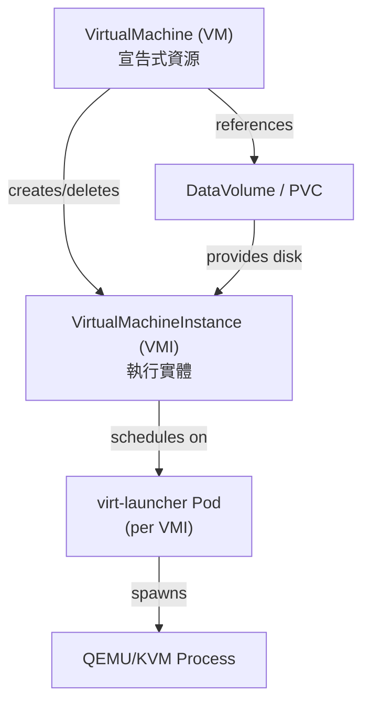
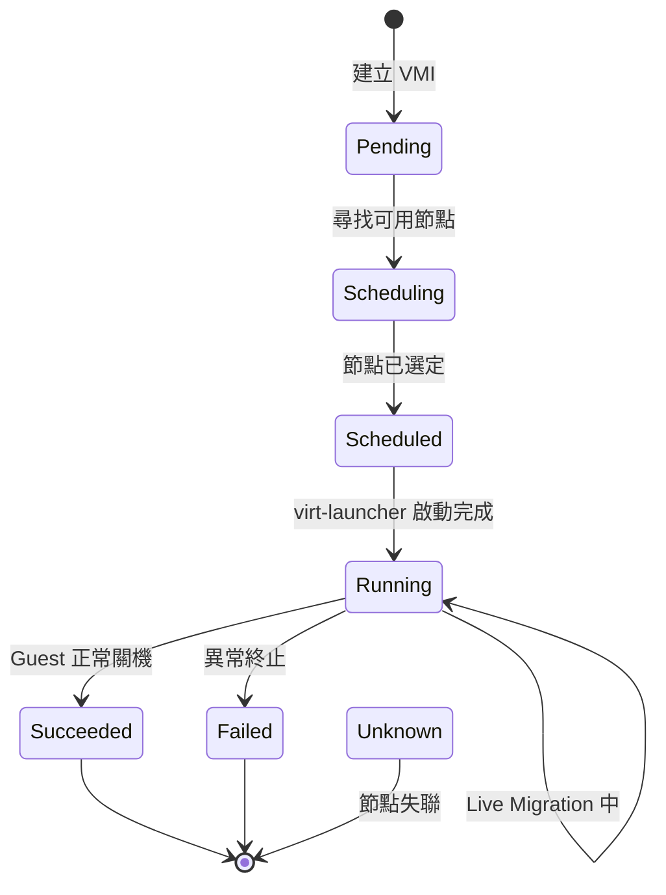

# VM 與 VMI — 核心資源詳解

KubeVirt 的兩個最基礎的 API 資源是 **VirtualMachine (VM)** 與 **VirtualMachineInstance (VMI)**。理解兩者的差異與關係，是掌握 KubeVirt 的第一步。

## VirtualMachine vs VirtualMachineInstance 差別

### 概念對比

| 比較維度 | VirtualMachine (VM) | VirtualMachineInstance (VMI) |
|---|---|---|
| **抽象層級** | 宣告式包裝器（高層） | 實際執行實體（低層） |
| **生命週期** | 持久存在，跨越重啟 | 一次性，每次啟動為新物件 |
| **用途** | 管理 VM 的期望狀態 | 代表一個正在執行（或排程中）的 VM |
| **控制者** | KubeVirt VM Controller | KubeVirt VMI Controller / virt-launcher Pod |
| **Restart 行為** | 刪除並重建 VMI | 無法自行重啟，需 VM 管理 |
| **儲存參考** | 可含 DataVolumeTemplates | 直接參考 Volume |
| **Instancetype** | 支援 Instancetype/Preference | 不支援（已展開） |
| **類比 K8s 資源** | Deployment | Pod |
| **刪除行為** | 停止 VM，不刪除 PVC | 立即終止 virt-launcher Pod |

:::info 核心關係
**VM 是 VMI 的宣告式包裝器**。VM Controller 根據 VM 的 `spec.runStrategy` 決定是否建立、刪除或重建對應的 VMI。一個 VM 同一時間最多對應一個 VMI，名稱相同。
:::



---

## VirtualMachine Spec 完整欄位說明

### RunStrategy

`spec.runStrategy` 控制 VM Controller 對 VMI 的管理行為，取代舊版 `spec.running`。

| 值 | 行為說明 |
|---|---|
| **Always** | 永遠保持 VMI 執行。VMI 失敗或被刪除時，Controller 自動重建。類似 Deployment 的 `replicas: 1`。 |
| **RerunOnFailure** | VMI 因錯誤失敗時重建；若 VMI 正常結束（guest shutdown）則不重建。適合需要 graceful shutdown 的情境。 |
| **Halted** | 停止 VM，不建立 VMI。等同於「關機」狀態。|
| **Manual** | 不自動管理 VMI。需手動透過 `virtctl start/stop` 控制。 |
| **Once** | 僅啟動一次。VMI 結束後不重建，VM 維持存在但 VMI 不重啟。 |

:::tip 建議用法
- 長期執行的 VM（如資料庫）：使用 `Always`
- 批次作業 VM：使用 `Once` 或 `RerunOnFailure`
- 暫時停用的 VM：使用 `Halted`
:::

:::warning 注意
`spec.running` 欄位已被棄用，應改用 `spec.runStrategy`。兩者不可同時設定。
:::

### Template (VMITemplateSpec)

`spec.template` 是 VMI 的模板，內含 VMI 的完整 spec（詳見下節）。

```yaml
spec:
  template:
    metadata:
      labels:
        app: my-vm
    spec:
      domain: ...
      volumes: ...
      networks: ...
```

### Instancetype 與 Preference

KubeVirt 提供 Instancetype 機制，類似雲端供應商的機器類型（如 `n1-standard-4`）：

```yaml
spec:
  instancetype:
    kind: VirtualMachineInstancetype    # 或 VirtualMachineClusterInstancetype
    name: u1.medium
  preference:
    kind: VirtualMachinePreference      # 或 VirtualMachineClusterPreference
    name: rhel.9
```

| 欄位 | 說明 |
|---|---|
| `instancetype.kind` | `VirtualMachineInstancetype`（Namespaced）或 `VirtualMachineClusterInstancetype`（叢集層級） |
| `instancetype.name` | Instancetype 資源名稱 |
| `instancetype.revisionName` | 鎖定特定 revision，避免 Instancetype 更新影響現有 VM |
| `preference.kind` | `VirtualMachinePreference` 或 `VirtualMachineClusterPreference` |
| `preference.name` | Preference 資源名稱 |

### DataVolumeTemplates

在 VM spec 中宣告 DataVolume，VM Controller 會自動建立並管理這些 PVC：

```yaml
spec:
  dataVolumeTemplates:
    - metadata:
        name: my-vm-disk
      spec:
        source:
          registry:
            url: "docker://quay.io/containerdisks/fedora:latest"
        storage:
          accessModes:
            - ReadWriteOnce
          resources:
            requests:
              storage: 30Gi
          storageClassName: rook-ceph-block
```

### UpdateVolumesStrategy

`spec.updateVolumesStrategy` 控制 Volume 更新行為：

| 值 | 說明 |
|---|---|
| **Replacement** | 停止 VM，替換 Volume，重新啟動。安全但有停機時間。 |
| **Migration** | 透過 Live Migration 無縫替換 Volume（需要支援 migration 的 storage）。 |

---

## VMI Spec 完整欄位

### 主要欄位總覽

```yaml
spec:
  domain: {}                        # DomainSpec，定義 VM 硬體
  nodeSelector: {}                  # 節點選擇器
  affinity: {}                      # Pod Affinity/Anti-affinity
  tolerations: []                   # Tolerations
  topologySpreadConstraints: []     # 跨區域分佈限制
  evictionStrategy: LiveMigrate     # 驅逐策略
  volumes: []                       # 磁碟/設備的資料來源
  networks: []                      # 網路介面定義
  livenessProbe: {}                 # 存活探針
  readinessProbe: {}                # 就緒探針
  accessCredentials: []             # SSH keys / userPassword 注入
  subdomain: ""                     # DNS subdomain
  hostname: ""                      # VM hostname
  terminationGracePeriodSeconds: 180
  priorityClassName: ""
  schedulerName: ""
```

### EvictionStrategy

| 值 | 說明 |
|---|---|
| **None** | 節點驅逐時不做任何處理，VMI 會被強制終止。 |
| **LiveMigrate** | 驅逐時嘗試 Live Migration。若 VMI 不可 migrate，驅逐失敗。 |
| **LiveMigrateIfPossible** | 驅逐時嘗試 Live Migration；若不可 migrate，直接刪除 VMI。 |
| **External** | 由外部工具（如 cluster-api）處理驅逐邏輯。 |

### Volumes 類型

所有 Volume 類型及其用途：

| Volume 類型 | 說明 | 常見用途 |
|---|---|---|
| `containerDisk` | OCI 映像中的磁碟（ephemeral） | 快速測試、無狀態 VM |
| `dataVolume` | 參考 DataVolume/PVC | 主系統磁碟 |
| `persistentVolumeClaim` | 直接參考 PVC | 主系統磁碟 |
| `emptyDisk` | 暫存磁碟（VMI 結束即消失） | 暫存空間 |
| `ephemeral` | 以 PVC 為後端的 copy-on-write 層 | 唯讀底層 + 可寫層 |
| `hostDisk` | Node 上的檔案路徑 | 開發/測試（不建議生產） |
| `configMap` | Kubernetes ConfigMap 掛載 | 設定檔注入 |
| `secret` | Kubernetes Secret 掛載 | 憑證注入 |
| `serviceAccount` | ServiceAccount Token | 服務帳號存取 |
| `cloudInitNoCloud` | Cloud-init (NoCloud) | 初始化 VM |
| `cloudInitConfigDrive` | Cloud-init (ConfigDrive) | OpenStack 相容初始化 |
| `sysprep` | Windows Sysprep | Windows VM 初始化 |
| `downwardMetrics` | 暴露 Pod metrics 給 Guest | 監控整合 |

### Networks 類型

```yaml
networks:
  - name: default                  # 介面名稱（對應 domain.devices.interfaces）
    pod: {}                        # 使用 Pod 網路（預設）
  - name: multus-net
    multus:
      networkName: my-nad          # 參考 NetworkAttachmentDefinition
      default: false
```

### AccessCredentials

```yaml
accessCredentials:
  - sshPublicKey:
      source:
        secret:
          secretName: my-ssh-keys
      propagationMethod:
        qemuGuestAgent:
          users:
            - fedora
  - userPassword:
      source:
        secret:
          secretName: my-user-pass
      propagationMethod:
        qemuGuestAgent: {}
```

---

## DomainSpec 詳細欄位

### Resources

```yaml
domain:
  resources:
    requests:
      cpu: "2"
      memory: 4Gi
    limits:
      cpu: "4"
      memory: 8Gi
    overcommitGuestOverhead: false  # true 時 Guest overhead 不計入 requests
```

:::warning 重要
`overcommitGuestOverhead: true` 會讓 virt-launcher 的額外 overhead（約 100-200 MiB）不計入 Pod requests，提高排程密度但增加 OOM 風險。
:::

### CPU

```yaml
domain:
  cpu:
    cores: 4                     # 每個 socket 的核心數
    sockets: 2                   # socket 數量
    threads: 1                   # 每個核心的執行緒數（SMT）
    model: "host-passthrough"    # 或 "host-model", "Skylake-Client" 等
    dedicatedCpuPlacement: true  # CPU Pinning（需 CPU Manager）
    isolateEmulatorThread: true  # QEMU 模擬執行緒獨立 CPU
    realtime:                    # 即時排程
      mask: "0-3"
    maxSockets: 8                # 熱插拔最大 socket 數
    features:
      - name: "vmx"
        policy: "require"        # require / optional / disable / forbid / force
    numa:
      guestMappingPassthrough: {}  # 將 host NUMA 拓撲透傳給 guest
```

| CPU Model | 說明 |
|---|---|
| `host-passthrough` | 完整透傳 host CPU 特性，最佳效能，不可 migrate |
| `host-model` | 使用 host model 的安全子集，支援同世代節點間 migrate |
| `Skylake-Client` 等 | 指定 QEMU CPU model，最大相容性 |

### Memory

```yaml
domain:
  memory:
    guest: 8Gi          # Guest 實際看到的記憶體大小
    hugepages:
      pageSize: "2Mi"   # 或 "1Gi"，需 Node 預先分配
    maxGuest: 16Gi      # 記憶體熱插拔上限（需 Guest 支援 virtio-mem）
```

:::info Hugepages 效能
使用 Hugepages 可顯著降低 TLB Miss，對於記憶體密集型工作負載（資料庫、HPC）效能提升明顯。需要在 Node 上預先配置：`vm.nr_hugepages`。
:::

### Machine Type

```yaml
domain:
  machine:
    type: q35     # 推薦，支援 PCIe、NVMe、IOMMU
                  # 或 pc（i440fx，較舊但相容性高）
```

### Firmware

```yaml
domain:
  firmware:
    bootloader:
      bios:
        bootOrder: ["hd", "cdrom", "network"]
        useSerial: true           # 透過 Serial Console 顯示 BIOS 訊息
      efi:
        secureBoot: true          # 啟用 Secure Boot（需 OVMF）
        persistent: true          # EFI NVRAM 持久化
    uuid: "6a1a24a1-4a35-4b0f-a515-96e1d3d89a5d"  # 固定 SMBIOS UUID
    serial: "VM-12345"            # 虛擬機序號
```

### Clock 與 Timer

```yaml
domain:
  clock:
    utc: {}           # 使用 UTC（或 timezone: "Asia/Taipei"）
    timer:
      hpet:
        present: false   # HPET 通常關閉以提升效能
      kvm:
        present: true    # KVM 時鐘（推薦）
      pit:
        tickPolicy: delay
      rtc:
        tickPolicy: catchup
        track: guest
      hyperv:
        present: true    # Hyper-V 時鐘（Windows Guest 用）
```

### Features

```yaml
domain:
  features:
    acpi: {}                   # 電源管理（必要）
    apic: {}                   # 中斷控制器（推薦）
    smm:
      enabled: true            # 系統管理模式（Secure Boot 需要）
    hyperv:
      relaxed:
        enabled: true          # 放寬時鐘限制（Windows 效能）
      vapic:
        enabled: true          # 虛擬 APIC
      spinlocks:
        enabled: true
        retries: 8191
      synic:
        enabled: true          # Synthetic Interrupt Controller
      synictimer:
        enabled: true
        direct: true
      vpindex:
        enabled: true          # 虛擬 Processor Index
      runtime:
        enabled: true
      reset:
        enabled: true          # 軟體重置
      frequencies:
        enabled: true
      reenlightenment:
        enabled: true
      tlbflush:
        enabled: true
      ipi:
        enabled: true
      evmcs:
        enabled: true          # Enlightened VMCS（Nested Virtualization）
```

:::tip Windows VM 建議
Windows VM 應啟用大部分 `hyperv` features，可顯著提升效能。若使用 KubeVirt 的 `VirtualMachinePreference`，`windows.2k22` preference 已預設啟用這些選項。
:::

### IOThreadsPolicy

```yaml
domain:
  ioThreadsPolicy: shared   # 所有磁碟共享單一 IOThread
                             # 或 auto：每個 virtio 磁碟一個 IOThread
```

### LaunchSecurity

```yaml
domain:
  launchSecurity:
    sev:                          # AMD SEV（Secure Encrypted Virtualization）
      attestation: {}             # 啟用 SEV-SNP attestation
      policy:
        encryptedState: true      # SEV-ES：加密 Guest 暫存器狀態
    # tdx: {}                     # Intel TDX（Trust Domain Extensions）
```

---

## Devices 詳細欄位

### Disks

```yaml
domain:
  devices:
    disks:
      - name: rootdisk             # 對應 volumes[].name
        disk:
          bus: virtio              # virtio / sata / scsi / usb / sas
          readonly: false
          pciAddress: "0000:04:00.0"  # 固定 PCI 位址
        bootOrder: 1               # 開機順序
        dedicatedIOThread: true    # 獨立 IOThread
        serial: "DISK001"          # 磁碟序號

      - name: datadisk
        lun:                       # LUN：原始區塊裝置，支援 SCSI 命令直通
          bus: scsi
          readonly: false

      - name: cloudinitdisk
        cdrom:                     # CDRom：唯讀光碟機
          bus: sata
          readonly: true
          tray: closed
```

#### Disk Bus 類型比較

| Bus 類型 | 效能 | 相容性 | 說明 |
|---|---|---|---|
| `virtio` | 最高 | 需安裝驅動 | 推薦用於 Linux，Windows 需額外驅動 |
| `sata` | 中等 | 最廣泛 | 幾乎所有 OS 原生支援 |
| `scsi` | 高 | 良好 | 支援 SCSI 命令，LUN 必用 |
| `usb` | 低 | 廣泛 | 用於 CDRom 或 USB 設備模擬 |
| `sas` | 高 | 良好 | Serial Attached SCSI |

#### Disk vs LUN vs CDRom

| 類型 | 特性 | 適用場景 |
|---|---|---|
| **Disk** | 標準磁碟介面，支援所有 bus | 系統磁碟、資料磁碟 |
| **LUN** | 原始區塊存取，支援 SCSI 命令直通（T10 PI, PR） | 叢集共享磁碟、資料庫 RAW 存取 |
| **CDRom** | 唯讀，可模擬 CD/DVD | Cloud-init ISO、安裝媒體 |

### Interfaces

```yaml
domain:
  devices:
    interfaces:
      - name: default              # 對應 networks[].name
        masquerade: {}             # NAT 模式（Pod 網路推薦）
        model: virtio              # virtio / e1000 / e1000e / rtl8139 / ne2k_pci
        ports:
          - name: http
            port: 80
            protocol: TCP
        macAddress: "02:00:00:00:00:01"
        pciAddress: "0000:01:00.0"
        bootOrder: 2

      - name: secondary
        bridge: {}                 # Bridge 模式（需 bridge CNI）
        model: e1000e

      - name: sriov-net
        sriov: {}                  # SR-IOV VF 直通

      - name: binding-net
        binding:
          name: my-binding         # 使用 NetworkBinding Plugin
```

#### 網路模式說明

| 模式 | 說明 | 適用場景 |
|---|---|---|
| `masquerade` | Pod IP NAT，VM 透過 Pod 網路存取外部 | 預設模式，最廣泛相容 |
| `bridge` | 直接橋接至 CNI 網路 | 需要 VM 有獨立 IP |
| `sriov` | SR-IOV VF 直通，最高網路效能 | 高效能網路，不支援 migration |
| `binding` | 使用外掛 NetworkBinding Plugin | 自訂網路實作 |

### Inputs

```yaml
domain:
  devices:
    inputs:
      - name: tablet
        type: tablet               # tablet / mouse / keyboard
        bus: usb                   # usb / virtio
```

:::info 建議使用 Tablet
使用 `tablet`（USB）替代 `mouse` 可解決 VNC 游標偏移問題，因為 tablet 使用絕對座標。
:::

### GPUs 與 HostDevices

```yaml
domain:
  devices:
    gpus:
      - name: gpu1
        deviceName: nvidia.com/GA102GL_A10    # vGPU（使用 NVIDIA GRID）
      - name: gpu2
        deviceName: nvidia.com/TU104GL_Tesla_T4  # GPU 直通

    hostDevices:
      - name: intel-qat
        deviceName: intel.com/qat            # PCI 設備直通（如 QAT, FPGA）
```

:::warning SR-IOV 與 GPU 直通限制
使用 SR-IOV 或 GPU/PCI 直通的 VMI **不支援 Live Migration**，因為這些設備無法在節點間遷移。
:::

### 其他設備

```yaml
domain:
  devices:
    tpm:
      persistent: true             # TPM 2.0 模擬（Secure Boot 需要）

    sound:
      name: ich9audio
      model: ich9                  # ac97 / ich6 / ich9

    filesystems:
      - name: host-share
        virtiofs: {}               # VirtioFS 共享 host 目錄給 guest

    watchdog:
      name: mywatchdog
      i6300esb:
        action: poweroff           # poweroff / reset / shutdown

    useVirtioTransitional: false   # 使用舊版 virtio-pci（相容性）
    blockMultiQueue: true          # 多佇列 Block I/O（提升 I/O 吞吐量）
    networkInterfaceMultiqueue: true  # 多佇列網路（提升網路吞吐量）

    rng: {}                        # VirtIO RNG（亂數產生器）
    autoattachPodInterface: true   # 自動附加 Pod 網路介面
    autoattachGraphicsDevice: true # 自動附加 VGA 顯示設備
    autoattachSerialConsole: true  # 自動附加串列 Console
    autoattachMemBalloon: true     # 自動附加 Memory Balloon
```

---

## VMI Status 重要欄位

### Phase 狀態機



| Phase | 說明 |
|---|---|
| `Pending` | VMI 已建立，等待排程 |
| `Scheduling` | 正在尋找合適節點 |
| `Scheduled` | 節點已分配，virt-launcher Pod 啟動中 |
| `Running` | QEMU 正常執行中 |
| `Succeeded` | Guest OS 正常關機 |
| `Failed` | VMI 因錯誤終止 |
| `Unknown` | 節點狀態未知（節點失聯） |

### 關鍵 Status 欄位

```yaml
status:
  phase: Running
  nodeName: node01
  guestOSInfo:
    name: "Ubuntu"
    version: "22.04"
    kernelRelease: "5.15.0-generic"
    hostname: "my-vm"
  interfaces:
    - name: default
      ipAddress: "10.244.1.15"
      ipAddresses:
        - "10.244.1.15"
        - "fd00::15"
      mac: "02:00:00:00:00:01"
      interfaceName: "eth0"
  migrationState:
    startTimestamp: "2024-01-01T10:00:00Z"
    endTimestamp: "2024-01-01T10:02:30Z"
    completed: true
    failed: false
    sourceNode: node01
    targetNode: node02
  volumeStatus:
    - name: rootdisk
      target: "vda"
      phase: Ready
  conditions:
    - type: Ready
      status: "True"
    - type: IsMigratable
      status: "True"
    - type: AgentConnected
      status: "True"
  activePods:
    abc123: node01
  launcherContainerImageVersion: "v1.3.0"
```

---

## VM Status 重要欄位

### PrintableStatus 所有值

| PrintableStatus | 說明 |
|---|---|
| `Stopped` | VM 已停止，無 VMI |
| `Provisioning` | DataVolume 正在準備（匯入/複製中） |
| `Starting` | VMI 正在啟動中 |
| `Running` | VMI 正常執行 |
| `Paused` | VMI 已暫停（QEMU Pause） |
| `Migrating` | Live Migration 進行中 |
| `Stopping` | VM 正在停止 |
| `TerminatingPods` | virt-launcher Pod 正在終止 |
| `ErrorUnschedulable` | 無法排程到任何節點 |
| `ErrorDataVolumeNotFound` | 參考的 DataVolume 不存在 |
| `ErrorDataVolumeError` | DataVolume 發生錯誤 |
| `WaitingForVolumeBinding` | PVC 尚未綁定到 PV |
| `Halted` | RunStrategy 為 Halted |

```yaml
status:
  printableStatus: Running
  ready: true
  created: true
  conditions:
    - type: Ready
      status: "True"
    - type: Paused
      status: "False"
  stateChangeRequests:
    - action: Start
      uid: "..."
  volumeRequests:
    - addVolumeOptions:
        name: extra-disk
        disk:
          disk:
            bus: virtio
        volumeSource:
          persistentVolumeClaim:
            claimName: extra-pvc
  memoryDumpRequest:
    claimName: memory-dump-pvc
    phase: InProgress
```

---

## KubeVirt CR 說明

KubeVirt Operator 資源，控制整個 KubeVirt 叢集設定：

```yaml
apiVersion: kubevirt.io/v1
kind: KubeVirt
metadata:
  name: kubevirt
  namespace: kubevirt
spec:
  imageRegistry: "quay.io/kubevirt"
  imageTag: "v1.3.0"
  imagePullPolicy: IfNotPresent
  workloadUpdateStrategy:
    workloadUpdateMethods:
      - LiveMigrate     # 優先 Live Migrate
      - Evict           # 無法 Migrate 時驅逐
    batchEvictionSize: 10
    batchEvictionInterval: "1m"
  configuration:
    developerConfiguration:
      featureGates:
        - DataVolumes
        - LiveMigration
        - GPU
        - HostDisk
        - Macvtap
        - Passt
        - HotplugVolumes
        - HostDevices
        - VMExport
        - ExpandDisks
        - NUMA
        - AutoResourceLimitsGate
        - VMLiveUpdateFeatures
        - CPUManager
        - Sidecar
        - CommonInstancetypesDeploymentGate
    migrations:
      bandwidthPerMigration: "64Mi"
      completionTimeoutPerGiB: 800
      parallelOutboundMigrationsPerNode: 2
      parallelMigrationsPerCluster: 5
      progressTimeout: 150
      unsafeMigrationOverride: false
      allowAutoConverge: false
      allowPostCopy: false
    network:
      defaultNetworkInterface: "masquerade"
      permitSlirpInterface: false
      permitBridgeInterfaceOnPodNetwork: true
    smbios:
      manufacturer: "KubeVirt"
      product: "None"
      version: "1.0"
      sku: "None"
      family: "KubeVirt"
    cpuRequest: "100m"
    memoryOvercommit: 100
    emulatedMachines:
      - q35*
      - pc-q35*
```

:::info Feature Gates
Feature Gates 控制 KubeVirt 的實驗性或可選功能。生產環境中應謹慎啟用，部分功能可能影響穩定性。
:::

---

## 完整 YAML 範例

### 基本 VM（containerdisk + cloud-init）

```yaml
apiVersion: kubevirt.io/v1
kind: VirtualMachine
metadata:
  name: fedora-vm
  namespace: default
  labels:
    app: fedora-vm
spec:
  runStrategy: Always
  template:
    metadata:
      labels:
        kubevirt.io/vm: fedora-vm
    spec:
      domain:
        cpu:
          cores: 2
          sockets: 1
          threads: 1
        memory:
          guest: 4Gi
        devices:
          disks:
            - name: rootdisk
              disk:
                bus: virtio
              bootOrder: 1
            - name: cloudinitdisk
              cdrom:
                bus: sata
          interfaces:
            - name: default
              masquerade: {}
              model: virtio
          rng: {}
      networks:
        - name: default
          pod: {}
      volumes:
        - name: rootdisk
          containerDisk:
            image: quay.io/containerdisks/fedora:latest
        - name: cloudinitdisk
          cloudInitNoCloud:
            userData: |
              #cloud-config
              user: fedora
              password: fedora
              chpasswd:
                expire: false
              ssh_authorized_keys:
                - ssh-rsa AAAA...your-public-key
              packages:
                - nginx
              runcmd:
                - systemctl enable --now nginx
```

### 進階 VM（EFI + SecureBoot + CPU Pinning + GPU Passthrough + NUMA）

```yaml
apiVersion: kubevirt.io/v1
kind: VirtualMachine
metadata:
  name: advanced-vm
  namespace: production
spec:
  runStrategy: Always
  dataVolumeTemplates:
    - metadata:
        name: advanced-vm-rootdisk
      spec:
        source:
          registry:
            url: "docker://quay.io/containerdisks/rhel9:9.3"
        storage:
          accessModes:
            - ReadWriteMany
          resources:
            requests:
              storage: 50Gi
          storageClassName: ceph-rbd-rwx
  template:
    metadata:
      labels:
        kubevirt.io/vm: advanced-vm
        workload-type: compute-intensive
    spec:
      nodeSelector:
        feature.node.kubernetes.io/cpu-model-vendor_id: GenuineIntel
        nvidia.com/gpu.product: A100-SXM4-80GB
      priorityClassName: vm-critical
      terminationGracePeriodSeconds: 300
      evictionStrategy: LiveMigrateIfPossible
      domain:
        cpu:
          cores: 8
          sockets: 2
          threads: 2
          model: host-passthrough
          dedicatedCpuPlacement: true
          isolateEmulatorThread: true
          numa:
            guestMappingPassthrough: {}
          features:
            - name: "vmx"
              policy: require
        memory:
          guest: 64Gi
          hugepages:
            pageSize: "1Gi"
        machine:
          type: q35
        firmware:
          bootloader:
            efi:
              secureBoot: true
              persistent: true
          uuid: "a1b2c3d4-e5f6-7890-abcd-ef1234567890"
        clock:
          utc: {}
          timer:
            hpet:
              present: false
            kvm:
              present: true
            pit:
              tickPolicy: delay
            rtc:
              tickPolicy: catchup
        features:
          acpi: {}
          apic: {}
          smm:
            enabled: true
        ioThreadsPolicy: auto
        launchSecurity:
          sev:
            policy:
              encryptedState: true
        resources:
          requests:
            cpu: "16"
            memory: 64Gi
          limits:
            cpu: "16"
            memory: 64Gi
        devices:
          blockMultiQueue: true
          networkInterfaceMultiqueue: true
          autoattachSerialConsole: true
          autoattachMemBalloon: false
          disks:
            - name: rootdisk
              disk:
                bus: virtio
                cache: none
                io: native
              dedicatedIOThread: true
              bootOrder: 1
            - name: datadisk
              lun:
                bus: scsi
                reservation: true
          interfaces:
            - name: default
              masquerade: {}
              model: virtio
            - name: secondary
              sriov: {}
              model: virtio
          gpus:
            - name: gpu1
              deviceName: nvidia.com/A100_SXM4_80GB
          tpm:
            persistent: true
          rng: {}
      networks:
        - name: default
          pod: {}
        - name: secondary
          multus:
            networkName: sriov-network
      volumes:
        - name: rootdisk
          dataVolume:
            name: advanced-vm-rootdisk
        - name: datadisk
          persistentVolumeClaim:
            claimName: data-pvc-advanced
      affinity:
        nodeAffinity:
          requiredDuringSchedulingIgnoredDuringExecution:
            nodeSelectorTerms:
              - matchExpressions:
                  - key: "topology.kubernetes.io/zone"
                    operator: In
                    values: ["zone-a"]
```

---

## 常用 kubectl 指令

```bash
# 查詢所有 VM
kubectl get vm -n <namespace>
kubectl get vm -A                          # 所有 namespace

# 查詢 VM 詳細資訊
kubectl describe vm <vm-name> -n <namespace>

# 查詢所有 VMI
kubectl get vmi -n <namespace>
kubectl get vmi <vmi-name> -o yaml         # 完整 YAML

# 查看 VMI Phase
kubectl get vmi <vmi-name> -o jsonpath='{.status.phase}'

# 查看 VMI IP
kubectl get vmi <vmi-name> -o jsonpath='{.status.interfaces[0].ipAddress}'

# 啟動/停止/重啟 VM（需 virtctl）
virtctl start <vm-name> -n <namespace>
virtctl stop <vm-name> -n <namespace>
virtctl restart <vm-name> -n <namespace>

# Patch VM runStrategy
kubectl patch vm <vm-name> -n <namespace> \
  --type=merge -p '{"spec":{"runStrategy":"Halted"}}'

# 查看 VM Events
kubectl get events -n <namespace> \
  --field-selector involvedObject.name=<vm-name> \
  --sort-by='.metadata.creationTimestamp'

# 建立 VM
kubectl apply -f my-vm.yaml

# 刪除 VM（不會刪除 PVC）
kubectl delete vm <vm-name> -n <namespace>

# 強制刪除 VMI
kubectl delete vmi <vmi-name> -n <namespace> --grace-period=0

# 查看 virt-launcher Pod
kubectl get pod -n <namespace> -l "kubevirt.io/vm=<vm-name>"

# 連接 Serial Console
virtctl console <vm-name> -n <namespace>

# 連接 VNC
virtctl vnc <vm-name> -n <namespace>

# SSH via virtctl
virtctl ssh fedora@<vm-name> -n <namespace>
```

:::tip 使用 virtctl
`virtctl` 是 KubeVirt 的 CLI 工具，提供比 `kubectl` 更方便的 VM 操作。可透過 `kubectl krew install virt` 安裝，或直接從 KubeVirt releases 下載。
:::
