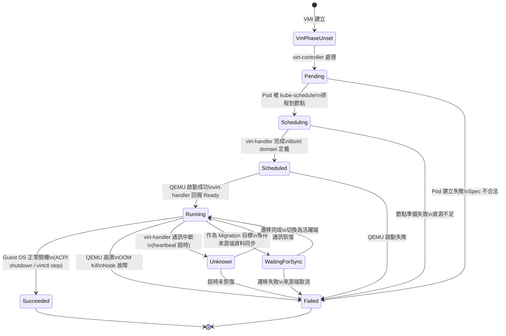

# 架構深入剖析

本頁面深入探討 KubeVirt 的**內部運作機制**，適合已熟悉 Kubernetes 與 KubeVirt 基礎概念的工程師。我們將剖析原始碼中的控制器模式、Admission Webhook 架構、VMI 生命週期狀態機、熱插拔機制、憑證管理、升級策略、裝置管理器，以及節點拓撲管理。

::: tip 閱讀建議
本文引用的程式碼路徑皆相對於 KubeVirt 原始碼根目錄（`github.com/kubevirt/kubevirt`）。建議搭配原始碼一起閱讀，效果更佳。
:::

---

## 1. 控制器模式 (Controller Patterns)

KubeVirt 的叢集級控制邏輯集中在 `pkg/virt-controller/watch/` 目錄下，每個控制器遵循 Kubernetes **Informer → Work Queue → Reconcile** 的標準模式。

### 1.1 控制器總覽

| 控制器 | 程式碼位置 | 進入點 | 職責 |
|--------|-----------|--------|------|
| **VMI Controller** | `vmi/vmi.go` | `NewController()` | Pod 建立、網路設定、DataVolume 追蹤、VMI 生命週期管理 |
| **VM Controller** | `vm/vm.go` | `NewController()` | 從 VM spec 建立 VMI、RunStrategy 執行、LiveUpdate 協調 |
| **Migration Controller** | `migration/migration.go` | `NewController()` | Live Migration 編排、目標 Pod 準備、頻寬管理 |
| **Node Controller** | `node/node.go` | `NewController()` | 節點排空 (drain)、驅逐策略 (eviction policy) |
| **ReplicaSet Controller** | `replicaset/replicaset.go` | `NewController()` | VMIReplicaSet 水平擴縮 |
| **Pool Controller** | `pool/pool.go` | `NewController()` | VMPool 管理與更新策略 |
| **Clone Controller** | `clone/clone_base.go` | `NewVmCloneController()` | 從 Snapshot 克隆 VM |
| **Topology Controller** | `topology/nodetopologyupdater.go` | `NewNodeTopologyUpdater()` | TSC 頻率標記、節點拓撲 |
| **DisruptionBudget Controller** | `drain/disruptionbudget/` | `NewDisruptionBudgetController()` | PDB 管理與 VMI 保護 |
| **Evacuation Controller** | `drain/evacuation/` | `NewEvacuationController()` | 節點疏散與 VM 遷移 |
| **Workload Updater** | `workload-updater/` | `NewWorkloadUpdateController()` | 滾動更新 VMI 工作負載 |
| **Volume Migration** | `volume-migration/` | 工具函式 | 儲存遷移驗證 |
| **Descheduler** | `descheduler/` | 工具函式 | VM 重平衡標記（EvictionInProgress） |
| **VSock** | `vsock/` | `NewCIDsMap()` | VSock CID 分配管理 |
| **DRA** | `dra/` | _規劃中_ | Dynamic Resource Allocation（預留目錄） |

::: info 補充說明
`descheduler/` 和 `volume-migration/` 目前以工具函式形式存在，並非獨立的 controller reconcile loop。`dra/` 是為未來 Kubernetes DRA 整合預留的目錄。
:::

### 1.2 Informer / Cache 模式

所有控制器共用同一套 Informer 快取模式。以 VMI Controller 為例：

```go
// pkg/virt-controller/watch/vmi/vmi.go

// 1. 建立 rate-limited work queue（速率限制佇列）
Queue: workqueue.NewTypedRateLimitingQueueWithConfig[string](
    workqueue.DefaultTypedControllerRateLimiter[string](),
    workqueue.TypedRateLimitingQueueConfig[string]{
        Name: "virt-controller-vmi",
    },
)

// 2. 註冊 SharedInformer 事件處理
_, err := vmiInformer.AddEventHandler(cache.ResourceEventHandlerFuncs{
    AddFunc:    c.addVirtualMachineInstance,
    DeleteFunc: c.deleteVirtualMachineInstance,
    UpdateFunc: c.updateVirtualMachineInstance,
})

// 3. 同樣註冊 Pod、PVC、DataVolume 等相關 Informer
_, err = podInformer.AddEventHandler(cache.ResourceEventHandlerFuncs{
    AddFunc:    c.addPod,
    DeleteFunc: c.deletePod,
    UpdateFunc: c.updatePod,
})
```

#### 事件處理流程

```
SharedInformer ──► EventHandler ──► 萃取 Key ──► Work Queue ──► Worker ──► Reconcile
     │                                              │
     │  cache.MetaNamespaceKeyFunc()                │  exponential backoff
     │  格式: "namespace/name"                       │  失敗時重新入隊
     └──────────────────────────────────────────────┘
```

### 1.3 UIDTrackingControllerExpectations

這是 KubeVirt 用來**防止競態條件**的關鍵機制。當控制器建立一個 Pod 後，在 Informer 收到對應的 Add 事件之前，不應該再次觸發 reconcile 去建立重複的 Pod。

```go
// pkg/controller/expectations.go

type UIDTrackingControllerExpectations struct {
    ControllerExpectationsInterface
    uidStoreLock sync.Mutex
    uidStore     cache.Store
}

// 使用方式（VMI Controller 初始化）
podExpectations: controller.NewUIDTrackingControllerExpectations(
    controller.NewControllerExpectations(),
),
vmiExpectations: controller.NewUIDTrackingControllerExpectations(
    controller.NewControllerExpectations(),
),
```

**運作原理：**

1. **建立前**：記錄「預期會看到一個新的 Pod UID」
2. **Informer 回報**：收到 Add 事件時，標記該 UID 已觀察到
3. **Reconcile 時檢查**：只有當所有 expectations 都已滿足時，才繼續執行建立邏輯
4. **超時保護**：Expectations 有 TTL，避免因事件遺失而永久阻塞

```
Controller                    API Server                 Informer Cache
    │                              │                          │
    ├─── ExpectCreation(uid) ──►   │                          │
    ├─── Create Pod ──────────────►│                          │
    │                              ├── Pod Created ──────────►│
    │                              │                          ├── Add Event
    │◄─────────────────────────────┤                          │
    ├─── CreationObserved(uid) ◄───┤                          │
    │                              │                          │
    ├─── SatisfiedExpectations() ──► true ✓                   │
    └─── 繼續下一輪 Reconcile                                  │
```

### 1.4 Rate-Limited Work Queue

KubeVirt 使用 Kubernetes 內建的 `DefaultTypedControllerRateLimiter`，包含：

- **指數退避 (Exponential Backoff)**：基礎延遲 5ms，最大延遲 1000s
- **整體速率限制 (Overall Rate Limit)**：令牌桶算法，每秒 10 個操作，突發 100
- **Key 去重複**：同一個 key 在佇列中只會出現一次，後續事件自動合併

::: warning 效能注意
當叢集中有大量 VMI 同時變更狀態（例如節點故障導致大規模疏散），work queue 的速率限制會成為瓶頸。可透過 KubeVirt CR 的 `controllerConfiguration` 調整相關參數。
:::

---

## 2. Webhook 架構 (Admission Webhooks)

KubeVirt 透過 Kubernetes Admission Webhooks 在資源建立/更新時進行**變更 (mutate)** 與**驗證 (validate)**。所有 webhook 程式碼位於 `pkg/virt-api/webhooks/`。

### 2.1 Mutating Webhooks（變更型 Webhook）

Mutating webhooks 在資源寫入 etcd 之前修改其內容：

| Mutator | 檔案 | 變更內容 |
|---------|------|---------|
| **VMI Mutator** | `mutators/vmi-mutator.go` | VMI 預設值注入、模擬器執行緒對齊、TDX 機密運算設定、SELinux 標籤 |
| **VM Mutator** | `mutators/vm-mutator.go` | Instance Type 預設值、ControllerRevision 處理、規格展開 |
| **Pod Mutator** | `mutators/virt-launcher-pod-mutator.go` | SecurityContext 設定、SELinux 等級、Volume Mount 注入 |
| **Preset** | `mutators/preset.go` | VMIPreset 規格合併 |
| **Migration Mutator** | `mutators/migration-create-mutator.go` | 頻寬限制預設、排程參數 |
| **Clone Mutator** | `mutators/clone-create-mutator.go` | StorageClass 預設值 |

#### VMI Mutator 處理流程範例

```go
// 簡化的 Mutate 流程
func (mutator *VMIMutator) Mutate(ar *admissionv1.AdmissionReview) *admissionv1.AdmissionResponse {
    // 1. 反序列化 VMI
    vmi := &v1.VirtualMachineInstance{}
    json.Unmarshal(ar.Request.Object.Raw, vmi)

    // 2. 套用各項預設值
    applyDefaultResources(vmi)      // CPU/記憶體預設
    applyDefaultDevices(vmi)        // 裝置預設（disk bus, NIC model）
    alignEmulatorThread(vmi)        // 模擬器執行緒 CPU 對齊
    applyTDXDefaults(vmi)           // 機密運算預設
    applyPresets(vmi)               // VMIPreset 合併

    // 3. 產生 JSON Patch
    patch := createPatch(original, vmi)
    return &admissionv1.AdmissionResponse{
        Allowed:   true,
        PatchType: &jsonPatchType,
        Patch:     patch,
    }
}
```

### 2.2 Validating Webhooks（驗證型 Webhook）

驗證型 webhook 在 mutating 之後執行，用來拒絕不合法的請求：

| Admitter | 檔案 | 驗證內容 |
|----------|------|---------|
| **VMI Create** | `admitters/vmi-create-admitter.go` | Domain 配置合法性、CPU/記憶體資源、裝置衝突檢測 |
| **VMI Update** | `admitters/vmi-update-admitter.go` | 不可變欄位保護、遷移中衝突檢查 |
| **VM** | `admitters/vms-admitter.go` | RunStrategy 合法性、spec 狀態轉換 |
| **Migration Create** | `admitters/migration-create-admitter.go` | 目標節點可用性、遷移策略檢查 |
| **Migration Update** | `admitters/migration-update-admitter.go` | Phase 轉換合法性、中止 (abort) 操作 |
| **Pod Eviction** | `admitters/pod-eviction-admitter.go` | VMI 保護、熱插拔磁碟保護 |
| **VMClone** | `admitters/vmclone-admitter.go` | 來源/目標相容性 |
| **MigrationPolicy** | `admitters/migrationpolicy-admitter.go` | 遷移策略參數驗證 |
| **VMPool** | `admitters/vmpool-admitter.go` | Pool 規格合法性 |
| **VMIRS** | `admitters/vmirs-admitter.go` | ReplicaSet 規格驗證 |
| **Status** | `admitters/status-admitter.go` | Status 子資源更新限制 |

### 2.3 Admit 模式程式碼剖析

所有 admitter 都實作統一的 `Admit()` 方法：

```go
// pkg/virt-api/webhooks/validating-webhook/admitters/vmi-create-admitter.go

type VMICreateAdmitter struct {
    ClusterConfig           *virtconfig.ClusterConfig
    SpecValidators          []SpecValidator
    KubeVirtServiceAccounts map[string]struct{}
}

func (admitter *VMICreateAdmitter) Admit(
    _ context.Context,
    ar *admissionv1.AdmissionReview,
) *admissionv1.AdmissionResponse {
    // 1. Schema 驗證
    if resp := webhookutils.ValidateSchema(
        v1.VirtualMachineInstanceGroupVersionResource, ar.Request.Object.Raw,
    ); resp != nil {
        return resp
    }

    // 2. 從 AdmissionReview 取出 VMI
    vmi, _, err := getAdmissionReviewVMI(ar)
    if err != nil {
        return denied(err)
    }

    // 3. 收集所有驗證原因 (causes)
    var causes []metav1.StatusCause
    for _, validator := range admitter.SpecValidators {
        causes = append(causes, validator.Validate(vmi)...)
    }

    // 4. 檢查 Domain 配置
    causes = append(causes, ValidateVirtualMachineInstanceSpec(vmi, ...)...)

    // 5. 回傳結果
    if len(causes) > 0 {
        return webhookutils.ToAdmissionResponseError(causes)
    }
    return &admissionv1.AdmissionResponse{Allowed: true}
}
```

::: details 完整的 Webhook 呼叫鏈
```
kubectl apply -f vm.yaml
    │
    ▼
API Server ──► Mutating Webhook Chain
                  │
                  ├── VM Mutator（Instance Type 展開、預設值）
                  ├── Preset Mutator（VMIPreset 合併）
                  └── 回傳修改後的物件
                       │
                       ▼
               Validating Webhook Chain
                  │
                  ├── VM Admitter（RunStrategy、spec 驗證）
                  ├── VMI Create Admitter（如果觸發 VMI 建立）
                  └── 回傳 Allowed/Denied
                       │
                       ▼
               寫入 etcd（如果 Allowed）
```
:::

---

## 3. VMI 生命週期狀態機 (State Machine)

VMI 的生命週期由一系列明確定義的 **Phase** 組成，定義在 `staging/src/kubevirt.io/api/core/v1/types.go`。

### 3.1 Phase 定義

```go
// staging/src/kubevirt.io/api/core/v1/types.go

const (
    VmPhaseUnset    VirtualMachineInstancePhase = ""
    Pending         VirtualMachineInstancePhase = "Pending"
    Scheduling      VirtualMachineInstancePhase = "Scheduling"
    Scheduled       VirtualMachineInstancePhase = "Scheduled"
    Running         VirtualMachineInstancePhase = "Running"
    Succeeded       VirtualMachineInstancePhase = "Succeeded"
    Failed          VirtualMachineInstancePhase = "Failed"
    WaitingForSync  VirtualMachineInstancePhase = "WaitingForSync"
    Unknown         VirtualMachineInstancePhase = "Unknown"
)
```

| Phase | 說明 |
|-------|------|
| `VmPhaseUnset` | 初始狀態，尚未處理 |
| `Pending` | virt-controller 已建立 virt-launcher Pod，等待 kube-scheduler 排程 |
| `Scheduling` | Pod 已被排程到節點，virt-handler 開始準備 |
| `Scheduled` | virt-handler 已完成 libvirt domain 定義，等待 QEMU 啟動 |
| `Running` | QEMU 正常運行中，Guest OS 已啟動 |
| `Succeeded` | VM 正常關機 (clean shutdown) |
| `Failed` | VM 異常終止（Pod 失敗、spec 不合法、資源不足等） |
| `WaitingForSync` | 作為 Live Migration 接收端，等待來源端同步 |
| `Unknown` | 與 virt-handler 通訊中斷，無法確認狀態 |

### 3.2 狀態轉換圖



### 3.3 關鍵狀態轉換詳解

#### Pending → Scheduling

```
virt-controller:
  1. 從 VM spec 建立 virt-launcher Pod 模板
  2. 注入所有必要的 Volume Mounts、ConfigMaps
  3. 設定 nodeSelector、affinity、tolerations
  4. 呼叫 Kubernetes API 建立 Pod
  5. kube-scheduler 選擇節點並綁定 Pod

觸發條件: Pod.Status.Phase == "Running" && Pod.Spec.NodeName != ""
```

#### Scheduling → Scheduled

```
virt-handler (在目標節點上):
  1. 偵測到新的 VMI 被排程到本節點
  2. 準備網路（bridge/masquerade/SR-IOV）
  3. 準備儲存（掛載 PVC、ContainerDisk）
  4. 產生 libvirt domain XML
  5. 呼叫 libvirtd 定義 domain

觸發條件: domain 定義成功，等待 QEMU 啟動
```

#### Scheduled → Running

```
virt-handler:
  1. 呼叫 virDomainCreate() 啟動 QEMU
  2. 等待 QEMU guest agent 就緒（如果啟用）
  3. 更新 VMI status 中的 IP 位址、nodeName
  4. 標記 VMI phase 為 Running

觸發條件: libvirt domain state == VIR_DOMAIN_RUNNING
```

### 3.4 PhaseTransitionTimestamps（SLA 追蹤）

KubeVirt 記錄每次 phase 轉換的時間戳，用於效能分析與 SLA 監控：

```go
// staging/src/kubevirt.io/api/core/v1/types.go

type VirtualMachineInstancePhaseTransitionTimestamp struct {
    Phase                    VirtualMachineInstancePhase `json:"phase,omitempty"`
    PhaseTransitionTimestamp metav1.Time                 `json:"phaseTransitionTimestamp,omitempty"`
}

type VirtualMachineInstanceStatus struct {
    // ...
    // +listType=atomic
    // +optional
    PhaseTransitionTimestamps []VirtualMachineInstancePhaseTransitionTimestamp `json:"phaseTransitionTimestamps,omitempty"`
    // ...
}
```

**實際使用範例：**

```bash
# 查詢 VMI 各階段花費的時間
kubectl get vmi my-vm -o jsonpath='{.status.phaseTransitionTimestamps}' | jq .
```

```json
[
  { "phase": "Pending",    "phaseTransitionTimestamp": "2024-01-15T10:00:00Z" },
  { "phase": "Scheduling", "phaseTransitionTimestamp": "2024-01-15T10:00:02Z" },
  { "phase": "Scheduled",  "phaseTransitionTimestamp": "2024-01-15T10:00:05Z" },
  { "phase": "Running",    "phaseTransitionTimestamp": "2024-01-15T10:00:08Z" }
]
```

::: tip SLA 指標
透過 `PhaseTransitionTimestamps` 可以計算：
- **Pod 排程延遲**：Scheduling - Pending
- **節點準備時間**：Scheduled - Scheduling
- **QEMU 啟動時間**：Running - Scheduled
- **端到端啟動時間**：Running - Pending
:::

---

## 4. 熱插拔機制 (Hotplug Mechanisms)

KubeVirt 支援在 VM 運行中動態增減硬體資源，無需停機。

### 4.1 磁碟 / Volume 熱插拔

Volume 熱插拔的控制邏輯位於 `pkg/virt-controller/watch/vmi/volume-hotplug.go`。

#### 核心函式

```go
// pkg/virt-controller/watch/vmi/volume-hotplug.go

// 判斷是否需要處理熱插拔
func needsHandleHotplug(
    hotplugVolumes []*v1.Volume,
    hotplugAttachmentPods []*k8sv1.Pod,
) bool {
    if len(hotplugAttachmentPods) > 1 {
        return true // 多個 attachment pod 需要清理
    }
    if len(hotplugAttachmentPods) == 1 &&
        podVolumesMatchesReadyVolumes(hotplugAttachmentPods[0], hotplugVolumes) {
        return false // 當前狀態已正確
    }
    return len(hotplugVolumes) > 0 || len(hotplugAttachmentPods) > 0
}

// 區分活躍與過期的 attachment pods
func getActiveAndOldAttachmentPods(
    readyHotplugVolumes []*v1.Volume,
    hotplugAttachmentPods []*k8sv1.Pod,
) (*k8sv1.Pod, []*k8sv1.Pod) {
    var currentPod *k8sv1.Pod
    oldPods := make([]*k8sv1.Pod, 0)
    for _, attachmentPod := range hotplugAttachmentPods {
        if !podVolumesMatchesReadyVolumes(attachmentPod, readyHotplugVolumes) {
            oldPods = append(oldPods, attachmentPod)
        } else if attachmentPod.DeletionTimestamp == nil {
            currentPod = attachmentPod
        }
    }
    return currentPod, oldPods
}
```

#### 運作流程

```
使用者透過 virtctl 新增 Volume
    │
    ▼
1. virt-controller 偵測 VMI spec 變更
2. 建立 Attachment Pod（包含新 Volume 的 kubelet mount）
3. 等待 Attachment Pod Running
4. virt-handler 偵測到新的 volume mount
5. 通知 virt-launcher 執行 libvirt attach-device
6. 更新 VMI.Status.VolumeStatus（HotplugVolume 欄位）
7. 清理舊的 Attachment Pod（如果有）
```

::: info Attachment Pod 模式
Volume 熱插拔**不是**直接修改 virt-launcher Pod 的 volumes（Kubernetes 不允許），而是建立獨立的 **Attachment Pod**，透過 kubelet 將 PVC 掛載到相同節點上，再由 virt-handler 將路徑傳遞給 QEMU。
:::

### 4.2 網路 (NIC) 熱插拔

NIC 熱插拔由 `pkg/virt-launcher/virtwrap/network/nichotplug.go` 中的 `virtIOInterfaceManager` 管理。

```go
// pkg/virt-launcher/virtwrap/network/nichotplug.go

type vmConfigurator interface {
    SetupPodNetworkPhase2(domain *api.Domain, networksToPlug []v1.Network) error
}

type virtIOInterfaceManager struct {
    dom          domainClient
    configurator vmConfigurator
}

// libvirt device flags — 同時影響 live domain 與持久配置
const affectDeviceLiveAndConfigLibvirtFlags =
    libvirt.DOMAIN_DEVICE_MODIFY_LIVE | libvirt.DOMAIN_DEVICE_MODIFY_CONFIG
```

#### 關鍵操作

```go
// 熱插入 NIC
func (vim *virtIOInterfaceManager) hotplugVirtioInterface(iface *v1.Interface, ...) error {
    // 1. SetupPodNetworkPhase2() — 建立 tap 裝置、配置橋接
    // 2. 產生 interface XML
    // 3. dom.AttachDeviceFlags(ifaceXML, affectDeviceLiveAndConfigLibvirtFlags)
}

// 熱拔除 NIC
func (vim *virtIOInterfaceManager) hotUnplugVirtioInterface(iface *v1.Interface, ...) error {
    // 1. 產生 interface XML
    // 2. dom.DetachDeviceFlags(ifaceXML, affectDeviceLiveAndConfigLibvirtFlags)
}

// 更新 NIC 鏈路狀態（up/down）
func (vim *virtIOInterfaceManager) updateDomainLinkState(iface *v1.Interface, ...) error {
    // dom.UpdateDeviceFlags(ifaceXML, affectDeviceLiveAndConfigLibvirtFlags)
}
```

### 4.3 CPU 熱插拔

CPU 熱插拔由 `pkg/virt-launcher/virtwrap/converter/compute/cpu.go` 處理。

```go
// pkg/virt-launcher/virtwrap/converter/compute/cpu.go

type CPUDomainConfigurator struct {
    isHotplugSupported       bool
    requiresMPXCPUValidation bool
}

func (c CPUDomainConfigurator) Configure(
    vmi *v1.VirtualMachineInstance,
    domain *api.Domain,
) error {
    // 當 MaxSockets != 0 且平台支援熱插拔時
    // 使用 domainVCPUTopologyForHotplug() 產生支援動態增減的 vCPU 拓撲
    //
    // vCPU 裝置以獨立 <vcpu> 元素建立，
    // 可在運行時透過 libvirt API 啟用/停用
}
```

**運作原理：**

1. 在 domain XML 中預先定義 `maxSockets` 數量的 vCPU 槽位
2. 啟動時只啟用指定數量的 vCPU
3. 熱插拔時，透過 libvirt 啟用額外的 vCPU 裝置
4. **平台限制**：需要架構支援（x86_64 支援，arm64 可能有限制）

### 4.4 記憶體熱插拔 / LiveUpdate

記憶體熱插拔是 KubeVirt 最複雜的 LiveUpdate 功能之一，位於 `pkg/liveupdate/memory/memory.go`。

```go
// pkg/liveupdate/memory/memory.go

const (
    HotplugBlockAlignmentBytes          = 0x200000   // 2 MiB 對齊
    Hotplug1GHugePagesBlockAlignmentBytes = 0x40000000 // 1 GiB 對齊（hugepages）
    requiredMinGuestMemory              = 0x40000000 // 最低 1 GiB Guest 記憶體
)

// 驗證 LiveUpdate 記憶體參數
func ValidateLiveUpdateMemory(
    vmSpec *v1.VirtualMachineInstanceSpec,
    maxGuest *resource.Quantity,
) error {
    // 1. 檢查 maxGuest 是否大於當前記憶體
    // 2. 驗證對齊要求（2 MiB 或 1 GiB for hugepages）
    // 3. 確認最低 Guest 記憶體要求
}

// 建構記憶體裝置（DIMM）
func BuildMemoryDevice(
    vmi *v1.VirtualMachineInstance,
) (*api.MemoryDevice, error) {
    // 1. 計算需要新增的記憶體大小
    // 2. 產生 DIMM 裝置定義
    // 3. 設定正確的 NUMA node 親和性
}
```

#### 記憶體熱插拔流程

```
1. VM 建立時，預先分配 DIMM 槽位（最多到 maxGuest）
   └── 初始記憶體以 base memory 形式配置
   └── 剩餘空間以空 DIMM 槽位保留

2. 使用者請求增加記憶體
   └── VM Controller 檢測 spec 變更
   └── 呼叫 ValidateLiveUpdateMemory() 驗證

3. virt-handler 透過 libvirt 熱插入 DIMM
   └── BuildMemoryDevice() 產生裝置定義
   └── libvirt attach-device 執行實際插入

4. Guest OS 偵測到新的 DIMM
   └── Linux: 自動 online（如果配置 udev rule）
   └── Windows: 可能需要手動確認
```

::: warning 記憶體對齊要求
記憶體熱插拔必須滿足嚴格的對齊要求：
- **標準記憶體**：2 MiB 對齊 (`0x200000`)
- **1G Hugepages**：1 GiB 對齊 (`0x40000000`)
- **最低需求**：Guest 記憶體不得低於 1 GiB

不符合對齊要求的請求會被 ValidateLiveUpdateMemory() 拒絕。
:::

---

## 5. 憑證管理 (Certificate Management)

KubeVirt 元件之間的通訊全部透過 **TLS 加密**。憑證管理程式碼位於 `pkg/certificates/certificates.go`。

### 5.1 憑證體系結構

```
KubeVirt CA（自簽名）
├── 有效期限：7 天
├── Common Name: "kubevirt.io"
│
├── virt-api 憑證
│   ├── 有效期限：24 小時
│   └── SAN: virt-api.{namespace}.pod.cluster.local
│
├── virt-controller 憑證
│   ├── 有效期限：24 小時
│   └── SAN: virt-controller.{namespace}.pod.cluster.local
│
├── virt-handler 憑證
│   ├── 有效期限：24 小時
│   └── SAN: virt-handler.{namespace}.pod.cluster.local
│
└── virt-operator 憑證
    ├── 有效期限：24 小時
    └── SAN: virt-operator.{namespace}.pod.cluster.local
```

### 5.2 憑證產生

```go
// pkg/certificates/certificates.go

func GenerateSelfSignedCert(
    certsDirectory string,
    name string,
    namespace string,
) (certificate.FileStore, error) {

    // 1. 產生 CA key pair（7 天有效期）
    caKeyPair, _ := triple.NewCA("kubevirt.io", time.Hour*24*7)

    // 2. 以 CA 簽發元件憑證（24 小時有效期）
    keyPair, _ := triple.NewServerKeyPair(
        caKeyPair,
        name+"."+namespace+".pod.cluster.local",
        name,
        namespace,
        "cluster.local",
        nil, nil,
        time.Hour*24,
    )

    // 3. 使用 FileStore 原子寫入磁碟
    store, err := certificate.NewFileStore(
        name, certsDirectory, certsDirectory, "", "",
    )
    return store, err
}
```

### 5.3 元件間 TLS 通訊

| 來源 | 目標 | 用途 |
|------|------|------|
| virt-api | API Server | Webhook callback |
| virt-controller | virt-handler | VMI 操作指令 |
| virt-handler | virt-launcher | domain 管理（Unix Socket + TLS） |
| kubectl/virtctl | virt-api | Console/VNC 代理 |

### 5.4 FileStore 與原子更新

`certificate.FileStore` 確保憑證更新時不會出現部分寫入的情況：

1. 將新憑證寫入暫存檔案
2. 執行 `rename()` 原子替換（POSIX 保證原子性）
3. 元件透過 **fsnotify** 或定期檢查偵測憑證變更
4. 重新載入 TLS 配置，無需重啟

**憑證存放路徑：**

```
/etc/virt-api/certificates/
/etc/virt-controller/certificates/
/etc/virt-handler/certificates/
/etc/virt-operator/certificates/
```

::: danger 短期憑證策略
KubeVirt 刻意使用**極短的憑證有效期**（CA 7 天、元件 24 小時），採用「頻繁輪替」策略降低憑證洩漏風險。virt-operator 負責在憑證到期前自動輪替。如果 virt-operator 長時間不可用，元件間通訊最終會因憑證過期而中斷。
:::

---

## 6. 升級機制 (Upgrade Mechanism)

KubeVirt 的升級由 **virt-operator** 驅動，使用基於 ConfigMap 的 **Install Strategy** 模式。

### 6.1 Install Strategy

每個 KubeVirt 版本都對應一個 ConfigMap，包含該版本所有需要部署的 Kubernetes 資源定義。

```go
// pkg/virt-operator/resource/generate/install/strategy.go

type Strategy struct {
    serviceAccounts      []*corev1.ServiceAccount
    clusterRoles         []*rbacv1.ClusterRole
    clusterRoleBindings  []*rbacv1.ClusterRoleBinding
    roles                []*rbacv1.Role
    roleBindings         []*rbacv1.RoleBinding
    crds                 []*extv1.CustomResourceDefinition
    services             []*corev1.Service
    deployments          []*appsv1.Deployment
    daemonSets           []*appsv1.DaemonSet
    validatingWebhooks   []*admregv1.ValidatingWebhookConfiguration
    mutatingWebhooks     []*admregv1.MutatingWebhookConfiguration
    apiServices          []*apiregv1.APIService
    configMaps           []*corev1.ConfigMap
    // ... 更多資源類型
}
```

### 6.2 Strategy 快取

為避免每次 reconcile 都從 ConfigMap 反序列化整個 Strategy，virt-operator 使用 `atomic.Value` 實現執行緒安全的快取：

```go
// pkg/virt-operator/kubevirt.go

type strategyCacheEntry struct {
    key   string      // 格式: "{version}-{resourceVersion}"
    value *install.Strategy
}

// 使用 atomic.Value 實現無鎖快取
latestStrategy atomic.Value

const installStrategyKeyTemplate = "%s-%d"

// pkg/virt-operator/strategy.go

func (c *KubeVirtController) getCachedInstallStrategy() *install.Strategy {
    entry := c.latestStrategy.Load()
    if entry != nil {
        cached := entry.(strategyCacheEntry)
        if cached.key == expectedKey {
            return cached.value // 快取命中，避免反序列化
        }
    }
    return nil // 快取未命中，需要重新載入
}

func (c *KubeVirtController) cacheInstallStrategy(key string, strategy *install.Strategy) {
    c.latestStrategy.Store(strategyCacheEntry{key: key, value: strategy})
}
```

### 6.3 元件部署策略

| 元件 | 部署方式 | 升級策略 | 副本數 |
|------|---------|---------|--------|
| **virt-api** | Deployment | RollingUpdate | ≥2（高可用） |
| **virt-controller** | Deployment + Leader Election | RollingUpdate | ≥2（主備） |
| **virt-handler** | DaemonSet | RollingUpdate | 每節點 1 個 |
| **virt-operator** | Deployment | 由 OLM 或手動管理 | ≥2（高可用） |

### 6.4 Leader Election 配置

virt-controller 和 virt-operator 使用 Kubernetes Lease 進行 leader election：

```go
// pkg/virt-controller/leaderelectionconfig/config.go

const (
    DefaultLeaseDuration = 15 * time.Second  // Lease 有效期
    DefaultRenewDeadline = 10 * time.Second  // 續約截止時間
    DefaultRetryPeriod   = 2 * time.Second   // 重試間隔
    DefaultLeaseName     = "virt-controller"
)

func DefaultLeaderElectionConfiguration() Configuration {
    return Configuration{
        LeaseDuration: metav1.Duration{Duration: DefaultLeaseDuration},
        RenewDeadline: metav1.Duration{Duration: DefaultRenewDeadline},
        RetryPeriod:   metav1.Duration{Duration: DefaultRetryPeriod},
        ResourceLock:  resourcelock.LeasesResourceLock,
    }
}
```

### 6.5 升級流程

```
1. 使用者更新 KubeVirt CR 的 spec.imageTag
   │
   ▼
2. virt-operator 偵測到版本變更
   │
   ├── 載入新版本的 Install Strategy ConfigMap
   ├── 快取到 atomic.Value
   │
   ▼
3. 滾動更新元件
   │
   ├── 更新 virt-api Deployment（新映像檔）
   │   └── 等待所有新 Pod Ready
   │
   ├── 更新 virt-controller Deployment
   │   └── leader election 自動切換
   │
   ├── 更新 virt-handler DaemonSet
   │   └── 節點逐一更新
   │
   ▼
4. 就緒檢查
   │
   ├── virt-api Pod Ready
   ├── APIService available
   ├── Webhook 已註冊
   ├── CRD 已更新
   │
   ▼
5. 更新 KubeVirt CR status
   └── Phase: "Deployed"
```

::: warning 升級注意事項
升級期間，正在運行的 VM 不會被中斷。但新功能（如新的 API 欄位）可能要等到 VM 重新啟動後才能使用。建議在維護窗口進行升級，並確保 virt-operator 有足夠的 RBAC 權限。
:::

---

## 7. 裝置管理器 (Device Manager)

KubeVirt 透過 Kubernetes Device Plugin 機制，將宿主機上的硬體裝置（GPU、SR-IOV VF、vhost-net 等）暴露給 VM 使用。相關程式碼位於 `pkg/virt-handler/device-manager/`。

### 7.1 DeviceHandler 介面

```go
// pkg/virt-handler/device-manager/common.go

type DeviceHandler interface {
    GetDeviceIOMMUGroup(basepath string, pciAddress string) (string, error)
    GetDeviceDriver(basepath string, pciAddress string) (string, error)
    GetDeviceNumaNode(basepath string, pciAddress string) (int64, error)
    GetDevicePCIID(basepath string, pciAddress string) (string, error)
    CreateMDEVType(mdevTypeName string, parentID string) error
    RemoveMDEVType(mdevUUID string) error
    ReadMDEVAvailableInstances(mdevType string, parentID string) (int, error)
    // ...
}
```

### 7.2 支援的裝置類型

| 裝置類型 | 實作檔案 | 說明 |
|---------|---------|------|
| **PCI (GPU)** | `pci_device.go` | 直接 PCI passthrough，使用 VFIO |
| **Mediated Device (mdev)** | `mediated_device.go` | vGPU（NVIDIA vGPU、Intel GVT-g） |
| **vhost-net** | `socket_device.go` | 高效能網路裝置 |
| **KVM** | `generic_device.go` | `/dev/kvm` 裝置存取 |
| **USB** | `usb_device.go` | USB 裝置直通 |

### 7.3 Device Plugin 生命週期

```
1. virt-handler 啟動時掃描節點裝置
   │
   ▼
2. DeviceController 為每種裝置類型建立 Device Plugin
   │
   ├── plugin.Start()
   │   ├── 建立 gRPC server
   │   └── 監聽 Unix socket
   │
   ├── plugin.Register()
   │   └── 向 kubelet 註冊（/var/lib/kubelet/device-plugins/）
   │
   ▼
3. kubelet 排程 Pod 時呼叫 gRPC Allocate()
   │
   ├── 回傳裝置路徑、環境變數
   └── Pod 啟動時掛載裝置
```

### 7.4 指數退避重試

Device Plugin 註冊失敗時使用指數退避：

```
重試間隔: 1s → 2s → 5s → 10s（上限）

原因：
- kubelet 可能尚未就緒
- socket 路徑被舊的 plugin 佔用
- 裝置驅動程式尚未載入
```

::: info Device Plugin 自動恢復
當 kubelet 重啟時，所有 Device Plugin 的 Unix socket 會被清除。virt-handler 的 DeviceController 會偵測到連線中斷，自動重新註冊所有 plugin。
:::

---

## 8. 節點拓撲 (Node Topology)

KubeVirt 需要了解節點的硬體拓撲（CPU、NUMA、hugepages），以做出最佳的 VM 放置決策。

### 8.1 TSC 頻率管理

TSC (Time Stamp Counter) 頻率在 Live Migration 中至關重要——來源和目標節點的 TSC 頻率必須匹配。

```go
// pkg/virt-controller/watch/topology/nodetopologyupdater.go

type NodeTopologyUpdater interface {
    Run(threadiness int, stopCh <-chan struct{})
}

// 為節點標記 TSC 頻率
// Label: kubevirt.io/tsc-frequency-<value>
// 這確保 Live Migration 只選擇 TSC 相容的目標節點
```

**節點標籤範例：**

```yaml
labels:
  kubevirt.io/tsc-frequency: "3500000000"     # 3.5 GHz
  cpu-model.node.kubevirt.io/Skylake-Server: "true"
  cpu-feature.node.kubevirt.io/vmx: "true"
  cpu-feature.node.kubevirt.io/aes: "true"
```

### 8.2 拓撲提示

```go
// pkg/virt-controller/watch/topology/hinter.go

// TopologyHintsForVMI 為 VMI 生成排程拓撲提示
// 考慮因素：
//   - CPU pinning 需求 → 特定 NUMA node
//   - Hugepages 需求 → 有足夠 hugepages 的 NUMA node
//   - TSC 頻率 → 匹配的節點
//   - 裝置親和性 → 裝置所在的 NUMA node
```

### 8.3 NUMA 親和性與 Hugepages

```yaml
# 使用 hugepages 的 VMI 範例
apiVersion: kubevirt.io/v1
kind: VirtualMachineInstance
spec:
  domain:
    memory:
      hugepages:
        pageSize: "2Mi"    # 或 "1Gi"
      guest: "4Gi"
    cpu:
      dedicatedCpuPlacement: true
      numa:
        guestMappingPassthrough: {}
```

**hugepages 在節點上的路徑格式：**

```
/dev/hugepages/kubernetes.io~hugepages-2Mi/
/dev/hugepages/kubernetes.io~hugepages-1Gi/
```

### 8.4 CPU Model 與 Feature 標籤

virt-handler 啟動時偵測宿主機 CPU 特性，並為節點新增標籤：

```
# CPU model 標籤
cpu-model.node.kubevirt.io/<model>: "true"
  例：cpu-model.node.kubevirt.io/Cascadelake-Server: "true"

# CPU feature 標籤
cpu-feature.node.kubevirt.io/<feature>: "true"
  例：cpu-feature.node.kubevirt.io/pdpe1gb: "true"    # 1G hugepages
  例：cpu-feature.node.kubevirt.io/invtsc: "true"     # invariant TSC

# 虛擬化能力標籤
kubevirt.io/schedulable: "true"        # 節點可排程 VM
kubevirt.io/tsc-frequency: "<hz>"      # TSC 頻率
```

::: tip 排程最佳實踐
設計 VM 時，盡量使用**可遷移的 CPU model**（如 `host-model`）而非 `host-passthrough`，這樣 Live Migration 時可以選擇更多目標節點。只有在需要特定 CPU 指令集（如 AVX-512）時才使用 `host-passthrough`。
:::

---

## 9. VMware 工程師觀點：概念對照

如果你有 VMware vSphere 背景，以下對照表能幫助你快速理解 KubeVirt 的設計：

### 9.1 架構層對照

| 領域 | VMware vSphere | KubeVirt |
|------|---------------|----------|
| **叢集管理** | vCenter Server (VPXD) | Kubernetes API Server + virt-controller |
| **節點代理** | ESXi hostd | virt-handler (DaemonSet) |
| **Hypervisor** | ESXi VMkernel | Linux KVM + QEMU |
| **VM 隔離** | VM 執行在 VMkernel 上 | VM 執行在 Pod 內（cgroups + namespaces） |
| **API 入口** | vSphere Web Client / API | virt-api + kubectl/virtctl |
| **安裝管理** | vCenter Installer / VCSA | virt-operator |

### 9.2 控制器模式 vs VPXD 服務

| VMware | KubeVirt | 說明 |
|--------|----------|------|
| VPXD Task System | Controller Reconcile Loop | 兩者都是「期望狀態」驅動 |
| VPXD Alarm Manager | Informer + EventHandler | 事件驅動的反應機制 |
| vMotion Task | Migration Controller | 編排遷移步驟 |
| DRS Placement | kube-scheduler + topology hints | 智慧放置決策 |

**關鍵差異：** VMware 的 VPXD 是**命令式**（執行一系列步驟），而 KubeVirt 的 Controller 是**宣告式**（持續 reconcile 到期望狀態）。KubeVirt 的 controller 可以自動從中間狀態恢復，而 VPXD task 失敗通常需要手動介入。

### 9.3 Webhook vs DRS 規則

| VMware DRS | KubeVirt Webhook |
|------------|-----------------|
| 親和性 / 反親和性規則 | Pod affinity / anti-affinity（Kubernetes 原生） |
| VM-Host 規則 | nodeSelector + nodeAffinity |
| DRS 自動化等級 | RunStrategy（Always, Manual, etc.） |
| 准入控制（權限系統） | Validating Webhook（API 層拒絕不合法請求） |

### 9.4 狀態機 vs VM 電源狀態

| VMware VM State | KubeVirt VMI Phase | 對照說明 |
|----------------|-------------------|---------|
| Not Created | `VmPhaseUnset` | 尚未建立 |
| Registered (no host) | `Pending` | 已定義但未分配到節點 |
| Powered On (booting) | `Scheduling` → `Scheduled` | 正在啟動 |
| Running | `Running` | 正常運行 |
| Powered Off (clean) | `Succeeded` | 正常關機 |
| Error / Disconnected | `Failed` / `Unknown` | 故障或失聯 |
| — | `WaitingForSync` | VMware 無直接對應（vMotion 中目標端） |

### 9.5 熱插拔對照

| 操作 | VMware | KubeVirt |
|------|--------|----------|
| 熱加 CPU | vSphere hot-add CPU | CPUDomainConfigurator + MaxSockets |
| 熱加記憶體 | vSphere hot-add Memory | DIMM 熱插拔 (BuildMemoryDevice) |
| 熱加磁碟 | Add Hard Disk (SCSI hot-add) | Attachment Pod + virtctl addvolume |
| 熱加 NIC | Add Network Adapter | virtIOInterfaceManager + AttachDeviceFlags |

**關鍵差異：** VMware 的熱插拔直接操作 hypervisor 層，而 KubeVirt 需要額外的 **Attachment Pod** 層來解決 Kubernetes Pod 規格不可變的限制。這是 KubeVirt 運行在 Kubernetes 之上的權衡（trade-off）。

### 9.6 憑證管理 vs VMCA

| VMware VMCA | KubeVirt Certificates |
|-------------|----------------------|
| 10 年 CA（預設） | **7 天 CA** — 頻繁輪替 |
| 2 年元件憑證 | **24 小時元件憑證** — 極短期 |
| 手動更新 / VMCA 自動 | virt-operator 自動輪替 |
| 支援第三方 CA 整合 | 僅自簽名（可透過 cert-manager 擴充） |

::: tip VMware 工程師注意
KubeVirt 的短期憑證策略看似「激進」，但這是雲原生安全最佳實踐——類似 Istio mTLS 的做法。好處是即使憑證洩漏，影響窗口也極短（最多 24 小時）。
:::

### 9.7 升級 vs vCenter/ESXi 升級

| VMware 升級 | KubeVirt 升級 |
|------------|-------------|
| vCenter VCSA 升級（需維護窗口） | 更新 KubeVirt CR imageTag |
| ESXi rolling upgrade（需 vMotion） | DaemonSet rolling update（VM 不受影響） |
| Compatibility Matrix 版本相容 | Install Strategy ConfigMap 版本管理 |
| VUM / Lifecycle Manager | virt-operator 自動協調 |
| 需停機的元件升級 | **零停機**滾動更新（運行中的 VM 不受影響） |

**最大優勢：** KubeVirt 升級時，正在運行的 VM 完全不受影響。新版本的 virt-handler 會接管管理這些 VM，但不會強制重啟它們。相比之下，ESXi 升級通常需要先遷移所有 VM。

---

## 總結：架構關鍵設計決策

| 設計決策 | 為什麼這樣做 |
|---------|------------|
| Informer + Work Queue | 避免直接 Watch API Server，減少壓力，支援重試 |
| UIDTrackingExpectations | 防止 Informer 延遲造成重複建立 |
| Attachment Pod（熱插拔） | Kubernetes 不允許修改 Pod spec，只能用額外 Pod |
| 短期憑證（7天/24小時） | 最小化憑證洩漏影響窗口，符合零信任原則 |
| ConfigMap Install Strategy | 版本化部署清單，支援回滾與多版本並存 |
| atomic.Value 策略快取 | 無鎖、執行緒安全，避免每次 reconcile 都反序列化 |
| Device Plugin 模式 | 重用 Kubernetes 原生裝置管理，不另起爐灶 |
| TSC 頻率標籤 | 確保 Live Migration 只選擇相容節點 |

::: info 延伸閱讀
- [系統架構概述](/kubevirt/architecture/overview) — KubeVirt 基礎架構入門
- [VM 生命週期流程](/kubevirt/architecture/lifecycle) — VMI 生命週期詳細流程
- [virt-controller 元件](/kubevirt/components/virt-controller) — 控制器元件詳解
- [virt-handler 元件](/kubevirt/components/virt-handler) — 節點代理詳解
- [Live Migration](/kubevirt/advanced/live-migration) — 遷移機制深入
:::
