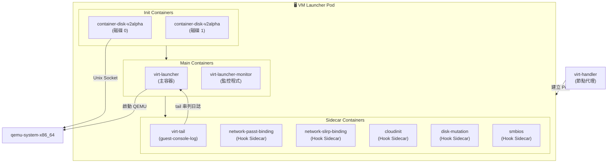
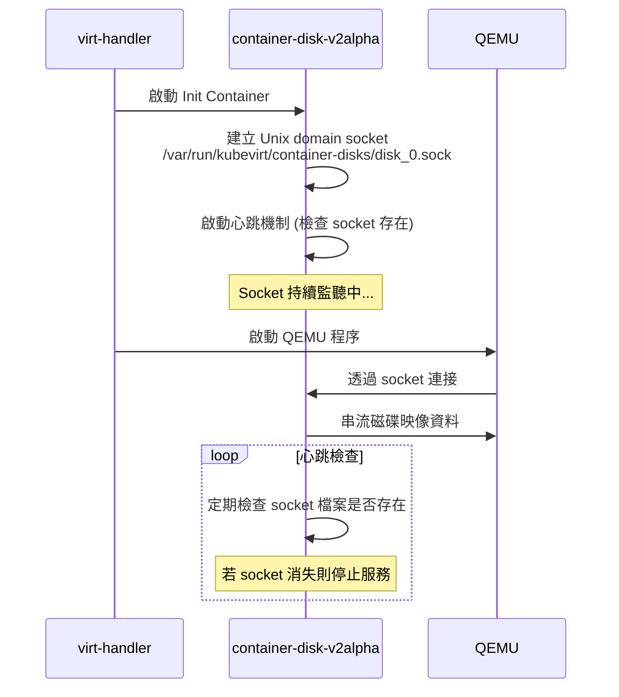
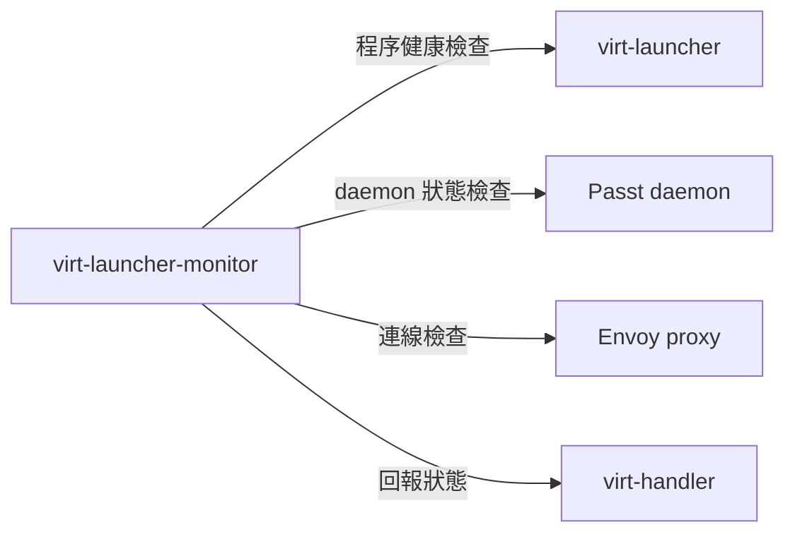
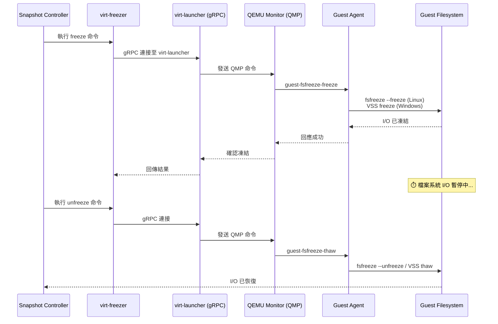
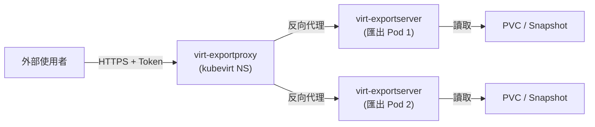

# 輔助元件與工具程式

KubeVirt 除了五個核心元件（virt-operator、virt-api、virt-controller、virt-handler、virt-launcher）之外，
還包含超過 **20 個輔助二進位檔案**，涵蓋磁碟服務、日誌收集、快照凍結、網路外掛、鉤子側車等功能。
本頁面將逐一解析這些輔助程式的技術細節、部署方式與運行機制。

:::tip 閱讀對象
本文件面向熟悉 VMware vSphere 的工程師，透過 VMware 對照說明，
幫助你快速理解 KubeVirt 每個輔助元件的角色與設計動機。
:::

---

## 1. 概述 — VM Pod 完整組成 {#overview}

當一個 VirtualMachineInstance（VMI）被排程到節點上，virt-handler 會建立一個 **Launcher Pod**。
這個 Pod 不僅僅是一個容器，而是一個由多層容器組成的完整虛擬化執行環境：



### Pod 結構一覽

```
launcher-pod/
├── init-containers/
│   ├── container-disk-v2alpha (per ContainerDisk volume)
│   │   └── 建立 Unix socket → 提供磁碟映像
│   └── ...
├── containers/
│   ├── compute (virt-launcher)           ← 主容器
│   │   ├── virt-launcher                 ← 生命週期管理
│   │   ├── virt-launcher-monitor         ← 程序健康監控
│   │   └── qemu-system-x86_64           ← VM 程序
│   └── guest-console-log (virt-tail)     ← 串列主控台日誌
└── hook-sidecars/ (選擇性注入)
    ├── network-passt-binding
    ├── network-slirp-binding
    ├── cloudinit
    ├── disk-mutation
    └── smbios
```

:::info VMware 對照
在 VMware vSphere 中，這些功能全部打包在 ESXi hypervisor 與 hostd/vpxa 程序內。
KubeVirt 採用 **微服務架構**，將每個功能拆分為獨立容器，
遵循 Kubernetes 的容器化設計原則，實現更好的隔離性與可觀測性。
:::

---

## 2. container-disk-v2alpha — 容器磁碟伺服器 {#container-disk}

### 概述

`container-disk-v2alpha` 是 KubeVirt 中唯一使用 **純 C 語言** 撰寫的元件（非 Go），
這是出於效能考量的設計決策。它負責透過 Unix domain socket 將容器映像中的磁碟檔案
串流提供給 QEMU。

### 技術細節

| 屬性 | 值 |
|------|-----|
| **原始碼** | `cmd/container-disk-v2alpha/main.c` |
| **語言** | C |
| **執行角色** | Init Container + 長期運行容器 |
| **通訊方式** | Unix domain socket |
| **Socket 路徑** | `/var/run/kubevirt/container-disks/disk_N.sock` |

### 運作機制



### 原始碼重點

```c
// cmd/container-disk-v2alpha/main.c
#include <sys/socket.h>
#include <sys/un.h>
#include <signal.h>
#include <fcntl.h>

#define LISTEN_BACKLOG 50
char copy_path[108];

// 建立 Unix domain socket 並開始監聽
// QEMU 通過此 socket 讀取磁碟映像資料
```

### 心跳機制

container-disk-v2alpha 使用定期心跳檢查來確保服務存活：
- 定期檢查 Unix socket 檔案是否依然存在於檔案系統
- 若 socket 檔案被移除（例如 Pod 正在終止），程序會自動退出
- 這種設計避免了孤立程序（orphan process）的問題

:::warning 效能考量
使用 C 語言而非 Go 撰寫此元件是刻意的設計選擇。因為此元件需要在
每個擁有 ContainerDisk 的 VM Pod 中運行，最小化記憶體使用量至關重要。
Go runtime 的基礎記憶體開銷（~10MB）在大量 VM 的叢集中會累積成
可觀的資源消耗。
:::

:::tip VMware 對照
在 VMware 中，VMDK 檔案直接存放在 datastore（VMFS/NFS）上，ESXi 直接存取。
KubeVirt 的 ContainerDisk 機制將磁碟映像打包在 OCI 容器中，
透過 Unix socket 提供給 QEMU，實現了**磁碟映像的容器化分發**。
:::

---

## 3. virt-tail (guest-console-log) — 串列主控台日誌 {#virt-tail}

### 概述

`virt-tail` 負責將 VM 的串列主控台（serial console）輸出導入 Kubernetes 容器日誌系統，
讓使用者可以透過 `kubectl logs` 直接查看 VM 的開機訊息與系統日誌。

### 技術細節

| 屬性 | 值 |
|------|-----|
| **原始碼** | `cmd/virt-tail/main.go` |
| **容器名稱** | `guest-console-log` |
| **監視檔案** | `/var/run/kubevirt/private/<vmi-uid>/virt-serial0-log` |
| **核心依賴** | `github.com/nxadm/tail` |
| **CPU 請求/上限** | 5m / 15m |
| **記憶體請求/上限** | 35Mi / 60Mi |

### 運作機制


### 啟用條件

virt-tail sidecar 只有在滿足以下條件時才會被注入 VM Pod：

```go
// 啟用邏輯（簡化版）
if vmi.Spec.Domain.Devices.AutoattachSerialConsole != false {
    // 預設啟用
}
// 或者明確配置
if kvConfig.LogSerialConsole == true {
    // 強制啟用
}
```

### 使用方式

```bash
# 查看 VM 串列主控台日誌
kubectl logs <launcher-pod> -c guest-console-log

# 即時串流日誌
kubectl logs <launcher-pod> -c guest-console-log -f
```

### 原始碼結構

```go
// cmd/virt-tail/main.go
package main

import (
    "github.com/nxadm/tail"     // 檔案追蹤函式庫
    "golang.org/x/sync/errgroup" // 錯誤群組管理
)

// VirtTail 結構體持有要追蹤的日誌檔案路徑
// 使用 tail.TailFile() 搭配 tail.SeekInfo 追蹤檔案變更
// 將讀取到的每一行輸出至 stdout
```

:::tip VMware 對照
這類似 VMware 的**串列埠輸出日誌**功能。在 vSphere 中，
你可以將 VM 的串列埠導向至檔案（`serial0.log`），
然後透過 vSphere Client 或直接存取 datastore 來查看。
KubeVirt 的 virt-tail 將此功能整合進 Kubernetes 原生的日誌系統，
使其與 `kubectl logs`、Loki、Fluentd 等工具無縫整合。
:::

---

## 4. virt-launcher-monitor — 啟動器監控程式 {#virt-launcher-monitor}

### 概述

`virt-launcher-monitor` 是運行在 virt-launcher 容器內部的監控程式，
負責持續監控 virt-launcher 程序本身以及相關網路守護程式（如 Passt）的健康狀態。

### 技術細節

| 屬性 | 值 |
|------|-----|
| **原始碼** | `cmd/virt-launcher-monitor/virt-launcher-monitor.go` |
| **執行位置** | virt-launcher 容器內 |
| **監控目標** | virt-launcher 程序、Passt daemon |
| **通訊方式** | HTTP 狀態檢查、程序信號 |

### 監控範圍



### 核心功能

1. **程序監控**：監視 virt-launcher 主程序的存活狀態
2. **Passt 健康檢查**：確認 Passt 網路守護程式正常運行
3. **Envoy 連線驗證**：檢查與 Envoy proxy 的連接
4. **信號處理**：捕捉 `SIGTERM`、`SIGINT` 等信號，協調優雅關閉

### 原始碼摘要

```go
// cmd/virt-launcher-monitor/virt-launcher-monitor.go
package main

import (
    "net/http"        // HTTP 狀態端點
    "os/exec"         // 程序管理
    "os/signal"       // 信號處理
    "golang.org/x/sys/unix" // 系統呼叫
)

// 持續監控 virt-launcher 與相關守護程式
// 透過 HTTP 端點回報健康狀態
// 偵測到異常時觸發清理流程
```

---

## 5. virt-freezer — 檔案系統凍結工具 {#virt-freezer}

### 概述

`virt-freezer` 用於在進行 VM 快照前凍結（freeze）客體作業系統的檔案系統 I/O，
確保快照的資料一致性。這是 KubeVirt 快照功能的關鍵輔助元件。

### 技術細節

| 屬性 | 值 |
|------|-----|
| **原始碼** | `cmd/virt-freezer/virt-freezer.go` |
| **依賴** | QEMU Guest Agent（客體代理程式） |
| **預設逾時** | 300 秒自動解凍 |
| **Linux 機制** | fsfreeze |
| **Windows 機制** | VSS（Volume Shadow Copy Service） |

### 凍結流程



### 自動解凍安全機制

```go
// 若凍結後超過 timeout (預設 300 秒) 未收到 unfreeze，
// 則自動執行解凍以避免 VM 無回應
autoUnfreezeTimeout := 300 * time.Second
```

:::danger 重要提醒
使用 virt-freezer 前，必須確保客體 VM 中已安裝並運行 **QEMU Guest Agent**。
沒有 Guest Agent 的 VM 無法執行檔案系統凍結，快照將在無一致性保證的情況下進行。
:::

### 原始碼結構

```go
// cmd/virt-freezer/virt-freezer.go
package main

import (
    "kubevirt.io/kubevirt/pkg/storage/snapshot"
    cmdclient "kubevirt.io/kubevirt/pkg/virt-handler/cmd-client"
    "kubevirt.io/kubevirt/pkg/virt-launcher/virtwrap/api"
)

// freeze: 透過 cmd-client socket 連接 virt-launcher
//         → virt-launcher 透過 QMP 命令 QEMU Guest Agent
//         → Guest Agent 執行 fsfreeze
// unfreeze: 反向操作，執行 thaw 命令
```

:::tip VMware 對照
這完全等同於 VMware 的 **Quiescing Snapshot**（靜默快照）功能。
在 vSphere 中建立快照時勾選「Quiesce guest file system」選項，
VMware Tools 會透過 VSS（Windows）或 sync/freeze（Linux）
確保檔案系統一致性。KubeVirt 的 virt-freezer 實現了相同的功能，
但使用 QEMU Guest Agent 替代 VMware Tools。
:::

---

## 6. virt-probe — 健康檢查探針 {#virt-probe}

### 概述

`virt-probe` 是輕量級的探針工具，用於在 VM 內部執行健康檢查命令，
支援 Kubernetes 的 readiness/liveness probe 機制。

### 技術細節

| 屬性 | 值 |
|------|-----|
| **原始碼** | `cmd/virt-probe/virt-probe.go` |
| **通訊方式** | Guest Agent socket（`cmd-client`） |
| **支援功能** | Guest Agent ping、命令執行 |
| **效能分析** | 內建 pprof 記憶體分析支援 |

### 使用方式

```bash
# 檢查 Guest Agent 是否回應
virt-probe --guestAgentPing \
           --socket /var/run/kubevirt/sockets/launcher_sock \
           --domainName default_my-vm

# 在客體中執行命令
virt-probe --command "cat /etc/os-release" \
           --socket /var/run/kubevirt/sockets/launcher_sock \
           --domainName default_my-vm \
           --timeoutSeconds 5
```

### 在 VMI 中配置

```yaml
apiVersion: kubevirt.io/v1
kind: VirtualMachineInstance
metadata:
  name: my-vm
spec:
  readinessProbe:
    guestAgentPing: {}
    initialDelaySeconds: 30
    periodSeconds: 10
  livenessProbe:
    exec:
      command:
        - virt-probe
        - --command
        - "systemctl is-active my-service"
    initialDelaySeconds: 60
    periodSeconds: 30
```

### 原始碼摘要

```go
// cmd/virt-probe/virt-probe.go
func main() {
    socket := pflag.String("socket", cmdclient.SocketOnGuest(), "...")
    domainName := pflag.String("domainName", "", "...")
    command := pflag.String("command", "", "在客體中執行的命令")
    timeoutSeconds := pflag.Int32("timeoutSeconds", 1, "探針逾時秒數")
    // ...
}
```

---

## 7. virt-chroot — 命名空間操作工具 {#virt-chroot}

### 概述

`virt-chroot` 是 KubeVirt 中功能最豐富的輔助工具之一。
它提供在特定 mount namespace 中執行操作的能力，
包含 TAP 裝置建立、SELinux 標籤管理、mdev 裝置管理及 cgroup 資源控制。

:::warning 注意
virt-chroot 由 **virt-handler** 呼叫，而非作為 sidecar 運行。
它是節點層級的工具，需要特權存取。
:::

### 技術細節

| 屬性 | 值 |
|------|-----|
| **原始碼** | `cmd/virt-chroot/main.go`（+ 多個子模組） |
| **呼叫者** | virt-handler |
| **核心機制** | `Unshare(CLONE_NEWNS)` + `Setns()` |
| **安全防護** | safepath 函式庫（防止符號連結攻擊） |

### 子命令列表

| 子命令 | 功能 | 原始碼 |
|--------|------|--------|
| `exec` | 在指定 mount namespace 中執行命令 | `main.go` |
| `mount` | 掛載操作（支援 bind mount、唯讀） | `main.go` |
| `umount` | 卸載（使用 `MNT_DETACH` 延遲卸載） | `main.go` |
| `selinux` | SELinux 操作（GetEnforce、Relabel） | `selinux.go` |
| `create-tap` | 建立 TAP 網路裝置 | `tap-device-maker.go` |
| `create-mdev` | 建立中介裝置（GPU 直通） | `mdev-handler.go` |
| `remove-mdev` | 移除中介裝置 | `mdev-handler.go` |
| `set-cgroups-resources` | 設定 cgroup 資源限制（v1/v2） | `cgroup.go` |

### Mount Namespace 切換

```go
// cmd/virt-chroot/main.go — 核心 namespace 切換邏輯
func init() {
    // 必須鎖定在單一執行緒，因為 namespace 操作是 per-thread 的
    runtime.LockOSThread()
}

rootCmd := &cobra.Command{
    PersistentPreRunE: func(cmd *cobra.Command, args []string) error {
        if mntNamespace != "" {
            fd, _ := os.Open(mntNamespace)
            defer fd.Close()
            // 先脫離父 mount namespace
            unix.Unshare(unix.CLONE_NEWNS)
            // 再加入目標 mount namespace
            unix.Setns(int(fd.Fd()), unix.CLONE_NEWNS)
        }
        return nil
    },
}
```

### TAP 裝置建立

```bash
# virt-handler 透過 virt-chroot 建立 TAP 裝置
virt-chroot --mount /proc/<pid>/ns/mnt \
    create-tap \
    --tap-name tap0 \
    --uid 107 \
    --gid 107 \
    --queue-number 4 \
    --mtu 1500
```

### mdev（中介裝置）管理

```bash
# 建立 GPU 直通用中介裝置
virt-chroot create-mdev \
    --type nvidia-35 \
    --parent 0000:3b:00.0 \
    --uuid 4b20d080-1234-5678-9abc-def012345678

# 移除中介裝置
virt-chroot remove-mdev --uuid 4b20d080-1234-5678-9abc-def012345678
```

### 安全防護：safepath 函式庫

```go
// 使用 safepath 函式庫防止符號連結注入攻擊
// 所有路徑操作都經過驗證，確保不會被惡意 symlink 導向不當位置
import "kubevirt.io/kubevirt/pkg/safepath"
```

:::info 技術細節
`runtime.LockOSThread()` 是必要的，因為 Linux 的 namespace 操作
（`unshare`、`setns`）是針對**執行緒**而非程序的。Go 的 goroutine
可能在不同 OS 執行緒間遷移，若不鎖定執行緒，namespace 切換結果
將無法預測。
:::

---

## 8. virt-exportserver / virt-exportproxy — VM 匯出服務 {#export}

### 概述

VM 匯出功能由兩個協作的元件組成：
- **virt-exportserver**：每個匯出任務生成一個 Pod，提供 HTTPS 磁碟下載服務
- **virt-exportproxy**：集中式反向代理，處理認證與流量路由

### 架構



### virt-exportserver

| 屬性 | 值 |
|------|-----|
| **原始碼** | `cmd/virt-exportserver/virt-exportserver.go` |
| **監聽位址** | `:8443`（HTTPS） |
| **部署方式** | 每個 VirtualMachineExport 一個 Pod |
| **功能** | 提供 VM 磁碟快照的 HTTPS 下載服務 |

### virt-exportproxy

| 屬性 | 值 |
|------|-----|
| **原始碼** | `cmd/virt-exportproxy/virt-exportproxy.go` |
| **部署方式** | kubevirt 命名空間中的 Deployment |
| **功能** | Token 認證、反向代理、Prometheus 指標 |
| **依賴** | TLS 憑證管理、kube-aggregator |

### 使用流程

```yaml
# 1. 建立 VirtualMachineExport CR
apiVersion: export.kubevirt.io/v1beta1
kind: VirtualMachineExport
metadata:
  name: my-vm-export
spec:
  source:
    apiGroup: "kubevirt.io"
    kind: VirtualMachine
    name: my-vm
  # 指定 tokenSecretRef 作為認證

# 2. 取得下載連結
# kubectl get vmexport my-vm-export -o jsonpath='{.status.links}'

# 3. 使用 virtctl 下載
# virtctl vmexport download my-vm-export --volume <vol> --output disk.img
```

```go
// cmd/virt-exportproxy/virt-exportproxy.go
import (
    "net/http/httputil"     // HTTP 反向代理
    "crypto/tls"            // TLS 加密
    kvtls "kubevirt.io/kubevirt/pkg/util/tls"
    "github.com/prometheus/client_golang/prometheus/promhttp" // 指標
    exportv1 "kubevirt.io/api/export/v1beta1"                 // Export API
)
```

---

## 9. Hook Sidecar 系統 — 鉤子側車機制 {#hook-sidecars}

### 概述

KubeVirt 的 Hook Sidecar 系統提供了一套擴展機制，允許在 VM 生命週期的關鍵節點
注入自定義邏輯。每個 Hook Sidecar 透過 gRPC 與 virt-launcher 通訊。

### 架構

```
/var/run/kubevirt-hooks/
├── passt.sock           ← network-passt-binding
├── slirp.sock           ← network-slirp-binding
├── cloudinit.sock       ← cloudinit hook
├── diskimage.sock       ← disk-mutation hook
└── smbios.sock          ← smbios hook

virt-launcher 啟動時掃描此目錄，發現 socket 即連接對應 Hook
```

### 鉤子版本

| 版本 | 功能 | 使用者 |
|------|------|--------|
| **v1alpha1** | 基本 `OnDefineDomain` | 舊版 Hook |
| **v1alpha2** | + `PreCloudInitIso`、改進協議 | network-slirp-binding |
| **v1alpha3** | + `Shutdown`、完整生命週期 | network-passt-binding |

### 鉤子點（Hook Points）

| 鉤子點 | 觸發時機 | 用途 |
|--------|----------|------|
| `OnDefineDomain` | libvirt domain XML 定義前 | 修改 VM 定義 |
| `PreCloudInitIso` | cloud-init ISO 產生前 | 注入自訂 cloud-init 資料 |
| `Shutdown` | VM 關閉時 | 清理作業 |

### 各 Hook Sidecar 說明

#### sidecar-shim — 通用 gRPC 分發器

```go
// cmd/sidecars/sidecar_shim.go
// 通用 shim 層，負責 gRPC 服務的基礎架構
// 各 Hook Sidecar 實作特定的 callback
```

#### network-passt-binding — Passt 網路綁定

```go
// cmd/sidecars/network-passt-binding/main.go
const hookSocket = "passt.sock"
// 使用 hooks/v1alpha3 協議
// 修改 domain XML 以配置 Passt 網路模式
```

#### network-slirp-binding — Slirp 網路綁定

```go
// cmd/sidecars/network-slirp-binding/main.go
// 使用 hooks/v1alpha2 協議
// 讀取 resolv.conf 搜尋網域
// 配置 Slirp 使用者空間網路
```

#### cloudinit — Cloud-Init 注入

```go
// cmd/sidecars/cloudinit/cloudinit.go
// PreCloudInitIso callback
// 反序列化 VMI JSON 與 cloud-init 資料
// 使用 kubevirt.io/kubevirt/pkg/cloud-init 套件
```

#### disk-mutation — 磁碟映像變更

```go
// cmd/sidecars/disk-mutation/diskimage.go
// 透過 annotation 驅動：diskimage.vm.kubevirt.io/bootImageName
// XML 編碼/解碼處理 domain schema
// 修改 domain XML 中的磁碟定義
```

#### smbios — SMBIOS 資料注入

```go
// cmd/sidecars/smbios/smbios.go
const baseBoardManufacturerAnnotation = "smbios.vm.kubevirt.io/baseBoardManufacturer"
// 使用 libvirt.org/go/libvirtxml 處理 domain XML
// 注入自訂 SMBIOS 硬體資訊
```

:::info 擴展指南
若需自訂 Hook Sidecar，請參考 `sidecar-shim` 的實作模式：
1. 實作對應版本的 gRPC 介面
2. 建立 Unix socket 於 `/var/run/kubevirt-hooks/`
3. 透過 VMI annotation 配置注入
:::

---

## 10. CNI 外掛 — 容器網路介面 {#cni-plugins}

### passt-binding-cni

KubeVirt 提供了一個 CNI（Container Network Interface）外掛，
用於配置 Passt 網路模式下的容器網路。

| 屬性 | 值 |
|------|-----|
| **原始碼** | `cmd/cniplugins/passt-binding/cmd/cni.go` |
| **部署方式** | DaemonSet（`passt-binding-ds.yaml`） |
| **依賴** | `github.com/containernetworking/cni/pkg/skel` |

### 技術要點

```go
// cmd/cniplugins/passt-binding/cmd/cni.go
func init() {
    // 鎖定主執行緒以進行 namespace 操作
    // CNI 外掛在網路 namespace 切換時必須確保執行緒安全
    runtime.LockOSThread()
}

func main() {
    skel.PluginMainFuncs(skel.CNIFuncs{
        Add:   plugin.CmdAdd,    // 設定網路
        Check: plugin.CmdCheck,  // 檢查網路
        Del:   plugin.CmdDel,    // 清除網路
    }, version.All, bv.BuildString("passt-binding"))
}
```

### 目錄結構

```
cmd/cniplugins/passt-binding/
├── cmd/
│   └── cni.go              # CNI 主進入點
├── pkg/
│   └── plugin/
│       ├── plugin.go       # Add/Check/Del 實作
│       ├── config.go       # CNI 配置解析
│       ├── sysctl/         # sysctl 操作
│       └── plugin_test.go  # 單元測試
└── passt-binding-ds.yaml   # DaemonSet 部署規格
```

---

## 11. virtctl — 命令列工具 {#virtctl}

`virtctl` 是 KubeVirt 的命令列客戶端工具，提供 VM 生命週期管理、
主控台存取、磁碟操作等功能。

| 屬性 | 值 |
|------|-----|
| **原始碼** | `cmd/virtctl/` |
| **安裝方式** | `kubectl krew install virt` 或獨立二進位 |
| **別名** | `kubectl virt` |

### 常用命令

```bash
# VM 生命週期
virtctl start my-vm
virtctl stop my-vm
virtctl restart my-vm
virtctl migrate my-vm

# 主控台存取
virtctl console my-vm          # 串列主控台
virtctl vnc my-vm              # VNC 圖形主控台

# 磁碟與匯出
virtctl image-upload pvc my-pvc --image-path=disk.img
virtctl vmexport download my-export --volume vol0 --output disk.img

# SSH 存取
virtctl ssh user@my-vm
virtctl scp file.txt user@my-vm:/home/user/
```

:::info 詳細資訊
virtctl 的完整功能文件請參考專屬頁面。
:::

---

## 12. 測試與開發工具 {#dev-tools}

KubeVirt 原始碼中包含多個僅用於測試與開發的輔助工具：

### fake-qemu-process — 模擬 QEMU 程序

```go
// cmd/fake-qemu-process/fake-qemu.go
// 模擬 QEMU 程序行為，用於單元測試與整合測試
// 支援 --uuid 與 --pidfile 參數
// 接收 SIGTERM 信號以模擬正常關閉
func main() {
    uuid := pflag.String("uuid", "", "模擬 QEMU 的 UUID")
    pidFile := pflag.String("pidfile", "", "PID 檔案路徑")
    // 建立 PID 檔案後進入信號等待迴圈
}
```

### fake-cmd-server — 模擬命令伺服器

| 屬性 | 值 |
|------|-----|
| **原始碼** | `cmd/fake-cmd-server/fake-cmd-server.go` |
| **用途** | 模擬 virt-launcher 的 cmd-server，供單元測試使用 |

### dump — 叢集狀態匯出

| 屬性 | 值 |
|------|-----|
| **原始碼** | `cmd/dump/dump.go` |
| **用途** | 匯出 KubeVirt 叢集狀態以供除錯分析 |

### example-guest-agent — 參考客體代理實作

| 屬性 | 值 |
|------|-----|
| **原始碼** | `cmd/example-guest-agent/main.go` |
| **用途** | Guest Agent 通訊協議的參考實作 |
| **大小** | ~5.8 KB |

### pod-mutator — 測試 Webhook 輔助工具

| 屬性 | 值 |
|------|-----|
| **原始碼** | `cmd/test-helpers/pod-mutator/` |
| **用途** | 測試 Mutating Webhook 行為 |

### 其他工具

| 工具 | 原始碼 | 用途 |
|------|--------|------|
| **libguestfs** | `cmd/libguestfs/entrypoint.sh` | Libguestfs 進入點腳本 |
| **pr-helper** | `cmd/pr-helper/` | SCSI Persistent Reservation 輔助工具 |
| **synchronization-controller** | `cmd/synchronization-controller/` | VM 同步控制器守護程式 |

---

## 13. 完整元件對照表 {#comparison-table}

:::tip 如何使用此表格
此表格列出 KubeVirt 所有可執行的二進位檔案，標記了每個元件的類型、
部署方式、運行位置，以及最接近的 VMware vSphere 對照功能。
:::

### 核心元件

| 二進位檔案 | 類型 | 語言 | 部署方式 | 運行位置 | VMware 對照 |
|-----------|------|------|----------|----------|------------|
| `virt-operator` | 核心 | Go | Deployment | kubevirt NS | vCenter 安裝管理程式 |
| `virt-api` | 核心 | Go | Deployment | kubevirt NS | vCenter REST/SOAP API |
| `virt-controller` | 核心 | Go | Deployment | kubevirt NS | vCenter DRS/HA 引擎 |
| `virt-handler` | 核心 | Go | DaemonSet | 每個節點 | ESXi hostd/vpxa |
| `virt-launcher` | 核心 | Go | Pod 容器 | VM Pod | ESXi vmx 程序 |

### VM Pod 內部元件

| 二進位檔案 | 類型 | 語言 | 部署方式 | 運行位置 | VMware 對照 |
|-----------|------|------|----------|----------|------------|
| `container-disk-v2alpha` | 輔助 | C | Init Container | VM Pod | VMFS datastore I/O |
| `virt-tail` | 輔助 | Go | Sidecar 容器 | VM Pod | 串列埠日誌檔案 |
| `virt-launcher-monitor` | 輔助 | Go | Pod 容器內 | VM Pod | ESXi watchdog |
| `virt-probe` | 輔助 | Go | Pod 容器內 | VM Pod | VMware Tools heartbeat |

### Hook Sidecars

| 二進位檔案 | 類型 | 語言 | 部署方式 | 運行位置 | VMware 對照 |
|-----------|------|------|----------|----------|------------|
| `network-passt-binding` | Hook | Go | Sidecar (gRPC) | VM Pod | ESXi 虛擬網路驅動 |
| `network-slirp-binding` | Hook | Go | Sidecar (gRPC) | VM Pod | NAT 模式網路 |
| `cloudinit` | Hook | Go | Sidecar (gRPC) | VM Pod | Guest Customization |
| `disk-mutation` | Hook | Go | Sidecar (gRPC) | VM Pod | VM Storage Policy |
| `smbios` | Hook | Go | Sidecar (gRPC) | VM Pod | BIOS 設定 |
| `sidecar-shim` | Hook | Go | 共用 shim | VM Pod | — |

### 節點層級工具

| 二進位檔案 | 類型 | 語言 | 部署方式 | 運行位置 | VMware 對照 |
|-----------|------|------|----------|----------|------------|
| `virt-chroot` | 工具 | Go | virt-handler 呼叫 | 節點 | ESXi shell 工具 |
| `virt-freezer` | 工具 | Go | virt-handler 呼叫 | 節點 | VMware Tools quiesce |
| `passt-binding-cni` | CNI | Go | DaemonSet | 節點 | ESXi vSwitch 驅動 |

### 叢集層級服務

| 二進位檔案 | 類型 | 語言 | 部署方式 | 運行位置 | VMware 對照 |
|-----------|------|------|----------|----------|------------|
| `virt-exportserver` | 服務 | Go | Pod (per export) | kubevirt NS | vCenter Content Library |
| `virt-exportproxy` | 服務 | Go | Deployment | kubevirt NS | vCenter HTTP proxy |
| `synchronization-controller` | 服務 | Go | Deployment | kubevirt NS | vCenter sync 引擎 |
| `virtctl` | CLI | Go | 本地安裝 | 使用者終端 | govc / PowerCLI |

### 測試與開發工具

| 二進位檔案 | 類型 | 語言 | 部署方式 | 運行位置 | VMware 對照 |
|-----------|------|------|----------|----------|------------|
| `fake-qemu-process` | 測試 | Go | 測試環境 | CI/CD | — |
| `fake-cmd-server` | 測試 | Go | 測試環境 | CI/CD | — |
| `dump` | 除錯 | Go | 手動執行 | 任意 | vm-support bundle |
| `example-guest-agent` | 參考 | Go | 測試環境 | VM 內 | VMware Tools 範例 |
| `pod-mutator` | 測試 | Go | 測試環境 | CI/CD | — |
| `libguestfs` | 工具 | Shell | Pod 容器 | kubevirt NS | vdiskmanager |
| `pr-helper` | 工具 | Go | Pod 容器 | 節點 | SCSI PR 輔助 |

---

## 總結

KubeVirt 的輔助元件體系體現了 **Kubernetes 原生虛擬化**的設計哲學：

1. **容器化拆分**：每個功能模組都是獨立的二進位檔案與容器，
   而非像 VMware 那樣整合在單一的 hypervisor 中。

2. **Unix 哲學**：每個工具做好一件事——virt-tail 負責日誌、
   virt-freezer 負責凍結、virt-probe 負責探測。

3. **可組合性**：Hook Sidecar 系統讓使用者可以靈活擴展 VM 的行為，
   無需修改核心程式碼。

4. **可觀測性**：透過 Kubernetes 原生的日誌、指標與探針機制，
   每個元件的狀態都可以被獨立監控。

:::info 延伸閱讀
- [virt-api](./virt-api) — API 伺服器
- [virt-controller](./virt-controller) — 叢集控制器
- [virt-handler](./virt-handler) — 節點代理
- [virt-launcher](./virt-launcher) — VM 啟動器
- [virt-operator](./virt-operator) — 叢集操作員
:::
