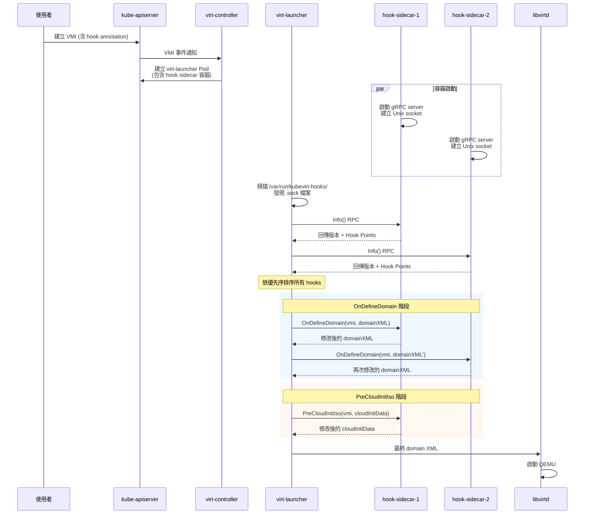

# Hook Sidecar 機制

Hook Sidecar 是 KubeVirt 提供的**可擴展攔截機制**，允許使用者在虛擬機器（VM）啟動前，透過額外的 sidecar 容器對 libvirt domain XML 或 cloud-init 配置進行自訂修改。這套機制基於 **gRPC + Unix Socket** 通訊，設計上具備版本化介面、優先序排序、以及多 hook 串聯的能力。

## 概述 — 什麼是 Hook Sidecar？

在 KubeVirt 中，VM 的啟動流程會經過多個階段：從使用者提交 `VirtualMachineInstance`（VMI）到最終 QEMU 程序啟動。Hook Sidecar 提供了兩個關鍵的**攔截點（Hook Points）**：

1. **OnDefineDomain** — 在 libvirt domain XML 定義完成後、送交 libvirtd 之前，攔截並修改 domain XML
2. **PreCloudInitIso** — 在 cloud-init ISO 映像建立之前，攔截並修改 cloud-init 資料

透過這些攔截點，使用者可以：

- 注入自訂網路配置（SLIRP、passt 等）
- 修改 CPU / 記憶體拓樸設定
- 注入 SMBIOS 韌體資訊
- 覆寫 cloud-init user-data / network-config
- 注入額外裝置（device passthrough）
- 修改磁碟映像路徑

::: tip 與 VMware 的對照
如果你熟悉 VMware，可以把 Hook Sidecar 想像成 **VMware Guest Customization Spec 的超強版**。VMware 的 Guest Customization 僅能設定網路、主機名稱等有限參數，而 KubeVirt Hook Sidecar 可以修改**整個 libvirt domain XML** — 包括 CPU 模式、裝置配置、NUMA 拓樸、韌體設定等任何 libvirt 支援的參數。
:::

## 架構與執行流程

Hook Sidecar 的運作涉及多個 KubeVirt 元件之間的協作：


### 詳細流程

以下是完整的 Hook Sidecar 執行流程：



### 流程步驟說明

| 步驟 | 動作 | 說明 |
|------|------|------|
| 1 | 使用者建立 VMI | VMI metadata 中包含 `hooks.kubevirt.io/hookSidecars` annotation |
| 2 | virt-controller 建立 Pod | 根據 annotation 解析 hook sidecar 列表，為每個 sidecar 建立容器 |
| 3 | Hook sidecar 啟動 | 每個 sidecar 啟動 gRPC server，在 `/var/run/kubevirt-hooks/` 建立 Unix socket |
| 4 | virt-launcher 發現 socket | 每 300ms 掃描一次目錄，直到收集到所有預期的 sidecar 或超時 |
| 5 | 呼叫 Info() | 對每個 socket 呼叫 `Info()` RPC，取得支援的版本與 hook points |
| 6 | OnDefineDomain | 依優先序呼叫所有註冊 `OnDefineDomain` 的 sidecar，串聯修改 domain XML |
| 7 | PreCloudInitIso | 依優先序呼叫所有註冊 `PreCloudInitIso` 的 sidecar，串聯修改 cloud-init 資料 |
| 8 | 啟動 QEMU | 將最終的 domain XML 送交 libvirtd，啟動虛擬機器 |

## Hook 版本與介面

KubeVirt 的 Hook 機制採用版本化的 gRPC 介面，目前有三個版本：

### v1alpha1 — 最初版本

僅支援 `OnDefineDomain` hook point。

```protobuf
// pkg/hooks/v1alpha1/api_v1alpha1.proto
service Callbacks {
    rpc OnDefineDomain(OnDefineDomainParams) returns (OnDefineDomainResult);
}

message OnDefineDomainParams {
    bytes domainXML = 1;     // 原始 libvirt domain XML
    bytes vmi = 2;           // VMI spec (JSON 編碼)
}

message OnDefineDomainResult {
    bytes domainXML = 1;     // 修改後的 domain XML
}
```

### v1alpha2 — 新增 Cloud-Init 支援

新增 `PreCloudInitIso` hook point，可在 cloud-init ISO 建立前修改資料。

```protobuf
// pkg/hooks/v1alpha2/api_v1alpha2.proto
service Callbacks {
    rpc OnDefineDomain(OnDefineDomainParams) returns (OnDefineDomainResult);
    rpc PreCloudInitIso(PreCloudInitIsoParams) returns (PreCloudInitIsoResult);
}

message PreCloudInitIsoParams {
    bytes cloudInitNoCloudSource = 1;  // 向後相容欄位
    bytes vmi = 2;                     // VMI spec (JSON 編碼)
    bytes cloudInitData = 3;           // cloud-init 資料 (JSON 編碼)
}

message PreCloudInitIsoResult {
    bytes cloudInitNoCloudSource = 1;  // 向後相容欄位
    bytes cloudInitData = 3;           // 修改後的 cloud-init 資料
}
```

### v1alpha3 — 新增優雅關機

新增 `Shutdown` hook point，允許 sidecar 在關閉前執行清理操作。

```protobuf
// pkg/hooks/v1alpha3/api_v1alpha3.proto
service Callbacks {
    rpc OnDefineDomain(OnDefineDomainParams) returns (OnDefineDomainResult);
    rpc PreCloudInitIso(PreCloudInitIsoParams) returns (PreCloudInitIsoResult);
    rpc Shutdown(ShutdownParams) returns (ShutdownResult);
}

message ShutdownParams {}
message ShutdownResult {}
```

### Info 服務（所有版本共用）

每個 hook sidecar 都必須實作 `Info` 服務，用於向 virt-launcher 通報自身能力：

```protobuf
// pkg/hooks/info/api_info.proto
service Info {
    rpc Info(InfoParams) returns (InfoResult);
}

message InfoParams {}

message InfoResult {
    string name = 1;                      // hook 名稱
    repeated HookPoint hookPoints = 3;    // 訂閱的 hook points
    repeated string versions = 4;         // 支援的 Callbacks 版本
}

message HookPoint {
    string name = 1;        // hook point 名稱
    int32 priority = 2;     // 優先序（數字越大越先執行）
}
```

### 版本比較

| 功能 | v1alpha1 | v1alpha2 | v1alpha3 |
|------|:--------:|:--------:|:--------:|
| OnDefineDomain | ✅ | ✅ | ✅ |
| PreCloudInitIso | ❌ | ✅ | ✅ |
| Shutdown | ❌ | ❌ | ✅ |
| CloudInitData 欄位 | N/A | ✅ | ✅ |
| 向後相容 NoCloudSource | N/A | ✅ | ✅ |

::: info 版本協商
virt-launcher 的 Hook Manager 會依序嘗試 **v1alpha3 → v1alpha2 → v1alpha1**，使用 sidecar 支援的最高版本進行通訊。建議新開發的 sidecar 至少支援 v1alpha2 以上。
:::

## Hook Points 詳解

### OnDefineDomain

`OnDefineDomain` 是最強大的 hook point，允許修改完整的 libvirt domain XML。

**輸入：**
- `vmi` — VirtualMachineInstance spec，以 JSON 編碼
- `domainXML` — 目前的 libvirt domain XML

**輸出：**
- 修改後的 `domainXML`

**逾時：** 每次呼叫 1 分鐘

**常見用途：**

| 用途 | 說明 |
|------|------|
| 網路配置 | 注入 SLIRP / passt 使用者模式網路 |
| 裝置注入 | 新增 PCI passthrough 裝置、watchdog 等 |
| CPU / 記憶體調校 | 修改 CPU 模式、NUMA 拓樸、hugepages |
| SMBIOS 設定 | 注入主機板製造商、序號等韌體資訊 |
| 磁碟設定 | 修改開機磁碟映像路徑 |
| 安全設定 | 調整 SELinux label、seccomp profile |

### PreCloudInitIso

`PreCloudInitIso` 允許在 cloud-init ISO 映像建立前修改 cloud-init 資料。

**輸入：**
- `vmi` — VirtualMachineInstance spec，以 JSON 編碼
- `cloudInitData` — CloudInitData 結構，以 JSON 編碼

**輸出：**
- 修改後的 `cloudInitData`

**逾時：** 每次呼叫 1 分鐘

**常見用途：**

| 用途 | 說明 |
|------|------|
| SSH 金鑰注入 | 動態注入 SSH 公鑰 |
| 腳本注入 | 自訂 user-data 開機腳本 |
| 網路設定 | 覆寫 cloud-init network-config |
| 套件安裝 | 注入 package 安裝指令 |

### Shutdown（v1alpha3 限定）

`Shutdown` 在 hook sidecar 即將關閉時被呼叫，允許執行清理操作。

**輸入 / 輸出：** 無參數、無回傳

**用途：** 優雅關閉、釋放資源、記錄日誌

## 內建 Hook Sidecar

KubeVirt 專案中內建了多個 hook sidecar 實作，可作為參考範例或直接使用。

### network-slirp-binding

| 項目 | 值 |
|------|-----|
| 進入點 | `cmd/sidecars/network-slirp-binding/main.go` |
| Hook Point | OnDefineDomain |
| API 版本 | v1alpha2 |
| Socket 名稱 | `slirp.sock` |

**功能說明：**

設定 SLIRP 使用者模式網路（user-mode networking）。SLIRP 不需要額外的網路權限，適合開發 / 測試環境。此 sidecar 會：

1. 解析 VMI spec 與 domain XML
2. 讀取 `/etc/resolv.conf` 取得 DNS 搜尋網域
3. 透過 `SlirpNetworkConfigurator` 修改 domain XML，注入 SLIRP 網路介面

### network-passt-binding

| 項目 | 值 |
|------|-----|
| 進入點 | `cmd/sidecars/network-passt-binding/main.go` |
| Hook Points | OnDefineDomain, Shutdown |
| API 版本 | v1alpha3 |
| Socket 名稱 | `passt.sock` |

**功能說明：**

設定 passt 使用者模式網路。passt 是比 SLIRP 更新、效能更好的方案，支援更完整的網路功能。此 sidecar 會：

1. 解析 VMI spec 與 domain XML
2. 偵測是否有 Istio sidecar 注入（`sidecar.istio.io/inject` annotation）
3. 透過 `PasstNetworkConfigurator` 修改 domain XML
4. 支援 VirtIO transitional 模式
5. 實作 `Shutdown` hook 進行優雅關機

### cloudinit sidecar

| 項目 | 值 |
|------|-----|
| 進入點 | `cmd/sidecars/cloudinit/cloudinit.go` |
| Hook Point | PreCloudInitIso |
| 類型 | 二進位檔（透過 sidecar-shim 執行） |

**功能說明：**

修改 cloud-init 配置。預設行為是將 user-data 設為 `#cloud-config\n`，可透過 annotation 自訂注入內容。

**命令列參數：**
```
preCloudInitIso --vmi <VMI_JSON> --cloud-init <CLOUDINIT_JSON>
```

### disk-mutation sidecar

| 項目 | 值 |
|------|-----|
| 進入點 | `cmd/sidecars/disk-mutation/diskimage.go` |
| Hook Point | OnDefineDomain |
| 類型 | 二進位檔（透過 sidecar-shim 執行） |
| 設定 annotation | `diskimage.vm.kubevirt.io/bootImageName` |

**功能說明：**

透過 annotation 修改開機磁碟映像路徑。讀取 `diskimage.vm.kubevirt.io/bootImageName` annotation 的值，替換 domain XML 中的開機磁碟路徑。

**命令列參數：**
```
onDefineDomain --vmi <VMI_JSON> --domain <DOMAIN_XML>
```

### smbios sidecar

| 項目 | 值 |
|------|-----|
| 進入點 | `cmd/sidecars/smbios/smbios.go` |
| Hook Point | OnDefineDomain |
| 類型 | 二進位檔（透過 sidecar-shim 執行） |
| 設定 annotation | `smbios.vm.kubevirt.io/baseBoardManufacturer` |

**功能說明：**

注入 SMBIOS 韌體表格資訊（System Management BIOS）。讀取 `smbios.vm.kubevirt.io/baseBoardManufacturer` annotation，將其設定為 domain XML 中的主機板製造商欄位。

**命令列參數：**
```
onDefineDomain --vmi <VMI_JSON> --domain <DOMAIN_XML>
```

### sidecar-shim（通用分派器）

| 項目 | 值 |
|------|-----|
| 進入點 | `cmd/sidecars/sidecar_shim.go` |
| Socket 名稱 | `shim-XXXX.sock`（隨機四字元後綴） |
| 支援版本 | v1alpha1, v1alpha2, v1alpha3 |

**功能說明：**

sidecar-shim 是一個**通用的 gRPC 橋接器**，負責將 gRPC 呼叫轉換為外部二進位檔的執行。它是 cloudinit、disk-mutation、smbios 等以二進位檔形式實作的 hook 的必要執行環境。

**運作方式：**

1. **Socket 建立** — 在 `/var/run/kubevirt-hooks/` 建立 `shim-XXXX.sock`（最多嘗試 10 次產生唯一名稱）
2. **二進位探索** — 使用 `exec.LookPath()` 在 `$PATH` 中搜尋：
   - `onDefineDomain` — OnDefineDomain hook 的二進位檔
   - `preCloudInitIso` — PreCloudInitIso hook 的二進位檔
3. **Info 回報** — 根據發現的二進位檔，動態回報支援的 hook points
4. **Hook 執行** — 收到 gRPC 呼叫時，以子程序執行對應二進位檔

**OnDefineDomain 執行方式：**
```bash
onDefineDomain --vmi '<VMI_JSON>' --domain '<DOMAIN_XML>'
# stdout → 修改後的 domain XML
```

**PreCloudInitIso 執行方式：**
```bash
preCloudInitIso --vmi '<VMI_JSON>' --cloud-init '<CLOUDINIT_JSON>'
# stdout → 修改後的 CloudInitData (JSON)
```

::: warning stderr 處理
sidecar-shim 會將二進位檔的 stderr 導向日誌系統，緩衝區上限為 512KB。請確保 hook 二進位檔的主要輸出寫入 stdout，除錯訊息寫入 stderr。
:::

## 自訂 Hook Sidecar 開發指南

### 方法一：實作完整 gRPC Server（推薦）

這是最靈活的方式，直接實作 gRPC 服務。以下是一個完整的最小範例：

```go
package main

import (
    "context"
    "encoding/json"
    "encoding/xml"
    "fmt"
    "net"
    "os"
    "os/signal"
    "syscall"

    "google.golang.org/grpc"
    v1 "kubevirt.io/api/core/v1"
    "kubevirt.io/kubevirt/pkg/hooks"
    hooksInfo "kubevirt.io/kubevirt/pkg/hooks/info"
    hooksV1alpha2 "kubevirt.io/kubevirt/pkg/hooks/v1alpha2"
)

const (
    socketName = "my-custom-hook.sock"
    hookName   = "my-custom-hook"
)

// InfoServer 實作 Info 服務
type InfoServer struct {
    hooksInfo.UnimplementedInfoServer
}

func (s *InfoServer) Info(ctx context.Context, params *hooksInfo.InfoParams) (*hooksInfo.InfoResult, error) {
    return &hooksInfo.InfoResult{
        Name: hookName,
        Versions: []string{
            hooksV1alpha2.Version,
        },
        HookPoints: []*hooksInfo.HookPoint{
            {
                Name:     hooksInfo.OnDefineDomainHookPointName,
                Priority: 0,
            },
        },
    }, nil
}

// CallbackServer 實作 v1alpha2 Callbacks 服務
type CallbackServer struct {
    hooksV1alpha2.UnimplementedCallbacksServer
}

func (s *CallbackServer) OnDefineDomain(
    ctx context.Context,
    params *hooksV1alpha2.OnDefineDomainParams,
) (*hooksV1alpha2.OnDefineDomainResult, error) {
    // 1. 解析 VMI
    vmi := &v1.VirtualMachineInstance{}
    if err := json.Unmarshal(params.Vmi, vmi); err != nil {
        return nil, fmt.Errorf("failed to unmarshal VMI: %v", err)
    }

    // 2. 修改 domain XML（此處僅為範例，實際邏輯依需求而定）
    domainXML := params.DomainXML

    // 3. 回傳修改後的 XML
    return &hooksV1alpha2.OnDefineDomainResult{
        DomainXML: domainXML,
    }, nil
}

func (s *CallbackServer) PreCloudInitIso(
    ctx context.Context,
    params *hooksV1alpha2.PreCloudInitIsoParams,
) (*hooksV1alpha2.PreCloudInitIsoResult, error) {
    return &hooksV1alpha2.PreCloudInitIsoResult{
        CloudInitData: params.CloudInitData,
    }, nil
}

func main() {
    socketPath := hooks.HookSocketsSharedDirectory + "/" + socketName

    socket, err := net.Listen("unix", socketPath)
    if err != nil {
        panic(err)
    }
    defer os.Remove(socketPath)

    server := grpc.NewServer()
    hooksInfo.RegisterInfoServer(server, &InfoServer{})
    hooksV1alpha2.RegisterCallbacksServer(server, &CallbackServer{})

    // 優雅關機
    sigCh := make(chan os.Signal, 1)
    signal.Notify(sigCh, syscall.SIGINT, syscall.SIGTERM)
    go func() {
        <-sigCh
        server.GracefulStop()
    }()

    fmt.Printf("Starting hook sidecar on %s\n", socketPath)
    if err := server.Serve(socket); err != nil {
        panic(err)
    }
}
```

### 方法二：透過 sidecar-shim 使用二進位檔

這是較簡單的方式，只需撰寫一個命令列工具，由 sidecar-shim 負責 gRPC 通訊。

**步驟：**

1. 撰寫名為 `onDefineDomain` 或 `preCloudInitIso` 的可執行檔
2. 將其放入容器映像的 `$PATH` 中
3. 使用 sidecar-shim 作為容器的 entrypoint

```bash
#!/bin/bash
# /usr/bin/onDefineDomain — 簡易 shell hook 範例
# 接收 --vmi 和 --domain 參數
# 將修改後的 domain XML 寫入 stdout

while [[ $# -gt 0 ]]; do
    case $1 in
        --vmi) VMI_JSON="$2"; shift 2 ;;
        --domain) DOMAIN_XML="$2"; shift 2 ;;
        *) shift ;;
    esac
done

# 此處可對 DOMAIN_XML 進行修改
# 範例：直接回傳原始 XML（不做修改）
echo "$DOMAIN_XML"
```

**Dockerfile 範例：**
```dockerfile
FROM registry.access.redhat.com/ubi9/ubi-minimal:latest

COPY onDefineDomain /usr/bin/onDefineDomain
RUN chmod +x /usr/bin/onDefineDomain

# sidecar-shim 由 KubeVirt 映像提供
ENTRYPOINT ["/usr/bin/sidecar-shim", "--version", "v1alpha2"]
```

### 開發建議

::: tip 最佳實踐
1. **版本選擇** — 新開發的 sidecar 建議使用 v1alpha2 或 v1alpha3
2. **冪等性** — hook 應具備冪等性，避免重複修改造成非預期結果
3. **錯誤處理** — 回傳 gRPC 錯誤會阻止 VM 啟動，務必妥善處理
4. **逾時控制** — 每次 hook 呼叫有 1 分鐘逾時限制，避免長時間操作
5. **日誌記錄** — 使用 stderr 輸出除錯日誌，stdout 僅用於回傳結果
:::

## 使用方式 — YAML 範例

### 基本用法：使用自訂容器映像

```yaml
apiVersion: kubevirt.io/v1
kind: VirtualMachineInstance
metadata:
  name: my-vmi
  annotations:
    hooks.kubevirt.io/hookSidecars: |
      [
        {
          "image": "myregistry/my-hook-sidecar:latest",
          "imagePullPolicy": "IfNotPresent"
        }
      ]
spec:
  domain:
    resources:
      requests:
        memory: "1Gi"
    devices:
      disks:
        - name: rootdisk
          disk:
            bus: virtio
  volumes:
    - name: rootdisk
      containerDisk:
        image: quay.io/kubevirt/fedora-cloud-container-disk-demo:latest
```

### 指定啟動命令與參數

```yaml
annotations:
  hooks.kubevirt.io/hookSidecars: |
    [
      {
        "image": "myregistry/my-hook:v1.0",
        "command": ["/usr/bin/my-hook"],
        "args": ["--version", "v1alpha2", "--config", "/etc/hook/config.yaml"],
        "imagePullPolicy": "Always"
      }
    ]
```

### 透過 ConfigMap 注入 Hook 腳本

無需建立自訂容器映像，直接透過 ConfigMap 注入 hook 二進位檔：

```yaml
apiVersion: v1
kind: ConfigMap
metadata:
  name: my-hook-script
data:
  my_hook.sh: |
    #!/bin/bash
    # 接收 --vmi 和 --domain 參數
    while [[ $# -gt 0 ]]; do
        case $1 in
            --vmi) VMI_JSON="$2"; shift 2 ;;
            --domain) DOMAIN_XML="$2"; shift 2 ;;
            *) shift ;;
        esac
    done
    echo "$DOMAIN_XML"
---
apiVersion: kubevirt.io/v1
kind: VirtualMachineInstance
metadata:
  name: vmi-with-configmap-hook
  annotations:
    hooks.kubevirt.io/hookSidecars: |
      [
        {
          "args": ["--version", "v1alpha2"],
          "configMap": {
            "name": "my-hook-script",
            "key": "my_hook.sh",
            "hookPath": "/usr/bin/onDefineDomain"
          }
        }
      ]
spec:
  domain:
    resources:
      requests:
        memory: "1Gi"
    devices: {}
```

### 多個 Hook Sidecar 同時使用

```yaml
annotations:
  hooks.kubevirt.io/hookSidecars: |
    [
      {
        "image": "myregistry/smbios-hook:latest",
        "imagePullPolicy": "IfNotPresent"
      },
      {
        "image": "myregistry/network-hook:latest",
        "imagePullPolicy": "IfNotPresent"
      },
      {
        "args": ["--version", "v1alpha2"],
        "configMap": {
          "name": "security-hook",
          "key": "hook.sh",
          "hookPath": "/usr/bin/onDefineDomain"
        }
      }
    ]
```

### 搭配 PVC 掛載

```yaml
annotations:
  hooks.kubevirt.io/hookSidecars: |
    [
      {
        "image": "myregistry/data-hook:latest",
        "pvc": {
          "name": "hook-data-pvc",
          "volumePath": "/data",
          "sharedComputePath": "/var/run/hook-data"
        }
      }
    ]
```

### 搭配自訂 Annotation 的 SMBIOS 範例

```yaml
apiVersion: kubevirt.io/v1
kind: VirtualMachineInstance
metadata:
  name: vmi-with-smbios
  annotations:
    hooks.kubevirt.io/hookSidecars: |
      [
        {
          "image": "registry:5000/kubevirt/smbios-hook-sidecar:devel",
          "imagePullPolicy": "IfNotPresent"
        }
      ]
    smbios.vm.kubevirt.io/baseBoardManufacturer: "My Company Inc."
spec:
  domain:
    resources:
      requests:
        memory: "1Gi"
    devices:
      disks:
        - name: rootdisk
          disk:
            bus: virtio
  volumes:
    - name: rootdisk
      containerDisk:
        image: quay.io/kubevirt/fedora-cloud-container-disk-demo:latest
```

## Socket 發現機制

virt-launcher 中的 **Hook Manager**（`pkg/hooks/manager.go`）負責 socket 的發現與管理。

### 發現流程

```
/var/run/kubevirt-hooks/          ← 共用目錄
├── <sidecar-1-subdir>/
│   └── <name>.sock              ← sidecar 1 的 Unix socket
├── <sidecar-2-subdir>/
│   └── <name>.sock              ← sidecar 2 的 Unix socket
├── slirp.sock                   ← 直接在根目錄的 socket 也被偵測
├── passt.sock
└── shim-a1b2.sock
```

### 發現邏輯

1. **目錄掃描** — 使用 `os.ReadDir()` 讀取 `/var/run/kubevirt-hooks/` 基礎目錄
2. **子目錄遍歷** — 對每個子目錄，讀取其中的非目錄檔案（socket 檔）
3. **Socket 連線** — 對每個 `.sock` 檔案嘗試以 Unix socket 方式連線（1 秒逾時）
4. **Info 查詢** — 連線成功後呼叫 `Info()` RPC 取得 sidecar 資訊
5. **版本協商** — 依序嘗試 v1alpha3 → v1alpha2 → v1alpha1，選擇最高相容版本
6. **輪詢等待** — 每 300ms 掃描一次，直到收集齊所有預期的 sidecar 數量或超時

### 優先序排序

Hook Manager 收集所有 sidecar 的 hook point 訂閱後，會進行排序：

1. **優先序遞減** — priority 數字越大，越先執行
2. **名稱遞增** — priority 相同時，按 hook 名稱字母順序排列
3. **串聯執行** — 前一個 hook 的輸出作為下一個 hook 的輸入

::: warning 注意
所有訂閱同一個 hook point 的 sidecar 會**依序串聯執行**，而非平行執行。第一個 hook 的修改結果會傳遞給第二個 hook，以此類推。請注意 hook 之間的互動可能影響最終結果。
:::

## 疑難排解

### Hook Sidecar 未被發現

**症狀：** VM 啟動超時，日誌顯示等待 hook sidecar

**排查步驟：**
1. 確認 sidecar 容器正在運行：
   ```bash
   kubectl get pod <virt-launcher-pod> -o jsonpath='{.status.containerStatuses}'
   ```
2. 檢查 socket 是否已建立：
   ```bash
   kubectl exec <virt-launcher-pod> -c compute -- ls -la /var/run/kubevirt-hooks/
   ```
3. 確認 sidecar 日誌無錯誤：
   ```bash
   kubectl logs <virt-launcher-pod> -c hook-sidecar-0
   ```

### Domain XML 被拒絕

**症狀：** VM 建立失敗，錯誤訊息指向 libvirt domain XML 格式錯誤

**排查步驟：**
1. 檢查 hook sidecar 回傳的 XML 是否格式正確
2. 使用 `virt-xml-validate` 驗證修改後的 XML
3. 確認沒有破壞必要的 XML 元素結構

::: danger 常見錯誤
修改 domain XML 時，切勿移除 KubeVirt 自動產生的必要元素（如 `<devices>` 中的 virtio-serial、`<channel>` 等），否則會導致 VM 無法正常運作。
:::

### 逾時錯誤

**症狀：** 日誌顯示 `context deadline exceeded` 或 hook 呼叫逾時

**解決方式：**
- 每次 hook 呼叫有 **1 分鐘**的硬性逾時限制
- 優化 hook 邏輯，避免在 hook 中進行網路存取或耗時操作
- 如有外部依賴，加入重試機制與合理的子逾時

### 權限錯誤

**症狀：** Socket 建立失敗或連線被拒

**解決方式：**
- 確認 sidecar 容器有寫入 `/var/run/kubevirt-hooks/` 的權限
- 檢查 SecurityContext 設定是否過於嚴格
- 確保 `emptyDir` volume 正確掛載於所有容器

### sidecar-shim 找不到二進位檔

**症狀：** Info() 回傳空的 hook points

**解決方式：**
- 確認二進位檔名稱正確：`onDefineDomain` 或 `preCloudInitIso`
- 確認二進位檔在容器的 `$PATH` 中
- 確認二進位檔有可執行權限（`chmod +x`）

## VMware 對照

對於從 VMware 環境遷移到 KubeVirt 的使用者，以下表格對照了兩者的功能對應：

| VMware 功能 | KubeVirt Hook 對應 | 說明 |
|-------------|-------------------|------|
| **Guest Customization Spec** | `PreCloudInitIso` | VMware 可自訂 hostname、網路、DNS；KubeVirt 透過 cloud-init hook 實現類似功能，但更靈活 |
| **VM Advanced Settings** | `OnDefineDomain` | VMware 的 `.vmx` 進階參數 ≈ KubeVirt 的 domain XML 修改 |
| **Host Profiles** | `OnDefineDomain` | VMware Host Profile 集中管理主機設定；KubeVirt 可透過 hook 統一調整 VM 的主機級設定 |
| **PowerCLI 自動化腳本** | 自訂 Hook Sidecar | VMware 用 PowerCLI 批次管理；KubeVirt 用 hook sidecar 在啟動流程中注入邏輯 |
| **SMBIOS 設定** | smbios sidecar | VMware 可在 `.vmx` 設定 SMBIOS；KubeVirt 使用專用 hook sidecar |
| **vApp Properties** | `PreCloudInitIso` | VMware vApp OVF properties ≈ cloud-init user-data 注入 |

::: info 關鍵差異
VMware 的自訂機制主要是**聲明式配置**（在 vSphere UI 或 API 中設定參數），而 KubeVirt 的 Hook Sidecar 是**程式化攔截**（在啟動流程中執行自訂程式碼）。後者的靈活度遠超前者，但也需要更多的開發投入。
:::

## 相關資源

- [virt-launcher 元件](/kubevirt/components/virt-launcher) — Hook Sidecar 的宿主 Pod
- [virt-controller 元件](/kubevirt/components/virt-controller) — 負責建立包含 hook sidecar 的 Pod
- [KubeVirt 架構概覽](/kubevirt/architecture/overview) — 了解完整的元件互動
