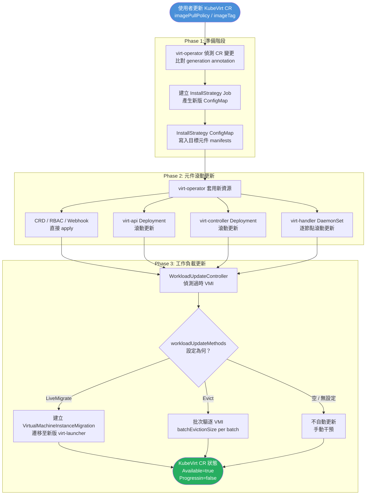
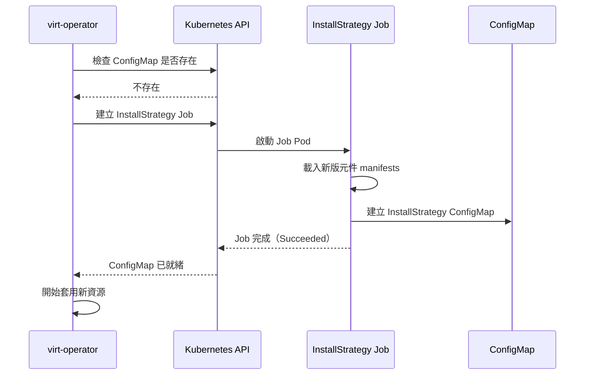
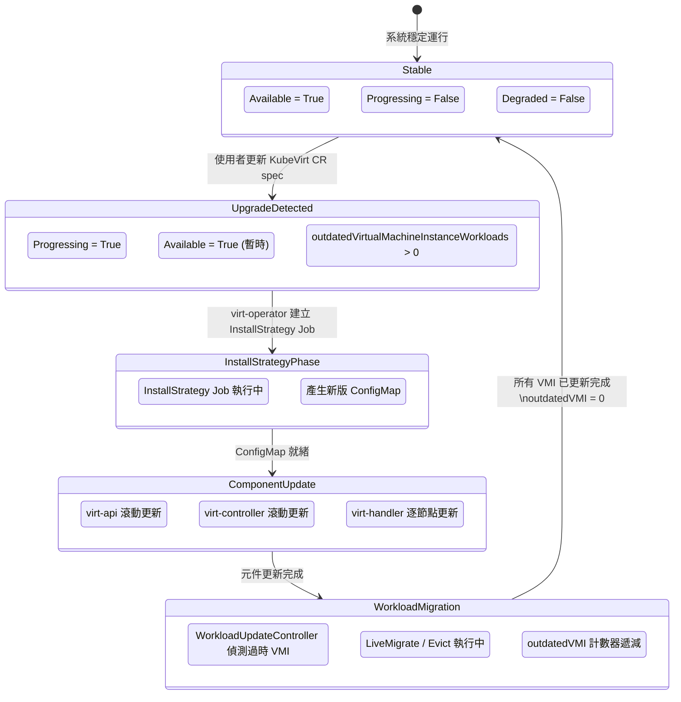
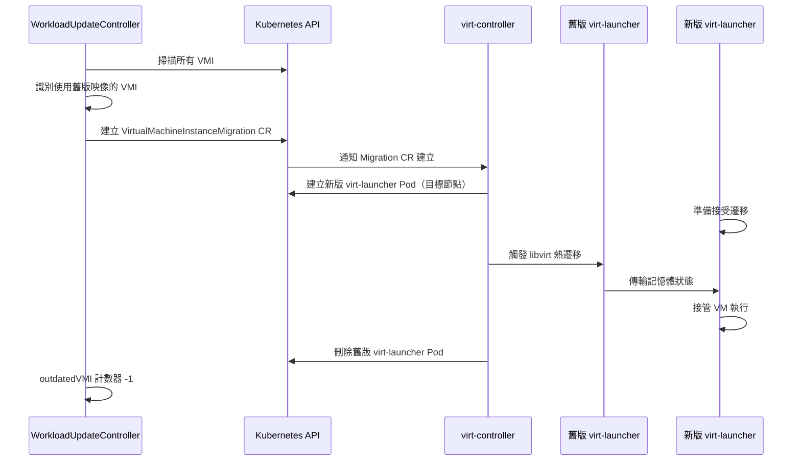
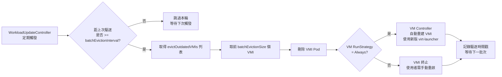
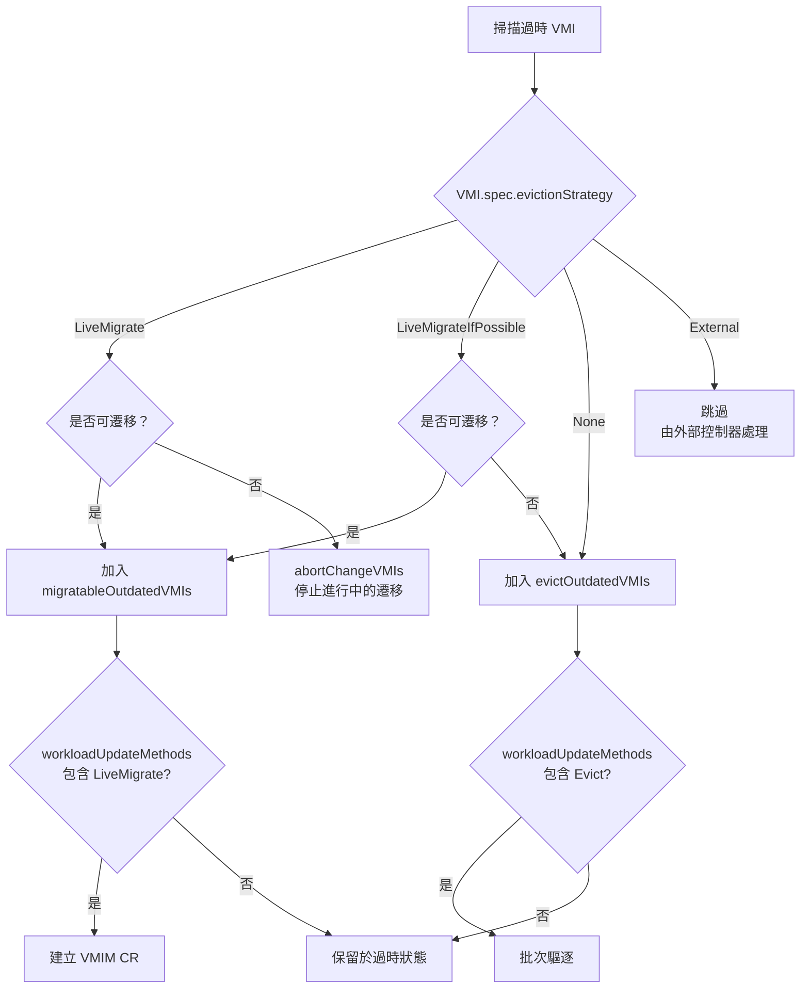
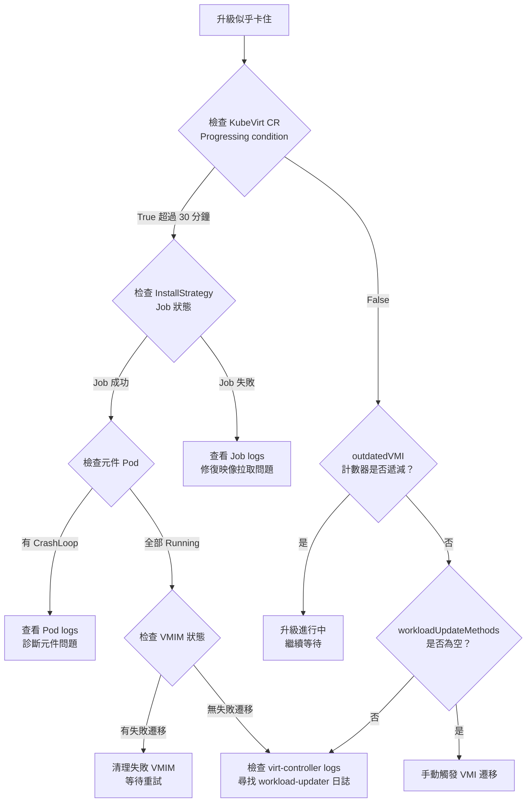
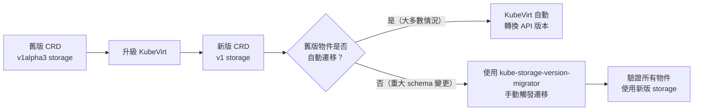

# KubeVirt 升級策略與機制深入剖析

::: info 本章導讀
KubeVirt 的升級不僅涉及控制平面元件的更新，還需要妥善處理已在運行中的虛擬機工作負載。本章將從原始碼層面深入解析 virt-operator 的升級機制、WorkloadUpdateController 的批次更新邏輯、以及三種工作負載更新策略（LiveMigrate、Evict、手動）的實作細節，幫助讀者制定零停機的生產升級計畫。
:::

::: info 相關章節
- [virt-operator 核心機制](/kubevirt/components/virt-operator)
- [Live Migration 進階功能](/kubevirt/advanced/live-migration)
- [VM 生命週期流程](/kubevirt/architecture/lifecycle)
:::

---

## 1. 升級流程架構總覽

KubeVirt 的升級流程分為三個主要階段：**控制平面準備**、**元件滾動更新**、以及**工作負載遷移**。整個流程由 virt-operator 統一協調，並透過 KubeVirt CR 的狀態欄位對外公開進度。



---

## 2. virt-operator 升級機制

### 2.1 監聽 KubeVirt CR 變更

virt-operator 透過 Kubernetes Informer 機制持續監聽 KubeVirt CR（`kubevirt.io/v1/KubeVirt`）的變更。當使用者更新 CR 的映像標籤（imageTag）或相關設定時，virt-operator 的 reconcile loop 會被觸發。

virt-operator 透過比對以下資訊判斷是否需要升級：

| 比對項目 | 說明 |
|----------|------|
| `spec.imageTag` | 目標版本標籤，例如 `v1.3.0` |
| `spec.imageRegistry` | 映像倉庫位址 |
| `metadata.generation` | Kubernetes 自動遞增，每次 spec 變更 +1 |
| InstallStrategy ConfigMap | 記錄已安裝的策略版本 |

### 2.2 InstallStrategy ConfigMap

`InstallStrategy` 是 KubeVirt 升級機制的核心設計。它是一個 ConfigMap，儲存了目標版本所有元件的完整 manifest 宣告（Deployment、DaemonSet、RBAC、CRD、Webhook 等）。

```
kubevirt-install-strategy-<hash>
```

ConfigMap 的資料結構示意：

```yaml
apiVersion: v1
kind: ConfigMap
metadata:
  name: kubevirt-install-strategy-abc123
  namespace: kubevirt
  labels:
    kubevirt.io/install-strategy: ""
data:
  manifests: |
    # 包含所有目標元件的完整 YAML manifests
    # virt-api Deployment
    # virt-controller Deployment
    # virt-handler DaemonSet
    # RBAC rules
    # CRD definitions
    # Webhook configurations
```

### 2.3 InstallStrategy Job

當 virt-operator 發現目前不存在對應版本的 InstallStrategy ConfigMap 時，會建立一個**短命 Job**（short-lived Job）來產生該 ConfigMap。



此 Job 使用新版的 `virt-operator` 映像執行，確保產生的 manifest 與目標版本完全一致。

### 2.4 元件更新策略

virt-operator 對不同類型的資源採用不同的更新方式：

| 資源類型 | 更新方式 | 說明 |
|----------|----------|------|
| **CRD** | 直接 apply | 新增欄位、更新驗證規則 |
| **RBAC**（ClusterRole 等） | 直接 apply | 立即生效，無中斷 |
| **ValidatingWebhookConfiguration** | 直接 apply | 需注意短暫驗證不一致 |
| **virt-api Deployment** | 滾動更新 | `RollingUpdate` strategy |
| **virt-controller Deployment** | 滾動更新 | `RollingUpdate` strategy |
| **virt-handler DaemonSet** | 滾動更新 | 逐節點替換，`maxUnavailable` 控制 |

### 2.5 Generation Annotation 追蹤

virt-operator 在每個管理的資源上標記 `kubevirt.io/generation` annotation，記錄該資源對應的 KubeVirt CR generation。這使得 virt-operator 能夠：

1. 判斷哪些資源已是最新版本
2. 識別需要更新的資源
3. 避免重複套用已是最新的資源

### 2.6 升級狀態 Conditions

升級過程中，KubeVirt CR 的 `status.conditions` 會反映當前狀態：

| Condition | 升級中的值 | 說明 |
|-----------|-----------|------|
| `Available` | `False` → `True` | 服務是否可用 |
| `Progressing` | `True` → `False` | 是否正在進行升級 |
| `Degraded` | 視情況 | 是否有元件異常 |

---

## 3. KubeVirt CR 升級狀態轉換

升級過程中，KubeVirt CR 的狀態會經歷一系列轉換。以下狀態圖描述了完整的轉換流程：



### 3.1 `outdatedVirtualMachineInstanceWorkloads` 計數器

這個計數器位於 `status.outdatedVirtualMachineInstanceWorkloads`，記錄仍在使用舊版 virt-launcher 映像的 VMI 數量。監控此計數器是追蹤工作負載升級進度的最直接方式。

```bash
# 監控升級進度
kubectl get kv kubevirt -n kubevirt -o jsonpath='{.status.outdatedVirtualMachineInstanceWorkloads}'
```

---

## 4. 工作負載更新策略（WorkloadUpdateStrategy）

`WorkloadUpdateStrategy` 定義了 KubeVirt 如何處理已在運行中的 VMI。這是升級過程中最關鍵的設定，直接影響虛擬機的可用性。

### 4.1 無中斷更新（LiveMigrate）

LiveMigrate 是最理想的更新方式，能在不中斷虛擬機服務的情況下完成版本更新。

**運作原理：**



**遷移資格判定：**

WorkloadUpdateController 在 `migratableOutdatedVMIs` 中收集符合遷移條件的 VMI，必須滿足：

- VMI 的 `spec.evictionStrategy` 為 `LiveMigrate` 或 `LiveMigrateIfPossible`
- VMI 狀態為 `Running`（非 Paused、非 Migrating）
- 叢集中有可用的目標節點
- VMI 使用的儲存支援熱遷移（非 `hostPath`、非共享非必要）

**批次控制（Rate Limiting）：**

```go
// pkg/virt-controller/watch/workload-updater/workload-updater.go
const (
    defaultBatchDeletionIntervalSeconds = 60
    defaultBatchDeletionCount           = 10
    periodicReEnqueueIntervalSeconds    = 30
)
```

WorkloadUpdateController 每 `periodicReEnqueueIntervalSeconds`（30 秒）重新評估一次，但實際批次操作受 `batchEvictionInterval` 控制，避免同時遷移過多 VMI 影響叢集效能。

### 4.2 驅逐更新（Evict）

對於無法進行熱遷移的 VMI，`Evict` 策略會強制刪除 VMI Pod，觸發 VM 重新啟動。

**運作原理：**

`evictOutdatedVMIs` 收集需要驅逐的 VMI 列表。符合驅逐條件的 VMI 包括：

- `evictionStrategy: None` 的 VMI
- 不支援熱遷移的 VMI（特殊硬體直通等）
- 使用者明確設定僅允許 Evict 的情況

**批次驅逐流程：**



**重要提示：** Evict 策略會造成短暫停機。對於 `RunStrategy: Always` 的 VM，停機時間取決於 VM 冷啟動時間（通常數十秒）。

### 4.3 手動更新（不設定 workloadUpdateMethods）

當 `workloadUpdateMethods` 為空列表時，WorkloadUpdateController 不會自動干預任何 VMI。

**適用場景：**
- 生產環境需要人工審核每個 VM 的遷移時機
- 某些 VM 有嚴格的維護窗口限制
- 需要在升級前進行充分測試

**監控方式：**

```bash
# 查看需要手動更新的 VMI 數量
kubectl get kv kubevirt -n kubevirt -o yaml | grep outdatedVirtualMachineInstance

# 列出所有使用舊版 virt-launcher 的 VMI
kubectl get vmi -A -o json | jq '.items[] | select(.status.migrationState == null) | .metadata.name'
```

使用者需手動觸發遷移或重啟每個 VMI：

```bash
# 手動觸發特定 VMI 的熱遷移
virtctl migrate <vm-name> -n <namespace>

# 或重啟 VM（會短暫停機）
virtctl restart <vm-name> -n <namespace>
```

### 4.4 三種策略比較

| 比較項目 | LiveMigrate | Evict | 手動更新 |
|----------|-------------|-------|---------|
| **服務中斷** | 無（零停機） | 短暫中斷（秒級） | 取決於手動操作時機 |
| **自動化程度** | 全自動 | 全自動 | 完全手動 |
| **適用 VM 類型** | 支援熱遷移的 VM | 所有 VM | 所有 VM |
| **速度** | 較慢（受網路頻寬限制） | 快（冷重啟） | 最慢（需人工介入） |
| **風險** | 低（遷移失敗可重試） | 中（短暫停機） | 低（完全掌控） |
| **生產推薦** | ✅ 最推薦 | ⚠️ 非關鍵 VM | ✅ 高管制環境 |

---

## 5. EvictionStrategy 與升級的關係

`spec.evictionStrategy` 設定在個別 VMI 或 VM 物件上，定義當 Kubernetes 需要「驅逐」（Evict）該 VMI 時的行為。這個設定與 `WorkloadUpdateStrategy` 緊密配合。

### 5.1 EvictionStrategy 選項說明

| 策略值 | 行為 | 適用場景 |
|--------|------|---------|
| `LiveMigrate` | 收到驅逐請求時，發起熱遷移；遷移失敗則阻止驅逐 | 關鍵服務 VM，不允許停機 |
| `LiveMigrateIfPossible` | 嘗試熱遷移；如果無法遷移（例如不支援），允許直接終止 | 一般生產 VM，盡量無停機 |
| `External` | 將驅逐決策委派給外部控制器（例如 Node Maintenance Operator） | 與 NMO 整合的場景 |
| `None` | 立即終止 VMI，不嘗試遷移 | 無狀態或可快速重建的 VM |

### 5.2 EvictionStrategy 如何影響工作負載更新

WorkloadUpdateController 使用 VMI 的 `evictionStrategy` 來決定將該 VMI 分類到哪個更新桶中：



### 5.3 全域預設 EvictionStrategy

除了在個別 VMI 上設定，也可以在 KubeVirt CR 層級設定全域預設值：

```yaml
apiVersion: kubevirt.io/v1
kind: KubeVirt
metadata:
  name: kubevirt
spec:
  configuration:
    evictionStrategy: LiveMigrateIfPossible
```

此全域設定會作為所有未明確設定 `evictionStrategy` 的 VMI 的預設值。建議生產環境設為 `LiveMigrateIfPossible`，在追求零停機的同時保留對不支援遷移 VM 的容錯處理。

---

## 6. 零停機升級最佳實踐

### 6.1 升級前檢查清單

在執行升級前，應完成以下檢查：

**叢集健康狀態確認：**
```bash
# 1. 確認所有 KubeVirt 元件正常運行
kubectl get pods -n kubevirt

# 2. 確認 KubeVirt CR 狀態正常
kubectl get kv kubevirt -n kubevirt -o yaml | grep -A 20 "status:"

# 3. 確認所有 VMI 處於 Running 狀態
kubectl get vmi -A | grep -v Running

# 4. 確認無進行中的遷移
kubectl get vmim -A

# 5. 確認節點資源充足（用於接收遷移目標 Pod）
kubectl describe nodes | grep -A 5 "Allocated resources"
```

**熱遷移能力確認：**
```bash
# 確認儲存類型支援熱遷移（需支援 ReadWriteMany 或 Block 模式）
kubectl get pvc -A -o custom-columns='NAME:.metadata.name,ACCESS:.spec.accessModes,STORAGECLASS:.spec.storageClassName'
```

### 6.2 推薦的生產環境設定

```yaml
apiVersion: kubevirt.io/v1
kind: KubeVirt
metadata:
  name: kubevirt
  namespace: kubevirt
spec:
  imagePullPolicy: IfNotPresent
  workloadUpdateStrategy:
    # 優先使用熱遷移，其次驅逐
    workloadUpdateMethods:
      - LiveMigrate
      - Evict
    # 每批次間隔 60 秒，避免同時遷移過多 VM
    batchEvictionInterval: "1m"
    # 每批次最多 10 個 VMI
    batchEvictionSize: 10
  configuration:
    # 全域預設：盡量熱遷移，無法則接受停機
    evictionStrategy: LiveMigrateIfPossible
    # 遷移設定
    migrations:
      # 最大並行遷移數（預設 5）
      parallelMigrationsPerCluster: 5
      # 每個節點最大並行遷移數（預設 2）
      parallelOutboundMigrationsPerNode: 2
      # 遷移頻寬限制（避免影響生產流量）
      bandwidthPerMigration: "64Mi"
```

### 6.3 監控升級進度

```bash
# 持續監控升級進度
watch -n 10 'kubectl get kv kubevirt -n kubevirt -o jsonpath="{.status}" | python3 -m json.tool'

# 監控關鍵指標
kubectl get kv kubevirt -n kubevirt -o jsonpath='{
  "Available: "}{.status.conditions[?(@.type=="Available")].status}{"\n"
  "Progressing: "}{.status.conditions[?(@.type=="Progressing")].status}{"\n"
  "Degraded: "}{.status.conditions[?(@.type=="Degraded")].status}{"\n"
  "OutdatedVMIs: "}{.status.outdatedVirtualMachineInstanceWorkloads}{"\n"
}'

# 監控 VMI 遷移狀態
kubectl get vmim -A -w
```

### 6.4 升級時間估算

升級完成時間取決於以下因素：

| 因素 | 影響 |
|------|------|
| VMI 數量 | 線性影響總時間 |
| `batchEvictionSize` | 每批處理的 VMI 數 |
| `batchEvictionInterval` | 批次間的等待時間 |
| VM 記憶體大小 | 影響每次遷移耗時 |
| 網路頻寬 | 影響遷移速度 |

**估算公式（僅供參考）：**

```
總時間 ≈ (VMI 總數 / batchEvictionSize) × batchEvictionInterval
       + 每個 VMI 平均遷移時間
```

例如：100 個 VMI，batchSize=10，interval=60s，每個遷移耗時 30s：
```
批次數 = 100 / 10 = 10 批
等待時間 = 10 × 60s = 600s
遷移時間 = 10 × 30s = 300s（並行執行）
總估計時間 ≈ 15 分鐘
```

### 6.5 回滾考量

::: info 重要提示
KubeVirt **不支援**自動回滾。一旦升級開始，必須手動干預才能回到舊版本。在生產環境升級前，務必確認：
- 已在測試環境驗證新版本
- 有詳細的回滾操作步驟
- 已通知相關人員升級窗口
:::

---

## 7. 升級配置範例

### 7.1 完整 KubeVirt CR 設定範例

```yaml
apiVersion: kubevirt.io/v1
kind: KubeVirt
metadata:
  name: kubevirt
  namespace: kubevirt
spec:
  # 映像設定
  imagePullPolicy: IfNotPresent
  # imageTag: v1.3.0  # 指定版本，留空則使用 operator 預設版本

  # 工作負載更新策略
  workloadUpdateStrategy:
    workloadUpdateMethods:
      - LiveMigrate   # 優先嘗試熱遷移
      - Evict         # 無法遷移則驅逐重啟
    batchEvictionInterval: "1m"   # 每批次間隔 60 秒
    batchEvictionSize: 10          # 每批次最多 10 個 VMI

  # 全域設定
  configuration:
    # VMI 驅逐策略預設值
    evictionStrategy: LiveMigrateIfPossible

    # 熱遷移參數調整
    migrations:
      parallelMigrationsPerCluster: 5
      parallelOutboundMigrationsPerNode: 2
      bandwidthPerMigration: "64Mi"
      completionTimeoutPerGiB: 800       # 每 GiB 記憶體的遷移逾時（秒）
      progressTimeout: 150               # 遷移停滯判定超時（秒）

    # 開發模式功能閘控（生產環境謹慎使用）
    # developerConfiguration:
    #   featureGates:
    #     - LiveMigration
    #     - HotplugVolumes
```

### 7.2 高安全管制環境（純手動更新）

```yaml
apiVersion: kubevirt.io/v1
kind: KubeVirt
metadata:
  name: kubevirt
  namespace: kubevirt
spec:
  workloadUpdateStrategy:
    # 空列表 = 不自動更新任何工作負載
    workloadUpdateMethods: []
  configuration:
    evictionStrategy: None   # 所有 VMI 需手動管理
```

### 7.3 快速更新設定（開發/測試環境）

```yaml
apiVersion: kubevirt.io/v1
kind: KubeVirt
metadata:
  name: kubevirt
  namespace: kubevirt
spec:
  workloadUpdateStrategy:
    workloadUpdateMethods:
      - Evict     # 只使用驅逐，速度最快
    batchEvictionInterval: "10s"   # 每 10 秒一批
    batchEvictionSize: 50           # 每批最多 50 個
  configuration:
    evictionStrategy: None
```

---

## 8. 升級失敗與復原

### 8.1 常見失敗場景與診斷

**場景一：InstallStrategy Job 失敗**

```bash
# 檢查 InstallStrategy Job 狀態
kubectl get jobs -n kubevirt | grep install-strategy

# 查看 Job 日誌
kubectl logs -n kubevirt job/kubevirt-install-strategy-xxx

# 常見原因：映像拉取失敗、RBAC 權限不足
```

**場景二：元件 Pod 升級後 CrashLoopBackOff**

```bash
# 檢查 Pod 狀態
kubectl get pods -n kubevirt

# 查看失敗 Pod 的日誌
kubectl logs -n kubevirt <pod-name> --previous

# 查看詳細事件
kubectl describe pod -n kubevirt <pod-name>
```

**場景三：遷移失敗阻塞升級進度**

```bash
# 查看失敗的遷移
kubectl get vmim -A -o yaml | grep -A 5 "phase: Failed"

# 查看遷移詳細原因
kubectl describe vmim <migration-name> -n <namespace>

# 手動清理失敗的遷移，允許重試
kubectl delete vmim <migration-name> -n <namespace>
```

### 8.2 解讀 KubeVirt CR 狀態輸出

```bash
kubectl get kv kubevirt -n kubevirt -o yaml
```

關鍵欄位解讀：

```yaml
status:
  # 操作版本（已安裝的版本）
  operatorVersion: v1.3.0
  # 目標版本（期望達到的版本）
  targetKubeVirtVersion: v1.4.0
  # 過時 VMI 數量（升級進度指標）
  outdatedVirtualMachineInstanceWorkloads: 15

  conditions:
    - type: Available
      status: "False"    # 升級期間可能短暫 False
      reason: "Progressing"
      message: "KubeVirt is currently being updated"

    - type: Progressing
      status: "True"     # 升級進行中
      reason: "OperatorDeploying"
      message: "Deploying operator components"

    - type: Degraded
      status: "False"    # 若為 True，表示有嚴重問題
```

### 8.3 強制重置升級（危險操作）

::: warning 注意
以下操作會造成 KubeVirt 短暫不可用，僅在確認升級卡住且無其他方法時使用。
:::

```bash
# 方法一：重啟 virt-operator
kubectl rollout restart deployment/virt-operator -n kubevirt

# 方法二：刪除卡住的 InstallStrategy Job
kubectl delete job -n kubevirt -l kubevirt.io/install-strategy

# 方法三（最後手段）：刪除並重建 KubeVirt CR
# 警告：這會觸發完整重新安裝，請確保理解影響
kubectl get kv kubevirt -n kubevirt -o yaml > kubevirt-backup.yaml
kubectl delete kv kubevirt -n kubevirt
# 等待所有資源清理完成後
kubectl apply -f kubevirt-backup.yaml
```

### 8.4 升級診斷流程圖



---

## 9. 版本相容性與 API 穩定性

### 9.1 KubeVirt 版本規範

KubeVirt 遵循語意化版本規範（Semantic Versioning）：

```
v{MAJOR}.{MINOR}.{PATCH}
例如：v1.3.0
```

| 版本類型 | 規則 | 範例 |
|----------|------|------|
| **MAJOR** | 重大 API 破壞性變更 | v1 → v2 |
| **MINOR** | 新功能，向下相容 | v1.2 → v1.3 |
| **PATCH** | 錯誤修復 | v1.3.0 → v1.3.1 |

**發布週期：** KubeVirt 大約每 3 個月發布一個 minor 版本，與 Kubernetes 的發布週期相近。

### 9.2 支援的升級路徑

::: warning 升級限制
KubeVirt **僅支援單次 minor 版本升級**。例如：
- ✅ `v1.2.x` → `v1.3.x`（允許）
- ❌ `v1.2.x` → `v1.4.x`（不允許，需先升至 v1.3）
:::

升級前應確認支援矩陣：

```bash
# 確認當前版本
kubectl get kv kubevirt -n kubevirt -o jsonpath='{.status.operatorVersion}'

# 確認目標版本兼容性
# 參考官方文件：https://github.com/kubevirt/kubevirt/blob/main/docs/upgrade.md
```

### 9.3 API 棄用政策

KubeVirt 遵循 Kubernetes API 棄用政策：

| API 穩定度 | 棄用通知期 | 說明 |
|-----------|-----------|------|
| **GA（v1）** | 12 個月或 3 個 minor 版本 | 核心 API，長期穩定 |
| **Beta（v1beta1）** | 9 個月或 3 個 minor 版本 | 大多數功能 API |
| **Alpha（v1alpha1）** | 無保證 | 實驗性功能 |

### 9.4 CRD Storage Version 遷移

升級涉及 CRD schema 變更時，可能需要執行 Storage Version 遷移：



**Storage Version 遷移確認：**

```bash
# 確認 CRD 的 storage versions
kubectl get crd virtualmachines.kubevirt.io -o jsonpath='{.status.storedVersions}'

# 如果輸出包含舊版本（如 v1alpha3），需要觸發遷移
# 確認所有物件已遷移至新版
kubectl get vmi -A --show-managed-fields | grep apiVersion
```

### 9.5 Kubernetes 版本相容性矩陣

KubeVirt 對 Kubernetes 版本有相容性要求，每個 KubeVirt 版本支援特定的 Kubernetes 版本範圍：

| KubeVirt 版本 | 支援的 Kubernetes 版本 |
|--------------|----------------------|
| v1.3.x | 1.27 - 1.30 |
| v1.2.x | 1.26 - 1.29 |
| v1.1.x | 1.25 - 1.28 |

::: info 驗證相容性
在升級 KubeVirt 前，請務必對照官方相容性矩陣確認 Kubernetes 版本相容性。通常建議先升級 Kubernetes，再升級 KubeVirt，並確保兩者都在相互支援的版本範圍內。
:::

---

## 總結

KubeVirt 的升級機制設計充分考慮了虛擬化工作負載的特殊性：

1. **控制平面升級** 透過 InstallStrategy ConfigMap 模式確保升級的冪等性和可重複性
2. **工作負載升級** 透過三種策略（LiveMigrate、Evict、手動）適應不同業務需求
3. **批次控制** 機制（defaultBatchDeletionCount=10，defaultBatchDeletionIntervalSeconds=60）防止升級衝擊叢集穩定性
4. **狀態追蹤** 透過 KubeVirt CR conditions 和 `outdatedVirtualMachineInstanceWorkloads` 計數器提供可觀測性

生產環境升級的黃金準則：**優先 LiveMigrate，合理設定批次參數，持續監控進度，做好回滾準備。**
