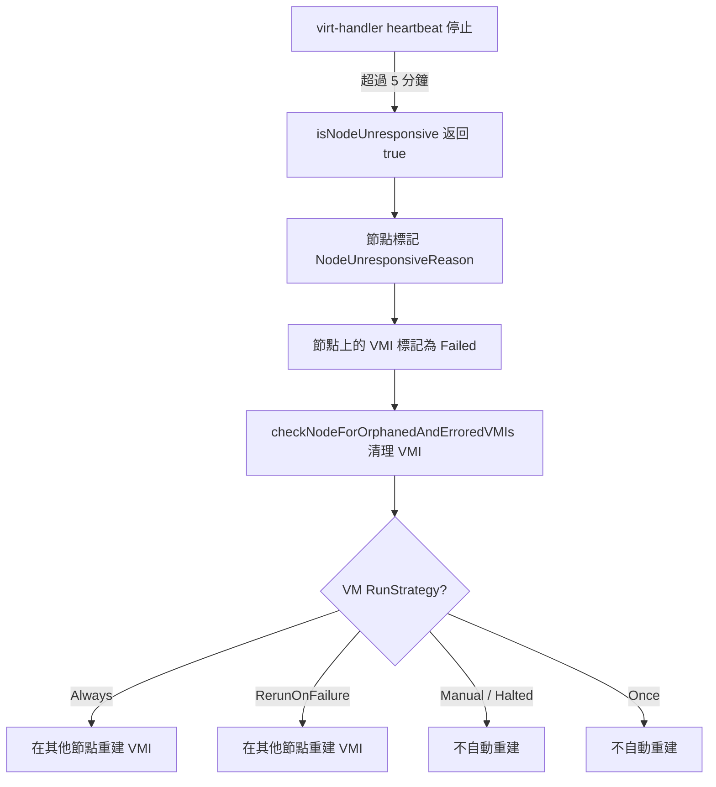
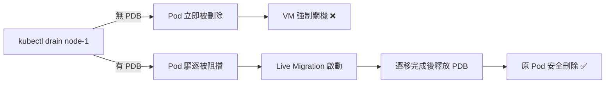
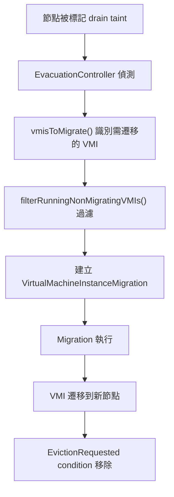

# 高可用性與災難恢復 (HA/DR)

::: info 📖 本章導讀
本文件涵蓋 KubeVirt 在生產環境中實現高可用性 (High Availability) 與災難恢復 (Disaster Recovery) 的完整機制，包括節點失敗偵測、驅逐策略、Live Migration、備份還原，以及與 VMware HA/DRS/SRM 的功能對照。
:::

---

## 概述

在企業虛擬化環境中，**高可用性 (HA)** 確保虛擬機器工作負載在節點失敗時能夠自動恢復；**災難恢復 (DR)** 則確保在整個站點或基礎設施發生災難時，能將服務還原到可接受的狀態。

對於 VMware 工程師而言，這些概念對應到：

| VMware 功能 | 用途 | KubeVirt 對應機制 |
|---|---|---|
| VMware HA | 節點失敗時自動重啟 VM | RunStrategy + virt-controller |
| VMware DRS | 跨節點負載平衡 | Kubernetes Descheduler |
| VMware SRM | 跨站點災難恢復 | Velero + Storage Replication |
| VMware FT | 同步雙節點容錯 | 無直接對應 |

::: tip 💡 VMware 工程師提示
KubeVirt 的 HA 機制並非單一產品功能，而是利用 Kubernetes 原生基礎架構（Controllers、PodDisruptionBudget、Scheduling）搭配 KubeVirt 專屬的驅逐與遷移系統來實現。這種設計哲學與 VMware 的集中式 HA 管理不同，但提供了更高的靈活性與可擴展性。
:::

### 核心元件

KubeVirt HA/DR 涉及以下關鍵元件：

- **virt-controller**：監控節點狀態、管理 VM 生命週期、決定是否重新建立 VMI
- **virt-handler**：運行於每個節點上，透過 heartbeat 回報節點健康狀態
- **Evacuation Controller**：處理節點排空 (drain) 時的 VMI 遷移
- **Disruption Budget Controller**：自動管理 PodDisruptionBudget，保護遷移中的 VMI
- **VM Snapshot Controller**：管理虛擬機器快照與還原

---

## 節點失敗處理

當 Kubernetes 節點發生故障時，KubeVirt 必須偵測失敗並決定如何處理運行在該節點上的虛擬機器。

### Heartbeat 機制

virt-handler 在每個節點上定期透過 node annotation 發送 heartbeat 訊號：

```go
// pkg/virt-handler/heartbeat/heartbeat.go
// HeartBeat struct 管理心跳間隔與時間戳
// 使用 node annotation: kubevirt.io/heartbeat
```

**Heartbeat 關鍵參數：**

| 參數 | 值 | 說明 |
|---|---|---|
| Heartbeat 間隔 | 週期性發送 | 使用 1.2 jitter factor 的 sliding window |
| heartBeatTimeout | 5 分鐘 | 超過此時間未收到 heartbeat 視為無回應 |
| recheckInterval | 1 分鐘 | virt-controller 重新檢查節點狀態的間隔 |

### 節點無回應偵測

virt-controller 的 NodeController (`pkg/virt-controller/watch/node/node.go`) 持續監控每個節點的 heartbeat 時間戳：

```go
// isNodeUnresponsive() 函式邏輯：
// 如果節點的 heartbeat annotation 時間戳超過 5 分鐘未更新，
// 該節點被判定為無回應 (unresponsive)
```

### 失敗處理流程

當節點被偵測為無回應時，處理流程如下：



::: warning ⚠️ 注意事項
節點失敗恢復時間取決於 heartBeatTimeout（5 分鐘）加上 recheckInterval（1 分鐘），因此最壞情況下 VM 可能需要約 6 分鐘才能在新節點上重新啟動。這與 VMware HA 的預設重啟延遲（通常 1-3 分鐘）有所不同。
:::

### 孤兒 VMI 清理

`checkNodeForOrphanedAndErroredVMIs()` 負責清理失敗節點上的 VMI 資源：

- 偵測不再有對應 Pod 的 VMI（孤兒 VMI）
- 清理處於錯誤狀態的 VMI
- 確保 VM controller 可以根據 RunStrategy 決定後續動作

---

## 驅逐策略 (EvictionStrategy)

EvictionStrategy 定義當 VMI 所在節點被排空 (drain) 或驅逐 (evict) 時的行為。這是 KubeVirt HA 中最關鍵的配置之一。

### 策略類型

```go
type EvictionStrategy string

const (
    EvictionStrategyNone                  EvictionStrategy = "None"
    EvictionStrategyLiveMigrate           EvictionStrategy = "LiveMigrate"
    EvictionStrategyLiveMigrateIfPossible EvictionStrategy = "LiveMigrateIfPossible"
    EvictionStrategyExternal              EvictionStrategy = "External"
)
```

### 各策略詳解

#### None

不執行遷移。VMI 將根據 RunStrategy 決定行為（重啟或關機）。

**適用場景：** 無狀態或臨時性 VM，資料遺失可接受。

```yaml
apiVersion: kubevirt.io/v1
kind: VirtualMachineInstance
metadata:
  name: ephemeral-worker
spec:
  evictionStrategy: None
  domain:
    resources:
      requests:
        memory: 2Gi
    devices:
      disks:
        - name: rootdisk
          disk:
            bus: virtio
  volumes:
    - name: rootdisk
      containerDisk:
        image: quay.io/kubevirt/fedora-cloud-container-disk-demo
```

#### LiveMigrate

驅逐時**強制**執行 Live Migration。如果遷移失敗，驅逐操作將被阻擋 (blocked)。

**適用場景：** 關鍵的有狀態 VM，絕對不能中斷服務。

```yaml
apiVersion: kubevirt.io/v1
kind: VirtualMachine
metadata:
  name: critical-database
spec:
  runStrategy: Always
  template:
    spec:
      evictionStrategy: LiveMigrate
      domain:
        resources:
          requests:
            memory: 8Gi
        devices:
          disks:
            - name: rootdisk
              disk:
                bus: virtio
      volumes:
        - name: rootdisk
          persistentVolumeClaim:
            claimName: db-pvc
```

::: danger ⚠️ 重要
使用 `LiveMigrate` 時，如果 VM 不可遷移（例如使用 hostPath 儲存或有 GPU passthrough），`kubectl drain` 將永遠無法完成。請確保使用此策略的 VM 滿足遷移前提條件。
:::

#### LiveMigrateIfPossible

如果 VMI 的 `VirtualMachineInstanceIsMigratable` condition 為 true，則執行 Live Migration；否則退回為 `None` 的行為。

**適用場景：** 混合工作負載環境，部分 VM 可遷移、部分不可遷移。

```yaml
apiVersion: kubevirt.io/v1
kind: VirtualMachine
metadata:
  name: mixed-workload
spec:
  runStrategy: Always
  template:
    spec:
      evictionStrategy: LiveMigrateIfPossible
      domain:
        resources:
          requests:
            memory: 4Gi
        devices:
          disks:
            - name: rootdisk
              disk:
                bus: virtio
      volumes:
        - name: rootdisk
          persistentVolumeClaim:
            claimName: app-pvc
```

#### External

設定 `vmi.Status.EvacuationNodeName` 但不採取任何行動——用於通知外部控制器（例如 Cluster API Provider KubeVirt, CAPK）自行處理遷移邏輯。

**適用場景：** 使用 cluster-api-provider-kubevirt 或其他自訂控制器管理 VM 生命週期。

```yaml
apiVersion: kubevirt.io/v1
kind: VirtualMachine
metadata:
  name: capk-managed-vm
spec:
  runStrategy: Always
  template:
    spec:
      evictionStrategy: External
      domain:
        resources:
          requests:
            memory: 4Gi
        devices:
          disks:
            - name: rootdisk
              disk:
                bus: virtio
      volumes:
        - name: rootdisk
          persistentVolumeClaim:
            claimName: capk-pvc
```

### 優先順序：VMI 層級覆蓋叢集層級

EvictionStrategy 的解析邏輯位於 `pkg/util/migrations/migrations.go` 的 `VMIEvictionStrategy()` 函式：

1. **VMI 層級**：如果 VMI spec 明確設定了 `evictionStrategy`，使用該值
2. **叢集層級**：否則使用 KubeVirt CR 中的全域預設值

```yaml
# 叢集層級預設值（KubeVirt CR）
apiVersion: kubevirt.io/v1
kind: KubeVirt
metadata:
  name: kubevirt
  namespace: kubevirt
spec:
  configuration:
    evictionStrategy: LiveMigrateIfPossible
```

::: tip 💡 建議
在叢集層級設定 `LiveMigrateIfPossible` 作為預設值，然後在需要更嚴格保護的 VM 上個別設定 `LiveMigrate`。
:::

---

## Pod Disruption Budget (PDB)

### 自動 PDB 管理

KubeVirt 的 DisruptionBudgetController（`pkg/virt-controller/watch/drain/disruptionbudget/disruptionbudget.go`）會自動為需要遷移保護的 VMI 建立 PodDisruptionBudget。

**運作機制：**

1. 當 VMI 的 EvictionStrategy 需要遷移時（`LiveMigrate` 或 `LiveMigrateIfPossible` 且可遷移），controller 自動建立 PDB
2. PDB 設定 `minAvailable: 1`，防止 Kubernetes 在遷移完成前驅逐 Pod
3. 遷移成功後，PDB 被自動刪除

```yaml
# KubeVirt 自動建立的 PDB（示意）
apiVersion: policy/v1
kind: PodDisruptionBudget
metadata:
  name: kubevirt-disruption-budget-<vmi-uid>
  ownerReferences:
    - apiVersion: kubevirt.io/v1
      kind: VirtualMachineInstance
      name: <vmi-name>
spec:
  minAvailable: 1
  selector:
    matchLabels:
      kubevirt.io/created-by: <vmi-uid>
```

### 為何 PDB 至關重要



::: warning ⚠️ 注意
如果沒有 PDB 保護，`kubectl drain` 會直接終止 VMI Pod，導致虛擬機器強制關機。這對有狀態工作負載可能造成資料損壞。
:::

---

## Live Migration 作為 HA 機制

### Evacuation Controller

EvacuationController（`pkg/virt-controller/watch/drain/evacuation/evacuation.go`）負責處理節點排空時的 VMI 遷移。

**觸發條件：** 監控節點上的 drain taint。drain taint key 從 migration 配置中的 `NodeDrainTaintKey` 取得。

### 遷移流程



### VMI 過濾邏輯

`filterRunningNonMigratingVMIs()` 會排除以下 VMI：

- 處於 Final 狀態（已停止/已刪除）的 VMI
- 標記為刪除中的 VMI
- 不可遷移的 VMI（`VirtualMachineInstanceIsMigratable` 為 false）
- 已經在遷移中的 VMI

### Migration 優先順序

KubeVirt 遷移系統支援多種優先順序：

| 優先順序 | 說明 | 觸發場景 |
|---|---|---|
| **PrioritySystemCritical** | 系統關鍵 | 節點驅逐 (evacuation) |
| **UserTriggered** | 使用者觸發 | `virtctl migrate` 或手動建立 Migration |
| **SystemMaintenance** | 系統維護 | Descheduler 觸發的重新平衡 |

建立 evacuation migration 時會帶有 annotation：

```yaml
metadata:
  annotations:
    kubevirt.io/evacuationMigration: ""
```

### Descheduler 整合

KubeVirt 支援與 Kubernetes Descheduler 整合，實現類似 VMware DRS 的負載平衡功能：

**相關 Annotations：**

- `descheduler.alpha.kubernetes.io/request-evict-only`：請求 descheduler 僅標記驅逐，不直接執行
- `descheduler.alpha.kubernetes.io/eviction-in-progress`：標記驅逐正在進行中

### VMI 驅逐生命週期

完整的 VMI 驅逐流程：

1. **EvacuationNodeName 設定**：VMI status 中記錄需要撤離的來源節點
2. **EvictionRequested condition 新增**：VMI 被標記為等待驅逐
3. **Migration 建立**：EvacuationController 建立 VirtualMachineInstanceMigration
4. **Migration 執行**：VM 記憶體與狀態遷移到目標節點
5. **Condition 移除**：遷移完成後清理 EvictionRequested condition

---

## 備份與還原

### VirtualMachineSnapshot / VirtualMachineRestore

KubeVirt 提供基於 CRD 的快照機制，可以建立虛擬機器的時間點快照。

**核心 CRD：**

| CRD | 用途 |
|---|---|
| `VirtualMachineSnapshot` | 定義快照請求，觸發 VM spec 與磁碟的快照 |
| `VirtualMachineRestore` | 定義還原請求，從快照恢復 VM |

**VM Spec 中的相關欄位：**

- `status.snapshotInProgress`：標記快照正在進行中
- `status.restoreInProgress`：標記還原正在進行中
- `status.volumeSnapshotStatuses`：追蹤每個 volume 的快照狀態

#### 建立快照

```yaml
apiVersion: snapshot.kubevirt.io/v1beta1
kind: VirtualMachineSnapshot
metadata:
  name: my-vm-snapshot
spec:
  source:
    apiGroup: kubevirt.io
    kind: VirtualMachine
    name: my-vm
```

#### 從快照還原

```yaml
apiVersion: snapshot.kubevirt.io/v1beta1
kind: VirtualMachineRestore
metadata:
  name: my-vm-restore
spec:
  target:
    apiGroup: kubevirt.io
    kind: VirtualMachine
    name: my-vm
  virtualMachineSnapshotName: my-vm-snapshot
```

### Velero 整合

對於跨叢集備份與大規模備份策略，建議整合 [Velero](https://velero.io/)：

**備份工作流程：**

1. 建立 VM 快照（VirtualMachineSnapshot）
2. 使用 Velero 備份快照資源與相關 PVC
3. 將備份資料傳輸到遠端儲存（S3、GCS 等）
4. 在目標叢集使用 Velero 還原

```bash
# 建立 Velero 備份（包含 VM 相關資源）
velero backup create vm-backup \
  --include-namespaces my-vms \
  --include-resources virtualmachines,virtualmachineinstances,\
persistentvolumeclaims,datavolumes

# 還原到目標叢集
velero restore create vm-restore \
  --from-backup vm-backup
```

::: tip 💡 建議
定期測試備份還原流程。未經測試的備份等於沒有備份。建議每季至少執行一次完整的 DR 演練。
:::

---

## 災難恢復策略

### 跨叢集 DR 選項

#### 選項 A：Storage Replication + VM Manifest 備份

```
┌─────────────────────────┐         ┌─────────────────────────┐
│    Primary Cluster       │         │   Secondary Cluster      │
│                          │         │                          │
│  ┌────────┐  ┌────────┐ │  Sync/  │  ┌────────┐  ┌────────┐ │
│  │  VM-1  │  │  VM-2  │ │  Async  │  │(待命)   │  │(待命)   │ │
│  └───┬────┘  └───┬────┘ │ ──────► │  └────────┘  └────────┘ │
│      │           │      │  Storage│                          │
│  ┌───▼───────────▼────┐ │  Repl.  │  ┌────────────────────┐ │
│  │   Shared Storage   │ │ ──────► │  │  Replicated Storage│ │
│  └────────────────────┘ │         │  └────────────────────┘ │
│                          │         │                          │
│  Velero Backup ──────────┼────────►│  VM Manifests (YAML)   │
└─────────────────────────┘         └─────────────────────────┘
```

- **優點：** RPO 低（取決於同步/異步複寫），資料一致性好
- **缺點：** 需要相容的儲存系統，成本較高

#### 選項 B：Velero 備份/還原

- **優點：** 不依賴特定儲存系統，設定簡單
- **缺點：** RPO 取決於備份頻率，RTO 較長（需要還原資料）

#### 選項 C：Active-Passive + 共享儲存

- **優點：** 切換速度快
- **缺點：** 需要跨站點共享儲存，對網路延遲敏感

### RTO / RPO 考量

| 策略 | RPO | RTO | 成本 | 複雜度 |
|---|---|---|---|---|
| 同步 Storage Replication | ~0 | 分鐘級 | 高 | 高 |
| 異步 Storage Replication | 秒到分鐘 | 分鐘到小時 | 中 | 中 |
| Velero 定期備份 | 小時級 | 小時級 | 低 | 低 |
| 手動備份/還原 | 天級 | 天級 | 最低 | 最低 |

::: info 📖 說明
**RPO (Recovery Point Objective)**：可接受的最大資料遺失量（以時間衡量）。
**RTO (Recovery Time Objective)**：從災難發生到服務恢復的最大可接受時間。
:::

---

## RunStrategy 詳解

RunStrategy 決定 VM controller 如何管理 VMI 的生命週期，是 HA 的核心配置。

### 策略定義

```go
const (
    RunStrategyAlways         = "Always"
    RunStrategyHalted         = "Halted"
    RunStrategyManual         = "Manual"
    RunStrategyRerunOnFailure = "RerunOnFailure"
    RunStrategyOnce           = "Once"
)
```

### 行為對照表

| RunStrategy | VMI 不存在時 | VMI 成功結束 | VMI 失敗 | 手動停止 |
|---|---|---|---|---|
| **Always** | 自動建立 | 自動重啟 | 自動重啟 | 自動重啟 |
| **RerunOnFailure** | 自動建立 | 不重啟 | 自動重啟 | 不重啟 |
| **Manual** | 不動作 | 不動作 | 不動作 | 不動作（需 API） |
| **Halted** | 不建立 | N/A | N/A | N/A |
| **Once** | 自動建立 | 不重啟 | 不重啟 | 不重啟 |

### 各策略 YAML 範例

#### Always — 關鍵服務（對應 VMware HA 自動重啟）

```yaml
apiVersion: kubevirt.io/v1
kind: VirtualMachine
metadata:
  name: critical-service
spec:
  runStrategy: Always
  template:
    spec:
      evictionStrategy: LiveMigrate
      domain:
        resources:
          requests:
            memory: 4Gi
        devices:
          disks:
            - name: rootdisk
              disk:
                bus: virtio
      volumes:
        - name: rootdisk
          persistentVolumeClaim:
            claimName: critical-pvc
```

#### RerunOnFailure — 批次運算任務

```yaml
apiVersion: kubevirt.io/v1
kind: VirtualMachine
metadata:
  name: batch-job
spec:
  runStrategy: RerunOnFailure
  template:
    spec:
      domain:
        resources:
          requests:
            memory: 2Gi
        devices:
          disks:
            - name: rootdisk
              disk:
                bus: virtio
      volumes:
        - name: rootdisk
          containerDisk:
            image: quay.io/kubevirt/fedora-cloud-container-disk-demo
```

#### Manual — 開發/測試環境

```yaml
apiVersion: kubevirt.io/v1
kind: VirtualMachine
metadata:
  name: dev-vm
spec:
  runStrategy: Manual
  template:
    spec:
      domain:
        resources:
          requests:
            memory: 2Gi
        devices:
          disks:
            - name: rootdisk
              disk:
                bus: virtio
      volumes:
        - name: rootdisk
          persistentVolumeClaim:
            claimName: dev-pvc
```

```bash
# Manual 策略需要透過 API 控制啟停
virtctl start dev-vm
virtctl stop dev-vm
virtctl restart dev-vm
```

#### Halted — 暫停的 VM

```yaml
apiVersion: kubevirt.io/v1
kind: VirtualMachine
metadata:
  name: suspended-vm
spec:
  runStrategy: Halted
  template:
    spec:
      domain:
        resources:
          requests:
            memory: 2Gi
        devices:
          disks:
            - name: rootdisk
              disk:
                bus: virtio
      volumes:
        - name: rootdisk
          persistentVolumeClaim:
            claimName: suspended-pvc
```

#### Once — 一次性執行

```yaml
apiVersion: kubevirt.io/v1
kind: VirtualMachine
metadata:
  name: one-time-setup
spec:
  runStrategy: Once
  template:
    spec:
      domain:
        resources:
          requests:
            memory: 1Gi
        devices:
          disks:
            - name: rootdisk
              disk:
                bus: virtio
      volumes:
        - name: rootdisk
          containerDisk:
            image: quay.io/kubevirt/fedora-cloud-container-disk-demo
```

---

## VMware 對照表

以下表格詳細對照 VMware 與 KubeVirt 的 HA/DR 功能：

| VMware 功能 | 說明 | KubeVirt 對應 | 實現方式 |
|---|---|---|---|
| **VMware HA** | 節點失敗自動重啟 VM | RunStrategy=Always | virt-controller 監控節點 heartbeat，自動重建 VMI |
| **VMware DRS** | 負載平衡遷移 | Kubernetes Descheduler | 搭配 EvictionStrategy=LiveMigrate，根據資源使用重新平衡 |
| **VMware SRM** | 跨站災難恢復 | Storage Replication + Velero | 需要額外工具整合，非內建功能 |
| **VMware FT** | 同步雙節點容錯 | 無直接對應 | KubeVirt 不支援同步複寫，可用 Live Migration 作為替代 |
| **VMware vMotion** | 手動/自動遷移 | VirtualMachineInstanceMigration | `virtctl migrate` 或 EvacuationController 自動遷移 |
| **Admission Control** | HA 容量預留 | Resource Quotas + Priority Classes | Kubernetes 原生機制，為關鍵 VM 預留資源 |
| **VM Restart Priority** | 重啟優先順序 | Pod Priority + Migration Priority | PrioritySystemCritical / UserTriggered / SystemMaintenance |
| **Proactive HA** | 預測性遷移 | Descheduler Integration | 透過 descheduler annotations 實現預防性遷移 |

::: tip 💡 VMware 工程師提示
VMware HA 在 vCenter 層級集中管理，而 KubeVirt 的 HA 是分散式的——由多個 controller 協同工作。雖然設定方式不同，但最終效果類似：節點失敗時 VM 會在其他節點自動恢復。主要差異在於 VMware FT（同步容錯）在 KubeVirt 中沒有等價功能。
:::

---

## 最佳實務

### 🏗️ 基礎設施

- [ ] 使用奇數個 Control Plane 節點（建議 3 或 5 個）
- [ ] 為 virt-controller 設定 Pod Anti-Affinity，避免單點故障
- [ ] 部署支援 ReadWriteMany (RWX) 的共享儲存（如 Ceph、Longhorn）
- [ ] 確保節點間有足夠的網路頻寬支撐 Live Migration
- [ ] 預留足夠的叢集容量，確保節點失敗時有資源重新排程 VM

### 🖥️ VM 配置

- [ ] 關鍵 VM 設定 `runStrategy: Always`
- [ ] 關鍵 VM 設定 `evictionStrategy: LiveMigrate`
- [ ] 為 VM 設定合理的 resource requests 與 limits
- [ ] 使用 PersistentVolumeClaim 而非 ContainerDisk 作為系統磁碟
- [ ] 考慮使用 Pod Anti-Affinity 將關鍵 VM 分散到不同節點

```yaml
# 關鍵 VM 的建議配置模板
apiVersion: kubevirt.io/v1
kind: VirtualMachine
metadata:
  name: production-vm
  labels:
    app: critical-service
spec:
  runStrategy: Always
  template:
    metadata:
      labels:
        app: critical-service
    spec:
      evictionStrategy: LiveMigrate
      affinity:
        podAntiAffinity:
          preferredDuringSchedulingIgnoredDuringExecution:
            - weight: 100
              podAffinityTerm:
                labelSelector:
                  matchLabels:
                    app: critical-service
                topologyKey: kubernetes.io/hostname
      domain:
        resources:
          requests:
            memory: 4Gi
            cpu: "2"
          limits:
            memory: 4Gi
        devices:
          disks:
            - name: rootdisk
              disk:
                bus: virtio
      volumes:
        - name: rootdisk
          persistentVolumeClaim:
            claimName: prod-pvc
```

### 💾 備份策略

- [ ] 建立定期快照排程（建議每日關鍵 VM）
- [ ] 設定 Velero 排程備份
- [ ] 每季至少測試一次還原流程
- [ ] 將 VM manifests（YAML）納入 Git 版本控制
- [ ] 備份資料存放於異地儲存

```bash
# Velero 排程備份範例
velero schedule create daily-vm-backup \
  --schedule="0 2 * * *" \
  --include-namespaces production-vms \
  --include-resources virtualmachines,persistentvolumeclaims,datavolumes \
  --ttl 720h
```

### 📊 監控

- [ ] 監控 virt-handler heartbeat 狀態
- [ ] 追蹤 Live Migration 成功率
- [ ] 監控 PDB 狀態（確保保護機制正常運作）
- [ ] 設定節點故障告警
- [ ] 監控叢集資源使用率，確保有足夠餘裕

```promql
# 監控 VMI 遷移成功率
rate(kubevirt_vmi_migration_succeeded_total[1h])
/ rate(kubevirt_vmi_migrations_total[1h])

# 監控節點上的 VMI 數量分佈
count(kubevirt_vmi_info) by (node)
```

### 🔄 災難恢復

- [ ] 撰寫並維護 DR Runbook（災難恢復操作手冊）
- [ ] 每半年執行一次 failover 演練
- [ ] 定義明確的 RPO / RTO 目標
- [ ] 確保 DR 站點的資源配置與生產環境一致
- [ ] 記錄 DR 演練結果並持續改進流程

::: danger ⚠️ 生產環境提醒
在生產環境中，HA/DR 策略的有效性取決於**定期測試**。未經測試的 HA 配置和 DR 計劃在實際災難發生時可能無法如預期運作。建議建立定期演練制度，並將演練結果納入改進循環。
:::

---

## 下一步

- 📖 [Live Migration 深入解析](../deep-dive/migration-internals.md) — 了解遷移的底層實現細節
- 🔧 [效能調校](../deep-dive/performance-tuning.md) — 最佳化 VM 與遷移效能
- 🌐 [網路概覽](../networking/overview.md) — 了解 KubeVirt 網路架構
- 📸 [VMware 遷移指南](./vmware-to-kubevirt.md) — 從 VMware 遷移到 KubeVirt
