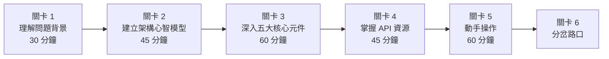

# 🗺️ KubeVirt 學習路徑：Roadmap 式

> 六個關卡，清楚的閱讀清單，明確的完成指標。適合熟悉 Kubernetes 但完全沒用過 KubeVirt 的工程師。

## 🗺️ 全局路線圖

---

## 關卡 1：理解問題背景

⏱️ **預估時間**：30 分鐘

### 🎯 本關目標

理解為什麼 KubeVirt 存在：VM 和 Container 的根本差異，以及在 Kubernetes 上跑 VM 解決了什麼問題。

### 📚 閱讀清單

1. **[系統架構概述（前半部）](/kubevirt/architecture/overview)**
   - 聚焦於：KubeVirt 的設計動機，Container vs VM 的技術本質差異，KubeVirt 如何以 CRD + Operator 模式擴充 K8s。

### ✅ 完成指標

讀完後，你應該能回答以下問題：

- [ ] Container 和 VM 在隔離機制上有什麼根本差異？KubeVirt 為什麼不能直接用 Pod 來跑 VM？
- [ ] KubeVirt 選擇以 CRD + Operator 模式整合 K8s，這個設計決策帶來什麼好處？
- [ ] 哪些場景下「必須用 VM 而非 Container」是合理的技術需求？（列出至少兩個）
- [ ] KubeVirt 的定位是什麼？它和直接使用 KVM/QEMU 的差異在哪？

---

## 關卡 2：建立架構心智模型

⏱️ **預估時間**：45 分鐘

### 🎯 本關目標

理解 KubeVirt 整體架構在 K8s 叢集上的組織方式，以及 VM 從建立到刪除的完整生命週期。

### 📚 閱讀清單

1. **[系統架構概述（完整）](/kubevirt/architecture/overview)**
   - 重點：各元件在叢集中的部署位置、控制流如何流動、資源模型的整體設計。

2. **[VM 生命週期流程](/kubevirt/architecture/lifecycle)**
   - 重點：VM 物件建立後，訊號如何逐層傳遞至最底層的 QEMU 程序；停止、遷移時的狀態機轉換。

### ✅ 完成指標

讀完後，你應該能回答以下問題：

- [ ] KubeVirt 的控制平面和資料平面分別在哪裡？各由哪個元件負責？
- [ ] 當你 `kubectl apply` 一個 VirtualMachine 物件，叢集裡會依序發生哪些事？
- [ ] VM 和 VMI（VirtualMachineInstance）有什麼關係？為什麼要分成兩個物件？
- [ ] VM 在 Running → Stopped → Running 的狀態循環中，哪些狀態是持久的，哪些是暫時的？
- [ ] 一個 VMI 在 K8s 叢集上對應到幾個 Pod？這些 Pod 的角色是什麼？

---

## 關卡 3：深入五大核心元件

⏱️ **預估時間**：60 分鐘

### 🎯 本關目標

理解 KubeVirt 五大核心元件各自的職責、邊界，以及它們之間如何協作。

### 📚 閱讀清單

按以下順序閱讀，每份文件對應一個元件：

1. **[virt-operator](/kubevirt/components/virt-operator)**
   - 重點：如何管理 KubeVirt 自身的安裝與升級；與其他 Operator 的差異；它不負責什麼。

2. **[virt-api](/kubevirt/components/virt-api)**
   - 重點：作為 API 入口的職責；admission webhook 的作用；與 kube-apiserver 的整合方式。

3. **[virt-controller](/kubevirt/components/virt-controller)**
   - 重點：VMI 的調度決策；如何與 kube-scheduler 協作；控制迴圈（reconcile loop）的邏輯。

4. **[virt-handler](/kubevirt/components/virt-handler)**
   - 重點：DaemonSet 部署模型；為什麼必須跑在每個節點上；與 virt-launcher 的通訊方式。

5. **[virt-launcher](/kubevirt/components/virt-launcher)**
   - 重點：每個 VMI 對應一個 virt-launcher Pod；如何封裝 QEMU 程序；Pod sandbox 與 VM 的資源邊界。

### ✅ 完成指標

讀完後，你應該能回答以下問題：

- [ ] virt-operator 和 virt-controller 的職責邊界在哪？前者管什麼，後者管什麼？
- [ ] virt-api 的 admission webhook 在 VM 生命週期中扮演什麼角色？移除它會發生什麼事？
- [ ] virt-controller 決定把一個 VMI 排到哪個節點後，後續的工作由誰接手？
- [ ] virt-handler 為什麼必須以 DaemonSet 部署，而不是 Deployment？
- [ ] virt-launcher Pod 裡面跑的是什麼程序？它和 QEMU 的關係為何？
- [ ] 當一個 VMI 被刪除時，這五個元件各自的反應依序是什麼？

---

## 關卡 4：掌握 API 資源

⏱️ **預估時間**：45 分鐘

### 🎯 本關目標

掌握 KubeVirt 的主要 CRD，理解 VM vs VMI 的設計哲學，並選擇與自己工作場景相關的 API 深入閱讀。

### 📚 閱讀清單

**必讀（所有人）：**

1. **[VM 與 VMI](/kubevirt/api-resources/vm-vmi)**
   - 重點：VM 和 VMI 的欄位差異；`runStrategy` 的各種模式；VMI 的 phase 狀態機。

**選讀（依需求選 1-2 份）：**

- **[遷移（Migration）](/kubevirt/api-resources/migration)** — 如果你需要做 Live Migration 或跨節點遷移
- **[InstanceType](/kubevirt/api-resources/instancetype)** — 如果你需要管理 VM 規格標準化（類似 EC2 instance type）
- **[Snapshot 與 Clone](/kubevirt/api-resources/snapshot-clone)** — 如果你需要備份、還原或快速複製 VM
- **[ReplicaPool](/kubevirt/api-resources/replica-pool)** — 如果你需要管理多個相同規格的 VM 集合

### ✅ 完成指標

讀完後，你應該能回答以下問題：

- [ ] `VirtualMachine` 和 `VirtualMachineInstance` 在 YAML 結構上有哪些關鍵差異？
- [ ] `runStrategy: Always` 和 `runStrategy: Manual` 的行為差異是什麼？什麼場景用哪個？
- [ ] VMI 的 phase 有哪幾個？`Scheduling` 和 `Scheduled` 的差別在哪？
- [ ] 如果你要讓一台 VM 在節點故障後自動在其他節點重啟，應該怎麼設定？

---

## 關卡 5：動手操作

⏱️ **預估時間**：60 分鐘

### 🎯 本關目標

能用 `virtctl` 和 `kubectl` 完成 VM 的基本生命週期操作，建立實際操作的肌肉記憶。

### 📚 閱讀清單

1. **[快速上手指南](/kubevirt/guides/quickstart)**
   - 重點：從零建立第一個 VM；`kubectl apply` VM YAML 的完整流程；驗證 VM 是否正常運行的方法。

2. **[virtctl 操作手冊](/kubevirt/virtctl/guide)**
   - 重點：`virtctl` 和 `kubectl` 的分工；start/stop/restart/pause 的差異；console 和 VNC 存取方式。

**補充參考（需要時查閱）：**

- **[virtctl 存取方式](/kubevirt/virtctl/access)** — SSH、port-forward、serial console 的設定方法

### ✅ 完成指標

讀完後，你應該能完成以下操作：

- [ ] 從一份最小化的 VM YAML，成功建立並啟動一台 VM，並能用 console 登入
- [ ] 解釋 `virtctl stop` vs `kubectl delete vmi` 的行為差異，以及各自的適用場景
- [ ] 在不知道 VM IP 的情況下，如何用 `virtctl` 或 `kubectl` 存取 VM console？
- [ ] 如何確認一台 VM 已經完全啟動（ready），而不只是 Pod 在跑？

---

## 關卡 6：分岔路口

恭喜完成前五關！你已經具備 KubeVirt 的基礎知識。根據你的工作角色，選擇一條路線繼續深入。

---

### 🔗 路線 A：VM 網路工程師

**如果你負責 VM 的網路規劃、多網卡配置、或 SR-IOV 導入**

| 順序 | 文件 | 重點 |
|------|------|------|
| 1 | [網路概述](/kubevirt/networking/overview) | KubeVirt 網路模型、Pod 網路與 VM 網路的邊界 |
| 2 | [Bridge 與 Masquerade](/kubevirt/networking/bridge-masquerade) | 最常用的兩種網路模式，各自的 NAT 行為差異 |
| 3 | [SR-IOV](/kubevirt/networking/sriov) | 高效能網路、硬體直通的設定方式 |

**測驗**：[API 與網路測驗](/kubevirt/quiz/api-networking)

---

### 💾 路線 B：VM 儲存工程師

**如果你負責 VM 的儲存規劃、磁碟管理、或資料匯入流程**

| 順序 | 文件 | 重點 |
|------|------|------|
| 1 | [儲存概述](/kubevirt/storage/overview) | KubeVirt 儲存模型、與 PVC 的整合方式 |
| 2 | [ContainerDisk](/kubevirt/storage/container-disk) | 用 container image 當 VM 磁碟的場景與限制 |
| 3 | [PVC 與 DataVolume](/kubevirt/storage/pvc-datavolume) | 持久化磁碟、CDI 資料匯入流程 |
| 4 | [Hotplug](/kubevirt/storage/hotplug) | VM 運行中動態掛載/卸載磁碟 |

**測驗**：[儲存測驗](/kubevirt/quiz/storage)

---

### ⚡ 路線 C：效能調教工程師

**如果你負責 VM 效能優化、CPU/Memory 調教、或 GPU 工作負載**

| 順序 | 文件 | 重點 |
|------|------|------|
| 1 | [QEMU/KVM 原理](/kubevirt/deep-dive/qemu-kvm) | 底層虛擬化機制，理解效能瓶頸的根源 |
| 2 | [效能調教](/kubevirt/deep-dive/performance-tuning) | CPU pinning、NUMA topology、huge pages 設定 |
| 3 | [VM 優化](/kubevirt/deep-dive/vm-optimization) | Guest OS 層面的優化方法 |
| 4 | [GPU Passthrough](/kubevirt/deep-dive/gpu-passthrough) | GPU 直通配置、vGPU 支援 |

**測驗**：[深度技術測驗](/kubevirt/quiz/deep-dive)

---

### 🏗️ 路線 D：平台維運工程師

**如果你負責 KubeVirt 叢集維運、升級、HA/DR 規劃**

| 順序 | 文件 | 重點 |
|------|------|------|
| 1 | [升級策略](/kubevirt/deep-dive/upgrade-strategy) | KubeVirt 版本升級的安全流程、回滾機制 |
| 2 | [遷移內部機制](/kubevirt/deep-dive/migration-internals) | Live Migration 的底層實作、中斷條件處理 |
| 3 | [HA 與 DR](/kubevirt/guides/ha-dr) | 節點故障轉移、備份還原策略 |
| 4 | [安全加固](/kubevirt/deep-dive/security) | VM isolation、RBAC 設計、安全最佳實踐 |
| 5 | [故障排除](/kubevirt/guides/troubleshooting) | 常見問題診斷流程、log 分析方法 |

**測驗**：[進階測驗](/kubevirt/quiz/advanced)

---

## 🎯 你現在可以做什麼？

完成六個關卡後，你具備以下能力：

| 能力 | 說明 |
|------|------|
| **架構理解** | 能解釋 KubeVirt 各元件的職責與協作流程 |
| **API 操作** | 能撰寫 VM/VMI YAML，理解各欄位的意義 |
| **基本操作** | 能用 `virtctl` 完成 VM 生命週期管理 |
| **問題診斷** | 能根據元件知識，定位 VM 啟動失敗的原因 |

**建議的下一步行動：**

1. 在測試環境用 [快速上手指南](/kubevirt/guides/quickstart) 跑一次完整的 VM 生命週期
2. 選擇一條分岔路線，深入你的工作領域
3. 用 [全套測驗](/kubevirt/quiz/architecture) 驗證自己的理解是否有盲點
4. 如果你正在評估 VMware 遷移，參考 [VMware 到 KubeVirt 遷移指南](/kubevirt/guides/vmware-to-kubevirt)

::: info 相關資源
- [架構深入剖析](/kubevirt/architecture/deep-dive) — 完成六關後，這份文件會有更深的理解
- [VM 初始化機制](/kubevirt/deep-dive/vm-initialization) — cloud-init、ignition 的詳細設定
- [輔助元件](/kubevirt/components/auxiliary-binaries) 與 [Hook Sidecar](/kubevirt/components/hook-sidecars) — 擴充 KubeVirt 功能的進階機制
:::
