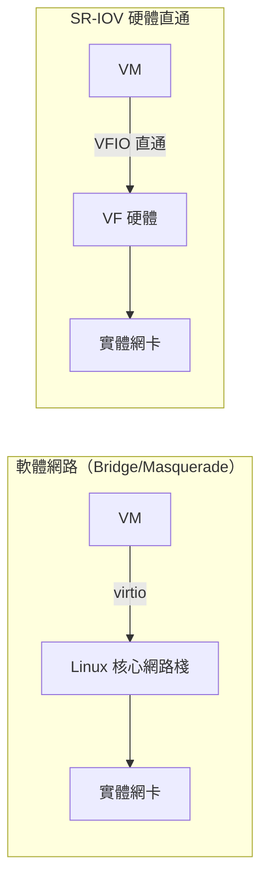
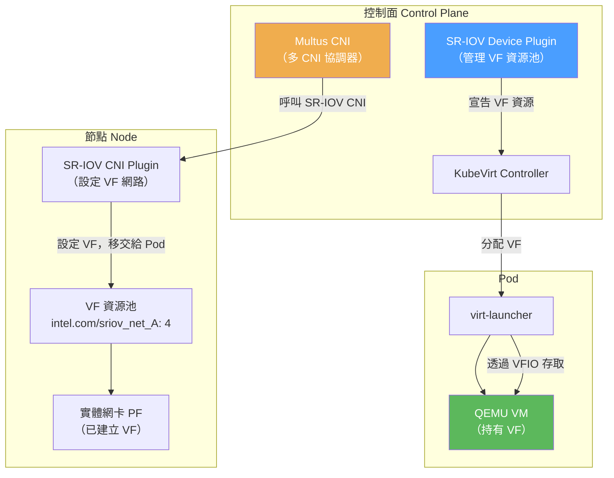
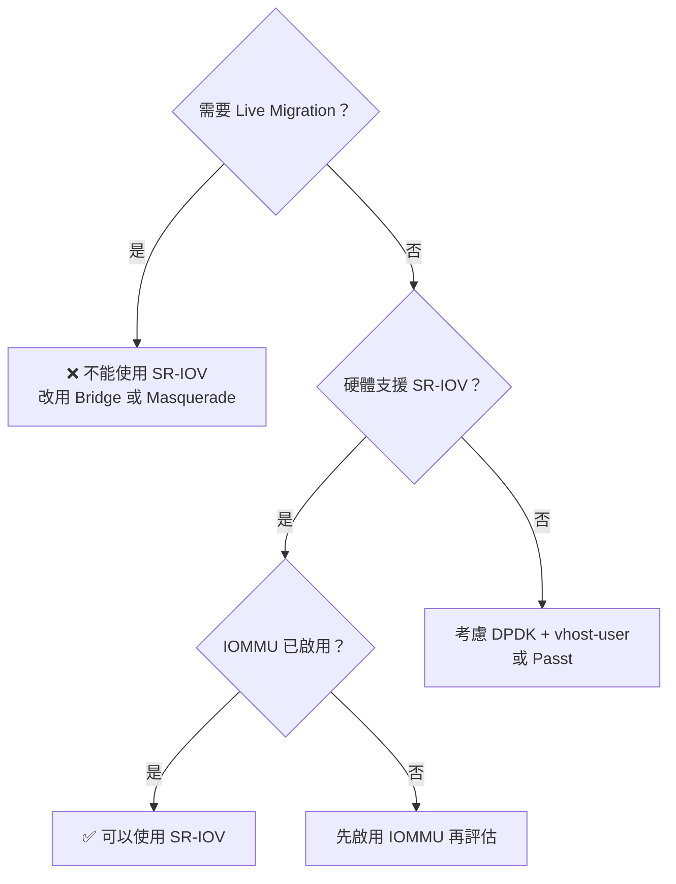
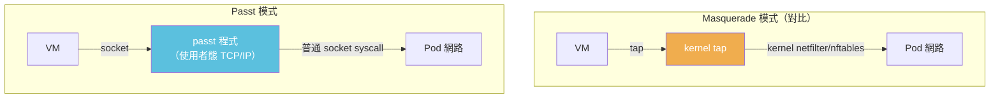
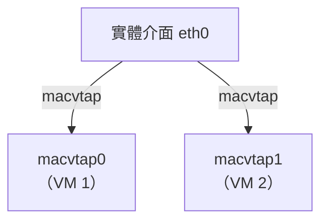

# SR-IOV 與進階網路

本文涵蓋 KubeVirt 中的高效能網路選項，包括 SR-IOV 硬體直通、Passt 使用者態網路、Macvtap，以及多 NIC 進階設定。

:::info 適用場景
本文介紹的網路技術適合對**網路效能**有極高要求的場景，如 NFV（網路功能虛擬化）、高頻交易、即時通訊基礎設施等。
:::

---

## SR-IOV 原理

### Physical Function (PF) 與 Virtual Function (VF)

SR-IOV（Single Root I/O Virtualization）是一種 PCI Express 硬體虛擬化技術，允許一張實體網卡（Physical Function，PF）分裂為多個虛擬功能（Virtual Function，VF），每個 VF 可以**直接分配給一個 VM**，無需經過軟體 hypervisor 的網路棧。


### IOMMU 的必要性

IOMMU（Input-Output Memory Management Unit）是 SR-IOV 的安全基礎：

| 沒有 IOMMU | 有 IOMMU |
|-----------|---------|
| VF 可以存取任意主機記憶體 | VF 只能存取分配給它的記憶體區域 |
| DMA 攻擊風險 | DMA 記憶體隔離保護 |
| 不安全 | 安全的硬體直通 |

```bash
# 啟用 IOMMU（Intel）
# 在 /etc/default/grub 中添加：
GRUB_CMDLINE_LINUX="intel_iommu=on iommu=pt"

# 啟用 IOMMU（AMD）
GRUB_CMDLINE_LINUX="amd_iommu=on iommu=pt"

# 更新 grub 後重啟
sudo grub2-mkconfig -o /boot/grub2/grub.cfg
sudo reboot

# 驗證 IOMMU 已啟用
dmesg | grep -i iommu | head -20
# 應該看到類似：DMAR: IOMMU enabled
```

### VFIO 驅動架構

VFIO（Virtual Function I/O）提供安全的使用者態裝置存取機制：


### 效能優勢



| 效能指標 | Bridge | Masquerade | SR-IOV |
|---------|--------|-----------|--------|
| 延遲（Latency） | ~50-100μs | ~80-120μs | **~5-15μs** |
| 吞吐量（Throughput） | ~10-20 Gbps | ~10-20 Gbps | **25-100 Gbps** |
| CPU 使用率 | 中等 | 中等（NAT開銷） | **極低** |
| 封包丟失率 | 低 | 低 | **極低** |

---

## KubeVirt SR-IOV 整合架構

### 元件架構



### 元件說明

| 元件 | 角色 | 部署方式 |
|------|------|---------|
| SR-IOV Network Operator | 管理整個 SR-IOV 生命周期 | Operator |
| SR-IOV Device Plugin | 將 VF 作為 K8s 資源暴露 | DaemonSet |
| SR-IOV CNI Plugin | 設定 VF 的網路（VLAN、MAC 等） | CNI binary |
| Multus | 允許 Pod 有多個 CNI 介面 | DaemonSet |
| NetworkAttachmentDefinition | 定義 SR-IOV 網路設定 | CRD |

---

## 設定 SR-IOV 環境

### 步驟 1：確認硬體支援

```bash
# 確認網卡支援 SR-IOV
lspci | grep -i ethernet
# 例如：
# 01:00.0 Ethernet controller: Intel Corporation 82599ES 10-Gigabit SFI/SFP+

# 確認支援的 VF 數量
cat /sys/class/net/enp1s0f0/device/sriov_totalvfs
# 輸出例如：63

# 啟用 VF（建立 4 個 VF）
echo 4 > /sys/class/net/enp1s0f0/device/sriov_numvfs

# 或透過 NetworkNodeConfigPolicy（SR-IOV Network Operator）
```

### 步驟 2：安裝 SR-IOV Network Operator

```bash
# 使用 Operator Lifecycle Manager 安裝
kubectl apply -f https://raw.githubusercontent.com/k8snetworkplumbingwg/sriov-network-operator/master/deploy/namespace.yaml
kubectl apply -f https://raw.githubusercontent.com/k8snetworkplumbingwg/sriov-network-operator/master/deploy/

# 驗證安裝
kubectl get pods -n sriov-network-operator
```

### 步驟 3：建立 SriovNetworkNodePolicy

```yaml
# 設定節點上的 SR-IOV 網路策略
apiVersion: sriovnetwork.openshift.io/v1
kind: SriovNetworkNodePolicy
metadata:
  name: policy-intel-dpdk
  namespace: sriov-network-operator
spec:
  resourceName: sriov_net_a        # 資源名稱，用於 Pod 資源請求
  nodeSelector:
    feature.node.kubernetes.io/network-sriov.capable: "true"
  numVfs: 4                        # 建立 4 個 VF
  nicSelector:
    vendor: "8086"                 # Intel
    deviceID: "10fb"               # 82599ES 的 Device ID
    pfNames:
      - enp1s0f0#0-3              # 指定 PF 和 VF 範圍
  deviceType: vfio-pci             # 使用 VFIO 驅動（KubeVirt 必須）
  isRdma: false
```

### 步驟 4：建立 NetworkAttachmentDefinition

```yaml
# SR-IOV NAD（NetworkAttachmentDefinition）
apiVersion: k8s.cni.cncf.io/v1
kind: NetworkAttachmentDefinition
metadata:
  name: sriov-net-a
  namespace: default
  annotations:
    # 對應 Device Plugin 的資源名稱
    k8s.v1.cni.cncf.io/resourceName: intel.com/sriov_net_a
spec:
  config: |
    {
      "cniVersion": "0.3.1",
      "name": "sriov-net-a",
      "type": "sriov",
      "vlan": 100,
      "spoofchk": "off",
      "trust": "on",
      "link_state": "auto",
      "capabilities": {
        "ips": true
      },
      "ipam": {
        "type": "whereabouts",
        "range": "192.168.100.0/24",
        "exclude": ["192.168.100.0/32", "192.168.100.255/32"]
      }
    }
```

---

## SR-IOV VMI 完整範例

```yaml
# 使用 SR-IOV 的 VirtualMachineInstance
apiVersion: kubevirt.io/v1
kind: VirtualMachineInstance
metadata:
  name: vm-sriov-example
  namespace: default
  annotations:
    # 告知 KubeVirt 使用 SR-IOV 資源
    k8s.v1.cni.cncf.io/networks: sriov-net-a
spec:
  domain:
    cpu:
      cores: 4
      # NUMA 拓撲（SR-IOV 高效能場景建議）
      dedicatedCpuPlacement: true
      numa:
        guestMappingPassthrough: {}
    memory:
      guest: 8Gi
      hugepages:
        pageSize: "1Gi"          # 使用 Hugepages 減少 TLB miss
    devices:
      disks:
        - name: rootdisk
          disk:
            bus: virtio
      interfaces:
        # Pod 預設網路（管理介面，使用 masquerade）
        - name: default
          masquerade: {}
        # SR-IOV 高效能資料介面
        - name: sriov-net
          sriov: {}              # SR-IOV binding
  networks:
    # Pod 預設網路
    - name: default
      pod: {}
    # SR-IOV 網路（透過 Multus）
    - name: sriov-net
      multus:
        networkName: sriov-net-a
  volumes:
    - name: rootdisk
      containerDisk:
        image: quay.io/containerdisks/fedora:latest
  # 資源請求：SR-IOV VF
  # （KubeVirt 自動從 NAD 的 annotation 推算）
```

:::tip KubeVirt 自動資源請求
當 VMI spec 中有 `sriov: {}` binding 時，KubeVirt 會自動從對應的 NetworkAttachmentDefinition annotation（`k8s.v1.cni.cncf.io/resourceName`）讀取資源名稱，並在 virt-launcher Pod 的 `resources.requests` 中自動加入：
```yaml
resources:
  requests:
    intel.com/sriov_net_a: "1"
  limits:
    intel.com/sriov_net_a: "1"
```
:::

---

## SR-IOV 已知限制

:::danger SR-IOV 重要限制
1. **不支援 Live Migration**：VF 是實體硬體資源，綁定到特定節點，無法隨 VM 遷移。這是 SR-IOV 最根本的限制。
2. **需要特殊硬體**：網卡必須支援 SR-IOV，且需要 Intel/AMD 的 IOMMU。
3. **IOMMU 必須啟用**：需要 BIOS/UEFI 和核心同時啟用。
4. **VF 數量有限**：每個 PF 的 VF 數量受硬體限制（通常 64-256 個）。
5. **不能熱插拔**：SR-IOV 介面目前不支援熱插拔到執行中的 VM。
:::



| 限制項目 | 說明 | 影響 |
|---------|------|------|
| Live Migration | VF 綁定實體硬體 | 無法熱遷移 VM |
| 特殊硬體 | 需要支援 SR-IOV 的網卡 | 增加硬體成本 |
| IOMMU | BIOS + 核心都要開啟 | 部分老舊伺服器不支援 |
| VF 獨佔 | 每個 VF 只給一個 VM | 降低 VM 密度 |
| Spoof Check | 啟用 spoof check 時 VLAN 設定複雜 | 需關閉 spoof check 或特殊設定 |

---

## Passt 網路綁定插件（v1.1.0+）

### 什麼是 Passt？

**Passt**（Plug A Simple Socket Transport）是一個**完全在使用者態**實作的 TCP/IP 協定棧的網路轉換程式，由 Red Hat 工程師開發。與 Bridge/Masquerade 的 kernel-space NAT 不同，Passt 不需要任何特權操作。



### Passt 的核心優勢

| 特性 | Masquerade | Passt |
|------|-----------|-------|
| 特權操作 | Phase 1 需要（nftables） | **完全不需要** |
| 協定支援 | TCP/UDP/ICMP | TCP/UDP/ICMP |
| IPv6 支援 | ✅ | ✅ |
| Phase 1 | 需要 | **不需要** |
| 安全性 | 高 | **更高**（完全無特權） |
| 效能 | 中等 | 中等（使用者態有少量開銷） |
| 成熟度 | 穩定 | 發展中（v1.1.0+） |

:::tip 為什麼 Passt 重要？
Passt 代表了 KubeVirt 網路的未來方向：**全面去特權化**。傳統的 Bridge 和 Masquerade 都需要在 Phase 1 以特權修改 Pod netns，而 Passt 完全在使用者態運作，不需要 CAP_NET_ADMIN，大幅提升安全性。
:::

### 啟用 Passt

```yaml
# 方法 1：啟用 KubeVirt Feature Gate
apiVersion: kubevirt.io/v1
kind: KubeVirt
metadata:
  name: kubevirt
  namespace: kubevirt
spec:
  configuration:
    developerConfiguration:
      featureGates:
        - "Passt"
```

```yaml
# 方法 2：啟用 NetworkBindingPlugins（推薦，v1.1.0+）
apiVersion: kubevirt.io/v1
kind: KubeVirt
metadata:
  name: kubevirt
  namespace: kubevirt
spec:
  configuration:
    network:
      binding:
        passt:
          networkAttachmentDefinition: passt-binding    # 指向 NAD
```

```yaml
# 對應的 NetworkAttachmentDefinition
apiVersion: k8s.cni.cncf.io/v1
kind: NetworkAttachmentDefinition
metadata:
  name: passt-binding
  namespace: kubevirt
spec:
  config: |
    {
      "cniVersion": "1.0.0",
      "name": "passt-binding",
      "plugins": []
    }
```

### Passt 完整 VMI 範例

```yaml
apiVersion: kubevirt.io/v1
kind: VirtualMachineInstance
metadata:
  name: vm-passt-example
  namespace: default
spec:
  domain:
    cpu:
      cores: 2
    memory:
      guest: 2Gi
    devices:
      disks:
        - name: rootdisk
          disk:
            bus: virtio
      interfaces:
        - name: default
          binding:
            name: passt           # 使用 passt binding plugin
          ports:
            - name: ssh
              port: 22
              protocol: TCP
            - name: http
              port: 80
              protocol: TCP
  networks:
    - name: default
      pod: {}
  volumes:
    - name: rootdisk
      containerDisk:
        image: quay.io/containerdisks/fedora:latest
```

### Passt 的已知限制

:::warning Passt 當前限制
- 使用者態 TCP/IP 有一定效能開銷（但對大多數工作負載可接受）
- 功能仍在持續發展，部分邊緣場景可能有限制
- 需要 KubeVirt v1.1.0+ 並啟用對應 Feature Gate
:::

---

## Macvtap 網路（已棄用）

### 什麼是 Macvtap？

Macvtap 是一種基於 **macvlan** 的網路介面類型，它允許 VM 直接連接到父網路介面，VM 擁有獨立的 MAC 地址，在 L2 層可見。



### 為何棄用？

:::danger Macvtap 已棄用
Macvtap 在 KubeVirt 中已被標記為**棄用**（Deprecated），將在未來版本移除，原因如下：

1. **功能重疊**：SR-IOV 提供更好的效能和隔離，Multus + bridge 提供更靈活的 L2 連接
2. **維護負擔**：macvtap 模式有較多邊緣案例問題
3. **不支援 Live Migration**：與 SR-IOV 相同的根本限制
4. **被 bridge binding + Multus 取代**：新設計更靈活
:::

### 遷移建議

| 原使用場景 | 推薦替代方案 |
|-----------|-------------|
| L2 直連需求 | Bridge binding + Multus |
| 高效能需求 | SR-IOV |
| 簡單 Pod 網路 | Masquerade 或 Passt |

---

## 進階功能

### 多 NIC 設定

在企業場景中，VM 通常需要多個網路介面：管理網路、資料網路、儲存網路等。

```yaml
apiVersion: kubevirt.io/v1
kind: VirtualMachineInstance
metadata:
  name: vm-multi-nic
  namespace: default
  annotations:
    # 宣告需要的附加網路
    k8s.v1.cni.cncf.io/networks: sriov-data,bridge-storage
spec:
  domain:
    cpu:
      cores: 4
    memory:
      guest: 8Gi
    devices:
      disks:
        - name: rootdisk
          disk:
            bus: virtio
      interfaces:
        # NIC 1：管理網路（masquerade，用於 SSH 等）
        - name: management
          masquerade: {}
          ports:
            - name: ssh
              port: 22
              protocol: TCP

        # NIC 2：高效能資料網路（SR-IOV）
        - name: data
          sriov: {}

        # NIC 3：儲存網路（bridge）
        - name: storage
          bridge: {}
          macAddress: "02:00:00:00:00:03"

  networks:
    - name: management
      pod: {}
    - name: data
      multus:
        networkName: sriov-net-a
    - name: storage
      multus:
        networkName: bridge-storage-net

  volumes:
    - name: rootdisk
      persistentVolumeClaim:
        claimName: vm-rootdisk
```

### MAC Address Pool（使用 KubeMacPool）

KubeMacPool 可以自動為 VM 分配唯一的 MAC 地址，避免衝突：

```yaml
# 安裝 KubeMacPool 後，在 namespace 加上 annotation 啟用
apiVersion: v1
kind: Namespace
metadata:
  name: production-vms
  labels:
    # 啟用 KubeMacPool 自動 MAC 分配
    mutatevirtualmachines.kubemacpool.io: allocate
```

```yaml
# KubeMacPool 設定（MAC 地址範圍）
apiVersion: v1
kind: ConfigMap
metadata:
  name: kubemacpool-mac-range-config
  namespace: kubemacpool-system
data:
  RANGE_START: "02:00:00:00:00:00"
  RANGE_END: "02:FF:FF:FF:FF:FF"
```

### VLAN 設定（SR-IOV VF VLAN Tagging）

```yaml
# SR-IOV NAD 設定 VLAN（在 NetworkAttachmentDefinition 中）
apiVersion: k8s.cni.cncf.io/v1
kind: NetworkAttachmentDefinition
metadata:
  name: sriov-vlan-100
  namespace: default
  annotations:
    k8s.v1.cni.cncf.io/resourceName: intel.com/sriov_net_a
spec:
  config: |
    {
      "cniVersion": "0.3.1",
      "name": "sriov-vlan-100",
      "type": "sriov",
      "vlan": 100,
      "vlanQoS": 0,
      "spoofchk": "off",
      "trust": "on",
      "ipam": {
        "type": "host-local",
        "subnet": "192.168.100.0/24",
        "rangeStart": "192.168.100.100",
        "rangeEnd": "192.168.100.200",
        "routes": [{"dst": "0.0.0.0/0"}],
        "gateway": "192.168.100.1"
      }
    }
```

:::warning VLAN + Spoof Check
在 SR-IOV 中使用 VLAN 時，必須將 `spoofchk` 設為 `off`，否則帶有 VLAN tag 的封包會被 spoof check 機制丟棄。這在安全敏感環境中需要謹慎評估。
:::

---

## 常見問題與排查

### VF 資源不足

```bash
# 症狀：Pod Pending，原因是資源不足
kubectl describe pod virt-launcher-vm-sriov-xxxxx | grep -A5 Events

# 排查：查看節點可用 VF 資源
kubectl describe node <node-name> | grep -A5 "Allocatable"
# 應看到 intel.com/sriov_net_a: 4

# 查看當前已使用的 VF
kubectl get sriovnetworknodestates -n sriov-network-operator
```

### IOMMU 未啟用

```bash
# 症狀：QEMU 啟動失敗，錯誤訊息含 "VFIO" 或 "IOMMU"
virtctl console vm/<vm-name>  # 可能無法進入

# 排查
dmesg | grep -i iommu
# 如果沒有 "IOMMU enabled" 字樣，表示未啟用

# 修復：修改 grub 設定後重啟
grep iommu /etc/default/grub
# 應含有 intel_iommu=on 或 amd_iommu=on
```

### VFIO 模組未載入

```bash
# 症狀：VF 無法被 Pod 使用
# 排查：確認 VFIO 模組已載入
lsmod | grep vfio
# 應看到：vfio_pci, vfio, vfio_iommu_type1

# 修復：手動載入（或讓 SR-IOV Operator 自動載入）
modprobe vfio-pci
modprobe vfio

# 設定開機自動載入
echo "vfio-pci" >> /etc/modules-load.d/vfio.conf
```

### Migration 被阻擋

```bash
# 症狀：執行 virtctl migrate 失敗
virtctl migrate vm/<vm-name>
# 錯誤：VMI has SR-IOV interfaces, cannot be migrated

# 確認 VM 的網路介面
kubectl get vmi <vm-name> -o jsonpath='{.spec.domain.devices.interfaces}' | jq .

# 解決方案：SR-IOV 介面的 VM 無法 Live Migration
# 如果需要 Migration，必須移除 SR-IOV 介面，改用 bridge/masquerade
```

### 完整排查指令集

```bash
# 1. 查看 SR-IOV 節點狀態
kubectl get sriovnetworknodestates -n sriov-network-operator -o yaml

# 2. 查看 VF 設備狀態
kubectl get sriovnetworknodepolicies -n sriov-network-operator

# 3. 查看 Device Plugin 日誌
kubectl logs -n sriov-network-operator \
    -l app=sriov-device-plugin \
    --tail=50

# 4. 查看 SR-IOV CNI 日誌
ls /var/log/sriov-cni/
# 或透過節點 journald
journalctl -u kubelet | grep sriov

# 5. 驗證 VF 在節點上的狀態
# SSH 到節點後執行：
ip link show dev enp1s0f0
# 應看到 VF 子裝置列表

# 6. 查看 VM 的 VF 使用情況
kubectl exec -it virt-launcher-<vm>-<hash> -- \
    ls /dev/vfio/

# 7. 查看 QEMU 啟動日誌
kubectl logs virt-launcher-<vm>-<hash> -c compute | grep -i "vfio\|sriov"
```

:::info 更多網路文件
- [Bridge 與 Masquerade 網路模式](./bridge-masquerade.md)
- [KubeVirt 官方網路文件](https://kubevirt.io/user-guide/virtual_machines/interfaces_and_networks/)
:::
