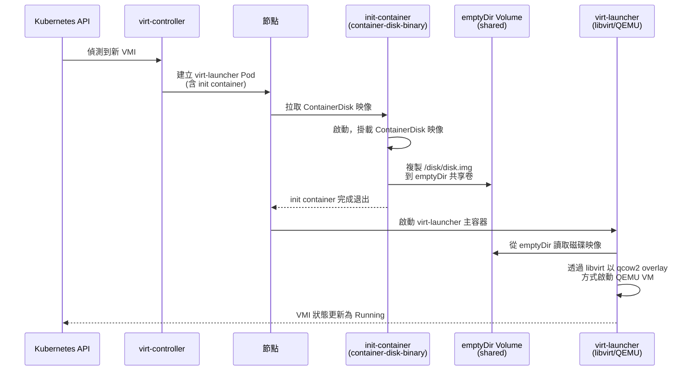

# ContainerDisk — 使用容器映像儲存 VM 磁碟

ContainerDisk 是 KubeVirt 提供的一種輕量、可攜式的虛擬機磁碟分發機制，讓工程師可以像管理容器映像一樣管理 VM 磁碟映像，充分利用現有的 Container Registry 基礎設施。

## ContainerDisk 設計理念

ContainerDisk 的核心概念是「**把 VM 磁碟當成容器映像來管理**」。這種設計帶來以下好處：

- **版本控制與標籤（Tag）管理**：透過 Image Tag 來管理不同版本的 OS 映像（如 `ubuntu:22.04`、`ubuntu:24.04`）
- **複用 Container Registry 基礎設施**：不需要額外建置儲存系統，直接使用 Harbor、Quay、ECR、GCR 等現有 Registry
- **免 PVC 預先建立**：不需要預先建立 PersistentVolumeClaim，KubeVirt 在 VM 啟動時自動處理
- **統一的 CI/CD 流程**：可以在 CI 流水線中打包、測試、推送磁碟映像，與容器映像工作流程完全相同

:::info 適用場景
ContainerDisk 最適合以下情境：
- **開發與測試環境**：需要快速佈建、反覆測試的場景
- **無狀態 VM**：每次啟動都從乾淨狀態開始的 VM（如 CI runner）
- **映像分發**：需要在多個叢集或節點間分發統一基礎映像
- **黃金映像管理**：由維運團隊統一維護的標準化 OS 映像
:::

:::warning 不適合的場景
ContainerDisk **不適合**需要持久儲存的生產工作負載。VM 重啟後所有寫入資料都會消失。如果需要持久儲存，請使用 [PVC 或 DataVolume](./pvc-datavolume.md)。
:::

---

## 工作原理詳細說明

### 磁碟映像的封裝方式

ContainerDisk 映像是標準的 OCI 容器映像，其中包含一個磁碟映像檔案，路徑固定為 `/disk/disk.img`。這個磁碟映像可以是 qcow2、raw 或 iso 格式。

### 啟動流程

當 KubeVirt 啟動一個使用 ContainerDisk 的 VMI 時，流程如下：



### 關鍵設計細節

| 元件 | 角色 | 說明 |
|------|------|------|
| `container-disk-binary` init container | 磁碟提取器 | 從 ContainerDisk 映像中提取磁碟檔案到 emptyDir |
| `emptyDir` 共享卷 | 暫存儲存 | init container 與 virt-launcher 共用的暫存儲存 |
| `virt-launcher` | VM 執行環境 | 透過 libvirt 管理 QEMU 程序，從 emptyDir 讀取磁碟 |
| QEMU overlay | 寫入層 | VM 的所有寫入都存在記憶體中的 overlay，不寫回映像 |

:::tip 多個 VM 共享同一映像
多個 VM 可以使用同一個 ContainerDisk 映像。由於每個 VM 都有獨立的 emptyDir，各 VM 之間完全隔離。容器映像在同一節點上只需拉取一次（Docker/containerd 的映像快取機制），大幅節省頻寬。
:::

---

## 支援的磁碟格式

| 格式 | 副檔名 | 特點 | 推薦場景 |
|------|--------|------|----------|
| **qcow2** | `.qcow2` | 支援稀疏分配、快照、壓縮；檔案小 | **推薦**，大多數場景首選 |
| **raw** | `.img`, `.raw` | 最簡單格式，無額外 overhead；效能最佳 | 對 I/O 效能有極高要求 |
| **iso** | `.iso` | CD-ROM 映像，唯讀 | 安裝程式、LiveCD、驅動程式光碟 |

:::info qcow2 的優勢
qcow2（QEMU Copy-On-Write v2）是 KubeVirt 環境中最推薦的格式：
- **壓縮**：相同內容的 raw 映像，qcow2 通常可以小 40-60%
- **稀疏分配**：未寫入的區域不佔用實際空間
- **Overlay 支援**：QEMU 可以在 qcow2 上建立寫入層，正是 ContainerDisk 暫態寫入的基礎
:::

---

## ContainerDisk 的限制

在選用 ContainerDisk 之前，必須清楚了解以下限制：

### 1. 暫態性（最重要的限制）

VM 的所有寫入都存在 QEMU overlay（位於節點記憶體/tmpfs 中），**VM 重啟或 Pod 重建後，所有寫入資料都會消失**。這是設計使然，ContainerDisk 本質上是唯讀的基礎映像。

### 2. 底層映像唯讀

ContainerDisk 映像本身是唯讀的，VM 的寫入透過 QEMU 的 copy-on-write overlay 機制暫存。這意味著你不能在 VM 內修改映像再推回 Registry（需透過 CDI/DataVolume 做轉換）。

### 3. 映像大小影響啟動時間

整個磁碟映像需要被拉取到節點的 emptyDir 中，映像越大，VM 啟動時間越長。建議控制 ContainerDisk 映像大小（推薦 < 5GB）。

### 4. 不支援 Live Migration 的持久儲存

由於資料存在 emptyDir，Live Migration 後資料不會跟著遷移（VM 基礎磁碟會跟著遷移，但 overlay 中的寫入資料會消失）。

### 5. 不支援 Hotplug

ContainerDisk 不支援熱插拔（Hotplug）。如需動態儲存，請使用 [PVC Hotplug](./hotplug.md)。

:::danger 資料遺失風險
不要在 ContainerDisk-only 的 VM 中儲存重要資料！VM 重啟即資料消失。如果需要持久保存資料，必須搭配持久化 PVC 或使用 DataVolume。
:::

---

## 如何建立自己的 ContainerDisk 映像

### 準備磁碟映像

首先需要一個磁碟映像檔案，可以透過以下方式取得：

```bash
# 方式 1：下載現有 cloud image（以 Ubuntu 為例）
wget https://cloud-images.ubuntu.com/jammy/current/jammy-server-cloudimg-amd64.img

# 方式 2：使用 virt-builder 建立自訂映像
virt-builder ubuntu-22.04 \
  --format qcow2 \
  --output ubuntu-22.04-custom.qcow2 \
  --size 20G \
  --install "nginx,curl,git" \
  --root-password password:MySecurePass

# 方式 3：轉換現有 raw 映像為 qcow2（可大幅縮小體積）
qemu-img convert -f raw -O qcow2 -c ubuntu.raw ubuntu.qcow2
```

### Dockerfile 方式一：使用 scratch 基礎映像（最精簡）

```dockerfile
# 使用 scratch 作為基礎映像，最終映像只包含磁碟檔案
FROM scratch

# 磁碟映像必須放在 /disk/disk.img 路徑
ADD --chown=107:107 ubuntu-22.04-custom.qcow2 /disk/disk.img
```

:::tip 為什麼使用 UID/GID 107？
KubeVirt 的 container-disk-binary 以 qemu 使用者（UID 107）身份運行，需要有讀取 `/disk/disk.img` 的權限。
:::

### Dockerfile 方式二：使用官方基礎映像（推薦）

```dockerfile
# 使用 KubeVirt 官方提供的 container-disk 基礎映像
FROM kubevirt/container-disk-v1alpha:latest

# 複製磁碟映像到指定路徑
ADD ubuntu-22.04-custom.qcow2 /disk/disk.img
```

### Dockerfile 方式三：多階段建置（適合 CI/CD）

```dockerfile
# 第一階段：下載和轉換映像
FROM ubuntu:22.04 AS builder

RUN apt-get update && apt-get install -y \
    wget \
    qemu-utils \
    && rm -rf /var/lib/apt/lists/*

RUN wget -q https://cloud-images.ubuntu.com/jammy/current/jammy-server-cloudimg-amd64.img \
    -O /tmp/ubuntu.img

# 壓縮並轉換為 qcow2 格式
RUN qemu-img convert -c -f qcow2 -O qcow2 /tmp/ubuntu.img /disk.img

# 第二階段：建立最終 ContainerDisk 映像
FROM scratch
ADD --chown=107:107 /disk.img /disk/disk.img
```

### 建置、標記與推送

```bash
# 建置映像
docker build -t my-registry.example.com/vms/ubuntu-22.04:latest .

# 推送到 Registry
docker push my-registry.example.com/vms/ubuntu-22.04:latest

# 也可以加版本標籤
docker tag my-registry.example.com/vms/ubuntu-22.04:latest \
           my-registry.example.com/vms/ubuntu-22.04:22.04.3

docker push my-registry.example.com/vms/ubuntu-22.04:22.04.3
```

:::warning 映像路徑限制
磁碟映像**必須**放在容器的 `/disk/disk.img` 路徑。KubeVirt 的 init container 硬編碼查找此路徑。放在其他路徑將導致 VM 啟動失敗。
:::

---

## 官方提供的 ContainerDisk 映像

KubeVirt 社群在 `quay.io/kubevirt/` 下維護了多個官方 ContainerDisk 映像，可直接使用：

| 映像名稱 | 說明 | 用途 |
|----------|------|------|
| `quay.io/kubevirt/alpine-container-disk-demo` | Alpine Linux | 輕量測試，快速啟動 |
| `quay.io/kubevirt/cirros-container-disk-demo` | CirrOS | 最小化測試映像，約 20MB |
| `quay.io/kubevirt/fedora-cloud-container-disk-demo` | Fedora Cloud | 功能測試，含 cloud-init |
| `quay.io/kubevirt/fedora-with-test-tooling-container-disk` | Fedora + 測試工具 | KubeVirt E2E 測試專用 |

:::info Windows ContainerDisk
KubeVirt 不提供官方 Windows ContainerDisk 映像（因商業授權限制）。如需使用 Windows VM，需要自行取得 Windows ISO 並透過 CDI 匯入，或自行建置 ContainerDisk 映像（需確保符合 Microsoft 授權條款）。
:::

:::tip 版本對應
官方映像通常有對應 KubeVirt 版本的標籤（如 `v1.2.0`），建議使用與叢集 KubeVirt 版本一致的映像標籤，以確保相容性。
:::

---

## 多個 VM 共享同一個 ContainerDisk 映像

ContainerDisk 的設計天然支援多個 VM 共享同一個基礎映像，行為類似於 ReadOnlyMany（ROX）的 PVC，但每個 VM 有獨立的寫入層：


**節省頻寬的機制**：
- 同一個節點上的多個 VM 使用同一個 ContainerDisk 映像時，容器 runtime（如 containerd）只需拉取一次映像層
- 不同節點上的 VM 各自拉取（無法跨節點共享容器映像快取）

---

## ContainerDisk + cloud-init 組合使用

這是 ContainerDisk 最常見的使用模式：使用 ContainerDisk 作為不可變的 OS 基礎映像，使用 cloud-init 在首次啟動時初始化 VM 配置。

### 標準組合架構


### cloud-init 可設定的內容

| 配置項目 | userData 鍵值 | 說明 |
|----------|---------------|------|
| 使用者密碼 | `chpasswd` | 設定 root 或其他使用者密碼 |
| SSH 公鑰 | `ssh_authorized_keys` | 注入 SSH 公鑰 |
| Hostname | `hostname` | 設定主機名稱 |
| 套件安裝 | `packages` + `package_update` | 安裝額外套件 |
| 啟動腳本 | `runcmd` | 執行自訂初始化命令 |
| 寫入檔案 | `write_files` | 寫入設定檔案 |

---

## imagePullPolicy 設定

ContainerDisk 遵循標準 Kubernetes imagePullPolicy 語意：

| 策略 | 行為 | 適用場景 |
|------|------|----------|
| `Always` | 每次啟動 VM 都重新拉取映像 | 開發測試，使用 `latest` tag |
| `IfNotPresent` | 節點上有映像則不拉取 | **預設行為**，生產環境推薦 |
| `Never` | 永遠不拉取，映像必須已存在節點上 | 離線/Air-gap 環境 |

:::warning 使用 latest 標籤的風險
如果使用 `latest` 標籤且 `imagePullPolicy: IfNotPresent`，節點上已快取的舊版 `latest` 映像不會被更新。建議使用語意化版本標籤（如 `v1.2.3`）或設定 `imagePullPolicy: Always`。
:::

---

## 完整 YAML 範例

### 範例 1：基本 ContainerDisk + CloudInitNoCloud

```yaml
apiVersion: kubevirt.io/v1
kind: VirtualMachine
metadata:
  name: vm-cirros-demo
  namespace: default
spec:
  running: true
  template:
    metadata:
      labels:
        kubevirt.io/vm: vm-cirros-demo
    spec:
      domain:
        cpu:
          cores: 1
        memory:
          guest: 512Mi
        devices:
          disks:
            # 第一個磁碟：OS 磁碟（來自 ContainerDisk）
            - name: containerdisk
              disk:
                bus: virtio
            # 第二個磁碟：cloud-init 設定磁碟
            - name: cloudinitdisk
              disk:
                bus: virtio
          interfaces:
            - name: default
              masquerade: {}
      networks:
        - name: default
          pod: {}
      volumes:
        # ContainerDisk：OS 基礎映像
        - name: containerdisk
          containerDisk:
            image: quay.io/kubevirt/cirros-container-disk-demo:latest
            imagePullPolicy: IfNotPresent
        # CloudInitNoCloud：初始化配置
        - name: cloudinitdisk
          cloudInitNoCloud:
            userData: |
              #cloud-config
              hostname: cirros-demo
              ssh_authorized_keys:
                - ssh-rsa AAAAB3NzaC1yc2EAAAADAQAB... user@host
              chpasswd:
                list: |
                  root:password123
                  cirros:gocubsgo
                expire: false
              runcmd:
                - echo "VM initialized at $(date)" > /etc/vm-init.log
```

### 範例 2：Ubuntu VM with ContainerDisk + cloud-init（含套件安裝）

```yaml
apiVersion: kubevirt.io/v1
kind: VirtualMachine
metadata:
  name: vm-ubuntu-dev
  namespace: dev-team
spec:
  running: true
  template:
    spec:
      domain:
        cpu:
          cores: 2
          sockets: 1
          threads: 1
        memory:
          guest: 2Gi
        devices:
          disks:
            - name: containerdisk
              disk:
                bus: virtio
            - name: cloudinitdisk
              disk:
                bus: virtio
          interfaces:
            - name: default
              masquerade: {}
          rng: {}   # 提供亂數熵，加速 cloud-init
      networks:
        - name: default
          pod: {}
      volumes:
        - name: containerdisk
          containerDisk:
            image: quay.io/kubevirt/fedora-cloud-container-disk-demo:v1.3.0
            imagePullPolicy: IfNotPresent
        - name: cloudinitdisk
          cloudInitNoCloud:
            userData: |
              #cloud-config
              hostname: ubuntu-dev-01
              users:
                - name: devuser
                  groups: sudo
                  shell: /bin/bash
                  sudo: ALL=(ALL) NOPASSWD:ALL
                  ssh_authorized_keys:
                    - ssh-rsa AAAAB3NzaC1yc2EAAAADAQAB... dev@workstation
              package_update: true
              packages:
                - git
                - curl
                - vim
                - htop
              runcmd:
                - systemctl enable --now sshd
                - echo "net.ipv4.ip_forward=1" >> /etc/sysctl.conf
```

### 範例 3：使用私有 Registry 的 ContainerDisk（含 imagePullSecrets）

```yaml
# 首先建立 Registry 認證 Secret
apiVersion: v1
kind: Secret
metadata:
  name: my-registry-credentials
  namespace: production
type: kubernetes.io/dockerconfigjson
data:
  .dockerconfigjson: eyJhdXRocyI6eyJteS1yZWdpc3RyeS5leGFtcGxlLmNvbSI6eyJ1c2VybmFtZSI6InVzZXIiLCJwYXNzd29yZCI6InBhc3MiLCJhdXRoIjoiZFhObGNqcHdZWE56In19fQ==
---
apiVersion: kubevirt.io/v1
kind: VirtualMachine
metadata:
  name: vm-private-image
  namespace: production
spec:
  running: true
  template:
    spec:
      domain:
        cpu:
          cores: 4
        memory:
          guest: 8Gi
        devices:
          disks:
            - name: osdisk
              disk:
                bus: virtio
            - name: cloudinitdisk
              disk:
                bus: virtio
          interfaces:
            - name: default
              masquerade: {}
      networks:
        - name: default
          pod: {}
      # 指定拉取私有映像的 Secret
      imagePullSecrets:
        - name: my-registry-credentials
      volumes:
        - name: osdisk
          containerDisk:
            # 使用私有 Registry 中的自訂 OS 映像
            image: my-registry.example.com/vms/ubuntu-22.04-hardened:2.1.0
            imagePullPolicy: IfNotPresent
        - name: cloudinitdisk
          cloudInitNoCloud:
            userData: |
              #cloud-config
              hostname: prod-vm-01
              ssh_authorized_keys:
                - ssh-rsa AAAAB3NzaC1yc2EAAAADAQAB... ops@bastion
```

### 範例 4：多磁碟（ContainerDisk OS + EmptyDisk 資料磁碟）

```yaml
apiVersion: kubevirt.io/v1
kind: VirtualMachine
metadata:
  name: vm-with-data-disk
  namespace: default
spec:
  running: true
  template:
    spec:
      domain:
        cpu:
          cores: 2
        memory:
          guest: 4Gi
        devices:
          disks:
            # 磁碟 1：OS 磁碟（ContainerDisk）
            - name: osdisk
              disk:
                bus: virtio
              bootOrder: 1
            # 磁碟 2：暫存資料磁碟（EmptyDisk，VM 存活期間持久）
            - name: datadisk
              disk:
                bus: virtio
            # 磁碟 3：cloud-init
            - name: cloudinitdisk
              disk:
                bus: virtio
          interfaces:
            - name: default
              masquerade: {}
      networks:
        - name: default
          pod: {}
      volumes:
        - name: osdisk
          containerDisk:
            image: quay.io/kubevirt/fedora-cloud-container-disk-demo:latest
            imagePullPolicy: IfNotPresent
        # EmptyDisk：在 VM 生命週期內持久（Pod 重啟後消失）
        # 適合存放 VM 期間的工作資料
        - name: datadisk
          emptyDisk:
            capacity: 20Gi
        - name: cloudinitdisk
          cloudInitNoCloud:
            userData: |
              #cloud-config
              hostname: vm-with-data
              runcmd:
                # 格式化並掛載資料磁碟
                - mkfs.ext4 /dev/vdb
                - mkdir -p /data
                - echo "/dev/vdb /data ext4 defaults 0 0" >> /etc/fstab
                - mount -a
                - chown fedora:fedora /data
```

### 範例 5：Dockerfile 建立自訂 Ubuntu ContainerDisk

```dockerfile
# Dockerfile.ubuntu-containerdisk
# 建置指令：
#   docker build -f Dockerfile.ubuntu-containerdisk \
#     -t my-registry.example.com/vms/ubuntu-22.04:latest .
#   docker push my-registry.example.com/vms/ubuntu-22.04:latest

FROM ubuntu:22.04 AS builder

# 安裝必要工具
RUN apt-get update && apt-get install -y \
    wget \
    xz-utils \
    qemu-utils \
    && rm -rf /var/lib/apt/lists/*

# 下載 Ubuntu Cloud Image
RUN wget -q \
    "https://cloud-images.ubuntu.com/jammy/current/jammy-server-cloudimg-amd64.img" \
    -O /ubuntu-cloud.img

# 轉換並壓縮映像（縮小約 30-50%）
RUN qemu-img convert \
    -f qcow2 \
    -O qcow2 \
    -c \
    /ubuntu-cloud.img \
    /disk.img

# 最終映像：使用 scratch（最小化）
FROM scratch

# 複製磁碟映像到指定路徑，設定正確 owner
# UID 107 = qemu user in KubeVirt container
ADD --chown=107:107 /disk.img /disk/disk.img
```

---

## 常見問題排查

### VM 啟動失敗：找不到磁碟映像

```bash
# 查看 virt-launcher pod 的 init container 日誌
kubectl logs <virt-launcher-pod> -c container-disk-binary-0

# 常見原因：
# 1. 磁碟映像不在 /disk/disk.img 路徑
# 2. 映像拉取失敗（網路問題或認證問題）
# 3. 磁碟格式不受支援
```

### 查看 ContainerDisk 映像拉取狀態

```bash
# 查看 Pod 事件，確認映像拉取狀態
kubectl describe pod <virt-launcher-pod>

# 查看節點上已快取的映像
kubectl get nodes -o wide
# 在節點上執行：
crictl images | grep my-vm-image
```

:::tip 效能調優建議
- 使用 qcow2 格式並開啟壓縮（`-c` flag），可大幅縮小映像大小
- 使用明確的版本標籤而非 `latest`，搭配 `IfNotPresent` 減少不必要的拉取
- 對於常用的基礎映像，考慮在節點上預先拉取（使用 DaemonSet 或 `crictl pull`）
:::
