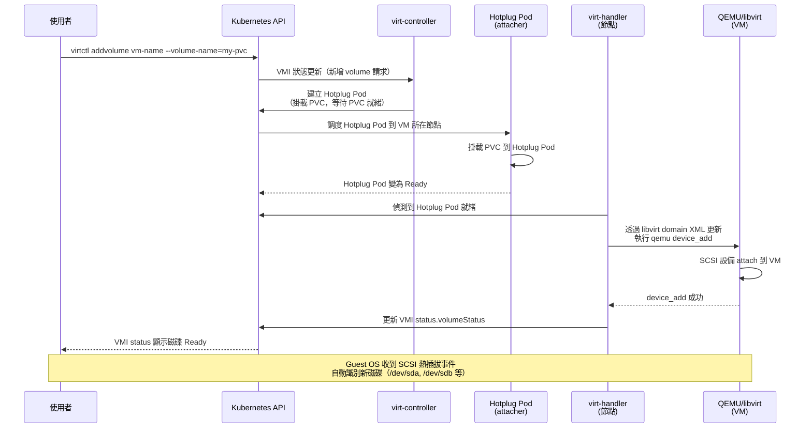
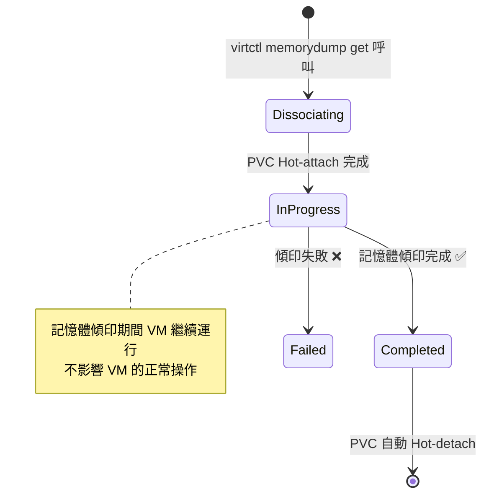

# 熱插拔 (Hotplug) — 執行時動態管理儲存

熱插拔（Hotplug）讓你可以在 VM 運行期間，**不停機**地新增或移除磁碟。這項功能類似公有雲 VM 的彈性磁碟掛載（如 AWS 的 Attach Volume），讓儲存管理更靈活。

## Hotplug 概念說明

### 什麼是 Hotplug？

在傳統虛擬化環境中，新增磁碟通常需要關機、修改設定、再開機。KubeVirt 的 Hotplug 功能讓這個流程完全在線上完成：

```
VM 運行中 → 附加新磁碟 → Guest OS 自動識別新磁碟 → 立即可用
```

### 使用場景

| 場景 | 說明 |
|------|------|
| **動態擴展儲存** | 資料庫 VM 空間不足，即時附加新磁碟 |
| **臨時附加資料磁碟** | 附加備份磁碟、進行資料遷移後再移除 |
| **共享資料磁碟** | 將同一個 PVC 暫時附加給特定 VM 讀取資料 |
| **記憶體傾印** | 觸發 VM 記憶體傾印到 PVC 進行診斷 |
| **CI/CD 工作流** | 動態附加包含測試資料的磁碟 |

:::info 類比：雲端 VM 的彈性磁碟
這與 AWS EC2 的 `aws ec2 attach-volume`、GCP 的 `gcloud compute instances attach-disk` 功能等效。主要差異在於 KubeVirt 透過 Kubernetes API 管理，完全符合 GitOps 工作流程。
:::

### 前提條件

VM 必須有 SCSI 或 virtio-scsi 控制器才能支援 Hotplug：

```yaml
spec:
  domain:
    devices:
      # 必須有 SCSI 控制器（任選其一）
      # 方式 1：使用 SCSI（透過設定 scsi bus 的 disk 自動啟用）
      disks:
        - name: existing-disk
          disk:
            bus: scsi    # 使用 scsi bus 會自動添加 SCSI 控制器

      # 方式 2：顯式啟用 virtio-scsi 控制器（推薦）
      # 在任何 disk 使用 scsi bus 時，KubeVirt 自動加入
```

:::warning Hotplug 需要 SCSI 控制器
如果 VM 沒有任何使用 `bus: scsi` 的磁碟，可能沒有 SCSI 控制器，導致 Hotplug 操作失敗。建議在 VM 建立時就預先設定一個 SCSI 磁碟，或確保有 SCSI 控制器。
:::

---

## 支援的 Hotplug Volume 類型

| Volume 類型 | Hotplug 支援 | 說明 |
|-------------|-------------|------|
| **PersistentVolumeClaim** | ✅ 完整支援 | 標準 PVC 熱插拔 |
| **DataVolume** | ✅ 需要 Succeeded 狀態 | DV 必須已完成匯入 |
| **MemoryDump** | ⚠️ 只支援 hot-unplug | 特殊類型，用於記憶體傾印 |
| ContainerDisk | ❌ 不支援 | 不支援熱插拔 |
| ConfigMap | ❌ 不支援 | 不支援熱插拔 |
| Secret | ❌ 不支援 | 不支援熱插拔 |

:::info DataVolume 熱插拔的前提
DataVolume 必須已完成（phase = `Succeeded`）才能被熱插拔。如果 DataVolume 還在匯入中，熱插拔操作會失敗。
:::

---

## Hotplug 磁碟 Bus 類型

| Bus 類型 | Hotplug 支援 | 效能 | 需求 |
|----------|-------------|------|------|
| **scsi** | ✅ **推薦** | 中等 | SCSI 控制器（自動添加） |
| **virtio-scsi** | ✅ 支援 | 高 | virtio-scsi 控制器 |
| **virtio-blk** | ❌ 不支援 | 最高 | 靜態設定，無法 Hotplug |
| **sata** | ❌ 不支援 | 低 | 靜態設定 |
| **ide** | ❌ 不支援 | 最低 | 僅用於 CD-ROM |

:::tip 為什麼 virtio-blk 不支援 Hotplug？
virtio-blk 是點對點的塊設備驅動，每個磁碟都直接綁定到 virtio-pci 總線上。QEMU 中動態添加 PCI 設備比較複雜且有限制。而 SCSI 設計上就支援動態 hot-add/hot-remove，因此 Hotplug 使用 SCSI 更自然。
:::

---

## 命令式 vs 宣告式 Hotplug

### IsHotplugVolume vs IsDeclarativeHotplugVolume

KubeVirt 有兩種 Hotplug 機制：

| 特性 | 命令式（IsHotplugVolume） | 宣告式（IsDeclarativeHotplugVolume） |
|------|---------------------------|---------------------------------------|
| **觸發方式** | `virtctl addvolume` 命令 | 修改 VM spec（patch） |
| **持久性** | ❌ VM 重啟後消失 | ✅ VM 重啟後保留 |
| **適用場景** | 臨時附加、診斷用途 | 永久性磁碟擴展 |
| **Rollback** | 容易（`virtctl removevolume`） | 需要修改 spec |
| **GitOps 友好** | 否（命令式） | ✅ 是（宣告式） |

VMI status 中的區分：

```yaml
status:
  volumeStatus:
    - name: hotplug-disk
      hotplugVolume:
        attachPodName: hp-volume-xxxx
      # 命令式：
      # isHotplugVolume: true
      # 宣告式：
      # isDeclarativeHotplugVolume: true
      phase: Ready
      target: sda
      reason: VolumeReady
```

:::tip 生產環境建議
- 使用**宣告式 Hotplug**（修改 VM spec）來永久新增磁碟，這樣 VM 重啟後磁碟仍然存在
- 使用**命令式 Hotplug**（`virtctl addvolume`）來臨時附加磁碟（如診斷、資料遷移）
- 宣告式 Hotplug 完全符合 GitOps 工作流程，可以版本控制 VM 的磁碟配置
:::

---

## Hotplug 操作流程

### 內部實作流程詳解



### Hotplug Pod 的作用

Hotplug Pod（也稱為 attacher pod）是 KubeVirt 的內部機制：
- 它在 VM 所在的節點上運行
- 它掛載目標 PVC，使 PVC 在該節點上可存取
- virt-handler 透過這個 Pod 的掛載點，讓 QEMU 可以存取磁碟

```bash
# 查看正在進行 Hotplug 的 Pod
kubectl get pods -l kubevirt.io=hotplug-pod -n default

# 查看 Hotplug Pod 詳細資訊
kubectl describe pod hp-volume-<hash> -n default
```

---

## 使用 virtctl 進行 Hotplug 操作

### 新增 Hotplug 磁碟

```bash
# 基本語法
virtctl addvolume <VM_NAME> --volume-name=<PVC_或_DV_NAME> [選項]

# 範例 1：最簡單的 Hotplug
virtctl addvolume my-vm --volume-name=my-data-pvc

# 範例 2：指定序列號（方便 Guest OS 識別）
virtctl addvolume my-vm \
  --volume-name=my-data-pvc \
  --serial=MY-DISK-001

# 範例 3：完整參數
virtctl addvolume my-vm \
  --volume-name=my-data-pvc \
  --disk-type=disk \        # disk 或 lun
  --bus=scsi \              # scsi 或 sata（Hotplug 只支援 scsi）
  --serial=DATADISK01 \     # 磁碟序列號
  --cache=none              # 快取策略：none, writethrough, writeback

# 範例 4：在特定 Namespace
virtctl addvolume my-vm \
  --volume-name=my-data-pvc \
  -n production
```

### 移除 Hotplug 磁碟

```bash
# 基本語法
virtctl removevolume <VM_NAME> --volume-name=<PVC_或_DV_NAME>

# 範例
virtctl removevolume my-vm --volume-name=my-data-pvc

# 強制移除（即使 Guest OS 未卸載）
virtctl removevolume my-vm \
  --volume-name=my-data-pvc \
  --force
```

:::danger 移除前請先在 Guest OS 卸載磁碟
在執行 `removevolume` 前，強烈建議先在 VM 內部卸載（umount）磁碟並使其離線，以避免資料損毀：

```bash
# 在 VM 內部執行
sudo umount /dev/sdb
sudo sh -c 'echo 1 > /sys/block/sdb/device/delete'   # 通知 SCSI 子系統設備移除
```
:::

### virtctl addvolume 參數說明

| 參數 | 預設值 | 說明 |
|------|--------|------|
| `--volume-name` | 必填 | PVC 或 DataVolume 的名稱 |
| `--disk-type` | `disk` | 磁碟類型：`disk`（一般磁碟）或 `lun`（裸設備） |
| `--bus` | `scsi` | 磁碟 bus：`scsi`（目前 Hotplug 只支援 scsi） |
| `--serial` | 空 | 磁碟序列號，Guest OS 可透過此識別磁碟 |
| `--cache` | `none` | QEMU 快取策略：`none`, `writethrough`, `writeback` |
| `--persist` | `false` | 是否在 VM spec 中持久化（使用宣告式方式更推薦） |

---

## 宣告式 Hotplug（推薦方式）

宣告式 Hotplug 透過直接修改 VM spec 的 `volumes` 和 `disks` 來新增磁碟。如果 VM 正在運行，KubeVirt 會自動執行 Hotplug；如果 VM 已停止，下次啟動時磁碟就會出現。

### 使用 kubectl patch 新增磁碟

```bash
# 新增一個 PVC 磁碟到正在運行的 VM
kubectl patch vm my-vm --type='json' -p='[
  {
    "op": "add",
    "path": "/spec/template/spec/domain/devices/disks/-",
    "value": {
      "name": "hotplug-disk",
      "disk": {
        "bus": "scsi"
      },
      "serial": "HOTPLUG001"
    }
  },
  {
    "op": "add",
    "path": "/spec/template/spec/volumes/-",
    "value": {
      "name": "hotplug-disk",
      "persistentVolumeClaim": {
        "claimName": "my-data-pvc"
      }
    }
  }
]'
```

### 使用 YAML patch 檔案

```yaml
# hotplug-patch.yaml
spec:
  template:
    spec:
      domain:
        devices:
          disks:
            - name: hotplug-disk
              disk:
                bus: scsi
              serial: HOTPLUG001
      volumes:
        - name: hotplug-disk
          persistentVolumeClaim:
            claimName: my-data-pvc
```

```bash
# 套用 patch（使用 merge patch）
kubectl patch vm my-vm --type=merge -p "$(cat hotplug-patch.yaml)"
```

### 移除宣告式 Hotplug 磁碟

```bash
# 查看目前磁碟列表的索引
kubectl get vm my-vm -o jsonpath='{.spec.template.spec.domain.devices.disks}' | jq

# 使用 JSON Patch 移除特定磁碟（假設索引為 1）
kubectl patch vm my-vm --type='json' -p='[
  {"op": "remove", "path": "/spec/template/spec/domain/devices/disks/1"},
  {"op": "remove", "path": "/spec/template/spec/volumes/1"}
]'
```

---

## MemoryDump Volume 特殊說明

MemoryDump 是一種特殊的 Hotplug Volume，專門用於將 VM 的記憶體內容傾印（dump）到 PVC 中，常用於：
- **VM 故障診斷**：捕捉 VM 異常狀態下的記憶體快照
- **安全分析**：記憶體鑑識（Memory Forensics）
- **VM 狀態保存**：保存特定時間點的記憶體狀態

### MemoryDump 的獨特行為

```
virtctl memorydump get → PVC hot-attach → 記憶體傾印開始 → 傾印完成 → PVC 自動 hot-detach
```

與一般 Hotplug 不同：
- **只能 Hot-unplug**：傾印完成後 PVC 自動移除（不能手動 re-attach 同一個 memory dump PVC）
- **自動命名**：磁碟裝置名稱固定
- **特殊格式**：傾印檔案格式為 QEMU raw 格式

### 操作指令

```bash
# 觸發記憶體傾印（PVC 必須預先建立，大小需 >= VM 記憶體大小）
virtctl memorydump get my-vm --claim-name=memory-dump-pvc

# 等待傾印完成
kubectl get vm my-vm -o jsonpath='{.status.memoryDumpRequest}'

# 移除記憶體傾印（清除 VM spec 中的 memoryDump 記錄）
virtctl memorydump remove my-vm

# 查看傾印狀態
kubectl get vm my-vm -o jsonpath='{.status.memoryDumpRequest.phase}'
```

### MemoryDump Phase



### MemoryDump PVC 需求

```yaml
# MemoryDump 用的 PVC 需求：
# 1. 大小 >= VM 記憶體大小（建議多留 10-20%）
# 2. AccessMode: ReadWriteOnce 即可
# 3. volumeMode: Filesystem（Block mode 不支援）
apiVersion: v1
kind: PersistentVolumeClaim
metadata:
  name: memory-dump-pvc
  namespace: default
spec:
  accessModes:
    - ReadWriteOnce
  volumeMode: Filesystem
  resources:
    requests:
      storage: 10Gi   # VM 有 8Gi 記憶體，多準備 2Gi
  storageClassName: standard
```

---

## Serial Number 設定

為熱插拔磁碟設定 serial number 可以讓 Guest OS 更容易識別和管理磁碟，避免裝置名稱（如 `/dev/sdb`）在不同情況下變動。

### 設定方式

```yaml
# 在 VM spec 中設定 serial
disks:
  - name: data-disk
    disk:
      bus: scsi
    serial: "MYDATA001"   # 自訂序列號（最長 20 個字元）
```

### Linux 中透過 Serial Number 識別磁碟

```bash
# 方式 1：透過 by-id 路徑（推薦，路徑不會隨裝置順序變動）
ls -la /dev/disk/by-id/ | grep MYDATA001
# 輸出類似：
# lrwxrwxrwx ... scsi-MYDATA001 -> ../../sdb

# 方式 2：使用完整路徑
ls -la /dev/disk/by-id/scsi-0QEMU_QEMU_HARDDISK_MYDATA001

# 方式 3：使用 udevadm 查詢
udevadm info /dev/sdb | grep ID_SERIAL

# 穩定的掛載方式（使用 by-id 路徑）
mount /dev/disk/by-id/scsi-0QEMU_QEMU_HARDDISK_MYDATA001 /data

# 在 /etc/fstab 中使用 by-id 路徑（避免設備名稱漂移）
echo "/dev/disk/by-id/scsi-0QEMU_QEMU_HARDDISK_MYDATA001 /data ext4 defaults 0 0" >> /etc/fstab
```

:::tip Serial Number 最佳實踐
- Serial number 應具有業務意義（如 `PROD-DB-DATA-01`）
- 長度限制：最多 20 個字元
- 只能使用字母、數字、連字號（`-`）、下底線（`_`）
- 在同一個 VM 中，serial number 必須唯一
:::

---

## 完整 YAML 範例與 virtctl 指令

### 範例 1：建立可用於熱插拔的 PVC

```yaml
# 建立空白 PVC 用於 Hotplug
apiVersion: v1
kind: PersistentVolumeClaim
metadata:
  name: hotplug-data-disk
  namespace: default
  labels:
    app: vm-storage
    purpose: hotplug
spec:
  accessModes:
    - ReadWriteOnce
  volumeMode: Filesystem
  resources:
    requests:
      storage: 50Gi
  storageClassName: standard
---
# 或者，使用 DataVolume 建立帶資料的磁碟
apiVersion: cdi.kubevirt.io/v1beta1
kind: DataVolume
metadata:
  name: hotplug-data-dv
  namespace: default
spec:
  source:
    blank: {}
  storage:
    resources:
      requests:
        storage: 50Gi
    storageClassName: standard
    accessModes:
      - ReadWriteOnce
```

### 範例 2：支援 Hotplug 的 VM 基礎配置

```yaml
apiVersion: kubevirt.io/v1
kind: VirtualMachine
metadata:
  name: vm-hotplug-ready
  namespace: default
spec:
  running: true
  template:
    metadata:
      labels:
        kubevirt.io/vm: vm-hotplug-ready
    spec:
      domain:
        cpu:
          cores: 2
        memory:
          guest: 4Gi
        devices:
          disks:
            # OS 磁碟（virtio-blk，不支援 Hotplug，但效能最好）
            - name: osdisk
              disk:
                bus: virtio
              bootOrder: 1
            # 預先建立的 SCSI 磁碟（確保 SCSI 控制器存在）
            # 即使只有一個 SCSI 磁碟，也會自動建立 SCSI 控制器
            - name: scsi-placeholder
              disk:
                bus: scsi    # 這個 disk 確保 VM 有 SCSI 控制器
            - name: cloudinitdisk
              disk:
                bus: virtio
          interfaces:
            - name: default
              masquerade: {}
      networks:
        - name: default
          pod: {}
      volumes:
        - name: osdisk
          dataVolume:
            name: vm-hotplug-ready-osdisk
        # SCSI placeholder 磁碟（小型，用於確保 SCSI 控制器存在）
        - name: scsi-placeholder
          emptyDisk:
            capacity: 1Gi
        - name: cloudinitdisk
          cloudInitNoCloud:
            userData: |
              #cloud-config
              hostname: vm-hotplug-ready
              ssh_authorized_keys:
                - ssh-rsa AAAAB3NzaC1yc2EAAAADAQAB... user@host
  dataVolumeTemplates:
    - metadata:
        name: vm-hotplug-ready-osdisk
      spec:
        source:
          http:
            url: "https://cloud-images.ubuntu.com/jammy/current/jammy-server-cloudimg-amd64.img"
        storage:
          resources:
            requests:
              storage: 20Gi
          storageClassName: standard
          accessModes:
            - ReadWriteOnce
```

### 範例 3：使用 virtctl addvolume 熱插拔磁碟

```bash
# 步驟 1：確認 VM 正在運行
kubectl get vm vm-hotplug-ready

# 步驟 2：確認 PVC 存在且可用
kubectl get pvc hotplug-data-disk

# 步驟 3：執行熱插拔（命令式，重啟後消失）
virtctl addvolume vm-hotplug-ready \
  --volume-name=hotplug-data-disk \
  --serial=HOTDATA001 \
  --bus=scsi \
  --cache=none

# 步驟 4：確認 Hotplug 狀態
kubectl get vmi vm-hotplug-ready -o jsonpath='{.status.volumeStatus}' | jq

# 預期輸出：
# [
#   {
#     "name": "hotplug-data-disk",
#     "hotplugVolume": {
#       "attachPodName": "hp-volume-xxxx-yyyy"
#     },
#     "phase": "Ready",
#     "target": "sda",
#     "reason": "VolumeReady"
#   }
# ]

# 步驟 5：在 VM 內確認磁碟已出現
# （需要先 SSH 進入 VM）
# lsblk
# ls -la /dev/disk/by-id/ | grep HOTDATA001
```

### 範例 4：宣告式熱插拔（patch VM spec，推薦）

```bash
# 使用 kubectl patch 宣告式新增磁碟
kubectl patch vm vm-hotplug-ready --type='json' -p='
[
  {
    "op": "add",
    "path": "/spec/template/spec/domain/devices/disks/-",
    "value": {
      "name": "persistent-data-disk",
      "disk": {"bus": "scsi"},
      "serial": "PERSIST001",
      "cache": "none"
    }
  },
  {
    "op": "add",
    "path": "/spec/template/spec/volumes/-",
    "value": {
      "name": "persistent-data-disk",
      "persistentVolumeClaim": {
        "claimName": "hotplug-data-disk"
      }
    }
  }
]'

# 確認 VM spec 已更新
kubectl get vm vm-hotplug-ready -o jsonpath='{.spec.template.spec.volumes}' | jq

# 確認 VMI（正在運行的實例）狀態
kubectl get vmi vm-hotplug-ready -o jsonpath='{.status.volumeStatus}' | jq
```

### 範例 5：移除熱插拔磁碟

```bash
# 方式 1：移除命令式熱插拔磁碟
# 先在 VM 內卸載磁碟
ssh user@vm-ip "sudo umount /data && sudo sh -c 'echo 1 > /sys/block/sda/device/delete'"

# 然後執行 removevolume
virtctl removevolume vm-hotplug-ready \
  --volume-name=hotplug-data-disk

# 方式 2：移除宣告式熱插拔磁碟
# 先確認磁碟在 spec 中的索引
kubectl get vm vm-hotplug-ready \
  -o jsonpath='{.spec.template.spec.domain.devices.disks}' | jq

# 使用 JSON patch 移除（假設磁碟在索引 2，volume 也在索引 2）
kubectl patch vm vm-hotplug-ready --type='json' -p='
[
  {"op": "remove", "path": "/spec/template/spec/domain/devices/disks/2"},
  {"op": "remove", "path": "/spec/template/spec/volumes/2"}
]'
```

### 範例 6：MemoryDump 操作完整流程

```yaml
# 步驟 1：建立 MemoryDump 用的 PVC（大小需 >= VM 記憶體）
apiVersion: v1
kind: PersistentVolumeClaim
metadata:
  name: vm-memory-dump
  namespace: default
spec:
  accessModes:
    - ReadWriteOnce
  volumeMode: Filesystem
  resources:
    requests:
      storage: 10Gi   # VM 有 4Gi RAM，多準備空間給 dump 檔案 header
  storageClassName: standard
```

```bash
# 步驟 2：觸發記憶體傾印
virtctl memorydump get vm-hotplug-ready \
  --claim-name=vm-memory-dump

# 步驟 3：監控傾印進度
watch kubectl get vm vm-hotplug-ready \
  -o jsonpath='{.status.memoryDumpRequest}'

# 步驟 4：等待傾印完成（phase = Completed）
kubectl wait vm vm-hotplug-ready \
  --for=jsonpath='{.status.memoryDumpRequest.phase}'=Completed \
  --timeout=300s

# 步驟 5：查看傾印結果
kubectl describe pvc vm-memory-dump
# 傾印檔案位於 PVC 的 memory.dump 路徑

# 步驟 6：可選 - 將傾印檔案複製出來分析
# 建立一個臨時 Pod 掛載 PVC 並複製檔案
kubectl run dump-reader --image=alpine --restart=Never \
  --overrides='
  {
    "spec": {
      "volumes": [{"name": "dump", "persistentVolumeClaim": {"claimName": "vm-memory-dump"}}],
      "containers": [{"name": "reader", "image": "alpine",
        "command": ["sleep", "3600"],
        "volumeMounts": [{"name": "dump", "mountPath": "/dump"}]}]
    }
  }'

kubectl cp dump-reader:/dump/memory.dump ./vm-memory-$(date +%Y%m%d%H%M%S).dump
kubectl delete pod dump-reader

# 步驟 7：清除 VM 中的 memoryDump 記錄
virtctl memorydump remove vm-hotplug-ready
```

---

## Hotplug 狀態監控

```bash
# 查看 VMI 中所有 volume 的狀態
kubectl get vmi my-vm -o jsonpath='{.status.volumeStatus}' | jq '.[] | {name: .name, phase: .phase, target: .target}'

# 查看 Hotplug Pod
kubectl get pods -l kubevirt.io=hotplug-pod

# 查看 KubeVirt 控制器日誌（排查 Hotplug 問題）
kubectl logs -n kubevirt -l kubevirt.io=virt-controller -f | grep -i hotplug

# 查看 virt-handler 日誌（節點端）
kubectl logs -n kubevirt -l kubevirt.io=virt-handler --field-selector spec.nodeName=<node-name> -f
```

:::info Hotplug 常見問題排查

**問題 1：`virtctl addvolume` 後磁碟沒有出現在 VM 中**
```bash
# 查看 VMI 事件
kubectl describe vmi my-vm | grep -A 20 Events

# 查看 Hotplug Pod 是否在正確節點
kubectl get pods -l kubevirt.io=hotplug-pod -o wide
```

**問題 2：DataVolume 熱插拔失敗**
```bash
# 確認 DataVolume 是否已完成
kubectl get dv my-dv -o jsonpath='{.status.phase}'
# 必須顯示 Succeeded 才能熱插拔
```

**問題 3：Guest OS 沒有識別到新磁碟**
```bash
# 在 VM 內執行：掃描 SCSI 總線
echo "- - -" | sudo tee /sys/class/scsi_host/host*/scan
lsblk   # 應該能看到新磁碟
```
:::
