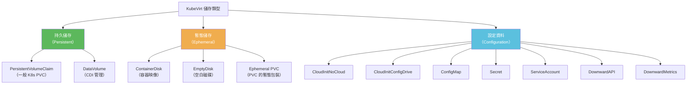
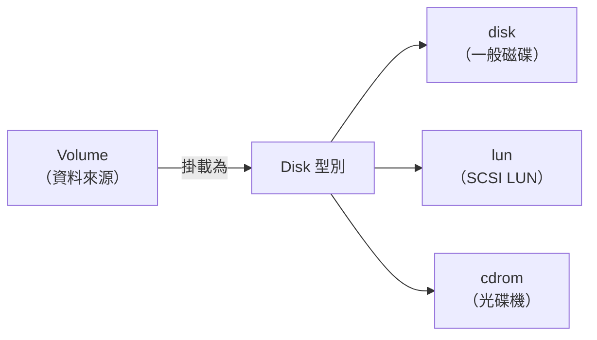
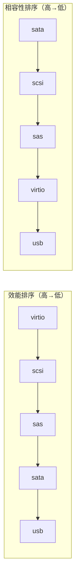
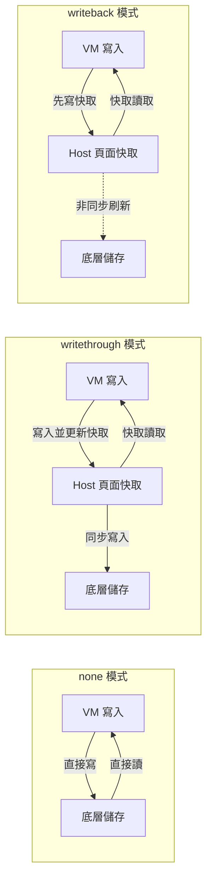
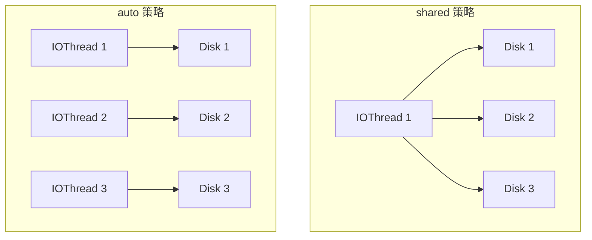
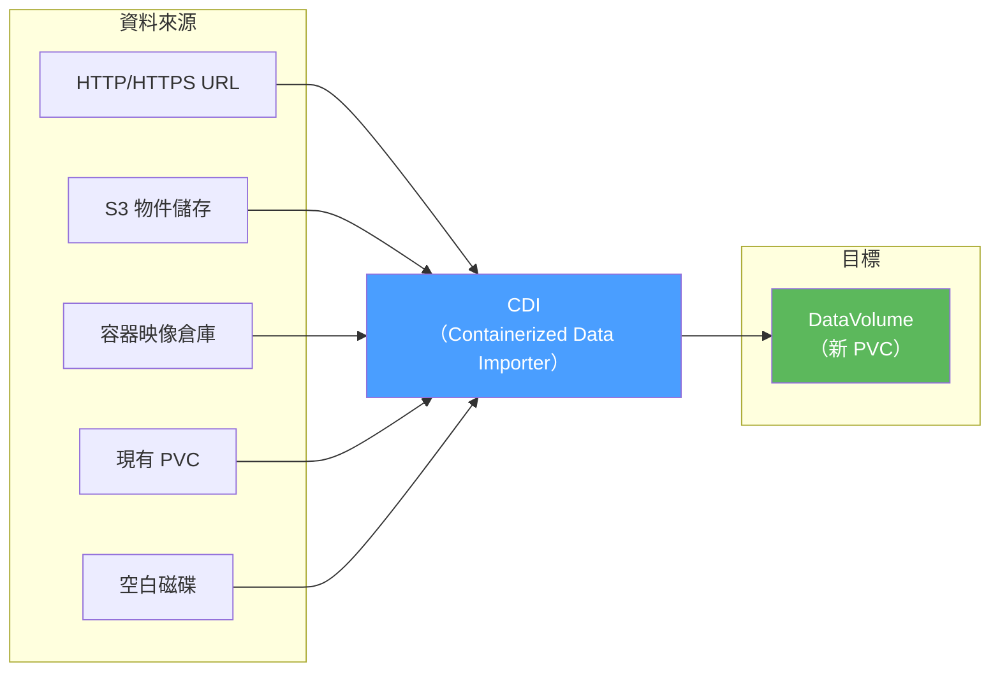
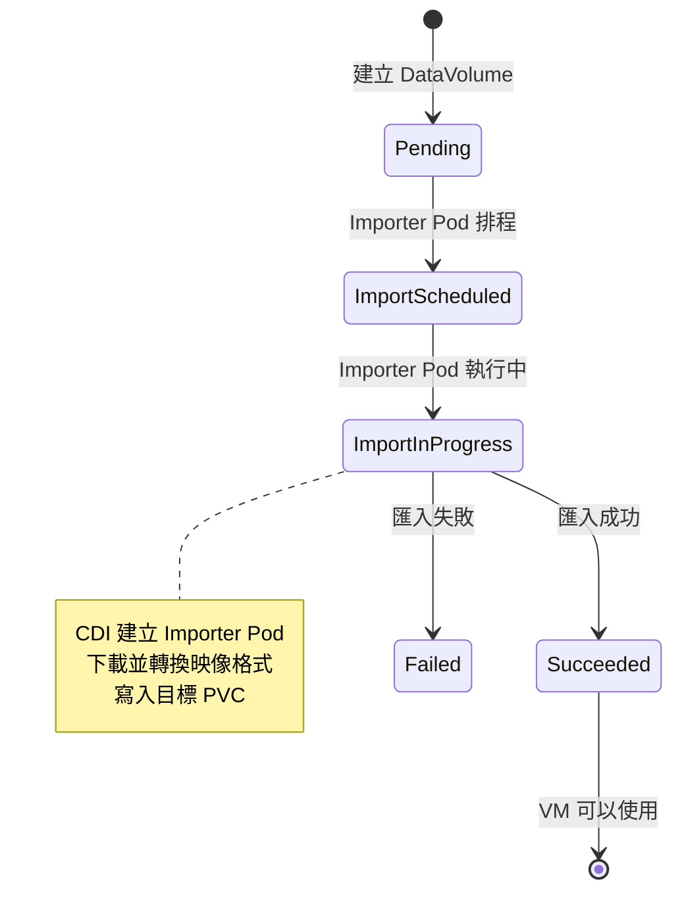
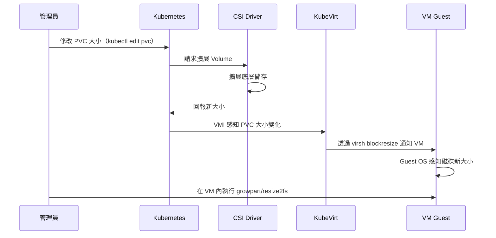
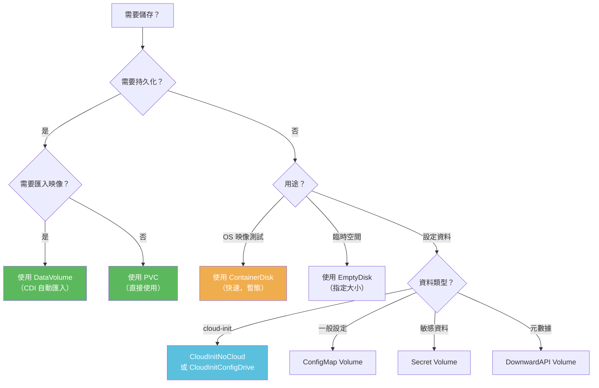

# KubeVirt 儲存架構總覽

KubeVirt 為虛擬機器提供了豐富的儲存選項，從持久化磁碟到暫態磁碟，從設定資料到雲端初始化，本文全面介紹 KubeVirt 的儲存架構。

:::info 學習目標
閱讀本文後，您將了解：
- 所有支援的 Volume 類型及其適用場景
- 磁碟類型（Disk/LUN/CDRom）的差異
- 效能相關設定（Bus、Cache、IO 模式）
- 如何與 CDI 整合自動匯入 OS 映像
- 線上磁碟擴展的操作方式
:::

---

## 儲存分類概覽



---

## 所有 Volume 類型完整對比

| Volume 類型 | 持久性 | Access Mode | 熱插拔 | 主要用途 |
|------------|--------|-------------|--------|---------|
| **PersistentVolumeClaim** | ✅ 持久 | RWO / RWX | ✅ 支援 | 一般持久化儲存，VM 主磁碟 |
| **DataVolume** | ✅ 持久 | RWO / RWX | ✅ 支援 | CDI 管理，支援自動匯入/克隆 |
| **ContainerDisk** | ❌ 暫態 | ReadOnly | ❌ | 容器映像中的磁碟，重啟消失 |
| **EmptyDisk** | ❌ 暫態 | ReadWrite | ❌ | 臨時空白磁碟，需指定大小 |
| **HostDisk** | 依節點 | ReadWrite | ❌ | 使用節點上的實際磁碟文件 |
| **CloudInitNoCloud** | ❌ 暫態 | ReadOnly | ❌ | cloud-init NoCloud 資料來源 |
| **CloudInitConfigDrive** | ❌ 暫態 | ReadOnly | ❌ | cloud-init ConfigDrive 資料來源 |
| **ConfigMap** | K8s 管理 | ReadOnly | ❌ | 掛載 K8s ConfigMap 為磁碟 |
| **Secret** | K8s 管理 | ReadOnly | ❌ | 掛載 K8s Secret 為磁碟（敏感資料）|
| **ServiceAccount** | K8s 管理 | ReadOnly | ❌ | 掛載 ServiceAccount JWT token |
| **DownwardAPI** | K8s 管理 | ReadOnly | ❌ | 掛載 Pod/VMI 元數據為磁碟 |
| **DownwardMetrics** | 動態 | ReadOnly | ❌ | virtio-serial 裝置，提供 VM metrics |
| **MemoryDump** | 暫態 | WriteOnly | 僅 unplug | 記憶體傾印（hot-unplug only）|

:::warning ContainerDisk 的暫態特性
ContainerDisk 的內容在 VM 關機或重啟後**不會保留**。它適合用於：
- 唯讀的 OS 基礎映像（配合 DataVolume 克隆使用）
- 測試環境的臨時 VM
- 無狀態工作負載

**不要**用 ContainerDisk 存放需要持久化的資料！
:::

---

## 各 Volume 類型詳細說明

### PersistentVolumeClaim (PVC)

最常見的持久儲存方式，直接使用 Kubernetes PVC。

```yaml
# 使用 PVC 的範例
volumes:
  - name: my-disk
    persistentVolumeClaim:
      claimName: my-vm-pvc      # 對應 PVC 名稱
      readOnly: false            # 是否唯讀
```

```yaml
# 對應的 PVC
apiVersion: v1
kind: PersistentVolumeClaim
metadata:
  name: my-vm-pvc
spec:
  accessModes:
    - ReadWriteOnce              # RWO：只有一個節點可讀寫
  resources:
    requests:
      storage: 50Gi
  storageClassName: fast-ssd
```

:::tip RWO vs RWX
- **ReadWriteOnce (RWO)**：只有一個節點可掛載，適合單一 VM 的主磁碟
- **ReadWriteMany (RWX)**：多個節點可同時掛載，**Live Migration 必須使用 RWX**
:::

### DataVolume

DataVolume 是 CDI（Containerized Data Importer）的核心 CRD，支援從多種來源自動匯入資料。

```yaml
# DataVolume 支援的資料來源
apiVersion: cdi.kubevirt.io/v1beta1
kind: DataVolume
metadata:
  name: fedora-dv
spec:
  source:
    # 來源選項（擇一）：

    # 1. 從 HTTP/HTTPS URL 匯入
    http:
      url: "https://download.fedoraproject.org/pub/fedora/linux/releases/38/Cloud/x86_64/images/Fedora-Cloud-Base-38-1.6.x86_64.qcow2"

    # 2. 從容器映像匯入
    # registry:
    #   url: "docker://quay.io/containerdisks/fedora:38"

    # 3. 克隆現有 PVC
    # pvc:
    #   namespace: default
    #   name: source-pvc

    # 4. 從 S3 匯入
    # s3:
    #   url: "s3://my-bucket/my-image.qcow2"
    #   secretRef: s3-credentials

    # 5. 空白 DataVolume（不匯入任何東西）
    # blank: {}

  pvc:
    accessModes:
      - ReadWriteOnce
    resources:
      requests:
        storage: 20Gi
    storageClassName: standard
```

### ContainerDisk

ContainerDisk 使用 OCI 容器映像來提供磁碟，映像中包含 `/disk` 目錄下的磁碟文件。

```yaml
# ContainerDisk 範例
volumes:
  - name: rootdisk
    containerDisk:
      image: quay.io/containerdisks/fedora:38
      imagePullPolicy: IfNotPresent   # 映像拉取策略
      # imagePullSecret: my-pull-secret  # 私有倉庫認證
```

```dockerfile
# 如何製作 ContainerDisk 映像
FROM scratch
ADD --chown=107:107 fedora.qcow2 /disk/
```

### EmptyDisk

提供一個空白的、暫態的磁碟，適合暫時資料交換。

```yaml
# EmptyDisk 範例
volumes:
  - name: scratch-disk
    emptyDisk:
      capacity: "10Gi"    # 必須指定大小
```

### HostDisk

直接使用節點上的磁碟文件，需要謹慎使用。

```yaml
# HostDisk 範例
volumes:
  - name: host-disk
    hostDisk:
      path: /mnt/data/vm-disk.img    # 節點上的文件路徑
      type: DiskOrCreate             # DiskOrCreate 或 Disk
      capacity: "50Gi"               # type 為 DiskOrCreate 時，文件不存在會建立
      shared: false                  # 是否允許多個 VM 共享
```

:::danger HostDisk 安全性警告
HostDisk 需要 `hostPath` 類型的 Volume，這會降低 Pod 的安全性隔離。建議只在以下情況使用：
- 非生產測試環境
- 需要訪問特定節點本地 NVMe 的高效能場景
- 明確了解安全影響的情況
:::

### CloudInitNoCloud

提供 cloud-init 的 NoCloud 資料來源，這是最常用的 VM 初始化方式。

```yaml
# CloudInitNoCloud 範例
volumes:
  - name: cloudinit
    cloudInitNoCloud:
      # 方法 1：直接嵌入 user-data
      userData: |
        #cloud-config
        hostname: my-vm
        user: ubuntu
        password: ubuntu
        chpasswd:
          expire: false
        ssh_authorized_keys:
          - ssh-rsa AAAA...your-public-key...
        packages:
          - nginx
          - vim
        runcmd:
          - systemctl enable nginx
          - systemctl start nginx

      # 方法 2：network-data
      networkData: |
        version: 2
        ethernets:
          enp1s0:
            dhcp4: true

      # 方法 3：從 Secret 載入（適合含密碼的設定）
      # userDataSecretRef:
      #   name: cloud-init-secret

      # 方法 4：Base64 編碼（不常用）
      # userDataBase64: "I2Nsb3VkLWNvbmZpZw=="
```

### CloudInitConfigDrive

OpenStack 風格的 cloud-init 資料來源，適合相容 OpenStack 的環境。

```yaml
volumes:
  - name: cloudinit-cd
    cloudInitConfigDrive:
      userData: |
        #cloud-config
        hostname: my-openstack-vm
```

### ConfigMap 與 Secret

將 Kubernetes 的 ConfigMap 或 Secret 掛載為磁碟（ISO 格式），VM 可以讀取其中的文件。

```yaml
# ConfigMap Volume 範例
volumes:
  - name: config-volume
    configMap:
      name: my-app-config
      # 可選：只掛載部分 key
      # items:
      #   - key: app.conf
      #     path: application.conf  # VM 中的文件名

# Secret Volume 範例（適合憑證、密鑰等）
  - name: tls-certs
    secret:
      secretName: my-tls-cert
      # items:
      #   - key: tls.crt
      #     path: server.crt
      #   - key: tls.key
      #     path: server.key
```

:::info ConfigMap/Secret 在 VM 中的位置
掛載到 VM 後，這些資料以 ISO 9660 格式呈現。VM 需要掛載對應磁碟才能讀取：
```bash
# 在 VM 內執行
mount /dev/sdX /mnt/config
ls /mnt/config/
```
:::

### DownwardAPI

將 Pod/VMI 的元數據（labels、annotations 等）暴露給 VM。

```yaml
volumes:
  - name: downward-api
    downwardAPI:
      fields:
        - path: "labels"
          fieldRef:
            fieldPath: metadata.labels
        - path: "namespace"
          fieldRef:
            fieldPath: metadata.namespace
        - path: "cpu-request"
          resourceFieldRef:
            containerName: compute
            resource: requests.cpu
```

### DownwardMetrics

特殊的 virtio-serial 裝置，讓 VM 可以透過標準介面獲取自身的效能指標。

```yaml
volumes:
  - name: downwardmetrics
    downwardMetrics: {}   # 無需額外設定
```

```bash
# 在 VM 內使用 virtio-serial 讀取 metrics
# 需要 vhostmd 或 vm-dump-metrics 工具
vm-dump-metrics | jq .
```

---

## Disk 型別說明

在 VMI spec 的 `devices.disks` 中，每個磁碟可以選擇不同的**呈現型別**：



### Disk（一般磁碟）

最常用的磁碟型別，支援多種 bus 類型：

```yaml
devices:
  disks:
    - name: rootdisk
      disk:
        bus: virtio       # virtio / sata / scsi / usb / sas
        readonly: false
        pciAddress: "0000:07:00.0"   # 可選：指定 PCI 地址
```

### LUN（SCSI 直通）

提供原始 SCSI 裝置存取，支援 SCSI 命令直通，適用於需要完整 SCSI 語義的場景（如叢集文件系統、多路徑等）：

```yaml
devices:
  disks:
    - name: scsi-lun
      lun:
        bus: scsi         # LUN 類型只支援 scsi
        readonly: false
        reservation: true  # 支援 SCSI reservation（叢集必要）
```

:::tip LUN 適用場景
- SCSI 持久預留（用於 Windows Server Failover Cluster）
- 多路徑（MPIO）
- SAN 儲存直通
- Oracle RAC 等需要 SCSI PR 的叢集資料庫
:::

### CDRom（唯讀光碟機）

唯讀的 ISO 掛載，常用於 cloud-init 資料和 OS 安裝映像：

```yaml
devices:
  disks:
    - name: cloudinit-iso
      cdrom:
        bus: sata         # CDRom 通常使用 sata 或 ide
        readonly: true
        tray: closed      # closed 或 open
```

---

## 磁碟 Bus 類型詳解

| Bus 類型 | 效能 | 相容性 | 熱插拔 | 說明 |
|---------|------|--------|--------|------|
| **virtio** | ⭐⭐⭐⭐⭐ 最高 | 需要 virtio 驅動 | ✅ 支援 (SCSI) | 推薦用於 Linux VM |
| **sata** | ⭐⭐ | ⭐⭐⭐⭐⭐ 最高 | ❌ | 推薦用於 Windows VM 或舊版 OS |
| **scsi** | ⭐⭐⭐⭐ | ⭐⭐⭐⭐ | ✅ 支援 | 支援 SCSI 命令和熱插拔 |
| **usb** | ⭐ | ⭐⭐⭐⭐ | ✅ 支援 | 適合小型設定資料 |
| **sas** | ⭐⭐⭐ | ⭐⭐⭐ | ✅ 支援 | SAS 協定 |



:::tip Windows VM 的磁碟設定
Windows 預設不包含 virtio 驅動，建議：
1. 主磁碟使用 `sata` bus（確保 Windows 能讀取）
2. 或在 Windows 安裝時同時掛載 virtio 驅動 ISO
3. 安裝 virtio 驅動後，再切換到 `virtio` bus 以獲得更好效能
:::

---

## 磁碟 Cache 模式

Cache 模式控制 QEMU 對 host 頁面快取的使用方式：

```yaml
devices:
  disks:
    - name: my-disk
      disk:
        bus: virtio
      cache: none           # none / writethrough / writeback
```

### Cache 模式比較

| Cache 模式 | 讀取快取 | 寫入快取 | 資料安全 | 效能 | 適用場景 |
|-----------|---------|---------|---------|------|---------|
| **none** | ❌ | ❌ | ⭐⭐⭐⭐⭐ 最安全 | 中等 | 生產環境，需要 O_DIRECT |
| **writethrough** | ✅ | ❌ | ⭐⭐⭐⭐ 安全 | 中高 | 讀多寫少的工作負載 |
| **writeback** | ✅ | ✅ | ⭐⭐ 風險 | ⭐⭐⭐⭐⭐ 最高 | 開發測試（系統崩潰可能丟資料） |



:::danger writeback 的資料風險
使用 `writeback` 模式時，如果 host 系統崩潰（kernel panic、斷電），頁面快取中尚未刷到儲存的資料將**永久丟失**。生產環境強烈建議使用 `none`。
:::

---

## IO 模式詳解

IO 模式控制 QEMU 執行磁碟 I/O 的底層機制：

```yaml
devices:
  disks:
    - name: my-disk
      disk:
        bus: virtio
      io: native          # native / default / threads
```

| IO 模式 | 機制 | 需求 | 適用場景 |
|--------|------|------|---------|
| **native** | Linux AIO (io_submit) | 需要 O_DIRECT（即 cache: none） | 區塊裝置，最低延遲 |
| **default** | QEMU 自動選擇 | 無 | 通用，讓 QEMU 決定 |
| **threads** | QEMU thread pool | 無 | 非區塊裝置（文件、網路儲存） |

:::tip native AIO 的最佳實踐
使用 `native` IO 模式時，必須同時設定 `cache: none`（強制 O_DIRECT），否則 AIO 無效。
```yaml
cache: none
io: native
```
這個組合對底層區塊裝置（NVMe、SAN）有最佳效能。
:::

---

## IOThreadsPolicy

IOThreads 是 QEMU 中專門處理磁碟 I/O 的執行緒，與 vCPU 執行緒分離：

```yaml
spec:
  domain:
    iothreadsPolicy: shared    # shared / auto
    devices:
      disks:
        - name: disk1
          disk:
            bus: virtio
          dedicatedIOThread: true   # 此磁碟使用獨立 IO thread
        - name: disk2
          disk:
            bus: virtio
```

| 策略 | 說明 | 適用場景 |
|------|------|---------|
| **shared** | 所有磁碟共用一個 IO thread | 磁碟數量少，I/O 壓力低 |
| **auto** | KubeVirt 自動為每個磁碟分配 IO thread | 多磁碟，高 I/O 場景 |



---

## Volume 狀態追蹤（VolumeStatus）

KubeVirt 在 VMI 的 `.status.volumeStatus` 中追蹤每個 Volume 的狀態：

```bash
# 查看 VMI 的 Volume 狀態
kubectl get vmi my-vm -o jsonpath='{.status.volumeStatus}' | jq .
```

```json
[
  {
    "name": "rootdisk",
    "target": "vda",
    "phase": "Ready",
    "reason": "VolumeReady",
    "size": 21474836480,
    "persistentVolumeClaimInfo": {
      "filesystemOverhead": "0.055",
      "capacity": {
        "storage": "20Gi"
      },
      "accessModes": ["ReadWriteOnce"]
    }
  },
  {
    "name": "hotplug-data",
    "target": "sda",
    "phase": "Ready",
    "hotplugVolume": {
      "attachPodName": "hp-volume-attach-pod-xxxxx",
      "attachPodUID": "abc123"
    }
  }
]
```

| 欄位 | 說明 |
|------|------|
| `name` | Volume 名稱（對應 spec 中的名稱） |
| `target` | 在 VM 中的裝置名（如 `vda`, `sdb`） |
| `phase` | 狀態：`Pending` / `Bound` / `Ready` / `PVCNotFound` |
| `reason` | 狀態詳細說明 |
| `size` | 磁碟大小（bytes） |
| `hotplugVolume` | 熱插拔相關資訊（僅熱插拔磁碟有此欄位） |
| `filesystemOverhead` | 文件系統 overhead 比例 |

---

## 與 CDI（Containerized Data Importer）的整合

### CDI 的功能

CDI 是 KubeVirt 的資料匯入元件，提供：



### DataVolume 生命周期



```bash
# 監控 DataVolume 匯入進度
kubectl get datavolume my-dv -w

# 查看匯入詳情
kubectl describe datavolume my-dv

# 查看 Importer Pod 日誌
kubectl logs -l app=containerized-data-importer
```

### CDI 克隆功能

```yaml
# 跨 namespace 克隆 DataVolume
apiVersion: cdi.kubevirt.io/v1beta1
kind: DataVolume
metadata:
  name: cloned-vm-disk
  namespace: target-ns
spec:
  source:
    pvc:
      namespace: source-ns
      name: golden-image-pvc    # 黃金映像
  pvc:
    accessModes:
      - ReadWriteOnce
    resources:
      requests:
        storage: 20Gi
```

:::tip 黃金映像（Golden Image）模式
建議的生產環境做法：
1. 建立一個**唯讀黃金映像** PVC（包含基礎 OS 和設定）
2. 每個新 VM 都從黃金映像**克隆** DataVolume
3. 克隆操作由 CDI 高效完成（支援 CSI Volume Clone）

這樣可以快速建立 VM，且黃金映像保持乾淨不被修改。
:::

---

## 磁碟擴展（Disk Expansion）

### 線上擴展 PVC

KubeVirt 支援在 VM 執行中擴展磁碟，需要底層 StorageClass 支援 `AllowVolumeExpansion`。



### 擴展步驟

```bash
# 步驟 1：確認 StorageClass 支援擴展
kubectl get storageclass fast-ssd -o yaml | grep allowVolumeExpansion
# allowVolumeExpansion: true

# 步驟 2：擴展 PVC
kubectl patch pvc my-vm-pvc -p '{"spec":{"resources":{"requests":{"storage":"100Gi"}}}}'

# 或使用 virtctl 擴展（KubeVirt v0.59+）
virtctl expand volume my-vm-pvc --size=100Gi

# 步驟 3：在 VM 內執行文件系統擴展（Linux）
# 先確認磁碟已感知新大小
lsblk
# 擴展分區
growpart /dev/vda 1
# 擴展文件系統
resize2fs /dev/vda1          # ext4
# 或
xfs_growfs /                  # xfs
```

:::info 需要 Guest OS 配合
磁碟物理大小擴展後，Guest OS 的**分區表**和**文件系統**需要獨立操作才能利用新空間。建議在 cloud-init user-data 中預設安裝 `cloud-guest-utils`（包含 `growpart`）以簡化操作。
:::

```yaml
# cloud-init 預設安裝 growpart 工具
volumes:
  - name: cloudinit
    cloudInitNoCloud:
      userData: |
        #cloud-config
        packages:
          - cloud-guest-utils
          - e2fsprogs
        runcmd:
          # 開機時自動擴展（如果磁碟已擴展）
          - growpart /dev/vda 1 || true
          - resize2fs /dev/vda1 || true
```

---

## 完整 YAML 範例

以下是一個使用多種 Volume 類型的完整 VMI 範例，展示生產環境最佳實踐：

```yaml
# 步驟 1：建立 DataVolume（從映像匯入 OS 磁碟）
apiVersion: cdi.kubevirt.io/v1beta1
kind: DataVolume
metadata:
  name: fedora-vm-disk
  namespace: default
spec:
  source:
    registry:
      url: "docker://quay.io/containerdisks/fedora:38"
  pvc:
    accessModes:
      - ReadWriteOnce
    resources:
      requests:
        storage: 30Gi
    storageClassName: fast-ssd
---
# 步驟 2：建立應用設定 ConfigMap
apiVersion: v1
kind: ConfigMap
metadata:
  name: app-config
  namespace: default
data:
  nginx.conf: |
    server {
        listen 80;
        root /var/www/html;
    }
  app.properties: |
    env=production
    log.level=INFO
---
# 步驟 3：建立敏感設定 Secret
apiVersion: v1
kind: Secret
metadata:
  name: app-secrets
  namespace: default
type: Opaque
stringData:
  db-password: "my-super-secret-password"
  api-key: "abc123-api-key"
---
# 步驟 4：建立 VirtualMachineInstance
apiVersion: kubevirt.io/v1
kind: VirtualMachineInstance
metadata:
  name: production-vm
  namespace: default
spec:
  # IO 和效能設定
  domain:
    iothreadsPolicy: auto    # 每個磁碟獨立 IO thread

    cpu:
      cores: 4
      sockets: 1
      threads: 1
      dedicatedCpuPlacement: false

    memory:
      guest: 8Gi

    devices:
      disks:
        # 主磁碟：DataVolume，virtio bus，最佳效能
        - name: rootdisk
          disk:
            bus: virtio
          cache: none          # 直接 I/O，最安全
          io: native           # 使用 Linux AIO
          dedicatedIOThread: true   # 獨立 IO thread

        # 資料磁碟：PVC，支援熱插拔
        - name: datadisk
          disk:
            bus: scsi          # scsi 支援熱插拔
          cache: none

        # 暫態磁碟：EmptyDisk，用於暫存資料
        - name: scratch
          disk:
            bus: virtio

        # 設定資料：ConfigMap
        - name: app-config
          disk:
            bus: sata          # 設定資料用 sata，相容性好
          readonly: true

        # 敏感資料：Secret
        - name: app-secrets
          disk:
            bus: sata
          readonly: true

        # cloud-init：CDRom（唯讀）
        - name: cloudinit
          cdrom:
            bus: sata
            readonly: true

      # 網路介面
      interfaces:
        - name: default
          masquerade: {}
          ports:
            - name: ssh
              port: 22
              protocol: TCP
            - name: http
              port: 80
              protocol: TCP

    # 機器類型（影響 QEMU 特性集）
    machine:
      type: "q35"              # 現代 QEMU 機器類型，支援 PCIe

    # 時鐘設定
    clock:
      utc: {}
      timer:
        hpet:
          present: false
        pit:
          tickPolicy: delay
        rtc:
          tickPolicy: catchup
        hyperv: {}

    # CPU 特性（啟用虛擬化巢狀）
    features:
      acpi: {}
      apic: {}
      smm:
        enabled: true

  networks:
    - name: default
      pod: {}

  volumes:
    # 主磁碟（DataVolume 匯入）
    - name: rootdisk
      dataVolume:
        name: fedora-vm-disk

    # 資料磁碟（既有 PVC）
    - name: datadisk
      persistentVolumeClaim:
        claimName: vm-data-pvc

    # 暫態磁碟（EmptyDisk）
    - name: scratch
      emptyDisk:
        capacity: "5Gi"

    # 應用設定（ConfigMap）
    - name: app-config
      configMap:
        name: app-config

    # 敏感設定（Secret）
    - name: app-secrets
      secret:
        secretName: app-secrets

    # Cloud-Init 初始化
    - name: cloudinit
      cloudInitNoCloud:
        userData: |
          #cloud-config
          hostname: production-vm
          user: admin
          ssh_authorized_keys:
            - ssh-rsa AAAA...your-public-key...
          packages:
            - nginx
            - cloud-guest-utils
          runcmd:
            # 自動擴展文件系統
            - growpart /dev/vda 1 || true
            - resize2fs /dev/vda1 || true
            # 掛載設定磁碟
            - mkdir -p /etc/myapp
            - mount /dev/sdb /etc/myapp || true
            # 掛載機密磁碟
            - mkdir -p /run/secrets/app
            - mount /dev/sdc /run/secrets/app || true
        networkData: |
          version: 2
          ethernets:
            enp1s0:
              dhcp4: true
              dhcp6: false
```

---

## 儲存架構決策指南



:::tip 生產環境最佳實踐建議
1. **主磁碟**：使用 DataVolume + 黃金映像克隆，StorageClass 選 RWX 以支援 Live Migration
2. **IO 設定**：主磁碟設 `cache: none, io: native, dedicatedIOThread: true`
3. **Cloud-init**：使用 CloudInitNoCloud，密碼等敏感資料用 `userDataSecretRef` 引用 Secret
4. **設定資料**：敏感設定用 Secret Volume，一般設定用 ConfigMap Volume
5. **機器類型**：使用 `q35`（現代 PCIe 架構）而非舊式 `pc`
:::
