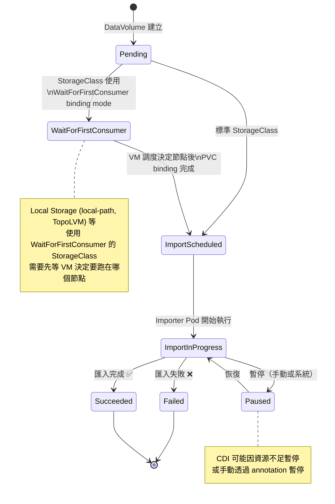
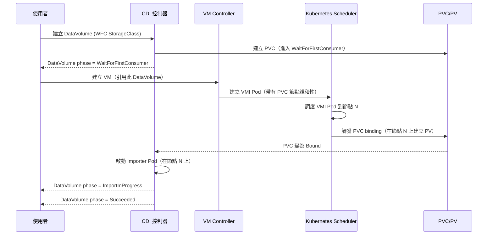

# PVC 與 DataVolume — 持久儲存管理

PersistentVolumeClaim（PVC）和 DataVolume（DV）是 KubeVirt 提供持久儲存的核心機制。與 ContainerDisk 不同，這兩種方式的資料在 VM 重啟後仍然存在，是生產環境 VM 的首選儲存方案。

## PVC 直接掛載到 VM

KubeVirt 支援將標準 Kubernetes PVC 直接掛載給 VM 作為磁碟使用。這是最直接的持久儲存方式。

### Filesystem Mode vs Block Mode

PVC 有兩種 `volumeMode`，對 VM 行為有不同影響：

| 特性 | Filesystem Mode | Block Mode |
|------|-----------------|------------|
| **volumeMode** | `Filesystem`（預設） | `Block` |
| **磁碟映像儲存位置** | PVC 掛載為目錄，映像存為 `disk.img` | PVC 直接作為塊裝置 |
| **VM 看到的磁碟** | 虛擬磁碟（透過檔案） | 虛擬磁碟（直接塊裝置） |
| **空間利用率** | 較低（檔案系統 overhead） | 高（無額外 overhead） |
| **I/O 效能** | 中等（多一層檔案系統） | **最佳**（直接塊裝置 I/O） |
| **CSI 驅動程式需求** | 幾乎所有 CSI 都支援 | 需要 CSI 支援 `volumeMode: Block` |
| **遷移相容性** | 較高 | 需確認 CSI 驅動支援 |
| **備份工具相容性** | 較高（標準檔案） | 視工具而定 |

:::tip 何時選擇 Block Mode？
如果你的 VM 工作負載對磁碟 I/O 效能高度敏感（如資料庫 VM），且你的 CSI 驅動程式支援 Block mode，建議優先選擇 Block mode。它消除了客體 OS 檔案系統到底層儲存之間的一層 overhead。
:::

:::warning Filesystem Mode 的 disk.img 路徑
在 Filesystem Mode 下，KubeVirt 期望 PVC 的掛載目錄中有一個 `disk.img` 檔案。如果 PVC 是空的（新建立的），KubeVirt 會自動建立一個稀疏的 raw 格式 `disk.img`。如果想預先填充內容，需要使用 CDI（DataVolume）。
:::

### volumeMode 設定範例

```yaml
# Filesystem Mode PVC（預設）
apiVersion: v1
kind: PersistentVolumeClaim
metadata:
  name: vm-disk-filesystem
  namespace: default
spec:
  accessModes:
    - ReadWriteOnce
  volumeMode: Filesystem   # 預設值，可省略
  resources:
    requests:
      storage: 20Gi
  storageClassName: standard
---
# Block Mode PVC（需 CSI 支援）
apiVersion: v1
kind: PersistentVolumeClaim
metadata:
  name: vm-disk-block
  namespace: default
spec:
  accessModes:
    - ReadWriteOnce
  volumeMode: Block        # 直接塊裝置
  resources:
    requests:
      storage: 20Gi
  storageClassName: csi-block-storage
```

---

## Access Mode 說明

PVC 的 Access Mode 決定了誰可以在哪裡讀寫這個 PVC，對 VM 的功能（特別是 Live Migration）有直接影響。

| Access Mode | 縮寫 | 說明 | VM 使用限制 |
|-------------|------|------|-------------|
| **ReadWriteOnce** | RWO | 單一節點可讀寫 | 最常見，VM 只能在一個節點運行 |
| **ReadWriteMany** | RWX | 多節點同時讀寫 | **Live Migration 必要條件** |
| **ReadOnlyMany** | ROX | 多節點唯讀 | 共享唯讀映像（如黃金映像） |
| **ReadWriteOncePod** | RWOP | 單一 Pod 讀寫 | K8s 1.22+，最嚴格的限制 |

### Access Mode 對 VM 功能的影響


:::info Live Migration 的儲存需求
KubeVirt 的 Live Migration 需要 VM 的所有磁碟都可以從源節點和目標節點同時存取。這意味著：

- **RWX PVC**：完整支援 Live Migration
- **RWO PVC**：預設不支援 Live Migration（因為 PVC 只能掛載在一個節點）
- **Block Mode**：需要底層 CSI 支援 RWX 的 Block volume

如果你的叢集不支援 RWX，可以考慮使用 Ceph、NFS、或 Longhorn 等支援 RWX 的儲存後端。
:::

---

## DataVolume (CDI) 詳細說明

### 什麼是 CDI？

CDI（**C**ontainerized **D**ata **I**mporter）是 KubeVirt 的一個配套專案，專門解決「如何把資料（OS 映像、現有磁碟）匯入到 Kubernetes PVC」的問題。

**沒有 CDI 的痛點**：
- 如何把 `ubuntu-22.04.qcow2` 放進 Kubernetes PVC？
- 如何克隆（Clone）一個已有的 PVC？
- 如何從 URL 下載 OS 映像？

**CDI 的解決方案**：引入 `DataVolume` CRD，宣告「我想要一個 PVC，內容是從 `https://...` 下載的映像」，CDI 控制器自動完成匯入工作。

### DataVolume = PVC + Import/Clone 邏輯


:::tip DataVolume vs 直接建立 PVC
直接使用 PVC 適合你已經有資料的情況（例如透過其他方式預先填充的 PVC）。DataVolume 適合需要從外部來源匯入資料的情況。在 KubeVirt 的 VM spec 中，`dataVolumeTemplates` 是最常見的使用方式，它讓 KubeVirt 自動管理 DataVolume 和對應的 PVC 的生命週期。
:::

---

## DataVolume Phase 說明

DataVolume 有一個狀態機，追蹤匯入過程的每個階段：



### Phase 詳細說明

| Phase | 說明 | 正常持續時間 |
|-------|------|-------------|
| `Pending` | DataVolume 剛建立，等待 PVC 建立 | 幾秒 |
| `WaitForFirstConsumer` | 等待 VMI 調度決定節點（Local Storage 場景） | 直到 VM 啟動 |
| `ImportScheduled` | Importer Pod 已排程，等待節點資源 | 幾秒到幾分鐘 |
| `ImportInProgress` | Importer Pod 正在執行資料匯入 | 視資料大小和網路而定 |
| `Paused` | 匯入暫停（可能是資源配額或手動暫停） | 依情況 |
| `Succeeded` | 匯入完成，PVC 可供 VM 使用 ✅ | 終態 |
| `Failed` | 匯入失敗（URL 無法存取、格式錯誤等） ❌ | 終態，需人工介入 |
| `Unknown` | 無法確定狀態（通常是控制器問題） | 暫時狀態 |

```bash
# 查看 DataVolume 狀態
kubectl get datavolume -n default

# 詳細查看進度
kubectl describe datavolume ubuntu-dv -n default

# 查看 importer pod 日誌
kubectl logs -l app=containerized-data-importer -n default
```

---

## DataVolume source 類型完整說明

### HTTP/HTTPS 匯入

從公開或私有 HTTP URL 下載映像：

```yaml
apiVersion: cdi.kubevirt.io/v1beta1
kind: DataVolume
metadata:
  name: ubuntu-22.04-dv
spec:
  source:
    http:
      url: "https://cloud-images.ubuntu.com/jammy/current/jammy-server-cloudimg-amd64.img"
      # 可選：HTTP Basic Auth
      # secretRef: "http-credentials-secret"
      # 可選：跳過 TLS 驗證（不建議用於生產）
      # certConfigMap: "custom-ca-cert"
  storage:
    resources:
      requests:
        storage: 20Gi
    storageClassName: standard
    accessModes:
      - ReadWriteOnce
```

### S3 匯入

```yaml
apiVersion: cdi.kubevirt.io/v1beta1
kind: DataVolume
metadata:
  name: vm-from-s3
spec:
  source:
    s3:
      url: "s3://my-bucket/vm-images/ubuntu-22.04.qcow2"
      secretRef: "s3-credentials"  # 含 accessKeyId 和 secretKey
  storage:
    resources:
      requests:
        storage: 20Gi
```

### 從現有 PVC 克隆

```yaml
apiVersion: cdi.kubevirt.io/v1beta1
kind: DataVolume
metadata:
  name: cloned-disk
  namespace: target-namespace
spec:
  source:
    pvc:
      namespace: source-namespace
      name: golden-image-pvc      # 來源 PVC
  storage:
    resources:
      requests:
        storage: 20Gi
    storageClassName: standard
    accessModes:
      - ReadWriteOnce
```

:::info 跨 Namespace 克隆
CDI 支援跨 Namespace 的 PVC 克隆，但需要在來源 Namespace 建立 `DataVolumeCloneAuthority` 授權（或使用 CDI 的 clone strategy 設定）。
:::

### 從 VolumeSnapshot 還原

```yaml
apiVersion: cdi.kubevirt.io/v1beta1
kind: DataVolume
metadata:
  name: restored-from-snapshot
spec:
  source:
    snapshot:
      namespace: default
      name: my-vm-snapshot-20240115
  storage:
    resources:
      requests:
        storage: 20Gi
```

### Upload（等待 virtctl 上傳）

```yaml
apiVersion: cdi.kubevirt.io/v1beta1
kind: DataVolume
metadata:
  name: upload-target-dv
spec:
  source:
    upload: {}    # 等待 virtctl imageupload
  storage:
    resources:
      requests:
        storage: 20Gi
```

```bash
# 建立 DataVolume 後，使用 virtctl 上傳本地映像
virtctl imageupload dv upload-target-dv \
  --image-path=/path/to/local/ubuntu.qcow2 \
  --no-create \
  --wait-secs=300
```

### 從 ContainerDisk Registry 匯入（一次性轉換）

```yaml
apiVersion: cdi.kubevirt.io/v1beta1
kind: DataVolume
metadata:
  name: registry-to-pvc
spec:
  source:
    registry:
      url: "docker://quay.io/kubevirt/fedora-cloud-container-disk-demo:latest"
      # 可選：私有 Registry 認證
      # secretRef: "registry-credentials"
      # imagePullPolicy: IfNotPresent
  storage:
    resources:
      requests:
        storage: 15Gi
```

:::tip Registry Source 與 ContainerDisk 的差異
- **ContainerDisk**：每次 VM 啟動都從容器映像提取磁碟，使用 emptyDir（暫態）
- **Registry DataVolume**：一次性從容器映像提取磁碟，儲存到 PVC（持久）

Registry DataVolume 是把 ContainerDisk 映像「轉換」為持久 PVC 的方式，適合需要持久化 ContainerDisk 映像的場景。
:::

### Blank（建立空白 PVC）

```yaml
apiVersion: cdi.kubevirt.io/v1beta1
kind: DataVolume
metadata:
  name: blank-data-disk
spec:
  source:
    blank: {}    # 建立空白的磁碟
  storage:
    resources:
      requests:
        storage: 50Gi
    storageClassName: fast-ssd
    accessModes:
      - ReadWriteOnce
```

### VDDK（從 VMware vSphere 遷移）

```yaml
apiVersion: cdi.kubevirt.io/v1beta1
kind: DataVolume
metadata:
  name: migrated-from-vsphere
spec:
  source:
    vddk:
      backingFile: "[datastore1] vm-name/vm-name.vmdk"
      url: "https://vcenter.example.com"
      uuid: "420e2d0f-aaaa-bbbb-cccc-123456789abc"
      thumbprint: "AA:BB:CC:DD:EE:FF:..."
      secretRef: "vsphere-credentials"
      initImageURL: "my-registry.example.com/vddk:8.0.0"  # VMware VDDK 映像
  storage:
    resources:
      requests:
        storage: 80Gi
```

:::warning VDDK 映像需要自行提供
由於 VMware VDDK 的授權問題，KubeVirt/CDI 不提供 VDDK 容器映像。你需要自行從 VMware 網站下載 VDDK SDK，並建置容器映像。
:::

---

## WaitForFirstConsumer 特殊處理

### 問題背景

部分 StorageClass（特別是 Local Storage，如 `local-path-provisioner`、`TopoLVM`）使用 `volumeBindingMode: WaitForFirstConsumer`。這類 StorageClass 需要先知道 Pod 要調度到哪個節點，才能在正確節點上建立 PV。

這與標準 DataVolume 的流程相衝突：
1. DataVolume 嘗試建立 PVC → PVC 等待 WaitForFirstConsumer
2. Importer Pod 無法排程（PVC 尚未 bound）
3. 死結（Deadlock）！

### CDI 的解決方案：honorWaitForFirstConsumer

CDI 透過 `honorWaitForFirstConsumer` 標誌處理此問題：



### honorWaitForFirstConsumer 設定

```yaml
# 在 CDI 的 ConfigMap 中啟用（通常預設已啟用）
apiVersion: v1
kind: ConfigMap
metadata:
  name: cdi-config
  namespace: cdi
data:
  honorWaitForFirstConsumer: "true"
```

:::info 實際使用注意事項
當使用 `WaitForFirstConsumer` StorageClass 的 DataVolume 時，DataVolume 會停在 `WaitForFirstConsumer` phase，直到有 VM 使用它。這意味著你無法在建立 VM 之前預先「填充」DataVolume。建議的做法是在 VM 的 `spec.dataVolumeTemplates` 中定義 DataVolume。
:::

---

## Ephemeral（Copy-on-Write）模式

Ephemeral 模式讓你基於一個**唯讀**的 PVC 啟動 VM，所有 VM 的寫入都存在 overlay 中，原始 PVC 保持不變。

### 工作原理


### 適用場景

| 場景 | 說明 |
|------|------|
| **黃金映像共享** | 多個 VM 共享同一個唯讀的黃金映像 PVC |
| **測試環境** | 每次 VM 重啟都從乾淨的黃金映像開始 |
| **CI Runner** | 一次性測試任務，完成後自動清理 |
| **短暫開發環境** | 開發者快速取得乾淨環境 |

:::danger Ephemeral 資料遺失
Ephemeral 模式下，VM 重啟後所有寫入資料都會消失。如果需要保留資料，必須在 VM 內手動複製到其他持久儲存，或改用非 Ephemeral 模式的 PVC。
:::

---

## DataVolume Template 在 VM 中的使用

`spec.dataVolumeTemplates` 是 VM spec 中最常見的使用方式，讓 KubeVirt 自動管理 DataVolume（和對應的 PVC）的生命週期。

### 生命週期管理


### 命名約定

DataVolume Template 建立的 DataVolume 和 PVC 名稱格式：
- DataVolume 名稱：直接使用 template 中的 `metadata.name`
- PVC 名稱：與 DataVolume 名稱相同

---

## Preallocation 設定

`spec.preallocation: true` 讓 CDI 在匯入時預先分配整個 PVC 的空間：

```yaml
apiVersion: cdi.kubevirt.io/v1beta1
kind: DataVolume
metadata:
  name: preallocated-disk
spec:
  source:
    http:
      url: "https://example.com/ubuntu.qcow2"
  storage:
    resources:
      requests:
        storage: 50Gi
  preallocation: true    # 預先分配 50Gi 空間
```

| 設定 | 優點 | 缺點 |
|------|------|------|
| `preallocation: true` | 消除執行時空間分配延遲，I/O 效能穩定 | 即使磁碟未使用也佔用完整空間 |
| `preallocation: false`（預設） | 節省儲存空間（稀疏分配） | 可能在執行時有短暫延遲 |

:::tip 生產環境建議
對於資料庫、高吞吐量應用等對 I/O 延遲敏感的 VM，建議啟用 `preallocation: true`，以避免 thin provisioning 在空間分配時的延遲抖動。
:::

---

## 完整 YAML 範例

### 範例 1：HTTP 匯入 DataVolume（從 URL 下載 OS 映像）

```yaml
apiVersion: cdi.kubevirt.io/v1beta1
kind: DataVolume
metadata:
  name: ubuntu-22.04
  namespace: default
  annotations:
    # 可選：新增描述
    cdi.kubevirt.io/description: "Ubuntu 22.04 LTS Cloud Image"
spec:
  source:
    http:
      url: "https://cloud-images.ubuntu.com/jammy/current/jammy-server-cloudimg-amd64.img"
  storage:
    resources:
      requests:
        storage: 20Gi
    storageClassName: standard
    accessModes:
      - ReadWriteOnce
    volumeMode: Filesystem
  preallocation: false
---
# 等待 DataVolume 就緒後，建立使用它的 VM
apiVersion: kubevirt.io/v1
kind: VirtualMachine
metadata:
  name: vm-ubuntu
  namespace: default
spec:
  running: false   # 先等 DV 完成再啟動
  template:
    spec:
      domain:
        cpu:
          cores: 2
        memory:
          guest: 4Gi
        devices:
          disks:
            - name: osdisk
              disk:
                bus: virtio
          interfaces:
            - name: default
              masquerade: {}
      networks:
        - name: default
          pod: {}
      volumes:
        - name: osdisk
          dataVolume:
            name: ubuntu-22.04   # 引用已建立的 DataVolume
```

### 範例 2：PVC 克隆 DataVolume

```yaml
# 假設有一個黃金映像 PVC
# （通常是從 HTTP 匯入的 Ubuntu/Fedora 映像）
---
# 為新 VM 克隆一份黃金映像
apiVersion: cdi.kubevirt.io/v1beta1
kind: DataVolume
metadata:
  name: vm-prod-01-disk
  namespace: production
spec:
  source:
    pvc:
      namespace: golden-images
      name: ubuntu-22.04-golden
  storage:
    resources:
      requests:
        storage: 20Gi
    storageClassName: fast-ssd
    accessModes:
      - ReadWriteOnce
```

### 範例 3：VM 使用 DataVolumeTemplates（推薦方式）

```yaml
apiVersion: kubevirt.io/v1
kind: VirtualMachine
metadata:
  name: vm-with-dv-template
  namespace: default
spec:
  running: true
  # DataVolume Templates：VM 建立時自動建立，VM 刪除時自動刪除
  dataVolumeTemplates:
    # OS 磁碟：從 HTTP 匯入
    - metadata:
        name: vm-with-dv-template-osdisk
      spec:
        source:
          http:
            url: "https://cloud-images.ubuntu.com/jammy/current/jammy-server-cloudimg-amd64.img"
        storage:
          resources:
            requests:
              storage: 20Gi
          storageClassName: standard
          accessModes:
            - ReadWriteOnce
    # 資料磁碟：空白
    - metadata:
        name: vm-with-dv-template-datadisk
      spec:
        source:
          blank: {}
        storage:
          resources:
            requests:
              storage: 100Gi
          storageClassName: fast-ssd
          accessModes:
            - ReadWriteOnce
  template:
    metadata:
      labels:
        kubevirt.io/vm: vm-with-dv-template
    spec:
      domain:
        cpu:
          cores: 4
        memory:
          guest: 8Gi
        devices:
          disks:
            - name: osdisk
              disk:
                bus: virtio
              bootOrder: 1
            - name: datadisk
              disk:
                bus: virtio
            - name: cloudinitdisk
              disk:
                bus: virtio
          interfaces:
            - name: default
              masquerade: {}
      networks:
        - name: default
          pod: {}
      volumes:
        # 引用 DataVolumeTemplate
        - name: osdisk
          dataVolume:
            name: vm-with-dv-template-osdisk
        - name: datadisk
          dataVolume:
            name: vm-with-dv-template-datadisk
        - name: cloudinitdisk
          cloudInitNoCloud:
            userData: |
              #cloud-config
              hostname: vm-with-dv-template
              ssh_authorized_keys:
                - ssh-rsa AAAAB3NzaC1yc2EAAAADAQAB... user@host
              runcmd:
                - mkfs.ext4 /dev/vdb
                - mkdir /data
                - echo "/dev/vdb /data ext4 defaults 0 0" >> /etc/fstab
                - mount -a
```

### 範例 4：Ephemeral PVC 模式（不修改原始 PVC）

```yaml
apiVersion: kubevirt.io/v1
kind: VirtualMachine
metadata:
  name: vm-ephemeral
  namespace: default
spec:
  running: true
  template:
    spec:
      domain:
        cpu:
          cores: 1
        memory:
          guest: 1Gi
        devices:
          disks:
            - name: ephemeral-disk
              disk:
                bus: virtio
          interfaces:
            - name: default
              masquerade: {}
      networks:
        - name: default
          pod: {}
      volumes:
        # Ephemeral 模式：基於唯讀 PVC，寫入存在 overlay
        - name: ephemeral-disk
          ephemeral:
            persistentVolumeClaim:
              claimName: ubuntu-golden-image   # 唯讀的黃金映像 PVC
              readOnly: true
```

### 範例 5：Block Mode PVC VM（高效能場景）

```yaml
# 首先建立 Block mode PVC
apiVersion: v1
kind: PersistentVolumeClaim
metadata:
  name: vm-block-disk
  namespace: high-perf
spec:
  accessModes:
    - ReadWriteOnce
  volumeMode: Block
  resources:
    requests:
      storage: 100Gi
  storageClassName: ceph-rbd-block
---
# 使用 Block mode PVC 的 VM
apiVersion: kubevirt.io/v1
kind: VirtualMachine
metadata:
  name: vm-high-perf-db
  namespace: high-perf
spec:
  running: true
  template:
    spec:
      domain:
        cpu:
          cores: 8
        memory:
          guest: 32Gi
        devices:
          disks:
            - name: blockdisk
              disk:
                bus: virtio
              # 對於 Block mode，可以設定 cache 策略
              cache: none       # 直接 I/O，最低延遲
              io: native        # 使用 native I/O 模式
          interfaces:
            - name: default
              masquerade: {}
      networks:
        - name: default
          pod: {}
      volumes:
        - name: blockdisk
          persistentVolumeClaim:
            claimName: vm-block-disk
```

---

## 常用操作指令

```bash
# 查看所有 DataVolume 狀態
kubectl get dv -A

# 等待特定 DataVolume 完成
kubectl wait dv ubuntu-22.04 --for=condition=Ready --timeout=300s

# 查看 importer pod 日誌（排查匯入失敗）
kubectl logs $(kubectl get pod -l app=containerized-data-importer -o name) -f

# 查看 DataVolume 詳細事件
kubectl describe dv ubuntu-22.04

# 查看 PVC 使用情況
kubectl get pvc -o wide

# 手動觸發重試失敗的 DataVolume
kubectl annotate dv failed-dv cdi.kubevirt.io/storage.import.pod.phase=Pending --overwrite
```

:::tip 監控 DataVolume 匯入進度
CDI 的 importer pod 會在其日誌中定期輸出匯入進度百分比。可以透過以下指令即時查看：

```bash
kubectl logs -f -l app=containerized-data-importer -n default
```
:::
