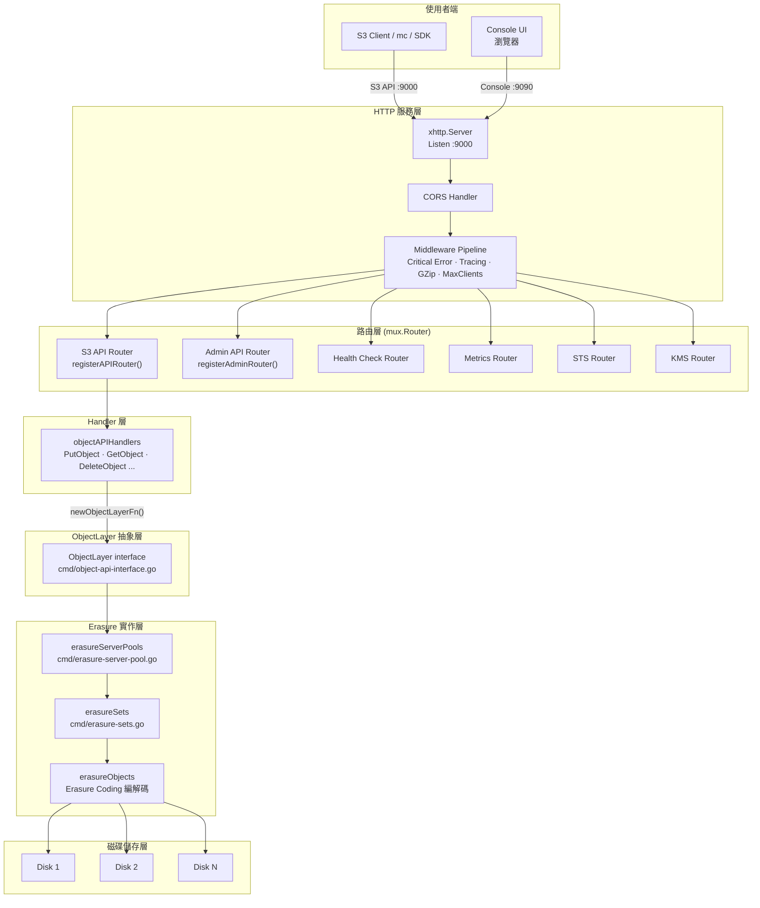
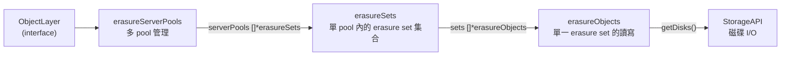
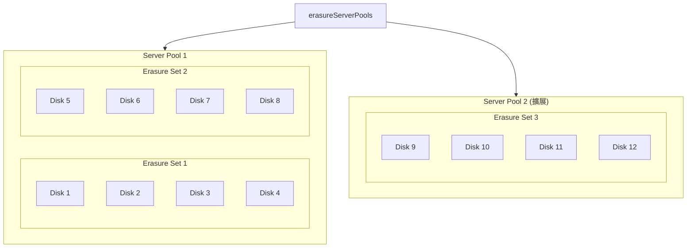
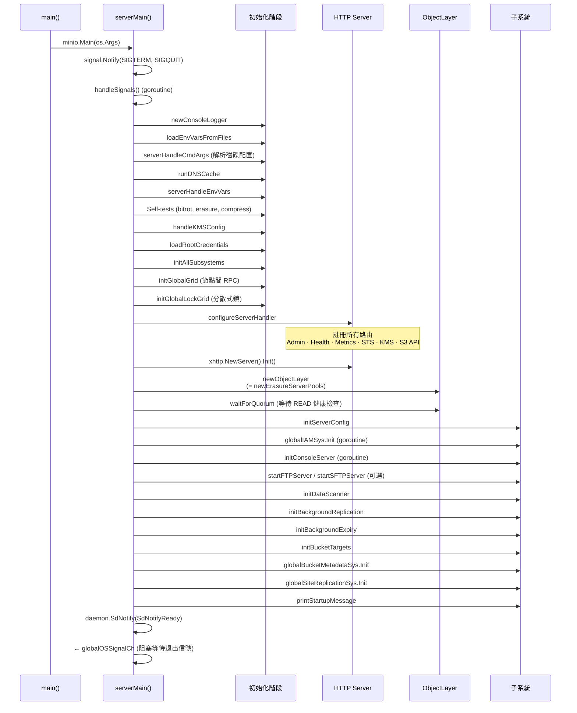

# MinIO — 系統架構

## 1. 專案概覽

[MinIO](https://github.com/minio/minio) 是一套以 **Go 語言**開發的高效能物件儲存系統，完全相容 Amazon S3 API。整個系統編譯為**單一 binary** (`minio`)，透過 `minio server` 指令即可啟動，涵蓋 S3 API、Admin API、Console UI、FTP/SFTP 等所有功能。

| 項目 | 版本 / 規格 |
|------|-------------|
| 語言 | **Go 1.24** (`go 1.24.0`，toolchain `go1.24.8`) |
| 授權 | **GNU AGPLv3** |
| 模組路徑 | `github.com/minio/minio` |
| 單一 Binary | `minio`（`minio server` 啟動所有服務） |
| S3 相容性 | 完整 S3 API（Bucket、Object、Multipart、Tagging、Retention 等） |
| 內建 Console | 嵌入式 Web UI（`github.com/minio/console`） |
| Erasure Coding | 內建 Reed-Solomon erasure code 實現資料冗餘 |
| 額外協定 | FTP / SFTP（可選啟用） |

版本與 Go 版本資訊定義於 `go.mod`：

```go
// 檔案: minio/go.mod
module github.com/minio/minio

go 1.24.0

toolchain go1.24.8
```

---

## 2. 系統架構圖

下圖展示 MinIO server 從接收 HTTP 請求到磁碟 I/O 的完整資料流：



::: tip 架構核心原則
MinIO 採用**單一 binary 架構**，所有元件（HTTP server、S3 API、Admin API、Console UI、FTP/SFTP）都打包在一個 `minio` 執行檔中。透過 `ObjectLayer` interface 抽象儲存層，上層 Handler 完全不需要知道底層是 standalone 還是 distributed 模式。
:::

---

## 3. 核心元件

### 3.1 入口點 — main.go

整個程式的入口極為簡潔，僅呼叫 `minio.Main()`：

```go
// 檔案: minio/main.go
package main

import (
	"os"
	_ "github.com/minio/minio/internal/init"
	minio "github.com/minio/minio/cmd"
)

func main() {
	minio.Main(os.Args)
}
```

::: warning 重要細節
`internal/init` 套件透過 `_` import 在程式最開始時執行初始化邏輯，這個匯入**必須是第一個**（原始碼有明確註解 `// MUST be first import.`）。
:::

### 3.2 CLI 命令 — server 子命令

`minio server` 命令定義在 `cmd/server-main.go`，透過 `github.com/minio/cli` 框架註冊：

```go
// 檔案: minio/cmd/server-main.go (第 199-203 行)
var serverCmd = cli.Command{
	Name:   "server",
	Usage:  "start object storage server",
	Flags:  append(ServerFlags, GlobalFlags...),
	Action: serverMain,
	// ...
}
```

主要的 server flags 包括：

| Flag | 預設值 | 環境變數 | 說明 |
|------|--------|----------|------|
| `--address` | `:9000` | `MINIO_ADDRESS` | HTTP 監聽地址 |
| `--console-address` | 自動分配 | `MINIO_CONSOLE_ADDRESS` | Console UI 地址 |
| `--config` | — | `MINIO_CONFIG` | YAML 設定檔路徑 |
| `--ftp` | — | — | 啟用 FTP server |
| `--sftp` | — | — | 啟用 SFTP server |

### 3.3 HTTP Server 與路由

`configureServerHandler()` 負責組裝完整的路由與 middleware：

```go
// 檔案: minio/cmd/routers.go (第 84-114 行)
func configureServerHandler(endpointServerPools EndpointServerPools) (http.Handler, error) {
	router := mux.NewRouter().SkipClean(true).UseEncodedPath()

	if globalIsDistErasure {
		registerDistErasureRouters(router, endpointServerPools)
	}

	registerAdminRouter(router, true)
	registerHealthCheckRouter(router)
	registerMetricsRouter(router)
	registerSTSRouter(router)
	registerKMSRouter(router)
	registerAPIRouter(router)

	router.Use(globalMiddlewares...)
	return router, nil
}
```

S3 API 的路由註冊在 `registerAPIRouter()` 中，透過 `objectAPIHandlers` 結構體分派請求：

```go
// 檔案: minio/cmd/api-router.go (第 67-70 行)
type objectAPIHandlers struct {
	ObjectAPI func() ObjectLayer
}
```

每個 S3 API handler 都透過 `s3APIMiddleware` 包裝，提供 tracing、gzip 壓縮、限流等功能：

```go
// 檔案: minio/cmd/api-router.go (第 254-262 行)
func registerAPIRouter(router *mux.Router) {
	api := objectAPIHandlers{
		ObjectAPI: newObjectLayerFn,
	}
	apiRouter := router.PathPrefix(SlashSeparator).Subrouter()
	// ...
}
```

典型的 S3 路由註冊範例：

```go
// 檔案: minio/cmd/api-router.go (第 302-303 行)
// HeadObject
router.Methods(http.MethodHead).Path("/{object:.+}").
	HandlerFunc(s3APIMiddleware(api.HeadObjectHandler))
```

---

## 4. 目錄結構

```
minio/
├── main.go                    ← 程式入口
├── cmd/                       ← 核心邏輯（~254K 行 Go code）
│   ├── server-main.go         ← serverMain() 啟動流程
│   ├── api-router.go          ← S3 API 路由註冊
│   ├── routers.go             ← 總路由組裝
│   ├── object-api-interface.go← ObjectLayer interface 定義
│   ├── erasure-server-pool.go ← erasureServerPools 實作
│   ├── erasure-sets.go        ← erasureSets 實作
│   ├── object-handlers.go     ← S3 Object API handlers
│   ├── bucket-handlers.go     ← S3 Bucket API handlers
│   └── site-replication.go    ← 跨站複製（6284 行）
├── internal/                  ← 35 個內部套件
│   ├── auth/                  ← 認證邏輯
│   ├── bucket/                ← Bucket 策略、複製、版本控制
│   ├── config/                ← 設定管理
│   ├── crypto/                ← 加密（SSE-S3、SSE-C、SSE-KMS）
│   ├── dsync/                 ← 分散式同步
│   ├── erasure/               ← Erasure coding 核心演算法
│   ├── grid/                  ← 節點間 RPC 通訊
│   ├── hash/                  ← 雜湊與 checksum
│   ├── http/                  ← HTTP server 底層實作
│   ├── logger/                ← 日誌系統
│   ├── s3select/              ← S3 Select 查詢引擎
│   └── ...                    ← 其他 20+ 套件
├── buildscripts/              ← 建置與測試腳本
├── helm/                      ← Helm Chart
│   └── minio/
│       ├── Chart.yaml
│       ├── values.yaml
│       └── templates/
├── Makefile                   ← 建置系統入口
├── go.mod                     ← Go module 定義
└── Dockerfile                 ← 容器映像建置
```

::: info 程式碼規模
`cmd/` 目錄包含約 **253,924 行** Go 程式碼，是整個 MinIO 的核心所在。最大的幾個檔案包括 `storage-datatypes_gen.go`（6,933 行）、`site-replication.go`（6,284 行）和 `metrics-v2.go`（4,435 行）。
:::

---

## 5. ObjectLayer 介面

`ObjectLayer` 是 MinIO 最核心的抽象層，定義在 `cmd/object-api-interface.go`。所有 S3 API handler 都透過這個 interface 存取底層儲存，實現了**上層邏輯與底層儲存引擎的完全解耦**。

```go
// 檔案: minio/cmd/object-api-interface.go (第 246-318 行)
type ObjectLayer interface {
	// Locking operations on object.
	NewNSLock(bucket string, objects ...string) RWLocker

	// Storage operations.
	Shutdown(context.Context) error
	NSScanner(ctx context.Context, updates chan<- DataUsageInfo, wantCycle uint32, scanMode madmin.HealScanMode) error
	BackendInfo() madmin.BackendInfo
	StorageInfo(ctx context.Context, metrics bool) StorageInfo

	// Bucket operations.
	MakeBucket(ctx context.Context, bucket string, opts MakeBucketOptions) error
	GetBucketInfo(ctx context.Context, bucket string, opts BucketOptions) (BucketInfo, error)
	ListBuckets(ctx context.Context, opts BucketOptions) ([]BucketInfo, error)
	DeleteBucket(ctx context.Context, bucket string, opts DeleteBucketOptions) error
	ListObjects(ctx context.Context, bucket, prefix, marker, delimiter string, maxKeys int) (ListObjectsInfo, error)
	ListObjectsV2(ctx context.Context, bucket, prefix, continuationToken, delimiter string, maxKeys int, fetchOwner bool, startAfter string) (ListObjectsV2Info, error)

	// Object operations.
	GetObjectNInfo(ctx context.Context, bucket, object string, rs *HTTPRangeSpec, h http.Header, opts ObjectOptions) (*GetObjectReader, error)
	GetObjectInfo(ctx context.Context, bucket, object string, opts ObjectOptions) (ObjectInfo, error)
	PutObject(ctx context.Context, bucket, object string, data *PutObjReader, opts ObjectOptions) (ObjectInfo, error)
	CopyObject(ctx context.Context, srcBucket, srcObject, destBucket, destObject string, srcInfo ObjectInfo, srcOpts, dstOpts ObjectOptions) (ObjectInfo, error)
	DeleteObject(ctx context.Context, bucket, object string, opts ObjectOptions) (ObjectInfo, error)
	DeleteObjects(ctx context.Context, bucket string, objects []ObjectToDelete, opts ObjectOptions) ([]DeletedObject, []error)

	// Multipart operations.
	NewMultipartUpload(ctx context.Context, bucket, object string, opts ObjectOptions) (*NewMultipartUploadResult, error)
	PutObjectPart(ctx context.Context, bucket, object, uploadID string, partID int, data *PutObjReader, opts ObjectOptions) (PartInfo, error)
	CompleteMultipartUpload(ctx context.Context, bucket, object, uploadID string, uploadedParts []CompletePart, opts ObjectOptions) (ObjectInfo, error)
	AbortMultipartUpload(ctx context.Context, bucket, object, uploadID string, opts ObjectOptions) error

	// Healing operations.
	HealFormat(ctx context.Context, dryRun bool) (madmin.HealResultItem, error)
	HealBucket(ctx context.Context, bucket string, opts madmin.HealOpts) (madmin.HealResultItem, error)
	HealObject(ctx context.Context, bucket, object, versionID string, opts madmin.HealOpts) (madmin.HealResultItem, error)

	// Health
	Health(ctx context.Context, opts HealthOptions) HealthResult
}
```

### ObjectLayer 實作層級



`erasureServerPools` 是 `ObjectLayer` 的主要實作：

```go
// 檔案: minio/cmd/erasure-server-pool.go (第 52-71 行)
type erasureServerPools struct {
	poolMetaMutex sync.RWMutex
	poolMeta      poolMeta

	rebalMu     sync.RWMutex
	rebalMeta   *rebalanceMeta
	rebalCancel context.CancelFunc

	deploymentID     [16]byte
	distributionAlgo string

	serverPools []*erasureSets

	decommissionCancelers []context.CancelFunc

	s3Peer  *S3PeerSys
	mpCache *xsync.MapOf[string, MultipartInfo]
}
```

物件層的建立透過 `newObjectLayer()` 工廠函式：

```go
// 檔案: minio/cmd/server-main.go (第 1199-1201 行)
func newObjectLayer(ctx context.Context, endpointServerPools EndpointServerPools) (newObject ObjectLayer, err error) {
	return newErasureServerPools(ctx, endpointServerPools)
}
```

---

## 6. 部署模式

### 6.1 Standalone 模式

使用單一節點、一或多個本地磁碟：

```bash
# 單磁碟
minio server /data

# 多磁碟（啟用 erasure coding）
minio server /mnt/data{1...64}
```

### 6.2 Distributed 模式

跨多個節點組成分散式叢集：

```bash
# 32 節點 × 32 磁碟
minio server http://node{1...32}.example.com/mnt/export{1...32}
```

### 6.3 Erasure Set 與 Server Pool



| 概念 | 說明 |
|------|------|
| **Server Pool** | 一組具有相同 erasure set 大小的節點集合，對應 `[]*erasureSets` |
| **Erasure Set** | erasure coding 的最小單位，包含固定數量的磁碟（例如 4、8、16） |
| **Parity** | 冗餘分片數量，預設為 N/2（如 4 顆磁碟中有 2 個 parity） |
| **擴展** | 透過新增 Server Pool 水平擴展，新增的 pool 作為獨立的 endpoint 參數傳入 |

::: tip Decommission 與 Rebalance
`erasureServerPools` 內建了 **decommission**（退役 pool）和 **rebalance**（重新平衡資料）的機制，分別透過 `decommissionCancelers` 和 `rebalMeta` 管理。
:::

---

## 7. Server 初始化流程

`serverMain()` 是 MinIO server 的核心啟動函式（定義於 `cmd/server-main.go` 第 746 行）。以下是完整的啟動順序：



### 關鍵啟動步驟程式碼摘錄

**1. 信號處理與 Logger 初始化：**

```go
// 檔案: minio/cmd/server-main.go (第 746-776 行)
func serverMain(ctx *cli.Context) {
	r := rand.New(rand.NewSource(time.Now().UnixNano()))
	var warnings []string

	signal.Notify(globalOSSignalCh, os.Interrupt, syscall.SIGTERM, syscall.SIGQUIT)
	go handleSignals()
	setDefaultProfilerRates()

	bootstrapTrace("newConsoleLogger", func() {
		// 初始化 log rotate 與 console logger
		output, err := initializeLogRotate(ctx)
		if err == nil {
			globalConsoleSys = NewConsoleLogger(GlobalContext, output)
		} else {
			globalConsoleSys = NewConsoleLogger(GlobalContext, os.Stderr)
		}
		logger.AddSystemTarget(GlobalContext, globalConsoleSys)
	})
	// ...
}
```

**2. 建立 ObjectLayer 並等待 Quorum：**

```go
// 檔案: minio/cmd/server-main.go (第 941-973 行)
var newObject ObjectLayer
bootstrapTrace("newObjectLayer", func() {
	var err error
	newObject, err = newObjectLayer(GlobalContext, globalEndpoints)
	if err != nil {
		logFatalErrs(err, Endpoint{}, true)
	}
})

bootstrapTrace("waitForQuorum", func() {
	result := newObject.Health(context.Background(), HealthOptions{NoLogging: true})
	for !result.HealthyRead {
		d := time.Duration(r.Float64() * float64(time.Second))
		logger.Info("Waiting for quorum READ healthcheck to succeed retrying in %s..", d)
		time.Sleep(d)
		result = newObject.Health(context.Background(), HealthOptions{NoLogging: true})
	}
})
```

**3. 初始化子系統（在背景 goroutine 中）：**

```go
// 檔案: minio/cmd/server-main.go (第 1004-1038 行)
go func() {
	bootstrapTrace("globalIAMSys.Init", func() {
		globalIAMSys.Init(GlobalContext, newObject, globalEtcdClient, globalRefreshIAMInterval)
	})

	if globalBrowserEnabled {
		bootstrapTrace("initConsoleServer", func() {
			srv, err := initConsoleServer()
			if err != nil {
				logger.FatalIf(err, "Unable to initialize console service")
			}
			setConsoleSrv(srv)
			go func() {
				logger.FatalIf(newConsoleServerFn().Serve(), "Unable to initialize console server")
			}()
		})
	}

	if len(globalServerCtxt.FTP) > 0 {
		go startFTPServer(globalServerCtxt.FTP)
	}
	if len(globalServerCtxt.SFTP) > 0 {
		go startSFTPServer(globalServerCtxt.SFTP)
	}
}()
```

---

## 8. 建置系統

MinIO 使用 `Makefile` 管理建置流程，核心依賴 `go build`：

### 8.1 主要 Makefile Targets

| Target | 說明 |
|--------|------|
| `make build` | 建置 `minio` binary（`CGO_ENABLED=0`，靜態編譯） |
| `make install` | 建置並安裝到 `$GOPATH/bin/` |
| `make test` | 執行 linter + 建置 + 單元測試 |
| `make lint` | 執行 golangci-lint |
| `make docker` | 建置 Docker image |
| `make clean` | 清理所有建置產物 |
| `make crosscompile` | 交叉編譯多平台版本 |
| `make verify` | 完整驗證建置（含 race detection） |

### 8.2 建置指令

```makefile
# 檔案: minio/Makefile (第 179-181 行)
build: checks build-debugging
	@echo "Building minio binary to './minio'"
	@CGO_ENABLED=0 GOOS=$(GOOS) GOARCH=$(GOARCH) go build -tags kqueue -trimpath --ldflags "$(LDFLAGS)" -o $(PWD)/minio 1>/dev/null
```

::: info 建置特點
- **`CGO_ENABLED=0`**：完全靜態編譯，無需 C 函式庫依賴
- **`-trimpath`**：移除建置路徑資訊，確保可重現建置
- **`-tags kqueue`**：在支援的平台啟用 kqueue 事件通知
- **`--ldflags "$(LDFLAGS)"`**：注入版本、commit hash 等建置時資訊（由 `buildscripts/gen-ldflags.go` 產生）
:::

### 8.3 Docker 建置

```makefile
# 檔案: minio/Makefile (第 214-216 行)
docker: build
	@echo "Building minio docker image '$(TAG)'"
	@docker build -q --no-cache -t $(TAG) . -f Dockerfile
```

Docker image tag 格式為 `quay.io/minio/minio:<version>`，版本自動從 git tag 取得。

---

::: info 相關章節
- [MinIO 首頁](/minio/) — 專案總覽與文件導覽
:::
