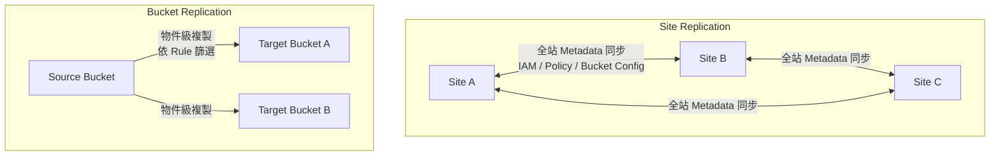
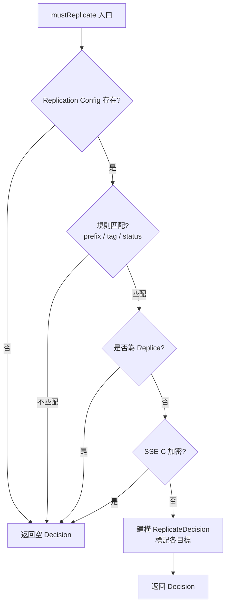
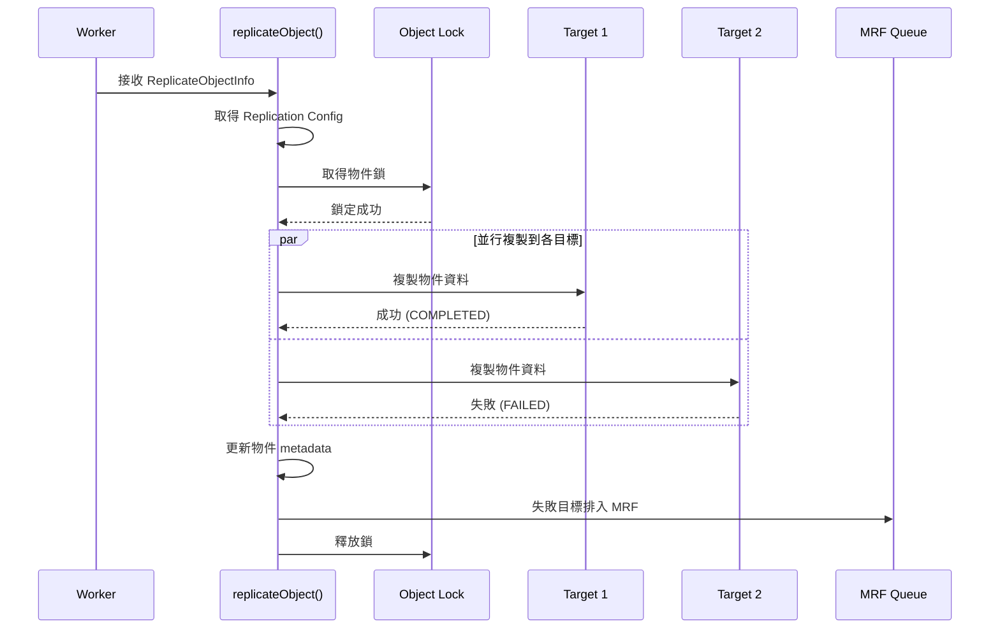
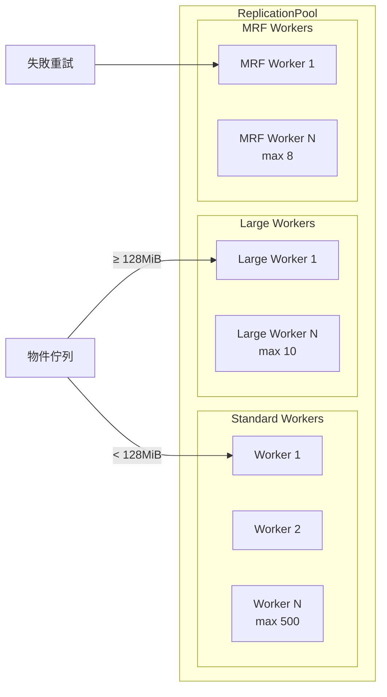
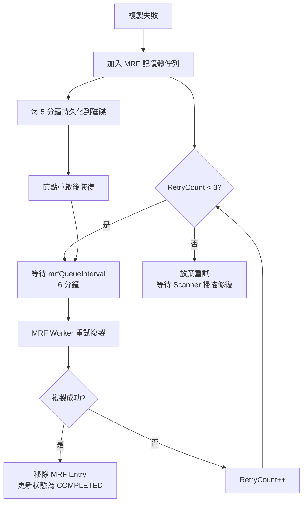
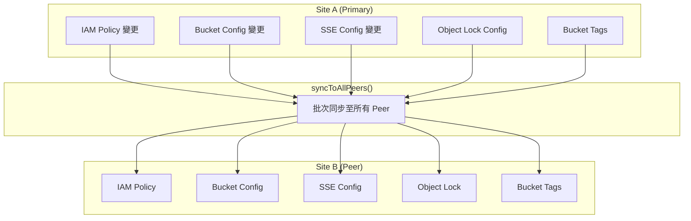
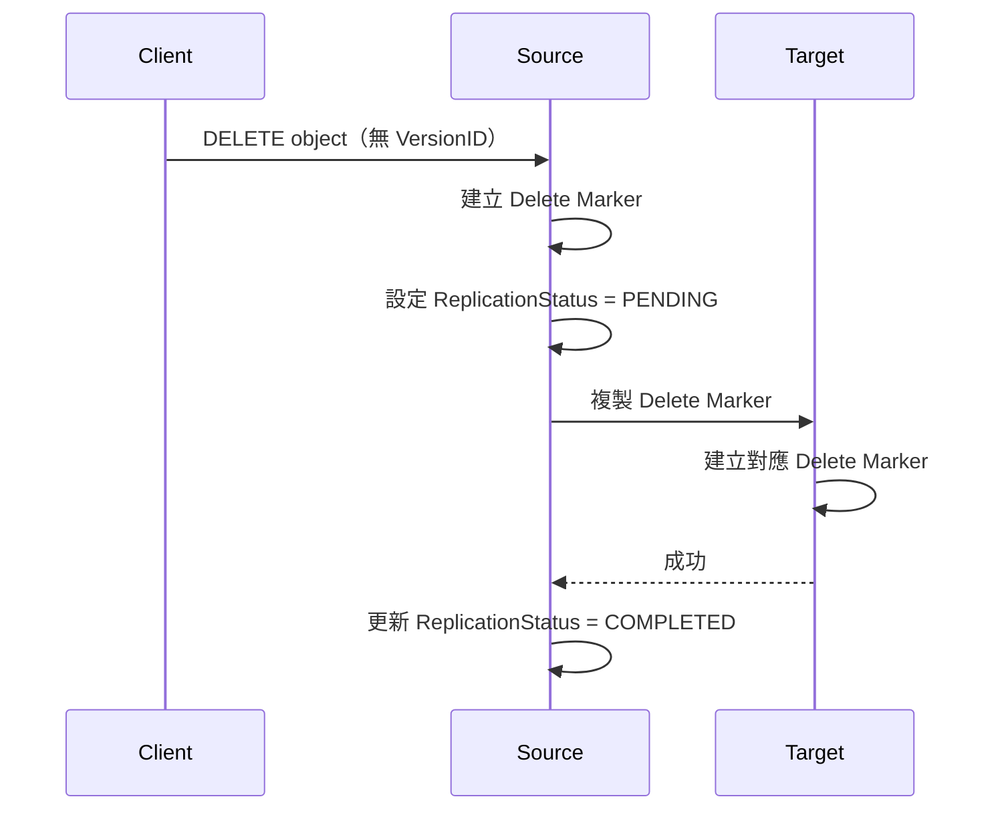
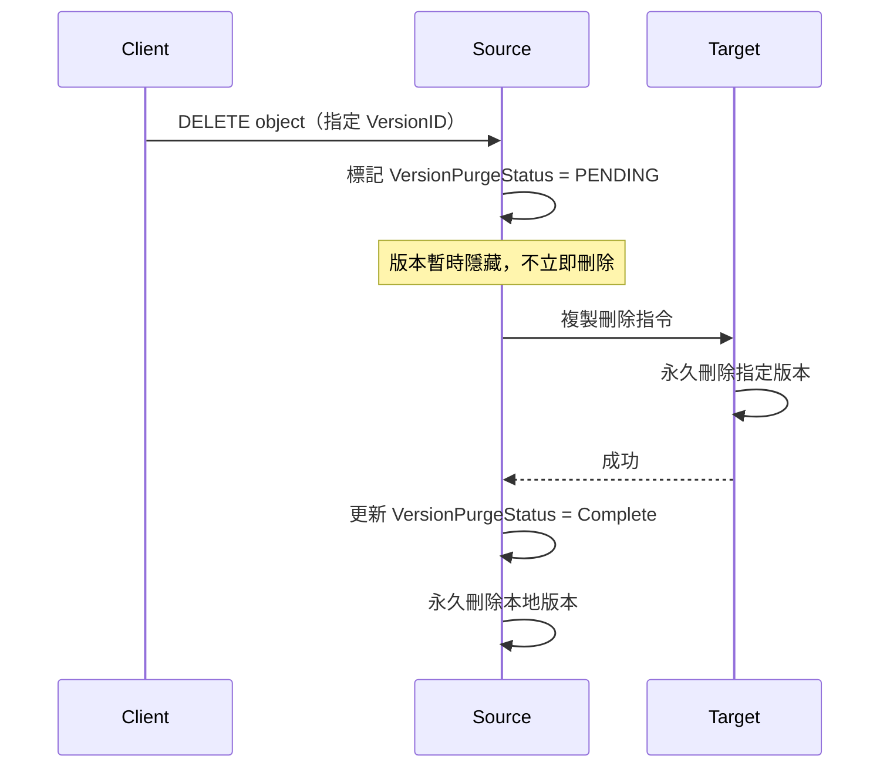
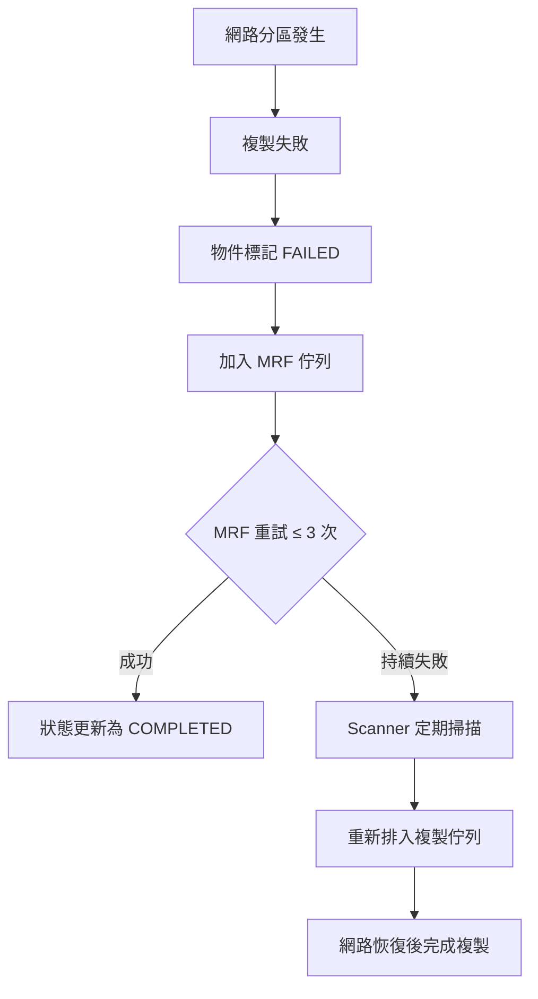
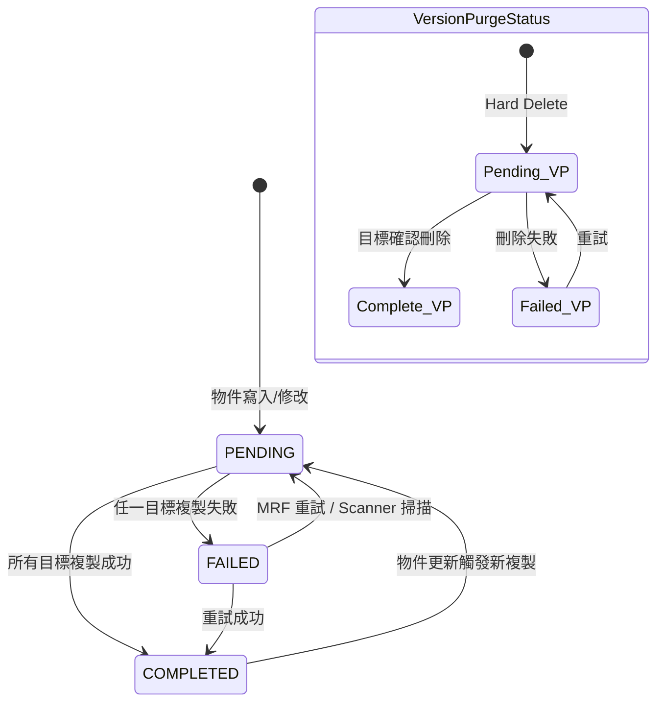

# MinIO — 資料複製與同步

MinIO 提供兩層複製架構：**Bucket Replication**（桶級複製）與 **Site Replication**（站點級複製）。本文深入分析其原始碼實作，涵蓋決策流程、工作池架構、MRF 重試機制及一致性模型。

## 1. 複製架構概覽



### Site Replication vs Bucket Replication

| 特性 | Site Replication | Bucket Replication |
|------|------------------|--------------------|
| **範圍** | 整個叢集（所有 bucket） | 單一 bucket |
| **同步內容** | Metadata + 物件 + IAM Policy | 物件資料 + 版本 |
| **拓撲** | 多主（Multi-master） | 單向或雙向 |
| **組態** | `SiteReplicationSys` | 每 bucket 的 `Config` 規則 |
| **適用情境** | 跨機房災備 | 跨帳號/跨 bucket 複製 |

::: tip 使用建議
Site Replication 適用於需要完整叢集鏡像的災備場景；Bucket Replication 則適用於精細控制哪些物件需要複製到哪些目標。
:::

## 2. Bucket Replication 深度分析

### 2.1 ReplicateObjectInfo 結構

`ReplicateObjectInfo` 封裝了待複製物件的完整資訊，是整個複製流程的核心資料載體：

```go
// 檔案: minio/cmd/object-api-datatypes.go
type ReplicateObjectInfo struct {
    Name                       string
    Bucket                     string
    VersionID                  string
    ETag                       string
    Size                       int64
    ActualSize                 int64
    ModTime                    time.Time
    UserTags                   string
    SSEC                       bool
    ReplicationStatus          replication.StatusType
    ReplicationStatusInternal  string
    VersionPurgeStatusInternal string
    VersionPurgeStatus         VersionPurgeStatusType
    ReplicationState           ReplicationState
    DeleteMarker               bool

    OpType               replication.Type
    EventType            string
    RetryCount           uint32
    ResetID              string
    Dsc                  ReplicateDecision
    ExistingObjResync    ResyncDecision
    TargetArn            string
    TargetStatuses       map[string]replication.StatusType
    TargetPurgeStatuses  map[string]VersionPurgeStatusType
    ReplicationTimestamp time.Time
    Checksum             []byte
}
```

關鍵欄位說明：

- **`Dsc`**（`ReplicateDecision`）：決策結果，記錄每個目標是否需要複製
- **`OpType`**：操作類型（PUT / DELETE / Metadata 等）
- **`RetryCount`**：重試次數，搭配 MRF 機制使用
- **`TargetStatuses`**：各目標的複製狀態（多目標場景）
- **`VersionPurgeStatus`**：Hard Delete 的清除狀態

### 2.2 ReplicateDecision 決策結構

```go
// 檔案: minio/cmd/bucket-replication-utils.go
type ReplicateDecision struct {
    targetsMap map[string]replicateTargetDecision
}

type replicateTargetDecision struct {
    Replicate   bool   // 是否複製到此目標
    Synchronous bool   // 是否為同步複製
    Arn         string // Replication Target ARN
    ID          string
}
```

`ReplicateDecision` 是多目標複製的核心 — 它為每個 replication target 維護一個獨立的決策記錄。

### 2.3 mustReplicate() 判斷邏輯

`mustReplicate()` 是複製流程的入口守門員，決定物件是否需要複製：

```go
// 檔案: minio/cmd/bucket-replication.go
func mustReplicate(ctx context.Context, bucket, object string,
    mopts mustReplicateOptions) (dsc ReplicateDecision) {
    // 1. 檢查 replication config 是否存在
    // 2. 逐條匹配 replication rule（prefix, tag, status）
    // 3. 檢查物件版本狀態（非 replica 才複製）
    // 4. 排除 SSE-C 加密物件
    // 5. 建構 ReplicateDecision 回傳
}
```



### 2.4 replicateObject() 執行流程

`replicateObject()` 是實際執行複製的核心函式：

```go
// 檔案: minio/cmd/bucket-replication.go
func replicateObject(ctx context.Context, ri ReplicateObjectInfo,
    objectAPI ObjectLayer) {
    // 1. 取得 bucket 的 replication config
    // 2. 篩選適用目標（依 ReplicateDecision）
    // 3. 取得物件鎖（防止並行修改）
    // 4. 對每個目標啟動 goroutine 進行複製
    // 5. 等待所有目標完成
    // 6. 更新物件 metadata（replication status）
    // 7. 失敗的目標排入 MRF 佇列
}
```



### 2.5 replicationAction — 快速路徑 vs 完整路徑

MinIO 根據變更類型決定複製策略：

```go
// 檔案: minio/cmd/bucket-replication.go
type replicationAction string

const (
    replicateMetadata replicationAction = "metadata"  // 僅複製 metadata
    replicateNone     replicationAction = "none"      // 不複製
    replicateAll      replicationAction = "all"       // 完整複製（資料 + metadata）
)
```

| 動作 | 觸發時機 | 傳輸內容 |
|------|---------|---------|
| `replicateAll` | 新物件 PUT、物件內容變更 | 完整物件資料 + metadata |
| `replicateMetadata` | Tags / Retention / Legal Hold 變更 | 僅 metadata |
| `replicateNone` | 不符合複製規則 | 無 |

::: warning 效能影響
`replicateAll` 需要完整傳輸物件資料，對於大檔案會佔用顯著頻寬。MinIO 透過 Large Worker 機制處理 ≥128MiB 的物件，避免阻塞標準 worker。
:::

## 3. ReplicationPool 工作池

### 3.1 Worker 架構

```go
// 檔案: minio/cmd/bucket-replication.go
type ReplicationPool struct {
    activeWorkers    int32  // atomic: 活躍標準 worker 數
    activeLrgWorkers int32  // atomic: 活躍大檔 worker 數
    activeMRFWorkers int32  // atomic: 活躍 MRF worker 數

    objLayer    ObjectLayer
    ctx         context.Context
    priority    string       // "fast" / "slow" / "auto"
    maxWorkers  int
    maxLWorkers int

    // worker channels
    workers    []chan ReplicationWorkerOperation   // 標準 worker
    lrgworkers []chan ReplicationWorkerOperation   // 大檔 worker

    // MRF 相關
    mrfWorkerKillCh chan struct{}
    mrfReplicaCh    chan ReplicationWorkerOperation
    mrfSaveCh       chan MRFReplicateEntry
    mrfStopCh       chan struct{}
    mrfWorkerSize   int
}
```



### 3.2 工作池大小配置

```go
// 檔案: minio/cmd/bucket-replication.go
const (
    WorkerMaxLimit     = 500   // fast 模式
    WorkerMinLimit     = 50    // slow 模式
    WorkerAutoDefault  = 100   // auto 模式

    MRFWorkerMaxLimit    = 8   // fast 模式
    MRFWorkerMinLimit    = 2   // slow 模式
    MRFWorkerAutoDefault = 4   // auto 模式

    LargeWorkerCount = 10      // 大檔 worker（固定數量）
)
```

| 模式 | Standard Workers | MRF Workers | 適用場景 |
|------|-----------------|-------------|---------|
| `fast` | 500 | 8 | 高頻寬、低延遲環境 |
| `slow` | 50 | 2 | 頻寬受限環境 |
| `auto` | 100 | 4 | 預設，自動平衡 |

### 3.3 getWorkerCh() — Hash-Based 分配

```go
// 檔案: minio/cmd/bucket-replication.go
func (p *ReplicationPool) getWorkerCh(bucket, object string, sz int64) chan<- ReplicationWorkerOperation {
    // 1. 若 sz >= 128MiB → 分配到 lrgworkers
    // 2. 否則使用 xxh3 hash(bucket + object) 決定 worker index
    // 3. 回傳對應的 worker channel
}
```

::: tip 設計亮點
使用 `xxh3` hash 確保同一物件的所有複製操作都由同一個 worker 處理，避免並行衝突並保證操作順序。
:::

## 4. MRF 重試機制

MRF（Most Recent Failures）是 MinIO 處理複製失敗的核心機制，確保暫時性失敗能被自動重試。

### 4.1 MRFReplicateEntry 結構

```go
// 檔案: minio/cmd/bucket-replication-utils.go
type MRFReplicateEntry struct {
    Bucket     string `json:"bucket" msg:"b"`
    Object     string `json:"object" msg:"o"`
    versionID  string `json:"-"`
    RetryCount int    `json:"retryCount" msg:"rc"`
    sz         int64  `json:"-"`
}

type MRFReplicateEntries struct {
    Entries map[string]MRFReplicateEntry `json:"entries" msg:"e"`
    Version int                          `json:"version" msg:"v"`
}
```

### 4.2 MRF 常數與流程

```go
// 檔案: minio/cmd/bucket-replication.go
const (
    mrfSaveInterval  = 5 * time.Minute        // 持久化間隔
    mrfQueueInterval = mrfSaveInterval + time.Minute  // 重試佇列掃描間隔（6 分鐘）
    mrfRetryLimit    = 3                       // 最大重試次數
    mrfMaxEntries    = 1000000                 // 佇列最大容量
)
```



::: warning MRF 容量限制
MRF 佇列最多保存 `1,000,000` 條記錄。超過此限制時，新的失敗記錄會被丟棄，依賴後續 Scanner 掃描修復。
:::

### 4.3 失敗持久化

MRF 每隔 `mrfSaveInterval`（5 分鐘）將記憶體中的失敗記錄序列化到磁碟。當節點重啟時，會從磁碟恢復這些記錄，確保失敗重試不會因為重啟而遺失。

## 5. Site Replication

### 5.1 SiteReplicationSys 結構

```go
// 檔案: minio/cmd/site-replication.go
type SiteReplicationSys struct {
    sync.RWMutex

    enabled      bool
    state        srState
    iamMetaCache srIAMCache
}

type srStateV1 struct {
    Name                    string
    Peers                   map[string]madmin.PeerInfo
    ServiceAccountAccessKey string
    UpdatedAt               time.Time
}
```

### 5.2 同步流程

Site Replication 在叢集層級同步以下 metadata：



### 5.3 Metadata 同步項目

| 同步項目 | 說明 |
|---------|------|
| **IAM Policy** | 使用者政策、群組政策 |
| **Bucket Policy** | 桶級存取控制 |
| **SSE Config** | 伺服器端加密配置 |
| **Object Lock Config** | 物件鎖定/保留設定 |
| **Bucket Tags** | 桶標籤 |
| **Bucket Quota** | 容量配額 |
| **Service Account** | 服務帳號同步 |

::: info Site Replication 與 Bucket Replication 的關係
啟用 Site Replication 後，所有 bucket 自動啟用雙向複製。Site Replication 額外處理 IAM 和 bucket-level metadata 的同步，而物件資料的複製仍依賴底層的 Bucket Replication 機制。
:::

## 6. Delete Replication

MinIO 的刪除複製分為兩種模式：

### 6.1 Soft Delete（Delete Marker）



- 不刪除實際資料，僅標記物件為已刪除
- Delete Marker 本身作為一個特殊版本被複製
- 物件的歷史版本仍然存在

### 6.2 Hard Delete（Version Purge）



::: warning Hard Delete 的安全機制
指定 VersionID 的刪除不會立即從 source 移除資料。MinIO 會等待所有 replication target 確認刪除成功後，才在本地永久移除，確保不會因網路問題導致資料不一致。
:::

## 7. 一致性模型

### 7.1 版本追蹤

MinIO 使用 `ReplicationState` 追蹤每個物件在各 replication target 的狀態：

```go
// 檔案: minio/cmd/bucket-replication-utils.go
type ReplicationState struct {
    ReplicaTimeStamp           time.Time
    ReplicaStatus              replication.StatusType
    DeleteMarker               bool
    ReplicationTimeStamp       time.Time
    ReplicationStatusInternal  string
    VersionPurgeStatusInternal string
    ReplicateDecisionStr       string
    Targets                    map[string]replication.StatusType
    PurgeTargets               map[string]VersionPurgeStatusType
    ResetStatusesMap           map[string]string
}
```

- **`Targets`**：記錄每個 ARN 的複製狀態（PENDING / COMPLETED / FAILED）
- **`PurgeTargets`**：記錄每個 ARN 的版本清除狀態
- **`ReplicationTimeStamp`**：複製時間戳記，用於因果追蹤

### 7.2 Timestamp Causality

複製操作攜帶 `ReplicationTimestamp`，目標端據此判斷：
- 若目標端已有更新版本 → 跳過複製
- 若目標端版本較舊 → 執行覆寫
- 版本衝突時以時間戳為準（Last Write Wins）

### 7.3 網路分區處理



MinIO 透過三層防護確保最終一致性：
1. **即時重試**：MRF 機制（最多 3 次，間隔約 6 分鐘）
2. **定期掃描**：Scanner 定期檢查未完成的複製
3. **手動 Resync**：管理員可觸發 `ResyncDecision` 進行全量重同步

## 8. Replication Status 狀態機



### 狀態說明

| 狀態 | 意義 |
|------|------|
| `PENDING` | 等待複製（剛寫入或重試中） |
| `COMPLETED` | 所有目標複製成功 |
| `FAILED` | 至少一個目標複製失敗 |
| `REPLICA` | 此物件是從其他站點複製而來的副本 |

::: tip 多目標狀態彙總
當配置多個 replication target 時，物件的整體 `ReplicationStatus` 是各目標狀態的彙總：只要有任一目標為 `FAILED`，整體即為 `FAILED`。所有目標都 `COMPLETED` 時，整體才為 `COMPLETED`。
:::

::: info 相關章節
- [MinIO 架構總覽](./architecture.md)
- [Erasure Coding 深度分析](./erasure-coding.md)
- [磁碟 I/O 路徑分析](./disk-io.md)
:::
