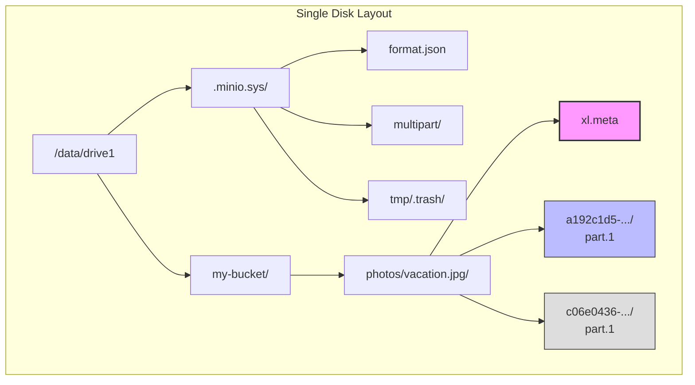
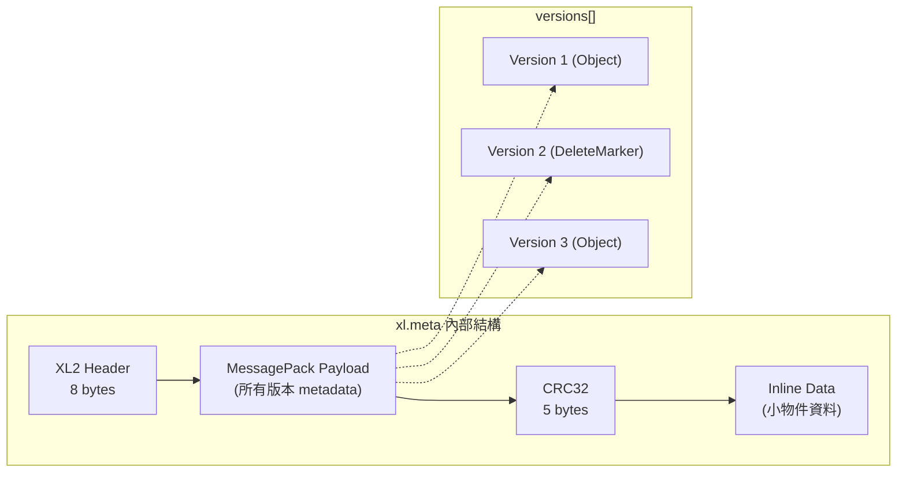
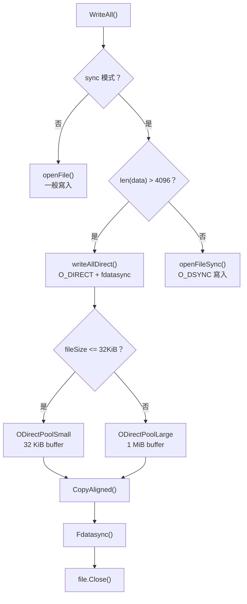
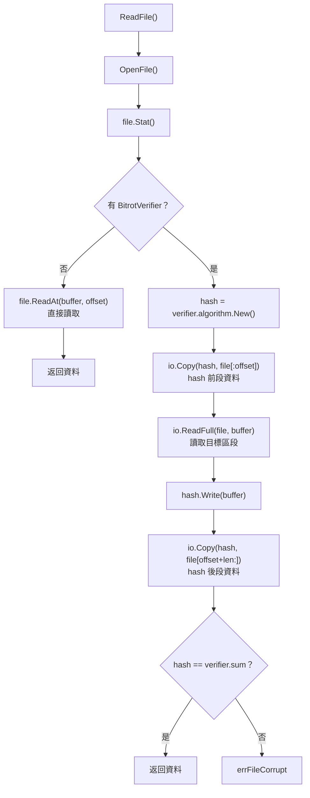
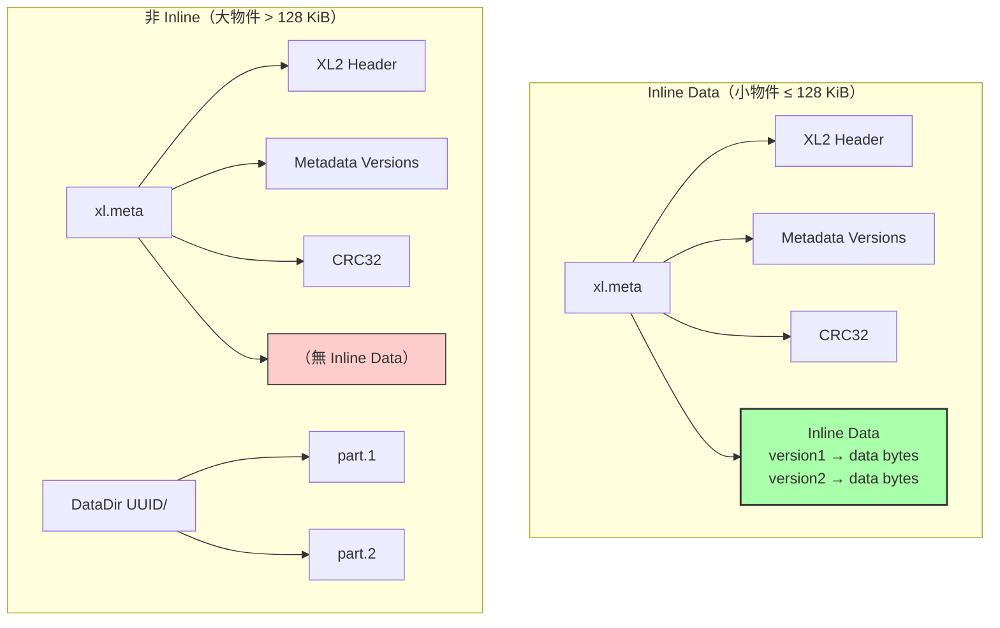
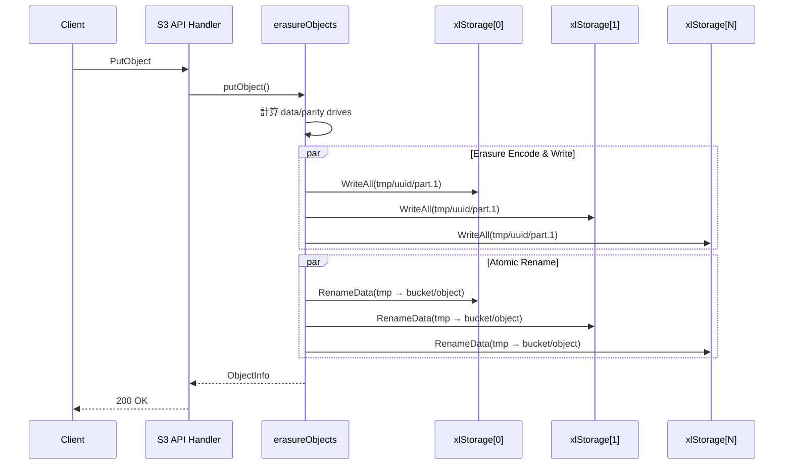
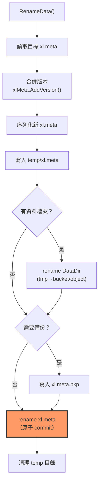

# MinIO — 底層硬碟讀寫機制

MinIO 的核心儲存後端 `xlStorage` 直接操作本機檔案系統，結合 O_DIRECT bypass kernel cache、`fdatasync()` 確保資料持久化、aligned buffer pool 降低記憶體配置開銷，以及 Inline Data 最佳化小物件寫入。本章從原始碼層級深入分析這些機制。

## 目錄

[[toc]]

---

## 1. xlStorage 結構 — 核心儲存後端

`xlStorage` 是 MinIO 中代表**單一磁碟**的儲存實作，每顆硬碟對應一個 `xlStorage` 實例。它實作了 `StorageAPI` 介面，所有的讀寫刪除操作最終都落在這裡。

```go
// 檔案: cmd/xl-storage.go (Lines 98-130)
type xlStorage struct {
	scanning int32       // NSScanner 是否正在掃描此磁碟

	drivePath string     // 磁碟掛載路徑，例如 /data/drive1
	endpoint  Endpoint   // 網路端點資訊

	globalSync bool      // 是否啟用全域 fsync
	oDirect    bool      // 此磁碟是否支援 O_DIRECT

	diskID string        // 唯一磁碟識別碼（來自 format.json）

	formatFileInfo  os.FileInfo
	formatFile      string
	formatLegacy    bool
	formatLastCheck time.Time

	diskInfoCache *cachevalue.Cache[DiskInfo]
	sync.RWMutex
	formatData []byte

	nrRequests   uint64
	major, minor uint32   // 裝置的 major/minor 號碼
	fsType       string   // 檔案系統類型（XFS、ext4 等）

	immediatePurge       chan string
	immediatePurgeCancel context.CancelFunc

	rotational bool       // 是否為旋轉式硬碟（HDD）
	walkMu     *sync.Mutex
	walkReadMu *sync.Mutex
}
```

### 1.1 初始化流程

```go
// 檔案: cmd/xl-storage.go (Lines 217-310)
func newXLStorage(ep Endpoint, cleanUp bool) (s *xlStorage, err error) {
	immediatePurgeQueue := 100000
	if globalIsTesting || globalIsCICD {
		immediatePurgeQueue = 1
	}

	ctx, cancel := context.WithCancel(GlobalContext)

	s = &xlStorage{
		drivePath:            ep.Path,
		endpoint:             ep,
		globalSync:           globalFSOSync,
		diskInfoCache:        cachevalue.New[DiskInfo](),
		immediatePurge:       make(chan string, immediatePurgeQueue),
		immediatePurgeCancel: cancel,
	}
	// 繼續偵測磁碟資訊、檢查 format.json、O_DIRECT 支援...
}
```

::: tip 關鍵設計
`xlStorage` 將「單一磁碟 = 單一實例」的概念徹底貫徹。每個 Erasure Set 持有多個 `xlStorage` 參考，分散讀寫以達到平行 I/O。
:::

---

## 2. On-Disk 目錄結構

MinIO 在每顆磁碟上的儲存佈局是完全對稱的。以下是完整的目錄樹狀結構：

```
// 檔案: cmd/xl-storage-format-v2.go (Lines 90-127) — 官方註解
disk1/
├── .minio.sys/                          # 內部 metadata bucket
│   ├── format.json                      # 叢集格式資訊
│   ├── multipart/                       # multipart upload 暫存
│   │   └── <SHA256(bucket/object)>/
│   │       └── <uploadID>/
│   │           └── xl.meta
│   ├── tmp/                             # 暫存操作
│   │   └── .trash/                      # 已刪除檔案（待清理）
│   └── buckets/                         # bucket policy 等
├── my-bucket/                           # 使用者建立的 bucket
│   └── photos/vacation.jpg/             # 物件路徑（含目錄結構）
│       ├── xl.meta                      # ← 元資料檔（XL2 格式）
│       ├── a192c1d5-.../                # ← DataDir（UUID）
│       │   └── part.1                   #    資料分片
│       ├── c06e0436-.../                # ← 舊版本的 DataDir
│       │   └── part.1
│       └── legacy/                      # ← 舊格式相容目錄
│           ├── part.1
│           └── part.2
└── another-bucket/
    └── ...
```

### 2.1 核心概念

| 元素 | 說明 |
|------|------|
| `xl.meta` | 物件所有版本的 metadata（XL2 二進位格式）|
| `DataDir` (UUID) | 每個版本擁有獨立的 UUID 目錄 |
| `part.N` | Erasure coding 後的資料分片（每磁碟一份）|
| `legacy/` | 從 xl.json 遷移而來的舊版本目錄 |

```go
// 檔案: cmd/xl-storage.go (Lines 56-73)
const (
	// 小物件門檻 — 低於此值的資料會隨 metadata 內嵌（inline）
	smallFileThreshold = 128 * humanize.KiByte // 128 KiB

	// 大物件門檻 — 超過此值時使用 readahead 最佳化
	bigFileThreshold = 128 * humanize.MiByte   // 128 MiB

	// 元資料檔名
	xlStorageFormatFile       = "xl.meta"
	xlStorageFormatFileBackup = "xl.meta.bkp"
)
```



::: warning 重要
每個 `DataDir` UUID 對應一個**物件版本**。刪除版本時只需移除對應的 UUID 目錄，不影響其他版本。多版本物件的 `xl.meta` 內包含所有版本的 metadata。
:::

---

## 3. xl.meta 格式深度分析

`xl.meta` 是 MinIO 自定義的二進位元資料格式，採用 MessagePack 編碼，支援多版本儲存。

### 3.1 檔案結構

```
┌──────────────────────────────────────────────────────┐
│  Bytes 0-3:   Magic Header  ['X','L','2',' ']        │
│  Bytes 4-5:   Major Version (uint16 LE)              │
│  Bytes 6-7:   Minor Version (uint16 LE)              │
│  Bytes 8-N:   MessagePack Payload (metadata blob)    │
│  Next 5B:     CRC32 (xxhash of metadata blob)        │
│  Remaining:   Inline Data (xlMetaInlineData)          │
└──────────────────────────────────────────────────────┘
```

```go
// 檔案: cmd/xl-storage-format-v2.go (Lines 42-57)
var (
	xlHeader = [4]byte{'X', 'L', '2', ' '} // Magic header

	xlVersionCurrent [4]byte // 目前版本，初始化時設定
)

const (
	xlVersionMajor = 1  // 破壞性變更
	xlVersionMinor = 3  // 非破壞性變更
)

func init() {
	binary.LittleEndian.PutUint16(xlVersionCurrent[0:2], xlVersionMajor)
	binary.LittleEndian.PutUint16(xlVersionCurrent[2:4], xlVersionMinor)
}
```

### 3.2 Header 驗證

```go
// 檔案: cmd/xl-storage-format-v2.go (Lines 219-246)
func checkXL2V1(buf []byte) (payload []byte, major, minor uint16, err error) {
	if len(buf) <= 8 {
		return payload, 0, 0, fmt.Errorf("xlMeta: no data")
	}

	if !bytes.Equal(buf[:4], xlHeader[:]) {
		return payload, 0, 0, fmt.Errorf(
			"xlMeta: unknown XLv2 header, expected %v, got %v",
			xlHeader[:4], buf[:4],
		)
	}

	if bytes.Equal(buf[4:8], []byte("1   ")) {
		major, minor = 1, 0 // 舊版格式相容
	} else {
		major = binary.LittleEndian.Uint16(buf[4:6])
		minor = binary.LittleEndian.Uint16(buf[6:8])
	}

	if major > xlVersionMajor {
		return buf[8:], major, minor,
			fmt.Errorf("xlMeta: unknown major version %d found", major)
	}

	return buf[8:], major, minor, nil
}
```

### 3.3 序列化流程（AppendTo）

```go
// 檔案: cmd/xl-storage-format-v2.go (Lines 1176-1231)
func (x *xlMetaV2) AppendTo(dst []byte) ([]byte, error) {
	// 1. 寫入 XL2 Header + 版本號
	dst = append(dst, xlHeader[:]...)
	dst = append(dst, xlVersionCurrent[:]...)

	// 2. 預留 "bin 32" 空間（MessagePack 格式）
	dst = append(dst, 0xc6, 0, 0, 0, 0)
	dataOffset := len(dst)

	// 3. 寫入版本資訊
	dst = msgp.AppendUint(dst, xlHeaderVersion)
	dst = msgp.AppendUint(dst, xlMetaVersion)
	dst = msgp.AppendInt(dst, len(x.versions))

	// 4. 逐一序列化每個版本的 header + meta
	for _, ver := range x.versions {
		tmp, err = ver.header.MarshalMsg(tmp[:0])
		dst = msgp.AppendBytes(dst, tmp)   // header
		dst = msgp.AppendBytes(dst, ver.meta) // full meta
	}

	// 5. 回填實際大小
	binary.BigEndian.PutUint32(
		dst[dataOffset-4:dataOffset],
		uint32(len(dst)-dataOffset),
	)

	// 6. 附加 CRC32（xxhash）
	binary.BigEndian.PutUint32(tmp[1:], uint32(xxhash.Sum64(dst[dataOffset:])))
	dst = append(dst, tmp[:5]...)

	// 7. 附加 inline data
	return append(dst, x.data...), nil
}
```

### 3.4 xlMetaV2Object — 物件版本核心結構

```go
// 檔案: cmd/xl-storage-format-v2.go (Lines 156-175)
type xlMetaV2Object struct {
	VersionID          [16]byte          `msg:"ID"`       // 版本 UUID
	DataDir            [16]byte          `msg:"DDir"`     // 資料目錄 UUID
	ErasureAlgorithm   ErasureAlgo       `msg:"EcAlgo"`   // RS 演算法
	ErasureM           int               `msg:"EcM"`      // 資料碟數
	ErasureN           int               `msg:"EcN"`      // 同位碟數
	ErasureBlockSize   int64             `msg:"EcBSize"`  // Erasure block size
	ErasureIndex       int               `msg:"EcIndex"`  // 此碟在 set 中的 index
	ErasureDist        []uint8           `msg:"EcDist"`   // 分佈表
	BitrotChecksumAlgo ChecksumAlgo      `msg:"CSumAlgo"` // Bitrot checksum 演算法
	PartNumbers        []int             `msg:"PartNums"` // Part 編號
	PartETags          []string          `msg:"PartETags"`
	PartSizes          []int64           `msg:"PartSizes"`    // 各 Part 大小
	PartActualSizes    []int64           `msg:"PartASizes"`   // 壓縮前大小
	PartIndices        [][]byte          `msg:"PartIdx"`      // 壓縮索引
	Size               int64             `msg:"Size"`         // 物件總大小
	ModTime            int64             `msg:"MTime"`        // 修改時間
	MetaSys            map[string][]byte `msg:"MetaSys"`      // 系統 metadata
	MetaUser           map[string]string `msg:"MetaUsr"`      // 使用者 metadata
}
```

### 3.5 多版本管理

`xlMetaV2` 透過 `versions` slice 儲存所有版本，每個版本可能是 Object、DeleteMarker 或 Legacy：

```go
// 檔案: cmd/xl-storage-format-v2.go (Lines 181-217)
type xlMetaV2Version struct {
	Type             VersionType           `msg:"Type"`
	ObjectV1         *xlMetaV1Object       `msg:"V1Obj,omitempty"`  // 舊版本
	ObjectV2         *xlMetaV2Object       `msg:"V2Obj,omitempty"`  // 新版本
	DeleteMarker     *xlMetaV2DeleteMarker `msg:"DelObj,omitempty"` // 刪除標記
	WrittenByVersion uint64                `msg:"v"`
}

// xlFlags 控制版本的行為旗標
type xlFlags uint8

const (
	xlFlagFreeVersion xlFlags = 1 << iota // 可被清理的版本
	xlFlagUsesDataDir                     // 使用獨立 DataDir
	xlFlagInlineData                      // 資料內嵌在 xl.meta
)
```



---

## 4. 寫入流程 — O_DIRECT + Aligned Buffers + Fdatasync

MinIO 的寫入路徑經過精心最佳化，核心是 `writeAllDirect()` 函式。

### 4.1 writeAllDirect 完整分析

```go
// 檔案: cmd/xl-storage.go (Lines 2131-2209)
func (s *xlStorage) writeAllDirect(ctx context.Context, filePath string,
	fileSize int64, r io.Reader, flags int, skipParent string, truncate bool,
) (err error) {
	if contextCanceled(ctx) {
		return ctx.Err()
	}

	// 1. 建立父目錄
	parentFilePath := pathutil.Dir(filePath)
	if err = mkdirAll(parentFilePath, 0o777, skipParent); err != nil {
		return osErrToFileErr(err)
	}

	// 2. 根據條件決定是否使用 O_DIRECT
	odirectEnabled := globalAPIConfig.odirectEnabled() && s.oDirect && fileSize > 0

	var w *os.File
	if odirectEnabled {
		w, err = OpenFileDirectIO(filePath, flags, 0o666) // ← O_DIRECT
	} else {
		w, err = OpenFile(filePath, flags, 0o666)         // ← 一般寫入
	}
	if err != nil {
		return osErrToFileErr(err)
	}

	// 3. 從 buffer pool 取得對齊的緩衝區
	var bufp *[]byte
	switch {
	case fileSize <= xioutil.SmallBlock: // <= 32 KiB
		bufp = xioutil.ODirectPoolSmall.Get()
		defer xioutil.ODirectPoolSmall.Put(bufp)
	default:
		bufp = xioutil.ODirectPoolLarge.Get()  // 1 MiB
		defer xioutil.ODirectPoolLarge.Put(bufp)
	}

	// 4. 執行寫入
	var written int64
	if odirectEnabled {
		written, err = xioutil.CopyAligned(
			diskHealthWriter(ctx, w), r, *bufp, fileSize, w,
		)
	} else {
		written, err = io.CopyBuffer(
			diskHealthWriter(ctx, w), r, *bufp,
		)
	}

	// 5. 驗證寫入大小
	if written < fileSize && fileSize >= 0 {
		if truncate {
			w.Truncate(0) // 標記為不可讀
		}
		w.Close()
		return errLessData
	}

	// 6. fdatasync — 只刷新資料，不刷新 mtime/atime
	if err = Fdatasync(w); err != nil {
		w.Close()
		return err
	}

	return w.Close()
}
```

### 4.2 writeAllInternal — 寫入策略分流

```go
// 檔案: cmd/xl-storage.go (Lines 2247-2285)
func (s *xlStorage) writeAllInternal(ctx context.Context, filePath string,
	b []byte, sync bool, skipParent string,
) (err error) {
	flags := os.O_CREATE | os.O_WRONLY | os.O_TRUNC

	if sync {
		// 當有 inline data 使 xl.meta 較大時
		// 使用 O_DIRECT + fdatasync 取代 O_DSYNC
		if len(b) > xioutil.DirectioAlignSize {
			r := bytes.NewReader(b)
			return s.writeAllDirect(ctx, filePath, r.Size(), r, flags, skipParent, true)
		}
		// 小檔案使用 O_DSYNC 同步寫入
		w, err = s.openFileSync(filePath, flags, skipParent)
	} else {
		w, err = s.openFile(filePath, flags, skipParent)
	}

	_, err = w.Write(b)
	if err != nil {
		w.Truncate(0) // 表示部分寫入
		w.Close()
		return err
	}
	return w.Close()
}
```



---

## 5. 讀取流程 — ReadFile + Bitrot 驗證

### 5.1 ReadFile 完整實作

```go
// 檔案: cmd/xl-storage.go (Lines 1868-1950)
func (s *xlStorage) ReadFile(ctx context.Context, volume string, path string,
	offset int64, buffer []byte, verifier *BitrotVerifier,
) (int64, error) {
	if offset < 0 {
		return 0, errInvalidArgument
	}

	volumeDir, err := s.getVolDir(volume)
	if err != nil {
		return 0, err
	}

	// 1. 存取權限檢查
	if !skipAccessChecks(volume) {
		if err = Access(volumeDir); err != nil {
			return 0, convertAccessError(err, errFileAccessDenied)
		}
	}

	// 2. 開啟檔案
	filePath := pathJoin(volumeDir, path)
	file, err := OpenFile(filePath, readMode, 0o666)
	if err != nil {
		return 0, err // 轉換為適當的錯誤類型
	}
	defer file.Close()

	// 3. 確認是常規檔案
	st, err := file.Stat()
	if !st.Mode().IsRegular() {
		return 0, errIsNotRegular
	}

	// 4a. 無 bitrot 驗證時 — 直接 ReadAt
	if verifier == nil {
		n, err := file.ReadAt(buffer, offset)
		return int64(n), err
	}

	// 4b. 有 bitrot 驗證 — 需要讀取整個檔案來計算 hash
	h := verifier.algorithm.New()

	// 跳過 offset 前的資料（但仍需計算 hash）
	if _, err = io.Copy(h, io.LimitReader(file, offset)); err != nil {
		return 0, err
	}

	// 讀取目標區段
	if n, err = io.ReadFull(file, buffer); err != nil {
		return int64(n), err
	}
	if _, err = h.Write(buffer); err != nil {
		return 0, err
	}

	// 讀取 offset 之後的剩餘資料
	if _, err = io.Copy(h, file); err != nil {
		return 0, err
	}

	// 比對 checksum
	if !bytes.Equal(h.Sum(nil), verifier.sum) {
		return 0, errFileCorrupt
	}
	// ...
}
```



::: warning Bitrot 驗證的效能代價
當啟用 Bitrot 驗證時，即使只讀取物件的一小段，也必須讀取**整個檔案**來計算完整 hash。這是因為 checksum 是基於整個 part 檔案計算的。
:::

---

## 6. O_DIRECT 支援

### 6.1 什麼是 O_DIRECT

O_DIRECT 是 Linux 的檔案開啟旗標，它告訴核心**繞過 page cache**，直接在使用者空間緩衝區和磁碟裝置之間傳輸資料。這意味著：

- ✅ 不會汙染 page cache（適合大量循序 I/O）
- ✅ 減少一次記憶體複製
- ❌ 要求讀寫的 buffer 必須**記憶體對齊**（通常是 4096 bytes）
- ❌ 讀寫大小也必須是對齊大小的整數倍

### 6.2 平台支援偵測

```go
// 檔案: internal/disk/directio_unix.go (Lines 31-37)
const ODirectPlatform = true // Linux/Unix 支援 O_DIRECT

func OpenFileDirectIO(filePath string, flag int, perm os.FileMode) (*os.File, error) {
	return directio.OpenFile(filePath, flag, perm)
	// 內部加上 syscall.O_DIRECT 旗標
}

func DisableDirectIO(f *os.File) error {
	fd := f.Fd()
	flag, err := unix.FcntlInt(fd, unix.F_GETFL, 0)
	if err != nil {
		return err
	}
	flag &= ^(syscall.O_DIRECT) // 移除 O_DIRECT 旗標
	_, err = unix.FcntlInt(fd, unix.F_SETFL, flag)
	return err
}
```

### 6.3 檔案系統支援檢查

MinIO 在啟動時會對每顆磁碟執行 O_DIRECT 寫入測試：

```go
// 檔案: cmd/xl-storage.go (Lines 453-487)
func (s *xlStorage) checkODirectDiskSupport(fsType string) error {
	if !disk.ODirectPlatform {
		return errUnsupportedDisk
	}

	// XFS 已知支援 O_DIRECT，跳過測試
	if fsType == "XFS" {
		return nil
	}

	// 在暫存目錄執行寫入測試
	uuid := mustGetUUID()
	filePath := pathJoin(s.drivePath, minioMetaTmpDeletedBucket,
		".writable-check-"+uuid+".tmp")

	mkdirAll(pathutil.Dir(filePath), 0o777, s.drivePath)

	w, err := s.openFileDirect(filePath, os.O_CREATE|os.O_WRONLY|os.O_EXCL)
	if err != nil {
		return err
	}
	_, err = w.Write(alignedBuf) // 使用 4096-byte 對齊的測試緩衝區
	w.Close()

	if err != nil {
		if isSysErrInvalidArg(err) {
			err = errUnsupportedDisk // 此檔案系統不支援 O_DIRECT
		}
	}
	return err
}
```

### 6.4 對齊緩衝區初始化

```go
// 檔案: cmd/xl-storage.go (Lines 75-80)
var alignedBuf []byte

func init() {
	alignedBuf = disk.AlignedBlock(xioutil.DirectioAlignSize) // 4096 bytes
	_, _ = rand.Read(alignedBuf) // 填入隨機資料
}
```

```go
// 檔案: internal/disk/directio_unix.go (Lines 52-54)
func AlignedBlock(blockSize int) []byte {
	return directio.AlignedBlock(blockSize)
	// 回傳記憶體位址對齊到 4096 的 byte slice
}
```

::: info O_DIRECT 的限制
並非所有檔案系統都支援 O_DIRECT。例如 tmpfs、某些網路檔案系統不支援。MinIO 會在初始化時偵測，若不支援則自動降級為一般 I/O。
:::

---

## 7. Inline Data 最佳化

### 7.1 設計原理

當物件大小小於 `smallFileThreshold`（128 KiB）時，MinIO 將資料直接內嵌在 `xl.meta` 檔案中，而不是建立獨立的 `DataDir/part.1` 檔案。

**優點：**
- 減少一次 `mkdir` + `create file` 系統呼叫
- 減少一次 inode 分配
- 讀取時只需開啟一個檔案
- 特別適合大量小檔案的場景

### 7.2 xlMetaInlineData 實作

```go
// 檔案: cmd/xl-storage-meta-inline.go (Lines 28-32)
type xlMetaInlineData []byte

const xlMetaInlineDataVer = 1

// 內部格式：[version_byte] + MessagePack Map{string → []byte}
// key 是 "versionID/dataDir" 的組合
// value 是實際的物件資料
```

Inline data 以 MessagePack 的 `Map<string, bytes>` 格式儲存，支援多版本物件各自的 inline data：

```go
// 檔案: cmd/xl-storage-meta-inline.go (Lines 52-77)
func (x xlMetaInlineData) find(key string) []byte {
	if len(x) == 0 || !x.versionOK() {
		return nil
	}
	sz, buf, err := msgp.ReadMapHeaderBytes(x.afterVersion())
	if err != nil || sz == 0 {
		return nil
	}
	for range sz {
		var found []byte
		found, buf, err = msgp.ReadMapKeyZC(buf)
		if err != nil {
			return nil
		}
		if string(found) == key {
			val, _, _ := msgp.ReadBytesZC(buf)
			return val
		}
		_, buf, err = msgp.ReadBytesZC(buf) // skip value
	}
	return nil
}
```

### 7.3 replace 與 remove 操作

```go
// 檔案: cmd/xl-storage-meta-inline.go (Lines 226-267)
func (x *xlMetaInlineData) replace(key string, value []byte) {
	// 讀取現有 map → 找到 key 則替換 value → 找不到則新增 → 重新序列化
	in := x.afterVersion()
	sz, buf, _ := msgp.ReadMapHeaderBytes(in)
	keys := make([][]byte, 0, sz+1)
	vals := make([][]byte, 0, sz+1)
	// ... 遍歷並替換或新增 ...
	x.serialize(plSize, keys, vals)
}
```

### 7.4 序列化格式

```go
// 檔案: cmd/xl-storage-meta-inline.go (Lines 192-214)
func (x *xlMetaInlineData) serialize(plSize int, keys [][]byte, vals [][]byte) {
	if len(keys) == 0 {
		*x = nil
		return
	}
	payload := make([]byte, 1, plSize)
	payload[0] = xlMetaInlineDataVer           // 版本號
	payload = msgp.AppendMapHeader(payload, uint32(len(keys)))
	for i := range keys {
		payload = msgp.AppendStringFromBytes(payload, keys[i])
		payload = msgp.AppendBytes(payload, vals[i])
	}
	*x = payload
}
```



---

## 8. Multipart Upload 儲存

### 8.1 上傳流程

Multipart Upload 分為三個階段：InitiateMultipartUpload → UploadPart (×N) → CompleteMultipartUpload。

```go
// 檔案: cmd/erasure-multipart.go (Lines 47-61)
func (er erasureObjects) getUploadIDDir(bucket, object, uploadID string) string {
	uploadUUID := uploadID
	uploadBytes, err := base64.RawURLEncoding.DecodeString(uploadID)
	if err == nil {
		slc := strings.SplitN(string(uploadBytes), ".", 2)
		if len(slc) == 2 {
			uploadUUID = slc[1]
		}
	}
	return pathJoin(er.getMultipartSHADir(bucket, object), uploadUUID)
}

func (er erasureObjects) getMultipartSHADir(bucket, object string) string {
	return getSHA256Hash([]byte(pathJoin(bucket, object)))
}
```

### 8.2 儲存結構

```
.minio.sys/
└── multipart/
    └── <SHA256(bucket/object)>/      ← 以 bucket+object 的 SHA256 為目錄
        └── <uploadUUID>/             ← Upload ID（UUID）
            ├── xl.meta               ← 此次上傳的 metadata
            └── <DataDir-UUID>/       ← 資料目錄
                ├── part.1            ← 第一個 part
                ├── part.2            ← 第二個 part
                └── part.N            ← 第 N 個 part
```

### 8.3 PutObject — 從上層到底層的呼叫鏈

```go
// 檔案: cmd/erasure-object.go (Lines 1249-1350)
func (er erasureObjects) putObject(ctx context.Context, bucket string,
	object string, r *PutObjReader, opts ObjectOptions,
) (objInfo ObjectInfo, err error) {
	data := r.Reader
	storageDisks := er.getDisks()

	// 1. 計算 parity/data drive 數量
	parityDrives := globalStorageClass.GetParityForSC(
		userDefined[xhttp.AmzStorageClass],
	)
	dataDrives := len(storageDisks) - parityDrives

	// 2. 若有離線磁碟，自動提升 parity（可用性最佳化）
	if globalStorageClass.AvailabilityOptimized() {
		for _, disk := range storageDisks {
			if disk == nil || !disk.IsOnline() {
				parityDrives++
			}
		}
	}

	// 3. 計算 write quorum
	writeQuorum := dataDrives
	if dataDrives == parityDrives {
		writeQuorum++
	}

	// 4. 初始化 FileInfo
	fi := newFileInfo(pathJoin(bucket, object), dataDrives, parityDrives)
	fi.VersionID = opts.VersionID
	if opts.Versioned && fi.VersionID == "" {
		fi.VersionID = mustGetUUID()
	}

	// 5. Erasure encode → 寫入各磁碟 → RenameData
	// ...
}
```



---

## 9. RenameData 原子操作

`RenameData` 是確保寫入原子性的核心函式。它採用「先寫 temp 再 rename」的策略，確保在任何時間點讀取到的都是完整的資料。

### 9.1 操作步驟

```go
// 檔案: cmd/xl-storage.go (Lines 2557-2916)
func (s *xlStorage) RenameData(ctx context.Context,
	srcVolume, srcPath string, fi FileInfo,
	dstVolume, dstPath string, opts RenameOptions,
) (res RenameDataResp, err error) {
	// 步驟概要：

	// 1. 讀取目標位置的現有 xl.meta（如果有）
	dstBuf, err := xioutil.ReadFile(dstFilePath)

	// 2. 載入或建立 xlMetaV2 結構
	var xlMeta xlMetaV2
	if len(dstBuf) > 0 {
		xlMeta.Load(dstBuf) // 載入現有版本
	}

	// 3. 處理版本替換（清理舊 DataDir）
	_, ver, err := xlMeta.findVersionStr(reqVID)
	if err == nil {
		dataDir := ver.getDataDir()
		if xlMeta.SharedDataDirCountStr(reqVID, dataDir) == 0 {
			res.OldDataDir = dataDir // 標記待清理
			xlMeta.data.remove(reqVID, dataDir)
		}
	}

	// 4. 新增新版本到 xlMetaV2
	xlMeta.AddVersion(fi)

	// 5. 序列化新的 xl.meta
	newDstBuf, err := xlMeta.AppendTo(metaDataPoolGet())

	// 6. 先將新 xl.meta 寫入 source 路徑（temp）
	s.WriteAll(ctx, srcVolume, pathJoin(srcPath, xlStorageFormatFile), newDstBuf)

	// 7. Rename 資料目錄（非 inline 物件）
	if srcDataPath != "" && len(fi.Data) == 0 && fi.Size > 0 {
		renameAll(srcDataPath, dstDataPath, skipParent)
	}

	// 8. 備份舊 xl.meta（若有舊 DataDir 需要保留）
	if res.OldDataDir != "" {
		s.writeAll(ctx, dstVolume,
			pathJoin(dstPath, res.OldDataDir, xlStorageFormatFileBackup),
			dstBuf, true, skipParent)
	}

	// 9. 最後 rename xl.meta（原子操作的關鍵！）
	renameAll(srcFilePath, dstFilePath, skipParent)

	// 10. 清理 source temp 目錄
	Remove(pathutil.Dir(srcFilePath))

	return res, nil
}
```

### 9.2 原子性保證



::: tip 為什麼需要 xl.meta.bkp？
當覆蓋一個物件時，舊版本的 `DataDir` 需要被清理。但在 rename xl.meta 之前，如果系統崩潰，就會出現不一致。`xl.meta.bkp` 保存在舊的 DataDir 中，healing 流程可以利用它恢復一致性。
:::

---

## 10. 效能參數與 Buffer Pool

### 10.1 關鍵閾值

| 常數 | 值 | 定義位置 | 用途 |
|------|----|----------|------|
| `smallFileThreshold` | 128 KiB | `cmd/xl-storage.go:60` | 小於此值的物件 inline 存入 xl.meta |
| `bigFileThreshold` | 128 MiB | `cmd/xl-storage.go:65` | 大於此值時啟用 readahead 最佳化 |
| `DirectioAlignSize` | 4096 | `internal/ioutil/ioutil.go:334` | O_DIRECT 記憶體對齊大小 |
| `SmallBlock` | 32 KiB | `internal/ioutil/ioutil.go:37` | 小物件 I/O 緩衝區大小 |
| `MediumBlock` | 128 KiB | `internal/ioutil/ioutil.go:38` | 中型物件 I/O 緩衝區大小 |
| `LargeBlock` | 1 MiB | `internal/ioutil/ioutil.go:39` | 大物件 I/O 緩衝區大小 |

### 10.2 Aligned Buffer Pool

為了避免頻繁分配/釋放對齊的記憶體，MinIO 使用三層 buffer pool：

```go
// 檔案: internal/ioutil/ioutil.go (Lines 43-73)
type AlignedBytePool struct {
	size int
	p    bpool.Pool[*[]byte]
}

func NewAlignedBytePool(sz int) *AlignedBytePool {
	return &AlignedBytePool{size: sz, p: bpool.Pool[*[]byte]{
		New: func() *[]byte {
			b := disk.AlignedBlock(sz) // 4K 對齊的記憶體分配
			return &b
		},
	}}
}

// 三個全域 pool 實例
var (
	ODirectPoolLarge  = NewAlignedBytePool(LargeBlock)  // 1 MiB
	ODirectPoolMedium = NewAlignedBytePool(MediumBlock)  // 128 KiB
	ODirectPoolSmall  = NewAlignedBytePool(SmallBlock)   // 32 KiB
)
```

### 10.3 CopyAligned — O_DIRECT 專用複製

```go
// 檔案: internal/ioutil/ioutil.go (Lines 344-390)
func CopyAligned(w io.Writer, r io.Reader, alignedBuf []byte,
	totalSize int64, file *os.File,
) (int64, error) {
	var written int64
	for {
		buf := alignedBuf
		if totalSize > 0 {
			remaining := totalSize - written
			if remaining < int64(len(buf)) {
				buf = buf[:remaining]
			}
		}

		nr, err := io.ReadFull(r, buf)
		eof := errors.Is(err, io.EOF) || errors.Is(err, io.ErrUnexpectedEOF)
		buf = buf[:nr]

		remain := len(buf) % DirectioAlignSize
		if remain == 0 {
			// 完全對齊 — 直接 O_DIRECT 寫入
			n, err = w.Write(buf)
		} else {
			// 部分對齊 — 先寫對齊部分
			if remain < len(buf) {
				n, err = w.Write(buf[:len(buf)-remain])
			}
			// 最後不對齊部分：關閉 O_DIRECT 再寫入
			// 然後執行 Fdatasync
		}
		// ...
	}
}
```

### 10.4 Fdatasync — Linux 實作

```go
// 檔案: internal/disk/fdatasync_linux.go (Lines 40-42)
// fdatasync() 只刷新資料，不刷新 mtime/atime 等 metadata
// 減少不必要的磁碟活動
func Fdatasync(f *os.File) error {
	return syscall.Fdatasync(int(f.Fd()))
}
```

::: tip fsync vs fdatasync
`fsync()` 會同時刷新資料 **和** 檔案 metadata（大小、修改時間等），而 `fdatasync()` 只刷新資料以及**為了正確讀取所必需的 metadata**（例如檔案大小）。MinIO 選擇 `fdatasync()` 是因為它不需要更新 `st_atime`/`st_mtime`，可以減少約 50% 的磁碟寫入。
:::

### 10.5 磁碟健康追蹤

```go
// 檔案: cmd/xl-storage-disk-id-check.go (Lines 83-101)
type xlStorageDiskIDCheck struct {
	totalWrites           atomic.Uint64
	totalDeletes          atomic.Uint64
	totalErrsAvailability atomic.Uint64 // 所有資料可用性錯誤
	totalErrsTimeout      atomic.Uint64 // 所有逾時錯誤

	apiCalls     [storageMetricLast]uint64
	apiLatencies [storageMetricLast]*lockedLastMinuteLatency
	diskID       atomic.Pointer[string]
	storage      *xlStorage
	health       *diskHealthTracker
	healthCheck  bool
}

// 檔案: cmd/xl-storage-disk-id-check.go (Lines 825-850)
type diskHealthTracker struct {
	lastSuccess int64        // 上次成功操作的時間（atomic）
	lastStarted int64        // 上次操作開始的時間
	status      atomic.Int32 // 磁碟狀態：OK / Faulty
	waiting     atomic.Int32 // 是否有操作卡住
}
```

每次 I/O 操作都會透過 `TrackDiskHealth()` 更新追蹤器，若磁碟長時間無回應或持續報錯，會被標記為 `Faulty` 並排除出 Erasure Set：

```go
// 檔案: cmd/xl-storage-disk-id-check.go (Lines 1095-1107)
func diskHealthCheckOK(ctx context.Context, err error) bool {
	tracker, ok := ctx.Value(healthDiskCtxKey{}).(*healthDiskCtxValue)
	if !ok {
		return err == nil || errors.Is(err, io.EOF)
	}
	if err == nil || errors.Is(err, io.EOF) {
		tracker.logSuccess()
		return true
	}
	return false
}
```

---

## 總結

MinIO 的底層硬碟讀寫機制可以歸納為以下幾個設計哲學：

| 設計原則 | 具體實作 |
|----------|----------|
| **繞過 kernel cache** | O_DIRECT 開啟檔案，避免 page cache 汙染 |
| **記憶體效率** | 三層 AlignedBytePool（32K / 128K / 1M）重複利用 |
| **寫入原子性** | 先寫 temp → rename 到最終位置 |
| **小物件最佳化** | ≤ 128 KiB 的資料 inline 在 xl.meta 中 |
| **資料完整性** | Bitrot checksum 驗證每個 part |
| **持久化保證** | fdatasync() 確保資料寫入磁碟 |
| **故障感知** | diskHealthTracker 即時追蹤磁碟健康 |

::: info 相關章節
- [MinIO 系統架構](./architecture) — 系統元件、ObjectLayer 介面、初始化流程
- [Erasure Coding 與資料分片](./erasure-coding) — Reed-Solomon 演算法、Shard 計算、Quorum 機制
:::
