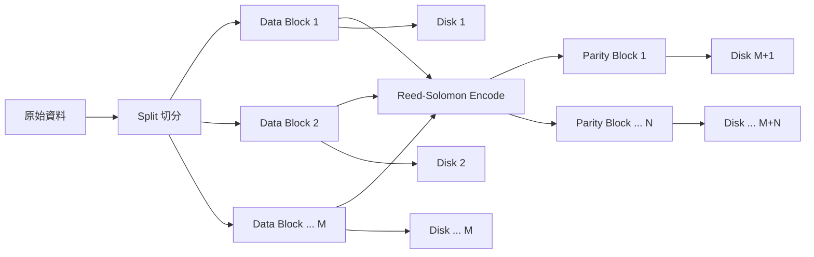
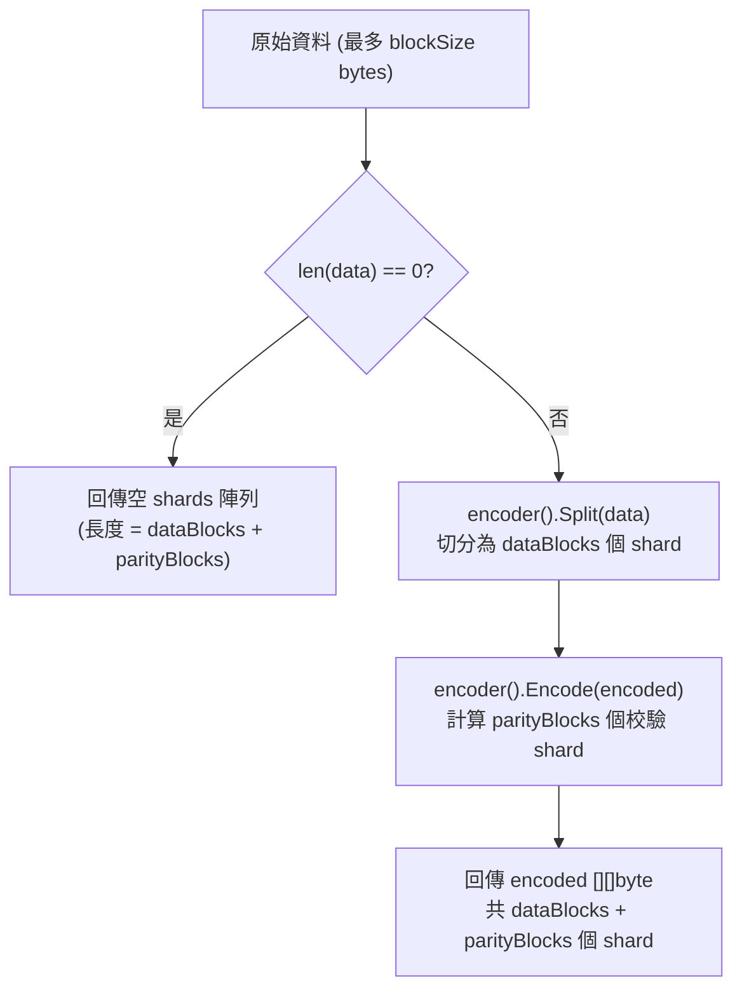
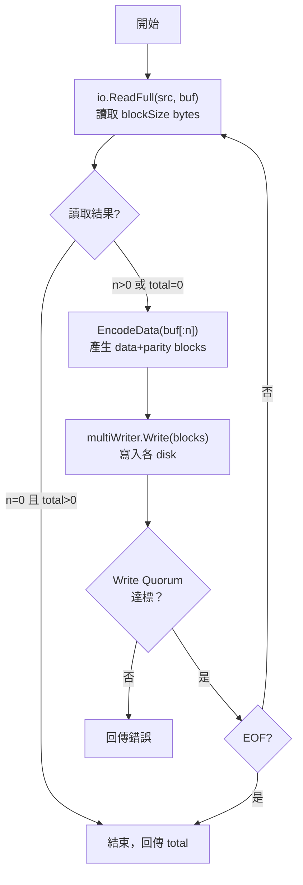
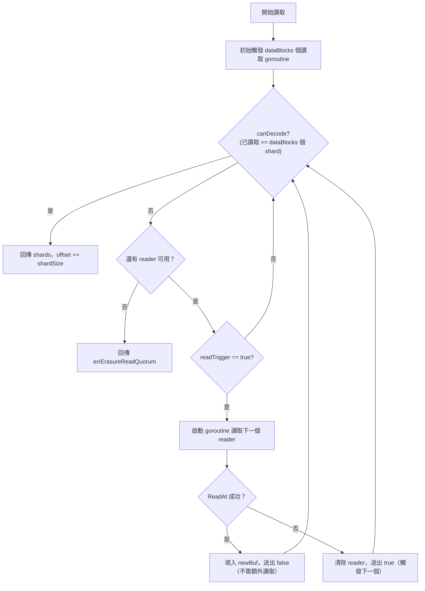
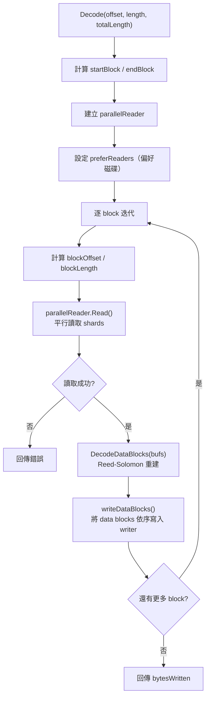
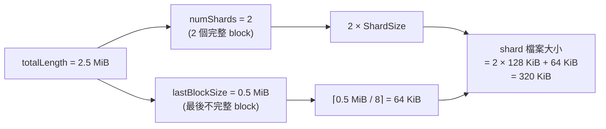
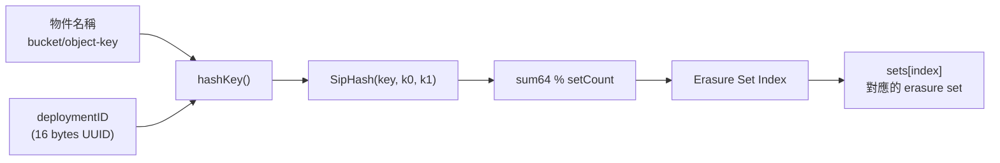
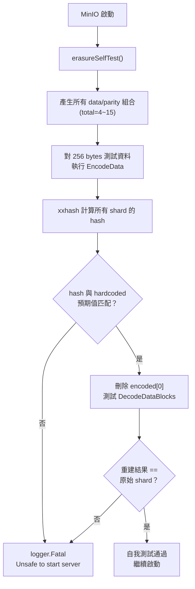
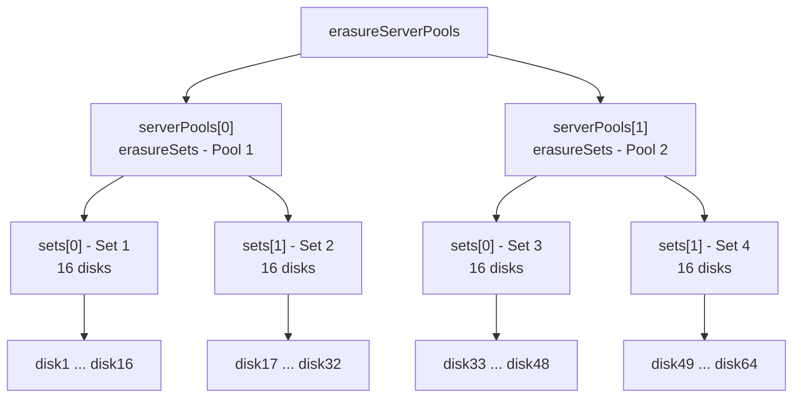

# MinIO — Erasure Coding 與資料分片

MinIO 使用 **Erasure Coding（糾刪碼）** 技術將物件資料分散儲存至多個磁碟上，即使部分磁碟故障仍可完整還原原始資料。這是 MinIO 達成高可用性與資料耐久性的核心機制。

## 1. Reed-Solomon 演算法概述

MinIO 的 Erasure Coding 底層使用 [klauspost/reedsolomon](https://github.com/klauspost/reedsolomon) 函式庫，實現 **Reed-Solomon** 糾刪碼演算法。

### 核心概念：Data Blocks 與 Parity Blocks

Reed-Solomon 將原始資料切分成 **M 個 Data Blocks**（資料分片）並計算出 **N 個 Parity Blocks**（校驗分片），共產生 `M + N` 個 shards，分別寫入不同磁碟。系統最多可容忍 **N 個** shards 遺失或毀損，仍能透過剩餘的 M 個 shards 重建完整資料。



在 MinIO 的原始碼中，`ErasureAlgo` 型別定義了支援的演算法：

```go
// 檔案: cmd/xl-storage-format-v2.go
// ErasureAlgo defines common type of different erasure algorithms
type ErasureAlgo uint8

const (
	invalidErasureAlgo ErasureAlgo = 0
	ReedSolomon        ErasureAlgo = 1
	lastErasureAlgo    ErasureAlgo = 2
)
```

目前 MinIO 唯一支援的演算法為 `ReedSolomon`（值為 1）。

::: tip 為什麼選擇 Reed-Solomon？
Reed-Solomon 是一種 **MDS（Maximum Distance Separable）** 編碼，在相同的冗餘開銷下，它能達到最大的容錯能力。MinIO 使用 `klauspost/reedsolomon` 實作，該函式庫利用 SIMD 指令集（SSE2/AVX2/AVX-512）進行高效的 Galois Field 運算。
:::

## 2. Erasure 核心結構

### Erasure struct

`Erasure` 結構體是整個 Erasure Coding 系統的運算核心：

```go
// 檔案: cmd/erasure-coding.go
// Erasure - erasure encoding details.
type Erasure struct {
	encoder                  func() reedsolomon.Encoder
	dataBlocks, parityBlocks int
	blockSize                int64
}
```

| 欄位 | 型別 | 說明 |
|------|------|------|
| `encoder` | `func() reedsolomon.Encoder` | 延遲初始化的 Reed-Solomon 編碼器（使用 `sync.Once`） |
| `dataBlocks` | `int` | 資料分片數量（M） |
| `parityBlocks` | `int` | 校驗分片數量（N） |
| `blockSize` | `int64` | 每次編碼處理的區塊大小 |

### 建構函式 — NewErasure

```go
// 檔案: cmd/erasure-coding.go
func NewErasure(ctx context.Context, dataBlocks, parityBlocks int, blockSize int64) (e Erasure, err error) {
	// Check the parameters for sanity now.
	if dataBlocks <= 0 || parityBlocks < 0 {
		return e, reedsolomon.ErrInvShardNum
	}

	if dataBlocks+parityBlocks > 256 {
		return e, reedsolomon.ErrMaxShardNum
	}

	e = Erasure{
		dataBlocks:   dataBlocks,
		parityBlocks: parityBlocks,
		blockSize:    blockSize,
	}

	// Encoder when needed.
	var enc reedsolomon.Encoder
	var once sync.Once
	e.encoder = func() reedsolomon.Encoder {
		once.Do(func() {
			e, err := reedsolomon.New(dataBlocks, parityBlocks,
				reedsolomon.WithAutoGoroutines(int(e.ShardSize())))
			if err != nil {
				panic(err)
			}
			enc = e
		})
		return enc
	}
	return e, err
}
```

::: warning 參數限制
- `dataBlocks` 必須 > 0
- `parityBlocks` 必須 >= 0
- `dataBlocks + parityBlocks` 不可超過 **256**
- Encoder 使用 **lazy initialization**（`sync.Once`），在第一次實際使用時才建立
- `reedsolomon.WithAutoGoroutines` 會根據 `ShardSize` 自動決定是否使用平行化運算
:::

### blockSizeV2 常數

MinIO 的 blockSize 預設值定義在 `object-api-common.go`：

```go
// 檔案: cmd/object-api-common.go
const (
	// Block size used in erasure coding version 2.
	blockSizeV2 = 1 * humanize.MiByte  // = 1,048,576 bytes (1 MiB)
)
```

這表示每次 Erasure Coding 運算處理 **1 MiB** 的原始資料。較早的 v1 版本使用 10 MiB（`blockSizeV1`），但目前新物件一律使用 `blockSizeV2`。

## 3. Encode 流程深度分析

### 資料編碼：EncodeData

`EncodeData` 是核心編碼方法，將原始資料轉換為 erasure-coded 分片：

```go
// 檔案: cmd/erasure-coding.go
func (e *Erasure) EncodeData(ctx context.Context, data []byte) ([][]byte, error) {
	if len(data) == 0 {
		return make([][]byte, e.dataBlocks+e.parityBlocks), nil
	}
	encoded, err := e.encoder().Split(data)
	if err != nil {
		return nil, err
	}
	if err = e.encoder().Encode(encoded); err != nil {
		return nil, err
	}
	return encoded, nil
}
```

流程分為兩步：

1. **Split** — 將原始資料 `data` 平均切分為 `dataBlocks` 個 shard（若不整除則自動 padding）
2. **Encode** — 基於 data shards 計算 parity shards，填入同一 slice 的後半部分



### 串流編碼：Encode

`Encode` 方法支援串流式處理，從 `io.Reader` 讀取資料、編碼後寫入多個 `io.Writer`：

```go
// 檔案: cmd/erasure-encode.go
func (e *Erasure) Encode(ctx context.Context, src io.Reader, writers []io.Writer,
	buf []byte, quorum int) (total int64, err error) {
	writer := &multiWriter{
		writers:     writers,
		writeQuorum: quorum,
		errs:        make([]error, len(writers)),
	}

	for {
		var blocks [][]byte
		n, err := io.ReadFull(src, buf)
		// ...處理 EOF...

		eof := err == io.EOF || err == io.ErrUnexpectedEOF
		if n == 0 && total != 0 {
			break
		}

		blocks, err = e.EncodeData(ctx, buf[:n])
		if err != nil {
			return 0, err
		}

		if err = writer.Write(ctx, blocks); err != nil {
			return 0, err
		}

		total += int64(n)
		if eof {
			break
		}
	}
	return total, nil
}
```

完整的 Encode 循環：



### multiWriter — 平行寫入與 Quorum 判定

`multiWriter` 負責將各 shard 寫入對應的磁碟 writer，並進行 Write Quorum 判定：

```go
// 檔案: cmd/erasure-encode.go
type multiWriter struct {
	writers     []io.Writer
	writeQuorum int
	errs        []error
}

func (p *multiWriter) Write(ctx context.Context, blocks [][]byte) error {
	for i := range p.writers {
		if p.errs[i] != nil {
			continue
		}
		if p.writers[i] == nil {
			p.errs[i] = errDiskNotFound
			continue
		}
		var n int
		n, p.errs[i] = p.writers[i].Write(blocks[i])
		if p.errs[i] == nil {
			if n != len(blocks[i]) {
				p.errs[i] = io.ErrShortWrite
				p.writers[i] = nil
			}
		} else {
			p.writers[i] = nil
		}
	}

	nilCount := countErrs(p.errs, nil)
	if nilCount >= p.writeQuorum {
		return nil
	}

	writeErr := reduceWriteQuorumErrs(ctx, p.errs, objectOpIgnoredErrs, p.writeQuorum)
	return fmt.Errorf("%w (offline-disks=%d/%d)", writeErr, countErrs(p.errs, errDiskNotFound), len(p.writers))
}
```

::: info 關鍵行為
- 每個 `blocks[i]` 寫入對應的 `writers[i]`（即第 i 個磁碟）
- 寫入失敗的 writer 會被設為 `nil`，後續不再重試
- 只要成功寫入的數量 >= `writeQuorum`，整體寫入即算成功
- 若不足 quorum，回傳 `errErasureWriteQuorum` 錯誤
:::

## 4. Decode 流程深度分析

### parallelReader — 平行讀取引擎

`parallelReader` 是讀取端的核心元件，負責從多個磁碟平行讀取 shard 資料：

```go
// 檔案: cmd/erasure-decode.go
type parallelReader struct {
	readers       []io.ReaderAt
	orgReaders    []io.ReaderAt
	dataBlocks    int
	offset        int64
	shardSize     int64
	shardFileSize int64
	buf           [][]byte
	readerToBuf   []int
	stashBuffer   []byte
}
```

| 欄位 | 說明 |
|------|------|
| `readers` | 可能被重新排序的 reader 列表（優先讀取偏好磁碟） |
| `orgReaders` | 原始 reader 順序（用於回報錯誤狀態） |
| `dataBlocks` | 資料分片數量，也是 Read Quorum 閾值 |
| `offset` | 當前在 shard 檔案中的讀取位置 |
| `shardSize` | 每個 shard 的大小 |
| `shardFileSize` | shard 檔案的總長度 |
| `buf` | 每個 reader 對應的讀取緩衝區 |
| `readerToBuf` | reader 到 buffer 的映射（因為 reader 可能被重新排序） |
| `stashBuffer` | 從 `globalBytePoolCap` 分配的共用記憶體池 |

### parallelReader 初始化

```go
// 檔案: cmd/erasure-decode.go
func newParallelReader(readers []io.ReaderAt, e Erasure, offset, totalLength int64) *parallelReader {
	r2b := make([]int, len(readers))
	for i := range r2b {
		r2b[i] = i
	}
	bufs := make([][]byte, len(readers))
	shardSize := int(e.ShardSize())
	var b []byte

	if globalBytePoolCap.Load().WidthCap() >= len(readers)*shardSize {
		b = globalBytePoolCap.Load().Get()
		for i := range bufs {
			bufs[i] = b[i*shardSize : (i+1)*shardSize]
		}
	}

	return &parallelReader{
		readers:       readers,
		orgReaders:    readers,
		dataBlocks:    e.dataBlocks,
		offset:        (offset / e.blockSize) * e.ShardSize(),
		shardSize:     e.ShardSize(),
		shardFileSize: e.ShardFileSize(totalLength),
		buf:           make([][]byte, len(readers)),
		readerToBuf:   r2b,
		stashBuffer:   b,
	}
}
```

::: tip Buffer Pool 最佳化
`globalBytePoolCap` 是一個全域 byte pool，在 `newErasureServerPools` 中初始化。如果 pool 的容量足夠容納所有 reader 的 shard 緩衝區，就會一次性分配一塊連續記憶體，避免頻繁的 heap allocation。讀取完成後透過 `Done()` 方法歸還。
:::

### Read 方法 — 核心平行讀取邏輯

`parallelReader.Read` 使用 **channel + goroutine** 模型實現平行讀取：

```go
// 檔案: cmd/erasure-decode.go（簡化）
func (p *parallelReader) Read(dst [][]byte) ([][]byte, error) {
	// ...初始化 newBuf...

	readTriggerCh := make(chan bool, len(p.readers))

	// 初始觸發 dataBlocks 數量的讀取
	for i := 0; i < p.dataBlocks; i++ {
		readTriggerCh <- true
	}

	readerIndex := 0
	for readTrigger := range readTriggerCh {
		if p.canDecode(newBuf) {
			break
		}
		if readerIndex == len(p.readers) {
			break
		}
		if !readTrigger {
			continue
		}
		go func(i int) {
			// ...從 p.readers[i] 讀取 shard...
			n, err := rr.ReadAt(p.buf[bufIdx], p.offset)
			if err != nil {
				// 讀取失敗，觸發下一個 reader
				readTriggerCh <- true
				return
			}
			newBuf[bufIdx] = p.buf[bufIdx][:n]
			// 讀取成功，不需要額外觸發
			readTriggerCh <- false
		}(readerIndex)
		readerIndex++
	}

	if p.canDecode(newBuf) {
		p.offset += p.shardSize
		return newBuf, nil
	}
	return nil, errErasureReadQuorum
}
```



::: warning 關鍵設計：Lazy Reader 啟動
`parallelReader` 不會一次啟動所有 reader 的 goroutine，而是先啟動 `dataBlocks` 個。只有當某個 reader 失敗時，才會觸發下一個 reader，直到收集到足夠的 shard 為止。這大幅減少了正常情況下的 I/O 開銷。
:::

### canDecode — 判斷是否可重建

```go
// 檔案: cmd/erasure-decode.go
func (p *parallelReader) canDecode(buf [][]byte) bool {
	bufCount := 0
	for _, b := range buf {
		if len(b) > 0 {
			bufCount++
		}
	}
	return bufCount >= p.dataBlocks
}
```

只要收集到 **>= dataBlocks** 個有效 shard，即可進行資料重建。

### Decode — 完整解碼流程

```go
// 檔案: cmd/erasure-decode.go
func (e Erasure) Decode(ctx context.Context, writer io.Writer, readers []io.ReaderAt,
	offset, length, totalLength int64, prefer []bool) (written int64, derr error) {

	if offset < 0 || length < 0 {
		return -1, errInvalidArgument
	}
	if offset+length > totalLength {
		return -1, errInvalidArgument
	}
	if length == 0 {
		return 0, nil
	}

	reader := newParallelReader(readers, e, offset, totalLength)
	if len(prefer) == len(readers) {
		reader.preferReaders(prefer)
	}
	defer reader.Done()

	startBlock := offset / e.blockSize
	endBlock := (offset + length) / e.blockSize

	var bytesWritten int64
	var bufs [][]byte
	for block := startBlock; block <= endBlock; block++ {
		var blockOffset, blockLength int64
		switch {
		case startBlock == endBlock:
			blockOffset = offset % e.blockSize
			blockLength = length
		case block == startBlock:
			blockOffset = offset % e.blockSize
			blockLength = e.blockSize - blockOffset
		case block == endBlock:
			blockOffset = 0
			blockLength = (offset + length) % e.blockSize
		default:
			blockOffset = 0
			blockLength = e.blockSize
		}
		if blockLength == 0 {
			break
		}

		bufs, err = reader.Read(bufs)
		// ...錯誤處理...

		if err = e.DecodeDataBlocks(bufs); err != nil {
			return -1, err
		}

		n, err := writeDataBlocks(ctx, writer, bufs, e.dataBlocks, blockOffset, blockLength)
		// ...
		bytesWritten += n
	}
	return bytesWritten, derr
}
```

完整 Decode 流程：



### DecodeDataBlocks vs DecodeDataAndParityBlocks

MinIO 提供兩種解碼方法：

```go
// 檔案: cmd/erasure-coding.go
// DecodeDataBlocks 只重建資料分片，不驗證校驗分片
func (e *Erasure) DecodeDataBlocks(data [][]byte) error {
	isZero := 0
	for _, b := range data {
		if len(b) == 0 {
			isZero++
			break
		}
	}
	if isZero == 0 || isZero == len(data) {
		return nil
	}
	return e.encoder().ReconstructData(data)
}

// DecodeDataAndParityBlocks 重建所有分片（含校驗分片）
func (e *Erasure) DecodeDataAndParityBlocks(ctx context.Context, data [][]byte) error {
	return e.encoder().Reconstruct(data)
}
```

| 方法 | 底層呼叫 | 用途 |
|------|----------|------|
| `DecodeDataBlocks` | `ReconstructData` | 一般讀取 — 只需要資料，效能較高 |
| `DecodeDataAndParityBlocks` | `Reconstruct` | **Healing** — 需要完整重建所有 shard 寫回磁碟 |

::: tip 效能考量
`DecodeDataBlocks` 有一個重要的最佳化：如果所有 shard 都有資料（`isZero == 0`），代表沒有遺失，直接跳過重建運算。同樣，如果所有 shard 都是空的（`isZero == len(data)`），代表原始 payload 為 0 bytes，也無需處理。
:::

## 5. Shard Size 計算

### ShardSize — 每個分片的大小

```go
// 檔案: cmd/erasure-coding.go
func (e *Erasure) ShardSize() int64 {
	return ceilFrac(e.blockSize, int64(e.dataBlocks))
}
```

其中 `ceilFrac` 定義於 `cmd/utils.go`，計算**向上取整除法**。

**公式：**

```
ShardSize = ⌈blockSize / dataBlocks⌉
```

**範例**（預設 16 disks = 8 data + 8 parity）：

```
ShardSize = ⌈1,048,576 / 8⌉ = 131,072 bytes = 128 KiB
```

每個 block（1 MiB 的原始資料）被切成 8 個 128 KiB 的 data shard，再產生 8 個 128 KiB 的 parity shard，共 16 個 shard 分散到 16 個磁碟。

### ShardFileSize — 完整物件的 Shard 檔案大小

```go
// 檔案: cmd/erasure-coding.go
func (e *Erasure) ShardFileSize(totalLength int64) int64 {
	if totalLength == 0 {
		return 0
	}
	if totalLength == -1 {
		return -1
	}
	numShards := totalLength / e.blockSize
	lastBlockSize := totalLength % e.blockSize
	lastShardSize := ceilFrac(lastBlockSize, int64(e.dataBlocks))
	return numShards*e.ShardSize() + lastShardSize
}
```



### ShardFileOffset — 計算讀取起始位置

```go
// 檔案: cmd/erasure-coding.go
func (e *Erasure) ShardFileOffset(startOffset, length, totalLength int64) int64 {
	shardSize := e.ShardSize()
	shardFileSize := e.ShardFileSize(totalLength)
	endShard := (startOffset + length) / e.blockSize
	tillOffset := min(endShard*shardSize+shardSize, shardFileSize)
	return tillOffset
}
```

此方法用於 **Range Read** 場景，計算在 shard 檔案中需要讀取到哪個位置才能涵蓋要求的 `[startOffset, startOffset+length)` 範圍。

## 6. Erasure Set 概念

### 什麼是 Erasure Set

MinIO 將所有磁碟劃分為若干個 **Erasure Set**，每個 set 包含固定數量的磁碟（`setDriveCount`），獨立進行 Erasure Coding 運算。物件透過 hash 函式被路由到特定的 set。

```go
// 檔案: cmd/erasure-sets.go
type erasureSets struct {
	sets []*erasureObjects

	format *formatErasureV3

	erasureDisksMu sync.RWMutex
	erasureDisks   [][]StorageAPI

	erasureLockers   setsDsyncLockers
	erasureLockOwner string

	endpoints       PoolEndpoints
	endpointStrings []string

	setCount, setDriveCount int
	defaultParityCount      int

	poolIndex        int
	distributionAlgo string
	deploymentID     [16]byte
}
```

| 欄位 | 說明 |
|------|------|
| `sets` | 所有 erasure set 的陣列，每個元素是一個 `*erasureObjects` |
| `erasureDisks` | 二維陣列 `[setIndex][diskIndex]`，每個 set 的磁碟列表 |
| `setCount` | Erasure Set 的總數 |
| `setDriveCount` | 每個 set 包含的磁碟數量 |
| `defaultParityCount` | 預設校驗分片數量 |
| `distributionAlgo` | 物件到 set 的分配演算法 |
| `deploymentID` | 部署唯一識別碼（用於 SipHash） |

### 初始化流程

```go
// 檔案: cmd/erasure-sets.go
func newErasureSets(ctx context.Context, endpoints PoolEndpoints, storageDisks []StorageAPI,
	format *formatErasureV3, defaultParityCount, poolIdx int) (*erasureSets, error) {
	setCount := len(format.Erasure.Sets)
	setDriveCount := len(format.Erasure.Sets[0])

	s := &erasureSets{
		sets:               make([]*erasureObjects, setCount),
		erasureDisks:       make([][]StorageAPI, setCount),
		erasureLockers:     make([][]dsync.NetLocker, setCount),
		erasureLockOwner:   globalLocalNodeName,
		endpoints:          endpoints,
		setCount:           setCount,
		setDriveCount:      setDriveCount,
		defaultParityCount: defaultParityCount,
		format:             format,
		distributionAlgo:   format.Erasure.DistributionAlgo,
		deploymentID:       uuid.MustParse(format.ID),
		poolIndex:          poolIdx,
	}
	// ...為每個 set 初始化磁碟和 locker...
}
```

::: info 磁碟分組邏輯
- `setCount` 和 `setDriveCount` 來自磁碟格式化時寫入的 `format.json`
- 例如 32 個磁碟、每 set 16 個磁碟 → `setCount = 2`，`setDriveCount = 16`
- 每個 set 的磁碟 UUID 排列在 `format.Erasure.Sets[][]` 中記錄
:::

### 物件到 Set 的 Hash 路由

MinIO 使用 hash 函式將物件名稱映射到特定的 Erasure Set：

```go
// 檔案: cmd/erasure-sets.go
func (s *erasureSets) getHashedSetIndex(input string) int {
	return hashKey(s.distributionAlgo, input, len(s.sets), s.deploymentID)
}

func (s *erasureSets) getHashedSet(input string) (set *erasureObjects) {
	return s.sets[s.getHashedSetIndex(input)]
}
```

`hashKey` 函式根據演算法版本選擇不同的 hash 策略：

```go
// 檔案: cmd/erasure-sets.go
func hashKey(algo string, key string, cardinality int, id [16]byte) int {
	switch algo {
	case formatErasureVersionV2DistributionAlgoV1:
		return crcHashMod(key, cardinality)
	case formatErasureVersionV3DistributionAlgoV2,
		formatErasureVersionV3DistributionAlgoV3:
		return sipHashMod(key, cardinality, id)
	default:
		return -1
	}
}

func sipHashMod(key string, cardinality int, id [16]byte) int {
	if cardinality <= 0 {
		return -1
	}
	k0, k1 := binary.LittleEndian.Uint64(id[0:8]),
		binary.LittleEndian.Uint64(id[8:16])
	sum64 := siphash.Hash(k0, k1, []byte(key))
	return int(sum64 % uint64(cardinality))
}

func crcHashMod(key string, cardinality int) int {
	if cardinality <= 0 {
		return -1
	}
	keyCrc := crc32.Checksum([]byte(key), crc32.IEEETable)
	return int(keyCrc % uint32(cardinality))
}
```

| 演算法版本 | Hash 函式 | 特點 |
|-----------|-----------|------|
| V1 (legacy) | CRC32 | 簡單但較不均勻 |
| V2 / V3 (current) | SipHash | 使用 `deploymentID` 作為 key，分布更均勻，且不同部署的 hash 結果不同 |



## 7. Write Quorum 機制

Write Quorum 定義了**寫入操作需要多少個磁碟成功才算完成**。

### 公式

```
Write Quorum = dataBlocks + 1
```

在預設 16 disks（8 data + 8 parity）配置下：

```
Write Quorum = 8 + 1 = 9
```

這表示 16 個磁碟中至少 **9 個**必須成功寫入。相較於 Read Quorum，Write Quorum 更嚴格，因為需要確保寫入後的資料有足夠的冗餘度可供日後讀取。

### 實作：reduceWriteQuorumErrs

```go
// 檔案: cmd/erasure-metadata-utils.go
func reduceWriteQuorumErrs(ctx context.Context, errs []error,
	ignoredErrs []error, writeQuorum int) (maxErr error) {
	return reduceQuorumErrs(ctx, errs, ignoredErrs, writeQuorum, errErasureWriteQuorum)
}

func reduceQuorumErrs(ctx context.Context, errs []error,
	ignoredErrs []error, quorum int, quorumErr error) error {
	if contextCanceled(ctx) {
		return context.Canceled
	}
	maxCount, maxErr := reduceErrs(errs, ignoredErrs)
	if maxCount >= quorum {
		return maxErr
	}
	return quorumErr
}
```

**判定邏輯**：統計所有磁碟的錯誤回報，忽略可忽略的錯誤（如 `errDiskNotFound`），若成功（`nil` error）的數量達到 quorum 則寫入成功，否則回傳 `errErasureWriteQuorum`。

### multiWriter 中的 Quorum 判定

```go
// 檔案: cmd/erasure-encode.go（Write 方法內）
nilCount := countErrs(p.errs, nil)
if nilCount >= p.writeQuorum {
	return nil
}
```

::: warning Write Quorum vs HealFile
在 `Heal` 操作中，`multiWriter` 的 `writeQuorum` 被設為 **1**，因為 healing 只需要成功寫入遺失的那個 shard 即可。
:::

## 8. Read Quorum 機制

Read Quorum 定義了**讀取操作需要多少個磁碟成功讀取才能重建資料**。

### 公式

```
Read Quorum = dataBlocks
```

在預設 16 disks（8 data + 8 parity）配置下：

```
Read Quorum = 8
```

只要有 **8 個** shard（不論是 data 還是 parity shard）可讀取，Reed-Solomon 就能重建完整的原始資料。

### 實作：parallelReader.canDecode

```go
// 檔案: cmd/erasure-decode.go
func (p *parallelReader) canDecode(buf [][]byte) bool {
	bufCount := 0
	for _, b := range buf {
		if len(b) > 0 {
			bufCount++
		}
	}
	return bufCount >= p.dataBlocks
}
```

### 讀取失敗時的 Quorum 錯誤

```go
// 檔案: cmd/erasure-decode.go
// Read 方法結尾
if p.canDecode(newBuf) {
	p.offset += p.shardSize
	return newBuf, nil
}
return nil, fmt.Errorf("%w (offline-disks=%d/%d)", errErasureReadQuorum,
	disksNotFound, len(p.readers))
```

### Quorum 概覽表

| 配置 | Data (M) | Parity (N) | Write Quorum | Read Quorum | 可容忍故障磁碟數 |
|------|----------|------------|--------------|-------------|----------------|
| 4 disks | 2 | 2 | 3 | 2 | 2 |
| 8 disks | 4 | 4 | 5 | 4 | 4 |
| 16 disks | 8 | 8 | 9 | 8 | 8 |
| 16 disks (EC:4) | 12 | 4 | 13 | 12 | 4 |

::: tip 權衡取捨
- **更高的 parity** → 更強的容錯能力，但可用儲存空間更少（空間效率 = M / (M+N)）
- **更低的 parity** → 更多的可用空間，但容錯能力下降
- 預設的 M = N（50% 冗餘）提供了最佳的平衡
:::

## 9. 自我測試 — erasureSelfTest()

MinIO 在啟動時會執行 `erasureSelfTest()` 驗證 Erasure Coding 的正確性：

```go
// 檔案: cmd/erasure-coding.go
func erasureSelfTest() {
	// Approx runtime ~1ms
	var testConfigs [][2]uint8
	for total := uint8(4); total < 16; total++ {
		for data := total / 2; data < total; data++ {
			parity := total - data
			testConfigs = append(testConfigs, [2]uint8{data, parity})
		}
	}

	// want 包含所有預期的 hash 值（hardcoded）
	got := make(map[[2]uint8]map[ErasureAlgo]uint64, len(testConfigs))
	want := map[[2]uint8]map[ErasureAlgo]uint64{
		{0x2, 0x2}: {0x1: 0x23fb21be2496f5d3},
		// ...（所有 data/parity 組合的預期 hash）
	}

	var testData [256]byte
	for i := range testData {
		testData[i] = byte(i)
	}

	ok := true
	for algo := invalidErasureAlgo + 1; algo < lastErasureAlgo; algo++ {
		for _, conf := range testConfigs {
			e, err := NewErasure(context.Background(),
				int(conf[0]), int(conf[1]), blockSizeV2)

			// 1. 編碼測試資料
			encoded, err := e.EncodeData(GlobalContext, testData[:])

			// 2. 計算所有 shard 的 xxhash 並比對預期值
			hash := xxhash.New()
			for i, data := range encoded {
				hash.Write([]byte{byte(i)})
				hash.Write(data)
				got[conf] = map[ErasureAlgo]uint64{algo: hash.Sum64()}
			}

			// 3. 比對 hash
			if !reflect.DeepEqual(want[conf], got[conf]) {
				ok = false
				continue
			}

			// 4. 刪除第一個 shard，測試重建
			first := encoded[0]
			encoded[0] = nil
			e.DecodeDataBlocks(encoded)
			if !bytes.Equal(first, encoded[0]) {
				ok = false
			}
		}
	}
	if !ok {
		logger.Fatal(errSelfTestFailure, "Erasure Coding self test failed")
	}
}
```



::: warning 啟動安全閘
如果自我測試失敗，MinIO 會 **拒絕啟動**（`logger.Fatal`），避免因底層 CPU 指令集問題或記憶體損壞導致靜默資料毀損。整個測試約 1ms 完成。
:::

## 10. 效能最佳化

### 10.1 parallelReader — Lazy 啟動與偏好磁碟

如同第 4 節所述，`parallelReader` 只啟動 `dataBlocks` 個初始 goroutine，失敗時才逐一啟動後備 reader，最小化正常路徑的 I/O 開銷。

此外，`preferReaders` 方法允許指定偏好磁碟（例如本地磁碟）：

```go
// 檔案: cmd/erasure-decode.go
func (p *parallelReader) preferReaders(prefer []bool) {
	if len(prefer) != len(p.orgReaders) {
		return
	}
	tmp := make([]io.ReaderAt, len(p.orgReaders))
	copy(tmp, p.orgReaders)
	p.readers = tmp
	next := 0
	for i, ok := range prefer {
		if !ok || p.readers[i] == nil {
			continue
		}
		if i == next {
			next++
			continue
		}
		p.readers[next], p.readers[i] = p.readers[i], p.readers[next]
		p.readerToBuf[next] = i
		p.readerToBuf[i] = next
		next++
	}
}
```

偏好的 reader 會被移動到陣列前端，優先被啟動讀取。這在分散式部署中可以**優先讀取本地磁碟**，避免不必要的網路 I/O。

### 10.2 Global Byte Pool — 記憶體池

```go
// 檔案: cmd/erasure-server-pool.go
func newErasureServerPools(ctx context.Context,
	endpointServerPools EndpointServerPools) (ObjectLayer, error) {
	// ...
	n := uint64(1024)
	if globalIsDistErasure {
		n = 2048
	}

	// 避免分配超過可用記憶體的一半
	if maxN := availableMemory() / (blockSizeV2 * 2); n > maxN {
		n = maxN
	}

	if globalIsCICD || strconv.IntSize == 32 {
		n = 256
	}

	buffers := bpool.NewBytePoolCap(n, blockSizeV2, blockSizeV2*2)
	if n >= 16384 {
		buffers.Populate()  // 預先分配
	}
	globalBytePoolCap.Store(buffers)
	// ...
}
```

| 部署模式 | Buffer Pool 大小 | 說明 |
|---------|-----------------|------|
| 單節點 | 1,024 個 1 MiB buffer | 約 1 GiB |
| 分散式 | 2,048 個 1 MiB buffer | 約 2 GiB |
| CI/CD 或 32-bit | 256 個 1 MiB buffer | 約 256 MiB |
| 大型部署 (>= 32 GiB) | 16,384+ 個，**預先分配** | 避免啟動後的 GC 壓力 |

::: tip 記憶體管理策略
- 使用 `bpool.NewBytePoolCap` 建立可重用的 byte buffer pool
- 每個 buffer 寬度為 `blockSizeV2`（1 MiB），最大容量為 2 MiB
- 大型部署時使用 `Populate()` 預先分配所有 buffer，減少運行時的 GC 壓力
- `parallelReader` 在 `newParallelReader` 中從 pool 取得 buffer，在 `Done()` 中歸還
:::

### 10.3 Streaming 模式

`Encode` 方法本身就是串流設計：每次從 `src` 讀取 `blockSize` 大小的 chunk，編碼後立即寫入磁碟，不需要將整個物件載入記憶體。這使得 MinIO 可以高效處理任意大小的物件。

### 10.4 Encoder 延遲初始化

如 `NewErasure` 所示，`reedsolomon.Encoder` 使用 `sync.Once` 進行延遲初始化。`reedsolomon.WithAutoGoroutines` 選項會根據 shard size 自動決定是否啟用 goroutine 平行化 — 小 shard 時單 goroutine 反而更快（避免 goroutine 排程開銷）。

### 10.5 Heal — 完整重建流程

```go
// 檔案: cmd/erasure-decode.go
func (e Erasure) Heal(ctx context.Context, writers []io.Writer,
	readers []io.ReaderAt, totalLength int64, prefer []bool) (derr error) {

	reader := newParallelReader(readers, e, 0, totalLength)
	if len(readers) == len(prefer) {
		reader.preferReaders(prefer)
	}
	defer reader.Done()

	startBlock := int64(0)
	endBlock := totalLength / e.blockSize
	if totalLength%e.blockSize != 0 {
		endBlock++
	}

	for block := startBlock; block < endBlock; block++ {
		bufs, err = reader.Read(bufs)
		// ...

		// Heal 使用 Reconstruct（重建所有 shard，包含 parity）
		if err = e.DecodeDataAndParityBlocks(ctx, bufs); err != nil {
			return err
		}

		w := multiWriter{
			writers:     writers,
			writeQuorum: 1,  // Heal 只需 1 個成功即可
			errs:        make([]error, len(writers)),
		}
		if err = w.Write(ctx, bufs); err != nil {
			return err
		}
	}
	return derr
}
```

Heal 與普通 Decode 的差異：
1. 使用 `DecodeDataAndParityBlocks`（`Reconstruct`）重建**所有** shard
2. `writeQuorum` 設為 1，因為 heal 的目標是逐一修復遺失的磁碟

## Server Pool — 多 Erasure Set 管理

`erasureServerPools` 是最上層的結構，管理多個 `erasureSets`：

```go
// 檔案: cmd/erasure-server-pool.go
type erasureServerPools struct {
	poolMetaMutex sync.RWMutex
	poolMeta      poolMeta

	rebalMu     sync.RWMutex
	rebalMeta   *rebalanceMeta
	rebalCancel context.CancelFunc

	deploymentID     [16]byte
	distributionAlgo string

	serverPools []*erasureSets

	decommissionCancelers []context.CancelFunc

	s3Peer  *S3PeerSys
	mpCache *xsync.MapOf[string, MultipartInfo]
}
```



::: info 相關章節
深入了解 MinIO 的其他核心機制：

- [系統架構](./architecture) — ObjectLayer 介面、部署模式與初始化流程
:::
