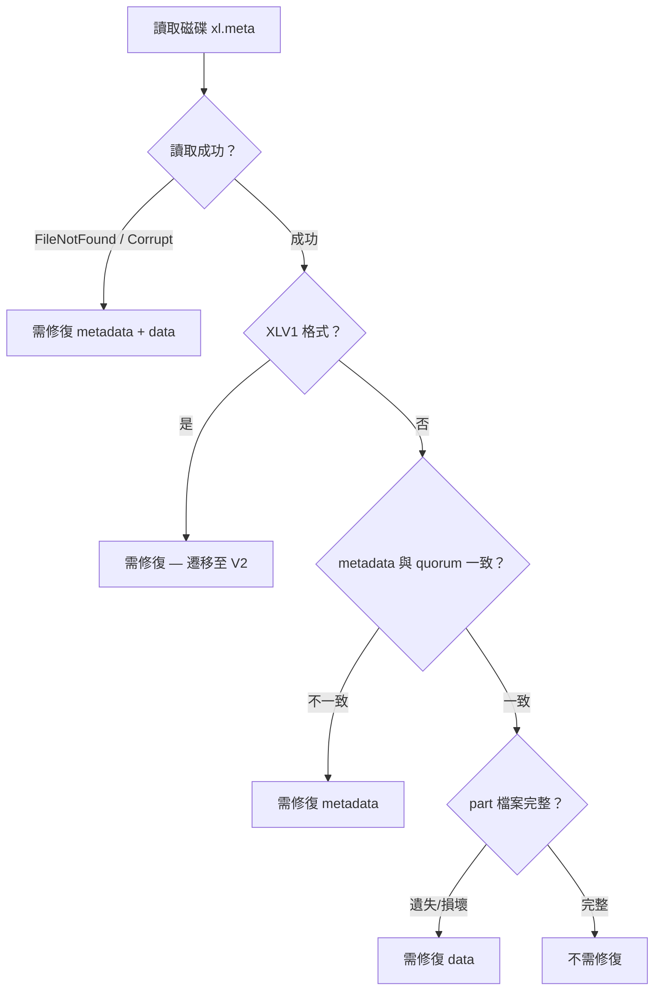
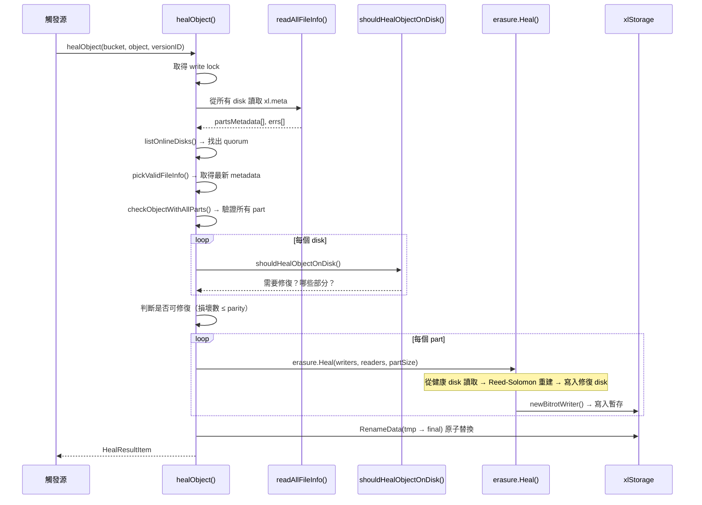
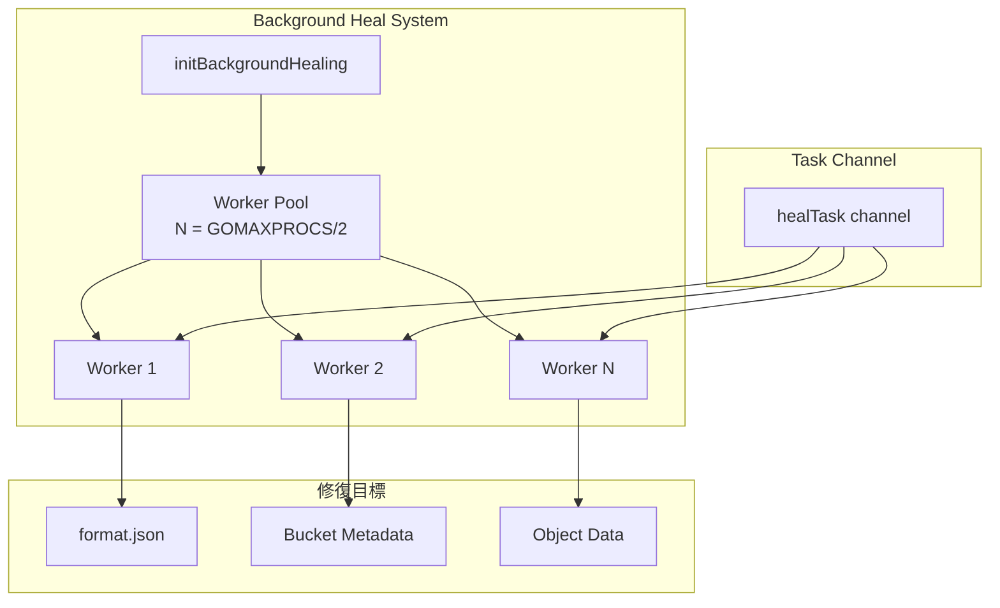

# MinIO — 資料修復與自癒機制

::: info 相關章節
- Erasure Coding 編解碼原理請參閱 [Erasure Coding 與資料分片](./erasure-coding)
- 底層磁碟讀寫細節請參閱 [底層硬碟讀寫機制](./disk-io)
- 物件讀寫完整流程請參閱 [物件讀寫完整流程](./object-lifecycle)
- 複製同步機制請參閱 [資料複製與同步](./data-replication)
:::

## 概述

MinIO 內建完整的資料自癒（Self-Healing）機制，能自動偵測並修復磁碟上損壞或遺失的資料。修復系統以 **Erasure Coding** 為基礎 — 只要剩餘的健康 shard 數量達到 Read Quorum（即 data blocks 數量），就能重建遺失的 shard 並寫回對應磁碟。

## 1. Bitrot 偵測

### 1.1 支援的雜湊演算法

MinIO 支援四種 Bitrot 偵測演算法，預設使用 **HighwayHash256S**（串流模式）：

```go
// 檔案: cmd/bitrot.go
var bitrotAlgorithms = map[BitrotAlgorithm]string{
    SHA256:          "sha256",
    BLAKE2b512:      "blake2b",
    HighwayHash256:  "highwayhash256",
    HighwayHash256S: "highwayhash256S",
}
```

| 演算法 | 模式 | 說明 |
|--------|------|------|
| `SHA256` | Whole | 標準 SHA-256，整個 shard 計算一次 hash |
| `BLAKE2b512` | Whole | BLAKE2b 512-bit，更快的替代方案 |
| `HighwayHash256` | Whole | Google HighwayHash，硬體加速最佳化 |
| `HighwayHash256S` | **Streaming** | HighwayHash 串流版，每個 chunk 獨立驗證（**預設**） |

::: tip HighwayHash256S 的優勢
串流模式在每個 shard chunk 前寫入一個 hash，讀取時可以 **逐 chunk 驗證**。相較於 whole mode 只在讀完整個 shard 後驗證，streaming mode 能更早偵測到損壞的位置，降低無用 I/O。
:::

### 1.2 Streaming Bitrot Writer

寫入時，`streamingBitrotWriter` 在每個 chunk 前面寫入 hash：

```go
// 檔案: cmd/bitrot-streaming.go
type streamingBitrotWriter struct {
    iow          io.WriteCloser
    closeWithErr func(err error)
    h            hash.Hash
    shardSize    int64
    canClose     *sync.WaitGroup
    byteBuf      []byte
    finished     bool
}

func (b *streamingBitrotWriter) Write(p []byte) (int, error) {
    // ...
    b.h.Reset()
    b.h.Write(p)
    hashBytes := b.h.Sum(nil)
    _, err := b.iow.Write(hashBytes)  // 先寫 hash
    // ...
    n, err := b.iow.Write(p)          // 再寫資料
    // ...
}
```

磁碟上的格式為：`[hash][chunk_data][hash][chunk_data]...`

### 1.3 Streaming Bitrot Reader

讀取時，`streamingBitrotReader` 驗證每個 chunk 的 hash：

```go
// 檔案: cmd/bitrot-streaming.go
type streamingBitrotReader struct {
    disk       StorageAPI
    data       []byte
    volume     string
    filePath   string
    tillOffset int64
    currOffset int64
    h          hash.Hash
    shardSize  int64
    hashBytes  []byte
}
```

若 hash 不匹配，回傳 `errFileCorrupt`，觸發 healing 流程。

### 1.4 啟動自我測試

MinIO 啟動時會執行 `bitrotSelfTest()`，用預計算的 checksum 驗證所有演算法：

```go
// 檔案: cmd/bitrot.go
func bitrotSelfTest() {
    checksums := map[BitrotAlgorithm]string{
        SHA256:          "a7677ff19e0182e4d52e3a3db727804abc82a5818749336369552e54b838b004",
        BLAKE2b512:      "e519b7d84b1c3c917985f544773a35cf265dcab10948be...",
        HighwayHash256:  "39c0407ed3f01b18d22c85db4aeff11e060ca5f43131b0...",
        HighwayHash256S: "39c0407ed3f01b18d22c85db4aeff11e060ca5f43131b0...",
    }
    for algorithm := range bitrotAlgorithms {
        // 計算測試資料的 hash 並與預期值比對
        // 不匹配則 logger.Fatal() 終止啟動
    }
}
```

## 2. Healing 判定邏輯

### 2.1 shouldHealObjectOnDisk()

此函式判定單一磁碟上的物件是否需要修復：

```go
// 檔案: cmd/erasure-healing.go
func shouldHealObjectOnDisk(erErr error, partsErrs []int, meta FileInfo,
    latestMeta FileInfo) (bool, bool, error) {
    // 情況 1: xl.meta 不存在、版本不存在、或檔案損壞 → 需修復 metadata + data
    if errors.Is(erErr, errFileNotFound) || errors.Is(erErr, errFileVersionNotFound) ||
       errors.Is(erErr, errFileCorrupt) {
        return true, true, erErr
    }
    if erErr == nil {
        // 情況 2: 舊版 XLV1 格式 → 總是修復（遷移至 V2）
        if meta.XLV1 {
            return true, true, errLegacyXLMeta
        }
        // 情況 3: metadata 與 quorum 不一致 → 需修復
        if !latestMeta.Equals(meta) {
            return true, true, errOutdatedXLMeta
        }
        // 情況 4: part 檔案遺失或損壞 → 只修復 data
        if !meta.Deleted && !meta.IsRemote() {
            for _, partErr := range partsErrs {
                if partErr == checkPartFileNotFound {
                    return true, false, errPartMissing
                }
                if partErr == checkPartFileCorrupt {
                    return true, false, errPartCorrupt
                }
            }
        }
        return false, false, nil
    }
    return false, false, erErr
}
```



### 2.2 判定修復是否可行

修復有前提 — 損壞的磁碟數不能超過 parity blocks 數量：

```go
// 檔案: cmd/erasure-healing.go (healObject 函式內)
cannotHeal := !latestMeta.XLV1 && !latestMeta.Deleted &&
    xlMetaToHealCount > latestMeta.Erasure.ParityBlocks

// 也檢查每個 part 是否有足夠的健康 shard
for _, partErrs := range dataErrsByPart {
    if countPartNotSuccess(partErrs) > latestMeta.Erasure.ParityBlocks {
        cannotHeal = true
        break
    }
}
```

::: warning 不可修復的情況
若損壞/遺失的 shard 數量超過 parity blocks 數量（例如 12 disk 中 parity = 6，但有 7 個 disk 故障），則**資料無法重建**，MinIO 會嘗試清理 dangling objects。
:::

## 3. healObject() — 修復核心流程

### 3.1 完整流程圖



### 3.2 程式碼解析

```go
// 檔案: cmd/erasure-healing.go
func (er *erasureObjects) healObject(ctx context.Context, bucket string, object string,
    versionID string, opts madmin.HealOpts) (result madmin.HealResultItem, err error) {

    storageDisks := er.getDisks()

    // Step 1: 讀取所有 disk 的 metadata
    partsMetadata, errs := readAllFileInfo(ctx, storageDisks, "", bucket, object, versionID, true, true)

    // Step 2: 取得 quorum metadata
    readQuorum, _, err := objectQuorumFromMeta(ctx, partsMetadata, errs, er.defaultParityCount)
    onlineDisks, quorumModTime, quorumETag := listOnlineDisks(storageDisks, partsMetadata, errs, readQuorum)
    latestMeta, err := pickValidFileInfo(ctx, partsMetadata, quorumModTime, quorumETag, readQuorum)

    // Step 3: 驗證每個 part 的完整性
    dataErrsByDisk, dataErrsByPart := checkObjectWithAllParts(ctx, onlineDisks, partsMetadata,
        errs, latestMeta, filterDisksByETag, bucket, object, scanMode)

    // Step 4: 找出需要修復的 disk
    outDatedDisks := make([]StorageAPI, len(storageDisks))
    for i := range onlineDisks {
        yes, isMeta, reason := shouldHealObjectOnDisk(errs[i], dataErrsByDisk[i], partsMetadata[i], latestMeta)
        if yes {
            outDatedDisks[i] = storageDisks[i]
        }
    }

    // Step 5: 初始化 Erasure codec
    erasure, err := NewErasure(ctx, latestMeta.Erasure.DataBlocks,
        latestMeta.Erasure.ParityBlocks, latestMeta.Erasure.BlockSize)

    // Step 6: 逐 part 修復
    tmpID := mustGetUUID()
    for partIndex := 0; partIndex < len(latestMeta.Parts); partIndex++ {
        // 從健康 disk 建立 BitrotReader
        readers := make([]io.ReaderAt, len(latestDisks))
        for i, disk := range latestDisks {
            if disk != nil && thisPartErrs[i] == checkPartSuccess {
                readers[i] = newBitrotReader(disk, ...)
            }
        }
        // 對修復目標 disk 建立 BitrotWriter
        writers := make([]io.Writer, len(outDatedDisks))
        for i, disk := range outDatedDisks {
            if disk != nil {
                writers[i] = newBitrotWriter(disk, ..., minioMetaTmpBucket, partPath, ...)
            }
        }
        // Reed-Solomon Heal — 重建所有 shard（data + parity）
        err = erasure.Heal(ctx, writers, readers, partSize, prefer)
    }

    // Step 7: 原子替換 — 從暫存位置 rename 到最終位置
    for i, disk := range outDatedDisks {
        if disk != nil {
            partsMetadata[i].SetHealing()
            disk.RenameData(ctx, minioMetaTmpBucket, tmpID, partsMetadata[i], bucket, object, RenameOptions{})
        }
    }
    return result, nil
}
```

::: tip Heal vs Decode 的差異
`erasure.Decode()` 只重建 **data blocks**（足以讀取原始資料），而 `erasure.Heal()` 重建 **data + parity blocks** 全部 shards，確保修復後的磁碟擁有完整的冗餘資料。
:::

## 4. 背景修復系統

### 4.1 healRoutine 架構

```go
// 檔案: cmd/background-heal-ops.go
type healRoutine struct {
    tasks   chan healTask
    workers int
}

type healTask struct {
    bucket    string
    object    string
    versionID string
    opts      madmin.HealOpts
    respCh    chan healResult
}
```

### 4.2 Worker Pool

```go
// 檔案: cmd/background-heal-ops.go
func newHealRoutine() *healRoutine {
    workers := runtime.GOMAXPROCS(0) / 2
    // 可透過 _MINIO_HEAL_WORKERS 環境變數覆寫
    // 最少 4 個 worker
    if workers == 0 {
        workers = 4
    }
    return &healRoutine{
        tasks:   make(chan healTask),
        workers: workers,
    }
}
```

### 4.3 Worker 處理邏輯

```go
// 檔案: cmd/background-heal-ops.go
func (h *healRoutine) AddWorker(ctx context.Context, objAPI ObjectLayer, bgSeq *healSequence) {
    for {
        select {
        case task := <-h.tasks:
            switch {
            case task.bucket == SlashSeparator:
                // 修復 format.json（磁碟格式）
                res, err = healDiskFormat(ctx, objAPI, task.opts)
            case task.object == "":
                // 修復 bucket metadata
                res, err = objAPI.HealBucket(ctx, task.bucket, task.opts)
            default:
                // 修復物件
                res, err = objAPI.HealObject(ctx, task.bucket, task.object, task.versionID, task.opts)
            }
        case <-ctx.Done():
            return
        }
    }
}
```

### 4.4 背景修復啟動

```go
// 檔案: cmd/background-heal-ops.go
func initBackgroundHealing(ctx context.Context, objAPI ObjectLayer) {
    bgSeq := newBgHealSequence()
    for range globalBackgroundHealRoutine.workers {
        go globalBackgroundHealRoutine.AddWorker(ctx, objAPI, bgSeq)
    }
    globalBackgroundHealState.LaunchNewHealSequence(bgSeq, objAPI)
}
```



### 4.5 I/O 節流

為避免修復操作影響正常請求，MinIO 內建 I/O 節流機制：

```go
// 檔案: cmd/background-heal-ops.go
func waitForLowHTTPReq() {
    maxIO, maxWait, _ := globalHealConfig.Clone()
    waitForLowIO(maxIO, maxWait, currentHTTPIO)
}

func waitForLowIO(maxIO int, maxWait time.Duration, currentIO func() int) {
    const waitTick = 100 * time.Millisecond
    for currentIO() >= maxIO {
        time.Sleep(waitTick)
        // 最多等待 maxWait 後繼續執行
    }
}
```

## 5. 修復觸發時機

| 觸發方式 | 說明 |
|----------|------|
| **背景掃描** | `healSequence` 持續掃描所有 bucket/object，逐一驗證完整性 |
| **讀取時修復** | GetObject 讀取時發現 shard 損壞，觸發非同步修復 |
| **磁碟重新連線** | 離線磁碟恢復上線後，觸發該磁碟上所有物件的修復 |
| **Admin API** | 管理員透過 `mc admin heal` 手動觸發修復 |
| **寫入後偵測** | PutObject 完成後發現部分磁碟未成功，送入 MRF 佇列 |

## 6. 孤立 Part 清理

除了修復損壞的資料，MinIO 也會清理不再被 `xl.meta` 引用的孤立資料目錄：

```go
// 檔案: cmd/erasure-healing.go
func (er *erasureObjects) checkAbandonedParts(ctx context.Context, bucket string,
    object string, opts madmin.HealOpts) (err error) {
    // 掃描 object 目錄下的所有 DataDir UUID
    // 比對 xl.meta 中引用的 DataDir
    // 刪除不再被引用的目錄（孤立 parts）
}
```

## 小結

| 機制 | 核心檔案 | 說明 |
|------|----------|------|
| Bitrot 偵測 | `cmd/bitrot.go`, `cmd/bitrot-streaming.go` | 4 種雜湊演算法，預設 HighwayHash256S 串流驗證 |
| 修復判定 | `cmd/erasure-healing.go` | `shouldHealObjectOnDisk()` 五種判定情境 |
| 物件修復 | `cmd/erasure-healing.go` | `healObject()` — 讀取 quorum metadata → Reed-Solomon Heal → 原子替換 |
| 背景修復 | `cmd/background-heal-ops.go` | Worker pool + I/O 節流，持續掃描修復 |
| 孤立清理 | `cmd/erasure-healing.go` | `checkAbandonedParts()` 清理未引用的 DataDir |

::: info 相關章節
- Erasure Coding 編解碼原理請參閱 [Erasure Coding 與資料分片](./erasure-coding)
- 底層磁碟讀寫細節請參閱 [底層硬碟讀寫機制](./disk-io)
- 物件讀寫完整流程請參閱 [物件讀寫完整流程](./object-lifecycle)
- 複製同步機制請參閱 [資料複製與同步](./data-replication)
:::
