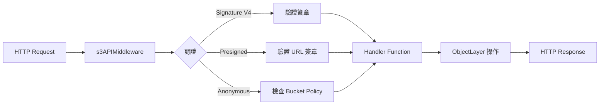
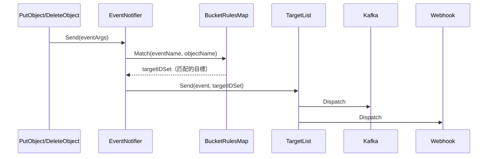

# MinIO — S3 API 與監控整合

::: info 相關章節
- 系統整體架構請參閱 [系統架構](./architecture)
- 物件讀寫流程請參閱 [物件讀寫完整流程](./object-lifecycle)
- 資料複製機制請參閱 [資料複製與同步](./data-replication)
- 資料修復機制請參閱 [資料修復與自癒機制](./healing)
:::

## 概述

MinIO 提供完整的 S3 相容 API、Prometheus 原生監控指標、事件通知系統以及 IAM 身份管理。本文深入分析這些整合層的實作。

## 1. S3 API Router

### 1.1 路由註冊

MinIO 使用 `gorilla/mux` 進行路由匹配，支援 **Virtual-hosted** 和 **Path-style** 兩種 S3 請求格式：

```go
// 檔案: cmd/api-router.go
func registerAPIRouter(router *mux.Router) {
    api := objectAPIHandlers{
        ObjectAPI: newObjectLayerFn,
    }

    apiRouter := router.PathPrefix(SlashSeparator).Subrouter()

    // Virtual-hosted style: bucket.minio:9000/object
    for _, domainName := range globalDomainNames {
        routers = append(routers,
            apiRouter.Host("{bucket:.+}."+domainName).Subrouter())
    }
    // Path-style: minio:9000/bucket/object
    routers = append(routers, apiRouter.PathPrefix("/{bucket}").Subrouter())
}
```

### 1.2 主要 S3 API 端點

| 操作 | HTTP Method | 路由 | Handler |
|------|-------------|------|---------|
| **GetObject** | GET | `/{object:.+}` | `GetObjectHandler` |
| **PutObject** | PUT | `/{object:.+}` | `PutObjectHandler` |
| **DeleteObject** | DELETE | `/{object:.+}` | `DeleteObjectHandler` |
| **HeadObject** | HEAD | `/{object:.+}` | `HeadObjectHandler` |
| **CopyObject** | PUT + `x-amz-copy-source` | `/{object:.+}` | `CopyObjectHandler` |
| **InitMultipartUpload** | POST | `/{object:.+}?uploads` | `NewMultipartUploadHandler` |
| **UploadPart** | PUT | `/{object:.+}?partNumber&uploadId` | `PutObjectPartHandler` |
| **CompleteMultipart** | POST | `/{object:.+}?uploadId` | `CompleteMultipartUploadHandler` |
| **ListObjects** | GET | `/` | `ListObjectsV2Handler` |
| **CreateBucket** | PUT | `/` | `PutBucketHandler` |
| **DeleteBucket** | DELETE | `/` | `DeleteBucketHandler` |

### 1.3 請求處理管線



`s3APIMiddleware` 包含以下處理步驟：
- HTTP trace 記錄
- Gzip 壓縮處理
- 請求節流（`maxClients` 限制並行請求數）
- API 統計資訊收集

## 2. Prometheus Metrics（V3）

### 2.1 指標架構

MinIO Metrics V3 使用分層路徑結構，所有指標暴露在 `/minio/metrics/v3` 端點下：

```go
// 檔案: cmd/metrics-v3.go
const (
    apiRequestsCollectorPath         collectorPath = "/api/requests"
    bucketAPICollectorPath           collectorPath = "/bucket/api"
    bucketReplicationCollectorPath   collectorPath = "/bucket/replication"
    systemNetworkInternodeCollectorPath collectorPath = "/system/network/internode"
    systemDriveCollectorPath         collectorPath = "/system/drive"
    systemMemoryCollectorPath        collectorPath = "/system/memory"
    systemCPUCollectorPath           collectorPath = "/system/cpu"
    systemProcessCollectorPath       collectorPath = "/system/process"
    clusterHealthCollectorPath       collectorPath = "/cluster/health"
    clusterUsageObjectsCollectorPath collectorPath = "/cluster/usage/objects"
    clusterUsageBucketsCollectorPath collectorPath = "/cluster/usage/buckets"
    clusterErasureSetCollectorPath   collectorPath = "/cluster/erasure-set"
    clusterIAMCollectorPath          collectorPath = "/cluster/iam"
    ilmCollectorPath                 collectorPath = "/ilm"
    auditCollectorPath               collectorPath = "/audit"
    replicationCollectorPath         collectorPath = "/replication"
    notificationCollectorPath        collectorPath = "/notification"
    scannerCollectorPath             collectorPath = "/scanner"
)
```

### 2.2 API 請求指標

```go
// 檔案: cmd/metrics-v3-api.go
const (
    apiRejectedAuthTotal      MetricName = "rejected_auth_total"
    apiRejectedHeaderTotal    MetricName = "rejected_header_total"
    apiRejectedTimestampTotal MetricName = "rejected_timestamp_total"
    apiRejectedInvalidTotal   MetricName = "rejected_invalid_total"
    apiRequestsWaitingTotal   MetricName = "waiting_total"
    apiRequestsIncomingTotal  MetricName = "incoming_total"
    apiRequestsInFlightTotal  MetricName = "inflight_total"
    apiRequestsTotal          MetricName = "total"
    apiRequestsErrorsTotal    MetricName = "errors_total"
    apiRequests5xxErrorsTotal MetricName = "5xx_errors_total"
    apiRequests4xxErrorsTotal MetricName = "4xx_errors_total"
    apiRequestsCanceledTotal  MetricName = "canceled_total"
)
```

### 2.3 指標分類總覽

| 類別 | 路徑 | 說明 |
|------|------|------|
| **API 請求** | `/api/requests` | 請求計數、錯誤率、TTFB、流量 |
| **Bucket API** | `/bucket/api` | 每個 bucket 的請求統計 |
| **Bucket Replication** | `/bucket/replication` | 每個 bucket 的複製狀態 |
| **System Drive** | `/system/drive` | 磁碟健康、讀寫延遲、可用空間 |
| **System Network** | `/system/network/internode` | 節點間網路流量 |
| **System Memory** | `/system/memory` | 記憶體使用量 |
| **System CPU** | `/system/cpu` | CPU 使用率 |
| **Cluster Health** | `/cluster/health` | 叢集整體健康狀態 |
| **Cluster Usage** | `/cluster/usage/objects` | 物件數量與大小統計 |
| **Erasure Set** | `/cluster/erasure-set` | Erasure Set 狀態與效能 |
| **ILM** | `/ilm` | 生命週期管理統計 |
| **Replication** | `/replication` | 全域複製指標 |
| **Scanner** | `/scanner` | 背景掃描器進度 |

::: tip 指標收集器架構
MinIO 的每個 `collectorPath` 對應一個 `MetricsGroup`，包含多個 `MetricDescriptor`（含名稱、型別、標籤定義）。使用 Prometheus `prometheus.Gatherer` 介面，能被標準 Prometheus scraper 拉取。
:::

## 3. 事件通知系統

### 3.1 EventNotifier 架構

```go
// 檔案: cmd/event-notification.go
type EventNotifier struct {
    sync.RWMutex
    targetList     *event.TargetList         // 所有通知目標
    bucketRulesMap map[string]event.RulesMap  // 每個 bucket 的規則映射
}
```

### 3.2 事件派發流程



```go
// 檔案: cmd/event-notification.go
func (evnot *EventNotifier) Send(args eventArgs) {
    targetIDSet := evnot.bucketRulesMap[args.BucketName].Match(args.EventName, args.Object.Name)
    if len(targetIDSet) == 0 {
        return
    }
    evnot.targetList.Send(args.ToEvent(true), targetIDSet,
        globalAPIConfig.isSyncEventsEnabled())
}
```

### 3.3 支援的通知目標

| 目標 | 檔案 | 說明 |
|------|------|------|
| **Kafka** | `internal/event/target/kafka.go` | 支援 SASL、TLS、壓縮、批次 |
| **AMQP** (RabbitMQ) | `internal/event/target/amqp.go` | Exchange、routing key、publisher confirms |
| **Redis** | `internal/event/target/redis.go` | Key-value 或 list 模式 |
| **NATS** | `internal/event/target/nats.go` | 支援 TLS 與認證 |
| **NSQ** | `internal/event/target/nsq.go` | Topic 模式 |
| **MQTT** | `internal/event/target/mqtt.go` | QoS 設定 |
| **Webhook** | `internal/event/target/webhook.go` | HTTP endpoint + mTLS |
| **PostgreSQL** | `internal/event/target/postgresql.go` | 直寫資料庫 |
| **MySQL** | `internal/event/target/mysql.go` | 直寫資料庫 |
| **Elasticsearch** | `internal/event/target/elasticsearch.go` | 索引寫入 |

### 3.4 事件結構

```go
// 檔案: internal/event/event.go
type Event struct {
    EventVersion string
    EventSource  string            // "minio:s3"
    EventName    string            // e.g. "s3:ObjectCreated:Put"
    EventTime    time.Time
    Bucket       Bucket
    Object       Object
    Source       Source
    UserMetadata map[string]string
    VersionID    string
}
```

## 4. IAM 身份管理

### 4.1 IAMSys 架構

```go
// 檔案: cmd/iam.go
type IAMSys struct {
    sync.Mutex
    iamRefreshInterval time.Duration
    // ...
}

type UsersSysType string
const (
    MinIOUsersSysType UsersSysType = "MinIOUsersSysType"
    LDAPUsersSysType  UsersSysType = "LDAPUsersSysType"
)
```

### 4.2 支援的身份來源

| 來源 | 說明 |
|------|------|
| **MinIO Internal** | 內建使用者系統，access key + secret key |
| **LDAP/Active Directory** | 外部 LDAP 認證整合 |
| **OpenID Connect** | OIDC 供應商（Keycloak、Auth0、Dex 等）|
| **STS (Security Token Service)** | 臨時安全憑證，支援 AssumeRole |

### 4.3 IAM 儲存後端

```go
// 檔案: cmd/iam.go
func (sys *IAMSys) initStore(objAPI ObjectLayer, etcdClient *etcd.Client) {
    if etcdClient != nil {
        // etcd 作為 IAM 儲存後端（分散式環境）
    } else {
        // 使用 ObjectLayer（MinIO 自身）作為 IAM 儲存後端
    }
}
```

| 後端 | 檔案 | 適用場景 |
|------|------|----------|
| **Object Store** | `cmd/iam-object-store.go` | 預設，IAM 資料存於 `.minio.sys/` |
| **etcd** | `cmd/iam-etcd-store.go` | 分散式環境，共享 IAM state |

## 5. 認證機制

MinIO 支援多種 AWS Signature 格式：

| 認證方式 | 說明 |
|----------|------|
| **Signature V4** | 標準 AWS Signature Version 4 |
| **Signature V2** | 舊版 AWS Signature Version 2 |
| **Presigned V4/V2** | URL 預簽章（限時有效） |
| **Chunked Streaming** | 分塊傳輸簽章（大檔案串流上傳） |
| **Anonymous** | 無認證，由 Bucket Policy 控制 |

## 6. 健康檢查

MinIO 提供多個健康檢查端點：

| 端點 | 用途 |
|------|------|
| `/minio/health/live` | Liveness — 程序是否存活 |
| `/minio/health/ready` | Readiness — 是否準備好接收請求 |
| `/minio/health/cluster` | Cluster — 叢集寫入是否可用 |
| `/minio/health/cluster/read` | Cluster Read — 叢集讀取是否可用 |

## 小結

| 整合面向 | 核心檔案 | 說明 |
|----------|----------|------|
| S3 API Router | `cmd/api-router.go` | mux 路由，支援 Virtual-hosted + Path-style |
| Prometheus Metrics | `cmd/metrics-v3*.go` (22 檔) | V3 分層指標，22 個 collector path |
| 事件通知 | `cmd/event-notification.go`, `internal/event/target/` | 10+ 通知目標，規則匹配派發 |
| IAM | `cmd/iam.go`, `cmd/iam-object-store.go` | 內建 + LDAP + OIDC + STS |
| 認證 | `cmd/signature-v4*.go`, `cmd/auth-handler.go` | AWS Signature V4/V2 + Presigned |

::: info 相關章節
- 系統整體架構請參閱 [系統架構](./architecture)
- 物件讀寫流程請參閱 [物件讀寫完整流程](./object-lifecycle)
- 資料複製機制請參閱 [資料複製與同步](./data-replication)
- 資料修復機制請參閱 [資料修復與自癒機制](./healing)
:::
