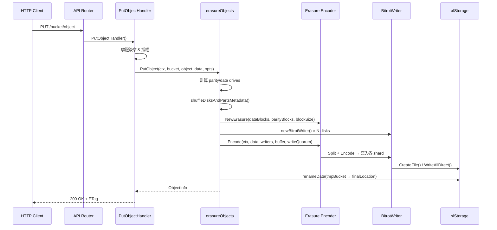
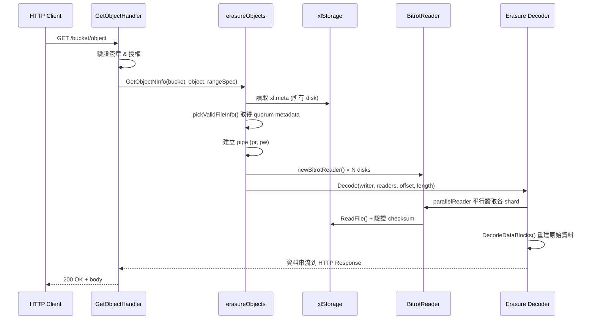
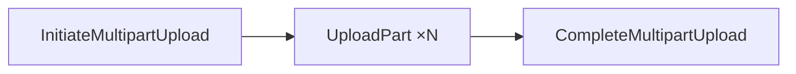
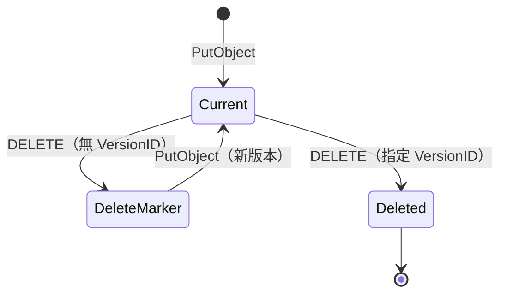

# MinIO — 物件讀寫完整流程

::: info 相關章節
- Erasure Coding 編解碼細節請參閱 [Erasure Coding 與資料分片](./erasure-coding)
- 底層磁碟操作細節請參閱 [底層硬碟讀寫機制](./disk-io)
- 資料修復流程請參閱 [資料修復與自癒機制](./healing)
- 系統整體架構請參閱 [系統架構](./architecture)
:::

## 概述

本文追蹤一個物件從 HTTP 請求進入 MinIO 到最終寫入磁碟（或從磁碟讀取回傳）的**完整呼叫鏈**，涵蓋 PutObject、GetObject、Multipart Upload、DeleteObject 以及 Versioning 機制。

## 1. PutObject 完整流程

### 1.1 整體呼叫鏈



### 1.2 HTTP Handler 層

HTTP 請求首先進入 `PutObjectHandler()`：

```go
// 檔案: cmd/object-handlers.go (行 1793)
func (api objectAPIHandlers) PutObjectHandler(w http.ResponseWriter, r *http.Request) {
    // 1. 提取 bucket, object
    // 2. 驗證 Content-Length ≤ 5TB
    // 3. 提取 metadata (Content-Type, Cache-Control, 等)
    // 4. 驗證 AWS Signature V4/V2
    // 5. 檢查 bucket policy 授權
    // 6. 呼叫 ObjectLayer.PutObject()
}
```

### 1.3 Erasure Layer — putObject()

`erasureObjects.putObject()` 是寫入的核心邏輯：

```go
// 檔案: cmd/erasure-object.go (行 1256)
func (er erasureObjects) putObject(ctx context.Context, bucket string, object string,
    r *PutObjReader, opts ObjectOptions) (objInfo ObjectInfo, err error) {
    data := r.Reader

    storageDisks := er.getDisks()

    // 根據 Storage Class 決定 parity drives
    parityDrives := globalStorageClass.GetParityForSC(userDefined[xhttp.AmzStorageClass])
    if parityDrives < 0 {
        parityDrives = er.defaultParityCount
    }

    dataDrives := len(storageDisks) - parityDrives

    // Write Quorum = dataDrives（若 data == parity 則 +1）
    writeQuorum := dataDrives
    if dataDrives == parityDrives {
        writeQuorum++
    }
    // ...
}
```

::: tip 可用性最佳化
當 `AvailabilityOptimized()` 開啟時，若偵測到離線磁碟，MinIO 會**自動提升 parity 數量**，確保寫入仍能成功。這意味著同一個 bucket 內的不同物件可能有不同的 erasure 配置。
:::

### 1.4 Erasure Encode

資料通過 `erasure.Encode()` 分片：

```go
// 檔案: cmd/erasure-encode.go (行 69)
func (e *Erasure) Encode(ctx context.Context, src io.Reader, writers []io.Writer,
    buf []byte, quorum int) (total int64, err error) {
    // 1. 從 src 讀取一個 blockSize 的資料到 buf
    // 2. EncodeData(buf) → Split + Reed-Solomon Encode
    // 3. 將 data shards + parity shards 平行寫入各 writer
    // 4. 檢查 write quorum — 至少 quorum 個 writer 成功
    // 5. 重複直到 EOF
}
```

### 1.5 Inline Data 最佳化

小物件（≤ 128 KiB）不寫入獨立的 part 檔案，而是內嵌在 `xl.meta` 中：

```go
// 檔案: cmd/erasure-object.go (行 1399)
if globalStorageClass.ShouldInline(erasure.ShardFileSize(data.ActualSize()), opts.Versioned) {
    inlineBuffers = make([]*bytes.Buffer, len(onlineDisks))
}
// 使用 newStreamingBitrotWriterBuffer() 寫入記憶體 buffer
// 最終 buffer 內容存入 partsMetadata[i].Data
```

### 1.6 原子寫入 — renameData

寫入先到臨時目錄，完成後原子 rename：

```go
// 檔案: cmd/erasure-object.go (行 1567)
onlineDisks, versions, oldDataDir, err := renameData(ctx, onlineDisks,
    minioMetaTmpBucket, tempObj, partsMetadata, bucket, object, writeQuorum)
// ...
err = er.commitRenameDataDir(ctx, bucket, object, oldDataDir, onlineDisks, writeQuorum)
```

這確保了**寫入的原子性** — 不會出現半寫入的物件。

## 2. GetObject 完整流程

### 2.1 整體呼叫鏈



### 2.2 GetObjectNInfo

```go
// 檔案: cmd/erasure-object.go (行 203)
func (er erasureObjects) GetObjectNInfo(ctx context.Context, bucket, object string,
    rs *HTTPRangeSpec, h http.Header, opts ObjectOptions) (gr *GetObjectReader, err error) {
    // 1. 取得 read lock（命名空間鎖）
    // 2. 從所有 disk 讀取 FileInfo（xl.meta）
    fi, metaArr, onlineDisks, err := er.getObjectFileInfo(ctx, bucket, object, opts, true)
    // 3. 檢查 delete marker
    // 4. 處理 0 byte 物件
    // 5. 建立 pipe — goroutine 中呼叫 getObjectWithFileInfo()
    pr, pw := xioutil.WaitPipe()
    go func() {
        pw.CloseWithError(er.getObjectWithFileInfo(ctx, bucket, object, off, length, pw, fi, metaArr, onlineDisks))
    }()
    // 6. 回傳 GetObjectReader（包含 pipe reader）
}
```

::: tip Lock-Free 讀取最佳化
對於 **inline data** 的物件，metadata 讀取後即可釋放鎖，因為資料已在記憶體中。大物件則在 goroutine 完成後才釋放鎖。
:::

### 2.3 Erasure Decode

```go
// 檔案: cmd/erasure-decode.go (行 239)
func (e Erasure) Decode(ctx context.Context, writer io.Writer, readers []io.ReaderAt,
    offset, length, totalLength int64, prefer []bool) (written int64, derr error) {
    // 1. 計算起始 block offset
    // 2. 建立 parallelReader（多 disk 平行讀取）
    // 3. 逐 block 讀取 → DecodeDataBlocks() 重建
    // 4. 寫入 writer（pipe writer → HTTP response）
}
```

## 3. Multipart Upload 流程

Multipart Upload 用於大檔案上傳，分為三個階段：



### 3.1 Initiate

```go
// 檔案: cmd/erasure-multipart.go (行 527)
func (er erasureObjects) NewMultipartUpload(ctx context.Context, bucket, object string,
    opts ObjectOptions) (*NewMultipartUploadResult, error) {
    // 產生 uploadID
    // 在 .minio.sys/multipart/bucket/object/uploadID/ 建立 metadata
}
```

### 3.2 Upload Part

```go
// 檔案: cmd/erasure-multipart.go (行 575)
func (er erasureObjects) PutObjectPart(ctx context.Context, bucket, object, uploadID string,
    partID int, r *PutObjReader, opts ObjectOptions) (pi PartInfo, err error) {
    // 每個 part 獨立進行 erasure encode
    // 寫入 .minio.sys/multipart/bucket/object/uploadID/part.N
    // 每個 part 有獨立的 data/parity shards
}
```

### 3.3 Complete

```go
// 檔案: cmd/erasure-multipart.go (行 1096)
func (er erasureObjects) CompleteMultipartUpload(ctx context.Context, bucket string,
    object string, uploadID string, parts []CompletePart, opts ObjectOptions) (oi ObjectInfo, err error) {
    // 1. 驗證所有 part 存在且 ETag 正確
    // 2. 合併 metadata — 計算總大小、產生合成 ETag
    // 3. rename 從 .minio.sys/multipart → 最終位置
    // 4. 清理 multipart 暫存
}
```

::: warning 注意
每個 part 最小 5 MB（除了最後一個），最大 5 GB。一個 multipart upload 最多 10,000 個 part。
:::

## 4. DeleteObject 流程

### 4.1 非版本化刪除

直接刪除物件的所有資料：

```go
// 檔案: cmd/erasure-object.go (行 1885)
func (er erasureObjects) DeleteObject(ctx context.Context, bucket, object string,
    opts ObjectOptions) (objInfo ObjectInfo, err error) {
    // 1. 取得 write lock
    // 2. 讀取現有 metadata
    // 3. 刪除所有 disk 上的 data directory
    // 4. 更新 xl.meta（移除版本）
}
```

### 4.2 版本化刪除

當 bucket 啟用 versioning 時，DELETE 只新增一個 **delete marker**：



- **不指定 VersionID**：新增 delete marker，原有版本保留
- **指定 VersionID**：永久刪除該特定版本

## 5. Versioning 機制

### 5.1 VersionID 產生

```go
// 檔案: cmd/erasure-object.go (行 1349)
fi.VersionID = opts.VersionID
if opts.Versioned && fi.VersionID == "" {
    fi.VersionID = mustGetUUID()
}
fi.DataDir = mustGetUUID()
```

每個版本有：
- **VersionID** — UUID，唯一識別該版本
- **DataDir** — UUID，指向實際資料目錄
- **ModTime** — 修改時間戳

### 5.2 多版本儲存

所有版本的 metadata 儲存在同一個 `xl.meta` 檔案中：

| 欄位 | 說明 |
|------|------|
| `VersionID` | 版本 UUID |
| `DataDir` | 資料目錄 UUID |
| `Type` | ObjectType / DeleteType |
| `ModTime` | 修改時間（Unix nanoseconds）|
| `Size` | 物件大小 |
| `ErasureM` | Data blocks 數量 |
| `ErasureN` | Parity blocks 數量 |

## 6. ILM（Information Lifecycle Management）

MinIO 支援 S3 相容的生命週期管理規則：

```go
// 檔案: internal/bucket/lifecycle/lifecycle.go
type Lifecycle struct {
    Rules          []Rule     // 最多 1000 條規則
    ExpiryUpdatedAt *time.Time
}

type Rule struct {
    ID         string
    Status     string      // "Enabled" / "Disabled"
    Filter     Filter      // Prefix + Tags 過濾
    Expiration Expiration  // 過期刪除
    Transition Transition  // 層級遷移
    NoncurrentVersionExpiration NoncurrentVersionExpiration
    NoncurrentVersionTransition NoncurrentVersionTransition
}
```

### 動作類型

| 動作 | 說明 |
|------|------|
| `DeleteAction` | 刪除當前版本 |
| `DeleteVersionAction` | 刪除特定歷史版本 |
| `TransitionAction` | 遷移到遠端儲存層（Tiering）|
| `DeleteAllVersionsAction` | 刪除所有版本 |

::: info 相關章節
- Erasure Coding 編解碼細節請參閱 [Erasure Coding 與資料分片](./erasure-coding)
- 底層磁碟操作細節請參閱 [底層硬碟讀寫機制](./disk-io)
- 資料修復流程請參閱 [資料修復與自癒機制](./healing)
- 複製同步機制請參閱 [資料複製與同步](./data-replication)
:::
